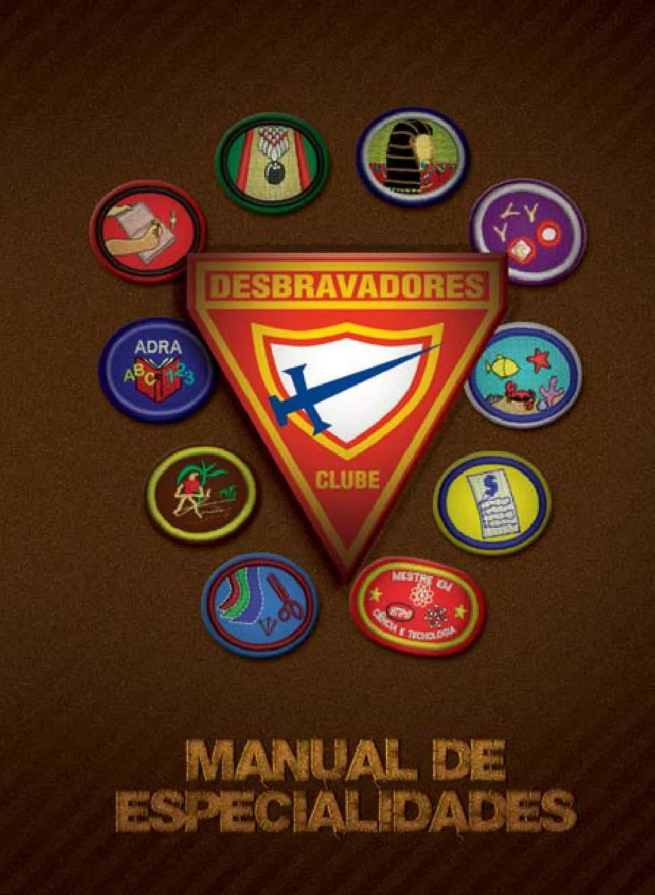

# Manual de Especialidades

## Expediente

### Diretores do Ministério Jovem

**DSA - Divisão Sul-Americana**\
Pr. Areli Barbosa

**UA - União Argentina**\
Pr. Carlos Campitelli

**UB - União Boliviana**\
Pr. Jimmy W. Lafuente

**UCB - União Central Brasileira**\
Pr. Ronaldo Arco

**UCh - União Chilena**\
Pr. David Victoriano

**UCOB - União Centro Oeste Brasileira**\
Pr. Nelson Milanelli

**UE - União Equatoriana**\
Pr. Juan Cancino

**UNB - União Norte Brasileira**\
Pr. Helbert R. Almeida

**UNeB - União Nordeste Brasileira**\
Pr. Sósthenes Andrade

**UNOB - União Noroeste Brasileira**\
Pr. Donato A. Filho

**UP - União Paraguai**\
Pr. Benjamín Belmonte

**UPN - União Peruana do Norte**\
Pr. Jaime Perez

**UPS - União Peruana do Sul**\
Pr. Javier Cahuana

**USB - União Sul-Brasileira**\
Pr. Elmar Borges

**USEB - União Sudoeste Brasileira**\
Pr. Ivay Araujo

**UU - União Uruguaia**\
Pr. Pablo Flor

### Edição

Ministério Jovem

Divisão Sul-Americana

### Revisão

Alberto Lázaro de Souza Junior; Aline Delgado Pinheiro Cavalcante; Carlos Francesco Marquina Vergara; Chrystian Toigo; Cosme de Oliveira; Diogo Periotto; Éveni Agustinho Silveira de Souza; Fabricio Branco de Cordova; Felipe Hebert Inácio de Oliveira; Flavio Xavier Azevedo de Oliveira; Franklin Moreira Figueiredo; Harley Souza Costa Burigatto; Jônatas Lessa da Silva; Katiano Alves da Silva; Marcos Eduardo Gomes de Lima (Zulu); Mateus Barros e Silva Campos; Newton Mendes Oliveira; Paulo Henrique da Silva Oliveira; Roberto Vital Corrêa; Zênia Moura.

### Colaboradores

Ademar Antunes do Amaral; Adriano Pires Francisco de Almeida; Aladim Barbosa Aguiar; Alice Silveira de Jesus Pereira; Ana Paula Rothstein Ramos de Lima; André Luiz Silva; André Roberto Gonçalves; Átila Venancio dos Santos; Anderson Sathler Ribeiro; André Jorge Marujo; Cássio Vital da Silva; Cristina Ferreira Correia Silva; Ed Wilson Santos; Elaine Santana de Souza; Emerson Mitzker; Enéas Ribeiro de Souza Lima Correa; Ericson Danese; Everton Belloli Moura; Fabiana Medeiros da Silva Carvalho; Gabriel Cheorlin; Gabriel Fonseca dos Santos; Gerson Ritter; Humberto Gomes da Silva Junior; Igor Medeiros Motta; Jackson Alexandre Custódio; Jonas Cardoso Bergamini; Leandro Spalato Torres; Lígia Pinheiro Paganini; Lilian Joyce dos Reis Corrêa; Liliane Medeiros Lopes; Lucas Mancilha Gondim; Luciano Junior Pedroso Nascimento; Luis Fernando dos Santos Pires; Márcia Maria Torrano Coelho; Maria Inez dos Santos Pereira; Ohana Yonara de Assis Costa; Oséias Araújo da Silva; Osni Dias Maciel; Regiane Hsu; Reinaldo Augusto Nunes; Reinaldo Delciello; Ricardo Peixoto; Robson Marques do Vale de Castro; Rodrigo Valério de Barros; Rossalles Freitas; Samuel Henrique Germano; Saulo Pereira; Silvio Dobelin; Thymóteo Duarte; Tobias Flores; Tseng Kan; União Central Brasileira.

### Supervisão

Pr. Areli Barbosa - DSA

### Secretária DSA

Tânia Fanti

### Insígnias

JLG Materiais

### Arte e diagramação

Felipe Montechezi

Anne Ferreira

### Projeto Gráfico

Editora Sobre Tudo Ltda.

Produtor Autorizado - DSA

## Introdução

Esta edição do Manual de Especialidades do Clube de Desbravadores representa o contínuo crescimento do Ministério de Desbravadores e Aventureiros da Igreja Adventista do Sétimo Dia e representa também a inovação da Divisão Sul-Americana em criar e coordenar um grupo de estudos, que permanentemente será o responsável pelo estudo das especialidades.

Após intenso trabalho, a Divisão Sul-Americana apresenta um manual de especialidades mais atualizado e completo, a fim de que os desbravadores tenham ainda mais possibilidades de crescimento. O manual passa de 259 especialidades e 12 mestrados da última edição (2001) para 475 especialidades e 15 mestrados. As especialidades estão agrupadas em 9 áreas, de acordo com a área do conhecimento em que estão inseridas, tendo, cada uma, cor de fundo característica:

- ADRA
- Artes e habilidades manuais
- Atividades agrícolas e afins
- Atividades missionárias e comunitárias
- Atividades profissionais
- Atividades recreativas
- Ciência e saúde
- Estudo da natureza
- Habilidades domésticas

O conceito original das especialidades foi projetado por uma comissão da Associação Geral em 1927. Primeiramente foram chamadas de méritos vocacionais. O primeiro manual que listava as exigências destas especialidades foi publicado em 1928, com 16 méritos vocacionais. Apesar de alguns requisitos ou nomes terem sido modificados, as especialidades originais permanecem até hoje.

Em virtude das constantes mudanças do mundo moderno, é intuito da Divisão Sul-Americana acompanhar esse crescimento e mudanças, aplicando os novos conceitos e conhecimentos adquiridos ao Clube de Desbravadores. O formato deste manual foi projetado para acompanhar esse ritmo. As especialidades estão agrupadas por ano de criação, destacando a sua origem.

> NOTA: O estudo das especialidades tem como finalidade auxiliar no desenvolvimento do indivíduo, proporcionando aos desbravadores e líderes uma forma atraente de aprender sobre o que os cercam, expandir seus horizontes e proporcionar novas aventuras. O propósito de todas elas é ajudar a pessoa a "crescer em sabedoria, estatura e graça diante de Deus e dos homens" (Lucas 2:52).

Todo o processo para a realização do programa das especialidades, incluindo o conhecimento da filosofia, o planejamento do currículo, a metodologia de ensino, as formas de avaliação e os critérios para a aquisição das insígnias é regido pelo Manual Administrativo do Clube de Desbravadores da Divisão Sul-Americana.

**Ministério de Desbravadores e Aventureiros**\
**Divisão Sul-Americana**\
**Ano 2013**\
[www.desbravadores.org.br](www.desbravadores.org.br)

## Filosofia das Especialidades dos Desbravadores

Cada especialidade é designada a ser o estudo de um conteúdo. Este conteúdo deve ter valor prático e destacar o estilo de vida da pessoa que possui esta especialidade. O estudo da especialidade deve ajudar a pessoa em seu desenvolvimento como um cristão íntegro ao afetar diretamente os aspectos social, emocional, físico e espiritual da vida. O estudo de uma especialidade deve levar a pessoa a um amor mais profundo ao Criador, e incentivá-la no compromisso com a salvação e serviço.

O estudo da especialidade ajuda no desenvolvimento espiritual do caráter da pessoa. Consequentemente, cada especialidade deve requerer alto nível de excelência nos requisitos a serem alcançados. Cumprir os requisitos deve ser interessante e divertido, proporcionando ao mesmo tempo um sentido de êxito à pessoa.

O estudo de uma especialidade deve proporcionar à pessoa uma maneira atrativa de aprender sobre seus arredores ou ampliar a exposição a novos horizontes ou aventuras. Tais tópicos de estudo podem incluir aprendizagem sobre hobbies, um interesse especial, ou ser apresentados a uma nova vocação. Cada especialidade deve estar designada a acomodar o grupo de estudo de uma reunião do clube, família, ou estudo individual por parte de uma pessoa altamente motivada. O conteúdo completo da especialidade deve ser capaz de completar-se em menos de três meses.

Como as especialidades dos Desbravadores fazem parte de um programa apoiado pela igreja, todas as facetas do estudo do curso devem estar em harmonia com os critérios básicos da igreja, evitando a agressão à natureza e ao próximo, ajudando-a assim a "crescer em sabedoria e estatura e em graça diante de Deus e dos homens".

## Orientações para participar no Programa de Especialidades dos Desbravadores

Os jovens adventistas prestam um valioso serviço à sociedade. Eles estão ao redor do mundo, usando suas habilidades, vocações e profissões para levar o "evangelho ao mundo nesta geração". Muitos jovens adventistas que atualmente são profissionais bem sucedidos pelo mundo todo, relembram ensinamentos aprendidos através das especialidades dos Desbravadores.

Deveríamos ser capazes de extrair da natureza lições que inspirarão e permitirão que outros sigam o exemplo de Jesus, o maior Mestre da natureza que este mundo já conheceu. Os adolescentes deveriam saber ensinar estes conceitos da Verdade para pessoas que estão sendo guiadas ao Salvador. Cada jovem deve estar preparado para responder ao chamado do Mestre em muitos campos de trabalho.

O Ministério de Desbravadores e Aventureiros, através das especialidades, ajuda-os a alcançarem competência em muitas áreas. Algumas vezes o estudo das especialidades leva à adoção de uma vocação ou ao menos um hobby útil. O princípio da especialidade é aliar a teoria com a prática. Recreação e aventura são as chaves para alcançar qualquer especialidade.

## Verificação para novas Especialidades de Desbravadores

Verificar se a especialidade, ou uma similar, já existe:

[Ministério Jovem da Conferência Geral](https://www.gcyouthministries.org/Ministries/Pathfinders/Honors/) e [Divisão Sul-Americana](http://desbravadores.org.br/)

Se encontrar alguma especialidade inexistente, por favor, cumpra as seguintes orientações:

1. Os requisitos da especialidade devem manter os níveis e a filosofia da Igreja Adventista do Sétimo Dia.
2. Os requisitos das especialidades devem incluir um equilíbrio de teoria e atividades "manuais".
3. Se possível, os requisitos devem ser desenvolvidos sobre dois níveis de estudo: Básico (idades 10 a 15) e Avançado (idades 16 ou mais). Possuir a especialidade básica deve ser o pré-requisito para se obter a especialidade avançada, em determinado tema.
4. Os requisitos devem ser para grupos ou para indivíduo.
5. Os requisitos devem ser cumpridos em menos de três meses. Esta é apenas uma regra geral, pois algumas especialidades (ex.: Atividades Profissionais) necessitam de mais tempo.
6. Os requisitos devem expor, de forma simples, exatamente o que deve ser realizado. 7. Os requisitos devem cuidar do nosso meio ambiente. Por exemplo, para evitar a destruição da vida animal ou vegetal, deve solicitar fotos ou desenhos em vez de coleções.
7. Os requisitos da atividade do tempo são escritos para evitar conflitos com os horários escolares ou de trabalho (ex.: um acampamento de quatro dias pode ser realizado em dois fins de semana).
8. Os requisitos devem ser realizados em um meio ambiente seguro e supervisionado, para não afetar a segurança de seus participantes.
9. Os requisitos devem estar de acordo com as leis ambientais do país.
10. Os requisitos devem ser traduzidos corretamente no idioma do país.

## Instruções para Completar a nova Especialidade

1. Fornecer todos os dados biográficos do autor.
2. Indicar o título proposto e a categoria para a nova especialidade.
3. Estabelecer o objetivo para a especialidade proposta.
4. Fazer um esboço do desenho da nova especialidade, indicando as cores. (Note: os desenhos da imagem não devem incluir mais de três cores de fundo).
5. Indicar o nível apropriado de dificuldade para a especialidade. Os níveis de dificuldade são os seguintes: Básico (10 - 15 anos) e Avançado (16 anos ou mais).
6. Enumerar as fontes específicas para completar os requisitos das especialidades. Tenha a certeza de enumerar: título, autor, editorial e direitos de autor para cada fonte.
7. Enumerar os materiais necessários para completar a especialidade e uma estimativa de seu custo por pessoa. Também calcular o tempo necessário para completar a Especialidade.
8. Enviar este material para o Diretor do Ministério de Desbravadores e Aventureiros da Divisão Sul Americana.

## Sumário

| Código | Nome                                                                                                                            |
| :----: | ------------------------------------------------------------------------------------------------------------------------------- |
|   AD   | [ADRA](../ADRA/ADRA.md)                                                                                                         |
|   HM   | [Artes e habilidades manuais](<../Artes e Habilidades Manuais/Artes e Habilidades Manuais.md>)                                  |
|   AA   | [Atividades agrícolas e afins](<../Atividades Agrícolas e Afins/Atividades Agrícolas e Afins.md>)                               |
|   AM   | [Atividades missionárias e comunitárias](<../Atividades Missionárias e Comunitárias/Atividades Missionárias e Comunitárias.md>) |
|   AP   | [Atividades profissionais](<../Atividades Profissionais/Atividades Profissionais.md>)                                           |
|   AR   | [Atividades recreativas](<../Atividades Recreativas/Atividades Recreativas.md>)                                                 |
|   CS   | [Ciência e saúde](<../Ciência e Saúde/Ciência e Saúde.md>)                                                                      |
|   EN   | [Estudo da natureza](<../Estudo da Natureza/Estudo da Natureza.md>)                                                             |
|   HD   | [Habilidades domésticas](<../Habilidades Domésticas/Habilidades Domésticas.md>)                                                 |
|   ME   | [Mestrados](../Mestrados/Mestrados.md)                                                                                          |
