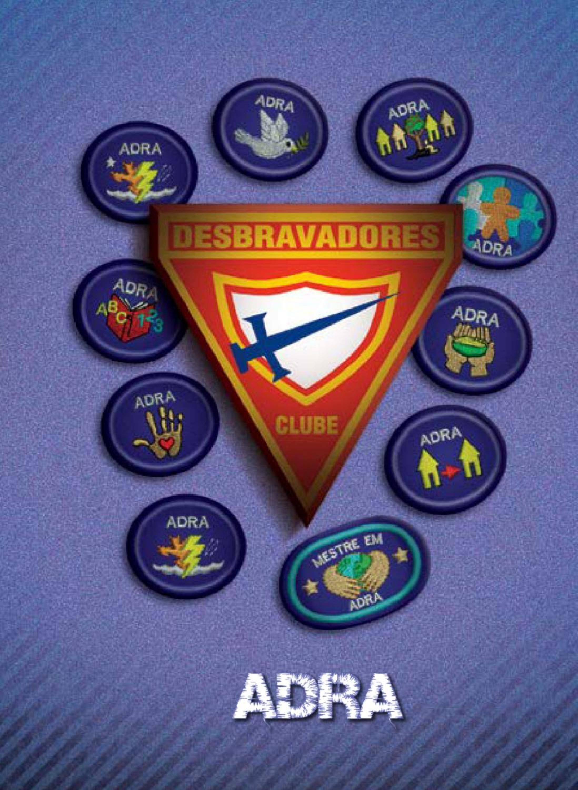
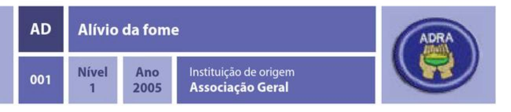
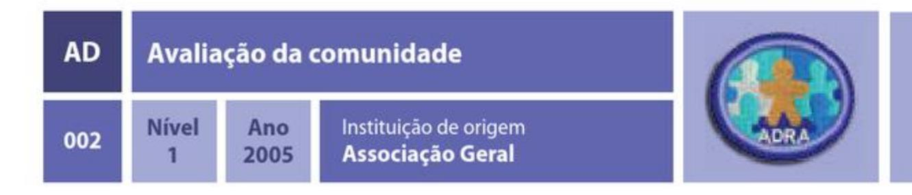
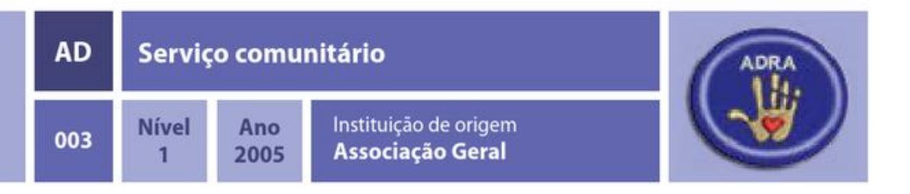
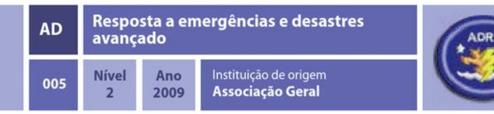
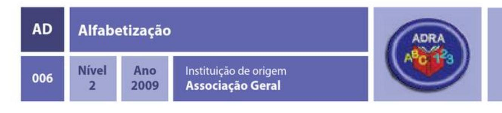
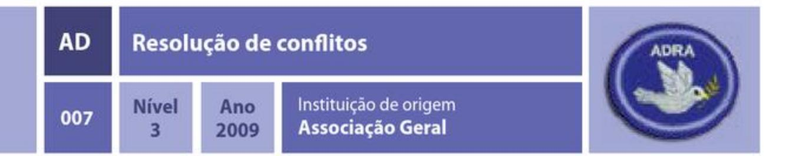
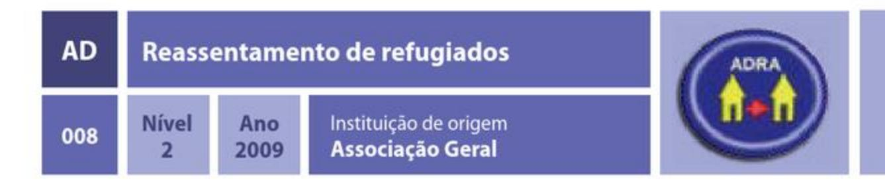
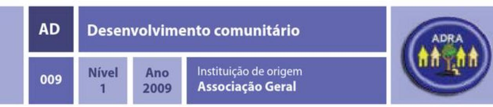

# ADRA

| Especialidade                                                                               | Ano  | Código | Número |
| ------------------------------------------------------------------------------------------- | ---- | ------ | ------ |
| [Alívio da fome](#alívio-da-fome)                                                           | 2005 | AD     | 001    |
| [Avaliação da comunidade](#avaliação-da-comunidade)                                         | 2005 | AD     | 002    |
| [Serviço comunitário](#serviço-comunitário)                                                 | 2005 | AD     | 003    |
| [Resposta a emergências e desastres](#resposta-a-emergências-e-desastres)                   | 2005 | AD     | 004    |
| [Resposta a emergências e desastres avançado](#resposta-a-emergências-e-desastres-avançado) | 2009 | AD     | 005    |
| [Alfabetização](#alfabetização)                                                             | 2009 | AD     | 006    |
| [Resolução de conflitos](#resolução-de-conflitos)                                           | 2009 | AD     | 007    |
| [Reassentamento de refugiados](#reassentamento-de-refugiados)                               | 2009 | AD     | 008    |
| [Desenvolvimento comunitário](#desenvolvimento-comunitário)                                 | 2009 | AD     | 009    |

## Alívio da fome

### REQUISITOS

1. Assistir a uma reportagem referente ao tema da fome no mundo e discutir com a sua unidade do Clube de Desbravadores os passos que estão sendo tomados para reduzi-la.
2. Entrevistar uma pessoa que conduz distribuição de alimentos em sua área. Pode ser o líder da ASA de sua igreja, de outra igreja, ou de um centro / restaurante comunitário. Pergunte-lhe sobre que tipo de pessoas são atendidas, o que as levam a necessitarem de alimento e como essas necessidades estão sendo satisfeitas. Fazer anotações durante a entrevista e compartilhar os resultados com seu instrutor.
3. Descrever as causas da fome em seu país. Você poderá fazer isso através de uma redação (com, pelo menos, 500 palavras), uma apresentação audiovisual (de, pelo menos, 10 minutos), uma encenação ou produzindo um vídeo de cerca de 1 minuto.
4. Fazer uma coleta de itens alimentícios para a ASA da sua igreja, de outra igreja, ou centro / restaurante comunitário ou, se isso não for possível, escolher uma família que precisa de assistência e lhe entregar os itens coletados.
    > Obs.: A sugestão é que sejam arrecadados pelo menos 50 alimentos não perecíveis. Devese prestar muita atenção ao prazo de validade dos produtos coletados. Produtos com prazo de validade expirado ou com indício de deterioração, como lata estufada, caruncho nas farinhas e feijões, mofo no arroz, etc., não devem ser coletados. Também devem ser levados em consideração os costumes de cada país ou região. Produtos desconhecidos ou que não fazem parte da alimentação do dia a dia tendem a ser mal utilizados ou não utilizados.
5. Visitar um banco de alimentos, um centro de distribuição de alimentos ou um restaurante ou cozinha comunitária e dispor-se como voluntário para ajudar o pessoal que trabalha no estabelecimento. Conversar com eles para saber como os alimentos são obtidos e quais são alguns dos desafios para consegui-los, armazená-los e distribuílos. Este requisito poderá ser feito apenas pela sua unidade ou com todo o Clube de Desbravadores.

## Avaliação da comunidade

### REQUISITOS

1. Selecionar uma comunidade ou área urbana com a qual esteja familiarizado e descrever, da melhor forma possível, as seguintes informações:
   1. Localização em um mapa
   2. Demografia (nº de habitantes, de preferência distribuídos por sexo e idade)
   3. Condições socioeconômicas
   4. Ocupações laborais mais comuns
   5. Acesso à rede educacional e de saúde
   6. Nível de educação
   7. Nível de segurança
   8. Outros dados que achar relevantes
2. Listar as necessidades que você vê em sua comunidade. Isso pode incluir melhor apoio a famílias de baixa renda, assistência a idosos que vivem sozinhos, melhora na limpeza das áreas públicas, etc.
3. Entrevistar um líder comunitário, professor, pastor de igreja ou oficial de polícia para saber como pessoas como você poderiam exercer impacto positivo em tal comunidade ou área. Fazer anotações.
4. Preparar um relatório para o seu Clube de Desbravadores apresentando suas descobertas e descrever o que você aprendeu especificamente a respeito da comunidade ou área que escolheu. Seja criativo.
5. Descrever as melhorias mais importantes necessárias à sua comunidade e o que você pode fazer para ajudar.

## Serviço comunitário

### REQUISITOS

1. Ler os seguintes textos bíblicos e explicar o que eles ensinam a respeito do papel que Deus espera que cada cristão desempenhe para satisfazer as necessidades dos pobres e sofredores na comunidade.
   1. Isaías 58:3-12
   2. Lucas 10: 25-37
   3. Mateus 25:31-46
2. Explique o seguinte ao seu instrutor:
   1. Qual é o significado do acrônimo ADRA? Apresentar uma breve explanação do que cada letra representa e explicar a diferença entre "assistência" e "desenvolvimento".
   2. Qual o nome do serviço social prestado pela Igreja Adventista local que ajuda os pobres e sofredores em seu entorno? Que tipos de serviços ele provê?
3. Reunir-se com o líder da Ação Solidária Adventista em sua área e perguntar a respeito dos projetos que sua unidade ou Clube de Desbravadores pode ajudar para satisfazer às necessidades da comunidade local.
4. Planejar um projeto de serviço comunitário com a unidade ou Clube de Desbravadores e concluí-lo. Este projeto deve focar certas necessidades que sua comunidade apresenta. O tempo total, desde o planejamento até sua realização, deve ser de aproximadamente 10 horas.

## Resposta a emergências e desastres

### REQUISITOS

1. Explicar os tipos de danos mais prováveis de ocorrer às casas, indivíduos e comunidades diante dos principais tipos de emergências e desastres e indicar em qual parte do mundo eles ocorrem com mais frequência:
   1. Ciclones (furações e tufões)
   2. Tornados
   3. Inundações
   4. Terremotos
   5. Tsunamis
   6. Incêndios
   7. Guerras / conflitos ou guerras civis
2. Descrever brevemente os tipos de serviços prestados pela ADRA ou por outros órgãos de resposta a emergências e desastres locais aos sobreviventes de tais eventos em seu país.
3. Ler um jornal ou notícias da ADRA referente a emergências e desastres recentes e discutir quais são algumas coisas importantes a se ter em mente ao responder a uma situação dessas.
4. Explicar o que significa cada letra do acrônimo da ADRA e descreva o papel dela na resposta a emergências e desastres.
5. Descrever, pelo menos, uma destas organizações de resposta a emergências e desastres e como ela pode trabalhar com a ADRA durante tais situações.
   1. Cruz Vermelha / Comitê Internacional da Cruz Vermelha (CICV)
   2. Ação Solidária Adventista (ASA)
   3. Alto Comissário das Nações Unidas para Refugiados ACNUR
   4. Programa Alimentar Mundial (PAM)
6. Explicar o papel do governo diante da ocorrência de uma emergência ou desastre e identificar a agência governamental chave em seu país que administra a resposta em tais situações.
7. Descobrir na Bíblia um texto que possa ser usado para confortar e animar um indivíduo da sua idade e do mesmo sexo, que experimentou perda total de sua casa, e dizer-lhe porque você escolheu esse texto".

## Resposta a emergências e desastres avançado

1. Ter a especialidade de Resposta a emergências e desastres.
2. Descrever as causas subjacentes de cada um desses cenários de desastres e dar um exemplo recente de, pelo menos, 6 desastres e seu impacto na comunidade ou país. Destacar, pelo menos, um no qual a ADRA respondeu.
   1. Ciclones (furações e tufões)
   2. Tornados
   3. Enchentes / Inundações
   4. secas
   5. Tsunamis
   6. Incêndios
   7. Guerras / conflitos ou guerras civis
   8. erupções vulcânicas.
3. As 4 fases na gestão de emergências e desastres são: Prevenção / Mitigação, Preparo, Resposta e Recuperação. Em suas palavras, descrever para o seu instrutor o que cada um desses termos significa e porque são importantes.
4. O preparo é chave durante uma emergência ou desastre. Se você fosse construir um kit para tais circunstâncias, descrever para o seu instrutor quais itens seriam incluídos. Discutir as vantagens de escolher itens movidos à bateria e não à eletricidade, e alimentos não perecíveis em vez de perecíveis.
5. Desenhar a planta do local onde você vive. Pensar no que faria em 3 dos desastres relacionadas na questão 1. Traçar uma rota de fuga de sua casa e discuti-la com seu instrutor e família.
6. Encontrar 3 histórias na Bíblia que envolveram desastres naturais ou emergências políticas. Coloque-se no lugar das pessoas da história e descrever como esses eventos o afetariam. Ainda, brevemente, discutir como as pessoas nas histórias sobreviveram a essas situações.
7. Apresentar um breve relatório para o seu Clube de Desbravadores a respeito do que você aprendeu sobre emergências e desastres e de estar preparado para agir nessas circunstâncias. Você pode fazer uma apresentação, encenação, mostrar um breve vídeo ou outro método que melhor transmita o que você aprendeu.

## Alfabetização

### REQUISITOS

1. Definir o termo alfabetização.
2. Pesquisar e descrever com brevidade como 2 ou 3 organizações em sua comunidade ou país promovem a alfabetização ou proveem serviços de alfabetização a crianças e adultos.
3. Escrever um parágrafo explicando porque a alfabetização é importante.
4. Realizar 3 das seguintes atividades:
   1. Ajudar alguém a ler um pequeno livro ou uma breve história.
   2. Ler uma pequena história para um grupo de crianças e discutir com elas posteriormente.
   3. Fazer 10 cartelas de material pedagógico com palavras simples e ilustrações ou fotos e passá-las a alguém que esteja aprendendo a ler.
   4. Ler vários capítulos da Bíblia para uma pessoa idosa que você saiba que é cega ou incapaz de ler. Isso pode ser feito em uma ou várias visitas.
   5. Fazer uma apresentação de 5 minutos em sua escola, Escola Sabatina ou igreja, sobre o que você aprendeu sobre alfabetização.
5. Escolher 3 palavras e explicar ao seu instrutor como você ensinaria alguém sobre o significado das palavras e como soletrá-las.

## Resolução de conflitos

> NOTA: É requerida a presença de um adulto mediador para a discussão de grupo.

1. Explicar como Cristo encorajou pessoas em conflito nas seguintes histórias bíblicas. Identificar a natureza do conflito ou as necessidades humanas em cada história por você explicada.
   1. João 8:1-11 (Maria Madalena)
   2. Mateus 18:1-6 (Discípulos - o maior no reino dos Céus)
   3. 1 Reis 3:16-28 (Salomão e a causa de 2 mulheres)
2. Discutir os conflitos de relacionamento, de identidade, raciais e culturais enfrentados pelos adolescentes e jovens em sua comunidade (Ex.: Relacionamento com os pais, autoestima, amizades).
3. Descrever os tipos de necessidades humanas e apresentar um exemplo da vida real para cada um deles.
4. O que significa ouvir ativamente? Pratique o ouvir ativo encenando os conflitos relacionados no item número 2.
5. Aplicar o seguinte método de resolução de conflito em um exemplo do item número 2.
   1. Montar o cenário
   2. Reunir informações
   3. Identificar o problema
   4. Pensar nas soluções
   5. Negociar uma solução
6. Explicar como fazer encaminhamento a um conselheiro profissional ou pastor.
7. Discutir seus motivos para querer ajudar seus amigos quando enfrentam problemas. O que dizer de uma pessoa que não lhe é tão familiar?

## Reassentamento de refugiados

### REQUISITOS

1. Descrever algumas causas gerais porque as pessoas se deslocam para outros países como refugiados. Definir também os termos refugiado, deslocado interno e imigrante e explicar como essas palavras são semelhantes ou diferentes.
2. Listar as necessidades imediatas que um refugiado pode ter quando chega a um novo país. Descrever como você se sentiria se subitamente tivesse que enfrentar uma nova língua, cultura e ambiente.
3. Descobrir que organizações em sua comunidade, país ou no mundo ajudam os refugiados e deslocados internos. Pesquisar sobre o trabalho que eles realizam.
4. Descrever em poucas palavras como você poderia ajudar um refugiado ou um deslocado interno em sua comunidade.
5. Perguntar a uma pessoa de outro país, que vive em sua comunidade, como ela se ajustou ao novo ambiente. Peça-lhe que descreva os desafios e contrastes que experimentou durante o processo de adaptação à comunidade.
6. Fazer um breve relatório para o seu Clube de Desbravadores, igreja, escola ou para um grupo cívico, sobre o que você aprendeu sobre refugiados e deslocados internos e que desafios eles enfrentam. Você pode levar a efeito este requisito através de uma apresentação audiovisual, encenação, vídeo ou qualquer outra forma que melhor transmita suas descobertas. Discutir porque é importante estar atento à situação dos refugiados e tentar encontrar soluções para esse problema.

## Desenvolvimento comunitário

1. Definir desenvolvimento comunitário.
2. Explicar ao seu instrutor porque alguns países são considerados desenvolvidos enquanto outros são chamados de países em desenvolvimento.
3. Mencionar 5 países em desenvolvimento e listar 3 ações que a ADRA realiza neles e que poderiam ser consideradas ações de desenvolvimento e 2 que se caracterizam como ações assistenciais.
4. Ler a respeito de porque existem pobres entre nós no livro O Desejado de Todas as Nações, de Ellen G. White, capítulo 70 - "Um Destes Meus Pequeninos Irmãos". Descrever ao seu instrutor o que você aprendeu.
5. Descrever, pelo menos, uma necessidade em seu bairro ou município que requeira atenção.
6. Escrever um breve plano de desenvolvimento comunitário que pode ser implementado por seu Clube de Desbravadores (plantio de árvores, limpeza de parques e ruas, pintura de muros, etc.). O plano deve descrever a atividade, o tamanho do grupo, a logística de transporte e materiais e o tempo para completar tal atividade.
7. Participar por, pelo menos, 4 horas em uma das seguintes atividades:
   1. O desbravador deverá contatar a Ação Solidária Adventista (ASA) de sua igreja e ver em que poderá ajudar. Talvez seja organizando itens doados ou participando de algum projeto por ela já estabelecido. Poderá envolver-se com a coleta e distribuição de alimentos, cobertores, agasalhos, sapatos e outros bens para moradores de rua ou para famílias cadastradas pela ASA. Ainda, poderá apoiar na reparação ou construção de casas para pessoas carentes.
   2. O desbravador deverá contatar a ADRA para ver a possibilidade de envolver-se como voluntário em algum projeto que esteja sendo implementado no seu bairro ou município.
   3. O desbravador deverá envolver-se com um "Mutirão Social". O alvo deste tipo de mutirão é proporcionar à população menos favorecida acesso a certos serviços de forma gratuita. Alguns destes serviços são: corte de cabelo, testes rápidos para identificar doenças como sífilis, hepatite e AIDS, aferição de pressão arterial, orientações de saúde e nutrição, palestras educativas sobre como economizar energia e gás, recreação infantil, emissão de documento como carteira de trabalho, encaminhamento para vagas de empregos, entre outros. O mutirão pode ser feito no pátio da igreja, num centro comunitário, num ginásio de esportes ou outro local sugerido e autorizado pelas autoridades locais.
   4. O desbravador deverá procurar saber o que sua igreja, outras igrejas, o governo ou organizações comunitárias estão fazendo pelos moradores de rua. Caso a comunidade já tenha esse programa, você poderá unir-se a ele.
