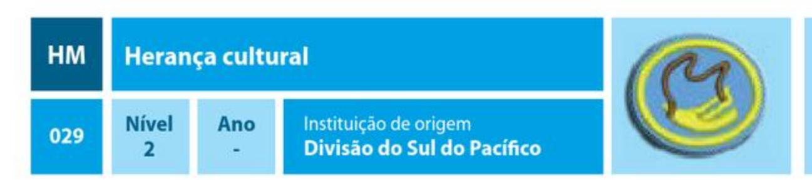
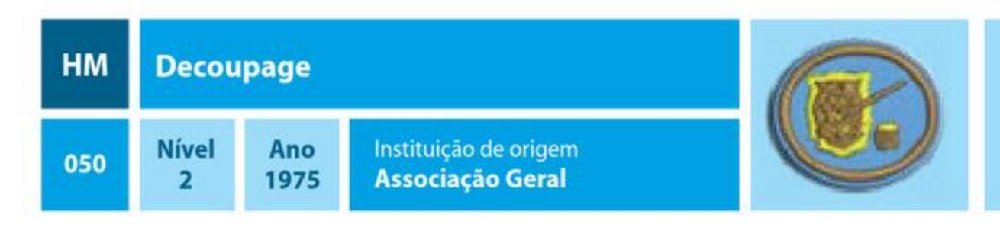

| Especialidade                              |  Ano  | Código | Número |
| ------------------------------------------ | :---: | :----: | :----: |
| Automodelismo                              | 1928  |   HM   |  001   |
| Trabalhos com agulha                       | 1928  |   HM   |  002   |
| Desenho e pintura                          | 1929  |   HM   |  003   |
| Música - básico                            | 1929  |   HM   |  004   |
| Música - intermediário                     |  --   |   HM   |  005   |
| Música - avançado                          |  --   |   HM   |  006   |
| Letreiros e cartazes                       | 1933  |   HM   |  007   |
| Cestaria                                   | 1937  |   HM   |  008   |
| Trabalhos em metal                         | 1937  |   HM   |  009   |
| Arte de oleiro                             | 1938  |   HM   |  010   |
| Entalhe em madeira                         | 1938  |   HM   |  011   |
| Ornamentação com flores                    | 1938  |   HM   |  012   |
| Pintura em vidro                           | 1938  |   HM   |  013   |
| Tecelagem                                  | 1938  |   HM   |  014   |
| Trabalhos em madeira                       | 1938  |   HM   |  015   |
| Aeromodelismo                              | 1944  |   HM   |  016   |
| Cultura indígena                           | 1944  |   HM   |  017   |
| Escultura                                  | 1945  |   HM   |  018   |
| Xilogravura                                | 1945  |   HM   |  019   |
| Cerâmica                                   | 1956  |   HM   |  020   |
| Pintura em tecido                          | 1956  |   HM   |  021   |
| Trabalhos em feltro                        | 1956  |   HM   |  022   |
| Trabalhos em acrílico                      | 1961  |   HM   |  023   |
| Modelagem e fabricação de sabão            | 1964  |   HM   |  024   |
| Modelagem e fabricação de sabão - avançado | 1964  |   HM   |  025   |
| Arte de fazer esteiras                     |  --   |   HM   |  026   |
| Construção nativa                          |  --   |   HM   |  027   |
| Ferreomodelismo                            | 1967  |   HM   |  028   |
| Herança cultural                           |  --   |   HM   |  029   |
| Lapidação                                  | 1967  |   HM   |  030   |
| Modelagem em gesso                         | 1967  |   HM   |  031   |
| Trabalhos em couro                         | 1967  |   HM   |  032   |
| Crochê                                     | 1970  |   HM   |  033   |
| Crochê - avançado                          | 1970  |   HM   |  034   |
| Espaçomodelismo                            | 1970  |   HM   |  035   |
| Espaçomodelismo - avançado                 | 1970  |   HM   |  036   |
| Tricô                                      | 1970  |   HM   |  037   |
| Tricô - avançado                           | 1970  |   HM   |  038   |
| Trabalhos em vidro                         | 1970  |   HM   |  039   |
| Arte de trançar                            | 1972  |   HM   |  040   |
| Arte de trançar - avançado                 | 1972  |   HM   |  041   |
| Decoração de bolos                         | 1972  |   HM   |  042   |
| Esmaltado em cobre                         | 1972  |   HM   |  043   |
| Esmaltado em cobre - avançado              | 1972  |   HM   |  044   |
| Estofamento                                |  --   |   HM   |  045   |
| Fabricação de velas                        | 1972  |   HM   |  046   |
| Serigrafia                                 | 1974  |   HM   |  047   |
| Serigrafia - avançado                      | 1974  |   HM   |  048   |
| Arte com barbante                          | 1975  |   HM   |  049   |
| Decoupage                                  | 1975  |   HM   |  050   |
| Macramê                                    | 1975  |   HM   |  051   |
| Telhados                                   |  --   |   HM   |  052   |
| Cultura Indígena - avançado                | 1976  |   HM   |  053   |
| Bordado em ponto cruz                      | 1976  |   HM   |  054   |
| Biscuit                                    | 1976  |   HM   |  055   |
| Patchwork                                  | 1976  |   HM   |  056   |
| Nautimodelismo                             | 1977  |   HM   |  057   |
| Trabalhos em couro - avançado              | 1977  |   HM   |  058   |
| Gravuras em vidro                          | 1997  |   HM   |  059   |
| Origami                                    | 1997  |   HM   |  060   |
| Corrida de carrinhos de madeira            | 1999  |   HM   |  061   |
| Corrida de carrinhos de madeira - avançado | 1999  |   HM   |  062   |
| Scrapbooking                               | 2004  |   HM   |  063   |
| Scrapbooking - avançado                    | 2004  |   HM   |  064   |
| Fotografia digital                         | 2006  |   HM   |  065   |
| Genealogia                                 | 2006  |   HM   |  066   |
| Plástico canvas                            | 2006  |   HM   |  067   |
| Quilling                                   | 2006  |   HM   |  068   |
| Quilling - avançado                        | 2006  |   HM   |  069   |
| Tie-dye                                    | 2006  |   HM   |  070   |
| Apitos                                     | 2007  |   HM   |  071   |
| Apitos - avançado                          | 2007  |   HM   |  072   |
| Faróis                                     | 2007  |   HM   |  073   |
| Faróis - avançado                          | 2007  |   HM   |  074   |
| Balões de ar quente                        | 2008  |   HM   |  075   |
| Origami - avançado                         | 2012  |   HM   |  076   |
| Embalagem                                  | 2012  |   HM   |  077   |
| E.V.A.                                     | 2012  |   HM   |  078   |
| Desenho vetorial                           | 2012  |   HM   |  079   |
| Fuxico                                     | 2012  |   HM   |  080   |
| História em quadrinhos                     | 2012  |   HM   |  081   |
| Ornamentação                               | 2012  |   HM   |  082   |
| Papercraft                                 | 2012  |   HM   |  083   |
| Papel machê                                |  --   |   HM   |  084   |
| Pirografia                                 | 2012  |   HM   |  085   |
| Plastimodelismo                            | 2012  |   HM   |  086   |
| Violão                                     | 2012  |   HM   |  087   |
| Violão - avançado                          | 2012  |   HM   |  088   |

## Automodelismo

### REQUISITOS

1. Construir, pelo menos, um modelo de carro de plástico, a partir de um kit. O carro deve seguir, tanto quanto possível, o padrão original.
2. Escolha um:
   1. Construir um segundo modelo usando acessórios opcionais incluídos no kit, ou criar alterações usando massa de vidraceiro e/ou partes de outros kits. (Decalques não contam.) Pintar o modelo.
   2. Construir um modelo de corrida de acordo com as normas do Campeonato de Automodelismo e participar de uma corrida.
3. Escrever ou apresentar oralmente a história do automóvel. Não deixar de incluir passos interessantes no processo de desenvolvimento, como, por exemplo, tamanho dos motores, transmissão automática, volantes, controles computadorizados, etc.

## Trabalhos com agulha

### REQUISITOS

1. Apresentar artigos que tenham sido feitos por você usando os pontos a seguir:
   1. Ponto contorno
   2. Ponto margarida
   3. Ponto corrente (correntinha ou ponto cadeia)
   4. Ponto-cruz
   5. Bordado richelieu
   6. Ponto cheio
   7. Chuleio (chuleado)
   8. Nó francês
   9. Ponto caseado
   10. Ponto pena
   11. Ponto atrás
   12. Ponto espinha de peixe ou ponto folha
   13. Ponto matiz
   14. Ponto vagonite
2. Fazer duas das seguintes atividades:
    1. Bordar um dos itens a seguir: par de fronhas, pano de prato, ou outro artigo equivalente.
    2. Fazer uma capa de almofada
    3. Bordar um jogo de cozinha
    4. Fazer uma toalha ou caminho de mesa
    5. Fazer um artigo usando qualquer um dos métodos a seguir:
         * Patchwork
         * Franzido casa de abelha
         * Richelieu
         * Ponto russo
3. Quais são os tipos de renda mais comuns em sua região e quais os cuidados de conservação de cada uma delas?
4. Descrever um método satisfatório de manter seus utensílios para bordar em boas condições.
5. Explicar quais são os cuidados necessários com as peças bordadas em relação à limpeza e conservação.
6. Quais são os tipos de tecido mais adequados para se fazer os seguintes trabalhos:
   1. Bordado richelieu
   2. Franzido casa de abelha
   3. Patchwork
   4. Ponto russo
   5. Ponto cruz
   6. Ponto vagonite
   7. Ponto matiz
7. Demonstrar como engomar e passar corretamente um artigo bordado.

## Desenho e pintura

### REQUISITOS

1. Fazer e apresentar um desenho à mão de um animal, demonstrando a distribuição equilibrada das cores.
2. Desenhar um objeto cilíndrico e outro retangular juntos, demonstrando perspectiva e equilíbrio de luz e sombras.
3. Preparar e apresentar um desenho de alguma paisagem da natureza que haja perto de sua casa.
4. Fazer, em cores, um desenho decorativo, usando qualquer técnica e motivo. Mencionar o uso que pretende dar para ele.
5. Pintar um "tapete" de flores, ou de folhas, caídas no chão demonstrando riqueza de cores e detalhes.
6. Pintar uma cena ao ar livre em aquarela ou óleo.
7. Organizar uma exposição dos trabalhos feitos no decorrer desta especialidade no Clube, Escola ou Igreja. Convidar os pais e apoiadores do Clube e presenteá-los com algum dos desenhos produzidos.

## Música - básico

### REQUISITOS

> NOTA: Necessário acompanhamento de instrutor músico.

1. Qual a definição básica de música?
2. Explicar o que é harmonia, melodia e ritmo.
3. O que é Clave? Escrever uma escala completa (de Dó a Dó, por exemplo) nas claves de Sol, Fá e Dó.
4. Definir o que é timbre, altura, duração e intensidade de um som.
5. Saber o que significa a palavra "Intervalo" na música. Explicar o seguinte: a) Um intervalo de meio tom
   1. Um intervalo de um tom
   2. Um intervalo de uma terça
   3. Um intervalo de uma quinta
   4. Um intervalo de uma oitava
6. Conhecer os tons e semitons naturais. Com auxílio de uma partitura, ser capaz de reconhecer as notas de um verso ou coro de um hino da sua Igreja.
7. Definir o que é uma orquestra e citar, pelo menos, 2 instrumentos de cada classe de instrumentos usados em uma orquestra (Cordas, madeiras, metais, percussão e teclas). 8. Tocar ou cantar, com ou sem auxílio de partitura, um hino de sua igreja ou música sacra e apresentar satisfatoriamente para um grupo de pessoas.
8. Fazer um resumo bibliográfico de um famoso compositor de hinos e apresente em forma de palestra para um grupo de pessoas.

## Música - intermediário

> NOTA: Necessário acompanhamento de instrutor músico.

1. Ter a especialidade de Música - básico.
2. Tocar ou cantar um escala e citar todas as notas de sua composição.
3. O que é Semibreve? Mínima? Colcheia? Desenhar cada um dos símbolos.
4. Saber a diferença entre música sacra e secular e citar um grande compositor musical de cada tipo de música.
5. Saber o que é o compasso de uma música. Ser capaz de diferenciar uma marcha de uma valsa e dar o compasso de cada uma delas.
6. Citar 5 grandes compositores de música erudita e, pelo menos, uma composição de cada um deles, incluindo um oratório, uma peça para piano e uma canção.
7. Tocar, com ou sem ajuda de um livro de partitura, ou cantar de memória 15 hinos ou corinhos de sua igreja, pelo menos, um verso ou estrofe e listar o compositor de cada um deles.
8. Tocar ou cantar de memória uma peça musical de qualidade, diferente das que foram apresentadas no requisito 7 e apresentá-la para um grupo de pessoas.
9. Saber a função do maestro de uma orquestra e compreender o significado dos principais gestos que ele faz, ou com uma batuta, ou com as mãos.
10. Ser capaz de ensinar um grupo pequeno de pessoas a tocar ou cantar um hino ou coro da sua igreja, com ou sem auxílio de partitura, e apresentar satisfatoriamente para um grupo de pessoas.

## Música - avançado

### REQUISITOS

> NOTA: Necessário acompanhamento de instrutor músico.

1. Ter a especialidade de Música - intermediário.
2. Estudar a biografia de um compositor do Hinário Adventista à sua escolha. Dizer como se deu o início de sua vida musical, quais oportunidades teve, onde estudou música, qual instrumento dominava, principais obras e como foi sua morte/o que faz atualmente.
3. Cumprir um dos itens abaixo:
   1. Para instrumentistas: com auxílio de uma partitura, tocar um trecho de música moderadamente difícil e saber todos os símbolos e termos contidos na partitura deste trecho.
   2. Para cantores: Demonstrar, usando uma batuta ou as mãos, como liderar um coral para interpretar, pelo menos, uma composição em 3/4 e uma em 4/4.
4. Ser capaz de tocar ou cantar, com ou sem auxílio de partitura, qualquer hino aleatoriamente a partir do hinário ou de algum livro de corinhos de sua igreja. 5. Ser aprovado no teste de nível para curso superior de música, ou avaliação equivalente, realizada por instrutor igualmente capacitado.

## Letreiros e cartazes

1. Escrever de memória o alfabeto completo, maiúsculas e minúsculas, de 2 dos seguintes tipos de fontes:
   1. Gótico
   2. Times New Roman
   3. Itálico
   4. Arial
   5. Calibri
   6. Verdana
2. Demonstrar os diferentes tipos de tamanhos de letras e canetas a serem utilizadas ao se fazer um cartaz.
3. Citar, pelo menos, 4 princípios básicos ao se fazer um cartaz atraente e diversificado.
4. Fazer, pelo menos, 3 cartazes demonstrando a variedade de tamanho das fontes a serem utilizadas. Escolher um departamento da igreja para realizar esta tarefa.
5. Fazer 5 cartazes com temas diferenciados da nossa atualidade, onde os mesmos serão avaliados de acordo com os seguintes critérios: capricho, criatividade e tipos de letra usados.
6. Praticar com precisão todas as letras do nosso alfabeto até demonstrar um domínio da mesma.

## Cestaria

### REQUISITOS

1. Apresentar para o examinador (Escrito ou oralmente) um trabalho sobre 2 países onde cresce o junco.
2. Explicar como tratar o junco antes do trançamento.
3. Conhecer outros tipos de fibras vegetais que podem ser usadas na cestaria e que são comuns em sua região.
4. Que ferramentas você usaria para:
   1. Fazer cestas de junco?
   2. Fazer cestas de raffia?
5. Definir:
   1. Trançamento chamuscado
   2. Achatamento
6. Explicar como:
   1. Consertar uma estaca quebrada da roda de trançar
   2. Emendar o junco.
7. Citar 2 tipos de bases usadas em cestas e especificar em qual tipo de cesta cada base pode ser usada.
8. Descrever como fazer:
   1. Um trançamento duplo
   2. Uma tripla guarnição de raios
9. Fazer uma bandeja para lanches, com base de madeira.
10. Fazer algum objeto simples com base trançada.
11. Fazer um descanso de panelas redondo, de 15 centímetros de diâmetro, de Raffia ou similar.

## Trabalhos em metal

1. Conhecer, pelo menos, 3 tipos de metais que são utilizados em trabalhos com metal.
2. Realizar um trabalho em metal utilizando as ferramentas apropriadas para o trabalho e escolhendo um dos acabamentos finais:
   1. Envelhecimento
   2. Repuxado ou cinzelado
3. Completar um projeto usando um perfurador de metal.
4. Completar um projeto usando perfuração, rebitagem e dobra de metal.
5. Demonstrar capacidade de usar corretamente os seguintes equipamentos com segurança:
   1. Esquadro
   2. Serra de joalheiro
   3. Martelo de bola
   4. Rebitadeira
   5. Morsa ou mini torno
   6. Suta
   7. Riscador e punção de bico
   8. Alicates de ponta redonda, chata e universal
   9. Tesoura de cortar metal
   10. Escopro
   11. Serrinha
   12. Cinzéis
   13. Lima
   14. Furadeira
6. Quais são os EPIs (equipamentos de proteção individual) necessários para se trabalhar com metais?

## Arte de oleiro

### REQUISITOS

1. Escrever ou explicar oralmente os diferentes tipos e usos da arte em louça e dos materiais usados em sua confecção.
2. Qual é o propósito de um vitrificado? Descreva os perigos específicos a serem evitados.
3. Projetar e desenhar 2 louças de barro, uma das quais deve ser decorada.
4. Fazer 3 dos objetos a seguir. Cada projeto deve ser decorado com, por exemplo, pintura, vitrificado ou entalhe.
   1. Um jarro ou vaso.
   2. Uma caixa.
   3. Outro objeto semelhante.
   4. Desenhar e fabricar quatro azulejos diferentes.
   5. Uma bandeja ou prato.
   6. Na roda do oleiro, fazer um vaso simples.

## Entalhe em madeira

1. Explique as características das madeiras de coníferas e folhosas. Faça uma lista com, ao menos, 5 tipos de madeira ideais para trabalhos de entalhe.
2. Descrever os diferentes instrumentos usados no entalhe de madeira e explicar como afiá-los.
3. Explicar os melhores métodos de lidar com a fibra da madeira.
4. Desenhar e entalhar uma placa em baixo-relevo.
5. Desenhar e entalhar dois dos itens a seguir:
   1. Uma bandeja
   2. Suporte de livros
   3. Um apito
   4. Abridor de cartas
   5. Outro item equivalente de sua escolha

## Ornamentação com flores

### REQUISITOS

## Pintura em vidro

1. Listar e descrever, no mínimo, 3 técnicas distintas de pintura em vidro, diferentes das citadas nessa especialidade.
2. Listar, ao menos, 3 tipos de tintas especializadas para pintura em vidro.
3. Conhecer as cores primárias e as secundárias; saber como misturar as cores primárias para obter as cores secundárias. Que misturas de tintas devem ser evitadas e por quê?
4. Conhecer o material usado para pintar, montar e pendurar os vidros pintados.
5. Qual a importância de fazer uma boa limpeza e secagem do vidro antes de iniciar alguma técnica de pintura?
6. Explicar como é feita a técnica de transparência utilizada na pintura em vidro.
7. Fazer uma silhueta em vidro e prepará-la para ser pendurada.
8. Fazer uma pintura com as mãos, num espelho.
9. Fazer e expor uma pintura em vidro para cada um dos motivos de desenho a seguir: a) Animal
   1. Flor
   2. Paisagem
10. Completar pinturas em vidro utilizando 2 dos seguintes:
    1. Serigrafia
    2. Rolo e Pincel
    3. Mosaico (com papel contato)

## Tecelagem

### REQUISITOS

1. Definir o que é tecelagem. Qual a origem dessa antiga forma de artesanato?
2. Descrever e exemplificar os processos de preparação básicos para a tecelagem.
3. Citar, pelo menos, 3 matérias-primas que são muito usadas para a tecelagem.
4. Definir os seguintes termos:
   1. Teia ou Urdume
   2. Trama
   3. Lançadeira de tear
   4. Cilindro do tear
   5. Tear de pente liço (Fios que guiam o Urdume)
   6. Cilindro para Tecido
5. Por quais outros nomes o Urdume pode ser chamado?
6. O que é urdidura direta? Que processos e equipamentos são necessários para a sua realização?
7. Desenhar, pelo menos, 3 estruturas diferentes de tecidos, demonstrando como acontece o entrelacamento do urdume com a trama.
8. Fazer um tear à mão em um papelão e em seguida desenvolver uma bolsa simples.
9. Desenhar e tecer uma toalha de mesa, utilizando, pelo menos, 3 cores diferentes.
10. Cumprir um dos seguintes:
    1. Identificar cada uma das partes de um tear e explicar a função de cada uma delas.
    2. Fazer um simples tear de madeira, no qual possa tecer uma camisa básica. 11. Fazer um pegador de panela com alça.

## Trabalhos em madeira

1. Identificar, pelo menos, 5 tipos comuns de madeira, tais como: pinho, peroba, mogno, maçaranduba e jacarandá.
2. Conhecer as características das madeiras identificadas e conhecer, ao menos, uma utilidade para cada exemplo dado.
3. Quais as diferenças entre coníferas e folhosas? Essa classificação indica que espécies são melhores para trabalhos em madeira? Justifique sua resposta.
4. Saber como usar adequadamente as seguintes ferramentas em trabalhos com madeira:
   1. Serra tico-tico
   2. Lima ou grosa
   3. Plaina
   4. Faca
   5. Talhadeira/formão
   6. Lixas
5. Conhecer, pelo menos, 2 procedimentos de segurança para cada uma das ferramentas acima.
6. Cortar, montar e dar acabamento em um suporte de livros ou peso para portas.
7. Entalhar e terminar uma estaca de jardim ou uma placa para o gramado, dando alguma forma, tal como de uma criança, pássaro, flor ou árvore.
8. Fazer uma placa, uma bandeja, ou algum outro objeto útil em que a madeira é usada.

## Aeromodelismo

### REQUISITOS

1. Montar, a partir de um kit, e fazer voar com sucesso um aeroplano de madeira leve, papel de seda e borracha ou outro material movido à gasolina.
2. Montar um planador a partir de um kit, observar suas características de vôo e sua relação com as posições variáveis das asas.
3. Montar e fazer voar, com sucesso, dois diferentes estilos de aeroplanos usando folhas de papel entre 20 e 35 centímetros de comprimento e largura.
4. Definir, localizar e explicar o uso dos seguintes itens básicos:
   1. Fuselagem
   2. Asa
   3. Leme
   4. Estabilizador horizontal
   5. Tirante
   6. Cockpit
   7. Motor
   8. Trem de pouso
   9. Hélice

## Cultura indígena

### REQUISITOS

1. Por que os nativos das Américas foram chamados de índios pelos europeus?
2. Listar 5 utensílios domésticos produzidos pelos índios de sua região, utilizando materiais naturais. Fazer um destes itens e demonstrar o uso a seu instrutor.
3. Listar 15 alimentos ou pratos típicos introduzidos na cultura gastronômica de seu país pelos índios.
4. Citar 5 hábitos culturais da atualidade em seu país herdados dos índios.
5. Listar 10 palavras de origem indígena incorporadas à língua oficial de seu país.
6. Relacionar 5 lugares (estados, cidades, etc.) em seu país que possuem nome indígena e dê o significado de cada um deles.
7. Conhecer 5 rochas e/ou minerais e saber como eram usados pelos índios.
8. Explicar como, e com quais materiais, os índios produziam seus arcos e flechas.
9. Listar 5 pratos da culinária indígena feitos com mandioca. Apresentar as receitas e demonstrar habilidade no preparo de, ao menos, 2 desses pratos.
10. O que são pinturas rupestres indígenas? E qual o lugar mais próximo onde podem ser encontradas?
11. Listar, ao menos, 10 materiais utilizados como matéria-prima pelos índios nativos de seu país na confecção de peças de artesanato e indicar o tipo de peça produzido com cada material citado.
12. Fazer e apresentar a seu instrutor, ao menos, 3 itens de artesanato dentre os listados no requisito anterior.

## Escultura

### REQUISITOS

1. Relacionar as ferramentas e material usados em esculturas simples.
2. Modelar dois ou mais exemplos de animais de bringuedos, empregando uma das técnicas de escultura em materiais como: argila, massa plástica, etc.
3. Fazer um modelo da mão ou pé humano usando uma das técnicas de escultura.
4. A partir de um modelo vivo, fazer uma escultura em relevo da cabeça, empregando uma das técnicas de escultura (Não precisa ser em tamanho natural).

## Xilogravura

### REQUISITOS

1. Definir o que é xilogravura e onde surgiu essa arte contemporânea.
2. Explicar os princípios básicos da preparação de um desenho e leitura aplicada em uma xilogravura.
3. Fazer uma lista de ferramentas e equipamentos necessários para uma xilogravura.
4. Explicar a diferença entre desenho e matriz. Que tipos de papéis são mais recomendados para a realização de uma xilogravura?
5. Identificar as ferramentas e materiais que podem ser usados para confeccionar uma matriz. Que preparos e cuidados devem ser tomados com o manuseio da mesma?
6. Como as modalidades de uma xilogravura são classificadas?
7. Que tintas são mais adequadas para uma boa impressão em xilogravura?
8. Pesquisar um tipo de arte ou literatura em que tenha sido utilizada e/ou propagada a xilogravura. Mencionar o local, período e importância histórica.
9. Usando as técnicas da xilogravura (desenhar, esculpir e imprimir), fazer, pelo menos:
   1. Um cartão de saudação
   2. Uma capa de um livro
   3. Um objeto de livre escolha diferente dos anteriores

## Cerâmica

### REQUISITOS

> NOTA: O cozimento da cerâmica não necessariamente deverá ser feito pelo Desbravador.

1. Definir o que é cerâmica e qual a sua origem.
2. Como a cerâmica pode ser classificada?
3. Descrever os seguintes termos:
   1. Cerâmica verde
   2. Esmalte
   3. Decalcar
   4. Forno
   5. Vitrificação
   6. Torneamento
   7. Colagem ou Fundição
4. Qual a diferença entre a cerâmica tradicional e a cerâmica avançada? Citar exemplos de cada uma delas.
5. Citar, pelo menos, 2 métodos mais comuns que são utilizados na formação da cerâmica.
6. Descrever o processo de tratamento do barro ou argila. Explicar como evitar que apareçam bolhas durante o cozimento de uma peça.
7. Explicar como são utilizados os cones nos fornos industriais.
8. Saber como e quando utilizar o processo de vitrificação.
9. Citar algumas ferramentas que podem ser usadas para os trabalhos em cerâmica.
10. Através do processo de fabricação da cerâmica, tirar alguma lição espiritual considerando o barro com o ser humano e Deus como o oleiro.
11. Fazer um objeto de sua escolha usando o processo de vitrificação.
12. Fazer 2 dos seguintes itens onde, pelo menos, um seja feito através do processo de vitrificação:
    1. Pote de biscoitos
    2. Vaso de flores
    3. Jarro
    4. Copo ou caneca
    5. Uma bandeja de frutas
    6. Travessa de porcelana
    7. Objeto de sua escolha

## Pintura em tecido

### REQUISITOS

1. Listar os materiais utilizados para pintura em tecido.
2. Saber como preparar o material para a pintura.
3. Quais as vantagens e desvantagens dos diferentes tipos de cerdas de pinceis?
4. Citar os diferentes usos dos diferentes tamanhos de pinceis.
5. Saber como misturar a tinta e limpar e armazenar os pincéis após terem sido usados.
6. Quanto tempo deve-se esperar para que a tintura seque?
7. Como deve ser feita a conservação e o armazenamento de uma peça pintada?
8. Saber como traçar e transferir uma figura para o tecido.
9. Demonstrar a centralização da estampa no tecido.
10. O que é um molde vazado ou estêncil?
11. Quais as diferenças entre as técnicas para pintura à mão livre e com molde vazado?
12. O que é necessário para fazer um molde vazado em casa?
13. Fazer um molde vazado a partir de uma figura de sua escolha.
14. Pintar uma estampa de cada fruta (para aprender a realçar luz e sombras); flores (para desenvolver um bom sombreado); e rosto humano (para aprender o uso do pincel fino).
15. Usando um estêncil, pintar algum objeto com, pelo menos, 2 cores.

## Trabalhos em feltro

### REQUISITOS

1. A partir de que fibra é feito o feltro? O que lhe dá sua força elástica?
2. Mencionar 7 utilidades do feltro.
3. Apresentar 3 razões porque o feltro é um bom material para artesanato.
4. Mencionar os passos essenciais na fabricação do feltro.
5. Fazer 2 itens a seguir, usando, pelo menos, 3 cores diferentes de feltro:
   1. Figura para a Escola Sabatina
   2. Marca páginas
   3. Almofadas de alfinetes
   4. Bandeirola
   5. Imã de geladeira
6. Fazer 2 dos itens a seguir:
   1. Pequeno mural de parede
   2. Decoração temática para uma data especial
   3. Fantoche
   4. Pegadores de cozinha e descansos de panelas
7. Costurar, em feltro, as seguintes peças:
   1. Animal com enchimento
   2. Boneco ou outro brinquedo com enchimento
   3. Sacola

## Trabalhos em acrílico

### REQUISITOS

1. Fazer uma lista do material e equipamentos necessários para fazer pequenas peças de acrílico fundidas em moldes plásticos.
2. Saber como limpar e cuidar adequadamente dos moldes de plástico.
3. Que precauções de segurança devem ser tomadas ao trabalhar com acrílico?
4. Explicar como misturar resina para:
   1. Fundir
   2. Fazer camada colorida
5. Qual a finalidade dos seguintes materiais?
   1. Catalisador
   2. Temperador de superfície
   3. Pigmentos
6. O que significa polimerização?
7. Fazer 3 peças fundidas com, pelo menos, um item incrustado em cada uma delas.
8. Preparar e incrustar 2 itens da natureza que sejam apropriados para esta técnica. Os itens da natureza podem ser incrustados numa peça fundida ou mais.

## Modelagem e fabricação de sabão

### REQUISITOS

1. Quais são os componentes básicos usados para se fazer sabão?
2. Qual é a diferença entre o sabão e o detergente?
3. O que causa a ação limpadora do sabão?
4. Mencionar 7 tipos de sabão. Explicar as vantagens e desvantagens de cada um deles.
5. O que é a espuma? Por que não necessariamente a quantidade de espuma determina a ação limpadora do sabão ou detergente?
6. Esculpir um objeto numa barra de sabão ou sabonete.
7. Decorar um sabonete para dar de presente.

## Modelagem e fabricação de sabão - avançado

1. Ter a especialidade de Modelagem e fabricação de sabão.
2. Que tipos de gorduras podem ser usadas para fazer sabão?
3. O que deve ser modificado na fórmula do sabão para que ele fique?
   1. Transparente
   2. Tão leve que boie na água
   3. Mais duro
4. Aprender e explicar os seguintes versos bíblicos: Jeremias 2:22; Malaquias 3:2.
5. Listar 4 técnicas diferentes de fazer sabão. Fazer uma medida de sabão usando 2 destas técnicas.
6. Fazer uma lista dos utensílios necessários para o cumprimento do requisito anterior.
7. Quais são os cuidados necessários durante a fabricação do sabão?
8. Cumprir um dos requisitos a seguir:
   1. Visitar uma fábrica de sabão.
   2. Obter informações de uma fábrica de sabão, sobre como o mesmo é feito.
   3. Fazer um relatório de, no mínimo, 2 páginas explicando o processo de fabricação do sabão e como ele age no processo de limpeza.

## Arte de fazer esteiras

### REQUISITOS

1. Mencionar, pelo menos, 2 materiais que são usados em seu país para fazer esteiras.
2. Explicar e demonstrar como preparar estes materiais para a confecção de esteiras.
3. Dar o nome de, pelo menos, 2 plantas de seu país que podem ser usadas para fazer tintas. Dizer onde são encontradas e como é feito o preparo da tinta a partir delas.
4. Demonstrar como usar tintas naturais e sintéticas para colorir esteiras.
5. Fazer, pelo menos, 2 esteiras com, ao menos, 2 tipos de trançados diferentes. Uma delas deve ter um trançado bem fino.

## Construção nativa

1. Ajudar no planejamento de uma casa simples, bem esquadrada e com precisão.
2. Ajudar na escolha e corte de madeiras adequadas no mato para uso no piso, vigas, placas da parede, pregos, degraus e portas.
3. Fazer o seguinte:
   1. Trançar materiais para paredes.
   2. Fazer seções para a parede, com medidas de 1m x 1m. Mostrar 2 padrões diferentes de tranças.
4. Mostrar capacidade para cobrir um telhado corretamente, usando sapé, folhas de palmeira, de coqueiro ou outro material.
5. Quando necessário, selecionar, preparar e usar cipós para amarração das vigas e estruturas.
6. Participar da construção de uma casa, com não menos que 4m x 2m com materiais nativos. Na construção da casa, praticar todos os requisitos anteriores (1 a 5). Enquanto construir a casa, mostrar o cuidado necessário para manter o material livre de cupins.
7. Demonstrar capacidade para identificar, usar e os cuidados quanto à segurança no manuseio das seguintes ferramentas: machado, serra, martelo, talhadeira, faca, régua, fita métrica e pá.

## Ferreomodelismo

### REQUISITOS

1. Apresentar a história e desenvolvimento do ferreomodelismo.
2. Identificar a diferença no funcionamento da força motriz dos seguintes protótipos:
   1. Vapor
   2. Diesel
   3. Elétrico
3. Saber o nome, escala e dimensão de quatro bitolas usadas no ferreomodelismo.
4. Conhecer os formatos e nomes de, pelo menos, 8 tipos de traçados de linhas em protótipos de estrada de ferro.
5. Conhecer, pelo menos, 6 pontos de verificação para a manutenção de um traçado de estrada de ferro.
6. Identificar e explicar o uso de:
   1. 5 tipos de vagões de carga
   2. 3 tipos de vagões de passageiros
   3. 3 tipos de locomotivas a vapor, de acordo com o tipo de rodas
   4. 2 tipos de mecanismos de alerta para cruzamentos em nível
   5. 2 tipos de sinais próprios para a estrada de ferro
   6. 2 tipos de construções ou estruturas ligadas à estrada de ferro
7. Conhecer o significado dos seguintes termos do ferreomodelismo:
   1. Balastro
   2. Dormente
   3. Secção
   4. Intersecção
   5. Chave intermediária
   6. Duplex ou múltipla unidade
   7. Equipamento de tração
   8. Patilha
   9. Cruzamento
   10. Intervalo
   11. Bitola
   12. Nível
   13. Campo de gravidade
   14. Rolamento superaquecido ou freio dinâmico
   15. Diário de bordo
   16. Traçado
   17. Linha-tronco ou principal
   18. Protótipo
   19. Junção de trilhos
   20. Curva em s
   21. Desvio
   22. Ramal
   23. Chave
   24. Máquina
   25. Vagão aberto
   26. Vagão fechado
   27. Desvio de linhas ou aparelho de mudança de via (amv)
   28. Trilhos duplos ou bitola mista
   29. Chave y
   30. Pátio de manobras
8. Construir parte de um traçado de linha de trem, incluindo as seguintes atividades:
   1. Ajudar a montar a estrutura
   2. Instalar uma parte do balastro
   3. Instalar uma parte dos trilhos
   4. Instalar, pelo menos, um desvio de linhas, inclusive a instalação elétrica
   5. Ajudar na confecção de um cenário incluindo árvores, pedras, montanhas ou grama
   6. Fazer uma construção ou estrutura típica de um protótipo de linha de ferro
   7. Ajudar na instalação de energia elétrica para os trilhos
9. Fazer funcionar um trem no traçado de trilhos que você ajudou a construir.

## Herança cultural

### REQUISITOS

1. Qual a importância de se conhecer sua herança cultural?
2. Tendo os princípios bíblicos como base, listar 3 tradições negativas e 5 tradições positivas, encontradas em sua cultura.
3. Listar, ao menos, 5 datas que são feriados culturais oficiais em seu país/estado e informar: data do feriado, data de oficialização, costume para o dia, costume de sua família nesse dia, etc.
4. Fazer o seguinte:
   1. Detalhar as maneiras habituais de vestir-se para a vida cotidiana e para 2 ocasiões que, em sua cultura, se use vestimentas especiais (em termos de tradição, modelo, composição ou cor).
   2. Apresentar e explicar por meio de foto ou desenho essas vestimentas especiais.
5. Como funciona a estrutura familiar em sua cultura?
6. Explicar a estrutura política vigente em seu país e identificar a origem desse sistema.
7. Pesquisar e descrever os costumes, comemorações e/ou cerimônias realizados em sua cultura para as seguintes ocasiões:
   1. O nascimento de uma criança
   2. Tornar-se adulto (comemorações de idades específicas, ritos de passagem, etc.)
   3. Morte e sepultamento
8. Em sua cultura, como é o sistema de noivado e casamento? Analisar como é feito o pedido aos pais, o noivado, a cerimônia religiosa, a celebração, a legalidade, símbolos culturais utilizados, etc.
9. Escrever 300 palavras sobre um compositor, pintor ou escultor de seu país, que seja internacionalmente reconhecido por sua arte e apresentar em vídeo, áudio ou fotografia uma de suas obras mais conhecidas.
10. Listar os povos (nativos e colonizadores) que deram origem à sua sociedade atual. Indicar, ao menos, 2 expressões culturais herdadas de cada um desses povos.
11. Conhecer 10 diferentes formas de arte ou artesanato nativo comuns em seu país. Demonstrar habilidade em produzir 3 destes itens.
12. O que faz um povo perder sua cultura? Analisar se isto é benéfico ou prejudicial.

## Lapidação

1. Mencionar, pelo menos, 4 precauções de segurança a tomar ao serrar pedras.
2. Mencionar 2 tipos de lubrificação e refrigeração para serra de diamante e qual a finalidade.
3. Explique:
   1. Como uma serra de diamante corta pedras
   2. Como ela perde o diamante
   3. Como pode ser afiada
   4. Quais são os tipos de máquinas usadas para corte de pedras
4. Descreva as 5 etapas básicas para se fazer um polimento em uma pedra ou uma superfície plana.
5. Que precaução deve ser tomada entre a fase de lixamento e polimento?
6. O que é um gabarito e como ele é usado?
7. O que é um cabochão e qual a espessura da placa que ela é feita?
8. Como você decide o melhor ângulo e/ou posição para polimento de pedra?
9. Mencionar, pelo menos, 2 métodos de lixamento úmido para se moldar e polir uma pedra.
10. De quais materiais são confeccionados os compostos para polimento?
    1. Se um arranhão aparece durante o polimento, como é removido?
11. Demonstrar como serrar e desbastar uma pedra bruta. Com um cabochão, através das etapas de retificação, lixamento e polimento de alto brilho ou acabamento vitrificado, dar acabamento na pedra.
12. Monte um cabochão em algum tipo de apoio, como um pino de madeira, alfinete de costura, porta-chaves, etc., com cimento.

## Modelagem em gesso

### REQUISITOS

1. Qual o principal ingrediente do gesso de Paris?
2. Explicar passo a passo os procedimentos necessários na preparação e pintura para se fazer um objeto em gesso.
3. Saber como remover bolhas de ar ao se colocar o gesso na forma.
4. Saber como o tempo pode contribuir para uma secagem rápida e eficaz na preparação do gesso.
5. Que precauções podem ser tomadas ao se limpar os utensílios para fazer os objetos de gesso?
6. O que é um selador? Qual sua utilidade para a modelagem em gesso e por quê?
7. Que tipo de tinta é mais conveniente para a arte em gesso?
8. Pintar 3 objetos que incluam os seguintes desenhos e técnicas, ou algo equivalente:
   1. Floral (para demonstrar técnica de sombreamento)
   2. Animal (para demonstrar técnica de detalhamento)
   3. Tema Religioso (para demonstrar técnica de realce nas letras)
   4. Fruta (para demonstrar técnica de realce entre luz e sobras)
9. Moldar e pintar 2 objetos adicionais, com desenhos diferentes da questão anterior.

## Trabalhos em couro

1. Qual a utilidade do couro, e onde podemos encontrá-lo?
2. Fazer uma lista de materiais necessários para a realização do trabalho em couro e demonstrar como manusear cada um dos itens citados.
3. Saber diferenciar os diversos tipos de couro, como os bovinos, caprinos e imitações de couro. Saber qual couro é mais fácil de se trabalhar.
4. Como podemos classificar o couro bovino? Qual a parte do boi mais aproveitada?
5. Descrever os passos necessários para a preparação do couro.
6. Cite alguns dos defeitos mais comuns que encontramos no couro.
7. Desenhar ou colar figuras/fotos de algumas ferramentas utilizadas nos trabalhos em couro, como, por exemplo, carteira, capa de revista ou cinto.
8. Demonstrar como utilizar uma tintura em couro.
9. Que acabamento é mais recomendado para a finalização de um trabalho em couro?

## Crochê

### REQUISITOS

1. Saber executar os seguintes pontos e mencionar quais são as abreviaturas dos mesmos:
   1. Ponto alto
   2. Ponto alto duplo
   3. Ponto corrente
   4. Ponto baixo
   5. Meio ponto
   6. Ponto baixíssimo
2. Listas os materiais necessários para fazer uma peça em crochê mencionando quais tipos de linha são os mais adequados a cada tipo de trabalho.
3. Fazer um quadrado de 10X10 cm utilizando um dos pontos indicados no requisito 1.
4. Saber como cuidar de itens feitos de lã, nylon, acrílico e algodão.
5. Saber fazer um quadrado para crochê e mostrar algo que tenha feito usando o mesmo, por exemplo, um boné, cachecol, fronha de almofada.
6. Apresentar uma amostra de barra feita em linha.
7. Fazer, em fio de lã, um dos itens a seguir: boné, cachecol, colete ou um par de chinelos.
8. Fazer um dos itens a seguir:
   1. Barrinha de toalha ou de pano de prato com motivo de frutas
   2. Flor para cabelo
   3. Chaveiro

## Crochê - avançado

1. Ter a especialidade de Crochê.
2. Saber interpretar um gráfico que contenha, ao menos, 3 pontos diferentes.
3. Saber pregar uma barrinha de crochê em uma toalha.
4. Fazer uma toalhinha de mesa redonda, de linha.
5. Fazer um rendado mais complexo para cobrir uma almofada, ou objeto semelhante.
6. Fazer um colete de crochê ou um conjunto completo pra bebê.
7. Fazer um xale ou uma passadeira de crochê.
8. Fazer uma peça de crochê à sua escolha usando, ao menos, 3 cores.

## Espaçomodelismo

### REQUISITOS

1. Explicar o código de segurança do Missilmodelismo.
2. Explicar a importância dos componentes básicos das miniaturas de foguetes.
3. Desenhar o seguinte:
   1. Os passos do voo de uma miniatura de foquete.
   2. Um corte transversal de um foquete em miniatura, identificando cada parte.
   3. Um plano esquemático de um sistema simples de lançamento, usando os símbolos elétricos apropriados.
4. Definir o seguinte:
   1. Enchimento
   2. Planadores de impulso
   3. Simulador
   4. Carga útil
   5. Apogeu
   6. Centro de gravidade
   7. Centro de pressão
   8. Impulso
   9. Velocidade
   10. Ejeção
5. Nomear e descrever, pelo menos, 4 diferentes sistemas de resgate.
6. A partir de um kit, montar, fazer acabamento e pintar um foguete de estágio único, que tenha um comprimento mínimo de 15 cm. Lançar o foguete com paraquedas ou outro sistema de resgate.

#### Código de Segurança do Missilmodelismo

<http://nar.org/NARmrsc.html>

1. Materiais. As miniaturas de foguetes deverão ser produzidas apenas através de materiais leves como papel, madeira, plástico e folhas de papel alumínio, com a exceção dos suportes de cargas e do mecanismo, feitos de arame ou semelhantes.
2. Mecanismos. Utilizar apenas mecanismos de miniaturas comprados prontos, e de acordo com as instruções do fabricante. Não mexer com estes motores e utilizá-los somente para fins recomendados pelo fabricante.
3. Sistema de ignição. Lançar os foguetes com um sistema de lançamento elétrico e ignitores de motores elétricos. O sistema de lançamento deverá possuir uma segurança de encravamento em série com o interruptor de lançamento que usa um interruptor de lançamento que retorne para a posição "OFF" quando lançado.
4. Falhas de ignição. Se o foguete não lançar quando for acionado o botão do sistema de lançamento elétrico, deve-se retirá-lo do lançador de bloqueio de segurança ou desconectar a bateria, e esperar 60 segundos após o último lançamento, antes de permitir que alguém se aproxime do foguete.
5. Lançamento de segurança. Iniciar uma contagem regressiva antes do lançamento para garantir que todos prestem atenção e mantenham uma distância segura de pelo menos 4,5 metros de distância para lançamentos de foguetes com motores D ou menor, e 9,5 metros para lançamentos de foguetes maiores. Caso o foguete não tenha sido testado e haja incerteza sobre sua segurança ou estabilidade, verificar a estabilidade de voo antes de permitir que espectadores acompanhem o lançamento. 6. Lançador. Lançar o foguete a partir de uma haste de lançamento, torre ou ferroviário, apontada a partir de 30 graus da vertical para assegurar que o foguete voe quase em linha reta, usando um defletor para impedir que a explosão escape do motor de bater no chão. Para evitar lesão acidental com os olhos, colocar os lançadores de modo que a extremidade da haste de lançamento esteja acima do nível do olho ou tapar a extremidade da haste, quando não estiver em uso.
6. Tamanho. O modelo de foguete não pesará mais de 1.500 gramas com o lançamento e não conterá mais de 125 gramas de propelente ou 71,9 segundos de impulso total. Se o modelo de foguete pesa mais de 453 gramas na decolagem ou tem mais de 113 gramas de propelente, verificar e cumprir com os regulamentos da Administração de Avaliação Federal antes de voar.
7. Segurança de voo. Não lançar o foguete contra ventos fortes, perto de prédios, fios de eletricidade, árvores altas, perto de aeroportos ou heliportos (onde passem aeronaves em voo baixo), ou em quaisquer condições que possam ser perigosas às pessoas ou propriedades, e não colocar qualquer carga inflamável ou explosiva no foquete.
8. Área de lançamento. Só lançar o foguete numa área aberta, pelo menos, tão grande como mostrado na tabela (http://nar.org/NARmrsc.html), e em condições de tempo seguros, com velocidades de vento não superior a 32km/h. Assegurar-se de que não há capim seco próximo à plataforma de lançamento, e que o local de lançamento não apresenta risco de incêndios na grama.
9. Sistema de recuperação. Deve-se usar um sistema de recuperação como uma serpentina ou pára-quedas no foguete para que ele retorne com segurança e sem danos, e então possa ser usado novamente. Usar apenas enchimento resistente a chamas ou recuperação à prova de fogo no foguete.
10. Recuperação de forma segura. Não tentar recuperar o foguete caso ele caia em rede elétrica, árvores altas, ou outros lugares perigosos.

## Espaçomodelismo - avançado

### REQUISITOS

1. Ter a especialidade de Missilmodelismo.
2. A partir de um kit, montar, lançar e resgatar um foguete em miniatura.
3. Projetar, construir (mas não a partir de um kit), fazer o acabamento e pintar um foguete de estágio único. Verifique se há estabilidade e, com sucesso, lançar e recuperar este foguete.
4. Faça um dos seguintes itens:
   1. A partir de um kit, construir, terminar e pintar um foguete de 2 estágios. Lançar com sucesso e recuperar este foguete.
   2. A partir de um kit, construir, terminar e pintar um motor de 3 estágios agrupados em um único estágio de foguete. Lançar com sucesso e recuperar este foguete.
5. Projetar um sistema de lançamento elétrico. Quando tiver sido aprovado pelo seu instrutor, construir este sistema e usá-lo para o lançamento de foguetes, pelo menos, 5 vezes.
6. Descrever e demonstrar controle de altitude de estação única. Com o auxílio de um instrutor, rastrear o mesmo foguete 3 vezes usando 3 diferentes tamanhos de motores e comparar altitudes com um localizador de altitude.
7. Comparar a velocidade e altitude de 2 pesos diferentes de foguetes usando o mesmo tamanho do motor.

## Tricô

1. Saber executar os seguintes pontos e mencionar quais são as abreviaturas dos mesmos:
   1. Meia
   2. Tricô
   3. Laçada
   4. Mate simples
   5. Mate duplo
   6. Ponto junto
2. Listar 5 diferentes tipos de lãs e explicar quais são as vantagens e desvantagens de cada um.
3. Demonstrar como unir um novelo com outro e fazer com que o nó não seja notado em uma peça simples.
4. Demonstrar como arrematar uma peça de tricô.
5. Mencionar os cuidados necessários na lavagem e armazenamento das peças feitas com lã.
6. Fazer uma peça seguindo uma receita que tenha, ao menos, 3 diferentes pontos.
7. Fazer 2 peças em tricô, dentre as seguintes opções: luvas, sapatinhos de bebê, gorro, cachecol.

## Tricô - avançado

### REQUISITOS

1. Ter a especialidade de Tricô.
2. Saber executar os seguintes pontos e mencionar quais são as abreviaturas dos mesmos:
   1. Dois pontos juntos em meia
   2. Mate duplo vertical
   3. Mate duplo à esquerda
   4. Mate duplo à direita
3. Saber fazer o seguinte:
   1. Aumento
   2. Diminuição
   3. Arremate
   4. Costura invisível
   5. Emendar fios com nós simples e nós com fio sobreposto
4. Saber unir 3 malhas de tricô.
5. Fazer, em tricô, um par de sapatos de adulto, sendo que as duas peças devem ser feitas simultaneamente no mesmo par de agulhas.
6. Fazer 2 peças das seguintes:
   1. Casaquinho de bebê
   2. Xale ou poncho
   3. Suéter adulto
   4. Vestido
   5. Casaco
7. Fazer uma peça de tricô usando, ao menos, 3 cores de lã diferentes.
8. Fazer uma peça de tricô à sua escolha que contenha motivo de tranças ou folhas.
9. Demonstrar habilidade em trabalhar com um dos seguintes instrumentos:
   1. Tear
   2. Agulha circular

## Trabalhos em vidro

### REQUISITOS

1. Cite o nome de 10 tipos de vidro.
2. Saber que tipos de vidro são utilizados em móveis, isolamento, aviões e automóveis.
3. Coletar e preparar, pelo menos, 3 cores de vidro para fazer um quadro.
4. Saber os passos para fazer uma imagem com vidro e completar esse quadro usando, pelo menos, 3 cores.
5. Pesquisar sobre a história do vidro e como é o processo de fabricação. Escolher um dos seguintes:
   1. Relatório de, pelo menos, 300 palavras.
   2. Fazer uma apresentação oral de, pelo menos, 3 minutos.
6. Saber quais são as ferramentas necessárias e quais os cuidados que devemos ter ao trabalhar com vidros.
7. Pesquisar em sua região sobre o seguinte:
   1. Como funciona o processo de reciclagem de vidros?
   2. Que destino têm os retalhos de vidro em vidraçarias?
   3. Qual o destino mais indicado para vidros quebrados em casa?

## Arte de trançar

### REQUISITOS

1. Fazer uma trança de três pontas usando cabelo, corda ou cabo.
2. Fazer um puxador de zíper ou um chaveiro usando o trançado redondo ou quadrado de quatro cordões.
3. Fazer um projeto, que não seja um puxador de zíper ou um chaveiro, usando o trançado redondo ou quadrado de quatro cordões.
4. Fazer um cordão com alça usando um trançado redondo de quatro pontas.
5. Saber como iniciar e finalizar cada projeto.
6. Fazer um torçal, trançado com o nó de surrão na parte superior que envolve o braço e nó de surrão invertido no prolongamento até o apito.

## Arte de trançar - avançado

1. Ter a especialidade de Arte de trançar.
2. Fazer um puxador de zíper ou chaveiro usando um trançado de 6 ou 8 cordões.
3. Fazer um puxador de zíper ou chaveiro usando de 6 ou 8 cordões, mostrando a técnica de ziguezague revertendo o sentido do trançado.
4. Fazer um dos seguintes:
   1. Cordão com alça de 6 fios ou cordões
   2. Marca página usando, pelo menos, 6 fios ou cordões
   3. Coleira de cachorro com trançado de quatro fios ou cordões em torno de um cordão ou cabo
5. Saber como iniciar e finalizar cada projeto.

## Decoração de bolos

### REQUISITOS

1. Fazer uma lista de equipamentos necessários para decorar bolos.
2. Preparar 2 coberturas de bolo e dizer que ingredientes foram utilizados em cada uma.
3. Demonstrar como usar corretamente colheres e xícaras de medidas e a balança culinária (se houver). Qual a importância, na confeitaria, de se seguir a receita corretamente?
4. Fazer e descrever os procedimentos adequados para a construção de um saco de confeitar.
5. Demonstrar de maneira correta como:
   1. Encaixar o bico no saco de confeitar
   2. Misturar a cor
   3. Encher com glacê e dobrar a ponta
6. Qual o nome da dobra da ponta do saco de confeitar?
7. Citar 3 etapas essenciais para um bom trabalho em uma decoração de bolo.
8. Demonstrar habilidade e precisão ao desenhar os seguintes:
   1. Chuva de Estrelas
   2. Rosas
   3. Bordas em formato de conchas e zigue-zague
   4. Forma de "S"
   5. Laços
9. Descrever e explicar 4 técnicas utilizadas na decoração de um bolo.
10. Desenhar 4 flores diferentes, por exemplo: ervilha-de-cheiro, rosa, cravo, margarida, copo de leite, violeta, etc. Uma das 4 flores escolhida deve ser feita inteira.
11. Demonstrar técnicas e métodos de escrever em um bolo, usando 2 bicos de confeitar diferentes.
12. Fazer um bolo em uma fôrma de formato diferente e confeitá-lo.
13. Fazer uma decoração em um bolo para uma cerimônia especial, utilizando, pelo menos, 2 bordas diferentes e um arranjo floral.
14. Fazer um bolo em forma de coração, onde o mesmo deve ter:
    1. Bordas
    2. Flores
    3. Escrita
    4. Tranças ornamentais

## Esmaltado em cobre

1. Conhecer a diferença entre o esmaltado em baixa e em alta temperatura.
2. Citar os materiais que podem ser usados no processo de baixa temperatura.
3. Qual é o método apropriado para a limpeza de objetos que serão esmaltados? Por que esta limpeza é importante?
4. Que acabamento deve ser dado ao cobre para evitar a perda do brilho?
5. Dar o nome das ferramentas usadas para fazer o esmaltado.
6. Que fontes de calor podem ser usadas para o processo de baixa temperatura? Que medidas de segurança devem ser seguidas?
7. Como se prende alfinetes tipo broche e imãs atrás de objetos de metal?
8. Fazer, pelo menos, 5 objetos usando as seguintes técnicas:
   1. Espiral
   2. Estêncil
   3. Filamentos
   4. Mosaico
   5. Scraffito

> NOTA: A aplicação de fogo aos objetos não precisa ser necessariamente feita pelo desbravador que está completando a especialidade. Esta especialidade pode ser conquistada tanto para pessoas que tenham usado o processo de alta temperatura, como para as que usarem o de baixa temperatura.

## Esmaltado em cobre - avançado

### REQUISITOS

1. Ter a especialidade de Esmaltado em Cobre.
2. Explicar o uso de um tripé.
3. Que materiais podem ser usados para decorar ou ornamentar objetos esmaltados?
4. Fazer 4 dos seguintes projetos:
   1. Decoração de natal
   2. Decoração de cozinha
   3. Flor de metal
   4. Broche ou pin
   5. Porta livros de metal
   6. Placa de metal
   7. Objeto tridimensional
   8. Objeto semelhante de sua escolha

> NOTA: A aplicação de fogo aos objetos não precisa ser necessariamente feita pelo desbravador que está completando a especialidade. Esta especialidade pode ser conquistada tanto para pessoas que tenham usado o processo de alta temperatura, como para as que usarem o de baixa temperatura.

## Estofamento

1. Conhecer os seguintes itens utilizados em estofamento. Descrever as ferramentas e dar seus usos:
   1. Pé de cabra
   2. Removedor de grampos
   3. Agulhas curvas
   4. Martelo magnético
   5. Estilete ou faca afiada
   6. Mesa de trabalho
   7. Máquina de costura Industrial
   8. Grampeador manual
2. Explicar o usodos seguintes itens:
   1. Cintas
   2. Grampos e tachinhas
   3. Espuma
   4. Algodão para tapecaria
3. Conhecer, pelo menos, 3 tipos de tecidos comuns em sua região que são utilizados no estofamento.
4. Explicar como encaixar a tampa traseira para acabamento em um sofá de 3 lugares.
5. Qual o nome do material utilizado para a base de um sofá de sala de estar e qual a sua finalidade?
6. Conhecer 2 métodos de fixação de capas para cadeiras.
7. Escolher 1 dos seguintes:
   1. Estofar uma poltrona ou sofá
   2. Estofar uma caixa de brinquedos
8. Fazer uma almofada para sofá.

## Fabricação de velas

### REQUISITOS

1. Fazer, pelo menos, 5 dos itens a seguir:
   1. Vela de Areia de forma livre
   2. Vela em camadas coloridas
   3. Vela feita em um molde
   4. Vela de Gelo
   5. Vela Perfumada
   6. Um par de velas de cera de abelha
2. Conhecer, pelo menos, 2 tipos de cera utilizados para fazer velas tradicionais e explique o uso de cada uma.
3. Saber a medida de um pavio e por quanto tempo ele ficará queimando.
4. Em qual circunstância deve-se usar um pavio de metal?
5. Conhecer as medidas de segurança para a fabricação de uma vela.

## Serigrafia

1. Fazer uma lista das ferramentas e equipamentos necessários para fazer serigrafia.
2. Mencionar 3 tipos de tinta adequadas para o trabalho com serigrafia.
3. Relacionar, pelo menos, 3 usos industriais para a serigrafia.
4. Explicar como fazer serigrafia em garrafas e superfícies arredondadas.
5. Fazer uma estampa, transferi-la para uma tela e imprimir um dos projetos a seguir:
   1. Pelo menos 10 cartões
   2. Pelo menos 3 cartazes
   3. Estampar um desenho em tecido
   4. Um projeto semelhante, de sua escolha

## Serigrafia - avançado

### REQUISITOS

1. Ter a especialidade de Serigrafia.
2. Estender e prender uma malha num bastidor para fazer uma tela de serigrafia.
3. Saber que tecidos podem ser usados para serigrafia e as vantagens de cada um. Que fatores influenciam na escolha da malha para a tela?
4. Compreender cada uma das seguintes técnicas de impressão em Serigrafia:
   1. Método filme estêncil
   2. Método fotográfico
   3. Método resistente
5. Usar duas das técnicas a seguir para cumprir o requisito 4 desta especialidade:
   1. Imprimir um desenho usando duas cores ou mais, de acordo com a tabela de cores
   2. Imprimir um desenho em repetição
   3. Imprimir um desenho em três cores, usando apenas duas cores de tinta
6. Imprimir, no mínimo, 10 camisetas iguais para sua unidade, Clube ou projeto da Igreja, usando ao menos 5 telas diferentes, sendo, pelo menos, 3 delas de um mesmo desenho (sobrepostas).
7. Imprimir em um material que não seja papel ou tecido, como, por exemplo, vidro, metal ou couro.

## Arte com barbante

1. Descrever os itens a seguir: artesanato com barbante, simetria (symmography), ponto geométrico.
2. Desenhar e encordoar sobre papel cartão em pontos igualmente espaçados:
   1. Um ângulo reto
   2. Um ângulo agudo
   3. Um ângulo obtuso
3. Mencionar três maneiras de preparar a madeira para a arte com barbante.
4. Usando métodos de encordoar em madeira, fazer quatro dos seguintes:
   1. Círculo cheio
   2. Círculo vazado
   3. Estrela
   4. Beirada
   5. Curva de dentro para fora
   6. Curva de fora para dentro
   7. Enchimento
   8. Asa entrelaçada
5. Colocar em exposição um trabalho original de arte com barbante em madeira.
6. Além da madeira, que outros materiais podem ser usados em trabalhos de arte com barbante? Liste, ao menos, 5.

## Decoupage

### REQUISITOS

1. O que é Decoupage?
2. Apresentar a história desta técnica, incluindo país de origem, desenvolvimento e tantas curiosidades que puderem ser encontradas.
3. Fazer uma lista do material e equipamentos necessários para o decoupage.
4. Descreva a forma apropriada de limpeza de cada ferramenta utilizada.
5. Descrever como preparar a madeira ou objeto de metal para o decoupage.
6. Explique 3 maneiras pelas quais o material impresso pode ser usado no decoupage.
7. Explicar o passo a passo desta técnica.
8. Seguindo os passos básicos, completar 2 dos objetos a seguir:
   1. Chaveiro
   2. Suporte de livros
   3. Garrafa
   4. Caixa para lenços de papel
   5. Objeto de sua escolha
9. Um dos objetos preparados durante o cumprimento do requisito 8 deve ser dado de presente a algum idoso membro da comunidade ou em visita a uma casa de repouso.

## Macramê

1. Descrever a história do macramê.
2. O que é um fio de macramê?
3. Citar 3 tipos de fios utilizados no macramê e explicar a qualidade de cada um.
4. Conhecer os nós básicos que são usados no macramê. Saber 2 variações de cada um desses nós citados.
5. Qual a utilidade do nó simples no macramê?
6. Qual a quantidade necessária para se alcançar o comprimento desejado do produto final.
7. Fazer uma amostra de macramê para exposição ou apresentação em seu Clube, escola ou Igreja, usando os seguintes nós essenciais e, pelo menos, 2 variações: nó Chato, nó Cordonê ou nó Festonê. Fazer 2 outros itens de sua escolha usando os nós essenciais: nó quadrado, Josephine ou nó gravata.
8. Fazer 2 itens diferentes de sua escolha usando o nó quadrado, o ponto meia duplo e 2 variações de cada um em ambos os itens.

## Telhados

### REQUISITOS

1. Faça uma lista de ferramentas necessárias para se trabalhar com telhados, relacionando o uso e os cuidados de segurança de cada ferramenta.
2. Quais os equipamentos necessários para se fazer um telhado com "tesouras"? Descrever como você faria para erguê-las em seus lugares.
3. Citar os principais tipos de madeiras usadas em telhados em sua região e sua utilização em vários tipos de telhados, como: meia-água, duas águas, segmentadas, espigão, colonial, etc.
4. Responder o seguinte, com relação ao preparo do material:
   1. Como é feito o corte da madeira para telhados e como as madeiras são armazenadas?
   2. Como é feita a preparação da madeira utilizada em telhados?
   3. Como é feito um telhado com cabeamento? Quais são os materiais e equipamentos utilizados em sua região?
5. Responder o seguinte, com relação aos telhados de palha:
   1. Telhado de palha pode ser feito de qualquer modelo?
   2. Qual o modelo mais prático de se fazer um telhado de palha?
   3. Cite algumas vantagens e desvantagens de um telhado de palha.
   4. Quais são as intempéries que prejudicam um telhado de palha? Como a proteção deve ser feita?
6. Ter conhecimento prático em trabalho com palha e demonstrar capacidade em fazer alguns feixes para cobertura.
7. Responda o seguinte, com relação à mão de obra:
   1. Quantos trabalhadores são necessários para se construir um telhado com tesouras estilo 2 águas?
   2. Descrever como iniciar um trabalho na cobertura do item A.
   3. Dizer e, se possível, demonstrar, como você faria: (1) telhado redondo; (2) telhado colonial.

## Cultura indígena - avançado

1. Ter a especialidade Cultura indígena.
2. Pesquisar se em seu país existe alguma política pública de preservação da cultura indígena. Com base nessa pesquisa, escrever uma redação de 500 palavras sobre "Direitos das populações indígenas".
3. Identificar a etnia e apresentar a localização de, pelo menos, 10 tribos ou comunidades indígenas existentes o mais próximo possível de sua cidade, na atualidade.
4. Descobrir como os índios obtinham tintas/corantes vegetais e tentar obter, pelo menos, 2 tons de cores por esse método.
5. Listar 5 medicamentos ou plantas medicinais utilizadas pelos índios e que atualmente tenham sua eficácia comprovada pela ciência.
6. Aprender a contar, ao menos, 3 histórias tradicionais contadas por alguma etnia indígena de sua região, que ensine importantes lições para a vida do Desbravador.
7. Listar 5 diferentes línguas/dialetos indígenas e apresentar o significado de, ao menos, 10 palavras em cada um deles.
8. Descobrir que etnia indígena vivia em sua cidade (ou a mais próxima) no período do descobrimento do seu país. Sobre esse grupo, pesquise as seguintes informações:
   1. Tamanho da população, na época e atualmente
   2. Habitações/moradia
   3. Artesanato nativo como cestaria, cerâmica, tapetes, entalhes, etc.
   4. Práticas religiosas
   5. Forma de Governo
   6. Vestimentas e adornos
9. Participar de uma refeição com diversos alimentos e pratos indígenas, onde tenham sido usados variados métodos de preparo.
10. Como são construídas as habitações indígenas? Com materiais naturais, fazer uma maquete de uma habitação indígena, utilizando os mesmos métodos de construção.
11. Completar um dos seguintes:
    1. Visitar um museu indígena ou uma coleção pública/privada. Ao final da visita, preparar um relatório com fotos sobre todas as coisas interessantes que aprendeu.
    2. Recepcionar um índio em uma reunião do Clube e aprender sobre seu povo e seus costumes. Pedir que ele ensine algum tipo de artesanato de seu grupo. Ao final, apresentar a seu instrutor a peça de artesanato que preparou.
    3. Fazer uma visita a um índio e aprender sobre seu povo e seus costumes. Fazer um relatório sobre a experiência, contando o que aprendeu. Inserir fotos da visita.
    4. Visitar uma aldeia indígena ou reserva. Ao final, preparar um álbum de fotos da visita e apresentá-lo a seu instrutor, contando as histórias de cada foto.
12. Utilizando apenas materiais encontrados na natureza, fazer um dos seguintes trabalhos artesanais e, em seguida, demonstrar seu uso:
    1. Um cocar
    2. Um instrumento musical
    3. Um arco e flecha

## Bordado em ponto cruz

1. Ter um estojo com material necessário para fazer o ponto cruz, incluindo pelo menos: agulhas para ponto cruz, linha de algodão mercerizada em várias cores, uma tesoura para bordado, retalhos de tecido para ponto cruz e vários gráficos para bordar.
2. Conhecer os tipos de tecido para bordar o ponto cruz que se encontram no mercado.
3. Conhecer os tipos de fios para bordar o ponto cruz que se encontram no mercado e saber como converter a tabela de cores de um fabricante para o outro.
4. Conhecer, pelo menos, quatro pontos usados no ponto cruz e saber interpretar um gráfico.
5. Bordar em ponto cruz um desenho com, pelo menos, três cores em três amostras de tecidos e identificá-los.
6. Fazer dois dos seguintes trabalhos em ponto cruz, usando gráfico:
   1. Pano de prato
   2. Toalha de rosto ou de lavabo
   3. Jogo americano
   4. Capa de almofada
   5. Caminho de mesa
7. Fazer um quadro em ponto cruz de, pelo menos, 30 x 50 pontos com desenho de sua escolha.
8. Fazer um quadro em ponto cruz de, pelo menos, 50 x 90 pontos de uma cena da natureza.

## Biscuit

### REQUISITOS

1. Fazer uma lista dos materiais necessários para a arte em biscuit.
2. Por que é importante estar com as mãos limpas, e usar creme para as mãos ao trabalhar com biscuit?
3. Explicar as diferentes técnicas de colorir e pintar a massa.
4. Que tipo de acabamento se usa para proteger e dar uma aparência brilhante aos artigos feitos com biscuit?
5. Fazer, pelo menos, dois objetos a seguir:
   1. Joaninha
   2. Flor
   3. Menino articulado
   4. Menina articulada
   5. Porta recado
6. Fazer um dos itens a seguir usando massa tingida:
   1. Lembrança de casamento
   2. Lembranca de maternidade
   3. Topo de bolo temático
   4. Pequeno quadro de parede
7. Fazer um dos itens a seguir:
   1. Imã de geladeira
   2. Vasinho de flor
   3. Pote para cozinha
   4. Porta treco
   5. Algo de sua escolha

## Patchwork

1. O que é patchwork?
2. Fazer uma lista de materiais necessários para confeccionar uma peça em patchwork.
3. Quais são os passos básicos para a confecção de uma peça de patchwork?
4. Listar 5 tipos de tecidos utilizados para se fazer patchwork e quais as vantagens e desvantagens de cada um.
5. Demonstrar habilidade em medir e cortar corretamente os tecidos.
6. Demonstrar como combinar cores e estampas corretamente.
7. Saber costurar e arrematar corretamente suas peças à mão ou à máquina.
8. Qual a importância de um acabamento bem feito para o valor comercial do seu produto?
9. Fazer 3 dos sequintes.
   1. Trabalhos usando patchwork
   2. Avental
   3. Capa de almofada
   4. Bolsa
   5. Jogo americano
   6. Saco de dormir para bebê
   7. Toalha de mesa
   8. Tapete
10. Fazer uma peça de sua escolha usando 2 dos seguintes motivos:
    1. Animal
    2. Flor
    3. Formas geométricas
    4. Frutas
11. Qual tamanho deve ter uma colcha?
    1. Solteiro
    2. Casal
    3. King Size
12. Quais são os métodos mais comuns de desenho para uma colcha de retalhos?
13. Mostrar as 3 principais fibras usadas no enchimento (camada central) de uma colcha de retalhos.
14. Começar e terminar uma colcha de retalhos, seja como um projeto individual ou em grupo.

## Nautimodelismo

### REQUISITOS

1. Cumprir dois dos itens abaixo:
   1. Comprar e montar um kit para barco à vela de 25 a 40 centímetros de comprimento e cerca de 4 a 5 centímetros de largura. Manobrar o barco na água durante, pelo menos, dois minutos.
   2. Construir um barco em miniatura, com motor elétrico, a partir de seu próprio projeto ou de um kit (tamanho: 25 a 45 cm de comprimento) e manobrar o barco durante três a cinco minutos.
   3. Construir um modelo de 45 a 80 centímetros de comprimento a partir de seu próprio projeto ou de um kit comprado. Instalar um motor de combustão interna 0,029 ou 0,049 e manobrar em uma corrida com duração de cinco minuto. Anotar por escrito as características do modelo e o que você fez para melhorar seu desempenho.
2. Identificar e definir as seguintes palavras:
   1. Deslocamento
   2. Centro de gravidade
   3. Nível de propulsão
   4. Impulso e suspensão
   5. Casco simples
   6. Energia hidráulica
   7. Proa
   8. Quilha
   9. Viga
   10. Cavitação
   11. Adernar
   12. Nivelar
   13. Draga

## Trabalhos em couro - avançado

### REQUISITOS

1. Ter a especialidade de Trabalhos em couro.
2. Demonstrar habilidade em fazer furos, colocar fechos, fazer costura em uma sela e fazer 2 tipos de laços.
3. Fazer uma bainha para uma machadinha, faca ou facão.
4. Fazer e esculpir um cinto, criando uma ferramenta adequada para essa atividade.
5. Desenhar, cortar o couro, furar e entrelaçar um dos modelos a seguir:
   1. Bolsa
   2. Sacola
   3. Pasta
   4. Objeto de sua escolha
6. Apresentar, pelo menos, 6 objetos em couro feitos por você.

## Gravura em vidros

### REQUISITOS

1. Liste as ferramentas e itens necessários para o trabalho de gravura em vidros.
2. Quais são os passos para se fazer uma gravura em vidro?
3. Qual a técnica utilizada para a gravura aveludada?
4. Fazer um dos itens a seguir em vidro transparente:
   1. Verso bíblico
   2. Flores, animais ou pessoas
5. Fazer um trabalho em um espelho, com os seguintes itens:
   1. Letras, versos, flores, animais ou pessoas
   2. Concluir o trabalho com enquadramento em torno do espelho com fita adesiva colorida.
6. Fazer um projeto em um copo, jarra, ou objeto oval.

## Origami

| HM  | Origami |             |                                           |     |
| --- | ------- | ----------- | ----------------------------------------- | --- |
| 060 | Nível   | Ano 1997 | Instituição de origem Associação Geral |     |

### REQUISITOS

1. Definir o que é um origami. Conhecer sua história e desenvolvimento em diferentes países.
2. Definir quais são os principais usos do origami atualmente e qual a diferença em relação a como era usado no passado.
3. Explicar a importância e utilidade dos diagramas. Conhecer os principais símbolos usados neles.
4. Ser capaz de identificar os seguintes símbolos e executar o movimento correspondente, quando houver:
   1. Dobrar nessa direção
   2. Dobrar e desdobrar
   3. Dobrar para trás
   4. Dobrar para dentro
   5. Linha do vale
   6. Linha da montanha
   7. Frente
   8. Verso
   9. Vinco
   10. Segurar aqui
   11. Soprar
   12. Abrir
   13. Dobrar em cima da dobra
   14. Girar
5. Explicar a importância e utilidade das bases ou formas básicas. Demonstrar as seguintes:
   1. Base quadrada
   2. Base de peixe
   3. Base de balão
   4. Base de pássaro
   5. Base de sapo
6. Dobrar os seguintes modelos a partir de diagramas ou escolher modelos semelhantes:
   1. Tsuru
   2. Cachorro
   3. Flor
   4. Cigarra
   5. Sapo que pula
   6. Pombo correio
   7. Barco à vela
   8. Galinha
   9. Folha
   10. Pato
   11. Borboleta
   12. Pessoa
7. Dobrar 2 modelos de sua escolha, de memória.
8. Ilustrar uma história da Bíblia usando vários modelos de origami.

## Corrida de carrinhos de madeira

### REQUISITOS

1. Mencionar os 4 componentes básicos para se construir um carrinho de madeira para corrida.
2. Construir um carrinho de madeira com os seguintes requisitos como regras:
   1. Deverá ser feito durante o ano de atividades do clube de desbravadores.
   2. A largura do carro não deve ultrapassar 70 mm
   3. O comprimento do carro não deve ultrapassar 178 mm
   4. O peso do carro não deve ultrapassar 142 gramas
   5. A largura entre as rodas deve ser, no máximo, 44 mm
   6. A altura máxima do carro não deve ultrapassar 10 mm
   7. Use apenas eixos, rodas e madeiras fornecidas no kit.
   8. Rolamentos, arruelas e buchas são proibidos.
3. Saber usar as seguintes ferramentas com segurança, para a construção do seu projeto.
   1. Serra
   2. Grosa de madeir
   3. Lixadeira
   4. Lixa para acabamento
   5. Plaina
   6. Martelo
   7. Formão
4. Conhecer os passos básicos na construção de um carro:
   1. Projeto
   2. Transferência do projeto
   3. Construção do carro
   4. Eixos e rodas
   5. Adicionando peso
   6. Lubrificação
5. Projetar e construir um carro de madeira para corridas a partir de um kit básico, usando as instruções do kit, ou a partir das instruções do requisito 2.
6. Participar de um evento em seu clube ou região usando o carro que você construiu no item 5.
7. Definir o que é pratica desportiva e aplicar na sua vida como cristão.

## Corrigda de carrinhos de madeira - avançado

### REQUISITOS

1. Ter a especialidade de Corrida de carrinhos de madeira.
2. Conhecer as seguintes regras:
   1. Os carros não devem possuir nenhum tipo de mola de fricção
   2. Não deve haver nenhum outro tipo de peça senão as que compõe o carro
   3. O número oficial deve estar bem visível.
3. Rever o item 3 da especialidade de Corrida de carrinhos de madeira, quanto à segurança no uso das ferramentas.
4. Conhecer as diversas maneiras de preparar e dar acabamento no seu carrinho:
   1. Acabamento com lixa de madeira
   2. Saber como corrigir defeitos da madeira
   3. Aplicar selador no carrinho
   4. Pintar
   5. Acabamento com verniz
   6. Acabamento com tinta esmaltada
   7. Tirar manchas da pintura
   8. Dar acabamento com cera
   9. Acabamento com tinta acrílica
   10. Acabamento com tinta a base d'água
   11. Acabamento em couro
   12. Decoupage
   13. Acabamento com folha de alumínio
5. Saber porque o atrito pode afetar de forma positiva ou negativa o desempenho de seu carrinho.
6. Conhecer e aplicar 3 formas de reduzir o atrito em seu carrinho:
   1. Manter os eixos lubrificados
   2. Design aerodinâmico
   3. Bom acabamento na madeira
   4. Folga nas rodas e eixos adequados
   5. Reduzir o balanço das rodas
7. Conhecer as 3 teorias de distribuição de peso e como elas podem afetar o desempenho do seu carrinho.
8. Projetar e construir um carrinho diferente do construído na especialidade de Corrida de carrinhos de madeira, usando um dos seguintes:
   1. Usar um kit básico com acabamento exterior
   2. Usar um kit luxo com acabamento exterior e adesivos
   3. Usar sua criatividade no acabamento de seu carrinho
9. Ser criativo no seu projeto colocando volante, motorista, adesivos, etc., observando para que não exceda o comprimento máximo nem o peso máximo especificado.
10. Organizar no seu clube, distrito ou região um campeonato de corrida de carrinhos de madeira, utilizando o projeto criado nesta especialidade.
11. Definir desportivismo. Como ele pode e deve ajudar na sua caminhada cristã?

## Scrapbooking

1. Qual é a utilidade do scrapbook?
2. O que é journaling?
3. Quando as fotos devem ser recortadas e por quê ?
4. Quais os diferentes tipos de álbum utilizados para scrapbook?
5. Por que deve-se utilizar materiais livre de acidez (acid-free)?
6. Descrever os diferentes tipos de adesivos acid-free disponíveis no mercado.
7. Que ferramenta é utilizada para amolar tesouras e estiletes quando ficam cegos?
8. Citar 5 tipos diferentes de papéis acid-free utilizados para fazer scrapboking.
9. Fazer um scrapbook de, no mínimo, 5 páginas (20X20 cm ou maior) sobre um dos seguintes temas, utilizando papeis coloridos, adesivos, tesouras decorativas, título e journaling:
   1. Ano escolar
   2. Evento esportivo
   3. Férias
   4. Feriados
   5. Projetos
   6. Casamento
   7. Festas de aniversário
   8. Investidura
   9. Campori
   10. Tudo sobre mim (do nascimento até hoje).

## Scrapbooking - avançado

### REQUISITOS

1. Ter a especialidade de Scrapbooking.
2. O que é lignina? Por que ela é prejudicial?
3. Que tipo de plástico é seguro para ser utilizado em scrapbooks?
4. Que tipo de plástico não deve ser usado e por que não?
5. Como corrigir um erro escrito no trabalho final?
6. Completar um álbum com, no mínimo, 15 páginas (20x20 cm ou maior) usando as técnicas a seguir:
   1. Adicionar moldura em fotos
   2. Adicionar moldura dupla
   3. Designe de bordas
   4. Caixa de texto
   5. Papel colorido
   6. Papel impresso
   7. Layout com duas folhas de papel diferentes
   8. Papel recortado (industrializado)
   9. Papel recortado (feito por você mesmo)
   10. Adesivos
   11. Pockets
   12. Tesouras decorativas
   13. Templates
   14. Fotos cortadas em círculo ou ovais

## Fotografia digital

### REQUISITOS

1. Explicar o seguinte:
   1. Os princípios de construção e como funciona uma câmera digital
   2. O efeito da luz sobre o sensor de imagem e quais as principais diferenças entre o CCD e o CMOS
   3. Como as imagens coloridas são criadas a partir da imagem do sensor? Explicar, ao menos, 2 maneiras pelas quais essa captura e conversão de cores é feita
   4. O que a lente da câmera faz e o que significa a distância focal
2. Como a abertura do diafragma e a velocidade do obturador estão relacionados?
3. Descreva e explique a relação entre pixels, resolução e tamanho da imagem.
4. Quais são os dois tipos de compressão de imagem digital?
5. Nomear e descrever 3 formatos comuns de imagem.
6. Liste os principais usos da fotografia.
7. Tire fotos ilustrando, pelo menos, 8 das seguintes técnicas. Use imagens para ilustração de comparação:
   1. Enquadramento
   2. Estabilidade da câmera
   3. Direção da iluminação frontal, lateral ou de fundo
   4. Qualidade da luz a luz solar, sombra, e hora do dia
   5. Regra dos terços
   6. Ângulo nível dos olhos, alto e baixo
   7. Nivelamento horizontal
   8. Distância do objeto preencher o quadro
   9. Utilização de linhas guia
   10. Exposição de luz sub exposta, super exposta e corretamente exposta
   11. Uso do flash distância adequada e atenção a objetos reflexivos
8. Identificar os vários símbolos e ícones presentes em câmeras digitais amadoras.
9. Cite, ao menos, 3 dos modelos de cartão de memória mais comuns utilizados em câmeras digitais.
10. Demonstrar habilidade na transferência de arquivos entre a câmera e um computador, utilizando cabos e conectores.
11. Aprenda como colocar fotos em algum programa de criação/edição e exibição de apresentações gráficas. Em seguida, crie uma apresentação gráfica, exibindo as fotos e técnicas do requisito anterior.
12. Utilizando um programa de edição em um computador, demonstrar habilidade em cortar, corrigir a cor, nitidez, e ajustar o brilho/contraste de algumas fotos.
13. Complete, pelo menos, 3 projetos de criação fotográfica diferentes em um programa de edição de fotos, tais como uma capa de CD, capa/página de um álbum de fotos personalizado, montagens, página do livro de atos do clube, etc.
14. Compreender as técnicas de organização de arquivos.

## Genealogia

### REQUISITOS

1. Defina as seguintes palavras:
   1. Genealogia
   2. Ascendente
   3. Descendente
   4. Cônjuge
   5. Irmão
2. Leia a genealogia de Cristo:
   1. Ser capaz de dizer onde encontrá-la no Novo Testamento.
   2. Escrever a genealogia de Cristo, iniciando com Adão.
3. Enumere cinco maneiras para obter informação da genealogia de uma família.
4. Conheça, pessoalmente ou pela internet, pelo menos três instituições que ajudam com pesquisas genealógicas.
5. Estude quatro passos importantes para pesquisas genealógicas.
6. Qual é o propósito da documentação?
7. Defina uma fonte primária versus uma fonte secundária para a documentação.
8. Prepare um gráfico da genealogia de sua família contendo quatro gerações, iniciando com você.
9. Liste as maneiras usadas para registrar suas informações genealógicas.
10. Pesquise a história de sua família através de palavras ou escritos com seus familiares mais velhos. Pergunte o seguinte:
    1. Qual a sua primeira memória?
    2. Quando e onde você nasceu?
    3. Qual a primeira igreja que você lembra ter frequentado?
    4. Nome de escolas, e localização, que você frequentou?
    5. Onde você vivia quando tinha dez e quatorze anos de idade?
    6. De qual país seus ancestrais imigraram?
    7. Quando e onde você estava quando se casou?
    8. Se você tiver filhos, por favor, qual o nome deles, local e data de nascimento.
    9. Escreva um agradecimento a seu parente pelo tempo e inclua uma foto sua e pergunte se eles estariam dispostos a compartilhar a cópia de uma foto antiga com você.
11. Faça um histórico de sua vida incluindo:
    1. Gráfico genealógico
    2. Registros que pertençam à sua vida
    3. Fotografias
    4. Histórias
    5. Compartilhe isto com seu grupo, clube e amigos de escola
12. Ter a cópia de pelo menos 7 registros civis (identidade, certidão de nascimento, casamento, óbito, etc.) de membros da sua família. Obs.: Os seus registros e os dos seus irmãos não contam.
13. Visite um cemitério e leia o que foi copiado sobre a lápide:
    1. O nome de três diferentes famílias.
    2. A data de nascimento e morte dos membros destas famílias.
    3. A média de tempo de vida dos membros desta família.

## Plástico canvas

### REQUISITOS

1. O que é plástico canvas?
2. Citar 4 tipos de plástico canvas e descrever brevemente a utilidade de cada um deles.
3. Quais os tipos de fios mais adequados para bordar no plástico canvas?
4. Demonstrar como utilizar fios de diferentes espessuras.
5. Qual o tipo de agulha utilizada para trabalhar com plástico canvas? Demonstrar qual tamanho de agulha se adapta a cada tipo de plástico canvas.
6. Que instrumentos são utilizados para cortar o plástico canvas? Como deve ser feito o corte nos trabalhos?
7. Saber 10 tipos de pontos utilizados em trabalhos com plástico canvas e fazer uma amostra de cada um deles.
8. Fazer 2 dos seguintes itens, utilizando 3 pontos diferentes.
   1. Marca páginas
   2. Ímã de geladeira
   3. Enfeite de natal
   4. Moldura para quadro
   5. Descanso para copos
9. Fazer 1 dos seguintes itens, utilizando, ao menos, 4 pontos diferentes.
   1. Caixa
   2. Tapete
   3. Bolsa

## Quilling

### REQUISITOS

1. Listar os materiais necessários para fazer quilling.
2. Listar 3 tipos de papel usados para fazer quilling. Demonstrar para quais técnicas são mais adequados e mencionar suas vantagens e desvantagens.
3. Executar corretamente cada um dos seguintes itens:
   1. Círculo apertado
   2. Círculo solto
   3. Gota
   4. Chama
   5. Folha
   6. Variação de folha
   7. Lua crescente
   8. Quadrado
   9. Retângulo
   10. Triângulo
   11. Orelha de coelho
   12. Meio círculo
   13. Seta
   14. Azevinho
4. Executar corretamente cada um dos seguintes itens:
   1. Rolinho aberto
   2. Coração aberto
   3. Letra V enrolada
   4. Letra S enrolada
   5. Letra C enrolada
5. Fazer um quadro demonstrando todas as formas aprendidas.
6. Fazer um motivo floral simples utilizando, ao menos, 1 dos 3 métodos acima.
7. Fazer um cartão ornamentado com quilling.

## Quilling - avançado

### REQUISITOS

1. Ter a especialidade de Quilling.
2. Executar corretamente cada uma das técnicas a seguir:
   1. Flor com franja
   2. Rosa dobrada (Curled Flowers)
   3. Espiral
   4. Rosa curvada (Folded Roses)
   5. Técnica Husking
   6. Tulipa (duck leg)
   7. Técnica frame
   8. Tiras trançadas (Weaving Paper)
3. Demonstrar como usar corretamente:
   1. Gabarito de círculos
   2. Papel milimetrado
   3. Gráfico polar
4. Demonstrar como impermeabilizar um trabalho em quilling e mencionar os cuidados para a conservação do trabalho.
5. Fazer 3 formas diferentes mesclando as cores.
6. Fazer uma ferramenta artesanal para quilling e utilizá-la no cumprimento dos requisitos abaixo.
7. Representar 4 dos seguintes animais usando as técnicas de sua preferência:
   1. Coelho
   2. Abelha
   3. Tucano
   4. Gato
   5. Urso
   6. Cachorro
   7. Leão
   8. Cisne
   9. Borboleta
8. Fazer os seguintes trabalhos em quilling:
   1. Cartão
   2. Personalizar uma capa de caderno
   3. Decorar a tampa de uma caixa
   4. Porta retrato

## Tie-dye

### REQUISITOS

1. Saber quais são os melhores tipos de materiais para se trabalhar com tie-dye. Saber como prepará-los para se iniciar os trabalhos.
2. Qual a função da soda cáustica no tie-dye? Por quanto tempo o tecido deve ficar de molho?
3. Saber a função da ureia usada no corante.
4. Quais equipamentos de segurança devem ser usados enquanto se tinge uma peça? Por quê?
5. Quais são as 3 cores primárias?
6. Descrever quais cores primárias de corante devem ser misturadas para dar origem às cores secundárias a seguir: laranja, verde e roxo.
7. Descrever o resultado de se misturar 2 cores secundárias.
8. Usando um lenço de tecido e um marcador colorido, demonstrar 2 tipos diferentes de estampa que podem ser feitos em uma camiseta.
9. Depois de ver os resultados de diferentes combinações de cores no tecido, amarrar e tingir uma das seguintes peças: bandana, camiseta, capa de almofada, etc. Lembrar-se que não há 2 colorações idênticas, cada uma será única.
10. Demonstrar os itens tingidos ao seu instrutor.

## Apitos

### REQUISITOS

1. Relatar brevemente a história dos apitos e dizer por que eles foram inventados.
2. Explicar a importância da conservação ambiental durante a fabricação de um apito
3. Relacionar o uso sustentável de madeiras protegidas pela lei e a fabricação de apitos.
4. Listar cinco árvores de onde podem ser tiradas boas madeiras para a fabricação de um apito e por que.
5. Fazer uma breve descrição sobre os seguintes estilos de apitos:
   1. Apitos de tubo
   2. Flauta pan
   3. Flauta
   4. Pífaro.
6. Nomear 5 tipos de apitos modernos e seus usos.
7. Qual instrumento musical moderno é um apito sofisticado?
8. Como um apito funciona?
9. Qual o equipamento mais comum usado para a fabricação de apitos?
10. Explicar a importância da grã da madeira ao talhar um apito.
11. Por que o tamanho dos buracos e da câmara de ar têm que ser proporcionais ao fluxo de ar?
12. Como afinar um apito?
13. Demonstrar como apitar usando as duas mãos e um pedaço de grama.
14. Demonstrar a técnica e assobiar usando apenas as mãos.
15. Revisar e demonstrar os primeiros socorros e as regras de segurança para o uso de uma faca ou canivete.
16. Saber como afiar um canivete usando uma pedra de amolar.
17. Faça dois dos seguintes apitos:
    1. Flauta pan ou apito de tubo
    2. Flauta
    3. Pífaro
18. Aprender como tocar uma música simples em algum apito que você fabricou.

## Apitos - avançado

### REQUISITOS

1. Ter a especialidade de Apitos.
2. O que é um apito de êmbolo e quem criou este tipo de apito?
3. O que acontece quando o galho para fabricação com apito de êmbolo é muito grande ou muito pequeno?
4. O que é uma flauta doce?
5. Fazer os seguintes apitos:
   1. Apito de êmbolo
   2. Flauta doce
6. Demonstrar sua habilidade no uso correto de cada um dos apitos que você fabricou.

## Faróis

### REQUISITOS

1. Responda as seguintes questões relacionadas a faróis:
   1. Qual a função de um farol?
   2. Quais os primeiros faróis construídos de que se tem registro?
   3. Qual o nome do farol mais famoso do mundo antigo?
   4. Como é chamada a pessoa que estuda faróis?
   5. Todos os faróis têm um zelador? Se não, como eles funcionam de forma autônoma?
2. Faça uma pesquisa sobre a estrutura e funcionamento das lentes de Fresnel e explique por que são tão eficazes.
3. Quais combustíveis têm sido usados em faróis no decorrer da história?
4. Todos os faróis ficam localizados próximos das costas oceânicas? Se não, liste outras localidades onde os faróis podem ser encontrados.
5. Como é chamado o indivíduo que trabalha em faróis no seu país? Qual órgão do governo é responsável pela manutenção e fiscalização dos faróis em seu país?
6. Os faróis que são visíveis no mar durante o dia possuem uma pintura específica em sua construção. Como essa pintura é chamada?
7. O que é um dispositivo de aviso sonoro de nevoeiro? Por que são usados em faróis? Quais são as 3 coisas que interferem em quão longe o aviso sonoro pode ser ouvido?
8. Uma vez que os faróis são comumente identificados por uma luz, pesquise o significado de Luz na Bíblia completando o seguinte:
   1. Encontre o tema "Luz" numa concordância bíblica, leia os textos relacionados e participe de uma discussão sobre o significado da luz na Bíblia
   2. Explique por que a palavra de Deus pode ser comparada a um farol
   3. Memorize e explique o significado de João 8:12

## Faróis - avançado

### REQUISITOS

1. Ter a especialidade de Faróis.
2. Fazer um scrapbook, incluindo o seguinte:
   1. Fotos, impressões, cartões postais ou desenhos de 25 faróis com uma legenda contendo a localização, ano de construção, se ativo ou não ativo e a ordem das lentes. Pelo menos 5 das fotos devem ser tiradas por você.
   2. Um resumo da história de cada um dos faróis.
   3. Desenhos, fotos e as respostas de todos os requisitos desta especialidade.
3. Qual o nome do inventor da lente de Fresnel? Em que país e ano ela foi desenvolvida?
4. Demonstrar em um desenho:
   1. Como os prismas das lentes de Fresnel são usados para concentrar a luz
   2. O formato de uma lente olho de boi e descrever o seu propósito
5. Fazer um gráfico listando todos os tipos de lente de Fresnel, indicando:
   1. Ordem e classificação por tamanho
   2. O nome de, pelo menos, 1 farol que usa cada tipo de lente
6. Pesquise e descreva a história do mecanismo de rotação das lâmpadas.
7. Faça uma representação gráfica de 6 faróis, demonstrando as características de sua Luz noturna e diurna.
8. O que é um barco-farol? Por que e quando um barco farol é necessário?
9. Leia sobre faroleiros e liste alguns dos perigos que eles enfrentam para cumprir suas tarefas.
10. Procure citações de Ellen White que mencionem faróis e participe de uma discussão em grupo sobre o significado desses textos. Inclua uma cópia dessas citações no scrapbook que você criou no requisito 2.

## Balões de ar quente

### REQUISITOS

1. Descreva o papel que cada uma das personalidades abaixo teve no desenvolvimento de balões voadores:
   1. Joseph Michel Montgolfier e Jacques-Etienne Montgolfier
   2. Jean Francois Pilatre de Rozier e Francois Laurent Marquis d'Arlandes
   3. Jacques Alexandre Cesar Charles e Nicolas Louis Robert
   4. Ben L. Abruzzo, Maxie L. Anderson e Larry Newman
   5. Bertrand Piccard e Brian Jones
   6. (Os brasileiros) padre Bartolomeu de Gusmão e Alberto Santos Dumont
2. Cite o princípio de Arquimedes e descreva sucintamente como esse princípio se aplica às seguintes situações:
   1. Um pedaço de cortiça flutuando num recipiente com água
   2. Um barco flutuando no oceano
   3. Um balão de ar quente flutuando na atmosfera
3. Desenhar uma tabela que demonstre a composição do ar com informações de peso e volume.
4. Desenhar uma tabela que demonstre a comparação do número atômico, peso atômico e densidade dos componentes:
   1. Hidrogênio
   2. Hélio
   3. Oxigênio
5. Cite 2 gases que são usados em balões a gás.
6. Explique como calor/temperatura afetam a densidade do ar e como isso faz com que os balões de ar quente voem.
7. Explique o a função de cada um dos itens abaixo na estrutura e no vôo de um balão de ar quente:
   1. Envelope de balão
   2. Cesto
   3. Maçarico
   4. Cilindro
   5. Ventoinha
8. Cite 2 materiais que podem ser usados na confecção do envelope de um balão de ar quente e compare as vantagens e desvantagens entre eles, devido a suas propriedades físicas.
9. Descreva como balões voadores foram úteis em:
   1. Campanhas militares
   2. Pesquisas científicas
10. A que horas do dia costumam acontecer os voos de balões esportivos? Explique o porquê.
11. Descreva como o piloto controla os movimentos verticais dos seguintes balões:
    1. Balão de ar quente
    2. Balão a gás
12. Descreva como o piloto controla os movimentos horizontais de um balão.
13. Faça uma pesquisa de, no mínimo, 250 palavras sobre a legislação para balões não tripulados em seu país.

## Origami - avançado

### REQUISITOS

1. Ter a especialidade de Origami.
2. Definir quais os são os principais tipos de origami e a diferença entre eles.
3. Dobrar 2 origamis diferentes pra cada uma das categorias a seguir:
   1. Origami Modular
   2. Kusudama
   3. Block Folding
   4. Origami Tesselation
4. Definir o que é Crease Pattern e como se dobra um origami a partir dele.
5. Organizar uma exposição com os seus origamis e oferecer uma oficina básica de origami para o seu Clube ou Igreja.

## Embalagem

### REQUISITOS

1. Quando, onde e como surgiram as primeiras ideias a respeito de embalagem?
2. Defina o que é embalagem? Cite algumas matérias-primas que podemos usar para se fazer uma embalagem bonita e criativa?
3. Qual a importância da embalagem para a nossa vida cotidiana?
4. O que é reciclagem? Como a embalagem se relaciona com a reciclagem?
5. Cite alguns equipamentos necessários para uma boa embalagem?
6. Fazer três embalagens com os objetos a seguir, usando métodos e formas diferentes para cada um:
   1. Papel Cartão, Jornal, Presente, Misto, Laminado, etc.
   2. Papelão
   3. Plástico
   4. TNT
   5. Tecido
   6. Couro
   7. Material de sua escolha

## **E.V.A.**

1. O que é E.V.A.?
2. Quais são as principais características e utilidades do E.V.A.?
3. Quais os materiais utilizados para cortar e colar E.V.A.?
4. Qual ferramenta é mais adequada para se desenhar em um E.V.A.?
5. Explicar qual o procedimento de transferir moldes para o E.V.A.
6. Quais são as vantagens e desvantagens que o E.V.A. pode trazer para o meio ambiente?
7. Fazer 3 objetos confeccionados com E.V.A. e utilizá-los em algum departamento da igreja.
8. Escolher e fazer uma sugestão citada abaixo diferente da questão anterior, fazendo a junção do E.V.A. com um material reciclável:
   1. Flor ornamental
   2. Porta canetas
   3. Capa para livros
   4. Imã de geladeira
   5. Porta toalhas
   6. Chaveiro
   7. Porta retrato
   8. Objeto de sua escolha

## Desenho vetorial

### REQUISITOS

1. O que é desenho vetorial?
2. Cite 3 programas especializados em desenho vetorial.
3. Cite os 5 formatos mais comuns de imagens vetoriais.
4. Quais as diferenças entre desenho vetorial e raster?
5. Explicar como o desenho vetorial pode manter a qualidade quando ampliado.
6. O que é Curva de Bézier? Qual sua importância para a estrutura de desenho vetorial?
7. Quais as principais diferenças entre um editor de imagem bitmaps e um editor de imagem vetorial? Cite 2 exemplos de cada tipo de editor.
8. Escolher um programa de desenho vetorial, explicar o porquê de tê-lo escolhido e, em seguida, demonstrar ao seu instrutor:
   1. 5 ou mais atalhos de mouse e/ou teclado, dentro do programa escolhido
   2. Apresentar e demonstrar o uso de, pelo menos, 20 ferramentas diferentes.
9. Completar os seguintes desenhos:
   1. O emblema D1 do Clube de Desbravadores, mostrando o uso de linhas guia e régua
   2. Um desenho de sua escolha, mostrando o uso da ferramenta "mãos livres"
   3. Um animal, mostrando o uso de detalhes
   4. Um banner, faixa ou cartaz de divulgação de algum evento de seu Clube ou Igreja
   5. Transformar uma foto de um rosto em um desenho vetorial, utilizando as ferramentas necessárias como rastreador de bitmap, filtro de transparência, etc.
10. Submeter os desenhos feitos no cumprimento dessa especialidade à avaliação de profissionais da área, visitando um especialista, ou publicando os trabalhos em uma rede social ou fórum especializado. Após o cumprimento da atividade, apresentar a seu instrutor os comentários, avaliações e propostas feitas pelos profissionais de alteração em seu desenho.

## Fuxico

### REQUISITOS

1. Defina o que é fuxico? Qual a origem desta arte?
2. Qual o principal objetivo da arte do fuxico?
3. Explique as etapas da técnica do fuxico.
4. Que materiais e equipamentos são necessários para a realização do fuxico?
5. Demonstrar e exemplificar as seguintes bases do fuxico:
   1. Base Tradicional
   2. Base de Bico
   3. Base Invertida
6. Escolher 2 dos objetos a seguir, colocando em prática as bases citadas no item 5 desta especialidade:
   1. Elástico para cabelo ou presilha
   2. Tapete
   3. Chaveiro
   4. Imã de geladeira
   5. Bolsa
   6. Chinelo ou sandália
   7. Objeto de sua escolha

## História em quadrinhos

### REQUISITOS

1. Escrever um relatório sobre história em quadrinhos, contendo seus principais fatos históricos, características e personagens, explicando porque ela é considerada a Nona Arte.
2. O que é uma tirinha/tira?
3. Descrever como elaborar um roteiro de uma história para HQ, citando e explicando quais seus principais passos e técnicas.
4. Montar um banco de imagens mostrando, no mínimo, 5 diferentes estudos e/ou traços de anatomia das personagens. Escolher um deles para apresentar uma série de diferentes posições desenhadas por você mesmo, utilizando personagens masculinos e femininos.
5. Explicar e dar exemplos desenhados a próprio punho dos seguintes itens: a) Pré-produção, produção e pós-produção.
   1. Composição: design de página, quadro, cena, adequação narrativa.
   2. Elementos gráficos de texto: recordatórios, balões, onomatopeias, "letreiramento", tipologia.
   3. Arte-final: tradicional, tratamentos especiais, técnicas mistas.
6. Criar uma personagem que será um dos 12 discípulos e escrever uma história de, pelo menos, 30 quadros sobre sua viagem missionária.
7. Montar uma HQ contando a história da Turma do Nosso Amiguinho, contendo autor, personagens e outras informações pertinentes.
8. Desenhar uma tirinha sobre um fato engraçado ocorrido no seu Clube ou unidade. 9. Criar uma capa colorida em tamanho A3 na linguagem HQ para o livro missionário do ano.

## Ornamentação

### REQUISITOS

1. Debater com o seu grupo sobre a importância de ornamentar ambientes onde serão realizados eventos especiais e como esse costume se relaciona com a valorização das pessoas convidadas para a programação.
2. Listar e explicar as várias formas de utilizar em ornamentação os seguintes itens:
   1. 5 espécies de plantas ornamentais
   2. 3 maneiras diferentes de expor fotografias do Clube
   3. 5 diferentes tipos de artesanato/habilidades que podem ser feitos pelo Clube
   4. 5 coleções distintas
   5. Banners e painéis
   6. 4 diferentes modelos de balões (bexigas)
   7. Tecidos, TNT, emborrachados, etc.
3. Durante o cumprimento desta especialidade, observar, ao menos, 5 ornamentações em programações promovidas por diferentes departamentos de sua Igreja ou Campo. Apresentar ao seu instrutor um relatório de suas observações (se possível, com fotografias), analisando os pontos positivos e negativos de cada uma e como poderiam ser melhoradas.
4. Ter um caderno com desenhos de ornamentação. Para cada desenho, fazer uma lista de todos os materiais necessários, orçamento, tempo estimado, etc. O caderno deverá ter, ao menos, 7 dos seguintes motivos de ornamentação:
   > Em sua Igreja
   1. Programa regular, noturno, realizado pelos desbravadores
   2. Programa especial de investidura
   3. Batismo de desbravadores
   4. Patriótico (independência, bandeira, etc.)
   5. Dia dos Desbravadores
   > Na sede (escola, ginásio, etc.) do seu Clube
   1. Programa de abertura do ano letivo
   2. Gincana ou dia esportivo
   3. Programa de recepção dos pais
   4. Programa pré-acampamento
   5. Um programa/evento de sua escolha, aprovado pelo instrutor
5. Realizar, ao menos, 4 das ornamentações contidas no caderno de desenhos pedido no requisito anterior. Apresentar fotografias dessas ornamentações ao instrutor. Informar quais as possíveis diferenças entre o projeto de desenho e a ornamentação real e os motivos dessa ocorrência.

## Papercraft

### REQUISITOS

1. Definir papercraft ou papel modelismo.
2. Listar, ao menos, 5 modalidades de papercraft.
3. Quais são os materiais necessários para fazer os modelos de papel?
4. Quais são as gramaturas mais indicadas para imprimir/desenhar os modelos? Por que papel couchê ou fotográfico não devem ser utilizados?
5. Quais são os melhores tipos de impressora/estilo de impressão para que os modelos tenham alta qualidade?
6. Definir os seguintes termos:
   1. Tabs ou flaps
   2. Fold lines
   3. Laminação
7. Construir um personagem bíblico em forma de cubos, fazendo seu próprio desenho.
8. Construir 2 dos modelos a seguir:
   1. Meio de transporte (carro, avião, navio, etc.)
   2. Construção (casa, prédio, ponte, etc.)
   3. Animal
   4. Pessoa ou personagem
   5. Instrumentos musicais
9. Construir um cenário bíblico ou um cenário para uma história/estória com fundo moral (pode ser de criação sua ou adquirido em revistas ou na internet). Utilizar os modelos para apresentar um devocional para sua unidade ou classe da escola sabatina.

## Papel machê

### REQUISITOS

1. Defina o que é a técnica do papel machê, onde teve origem essa arte.
2. O que é Papietagem? Como a papietagem se relaciona ao papel machê?
3. Dê o nome de algumas bases que podem ser feitas no papel machê.
4. Cite 2 tipos de papel machê e saber como prepará-los.
5. Saber quais ingredientes são utilizados para a fabricação do papel machê.
6. Como conservar a massa e a polpa do papel machê?
7. Que materiais são utilizados para dar formas aos objetos feitos com papel machê?
8. Fazer 2 objetos usando as técnicas do papel machê. Pintar e envernizar os mesmos. Observação: As fabricações feitas nos requisitos anteriores devem ser acompanhadas por um instrutor.

## Pirografia

### REQUISITOS

1. Definir o que é pirografia. Qual a origem dessa arte milenar?
2. Que ferramentas e equipamentos são necessários para a pirografia?
3. Descrever, passo a passo, os procedimentos adequados para trabalhos em pirografia.
4. Citar 2 materiais onde a técnica da pirografia pode ser usada.
5. Explicar como a temperatura pode influenciar no bom andamento do trabalho na pirografia.
6. Que cuidados e precauções devem ser tomados ao trabalhar com pirografia?
7. Fazer um desenho para cada uma das áreas abaixo, em qualquer material de sua escolha:
   1. Animal
   2. Flor
   3. Paisagem

## Plastimodelismo

### REQUISITOS

1. Saber explicar e seguir um mapa de montagem de um kit de plastimodelismo.
2. Escolher e montar um kit de plastimodelismo. Ex: aviões, navios, carros, etc. Esse kit não poderá ser usado em outras especialidades de modelismo (ferromodelismo, automodelismo, etc.).
3. Saber usar ferramentas para auxílio na montagem de um kit (lixas, pinças, lupas, pincéis apropriados, colas, etc.).
4. Colorir corretamente seu modelo, segundo o padrão original ou cores indicadas pelo fabricante.
5. Saber adesivar corretamente seu kit.
6. Faça uma pesquisa sobre o original do modelo que montou, responda o seguinte:
   1. Ano em que o original foi fabricado
   2. País fabricante ou originário
   3. Usos principais do veículo e história
   4. Curiosidades, se houver
   5. Significado das cores e símbolos, se houver

## Violão

1. Pesquisar sobre a história do violão e como ele chegou ao seu país?
2. Saber as diferenças entre melodia, harmonia e ritmo.
3. Diferenciar 3 tipos de violão, conforme cada grupo abaixo:
   1. Acústicos
   2. Elétricos
   3. Mais de 6 cordas
4. Conhecer as 3 divisões do violão e identificar 15 diferentes partes, explicando a função de cada uma.
5. Qual a postura correta para a prática do violão? Qual a importância de manter essa postura?
6. Saber os nomes dos dedos, cordas e posição das mãos.
7. O que são cifras e como são construídas? Escrever, de memória, uma lista contendo todos os acordes maiores e menores e suas determinadas cifras.
8. Os que são bemol e sustenido? Qual a diferença entre eles e como são representados em cifra?
9. Explicar o que são acordes. Demonstrar habilidade em executar de memória os acordes maiores e menores.
10. Definir a diferença entre cordas de náilon e aço e explicar a sua preferência por uma delas.
11. Executar uma música utilizando uma técnica de batida e outra utilizando um dedilhado.
12. Selecionar 3 músicas adventistas de cifras simples e tocá-las em uma reunião oficial do Clube ou unidade.

## Violão - avançado

### REQUISITOS

1. Ter a especialidade de Violão.
2. Explique o que são e como são formadas as tríades.
3. Saber montar notas derivadas a partir das tríades das notas maiores.
4. Explicar como realizar 2 diferentes métodos de afinação de violões.
5. O que é tablatura e como se lê uma?
6. Identificar os seguintes sinais utilizados em cifras:
   1. \#
   2. B
   3. 6, 7, etc.
   4. 9m, 7m, etc.
   5. 5+, 11+, etc.
   6. dim (°)
7. Escolher 5 músicas do hinário que apresentem sinais do requisito anterior e tocá-las em um culto, reunião do Clube ou unidade, pequeno grupo ou JA.
8. Demonstrar como subir o tom (fazer a transposição de tonalidade) de uma música para adaptá-la ao alcance vocal do cantor.
9. Por que não existem as cifras Mi# e Si#?
10. O que são e qual a diferença entre acordes consonantes e dissonantes?
11. Conhecer, pelo menos, 2 escalas para solo (ex. pentatônica) e demonstrá-las no violão.
12. Montar uma pasta com mais de 30 músicas adventistas cifradas.