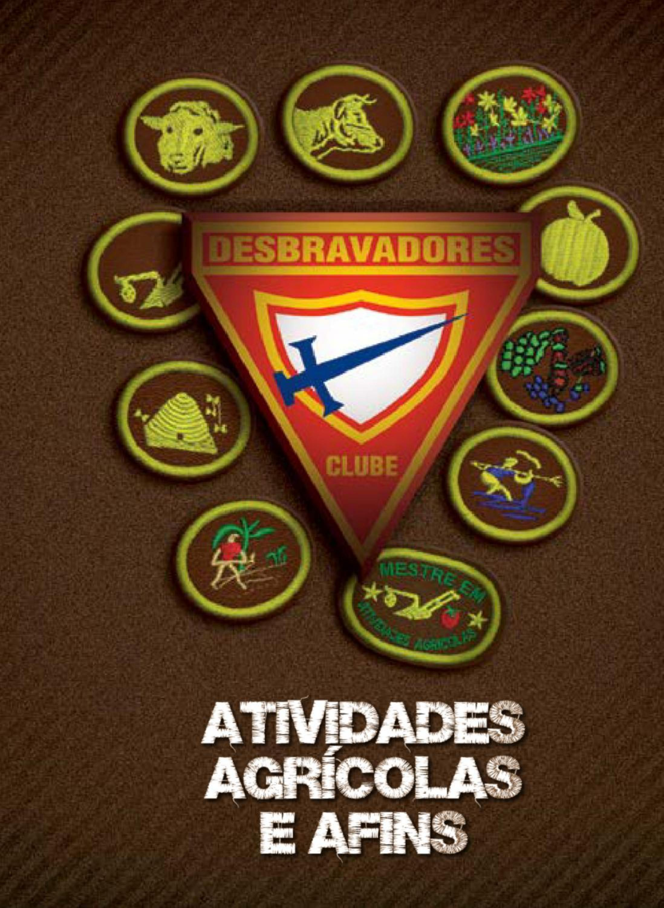
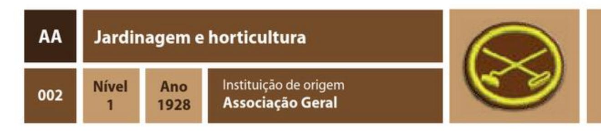
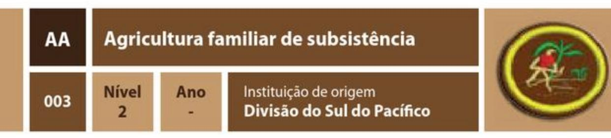
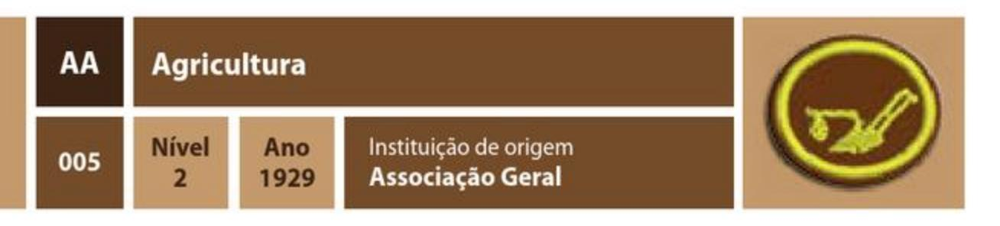
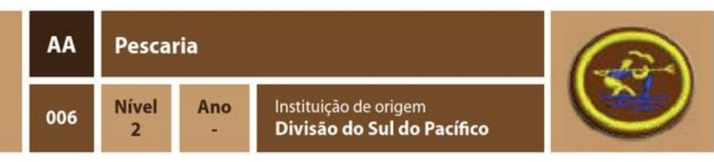
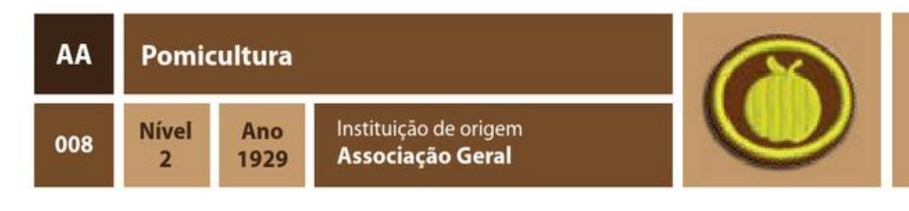
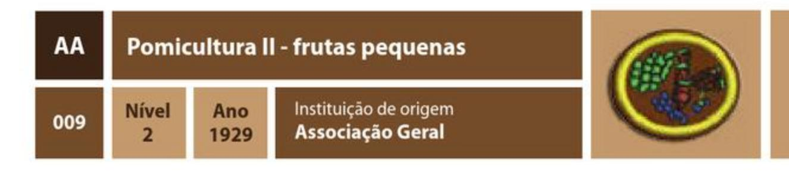
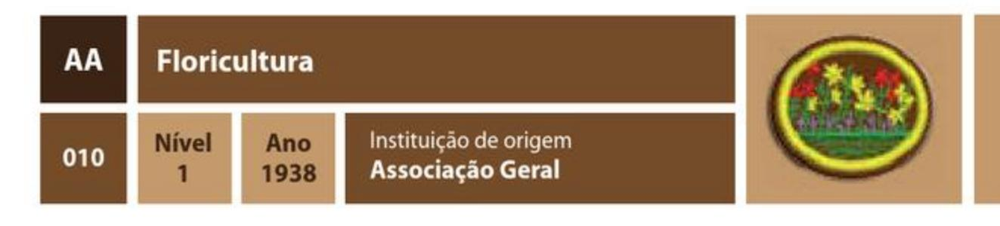
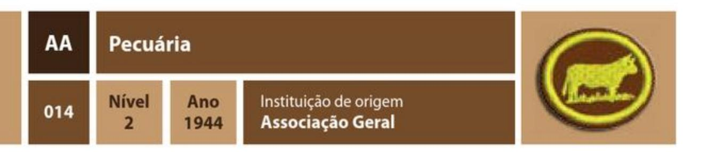
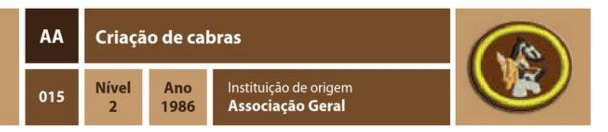

| Especialidade                        | Ano    | Código | Número |
| ------------------------------------ | ------ | ------ | ------ |
| Avicultura                           | 1928   | AA     | 001    |
| Jardinagem e horticultura            | 1928   | AA     | 002    |
| Agricultura familiar de subsistência |        | AA     | 003    |
| Apicultura                           | 1929   | AA     | 004    |
| Agricultura                          | 1929   | AA     | 005    |
| Pescaria                             |        | AA     | 006    |
| Criação de gado leiteiro             | 1929   | AA     | 007    |
| Pomicultura                          | 1929   | AA     | 008    |
| Pomicultura II - frutas pequenas     | 1929   | AA     | 009    |
| Floricultura                         | 1938   | AA     | 010    |
| Criação de cavalos                   | 1944   | AA     | 011    |
| Criação de pombos                    | 1944   | AA     | 012    |
| Criação de ovelhas                   | 1944   | AA     | 013    |
| Pecuária                             | 1944   | AA     | 014    |
| Criação de cabras                    | 1986   | AA     | 015    |

1. Ter a especialidade de Aves domésticas.
2. Identificar, por meio de imagens, e conhecer de forma geral o uso de:
    1. Incubadoras
    2. Poleiros
    3. Aviários
    4. Bebedouros
    5. Comedouros
    6. Ninhos
3. Identificar, ao vivo ou a partir de fotos, pelo menos, 2 raças das seguintes espécies, destacando sua respectiva aptidão (carne, ovos, penas e ou pele):
    1. Pato
    2. Frango
    3. Ganso
    4. Codorna
    5. Peru
    6. Avestruz
4. Descrever um programa de alimentação para aves domésticas, desde a eclosão dos ovos até a fase adulta.
5. Apresentar um relatório destacando os principais problemas de saúde que atingem as aves, apontando os sintomas e sinais, bem como preveni-los e tratá-los.
6. Qual a temperatura, umidade e número de dias necessários para chocar os seguintes OVOS:
    1. Pato
    2. Frango
    3. Ganso
    4. Codorna
    5. Peru
    6. Avestruz
7. Ser capaz de examinar, testar e acondicionar ovos para o mercado e/ou para o consumo doméstico, descrever como discernir ovos podres dos ovos bons e saber como são classificados.
8. Criar, até seu completo desenvolvimento, uma ninhada de, pelo menos, 6 aves de sua escolha.
9. Apresentar um relatório escrito de, no mínimo, 300 palavras, ou oral de 5 minutos sobre a importância da avicultura e referir suas principais características.
10. Visitar uma propriedade rural onde se pratica a criação de aves para uso próprio ou comércio e elaborar um relatório de, pelo menos, 300 palavras destacando as principais atividades ali desenvolvidas, bem como sobre a sua experiência vivida para o cumprimento dos requisitos desta especialidade.

### REQUISITOS

1. Preparar o solo, fertilizar e plantar num lote de terra de, pelo menos, 30 metros quadrados. Cultivar, pelo menos, seis plantas diferentes: três a partir de sementes e três a partir de mudas.
2. Relacionar formas de controlar insetos e outras pragas em sua horta ou jardim. Saber quando usar inseticidas e fungicidas e as regras de segurança que devem ser seguidas no manejo.
3. Por que e em que situações usa-se a palha ou terra para cobrir certos tipos de vegetação?
4. O que é uma planta resistente? Que plantas são consideradas resistentes em sua região?
5. Completar uma das alternativas a seguir:
    1. Testar a germinação de 100 sementes do mesmo tipo
    2. Fazer e usar um viveiro ou estufa
    3. Cultivar três verduras ou legumes, de sua escolha, para serem vendidos
    4. Fazer e usar um cesto ou tulha para guardar os vegetais.

1. Participar na elaboração de uma horta com área de, pelo menos, 10 metros quadrados, cumprindo os seguintes requisitos.
    1. Escolha do local
    2. Limpeza da área, incluindo a eliminação das ervas daninhas
    3. Preparo do solo para o cultivo
    4. Realizar o plantio e o cultivo de alguma variedade de planta.
2. Relacionar as ferramentas básicas a serem utilizadas para os trabalhos na agricultura familiar de subsistência e descrever os principais cuidados que devemos ter ao manipular essas ferramentas.
3. Apresentar um relatório demonstrando e explanando os tipos de adubo, relatando ainda as principais características de cada material identificado.
4. Demonstrar, através de uma atividade prática, o processo de adubação orgânica de sua horta.
5. Relacionar quais das seguintes famílias de plantas você cultivará em sua horta, citar pelo menos 3 espécies de cada uma das famílias abaixo relacionadas e mencionar a melhor época do ano para o cultivo.
    1. Tubérculos
    2. Gramíneas
    3. Legumes
    4. Verduras
    5. Frutos
6. Demonstrar de maneira prática, e por meio de um desenho, como você organizará sua horta para o cultivo das plantas de sua escolha.
7. Após a limpeza da área destinada ao plantio, quais plantas podem crescer melhor no local onde foram queimados tocos e troncos?
8. Apresentar um relatório demonstrando as principais pragas, doenças e ervas daninhas comuns às hortas. Demonstrar e explicar de que maneira você poderá controlar a incidência desses males.
9. Através de um planejamento de plantio, explicar de quais formas pode-se obter um fornecimento contínuo de alimentos.
10. Demonstrar como fazer a colheita para uso da família e para a comercialização.
11. O que é rotação de culturas e qual a importância dela para o cultivo na agricultura familiar de subsistência?
12. Apresentar através de um desenho, ou por meio prático, um programa em que você realizará a rotatividade do plantio cultivado, bem como do sistema de colheita.
13. Explicar o que você pode fazer com a área de sua horta após vários anos de cultivo.
14. Apresentar um relatório escrito de, no mínimo, 300 palavras, ou oral de 5 minutos sobre a importância da agricultura familiar de subsistência, referindo suas principais características.
15. Visitar uma propriedade rural onde uma família sobrevive da produção agrícola e elaborar relatório destacando as principais atividades ali desenvolvidas.

1. Apresentar um relatório escrito de, no mínimo, 500 palavras, ou oral de 5 minutos sobre a história da apicultura.
2. Relacione 5 produtos da Apicultura que são consumidos pelo homem e enumere, ao menos, 3 utilidades de cada um.
3. Qual a importância das abelhas para a agricultura? Nomear 10 alimentos que seriam muito difíceis de cultivar se não houvessem abelhas.
4. O que significam os termos a seguir:
    1. Caixas criatórias
    2. Favo atravessado
    3. Infestação
    4. Melgueira
5. O que é um fumegador? Que materiais produzem melhor combustível para o fumegador?
6. Descreva as diferenças físicas entre o zangão, as operárias e a abelha rainha e relacione os deveres específicos de cada um.
7. Explique:
    1. O processo pelo qual as abelhas constroem os favos e como organizam a colméia
    2. Por que a colméia fica escura com o tempo?
    3. O que é espaço-abelha e qual a sua medida em milímetros?
    4. Por que é importante evitar a passagem da abelha rainha entre a câmara de cria e as melgueiras? Como isso pode ser feito?
8. Que pontos devem ser considerados ao escolher um local para as colméias?
9. Como as doenças em abelhas podem espalhar-se de uma colméia para outra?
10. O que é pilhagem? Descreva o que faz uma abelha ladra.
11. Mencionar 4 maneiras de ajudar a prevenir a infestação nas colméias. Explique por que ela deve ser evitada.
12. Que 3 exigências devem ser cumpridas para que uma colônia possa suportar as intempéries com sucesso?
13. Cite 3 modelos populares de colméias. Quais as vantagens de usar uma colméia tipo Americana?
14. Como se sabe quando o quadro está pronto para a extração do mel?
15. Realizar as seguintes tarefas que acontecem num bom apiário:
    1. Demonstrar a técnica apropriada de fixação da placa de cera alveolada no quadro
    2. Estimular a produção da ninhada através da alimentação
    3. Evitar a infestação da colméia por meio das técnicas apropriadas
    4. Realizar a colheita do mel com total aproveitamento
    5. Realizar a colheita do própolis com total aproveitamento
16. Memorizar Provérbios 16:2 e explicar a relação entre o mel e as boas palavras na vida do cristão.

1. Fazer uma lista dos componentes do solo. Por que o solo é importante para as plantas?
2. Explicar como as plantas obtêm nutrientes e os convertem em alimento. Explicar a diferença entre nutrientes primários, secundários e micronutrientes.
3. Conhecer e apresentar um relatório dos modos em que podemos manter a terra fértil através da adubação com fertilizantes químicos e naturais, rotação de culturas e quando utilizá-los.
4. Explicar a diferença entre solos argilosos, arenosos e barrentos. Mencionar 3 tipos de plantas que se desenvolvem bem em cada um deles.
5. O que é erosão? Como pode ser prevenida?
6. Conhecer e apresentar um relatório acerca do manejo dos seguintes instrumentos de trabalho na agricultura: pá, enxada, ancinho e regador.
7. Identificar por meio de imagens e conhecer de forma geral as máquinas agrícolas, tradicionais e modernas, utilizadas no processo de produção agrícola.
8. Apresentar um relatório escrito de, no mínimo, 300 palavras ou oral de 5 minutos sobre a importância da agricultura, referindo suas principais características.
9. Testar a germinação de 3 variedades de sementes - 100 sementes de cada variedade. Anotar a porcentagem após o 3º, 5º e 7º dia.
10. Identificar e nomear, pelo menos, 10 ervas daninhas comuns em sua região e explicar a melhor forma de eliminá-las usando métodos naturais ou químicos.
11. Identificar 6 pragas (insetos) e 6 doenças comuns às plantações. Especificar quais plantas elas geralmente atacam, relatando a melhor maneira para prevenir e eliminar sua ocorrência.
12. Localizar, pelo menos, 2 fontes de informação em meteorologia e explicar como este método de informação pode ser útil ao agricultor?
13. Conhecer o propósito das seguintes atividades:
    1. Arar
    2. Gradear
    3. Drenar
    4. Capinar
    5. Cultivar
    6. Irrigar
    7. Ceifar (Colher)
14. Relacionar e identificar, através de fotografias ou imagens, pelo menos, 10 aves comuns em sua região e explicar a sua importância para o agricultor.
15. Auxiliar no plantio, cultivo e colheita de, pelo menos, 4 diferentes culturas, mantendo um relatório do trabalho realizado, bem como os problemas encontrados.
16. Visitar uma cooperativa em sua localidade ou instituição de apoio aos fazendeiros e descobrir como estes órgãos ajudam o agricultor. Escrever um relatório sobre sua visita.
17. Visitar uma propriedade rural onde se pratica a agricultura e elaborar relatório destacando as principais atividades ali desenvolvidas.

1. Qual a diferença entre pesca e pescaria?
2. Explique as sequintes modalidades:
    1. Pesca de subesistência
    2. Pesca esportiva
3. Listar 5 diferentes métodos de pesca e demonstrar, ao menos, 2 a seu instrutor.
4. Qual a melhor maré para a pesca? Qual a relação entre a lua e os diferentes tipos de maré?
5. Fazer um quadro usando figuras, fotos ou desenhos das iscas e anzóis mais comuns em sua região, explicando as variações e indicações de cada um.
6. Participar de uma viagem ou passeio de pesca e pescar, ao menos, 2 peixes, cada um utilizando um método diferente, dentre os listados no requisito 3.
7. Fazer o seguinte:
    1. Uma coleção de fotos de 30 peixes comuns em sua região, identificando seus nomes, local de habitação, dieta, etc.
    2. Uma coleção de fotos de 10 peixes venenosos, tendo, no mínimo, 5 nativos de sua região ou país.
8. Ler Deuteronômio 14:9 e 10. Após a leitura, separar os peixes do requisito 7 entre puros e impuros, explicando a importância de saber separá-los.
9. Ler Lucas 5: 1 a 10. Em seguida, fazer uma lista apresentando, ao menos, 10 diferentes formas de demonstrar em sua vida como ser um "Pescador de Homens".

### REQUISITOS

1. Quais pontos devem ser levados em consideração ao escolher uma vaca para a produção de leite?
2. Mencionar, pelo menos, 25 partes de uma vaca leiteira.
3. Identificar, ao vivo ou por meio de imagens, 3 raças de bovinos de corte e 3 raças de gado leiteiro.
4. Quais são as instalações necessárias para a criação de gado leiteiro?
5. Como uma novilha pode ser treinada de maneira que se torne uma vaca mansa?
6. Conhecer os cuidados, tratamento e alimentação para o gado leiteiro em cada um dos seguintes estágios:
    1. Bezerro
    2. Do desmame até os 6 meses de vida
    3. Dos 6 meses até os 15 meses de vida
    4. Dos 15 meses até a gestação
    5. Lactação
    6. Período seco
7. Saber como o leite é produzido na vaca.
8. Conhecer os passos necessários para ordenhar uma vaca tanto de maneira manual como mecânica.
9. Conhecer as principais partes de uma ordenhadeira mecânica.
10. O que é mastite? Quais medidas podem ser tomadas para prevenir a mastite?
11. Apresentar um relatório destacando os principais problemas de saúde que atingem o gado leiteiro, apontando os sintomas e sinais, bem como prevenir e/ou tratá-los.
12. Conhecer o significado dos seguintes termos:
    1. Concentrados
    2. Proteína bruta
    3. Seleção
    4. Período seco
    5. Lactação
    6. Ciclo ou período de lactação
    7. Ocitocina
    8. Cio
13. Explicar a pasteurização do leite e os cuidados necessários com os utensílios e equipamentos usados nos laticínios.
14. Apresentar um relatório escrito de, no mínimo, 300 palavras ou oral de 5 minutos sobre a importância da pecuária leiteira e referir suas principais características.
15. Auxiliar no cuidado e ordenha de um rebanho de vacas leiteiras por um período de, pelo menos, 3 meses.
16. Visitar uma propriedade rural onde se pratica a criação de gado leiteiro e elaborar um relatório de, pelo menos, 300 palavras destacando as principais atividades ali desenvolvidas, bem como sobre a sua experiência vivida para o cumprimento dos requisitos desta especialidade.

### REQUISITOS

1. Qual a diferença entre um viveiro e uma estufa?
2. Citar, pelo menos, 5 características que devem ser consideradas para se realizar a produção de mudas, bem como as principais necessidades a se levar em conta ao escolher uma determinada variedade de planta frutífera.
3. Apresentar um relatório demonstrando os cuidados necessários para o plantio e cultivo de, pelo menos, 2 árvores frutíferas de sua escolha, apontando as técnicas básicas de preparo do solo, espaçamento, período do ano mais favorável para o plantio e esquema de adubação.
4. Por meio de um relatório escrito (o relatório deve conter fotos das plantas adultas e dos frutos), apontar as condições de local, solo e época do ano mais adequado para se cultivar, pelo menos, 3 das seguintes variedades:
    1. Abacateiro
    2. Ameixeira
    3. Bananeira
    4. Cajazeira
    5. Coqueiro
    6. Goiabeira
    7. Laranjeira
    8. Limoeiro
    9. Macieira
    10. Mamoeiro
    11. Mangueira
    12. Pereira
    13. Outra variedade frutífera da sua escolha
5. Fazer um pequeno viveiro para a produção de mudas.
6. Apresentar, por meio de um relatório, o nome de, pelo menos, 3 tipos de fertilizantes, demonstrando a importância, necessidade e sugerir a melhor maneira de uso para cada um.
7. O que é uma árvore frutífera anã? Como chegou a este tamanho?
8. O que é enxertia? Por que se faz enxerto em árvores frutíferas?
9. O que é resistência? O que isso significa? Citar, pelo menos, 3 plantas que são consideradas resistentes em sua região?
10. Na presença do avaliador, demonstrar habilidade em plantar, podar e tratar de, pelo menos, 2 árvores frutíferas, por um período de, pelo menos, 2 estações, ou cuidar de uma árvore existente pelo mesmo período.
11. Responder as perguntas a seguir:
    1. O que é polinização? Como esse processo acontece?
    2. O que é um polinizador? Citar por meio de um relatório, apresentando fotos ou ao vivo, pelo menos um agente responsável pela polinização.
    3. Citar, pelo menos, 3 plantas frutíferas que necessitam de um agente polinizador.
12. Apresentar um relatório identificando, através de fotografias ou imagens, as principais pragas, doenças e ervas daninhas comuns aos pomares em sua região. Especificar quais plantas elas geralmente atacam, relatando a melhor maneira para prevenir e/ou eliminar sua ocorrência.
13. Demonstrar como fazer a colheita dos frutos para uso da família ou para comercialização. Apresentar aos examinadores uma amostra dos frutos colhidos e comparar as qualidades de sabor, textura e aparência de 2 variedades diferentes da mesma fruta.
14. Apresentar um relatório escrito de, no mínimo, 300 palavras ou oral de 5 minutos sobre a importância da Fruticultura (produção de frutos exigidos nos requisitos dessa especialidade) e referir suas principais características.
15. Visitar uma propriedade rural onde se pratica a fruticultura e elaborar um relatório de, pelo menos, 300 palavras destacando as principais atividades ali desenvolvidas, bem como sobre a sua experiência vivida para o cumprimento dos requisitos desta especialidade.

### REQUISITOS

NOTA: Esta especialidade envolve o cultivo de frutas produzidas por arbustos, trepadeiras ou vinhas. Frutas que crescem em árvores fazem parte da especialidade de Pomicultura.

1. Qual a diferença entre um viveiro e uma estufa?
2. Fazer um pequeno viveiro para a produção de mudas.
3. Citar, pelo menos, 5 características que devem ser consideradas ao se realizar a produção de mudas, bem como as principais necessidades a serem levadas em conta ao se escolher uma determinada variedade de planta frutífera.
4. Apresentar um relatório demonstrando os cuidados necessários para o plantio e cultivo de, pelo menos, 4 variedades de plantas de sua escolha, apontando as técnicas básicas de preparo do solo, espaçamento, período do ano mais favorável para o plantio e esquema de adubação.
5. Por meio de um relatório escrito (o relatório deve conter fotos das plantas adultas e dos frutos), apontar as condições de local, solo e época do ano mais adequados para se cultivar, pelo menos, 3 variedades de frutas pequenas das citadas abaixo ou que crescem em sua região:
    1. Abacaxizeiros
    2. Aceroleiras
    3. Amoreiras
    4. Cerejeiras
    5. Figueiras
    6. Framboeseiras
    7. Gravioleiras
    8. Maracujazeiros
    9. Morangueiros
    10. Pitangueiras
    11. Romanzeiras
    12. Umbuzeiros
    13. Vinhas
    14. Outra variedade frutífera da sua escolha
6. Escrever um relatório de 1 página referindo como cultivar as frutas selecionadas no requisito anterior. Neste relatório, incluir o seguinte:
    1. Variedade de seleção
    2. Preparo do solo
    3. Técnicas de plantio
    4. Fertilização
    5. Irrigação
    6. Controle de pragas
    7. Colheita
8. Apresentar, por meio de fotos ou imagens, as variedades de frutas pequenas que nascem com facilidade ou existem na região em que você vive.
9. Demonstrar ao avaliador a maneira adequada de podar, pelo menos, 2 arbustos ou vinhas de pequenas frutas em alguma horta ou pomar.
10. O que é uma cultura perecível?
11. Por quanto tempo as frutas mencionadas no requisito 5 podem ser guardadas?
12. Apresentar um relatório identificando, através de fotografias ou imagens, as principais pragas, doenças e ervas daninhas comuns aos pomares em sua região. Especificar quais plantas elas geralmente atacam e referir a melhor maneira para prevenir e/ou eliminar sua ocorrência.
13. Apresentar, por meio de um relatório, o nome de, pelo menos, 3 tipos de fertilizantes, demonstrando a importância, necessidade e sugerir a melhor maneira de uso para cada um.
14. Fazer um teste do solo de um pomar e determinar quais frutos poderão crescer ali. Pedir recomendações de fertilizantes para as culturas escolhidas para serem plantadas e determinar o custo do fertilizante necessário para 6 fileiras de 10 metros.
15. Qual é o propósito do teste de solo?
16. O que é drenagem? Qual a sua importância? Como se faz a drenagem?
17. O que é resistência? O que isso significa? Citar, pelo menos, 3 plantas que são consideradas resistentes em sua região?
18. Responder as perguntas a seguir:
    1. O que é polinização? Como esse processo acontece?
    2. O que é um polinizador? Citar por meio de um relatório, apresentando fotos ou ao vivo, pelo menos um agente responsável pela polinização.
    3. Citar, pelo menos, 3 plantas frutíferas que necessitam de um agente polinizador.
19. Demonstrar como fazer a colheita dos frutos para uso da família ou para comercialização. Apresentar aos examinadores uma amostra dos frutos colhidos e comparar as qualidades de sabor, textura e aparência de 2 variedades diferentes da mesma fruta.
20. Apresentar um relatório escrito de, no mínimo, 300 palavras ou oral de 5 minutos sobre a importância da fruticultura (produção de frutos exigidos nos requisitos dessa especialidade) e referir suas principais características.
21. Visitar uma propriedade rural onde se pratica a fruticultura e elaborar um relatório de, pelo menos, 300 palavras destacando as principais atividades ali desenvolvidas, bem como sobre a sua experiência vivida para o cumprimento dos requisitos desta especialidade.

### REQUISITOS

1. O que são flores perenes? Anuais? Bienais? Dê um exemplo de cada.
2. Apresentar as instruções para fazer um viveiro. Qual a diferença entre um viveiro e uma estufa?
3. O que é drenagem e qual a sua importância? Como se faz a drenagem?
4. Liste três pragas que atingem as plantas em sua região, descreva os danos causados por cada uma e explique como controlá-las.
5. Descrever as instruções para fazer uma floreira e especificar seu uso.
6. Dar o nome de três tipos de fertilizantes e sugerir o melhor uso para cada um.
7. Preparar o solo, plantar e cultivar até a maturidade, três tipos distintos de flores anuais.
8. Quais são os três nutrientes de plantas mais importantes para a floração?
9. Cultivar duas ou mais flores perenes em um canteiro ao ar livre, durante uma estação. Manter um relatório escrito com registro semanal do trabalho feito.
10. Qual é o propósito do teste de solo?
11. Mencionar três flores que melhor se adaptam a cada uma das condições a seguir:
    1. Sombra
    2. Solo seco
    3. Luz solar direta
    4. Solo úmido

1. Identificar, ao vivo ou a partir de fotografias, pelo menos 4 raças de cavalos e especificar a aptidão desses.
2. Quais são as instalações necessárias para a criação de cavalos?
3. Qual a alimentação necessária a ser utilizada para os seguintes períodos da vida dos animais?
    1. Primeiro mês
    2. Primeiro ano
    3. Gestação
    4. Fêmea com filhote
    5. Animal adulto
4. Qual é a melhor idade para desmamar os potros?
5. Quando os filhotes devem ser apartados de suas mães e por quê?
6. Citar 2 linhas de lucro que são determinadas pelo uso de éguas especialmente selecionadas.
7. Por que é preferível criar potros de puro sangue ao invés de espécies comuns?
8. Citar, pelo menos, 5 características que devem ser consideradas ao se escolher um cavalo.
9. Que espécie de adestramento ajudará os potros a se desenvolverem de forma a tornarem-se cavalos mansos e dóceis?
10. Conhecer as partes do cabresto, rédeas, arreios e cela.
11. Saber e demonstrar aos avaliadores como colocar de maneira correta um cabresto, rédeas e cela no cavalo.
12. Saber como cuidar adequadamente dos cascos de um cavalo.
13. Cuidar de um ou mais potros ou cavalos por um período de, pelo menos, 3 meses.
14. Apresentar um relatório destacando os principais problemas de saúde que atingem os cavalos, apontando os principais sinais e sintomas, bem como prevenir e/ou tratá-los.
15. Apresentar um relatório escrito de, no mínimo, 300 palavras ou oral de 5 minutos sobre a importância da equinocultura e referir suas principais características.
16. Visitar uma propriedade rural onde se pratica a criação de cavalos e elaborar um relatório de, pelo menos, 300 palavras destacando as principais atividades ali desenvolvidas, bem como sobre a sua experiência vivida para o cumprimento dos requisitos desta especialidade.

### REQUISITOS

1. Identificar, ao vivo ou a partir de fotos, pelo menos, 3 espécies de pombos, referindo sua respectiva aptidão (pombo-correio ou ornamentação).
2. Descrever e identificar, por meio de fotografias, as seguintes instalações e equipamentos necessários para a criação de Pombos:
    1. Pombal
    2. Poleiros
    3. Alçapão
    4. Ninho em caixa
    5. Bebedouros
    6. Comedouros
3. Quais características devem ser levadas em conta ao se escolher uma espécie de pombo?
4. Qual o tamanho mínimo ideal do plantel para um criador inexperiente iniciar a atividade na criação pombos?
5. Descrever um programa de alimentação para aves domésticas, desde a eclosão dos ovos até a fase adulta.
6. Saber e apresentar uma boa fórmula de sementes, grãos e alimentos triturados para serem utilizados na alimentação dos pombos e em que proporções eles devem ser misturados e administrados? Por que deve-se usar menos milho em climas quentes?
7. Citar as principais partes de um pombo. Referir e demonstrar, por meio de fotografias, as partes da asa do pombo, bem como a importância dessa estrutura.
8. Qual a importância de uma correta mudança de penas? Como se pode controlar este período?
9. Criar, pelo menos, 2 pares de pombos. Se forem pombos-correios, ensiná-los a voltar ao pombal de uma distância de 40 quilômetros. Se forem pombos ornamentais, prepará-los para exposições.
10. Apresentar um relatório destacando os principais problemas de saúde que atingem as aves, apontando os sintomas e sinais, bem como prevenir e/ou tratá-los.
11. Visitar uma propriedade onde se pratica a criação de pombos e elaborar um relatório de, pelo menos, 300 palavras destacando as principais atividades ali desenvolvidas, bem como sobre a sua experiência vivida para o cumprimento dos requisitos desta especialidade.

1. Identificar, ao vivo ou a partir de fotografias, pelo menos 4 raças de ovinos e especificar se esses animais são criados para produção de leite, carne, pele ou lã.
2. Quais são as instalações necessárias para a criação de ovelhas?
3. Quais os cuidados básicos devem ser providos para a criação de ovelhas?
4. Qual é o espaçamento necessário para a criação de ovelhas nas situações a seguir:
    1. Ovelhas adultas soltas em um estábulo
    2. Ovelhas adultas soltas ao ar livre
    3. Filhotes soltos em um estábulo
    4. Pastagem para gestantes
    5. Cocho para ovelhas adultas
    6. Cocho para gestantes
    7. Parto
5. Qual a alimentação necessária a ser utilizada para os seguintes períodos da vida dos animais?
    1. Primeiro mês
    2. Terceiro mês
    3. Gestação
    4. Fêmea com filhote pequeno
    5. Animal adulto
6. Em que tipo de regiões as ovelhas costumam habitam?
7. Qual período do ano é mais favorável para iniciar a criação de ovelhas?
8. Quais características devem ser levadas em conta ao se escolher uma determinada variedade de raça?
9. Qual é a melhor idade para desmamar os burregos?
10. Quando os filhotes devem ser apartados de suas mães e por quê?
11. Citar e apresentar, por meio de fotografias, pelo menos 6 objetos oriundos da criação de ovelhas.
12. Apresentar um relatório destacando os principais problemas de saúde que atingem os ovinos, apontando os principais sinais e sintomas, bem como prevenir e/ou tratá-los.
13. Qual o tamanho mínimo ideal do rebanho para um criador inexperiente iniciar a atividade na criação ovelhas?
14. Conhecer o significado dos seguintes termos:
    1. Castração
    2. Comercialização
    3. Mocho
    4. De raça pura
    5. Cruzar
    6. Carneiro
    7. Ovelha
    8. Ração
    9. Purgante ou Lavagem
    10. Registrado
    11. Castrado
    12. Forragens
    13. Raça híbrida
    14. Ganhar ou Parir
    15. Cio
    16. Gestação
    17. Burregos
    18. Peso de gordura
15. Quais pontos devem ser levados em consideração ao se escolher um bom cordeiro?
16. Cuidar de 2 ou mais cordeiros até a comercialização ou até 6 meses de idade.
17. Apresentar um relatório escrito de, no mínimo, 300 palavras ou oral de 5 minutos sobre a importância da ovinocultura e referir suas principais características.
18. Visitar uma propriedade rural onde se pratica a criação de ovelhas e elaborar um relatório de, pelo menos, 300 palavras destacando as principais atividades ali desenvolvidas, bem como sobre a sua experiência vivida para o cumprimento dos requisitos desta especialidade.

1. Citar, pelo menos, 4 características que se deve observar para a escolha de um bom novilho.
2. Mencionar, pelo menos, 25 partes de um boi.
3. Conhecer o significado dos seguintes termos:
    1. Forragem
    2. Arroba
    3. Curral
    4. Cruzar
    5. Brete
    6. Ferro de marcação
    7. Garrote
    8. Novilho
    9. Brachiara
    10. Napiêr
    11. Quicuio
    12. Prenhez
    13. Ordenha
    14. Mocho
    15. De raça pura
    16. Lactação
    17. Pasto
    18. Cerca
    19. Ração
    20. Área
    21. Cio
4. Apresentar um relatório destacando os principais problemas de saúde que atingem os bovinos, apontando os sintomas e sinais, bem como preveni-los e tratá-los.
5. O que é castração e qual o seu propósito?
6. O que é descorna? Por que os chifres são extraídos? Qual a melhor idade para a realização deste procedimento?
7. Qual o melhor período para o desmame dos bezerros?
8. Quais são as instalações necessárias para a criação de gado?
9. Por que é melhor colocar alimento e água em lados opostos do estábulo?
10. Identificar, ao vivo ou por meio de imagens, 3 raças de bovinos de corte e 3 raças de gado leiteiro.
11. Relatar os cuidados, manejo e tipo de alimentação necessária para o gado nas seguintes situações:
    1. Primeiros 90 dias
    2. De 90 a 180 dias
    3. De 180 dias até o momento da venda
12. Como uma novilha pode ser treinada de maneira que se torne uma vaca mansa?
13. Cuidar de 1 ou mais bezerros por um período mínimo de 6 meses.
14. Visitar uma propriedade rural onde se pratica a pecuária e elaborar um relatório de, pelo menos, 300 palavras destacando as principais atividades ali desenvolvidas, bem como sobre a sua experiência vivida para o cumprimento dos requisitos desta especialidade.

1. Identificar, ao vivo ou a partir de fotografias, pelo menos 4 raças de caprinos e especificar se esses animais são criadas para produção de leite, carne ou lã.
2. Quais são as instalações necessárias para a criação de cabras?
3. Qual a alimentação necessária a ser utilizada para os seguintes períodos da vida dos animais?
    1. Primeiro mês
    2. Segundo mês
    3. Gestação
    4. Fêmea com filhote pequeno
    5. Animal adulto
4. Nomear e apresentar, por meio de fotos, 3 plantas venenosas para as cabras.
5. Qual é a melhor idade para desmamar os cabritos?
6. Quando os filhotes devem ser apartados de suas mães e por quê?
7. Como os cascos das cabras devem ser aparados e por quê?
8. Por que as cabras são boas para limpar o mato?
9. Citar e apresentar, por meio de fotografias, pelo menos 6 objetos feitos de peles de cabra.
10. O que é barbilhões?
11. Cuidar de 2 cabras por, pelo menos, 3 meses.
12. Sobre cabras leiteiras, responder às seguintes perguntas:
    1. Quais os pontos devem ser levados em consideração ao se escolher uma boa cabra leiteira?
    2. Como é feita a pasteurização do leite e qual seu objetivo?
13. Fazer o seguinte:
    1. Ordenhar uma cabra de manhã ou à tarde, durante, pelo menos, 3 meses.
    2. Manter um registro diário da produção de leite.
14. Apresentar um relatório destacando os principais problemas de saúde que atingem os caprinos, apontando os principais sinais e sintomas, bem como prevenir e/ou tratá-los.
15. Apresentar um relatório escrito de, no mínimo, 300 palavras ou oral de 5 minutos sobre a importância da caprinocultura e referir suas principais características.
16. Visitar uma propriedade rural onde se pratica a criação de caprinos e elaborar um relatório de, pelo menos, 300 palavras destacando as principais atividades ali desenvolvidas, bem como sobre a sua experiência vivida para o cumprimento dos requisitos desta especialidade.