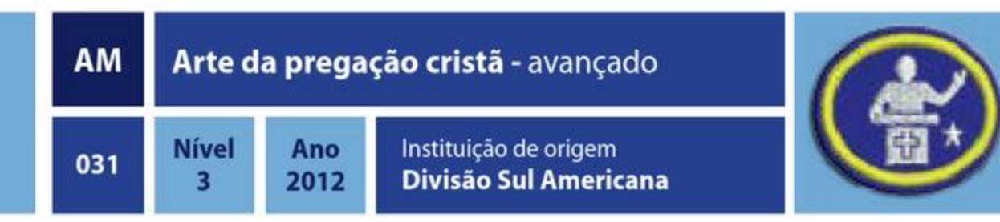

# Atividades Missionárias e Comunitárias

| Especialidade                            |  Ano  | Código | Número |
| ---------------------------------------- | :---: | :----: | :----: |
| Arte de contar histórias cristãs         | 1928  |   AM   |  001   |
| Arte em fantoches                        |  --   |   AM   |  002   |
| Arte em fantoches - avançado             |  --   |   AM   |  003   |
| Etnologia missionária                    | 1928  |   AM   |  004   |
| Colportagem                              | 1938  |   AM   |  005   |
| Cidadania cristã                         | 1938  |   AM   |  006   |
| Estudo de línguas                        | 1938  |   AM   |  007   |
| Evangelismo pessoal                      | 1938  |   AM   |  008   |
| Liderança juvenil                        | 1945  |   AM   |  009   |
| Testemunho juvenil                       | 1970  |   AM   |  010   |
| Asseio e cortesia cristã                 | 1975  |   AM   |  011   |
| Vida familiar                            | 1975  |   AM   |  012   |
| Temperança                               | 1976  |   AM   |  013   |
| Língua de sinais                         | 1978  |   AM   |  014   |
| Mordomia                                 | 1986  |   AM   |  015   |
| Aventuras com Cristo                     | 1989  |   AM   |  016   |
| Aventuras com Cristo - avançado          | 1989  |   AM   |  017   |
| Língua de sinais - avançado              | 1991  |   AM   |  018   |
| Marcação bíblica                         |  --   |   AM   |  019   |
| Marcação bíblica - avançado              |  --   |   AM   |  020   |
| Pregador evangelista                     |  --   |   AM   |  021   |
| Pregador evangelista - avançado          |  --   |   AM   |  022   |
| Santuário                                | 2004  |   AM   |  023   |
| Dramatização cristã                      | 2006  |   AM   |  024   |
| Desfile com carros alegóricos            | 2009  |   AM   |  025   |
| Desfile com carros alegóricos - avançado | 2009  |   AM   |  026   |
| Pacificador                              | 2009  |   AM   |  027   |
| Pacificador - avançado                   | 2009  |   AM   |  028   |
| Adoração cristã                          | 2011  |   AM   |  029   |
| Arte da pregação cristã                  | 2012  |   AM   |  030   |
| Arte da pregação cristã - avançado       | 2012  |   AM   |  031   |
| Arqueologia bíblica                      | 2012  |   AM   |  032   |
| Cerimônias                               | 2012  |   AM   |  033   |
| Braile                                   | 2012  |   AM   |  034   |
| Criacionismo                             | 2012  |   AM   |  035   |
| Criacionismo - avançado                  | 2012  |   AM   |  036   |
| Espírito de profecia                     | 2012  |   AM   |  037   |
| Escatologia                              | 2012  |   AM   |  038   |
| Historiador eclesiástico                 | 2012  |   AM   |  039   |
| Evangelismo web                          | 2012  |   AM   |  040   |
| Evangelismo web - avançado               | 2012  |   AM   |  041   |
| Intercessor                              | 2012  |   AM   |  042   |
| Pioneiros adventistas                    | 2012  |   AM   |  043   |
| Patriotismo                              | 2012  |   AM   |  044   |
| Sonoplastia                              | 2012  |   AM   |  045   |
| Sonoplastia - avançado                   | 2012  |   AM   |  046   |
| Investigador Bíblico I                   | 2012  |   AM   |  047   |
| Boa conduta escolar                      | 2012  |   AM   |  048   |

## Arte de contar histórias cristãs

| AM  | Arte de contar histórias cristãs |             |                                           |
|-----|----------------------------------|-------------|-------------------------------------------|
| 001 | Nível                            | Ano 1928 | Instituição de origem Associação Geral |

### REQUISITOS

1. Citar a fonte bibliográfica e contar uma história para cada uma das categorias abaixo:
    1. História Bíblica.
    2. História da sua Igreja.
    3. História da Natureza.
    4. História com algum fundo moral.
    5. História com ajuda de recursos visuais.
    6. História de um missionário em terras estrangeiras.
    7. História com princípios de saúde e temperança.
2. Para cumprir este requisito, cada uma das histórias deve ser contada em uma dessas atividades (por pelo menos 3 minutos):
    1. Em uma meditação nas Classes de Juvenis ou Primários da Escola Sabatina.
    2. Meditação do Clube no domingo ou classe bíblica.
    3. Meditação para as Unidades de 10-12 anos dentro do Cantinho da Unidade.
    4. Meditação em algum acampamento ou evento que o Clube tenha participado, no fogo do conselho, em um culto etc.
    > Entregar todas as histórias por escrito.
3. Contar 2 histórias pesquisadas no item 1 no momento de adoração infantil na Igreja, adequadas para a ocasião.
4. Usando sua criatividade, criar 5 histórias próprias que ensinem práticas morais, amor à natureza, preservação do ambiente, demonstrem sua fé em Deus ou algum assunto que seja útil na construção do caráter dos desbravadores. Entregá-las por escrito.
5. Usando uma dessas histórias que você criou no item anterior, demonstrar a seu líder ou conselheiro como modificá-las nas seguintes circunstâncias:
    1. Saber contar a história na primeira e terceira pessoa.
    2. Demonstrar suas técnicas de contar a história de forma a torná-la ainda interessante para as diferentes faixas etárias:
        1. Crianças pequenas (idade de aventureiros)
        2. Adolescentes ou Jovens
        3. Adultos
    3. Saber encurtá-la, sem perder o conteúdo e aplicação
    4. Saber torná-la mais longa
6. Identificar, em uma das histórias criadas do item 3, as partes que compõe uma boa história (começo - introdução, meio, clímax e fim - conclusão) através de um esboço. Entregar por escrito.
7. Obter, para sua coleção particular, um livro com ilustrações para sermões.

## Artes em fantoches

### REQUISITOS

1. Possuir, pelo menos, 3 marionetes. Pelo menos 1 delas deve ser confeccionada manualmente por você.
2. Desenvolver 3 personagens com vozes características para cada um de seus fantoches.
3. Escrever 3 roteiros de 2 a 3 minutos.
4. Fazer, pelo menos, 3 apresentações dos roteiros acima a qualquer público (não pode ser amigos ou familiares).
5. Ser avaliado, em cada apresentação, por um dos telespectadores. Este avaliador não pode ser familiar ou amigo direto do marionista.

## Artes em fantoches - avançado

### REQUISITOS

1. Ter a especialidade de Arte em fantoches.
2. Acrescentar à sua coleção, pelo menos, mais 2 fantoches diferentes.
3. Desenvolver personagens e vozes para os novos fantoches.
4. Escrever um roteiro de, pelo menos, 10 minutos.
5. Construir um cenário para encenação dos fantoches.
6. Fazer, pelo menos, uma encenação na igreja ou para outro público.

## Etnologia missionária

### REQUISITOS

1. Definir cultura e diversidade cultural.
2. Definir estereótipo e identificar como você pode ter estereotipado alguém no passado.
3. Estudar os seguintes textos bíblicos e responder às perguntas:
    1. 1 Coríntios 9:20. Como este texto pode explicar a importância do cristão ter uma consciência da diversidade cultural?
    2. Gálatas 3:27. O que este texto diz sobre todos os que estão na família de Cristo?
    3. Efésios 2:14. Qual deve ser o resultado de aceitar a Cristo Jesus em nossas vidas? Como você pretende aplicar esta mensagem para sua vida cotidiana?
4. Fazer um estudo sobre a vida de qualquer grupo racial ou nacionalidade que não sejam os seus, e com os quais tem a oportunidade de entrar em contato. O objetivo é adquirir uma compreensão e simpatia por suas virtudes, hábitos, defeitos e necessidades, e também para apresentar-lhes o evangelho. Os pontos a seguir devem ser observados neste estudo:
    1. Sua história no país de origem, ou em seu país, caso a ocupação exceda 100 anos.
    2. Sua literatura, com menção dos principais escritores e familiarização com os melhores exemplos de prosa e verso.
    3. Seus hábitos sociais na comunidade e em família; por exemplo, se são fechados ou se gostam de estar em contato com outras pessoas, e quais os costumes da família, e como a mesma é governada.
5. Entrevistar uma pessoa cuja cidadania ou raiz cultural (no caso de indígenas) é diferente da sua. Fazer as seguintes perguntas:
    1. Qual a origem da sua cultura?
    2. Qual língua é falada?
    3. Quais as religiões que se destacam na sociedade?
    4. Quais os alimentos que normalmente são consumidos no:
       - Café da manhã
       - Almoço
       - Ceia
    5. Como os hábitos alimentares influenciam a sociedade?
    6. Há tradições culturais que são diferentes das do nosso país? Quais são?
    7. As pessoas desta cultura comemoram os mesmos feriados que celebramos? Como eles celebram os feriados diferentes do nosso?
    8. Que costumes e tradições da cultura original foram mantidos pela família neste país?
    9. Sua forma de vestir-se é diferente da de nossa cultura?
    10. Identificar, pelo menos, 5 coisas (alimentos, costumes, vestimentas, hábitos, etc.) que nossa cultura tem similar à do entrevistado e, pelo menos, 5 diferentes. Qual sua atitude ou sentimentos para com pessoas de culturas diferentes? Como estas descobertas afetou você? O que você sente sobre estas diferenças?
6. Comparar a sua língua materna com a língua materna do grupo estudado. Qual a origem de cada uma? Há alguma semelhança de estrutura gramatical? Aprender a falar algumas frases nesta língua, adquirindo um vocabulário de, no mínimo, 100 palavras.

## Colportagem

### REQUISITOS

> NOTA: Entre em contato com o departamental de colportagem em sua associação. Ele poderá ajudá-lo a selecionar um livro ou revista para vender e lhe designará uma região de trabalho.

Participar de uma campanha de colportagem estudantil ou, pelo menos, 3 meses em uma campanha Sonhando Alto, promovidas pelo seu Campo e apresentar uma declaração assinada pelo líder da sua campanha e pelo representante de Publicações do seu Campo; ou concluir os itens abaixo:

1. Participar de um Curso ou Treinamento promovido pelo departamento de Publicações do Campo Local ou Campanhas de Colportagem em sua igreja, sobre a Arte Cristã de Vendas.
2. A partir da Bíblia e do Espírito de Profecia, pesquise e apresente um resumo de, no mínimo, 250 palavras sobre:
    1. A visão de Ellen G. White descrita no Livro Vida e Ensino, p. 128.
    2. Qual a importância do uso de literatura para levar pessoas a Cristo?
    3. Citações do Espírito de Profecia sobre a obra da Colportagem.
3. Com ajuda do seu pastor, ou com o responsável pelo departamento de Publicações da Associação/Missão local, pesquisar e obter informações sobre os seguintes dados da Colportagem:
    1. Quais são os livros que compõem a "Cesta Básica" no trabalho da Colportagem?
    2. Saber mais detalhes sobre a colportagem Estudantil do seu campo: período, métodos, alcance, material usado, etc.
    3. Qual a diferença entre a Colportagem Eventual e a Colportagem Efetiva?
    4. Como funciona o credenciamento dos Colportores Efetivos?
    5. Quais são as qualificações necessárias para ser um Colportor?
4. Pesquise e relate em breves palavras sobre as técnicas de:
    1. Vendas
    2. Persuasão
    3. Despertar interesse na compra dos livros e revistas
    4. Reagir às objeções
5. Pesquise e apresente um resumo de, no mínimo, 250 palavras sobre a importância do trabalho da Colportagem no começo da história da Igreja Adventista no seu país:
    1. Quem foram os Pioneiros da Colportagem em seu país?
    2. Como eles usaram a Colportagem como meio de Evangelização?
    3. Qual foi a importância desse ministério na propagação do Evangelho em seu país?
6. Fazer 1 dos itens a seguir:
    1. Participar de um projeto de Colportagem de, pelo menos, 1 mês, no qual você tenha conseguido vender e entregar o material.
    2. Distribuir livros religiosos a autoridades pelo menos 6 pessoas do governo de sua cidade.
    3. Oferecer um ano de assinatura da revista Vida & Saúde ou Nosso Amiguinho a pelo menos 2 médicos ou educadores de seu bairro, ou cidade.
    4. Coletar doações e enviar literaturas e/ou Bíblias aos campos missionários, projetos de plantio de Igreja ou Missão Global de seu Campo.
7. Simular ao seu Orientador ou Conselheiro uma venda de um livro e revista, testando suas técnicas aprendidas na pesquisa do item 4.
8. Ler o Livro "O Colportor Evangelista", de Ellen G White.
    1. Fazer um resumo de, no mínimo, 200 palavras (cada) para 3 dos 6 capítulos abaixo:
        1 - 1 Nossas Publicações e sua Missão\
        6 - 6 Uma Obra de Salvação de Almas\
        7 - 7 Entrega Completa a Deus\
        12 - 12 Homem de Oração\
        17 - 17 Acompanhado por Anjos\
        24 - 24 O Vasto Alcance de Influência de Nossas Publicações

## Cidadania cristã

### REQUISITOS

1. Defina o termo Cidadania.
2. Descrever as sequintes bandeiras:
    1. Do seu país
    2. Do seu Estado
    3. Do seu Município
    4. Dos Jovens Adventistas
    5. Dos Desbravadores
3. Pesquise e relate o significado das cores, símbolos, significado, curiosidades e história (se houver) das bandeiras do item 2.
4. Demonstrar como dobrar as bandeiras do Item 2. Explicar como e onde devem ser quardadas.
5. Saber quando as bandeiras podem e quando devem ser hasteadas.
6. Fazer o seguinte:
    1. Explicar a razão para a existência do Hino Nacional
    2. Selecionar e pesquise o significados das palavras do hino nacional que você não conhece
    3. Recitar a letra de memória
    4. Cantar corretamente o hino nacional
    5. Recitar o hino dos desbravadores e explicar seu significado
    6. Recitar os ideais dos desbravadores e seu significado
    7. Explicar o significado da posição Maranata
7. Explicar o significado da declaração que Jesus fez em Mateus 22:21: "Dêem a César o que é de César e a Deus o que é de Deus."
8. Por que as leis são importantes? Qual foi o objetivo de Deus ao nos dar a Lei? Por que um país precisa de leis?
9. Pesquise a Constituição do seu país e liste, ao menos, 10 direitos importantes que ela assegura.
10. Quais são os deveres mais importantes de um cidadão do seu país? Em que eles são semelhantes ou diferentes dos deveres de um cidadão do céu? O que fazer quando os deveres de um cidadão do seu país atrapalham a cumprir os deveres de um cidadão do Céu?
11. Explicar o sistema de governo em seu país.
12. Fazer uma entrevista com uma autoridade pública (municipal, estadual ou federal) e perguntar-lhe sobre os deveres e atividades inerentes à sua função.
13. Faça uma pesquisa sobre uma pessoa famosa de seu país. Cite o que ela fez para se destacar diante da sociedade. Apresente o resultado da sua pesquisa de uma das seguintes formas:
    1. Redação com, pelo menos, 1 folha
    2. Apresentação para os membros do clube com, pelo menos, 2 minutos de duração
14. Fazer uma lista com, pelo menos, 10 itens de um dos seguintes:
    1. Citações famosas de líderes de seu país
    2. Lugares históricos famosos em seu país
    3. Eventos históricos muito conhecidos em seu país
15. Descrever o que você pode fazer como cidadão para ajudar sua igreja e seu país.
16. Pesquisar e explicar quais são os requisitos para um estrangeiro conseguir a cidadania em seu país.

## Estudo de línguas

### REQUISITOS

1. Ler e traduzir, à primeira vista, um texto de, pelo menos, 300 palavras de um livro ou revista em uma língua não nativa para você.
2. Ser capaz de manter uma conversação nesta outra língua, por um período de, no mínimo, 5 minutos.
3. Ouvir parte de um discurso ou declaração de, no mínimo 2 minutos, feito por alguém cuja língua materna seja a língua estrangeira que você escolheu, e traduza o mesmo para a sua língua.
4. Escrever uma carta simples na língua estrangeira de sua escolha, dizendo que contatos que você tem sido capaz de fazer com pessoas cuja língua nativa é o idioma que você escolheu.
5. Conhecer e repetir de memória o Voto e a Lei dos Desbravadores nesta língua estrangeira.
6. Escrever ou apresentar oralmente informações sobre alguma população estrangeira, cuja língua materna é a língua de sua escolha, que more em seu bairro, cidade, região ou Estado e que oportunidades você tem de conversar com pessoas nativas nessa língua.

> Observação: Depois que tiver escolhido uma língua estrangeira, obtenha um livro adequado para o aprendizado desta língua, e estude-o com profundidade. É claro que é melhor estudar línguas sob a instrução de um professor competente, numa escola ou curso.

## Evangelismo pessoal

### REQUISITOS

1. Levar uma pessoa ao batismo através do Estudo Bíblico.
2. Ter uma coleção de 5 estudos bíblicos, em papel ou com recursos audiovisuais, que podem ser usados na pregação bíblica.
3. Ter uma coleção de, pelo menos, 20 citações do Espírito de Profecia com relação ao Evangelismo Pessoal. Guardar essas citações em forma de fichas ou anotadas em sua bíblia de estudo.
4. Ter a Especialidade de Marcação bíblica, para se ter uma cadeia de temas em sua bíblia para ser usada em seus estudos.
5. Fazer 1 das 2 atividades abaixo:
    1. Ser o diretor (somente a direção) do Ministério Pessoal de sua Igreja ou grupo durante um ano, executando, pelo menos, 5 atividades com foco missionário e tendo a colaboração da igreja.
       > Apresentar relatório completo das atividades planejadas e executadas.
    2. Executar os requisitos abaixo:
       1. Através do estudo da Bíblia e do Espírito de Profecia, aprender como Jesus tratava as pessoas de forma pessoal. Escrever um relatório de 500 palavras:
          - · Fazer uma apresentação oral de 5 minutos sobre o que você aprendeu.
          - · Pregar no Sábado Missionário de sua Igreja sobre o que pesquisou.
          > Apresentar relatório ou esboço do sermão.
       2. Desenvolver uma vida devocional diariamente por, pelo menos, 6 meses através do Estudo da Bíblia, leitura do Ano Bíblico e Leitura da Devoção pessoal.
       3. Escolher e executar 2 atividades descritas abaixo:
            - Reuniões Evangelísticas
            - Reuniões do Ministério Jovem
            - Atividades da Assistência Social (ASA) de sua igreja
            - Seminários de (cozinha) Vida Saudável
            - Cursos Como Deixar de Fumar
            - Seminários sobre Perda de Peso
            - Seminários sobre o Controle do Estresse
            - Seminário sobre Hipertensão ou Diabetes
          > Na opção que tiver escolhido acima, realizar o seguinte:
            - Tomar parte na organização da atividade
            - Tomar parte na consecução do local para a realização do evento
            - Ajudar na divulgação
            - Descobrir como levantar fundos para um projeto evangelístico e que despesas serão necessárias
            - Estar regularmente envolvido na operação e organização do projeto
       4. Ajudar na organização e planejamento de um dos projetos evangelísticos a seguir e participar no projeto durante, no mínimo, 10 horas:
          > Observação: Esses itens devem ser feitos em projetos evangelísticos da Igreja, em Semanas de Colheita, em Evangelismo Público, Plantio de igreja, etc.
          - Projetos de melhorias no seu bairro ou no bairro onde o Clube atua, em jardins, praças e outras áreas públicas.
          - Participar dos momentos de história para crianças, encenações bíblicas ou apresentação de fantoches.
          - Distribuição de alimentos e/ou roupas aos necessitados.
          - Programas e visitas a um asilo, orfanato ou ala pediátrica de um hospital.
          - Jardinagem e trabalho doméstico gratuito na casa de pessoas de idade.
          - Ser professor/professora numa das divisões infantis do departamento de Escola Sabatina de uma igreja ou grupo em formação.
          - Palestras sobre temperança.
          - Aulas de reforço para alunos mais novos, com dificuldade.
          - Trabalho voluntário em hospital ou asilo, projetos de levantamento de fundos e fornecer livros e jogos.
          - Ajudar na reabilitação de uma pessoa com deficiência física.
          - Fazer cartazes e projetos de arte para um hospital, asilo ou orfanato.
          - Programa: Adote um Avô / Avó (em asilos).
          - Projeto semelhante com aprovação de seu diretor de Desbravadores.

## Liderança juvenil

### REQUISITOS

#### **Pré-requisitos: Ser um líder de desbravadores investido ou estar cursando a classe de líder. Ter, no mínimo, 16 anos completos.**

1. Se envolver diretamente em um dos seguintes departamentos da Igreja por, no mínimo, 1 ano, em um cargo de liderança ou de associado:
   1. Ministério Jovem (Jovens, Música, Sonoplastia, participação em um dos conjuntos musicais da Igreja ou liderar/associado do Ministério de Louvor da sua Igreja)
   2. Ministério da Criança ou do Adolescente (coordenação ou um dos professores das Classes da Escola Sabatina)
   3. Clube de Desbravadores (secretaria, tesouraria, instrutor ou capelão)
   4. Secretaria de algum outro departamento da Igreja (Ministério Pessoal, Ministério da Mulher, Assistência Social)
   5. Liderar ou ser associado dos ministérios: Coordenação de Interessados, Recepção ou Oração Intercessora.
   > Fazer um relatório de sua atividade e ter uma carta de recomendação do diretor do departamento em que atuou (ou da Comissão da Igreja, caso você tenha sido o diretor).
2. Ler um livro sobre desenvolvimento dos adolescentes e outro sobre liderança. Apresentar resumo crítico do livro e bibliografia completa.
3. Preparar um grupo de Desbravadores para a investidura durante o ano atual, atuando como instrutor ou instrutor associado ativo de uma das Classes Regulares, sendo que, deste grupo, pelo menos 1 desbravador deve ser investido. Ajudar no planejamento e execução da cerimônia de investidura.
4. Em discussão com seu líder, com o grupo de liderança ou estudo para os cartões de liderança, apresentar, pelo menos, 10 qualidades de um bom líder de juvenis.
5. Apresentar um relatório descritivo, ressaltando as diferenças entre os juvenis (10-12) anos) e os adolescentes (13-15 anos) nas áreas física, emocional e mental. Apresentar em um Culto Jovem ou Reunião de Pais suas considerações sobre sua pesquisa realizada.
6. Conhecer os princípios para ministrar adequadamente a disciplina aos juvenis. Aprender as seguintes áreas de disciplina:
   1. disciplina interna
   2. disciplina externa
   3. 10 maneiras de prevenir a necessidade de uma disciplina externa
   4. 5 tipos de procedimentos disciplinantes
   > Citar fonte de pesquisa e criar um conjunto de regras usando sua visão sobre o assunto para seu Clube de Desbravador e apresentá-lo à diretoria do Clube para apreciação e, se possível, aproveitamento nas atividades do Clube.
7. Com base nas leis de seu país e nas orientações do Ministério Jovem da DSA, apresentar um breve relatório sobre cada um dos requisitos abaixo:
   1. Conhecer as implicações legais para a condução de juvenis e adolescentes a eventos e/ou reuniões sem a companhia de seus pais.
   2. Saber as precauções a serem tomadas, como, por exemplo, a necessidade de autorização dos pais.
   3. Quais os cuidados que devem ser tomados para evitar situações que possam ser mal interpretadas por parte de outrem? Por exemplo, jamais estar sozinho em ambiente fechado com um juvenil, assédio, etc.
   4. Descobrir o que a legislação vigente de seu país trata sobre cuidados especiais com Juvenis e Adolescentes.
   > Citar fonte de pesquisa.
8. Pesquisar nos escritos do Espírito de Profecia, pelo menos, 10 citações a respeito de disciplina, educação, crescimento etc. de grupos de Juvenis e Adolescentes, que fazem parte de nosso Clube.

## Testemunho juvenil

### REQUISITOS

1. Trazer para um Culto da Igreja ou Escola Sabatina pelo menos 5 pessoas de seu círculo de amizade da escola, vizinhos, amigos e filhos de seus pais ou irmãos. 2. Inscrever durante o ano em que está cumprindo essa especialidade pelo menos 2 amigos no Clube de Desbravadores, que permaneçam no clube por, pelo menos, 1 ano. 3. Com seu Clube ou Unidade:
   1. Participar de 2 atividades missionárias de distribuição de folhetos
   2. Assistir, pelo menos, 10 Classes Bíblicas promovidas pelo Clube
   3. Participar de 1 campanha de arrecadação de alimentos ou roupas
   4. Participar de 2 atividades de testificação em ocasiões especiais como: dia das crianças, dias dos pais ou mães, finados ou outra ocasião de testemunho de sua fé
2. Relatar em sua classe da Escola Sabatina pelo menos 15 atividades de testificação durante o ano, como Contatos Missionários, pessoas auxiliadas com Remédios, Roupas ou Alimento, Literatura Distribuída, Horas de Ajuda Humanitária etc.
3. Participar de uma Campanha de Distribuição de Literatura Denominacional (Impacto Esperança, por exemplo), DVDs de Evangelismo (Grande conflito, por exemplo), ou outra literatura, ajudando o departamento do Ministério Pessoal de sua Igreja (pelo menos 20 unidades, conseguidas com recursos próprios ou doações).
4. Saber de memória pelo menos 2 textos chaves para cada ensinamento bíblico a seguir:
   1. Segunda Vinda de Cristo
   2. Sábado
   3. Estado dos mortos
   4. Lei e graça
   5. Conversão
   6. Juízo
   7. Inspiração da Bíblia
   8. Espírito de Profecia
   9. A recompensa dos santos
   > Apresentar ao seu orientador oralmente esse requisito.
5. Completar o Estudo Bíblico da sua Classe Bíblica de Juvenis.
6. Ter a sua Lição da Escola Sabatina do ano e estudá-la regularmente.

## Asseio e cortesia cristã

### REQUISITOS

#### Parte I - Cortesia Cristã

1. Estude Lucas 2:52. Como foi o desenvolvimento juvenil de Jesus e como pode você alcançar também esta combinação?
2. De acordo com o Salmo 8, que estima Deus atribui a seu valor pessoal?
   Envie 5 cartões feitos à mão com mensagens pessoais, poemas ou versos bíblicos para pessoas que estão precisando de encorajamento em sua vizinhança ou igreja.
3. Qual a importância dos nomes para Deus? Leia Isaías 43:1; Isaías 45:4; Êxodo 33:17. Pesquise o significado do seu nome e o porquê ele lhe foi dado.
4. Com seu líder ou seu grupo de estudo para as especialidades discuta sobre cada um dos itens abaixo:
   1. Maneira apropriada de falar com pessoas mais velhas em público
   2. Como abordar as pessoas e fazer as apresentações necessárias
   3. Perguntas que devem ser evitadas
   4. Como demonstrar preocupação pelos sentimentos dos outros
   5. O que dizer quando atende a porta
   6. Como atender o telefone corretamente
   7. Como evitar fofocas e conversas que podem prejudicar as pessoas
   > Coloque em prática essa discussão com um grupo de desbravadores.
5. Leia o Salmo 19:14. Escreva uma pequena oração de como você deseja usar seu dom de fala para a glória de Deus.
6. Fazer uma lista de 10 coisas que você deseja praticar durante, pelo menos, 1 ano no que diz respeito ao seu relacionamento com seus semelhantes.

#### Parte II - Asseio Cristão

7. Leia o livro Educação, de Ellen G. White, página 198, parágrafo 3, e relate brevemente os benefícios mencionados que lhe advirão resultados de uma postura correta.
8. Com seu líder ou seu grupo de estudo para as especialidades, discuta e relate brevemente suas considerações da discussão:
    1. Fazer uma lista de pontos que demonstrem o poder de uma postura correta. Verificar sua postura e perfil físico. Demonstrar a correta posição para ficar em pé e para sentar-se.
    2. Apresentar duas razões por que a boa forma física é importante. Explicar a relação entre um regime adequado, exercícios e controle de peso.
    3. Mencionar a importância de um asseio adequado:
        1. Banho
        2. Higiene corporal
        3. Hálito e higiene bucal
        4. Cuidado apropriado das roupas
        5. Asseio com os cabelos
        6. Cuidado adequado com suas mãos e unhas
    4. Discutir as orientações bíblicas que o ajudarão a lidar com sua sexualidade e manter seus pensamentos puros. Discutir inteligentemente aquilo que se pode ou não se pode fazer ao namorar.
    5. Conhecer as regras de etiqueta à mesa. Saber como ser um convidado agradável e uma alegria para seu anfitrião ou anfitriã.
9. Praticar e relatar brevemente suas experiências com:
    1. Elabore uma lista com os principais erros cometidos em sua postura. Durante uma semana, portar esta lista em seu dia-a-dia. Ao final desta semana, fazer um breve relatório sobre as melhoras alcançadas.
    2. Saber a importância de uma "higiene" diária da alma, de desenvolver um caráter cristão, e por que "pertencer a Cristo" faz uma diferença em sua maneira de vestir-se e agir.
    3. Relacionar 10 princípios que podem ajudá-lo a superar a inibição e a vergonha.

## Vida familiar

### REQUISITOS

1. Usando o Livro "O Lar Adventista", de Ellen G. White, como base de suas pesquisas, resuma em pelo menos 250 palavras cada o papel de cada membro dentro da sua família:
    1. Pai
    2. Mãe
    3. Filhos
2. Procure na Bíblia 3 histórias de família. Identifique o pai, a mãe, a árvore genealógica com os filhos e netos. Pesquise e relate em um parágrafo a relação entre eles, seus conflitos, suas interações familiares etc. Identifique os planos de Deus para cada uma das famílias estudadas.
3. Pesquise o papel da família na sociedade de 20-30 anos atrás (na época de seus pais ou avós) em contraste com os dias atuais em relação a:
    1. Moral
    2. Costumes
    3. Respeito com os mais velhos
    4. Educação escolar
    5. Relacionamentos conjugais e namoro
    > Cite a bibliografia e fontes usadas.
4. Relate, em forma de um diário, durante uma semana algumas características do relacionamento familiar, dos seus pais ou responsáveis, de sua própria pessoa, de seus irmãos (se tiver) e dos parentes próximos os quais você convive.
    1. Conflitos e tensões
    2. Respeito para com os mais velhos
    3. Autoridade dos pais ou responsáveis
5. Escrever um parágrafo sobre alguma das coisas positivas em sua família. Inclua as coisas das quais você se orgulha e as boas qualidades e realizações de sua família.
6. Fazer uma lista de algumas coisas nas quais sua família gasta dinheiro. Explique sua responsabilidade nas finanças da família.
7. Fazer uma lista de atividades familiares que você acha que sua família gostaria. Fazer pelo menos uma dessas atividades em cumprimento da especialidade.
8. Durante 1 mês, com o máximo possível de membros de sua família, criar uma rotina para o Culto Familiar, Matutino (pela manhã) ou Vespertino (à tarde ou noite), assim
como os Cultos de Pôr-do-sol de Sexta Feira.
9. Mencionar 5 maneiras de demonstrar atenção, interação e interesse por seus vizinhos. Colocar uma dessas maneiras em prática. Fazer um relatório do resultado.
10. Cite pelo menos 5 atividades sabáticas que podem ser realizadas por sua família que estejam de acordo com o Bíblia. Se possível, realizar pelo menos uma dessas atividades e relatar o resultado.

## Temperança

### REQUISITOS

1. Memorizar e assinar o Voto de Temperança: "Consciente de que o uso do álcool e fumo e o uso de drogas não recomendadas por médicos não é compatível com um viver saudável, comprometo-me a não apenas me abster do uso dessas substâncias e viver de acordo com os princípios da Temperança Cristã, mas também a ajudar os outros a compreender e aceitar esse estilo mais saudável de vida"; ou criar seu próprio voto.
2. Decorar 3 citações em cada uma das categorias: Bíblia e Espírito de Profecia.
   > **Bíblia**
   1. Romanos 12:1, 2
   2. Coríntios 10:31
   3. Coríntios 6:19, 20
   4. Provérbios 20:1
   5. Gálatas 5:22, 23
   6. III João 2
   7. Um verso de sua escolha que ressalte a importância da temperança em nossa vida espiritual.
   > **Espírito de Profecia**
   1. "A verdadeira temperança nos ensina a abstermo-nos inteiramente daquilo que é prejudicial, e usar com parcimônia apenas alimentos saudáveis e nutritivos." Temperança, pág. 3.
   2. "A única alternativa saudável é não tocar, não experimentar e não lidar com chá, café, vinhos, tabaco, ópio e bebidas alcoólicas." Conselhos Sobre Regime Alimentar, pág. 428.
   3. "... a temperança por si só é o fundamento de todas as graças que vêm de Deus, o fundamento de todas as vitórias a serem alcançadas."Temperança, pág. 201.
   4. "Uma vida pura e nobre, uma vida de vitória sobre o apetite e o desejo, é possível a todos que unirem a fraca vontade humana à onipotente e inabalável vontade de Deus."Temperança, pág. 113.
   5. "O tabaco é um lento, porém maligno veneno. Em quaisquer das formas que é usado, depõe contra a constituição; e torna-se mais perigoso porque seus efeitos são lentos, e, à primeira vista, imperceptíveis." – Medicina e Salvação, pág. 327, 328.
   6. Uma citação de sua escolha que ressalte a importância da temperança em nossa vida espiritual.
3. Escolha e execute 3 das atividades abaixo:
   1. Escrever e apresentar um discurso de 5 a 8 minutos sobre a temperança.
   2. Escrever um trabalho de 150 a 200 palavras sobre o álcool, tabaco, drogas ou forma física, e sobre seu comprometimento com um estilo de vida saudável.
   3. Escrever um verso sobre o tópico da prevenção das drogas.
   4. Desenhar/fazer um cartaz falando sobre os efeitos prejudiciais das drogas, tabaco e álcool.
   5. Realizar uma exposição sobre o perigo das drogas num shopping, biblioteca ou escola.
   6. Fazer um caderno de, pelo menos, 20 páginas, com anúncios antidrogas colados nas páginas do mesmo.
   7. Compartilhar com, pelo menos, 5 pessoas o que você conseguiu aprender a partir da lista acima, e convencê-los a assinar o Voto de Temperança (familiares mais próximos não podem ser incluídos).
4. Sobre o Cigarro, Drogas e Álcool:
   1. Saber e explicar a razão por trás da advertência contida nos maços de cigarro:
      > "Fumar é prejudicial à saúde"
   2. O que é fumante passivo?
   3. Pesquisar sobre quantas pessoas morrem anualmente no seu país vítimas do cigarro e quanto o governo gasta com a saúde de pacientes.
   4. Pesquise sobre 4 dos seguintes ingredientes da fumaça do tabaco:
      1. Nicotina
      2. Arsênico
      3. Formaldeído
      4. Monóxido de carbono
      5. Cianeto
      6. Fenolbenzofrina
      7. Amônia
   5. Pesquisar sobre 2 das doenças relacionadas ao cigarro:
      1. Enfisema
      2. Câncer
      3. Dependência
      4. Cirrose
   6. Pesquisar sobre quantas pessoas morrem anualmente no seu país vítimas do álcool, de acidentes ou em decorrência do uso exagerado.
   7. Pesquise quais os efeitos do tabaco, álcool e drogas na gravidez.
   8. Leia o capítulo "Estimulantes e Narcóticos," no livro Medicina e Salvação (de Ellen White). Ser capaz de discutir com seus desbravadores (ou unidade) sobre o que aprendeu.
5. Estude as fontes abaixo:
   1. Temperança, pág. 139, 1º parágrafo.
   2. Conselhos Sobre o Regime Alimentar, pág. 406, 1º parágrafo.
   3. Temperança, pág. 140, 2º parágrafo.
   4. Temperança, pág. 143, 3º parágrafo.
   5. Conselhos Sobre Saúde, pág. 127, 4º parágrafo.
   6. Temperança, pág. 148, 2º parágrafo.
   > Relacione 3 coisas que contribuem para a temperança e boa saúde, além, é claro, de abster-se de coisas prejudiciais. Faça um breve resumo.
6. Dramatizar em uma reunião do clube, acampamento ou evento que o clube venha a participar, o que você faria se:
   1. Seu melhor amigo lhe pedisse para experimentar um cigarro?
   2. Um colega de classe lhe oferecesse dinheiro para vender maconha?
   3. Um parente mais velho lhe oferecesse um gole de cerveja?
   4. A fumaça do cigarro de um estranho o estivesse incomodando?
   5. Um amigo o convidasse para fumar maconha?
   6. Você fosse a uma festa com um amigo, ele ficasse bêbado e insistisse em dirigir na hora de voltar para casa?
7. Pesquise sobre as leis anti-fumo e anti-álcool criadas pelo governo do seu país. Faça um pequeno relatório sobre sua pesquisa.

## Língua de sinais

### REQUISITOS

1. Aprender e demonstrar ao seu instrutor o alfabeto (letras e números) da língua de sinais do seu país.
2. Ter, no mínimo, cinco horas de aula da língua de sinais do seu país, ministradas por um instrutor fluente nela.
3. Usando o alfabeto manual, enviar e receber sinais numa velocidade de dez palavras por minuto, usando um mínimo de 30 letras.
4. Aprender, pelo menos, 150 sinais a partir de um instrutor fluente na língua de sinais.
5. Aprender e apresentar na língua de sinais do seu país pelo menos duas músicas com, no mínimo, 2 minutos cada. As músicas devem ser apresentadas usando-se sinais e não o alfabeto.
6. Cumprir os sequintes itens:
   1. Saber e explicar a diferença entre sinais e gestos.
   2. Saber e explicar a diferença entre surdo e deficiente auditivo.
   3. Visite uma escola de ensino fundamental que trabalhe com surdos e perqunte como funciona o sistema de inclusão do aluno surdo.

## Mordomia

### REQUISITOS

1. Responda em um pequeno parágrafo suas considerações na pesquisa do assunto de Mordomia Cristã nos seguintes versos Bíblicos:
   1. O que I Coríntios 6:19, 20 diz sobre a mordomia do corpo?
   2. O que Mateus 25:15 tem a dizer sobre a mordomia dos talentos?
   3. O que Colossenses 4:5 diz sobre a mordomia do tempo?
   4. O que João 3:16 nos diz sobre o que Deus deu ao homem?
   5. O que Salmos 24:1 nos diz sobre aquele que é dono da terra?
   6. O que Gênesis 1:26 tem a dizer sobre quem é o mordomo sobre a terra?
   7. O que Provérbios 3:9 declara sobre quem é sempre o primeiro?
   8. Como sabemos que dízimo significa um décimo? (Gênesis 28:22)
   9. A quem Levítico 27:30 diz pertencer o dízimo?
   10. Como Malaquias 3:8 diz que Deus é roubado?
   11. O que I Coríntios 9:13, 14 declara sobre o uso dos dízimos?
   12. Como sabemos que o dízimo é diferente das ofertas? (Malaquias 3:8)
   13. O que I Coríntios 16:2 diz sobre como devemos dar nossas ofertas?
   14. O que Mateus 6:20 tem a dizer sobre onde devemos guardar nossos tesouros?
   15. O que II Coríntios 9:7 diz sobre nossa atitude ao ofertar?
   16. Que bênção foi prometida em Malaquias 3:10?
2. Leia as páginas 111 a 130; pág. 14, 1º e 2º parágrafos e pág. 66, 1º parágrafo, do Livro Conselhos Sobre Mordomia (de Ellen White). Discuta com seu líder ou grupo de estudo para as especialidades suas considerações.
3. Nos níveis da Igreja: Associação/Missão, União, Divisão e Associação Geral:
    1. Aprender como são usados os dízimos e as ofertas em sua igreja.
    2. Montar um gráfico, usando programas de computador ou fazê-lo a mão, sobre as porcentagens repassadas e orçamentadas.
4. Buscar revistas e periódicos da Igreja, o Tesoureiro ou Diretor de Mordomia da Igreja, ou sites da Igreja e aprender sobre o propósito das ofertas para a igreja, com que despesas sua igreja precisa arcar e o propósito de cada item relacionado no recibo ou envelope de dízimo em sua igreja. Criar um pequeno esboço de entradas e saídas para entender o mecanismo de como as ofertas são recebidas e gastas.
5. Faça um quadro sobre a forma como gasta seu tempo durante uma semana completa, levando em conta o tempo gasto com:
    1. Emprego
    2. Tempo com a família
    3. Devoção pessoal
    4. Culto na igreja
    5. Culto em família
    6. Coisas divertidas
    7. Leitura
    8. Televisão
    9. Refeições
    10. Sono
    11. Necessidades pessoais
    12. Escola, incluindo trabalhos escolares fora do horário de aulas
    13. Viagens
    14. Tarefas domésticas
    15. Compras
    16. Hobbies
    > Instruções: Para cada um dos dias não deixe de ter um total de 24 horas anotadas.
6. Completar 1 dos seguintes itens:
    1. Se tiver um emprego ou mesada, faça um relatório de como gasta seu dinheiro durante um mês.
    2. Se não estiver na categoria acima, faça uma lista de como gastaria um salário/ mesada de R\$ 100,00 por mês nas categorias a seguir:
        1. Roupas
        2. Entretenimento
        3. Itens pessoais
        4. Presentes
        5. Material escolar
        6. Dízimos e ofertas
        7. Comer fora
        8. Transporte
    > A partir de seu relatório, determine que porcentagem de seus ganhos é gasta em cada item.
7. A partir da Bíblia e do Espírito de Profecia, determine que instruções foram dadas a respeito da variedade e uso dos talentos dados por Deus. Por escrito, pesquisar e citar pelo menos 5 trechos (com bibliografia completa)
8. Relacione três talentos ou habilidades que você tem. Escolha um deles e faça um projeto para ajudar a desenvolvê-lo mais ainda.
   > **Instruções**:
   1. O projeto deve ser um benefício ou testemunho para outros.
   2. O projeto deve ser um esforço novo, que não tenha sido realizado antes.
   3. Passar pelo menos 5 horas no planejamento e execução do projeto.
9. Faça 1 das seguintes tarefas:
   1. Auxilie, por no mínimo 10 horas, o Diretor de Mordomia Cristã de sua igreja nos seus trabalhos, em um programa de Mordomia durante o ano, num final de semana, numa semana de oração, em suas visitas etc. Peça a ele que faça uma declaração por escrito de como você o ajudou.
   2. Auxilie durante 1 mês o Tesoureiro da sua Igreja nos seus trabalhos com a parte financeira da Igreja, ajudando ele no recolhimento ou distribuição dos talões de dízimo, na conferência das ofertas, nos trabalhos bancários etc. Peça a ele que faça uma declaração por escrito de como você o ajudou.
   3. Ajude a planejar durante um mês as finanças de sua família, as compras, pagamento de compras etc. Seu pai/mãe ou responsável deve dar uma declaração por escrita do que você os ajudou.

## Aventuras com Cristo

### REQUISITOS

> Orientações: A especialidade deve ser cumprida por, pelo menos, 1 trimestre. Escolha uma data para começar e apenas os projetos iniciados após essa data valerão para o cumprimento desta especialidade.

1. Escolher 2 dos itens a seguir a realizá-los com constância durante, pelo menos, 3 meses:
    1. Ler a Inspiração Juvenil diariamente
    2. Estudar regularmente a lição da Escola Sabatina
    3. Seguir o plano de leitura do ano bíblico jovem ou juvenil
    4. Desenvolver um diário de oração pessoal, listando pessoas e pedidos pelos quais está orando e as respostas a estas orações
    5. Planejar e realizar, pelo menos, 1 culto familiar por semana
2. Escolher 3 dos itens a seguir a realizá-los:
   1. Enviar 5 cartões feitos à mão com mensagens pessoais, poemas ou versos bíblicos para pessoas que estão precisando de encorajamento.
   2. Visitar 10 ou mais pessoas e convidá-las para um evento especial da igreja ou do clube de Desbravadores.
   3. Escolher um amigo e visitar alguém que tem estado ausente da Escola Sabatina, Igreja ou Clube de Desbravadores. Leve um cartão e um presente feito em casa. Compartilhe esta experiência com sua família e ore por esta pessoa.
   4. Manter durante, pelo menos, 1 mês o seu quarto limpo e a cama arrumada; realizar, pelo menos, 3 projetos e demonstrar gentileza para com o pai e para com a mãe, que lhes demonstre o quanto você os ama.
   5. Fazer uma lista de e-mails de pessoas conhecidas por você ou seus familiares e enviar-lhes uma mensagem eletrônica convidando-os a participar de um curso bíblico por correspondência, internet, ou a participar de algum evento de sua igreja.
   6. Levar um DVD de algum sermão ou mensagem adventista, se possível com uma música especial, para famílias vizinhas à sua casa.
   7. Ligar para o pastor, primeiro ancião ou diácono e oferecer-se para ajudá-lo com quaisquer tarefas que queira que você faça - 2 horas por semana - durante um período de 3 semanas.
   8. Levar alimento juntamente com uma mensagem bíblica ou livro evangelístico a um abrigo para pobres durante, pelo menos, 3 semanas.
   9. Usando meios eletrônicos, como e-mail, torpedo (sms), mensagens em redes de relacionamento, etc., falar de Jesus para, pelo menos, 10 pessoas, recebendo resposta de, pelo menos, metade delas. Fale o quanto Jesus é importante para você.
3. Escolher um dos itens a seguir e realizá-los com seu clube, unidade ou grupo de estudo da especialidade:
   1. Procurar jardins que precisam de uma limpeza e recolher a sujeira em sacos plásticos. Deixar vários bilhetes e exemplares do livro Caminho a Cristo ou outro livro de bolso para que as pessoas possam entrar em contato com a mensagem de Deus.
   2. Planejar uma festa de aniversário com jogos, presentes e diversões num asilo, para um paciente.
   3. Envolver toda a família num projeto de testemunho, tal como dar estudos bíblicos, distribuir exemplares do Caminho a Cristo na comunidade, adotar uma família necessitada, fazer um projeto de trabalho para alguém de idade que precise de ajuda em casa.
   4. Envolver-se em alguma tragédia que tenha acontecido em sua comunidade, de forma a ajudar as pessoas que precisam de ajuda.

## Aventuras com Cristo - avançado

### REQUISITOS

> Orientações: A especialidade deve ser cumprida por, pelo menos, 1 semestre. Escolha uma data para começar e apenas os projetos iniciados após essa data valerão para o cumprimento desta especialidade. Nenhuma atividade realizada para o cumprimento da especialidade de Aventuras com Cristo vale para esta especialidade.

1. Ter a Especialidade de Aventuras com Cristo.
2. Inventar seu próprio empreendimento missionário.
   > **Instruções:**
   1. Você deve se envolver com o projeto, pelo menos, 4 vezes por mês, durante o período de, no mínimo, 4 meses.
   2. O projeto pode ser individual ou com sua unidade ou grupo de estudo para essa especialidade. Projetos do Clube não devem valer para o cumprimento dessa especialidade.
   3. Você deve relatar cada passo do projeto, desde o planejamento, até a execução e seus resultados. Tirar fotos e registrar na internet (blogs e fotologs).
3. Completar 3 atividades não realizadas na especialidade de Aventuras com Cristo, uma de cada requisito.
4. Projetar e executar 3 novas aventuras que não foram projetadas na especialidade. Instruções:
   1. Cada uma das atividades deve ter, pelo menos, 2 horas.
   2. Elas devem ser atividades distintas, isto é, não podem estar diretamente relacionadas umas às outras. Cada atividade deve ser feita em uma data diferente e alcançar objetivos diferentes.
5. Participar de, pelo menos, 1 dos projetos do Ministério Jovem ou de outros Ministérios de sua Igreja, como projetos Calebe, Colportagem, Vida por Vidas, Mutirão de Natal, campanhas de conscientização sobre dengue, doenças, vida saudável, contra as drogas e etc., atividades do Ministério da Criança, Ministério do Adolescente, Ministério da Mulher, etc.
   > Apresentar fotos e relatório da atividade em que você se envolveu.

## Língua de sinais - avançado

### REQUISITOS

1. Ter a especialidade de Língua de sinais.
2. Ter, no mínimo, dez horas de aula (além das 5 horas da especialidade básica) da língua de sinais do seu país, ministradas por um instrutor fluente nela.
3. Ser capaz de manter uma conversa com um surdo, usando sinais, por, no mínimo, 2 minutos.
4. Aprender, pelo menos, 400 sinais a partir de um instrutor fluente na língua de sinais.
5. Conhecer, entender e demonstrar as seguintes estruturas gramaticais da língua de sinais:
   1. Expressão facial
   2. Configuração das mãos
   3. Movimento
   4. Localização do sinal
6. Interpretar, pelo menos, 6 músicas a um surdo.
7. Interpretar a um surdo:
   1. O Pai Nosso Mateus 6:8-17
   2. As Bem-Aventuranças Mateus 5:3-12
   3. Os Dez Mandamentos Êxodo 20:3-17

## Marcação bíblica

### REQUISITOS

1. Faça um relatório contendo:
   1. O nome de cinco métodos diferentes de marcar a Bíblia.
   2. Uma explanação de como cada método deve ser usado.
   3. Listando as vantagens e desvantagens de cada um.
2. Relacione cinco orientações que você deve observar antes de iniciar a marcação de sua Bíblia.
3. Faça o seguinte:
   1. Qual método você usaria para marcar sua Bíblia de estudo e por quê?
   2. Marque sua Bíblia para dois assuntos/temas usando este método.
4. Faça o seguinte:
   1. Quais métodos você usaria para fazer um curso ou estudo devocional e por quê?
   2. Marque sua Bíblia para dois assuntos/temas usando este método, com no mínimo de 10 textos para cada assunto ou tema.

## Marcação bíblica - avançado

### REQUISITOS

1. Ter a especialidade de Marcação bíblica.
2. Marque dois estudos adicionais em sua Bíblia de estudo usando no mínimo 20 textos cada.
3. Usando uma concordância, marque dez textos para um estudo devocional.
4. Faça um relatório:
    1. Descrevendo as diretrizes para se manter um claro processo de marcação.
    2. Forneça uma chave para o entendimento da sua Bíblia marcada.
5. Dê um estudo bíblico usando a sua Bíblia marcada.

## Pregador evangelista

### REQUISITOS

> NOTA: Necessário o acompanhamento de um instrutor (pastor ou ancião).

#### I. Preparação espiritual

1. O que é preparação espiritual?
2. Discutir com o seu instrutor a importância da preparação espiritual para o evangelismo.

#### II. Missão Calebe

1. Qual o objetivo da Missão Calebe?
2. Citar, pelo menos, 3 projetos executados pelos Calebes.
3. Participar de uma missão Calebe como voluntário.
4. De acordo com sua experiência na missão Calebe, fazer um dos seguintes:
   1. Um relatório escrito com, pelo menos, 300 palavras
   2. Uma apresentação de fotos narrando o projeto para a igreja

#### III. Convite

1. Demonstrar e/ou explicar, pelo menos, 3 maneiras de convidar alguém para uma reunião evangelística.

#### IV. Entendendo um orçamento

1. Desenvolver um orçamento com o pastor ou com o líder de uma equipe evangelística.
2. Saber quanto dinheiro você terá disponível e como ajustar seu planejamento ao seu orçamento.
3. A menos que o local da reunião já disponha destes equipamentos, pesquisar o custo do seguinte:
   1. Equipamentos
   2. Materiais impressos
   3. Custos de envio e postagem
   4. Publicidade
   5. Aluguel do prédio

#### V. Legislação

1. Conhecer as Leis que regulamentam a realização de reuniões públicas em sua região.

#### VI. Equipamentos

1. Relacionar os equipamentos necessários para uma campanha evangelística com uso de multimídia. Detalhar os cuidados necessários que cada equipamento necessita (cuidados com poeira, limpeza, manutenção básica):
   1. Projetor de slides
   2. Computador
   3. Equipamento de som

#### VII. Preparando o sermão

1. Usando um programa próprio para montagem e apresentação de slides
   1. Demonstrar habilidade para editar os slides
   2. Usar o primeiro slide para apresentar o tema
   3. Praticar o sermão, pelo menos, 3 vezes em voz alta com o instrutor
   4. Discutir com seu instrutor sobre a apresentação, pedindo conselhos de como melhorar a apresentação

#### VIII. Tomando decisões - apelo no altar

1. O que é um apelo feito no altar?
2. Quais os principais ingredientes para fazer um apelo do altar?

#### IX. Prática

1. Apresentar um sermão de, pelo menos, 5 minutos que você tenha montado.

#### X. Acompanhando uma campanha evangelística

1. O que significa o termo Discípulo?
2. Qual o método de Cristo para discipular?
3. Relacionar, pelo menos, 5 coisas que a igreja pode fazer para discipular um novo crente.

## Pregador evangelista - avançado

### REQUISITOS

1. Ter a especialidade de Pregador evangelista.
2. Participar de uma série evangelística:
   1. Em qualquer país.
   2. Pregar, pelo menos, 6 sermões nesta série de conferências.
3. Ler as páginas 628 a 683 do livro Evangelismo, O trabalhador e suas qualificações, e fazer uma apresentação para um grupo que está cumprindo a especialidade de Pregador evangelista sobre o que você aprendeu.

## Santuário

### REQUISITOS

1. Qual o nome das três partes do santuário?
   1. Descreva o que tinha em cada parte.
   2. Descreva o que cada peça representava.
2. Desenhe um modelo em escada do santuário, do pátio e da posição dos objetos. Lembre-se de adicionar os pontos cardeais: N, S, L, O.
3. Quantos revestimentos cobriam o Santuário?
   1. Liste o tipo de revestimento e a ordem em que estavam um sobre o outro.
   2. Descreva o que cada revestimento representava.
4. As seguintes cores foram usadas no Santuário e nas vestes do Sacerdote. Descreva o que cada cor representava.
   1. Vermelho
   2. Azul
   3. Púrpura
   4. Branco
   5. Preto
   6. Ouro
   7. Prata
   8. Bronze
5. Memorize e participe de um debate sobre I João 1:9, Daniel 8:14 e Êxodo 25:8.
6. De qual das 12 tribos pertencia o Sacerdote? Por quê?
7. Descreva as vestimentas do:
   1. Sacerdote
   2. Sumo-Sacerdote
8. Ler a página 488 do livro "O Grande Conflito" e Hebreus 4:14 a 16 e participar de um debate sobre o assunto.
9. Quais animais eram trazidos diariamente ao pátio?
10. Escreva um parágrafo ou descreva como Cristo era representado através do Santuário e seus serviços.

## Dramatização cristã

### REQUISITOS

1. Durante o cumprimento desta especialidade, memorizar e aplicar os princípios contidos em 1 Coríntios 10:31.
2. Descrever cada uma das seguintes categorias de Dramatização:
   1. Esquetes
   2. Pantomima
   3. Leitura dramática (declamação), em monólogo, dueto ou grupo
   4. Musical
3. Descrever de que forma e onde cada uma das áreas de dramatização do requisito anterior pode ser usada para evangelizar pessoas.
4. Conhecer e explicar as seguintes regras sobre representação:
   1. Nunca virar as costas para a plateia
   2. O tempo de leitura e sequência do script deve ser lento durante uma linha falada e rápido entre as linhas (sem espaço morto entre os personagens falando)
   3. Falar claramente as palavras (exceto quando indicado pelo diretor de palco)
   4. Não consumir produtos lácteos ou doces (chocolate, refrigerante) antes de falar ou cantar
   5. Manter a postura/concentração (não sorrir, salvo quando indicado pelo diretor de palco)
   6. Ficar no seu espaço (salvo quando indicado pelo diretor de palco)
   7. Não bloquear a visão da plateia dos outros personagens
   8. Usar as mãos e os olhos
   9. Demonstrar presença e contracenar com um objeto imaginário
   10. Nada bloqueando a boca (chiclete, etc.)
5. Conhecer e explicar por que as seguintes regras são importantes para a pantomima. Praticar essas regras em uma história bíblica.
   1. A pantomima usada como um ministério evangelístico nunca deve ser um jogo de adivinhação; deve indicar claramente o tema e objetivo.
   2. É importante lembrar que, na obra dramática, o pensamento vem em primeiro lugar. Deixe os olhos responderem primeiro, depois o rosto e a cabeça e, finalmente, o resto do corpo. Isso é chamado de sequência motivada.
   3. As ações devem ser sempre simples e claras.
   4. Cada movimento e expressão deve ser sempre visível.
   5. Deve haver uma razão para cada gesto ou movimento.
   6. Apenas um gesto ou movimento deve ser feito ao mesmo tempo.
   7. Ensaie até que você tenha criado uma caracterização clara
6. No ambiente de atuação, conhecer os seguintes termos:
   1. Improviso
   2. Bastidores
   3. Marcação
   4. Deixa
   5. Boca de cena
   6. Saída de palco
   7. Leitura de mesa
   8. Imóvel
   9. Esquerda e Direita do palco
   10. Centro da esquerda e centro da direita do palco
   11. Set
   12. Tempo
   13. Caco
   14. Engolir em cena
7. A partir das dramatizações listadas no requisito 2, planejar e executar 2 das categorias em 2 dos seguintes ambientes: culto, igreja, acampamento, campori, reunião do clube.
8. Como um grupo, criar uma nova dramatização e apresentá-la.

## Desfile com carros alegóricos

### REQUISITOS

#### **Requer Instrutor.**

1. Aprender e aplicar as regras de segurança na criação de um carro alegórico.
2. Liste, pelo menos, cinco materiais que podem ser usados na construção e decoração de um carro alegórico.
3. Ajude a construir um carro alegórico:
   1. Ajudando no design do carro alegórico para seu clube desbravadores, ou grupo de jovens.
   2. Auxiliar no planejamento do material necessário e se envolver na coleta destes materiais.
   3. Participar da decoração por, pelo menos, 4 horas.
4. Participar de um desfile com o carro alegórico que você ajudou a construir e decorar e, quando apropriado, distribuir panfletos que expliquem sobre os Desbravadores e o Ministério Jovem.
5. Fotografar seu carro alegórico durante a criação e durante o desfile e compartilhar a experiência em um dos seguintes casos:
   1. Com pelo menos dois explicando-lhes como seu grupo testemunhou para a comunidade
   2. Relatar com fotos e histórias para a igreja ou no programa da escola sabatina e para um clube de desbravadores.
6. Memorizar Marcos 16:15 e discutir com um grupo como a especialidade Desfile com Carros Alegóricos ajuda a cumprir este mandamento bíblico.

## Desfile com carros alegóricos - avançado

### REQUISITOS

#### **Requer Instrutor.**

1. Ter a especialidade de Desfile com carros alegóricos.
2. Veja com sua equipe os requisitos básicos de segurança sobre o uso de escadas, ferramentas manuais, facas e outros equipamentos elétricos usados para completar esta especialidade. Demonstrar segurança em todos os aspectos para criar seu carro alegórico.
3. Construa um carro alegórico (com seu clube de Desbravadores ou grupo de jovens), não usado anteriormente para completar a especialidade básica, com no mínimo as seguintes especificações:
   1. Base de 2 metros por 3 metros.
   2. Partes móveis movidas mecanicamente (não incluindo as partes usadas para transportar o carro, como eixo, rodas, volante, etc.).
4. Estar envolvido no design de um carro alegórico. Como parte deste envolvimento:
   1. Planejar materiais necessários e delegar representantes para coletar estes itens.
   2. Decorar um carro alegórico por, pelo menos, seis horas.
   3. Estar envolvido na direção do desenvolvimento e criação de pelo menos uma parte do carro alegórico.
5. Usar um carro alegórico em pelo menos dois desfiles. Um deles pode ser em uma feira de desbravadores ou algo equivalente.

> Observação: As diretrizes sobre gestão de segurança estão disponíveis no site oficial dos Desbravadores

## Pacificador

### REQUISITOS

1. Identifique quatro causas de conflito descritas na bíblia. Leia as seguintes passagens como ponto de partida.
   1. Gálatas 2:11-14
   2. Coríntios 12:12-31
   3. Gênesis 13:1-12
   4. Tiago 4:1-3
2. Explicar as seguintes formas de abordar uma contradição e discutir com seu conselheiro ou unidade usando exemplos bíblicos e suas próprias experiências.
   1. Negação
      1. Acusações mútuas
      2. Fuga
   2. Ataque
      1. Luta
      2. Fofoca
      3. Ridicularização
   3. Conciliação
      1. Identificar o conflito
      2. Conversar em particular com cada uma das partes
      3. Negociação
3. Dramatizar uma situação de conflito ocorrida com você e analisar o seu comportamento na contradição e quais as opções de conciliação possíveis.

## Pacificador - avançado

### REQUISITOS

#### **Requer acompanhamento de instrutor da área jurídica.**

1. Ter, no mínimo, 15 anos.
2. Ter a especialidade de Pacificador.
3. Definir mediação e arbitragem e discutir as semelhanças e diferenças entre elas.
4. Explicar a função e responsabilidades de um mediador e de um árbitro.
5. Comparar litígio (conflito em que a decisão é dada por um terceiro) e conciliação e discutir as vantagens e desvantagens de cada uma.
6. Identificar quais tipos de conflitos podem ser:
   1. Mediados
   2. Arbitrados
   3. Litigados
   4. Conciliados
7. Cumprir um dos sequintes:
   1. Participar de uma arbitragem de conflito entre duas pessoas ou grupos. Discutir o processo, identificando o que funcionou, o que não funcionou e, ao final, apresentar um relatório de, no mínimo, 1 página.
   2. Participar de uma mediação de conflito entre duas pessoas ou grupos. Discutir o processo, identificando o que funcionou, o que não funcionou e, ao final, apresentar um relatório de, no mínimo, 1 página.
   3. Assistir a uma audiência de conciliação (em que as partes tenham chegado a um acordo), a uma audiência de instrução e julgamento e apresentar um relatório mencionando qual dessas duas formas soluciona o conflito mais satisfatoriamente.
      > **Observação:** as audiências do Juizado Especial Cível e das Varas Cíveis são abertas ao público. Para assisti-las basta conversar na secretaria da Vara ou com o chefe de gabinete.
   4. Atuar como conciliador voluntário em um Juizado Especial por, no mínimo, 6 meses.

## Adoração cristã

### REQUISITOS

1. Para ajudar a apreciar o caráter e a majestade do Deus cristão, discutir o que as escrituras dizem sobre os seguintes temas:
   1. O orgulho de Satanás, o conflito no céu, Satanás expulso do céu
   2. A criação da Terra e seus habitantes
   3. Adão e Eva no Jardim do Éden e sua expulsão
   4. As deficiências da raça humana
   5. A promessa de Deus de enviar o seu filho para a raça humana
   6. O nascimento do Messias, Jesus Cristo
   7. O ministério de Jesus Cristo
   8. A morte de Jesus Cristo na cruz
   9. A ressurreição de Jesus, Sua ascensão ao céu e a promessa de retorno
   10. O Espírito Santo é recebido e o evangelho é pregado em todo o mundo
   11. Cristo volta para reivindicar sua criação. O que acontece com aqueles que estão vivos e com aqueles que estão mortos?
   12. Povo de Cristo no céu e nova terra para todo o sempre
2. Descrever o significado moderno da palavra adoração, Pesquisar as palavras no idioma original das Escrituras que foram traduzidas como adoração.
3. Escolha, pelo menos, 6 passagens das Escrituras que se referem ao verdadeiro culto a Deus. Descrever brevemente como cada um pode ser aplicado à sua vida.
4. Estudar, pelo menos, 2 dos seguintes acontecimentos e discutir onde cada um não estava de acordo com a vontade de Deus.
   1. O sacrifício de Caim (fruto da terra) (Gênesis 4:2-8)
   2. A adoração do bezerro de ouro pelos israelitas (Êxodo 32)
   3. O grande erro de Nadabe e Abiú (Levítico 10:1-7)
   4. A oração do fariseu e a do coletor de impostos (Lucas 18:9-14)
5. Discutir como as instruções e ilustrações nas Escrituras podem ser aplicadas ao culto cristão de hoje. Ter em conta a localidade de sua igreja.
   1. Local e horário adequado para o culto
   2. Que temas utilizar nos cultos de adoração
   3. Qual tipo de louvor deve ser utilizado para os cultos de adoração
6. Preparar um Esboço sobre como dirigir um culto de adoração, tendo como base os sequintes temas:
   1. Preparação da congregação e oração
   2. O tema adoração e a música apropriada ao culto
   3. Equipe de adoração (músicos, sonoplastia, diáconos, diretores departamentos, anciões)
   4. A congregação (divisão por idades, a linguagem, questões pessoais, expectativas das visitas, fundo cultural nos cultos, vestimentas para a adoração)
7. Realizar uma pesquisa bíblica e apresentar um esboço sobre como se dava a organização e direção do culto cristão antes e após a morte de Cristo.
8. Conversar com o responsável pelo departamento de música de sua Igreja sobre como são selecionados os louvores para os cultos e apresentar um relatório sobre a importância da música nos cultos de adoração a Deus.
9. Completar durante, pelo menos, 1 mês 2 das seguintes atividades e preparar um relatório apresentando como estas atividades mudaram sua maneira de adoração a Deus:
   1. Realizar uma série de estudo pessoal sobre adoração cristã (incluindo estudo da Bíblia, do Espírito de Profecia e da lição da escola sabatina).
   2. Participar da organização e auxílio de um culto semanal durante, pelo menos, 1 mês em sua igreja.
   3. Participar de uma equipe de louvor em sua igreja.
   4. Levar, pelo menos, 5 visitas aos cultos de sua igreja durante, pelo menos, 1 mês. (As visitas podem ser em cultos distintos, sempre mantendo um número de 5 visitas por semana).

## Arte da pregação cristã

### REQUISITOS

1. Pesquisar sobre o que significa oratória:
   1. Citar sua fonte de pesquisa.
   2. Pesquisar sobre grandes oradores de nossa história, citando brevemente o histórico de:
      1. Um orador da antiguidade
      2. Um orador da nossa história moderna
      3. Um orador de destaque em seu país
2. Pesquisar sobre o que significa Homilética (citar fonte de pesquisa).
3. Pesquisar sobre o que significa Exegese (citar fonte de pesquisa).
4. Preparar um esboço detalhado de um sermão cristão e apresentá-lo ao seu avaliador por escrito.
5. Fazer um dos seguintes itens:
   1. Participar de um curso de Oratória Cristã (obter certificado)
   2. Pregar em um culto da Igreja (entregar esboço do sermão)
   3. Em um evento que o Clube ou Igreja participe fora de sua cidade, apresentar uma breve meditação (entregar esboço)
6. Saber descrever (breves palavras) o seguinte sobre um Sermão Cristão:
   > **Características:**
   1. Sermão Temático
   2. Sermão Expositivo
   3. Sermão Textual
   > **Partes:**
   1. Introdução
   2. Apelo
   3. Conclusão
   4. Corpo do Sermão
   5. Ilustração
7. Saber manusear, apresentando suas habilidades ao seu orientador ou conselheiro:
   1. Dicionário Bíblico
   2. Concordância Bíblica
   3. Cadeia temática de estudos Bíblicos
8. Ter o esboço de pelo menos dez Sermões Cristãos.
9. Participar (ou ter participado) da lista de pregação de sua igreja (ou uma igreja do seu distrito) por, pelo menos, 1 ano, tendo pregado, pelo menos, quatro vezes nesse período.
10. Obter, para sua coleção particular, um livro com ilustrações para sermões.

## Arte da pregação cristã - avançado

### REQUISITOS

1. Ter as seguintes especialidades:
   1. Criacionismo
   2. Geologia
   3. Fósseis
2. Saber a diferença básica entre as versões bíblicas:
   1. ARA
   2. ARC
   3. NVI
   4. NTLH
   5. Jerusalém
   6. VIVA
   > Responda:
   1. Qual é a versão mais fiel ao original bíblico?
   2. Quais são as línguas originais da Bíblia?
   3. Cite pelo menos três versos que diferem grandemente o sentido nas versões pesquisadas acima. Procure saber qual é a tradução mais fiel ao texto original Bíblico.
3. Criar uma pequena coleção de 25 sermões cristãos, organizadas em formato de uma apostila:
   1. 10 deles devem ser de sua autoria
   2. Os demais (15) podem ser de terceiros
   3. Os sermões devem estar agrupados nas seguintes categorias:
      1. Salvação
      2. Vida Cristã / Santificação
      3. Volta de Jesus
      4. Lei de Deus / Mandamentos
4. Fazer para, pelo menos, 5 dos seus sermões (compilados no item anterior), uma apresentação usando recursos audiovisuais ou sua criatividade.
5. Ter uma coleção de pelo menos 15 Meditações Bíblicas curtas (5-10 minutos) e usar pelo menos 5 delas em ocasiões especiais que o Clube venha a participar. Como no item 3, compilar as meditações em uma pequena apostila.
6. Fazer 1 dos seguintes itens:
   1. Apresentar uma série de estudos bíblicos (pelo menos 10 apresentações) a um grupo de pessoas reunidas na Igreja, numa classe bíblica ou série de evangelismo bíblico
   2. Estar na lista de pregação de sua igreja durante um ano, pregando, pelo menos, 10 vezes em todos os cultos da Igreja: sábado, domingo e quartas
   3. Ser responsável por um período de, pelo menos, 6 meses da parte de pregação bíblica em um Pequeno Grupo
7. Selecionar 2 áreas abaixo e ler um livro em cada área escolhida:
   1. Arte da Pregação Bíblica
   2. Uso de ilustrações em sermões cristãos
   3. Biografia de um grande Evangelista ou Pregador
   4. Uso de Concordância e Referencias Bíblicas
   > Citar bibliografia.
8. Ter uma Bíblia com referências, concordância e preferencialmente comentada. Manuseá-la adequadamente para seu orientador ou conselheiro.

## Arqueologia bíblica

### REQUISITOS

1. Definir arqueologia, diferenciando-a da paleontologia.
2. Defina os seguintes termos:
   1. Papirólogo
   2. Egiptólogo
   3. Assiriólogo
   4. Orientalista
   5. Escrita Cuneiforme
   6. Hieróglifo
   7. Paleografia
   8. Antiquário
   9. Sítio
   10. Estratigrafia
   11. Tel, tell e Khirbet
   12. Réplica
3. Citar 10 ferramentas utilizadas por um arqueólogo numa escavação.
4. Quais são as principais técnicas de datação de um artefato arqueológico? Explique-as.
5. Citar 3 benefícios que a arqueologia bíblica pode trazer ao estudante da Bíblia.
6. Redigir um relatório sobre a história da arqueologia com, pelo menos, 2 páginas.
7. Redigir uma biografia de, pelo menos, 1 página sobre:
   1. Jean-François Champollion
   2. Edward Robinson
   3. William Foxwell Albright
8. O que é Maximalismo e Minimalismo?
9. Montar e manter uma pasta com 10 descobertas arqueológicas que colaboram a história bíblica tanto do Antigo como do Novo Testamento. A pasta deverá ter as seguintes características:
   1. Dados em ordem cronológica ou geográfica
   2. Organizados por Antigo e Novo Testamento
   3. Fotos
   4. Textos
   5. Fontes bibliográficas
   6. Comentário pessoal sobre cada artefato ou descoberta
10. Listar 5 escavações em andamento hoje, ao redor do mundo, que sejam relevantes para a compreensão do texto bíblico. Explicar porque cada escavação é relevante para a compreensão do texto bíblico.
11. Montar uma maquete simples de Jerusalém observando o seguinte:
    1. Relevo
    2. Os diferentes perímetros da cidade nas épocas do 1º templo (Davi e Salomão), 2º templo (Herodes e Jesus Cristo) e a Jerusalém atual.
    3. Os principais sítios arqueológicos
    4. Os principais pontos de visitação religiosa

## Cerimônias

### REQUISITOS

1. O que são cerimônias e quais as suas principais finalidades?
2. Descrever as seguintes cerimônias de um Clube de Desbravadores:
   1. Abertura (anual)
   2. Admissão
   3. Investidura
   4. Encerramento
   5. Dia do Desbravador
   6. Fogo do Conselho
3. Sobre cada uma dizer:
   1. Qual o objetivo
   2. Quem é o responsável por dirigir o programa
   3. Em que ocasiões são realizadas
4. De quem são as prerrogativas para a entrega dos seguintes emblemas:
   1. Classes
   2. Lenco
   3. Especialidades
   4. Insígnia de excelência
5. Quais os cuidados necessários em relação ao fogo dentro da igreja (tocha e pira)?
6. Como se prepara uma tocha? Mencione os materiais adequados, incluindo segurança com os materiais inflamáveis.
7. Cite uma cerimônia que pode ser feita na natureza. Faça o planejamento de como você faria essa cerimônia.
8. Mencione 6 pontos fundamentais para realizar uma cerimônia de qualidade.
9. Estude o cerimonial do santuário descrito no Êxodo, explique como era a cerimônia em detalhes.
10. Participar no planejamento e organização de uma cerimônia de investidura ou admissão, incluindo:
    1. Tema
    2. Local adequado
    3. Ornamentação
    4. Divulgação
    5. Preparo do material com antecedência
    6. Trilha sonora
    7. Apresentações musicais
    8. Premiações (se houver)
    9. Projeção do hino e dos ideais dos desbravadores (ou entrega desses em folhetos)
    10. Inspeção de uniforme
11. Em um acampamento, dirigir uma cerimônia do fogo do conselho, sendo responsável por toda a organização, desde a montagem do fogo, hinos, recreação até a meditação
12. Qual a função de um mestre de cerimônias?
13. Explicar o significado do lema "uma cerimônia deve ser simples, breve e digna".

## Braile

### REQUISITOS

> NOTA: Necessário o acompanhamento de um instrutor qualificado e fluente em braile.

1. O que é Braile?
2. Escrever uma biografia de Louis Braille de, pelo menos, 1 página.
3. O que é sensibilidade epicrítica?
4. O que são papel braile, regletes e punções?
5. O que é máquina "perkins"?
6. O que é uma cela braile?
7. Quais sãos e o que significam os graus 1, 2 e 3 do sistema braile?
8. Participar de um curso para escrever e ler em braile. O curso poderá ser virtual ou presencial.
   > Nota: Este site, http://www.braillevirtual.fe.usp.br/, apresenta um curso interessante e interativo, adequado para juvenis, em português, espanhol e inglês.
9. Traduzir, na presença do instrutor, o texto bíblico de Marcos 10:46-52.
10. Ler, em braile, no mínimo 90 palavras por minuto.
11. Escrever um pequeno cartão com uma mensagem bíblica para um deficiente visual.
12. Discutir o evangelho contido em João 9 com o seu instrutor.

## Criacionismo

### REQUISITOS

1. O que é modelo e teoria científica?
2. Quais as principais diferenças entre o modelo criacionista e o evolucionista?
3. Escrever uma redação de, no mínimo, 500 palavras, com o tema: porque ser criacionista.
4. Sob a mediação do instrutor, participar de um debate sobre como é possível harmonizar ciência e fé.
5. Ler e responder o sequinte:
   1. 1 Timóteo 6:20 e 21. Que relação pode existir entre essa passagem e o evolucionismo?
   2. Gênesis 1 e 2. Pode alguém discordar destes textos e manter-se membro do povo remanescente? Justifique sua resposta.
6. Cite, ao menos, 5 passagens do Espírito de Profecia que façam menção à idade "jovem" da Terra.
7. Pesquisar sobre a crença fundamental "a criação", da Igreja Adventista do Sétimo Dia. Demonstrar de forma satisfatória como fundamentar essa crença fundamental através da Bíblia, encontrando de memória, no mínimo, 5 passagens bíblicas que abonam essa ideia.
8. Citar, ao menos, 15 objeções feitas pelos evolucionistas às crenças criacionistas. Escrever, ao menos, um parágrafo explicando de maneira bíblica e/ou científica como refutar cada uma dessas objeções.
9. Ler os capítulos 6 a 9 de Gênesis. Após a leitura completar um dos seguintes:
   1. Realizar uma pesquisa e elaborar um cronograma detalhado sobre alguma teoria aceita por cientistas criacionistas sobre como aconteceram os fatos.
   2. Faça uma lista com, pelo menos, 5 menções bíblicas ao dilúvio e dê, ao menos, 5 evidências histórico-científicas do dilúvio.
10. Participar de um encontro criacionista promovido por sua escola, faculdade, Clube, Igreja, distrito, região ou Campo. Com antecedência, escrever suas dúvidas para levar ao encontro e, em momento oportuno, apresentá-las a algum palestrante ou participante que possa saná-las através de embasamento bíblico e/ou científico.
11. Pesquisar e demonstrar como argumentar em favor do criacionismo, utilizando 3 das seguintes questões:
    1. Do ponto de vista da biologia, o que são sistemas de complexidade irredutível? Como esses sistemas contradizem a teoria evolucionista?
    2. Do ponto de vista da geologia, pesquisar e desenhar um modelo criacionista da coluna geológica e compará-la com o modelo evolucionista. Explicar como as lacunas em ambos os modelos são completadas com bases filosóficas (não comprovadas cientificamente).
    3. Do ponto de vista da oceanografia, como a sedimentação oceânica tem indicado que os oceanos são "jovens"?
    4. Do ponto de vista da astronomia, como o afastamento progressivo da Lua, em relação ao centro gravitacional da Terra (levando-se em conta o "limite de Roche") indica uma Terra (e Lua) jovem?
    5. Do ponto de vista da arqueologia, o que são fósseis de transição? Como a ausência deles argumenta em favor do criacionismo?

## Criacionismo - avançado

### REQUISITOS

1. Ter as seguintes especialidades:
   1. Criacionismo
   2. Geologia
   3. Fósseis
2. Explicar os seguintes termos:
   1. Cosmologia
   2. Cosmogênese
   3. Teoria do Design Inteligente
   4. Espécie de transição ou elo perdido
   5. Fóssil vivo
   6. Teoria do Big Bang
3. Fazer uma pesquisa e relatar por escrito, pelo menos 500 palavras, aspectos do poder criador de Deus na natureza que demonstre propósito e planejamento.
4. Diferenciar evolução (em seu sentido macro ou micro) de adaptação ao ambiente.
5. Reler o relato bíblico do dilúvio e descrever sua influência sobre os seguintes:
   1. Deriva continental
   2. Relevo e clima
   3. Extinção em massa e formação dos fósseis
6. Na interpretação criacionista, qual é a origem do homem e quem foram os homens da caverna?
7. Qual é o argumento do relojoeiro de Paley?
8. Relatar brevemente a experiência de Pascal e explicar porque "vida somente provém de vida".
9. Fazer uma lista pessoal de 10 evidências científicas da criação (diferentes das abordadas nessa especialidade e na básica) e apresentar a seu Clube.
10. Estudar a vida e contribuições de um cientista criacionista e contar esta história a um grupo de desbravadores durante um fogo de conselho ou outra reunião espiritual.
11. Completar uma das seguintes atividades:
    1. Participar de forma ativa de um debate sobre: criacionismo x evolucionismo.
    2. Apresentar uma palestra em audiovisual de, ao menos, 30 minutos sobre algumas das evidências do requisito 9 desta especialidade para um grupo de desbravadores, ou igreja, ou evento criacionista.
    3. Apresentar 3 diferentes certificados de participação em encontros de cunho criacionista, com data inferior a 2 anos.
    4. Organizar um evento sobre criacionismo, com palestrante qualificado e reconhecido.

## Espírito de Profecia

### REQUISITOS

1. O que é o dom profético?
2. Quais são as principais características de um profeta verdadeiro?
3. Como se pode definir que uma profecia é verdadeira?
4. Como se caracteriza um falso profeta?
5. Quem foi Ellen White? Qual sua importância para a Igreja Adventista do Sétimo Dia?
6. Ler e apresentar relatório de, pelo menos, 2 dos seguintes grupos de livros do Espírito de Profecia:
   1. Grande Conflito: História da Redenção, O Grande Conflito e Eventos Finais.
   2. História: Patriarcas e Profetas, Profetas e Reis e Atos dos Apóstolos.
   3. Série Testemunhos para Igreja: Três livros da série de sua escolha.
   4. Reeducação Alimentar: Ciência do Bom Viver, Conselhos sobre o regime alimentar, Temperança e Conselhos sobre Saúde.
   5. Serviço Beneficente: Serviço Cristão, Obreiros Evangélicos, Beneficência Social e Medicina da Salvação.
   6. Séries Missionárias: Fé e Obras, Caminho a Cristo, Serviço Cristão e Primeiros Escritos.
   7. Educação: Educação - Conselhos aos Pais Professores e Mestres, Fundamentos da Educação Cristã, Mente Caráter e Personalidade I ou II, O Lar Adventista e Mensagem aos Jovens.
   8. Meditações Matinais: Minha Consagração Hoje, Nossa Alta Vocação, Olhando para o Alto e Para Conhecê-Lo.
   9. Vida de Cristo: Parábolas de Jesus, O Desejado de Todas as Nações e O maior Discurso de Cristo.
   10. Outra sequência de livros de sua preferência, contendo, no mínimo, 3 livros.
7. Descubra em livros do Espírito de Profecia citações sobre, pelo menos, 2 temas abaixo:
   1. Histórias bíblicas
   2. Volta de Jesus
   3. Reforma de saúde
   4. Hábitos saudáveis
   5. Estrutura familiar
   6. Liderança
   7. Organização da Igreja
8. Como o estudo do Espírito de Profecia pode auxiliar no entendimento da Bíblia?
9. Como Deus manifesta em seus servos o Espírito de Profecia?

## Escatologia

### REQUISITOS

1. Ler Mateus 24: 3 a 14. Após completar a leitura, fazer uma pesquisa encontrando, ao menos, 20 sinais que indicam a proximidade da 2ª vinda de Cristo acontecidos nos últimos 5 anos.
2. Saber localizar na Bíblia, de memória, ao menos 5 passagens diferentes das encontradas nesta especialidade que apresentem promessas referentes à segunda vinda de Jesus.
3. Representar uma das parábolas bíblicas que tratam sobre a segunda vinda de Jesus, por meio de um dos seguintes: música, desenho, poesia ou dramatização.
4. Organizar um cronograma de, no mínimo, 1 página relacionando os principais eventos finais que culminarão com a 2ª vinda de Jesus. Acrescentar também o que acontecerá nos 1000 anos seguintes.
5. Estudar a história da ascensão de Jesus ao Céu, após Sua ressurreição. Em seguida, fazer uma lista das semelhanças e diferenças entre este evento e a Sua segunda vinda.
6. Explicar a relação das citações "Venho como um ladrão", de Apocalipse 16:15, com "e todo olho o verá", de Apocalipse 1:7.
7. Ler as seguintes passagens da Bíblia e do Espírito de Profecia:
   1. Il Timóteo 4:8
   2. Apocalipse 2:10
   3. Mateus 24:36
   4. Eventos Finais, pag. 244.
   5. Primeiros Escritos, pág. 15 e 16.
   6. O Grande Conflito, pág. 640 a 646.
8. A partir do conhecimento adquirido no estudo destas e das outras passagens abordadas nesta especialidade, responda:
   1. Por que é possível afirmar que a 2ª vinda de Jesus está tão próxima?
   2. Como podemos abreviar a volta de Jesus?
   3. Qual deve ser o nosso foco em relação à coroa celeste? A quantidade de estrelas?
   4. Quem sabe o dia e hora exatos da volta de Jesus?
   5. Quais serão os primeiros sinais vistos no Céu, momentos antes da vinda de Jesus?

## Historiador eclesiástico

### REQUISITOS

> NOTA: Necessário acompanhamento de instrutor.

1. Entrevistar um professor de história e apresentar a entrevista ao examinador:
   1. O que o motivou na escolha por ser um historiador ou professor de história?
   2. O que mais lhe chama atenção ao estudar a história?
   3. Qual seria o aspecto mais interessante de sua profissão e o mais difícil?
   4. O que é história?
   5. O que é historiografia?
   6. Qual a importância do estudo de história?
   7. Qual é o trabalho de um historiador e seu campo de trabalho?
   8. Quais são as principais técnicas de levantamento e pesquisa histórica?
   9. O que é Cronologia e Periodização?
   10. Qual a diferença entre Conhecimento Histórico e Reflexão Histórica?
2. Listar as principais fontes para a pesquisa sobre história da Igreja. (Escritas: documentos, jornais, livros, cartas, etc.; Não escritas: orais, monumentos, fotografias, músicas, vestuários, etc.).
3. Citar, ao menos, 1 fonte que trate sobre a história denominacional da IASD em seu país.
4. Fazer um relatório com, pelo menos, 400 palavras sobre o surgimento do movimento adventista.
5. Utilizando técnicas de levantamento histórico (bibliográfico; documental; entrevistas, etc.), redigir uma biografia detalhada de um:
   1. Pioneiro da Igreja Adventista no mundo
   2. Pioneiro da Igreja Adventista em seu país ou região
6. Como a mensagem adventista chegou em sua região?
   1. Entrevistar alguém, se possível, que seja um pioneiro da igreja em sua região
   2. Ter uma foto da pessoa
   3. Ter a cópia de alguma fonte escrita que mencione a chegada do adventismo à região (pode ser periódico denominacional ou não)
7. Como se organizou a igreja do clube que você frequenta?
   1. Entrevistar alguém, se possível mais de uma pessoa, que seja um pioneiro da igreja local
   2. Conseguir fotos dos primeiros membros da igreja
   3. Ter a cópia de algumas fontes escritas sobre a fundação da igreja (ata da comissão, compra do terreno)
   4. Ter fotos da construção da igreja, inauguração e dedicação, etc.
8. Usando o material levantado pelo requisito 5, elaborar um relatório final sobre a história da Igreja em sua região e Congregação local. (Este relatório pode ser apresentado em comemorações da igreja e do campo, bem como pode ser doado cópias para as autoridades e bibliotecas municipais).
9. Com o auxílio do diretor do Clube, fazer um detalhado histórico sobre a existência do seu Clube de Desbravadores.
10. Elaborar um mural sobre a história da igreja e expô-lo na igreja por, pelo menos, 2 sábados (se a especialidade for feita em grupo, deve-se repartir as tarefas e o mural deve ser exposto em mais de um lugar, por pelo menos 2 sábados em cada lugar). O mural deverá seguir o seguinte padrão:
    1. Estilo linha do tempo da história da igreja.
    2. Abarcar desde o Desapontamento até o último campori de seu clube.
    3. Apresentar imagens para a maioria dos eventos.
    4. Todos os eventos devem ser datados.
    5. Destacar eventos de sua Divisão, igreja e clube.
    6. Deve apresentar, pelo menos, 20 eventos históricos ao todo, destacando a relevância global, regional e local destes fatos.

    > Nota: Se o mural for feito em grupo, a quantidade de lugares que o mural deve ser exposto deve ser proporcional ao número de membros que participaram da confecção. Você poderá contar com a ajuda de seu diretor ou conselheiro.
11. Participar de uma encenação sobre algum acontecimento peculiar na história dos pioneiros adventistas.
12. Após todos os trabalhos serem realizados, discutir com seu instrutor o sentido de herança, legado, tradição e pertinência.

## Evangelismo web

### REQUISITOS

1. Relacione 10 formas diferentes de evangelizar utilizando a internet.
2. Liste, no mínimo 2 sites diferentes para cada um dos temas a seguir, que possam auxiliar um instrutor bíblico adventista em sua classe:
   1. Jesus
   2. Salvação
   3. Bíblia
   4. Família
   5. Saúde
   6. Sábado
   7. Conduta cristã
3. Possuir contas nos seguintes meios de relacionamento virtual, procurando alcançar amigos que ainda não conhecem a Jesus.
   1. Rede social – Tendo relacionamento com no mínimo 50 amigos.
   2. Email – Com uma lista de ao menos 25 contatos.
   3. Micro-blog – Com temas cristãos e com pelo menos 25 seguidores e postagens semanais por dois meses.
   > Utilizando seus próprios perfis nas redes sociais descritas acima, elabore um projeto evangelístico com datas e passagens bíblicas pré-escolhidas, onde durante 2 meses, 3 vezes por semana, você deve enviar um verso bíblico, uma citação dos livros de Ellen White, imagens com mensagens cristãs ou link para conteúdos sobre um dos temas do requisito 2, para todas as pessoas com quem se relaciona em cada uma das contas.
4. Mencionar a importância de manter também um plano de evangelismo pessoal como parte de sua rotina e relacionar as vantagens e desvantagens de evangelizar apenas digitalmente.
5. Que cuidados um cristão deve ter ao navegar na internet? Com base em Filipenses 4:8, elabore uma lista de critérios para a escolha de sites. Escreva um voto e assine, comprometendo-se a seguir sua lista de critérios.
6. Liste 10 sites ou blogs de diferentes Clubes de Desbravadores e avalie-os com base no seguinte:
   1. Quais trazem, além de conteúdo técnico, conteúdo evangelístico?
   2. Quais possuem um formato mais agradável à sua navegação?
   3. Quais possuem links direcionando para sites evangelísticos?
   4. Quais são mais indicados para uma apresentação do Clube a algum interessado?
7. Visitar 5 diferentes sites oficiais da Igreja Adventista do Sétimo Dia e, no espaço para comentários, se identificar e enviar ideias de alguma nova matéria ou conteúdo evangelístico para o site.
8. Explique como a internet pode nos auxiliar no cumprimento da ordem de Jesus encontrada em Marcos 16:15?
9. Curtir e compartilhar a página fb.com/evangelismoweb e seguir o twitter @ evangelismoweb. Fazer parte ativa nestas comunidades.
10. Assinar a newsletter do site evangelismoweb.com.
11. Curtir e compartilhar a página fb.com/Clubededesbravadores e seguir o twitter @ osdesbravadores. Fazer parte ativa nestas comunidades.
12. Participar de alguma modalidade de colaboradores (intercessor, conselheiro, instrutor) do site bíblia.com.br.
13. Participar de um projeto de evangelismo web promovido pela Divisão Sul-Americana, União ou Campo local (Associação/Missão).

## Evangelismo web - avançado

### REQUISITOS

1. Ter a especialidade de Evangelismo web.
2. Com base nos critérios aprendidos nos requisitos 5 e 6 da especialidade de Evangelismo web, crie um site ou blog, pessoal ou para seu clube. Utilizando-se desse site/blog, durante o período de 3 meses, você deverá postar semanalmente conteúdos relacionados a pelo menos três dos temas abaixo:
   1. Como a Bíblia e seu ensinos se se aplicam à vida do Desbravador.
   2. Notícias de seu Clube de Desbravadores.
   3. Artigos ou entrevistas que abordem as vantagens de participar de um Clube de Desbravadores.
   4. Conteúdo de referência criado por você (tutorial, guias, apostilas, fotos, vídeos, artigo, testemunho) relacionados a classes e especialidades de Desbravadores que possam ajudar outros Desbravadores.
   5. Conteúdos sobre projetos Sociais desenvolvidos pelo seu Clube, pela ADRA ou relacionadas aos projetos: Quebrando o Silêncio, Vida por Vidas ou Missão Calebe.
   6. Em suas postagens, insira ao menos 3 links direcionando para sites oficiais da Igreja Adventista do Sétimo Dia ou sites de voluntários que possuam conteúdos relacionados ao tema postado.
3. Divulgar seu site/blog semanalmente, utilizando as contas listadas no requisito 3 da especialidade de Evangelismo virtual e/ou outros métodos criativos.
4. Elaborar um gráfico com os dados de acesso semanal, analisando a variação da quantidade de acessos e conteúdos mais acessados (páginas do site).
5. Liste pelo menos 3 sites que disponibilizem a Bíblia em diversas traduções, com campo de pesquisa de palavras. Fazer um balanço sobre os diferentes recursos oferecidos por cada um e suas vantagens.
6. Utilizando-se dos sites listados no requisito 5 desta especialidade, realize uma pesquisa sobre um dos temas do requisito 2 da especialidade de Evangelismo web, listando no mínimo 15 passagens bíblicas sobre o tema escolhido. Escreva um pequeno parágrafo explicativo para cada uma das passagens e envie cada dia uma dessas passagens, por 15 dias, junto ao texto explicativo, para ao menos 50 contatos, em cada uma das contas utilizadas no requisito 3 da especialidade de Evangelismo web.
7. Qual a importância da Internet como ferramenta na pregação do evangelho aos povos que vivem em regimes fechados e onde não existe liberdade religiosa? Listar ao menos 5 países que não possuem liberdade religiosa. Discuta com seu instrutor sobre como a Internet pode nos auxiliar no cumprimento da ordem de Jesus encontrada em Marcos 16:15.
8. Disponibilizar uma opção de tradução automática em seu site para pelo menos 1 língua falada nos países sem liberdade religiosa identificados no requisito 7.
9. Durante o período de cumprimento desta especialidade, completar uma das seguintes atividades:
   1. Participar como voluntário de um projeto de evangelismo web promovido pela Divisão Sul-Americana, União ou Campo local (Associação/Missão).
   2. Participar de um fórum presencial ou on-line promovido pela Divisão, União ou Associação/Missão com o tema de evangelismo web.
   3. Produzir um vídeo original apresentando um dos temas do requisito 2 da especialidade de evangelismo web e postar este vídeo no youtube.
   4. Alcançar um indíce de influência no serviço Klout (klout.com) de no mínimo 30.

## Intercessor

### REQUISITOS

1. Defina com suas palavras:
   1. O que é um intercessor
   2. O que é oração Intercessora
2. Pesquisar na Bíblia e em livros do Espírito de Profecia sobre o ministério intercessor de Cristo no Santuário celestial.
3. Cite, ao menos, 3 versos bíblicos diferentes dos citados nesta especialidade que incentivam as pessoas a orarem umas pelas outras.
4. Cite, ao menos, 3 histórias bíblicas onde um personagem tenha intercedido por outro(s).
5. Porque é importante tornar-se um intercessor? Quais os benefícios de orar por outros?
6. Debater com seu grupo de oração intercessora as seguintes passagens:
   1. João 17:9 – De quem Jesus estava falando?
   2. Tiago 5: 13 a 16 – Por que a Bíblia nos deixou esses conselhos?
   3. Mateus 6: 5 a 15 – O que essa passagem ensina sobre oração e intercessão?
7. Fazer dois dos seguintes:
   1. Fazer uma pesquisa em seu bairro ou comunidade levantando interessados em receber orações de seu grupo. Manter uma relação de endereços desses e, ao final do período de pelo menos 2 semanas, enviar uma carta oferecendo um estudo bíblico a cada um e convidá-los para uma programação especial de sua Igreja.
   2. Manter uma relação de e-mails e telefones de membros de seu Clube e Igreja. Durante os cultos de oração de sua Igreja, listar cada novo pedido e enviar mensagens aos membros da relação para que orem, a fim de formar uma rede de oração.
   3. Criar um site ou blog que possa receber pedidos de oração. Divulgá-lo em sua comunidade e para seus amigos. Fazer com que todos os pedidos recebidos sejam encaminhados a pessoas que possam orar pelos mesmos, incluindo você.
8. Durante, ao menos, 2 reuniões de seu Clube, participar de um momento de oração intercessora, onde os membros possam expressar seus pedidos de oração, orar uns pelos outros e anotar os pedidos dos demais para orar durante a semana.
9. Em consulta com seu Diretor, fazer uma lista de desbravadores "ausentes" de seu Clube e orar por esses pelo período mínimo de 30 dias. Em conjunto com seu grupo que está cumprindo a especialidade, visitá-los ou, na impossibilidade, enviar um cartão informando o fato de terem orado pelos mesmos por esse período. Perguntar se sentem o desejo de regressar e convidá-los a retornar ao Clube.
10. Estabelecer um horário bem definido para suas orações. Explique por que escolheu esse horário. Em uma entrevista com o seu Pastor ou Ancião, descubra como é possível seguir a recomendação de 1 Tessalonicenses 5:17.
11. Fazer um relatório sobre suas experiências ao realizar os requisitos dessa especialidade. Citar os pontos positivos encontrados e observados. O que melhorou em sua vida durante esse período? Você gostaria de continuar intercedendo por outros? Por quê?
12. Durante o período dessa especialidade, incluir em sua lista de oração os membros do grupo de oração intercessora que estão cumprindo a especialidade.

## Pioneiros adventistas

### REQUISITOS

1. Descobrir o que foi o Movimento Milerita e qual seu papel fundamental para o início da Igreja Adventista do Sétimo Dia.
2. Explicar o grande desapontamento com base na profecia de Daniel 8.
3. Estudar sobre Ellen White e qual o papel de seus ensinos dentro da nossa Igreja.
4. Conhecer a estrutura organizacional da Igreja Adventista. Preparar um organograma eclesiástico.
5. Apresentar um resumo biográfico dos seguintes líderes:
   1. Guilherme Miller
   2. Tiago White
   3. Ellen White
   4. José Bates
   5. J. N. Andrews
   6. Harry Fenner
   7. Luther Warren
   8. Outro pioneiro da IASD de sua preferência
6. Quais líderes podem ser considerados os pioneiros dos desbravadores no mundo, em sua Divisão e em seu país? Elaborar uma apresentação audiovisual sobre eles e apresentar ao seu Clube ou em alguma ocasião oportuna, decidida entre você e seu instrutor.
7. Escolha outro departamento da IASD e descobrir dados sobre sua fundação. Dê especial atenção à atuação dos pioneiros deste departamento. Apresentar relatório.
8. Descobrir como se iniciou o movimento adventista em seus pais. Dê especial atenção à atuação dos pioneiros no processo.
9. Conheça as 28 Crenças Fundamentais da Igreja Adventista do Sétimo Dia e apresentar um relatório sobre sua importância. Apontar 2 textos bíblicos para cada uma das crenças fundamentais.

## Patriotismo

### REQUISITOS

1. Descubrir a origem do nome e da língua oficial do seu país.
2. Mencionar quem foram os primeiros habitantes do seu país e como a cultura deles influenciou sua nação.
3. O que é miscigenação? Descreva as principais etnias que formaram a população do seu país e em qual delas sua família se encaixa.
4. Conhecer, cantar e explicar o significado de dois hinos oficiais de seu país (como independência, bandeira, proclamação da República, etc.), além do hino nacional.
5. Explicar a origem da bandeira nacional e o seu significado.
6. Saber como é o sistema de defesa do seu país e como funciona o alistamento militar.
7. Explicar a forma de governo do seu país e como os representantes são escolhidos.
8. Saber o nome dos 5 últimos presidentes do seu país.
9. Participar de um evento cívico/patriótico, onde participem oficiais ou representantes do governo de seu país.
10. Saber o que é um embaixador e contar a história da atuação do embaixador em terras estrangeiras.
11. Por que podemos ser considerados embaixadores de Cristo?
12. Explicar a frase: "Estamos aqui neste mundo só de passagem, nossa verdadeira pátria está além rio".
13. Citar 3 passagens bíblicas que retratem a pátria celeste.

## Sonoplastia

### REQUISITOS

1. Defina o que é sonoplastia.
2. Quais as qualidades de um sonoplasta?
3. Conhecer e mencionar a utilização dos equipamentos a seguir:
   1. Mesa de som
   2. Microfone
   3. Fones de ouvido
   4. Multicabo
   5. Equalizador
   6. Retorno
   7. Compressor
   8. Caixa de som
4. Qual a função de uma mesa de som? Utilizando a mesa de som de sua igreja, mencionar suas principais entradas e saídas e dizer o que faz cada botão.
5. Quais os tipos de cabos mais usados na sonoplastia? Defina os usos de cada um.
6. Quais os tipos de microfones mais utilizados?
7. O que pode atrapalhar o bom funcionamento de um microfone sem fio?
8. O que é equalização?
9. Qual a função de um compressor?
10. Como se dá a reverberação e como evitá-la?
11. Qual a importância de se possuir o cronograma do culto para poder operar o som?
12. Operar a mesa de som em, pelo menos, 2 programas, sob orientação do sonoplasta de sua igreja.
13. Auxiliar a equipe de sonoplastia da sua Igreja por, ao menos, 3 meses.

## Sonoplastia - avançado

### REQUISITOS

1. Ter a especialidade de Sonoplastia.
2. Ter um certificado de curso de sonoplastia de, no mínimo, 4 horas, ministrado por um profissional, com data inferior a 2 anos.
3. Atuar como operador de áudio em sua igreja por, no mínimo, 6 meses.
4. O que significa e qual a importância de observar a compatibilidade de potência dos componentes da aparelhagem de som?
5. Listar 10 cuidados que devem ser seguidos para manter a aparelhagem de som em bom estado.
6. Explicar o que causa e como é possível evitar a microfonia.
7. Explicar a importância de utilizar músicas apropriadas para cada situação. Em seguida fazer uma lista com, no mínimo, 5 hinos congregacionais indicados para as seguintes ocasiões:
    1. Programa do Clube de Desbravadores
    2. Batismo
    3. Doxologia
    4. Funeral
    5. Ação de Graças
    > Para cada hino, citar o porquê de tê-lo escolhido, o título original e o nome do autor.
8. Realizar uma pesquisa e listar as vantagens de um sistema integrado a um computador que utiliza algum programa de mixagem digital.
9. Ser capaz de desconectar e conectar toda a aparelhagem de som (mesa, amplificador, DVD player, etc.). Em seguida, ligar e demonstrar o funcionamento do sistema de som.
10. Operar sozinho a mesa de som de sua Igreja, identificando, explicando e demonstrando a função de cada um dos seguintes:
    1. Canais de entrada
    2. Canais de saída
    3. Volume (geral e de canais individuais)
    4. Ganho
    5. Grave, médio e agudo
    6. Efeito
11. Explicar como utilizar corretamente diferentes tipos de microfone. Que cuidados devem ser observados quando guardados ou em uso?

## Investigador Bíblico I

### REQUISITOS

1. Ter completado pelo menos uma vez a leitura completa da Bíblia.
2. Apresentar de cor oralmente os livros do Velho Testamento e do Novo Testamento.
3. Pesquisar individualmente ou por unidade a história de pelo menos 20 personagens Bíblicos, apresentando um trabalho escrito sobre cada um com suas próprias palavras.
4. Apresentar oralmente para a sua Unidade e/ou membros da Diretoria a história de três personagens de sua escolha, usando apenas uma Bíblia (sem marcações) incluindo as lições a serem aprendidas do personagem.
5. Ser capaz de dizer em que Livros da Bíblia se encontram as histórias de: Adão, Noé, Moisés, Davi, Elias, Pedro e Jesus.

Ter lido pelo menos um livro sobre histórias de personagens Bíblicos (sugestões: Belas Histórias da Bíblia, Vida de Jesus, Patriarcas e Profetas, Profetas e Reis, Vida de Jesus, Heróis do Passado Lições do Presente).

| AM  | Boa conduta escolar |             |                                                |
| --- | ------------------- | ----------- | ---------------------------------------------- |
| 048 | Nível 1             | Ano 2012 | Instituição de origem Divisão Sul Americana |

1. Estar regularmente estudando.
2. Apresentar um relatório explicando com suas palavras, o que é ter uma boa conduta escolar, mínimo 200 e máximo 500 palavras.
3. Apresentar, os três últimos boletins escolar do ano corrente, que mostrem 60% das notas gerais acima de 8 ou 80 pontos.
4. Apresentar um relatório da coordenadora ou professora, dizendo que você tem sido um aluno exemplar, assíduo e participativo nas obrigações escolares.
5. Apresentar alguma atividade desenvolvida na escola, em que mostre sua participação direta como líder ou vice-líder do grupo.
6. Resolver um questionário de conhecimentos gerais envolvendo todas as disciplinas e tirar média acima 80 ou 8 pontos.

> Obs.: O instrutor da especialidade pode pedir para o professor ou coordenadora da escola um simulado integrado que contenha todas as questões de todas as disciplinas.
