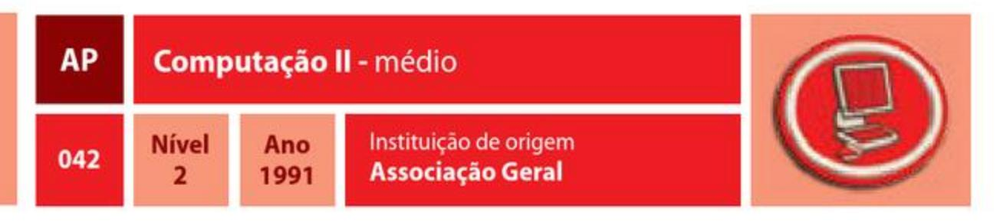

<!-- markdownlint-disable MD029 -->
# Atividades Profissionais

| Especialidade                         |  Ano  | Código | Número |
| ------------------------------------- | :---: | :----: | :----: |
| Conserto de sapatos                   | 1928  |   AP   |  001   |
| Fotografia                            | 1928  |   AP   |  002   |
| Mecânica automotiva                   | 1928  |   AP   |  003   |
| Radioamadorismo                       | 1928  |   AP   |  004   |
| Datilografia                          | 1929  |   AP   |  005   |
| Eletricidade                          | 1929  |   AP   |  006   |
| Carpintaria                           | 1929  |   AP   |  007   |
| Corte e costura                       | 1929  |   AP   |  008   |
| Taquigrafia                           | 1929  |   AP   |  009   |
| Tipografia                            | 1929  |   AP   |  010   |
| Marcenaria                            | 1934  |   AP   |  011   |
| Encadernação                          | 1935  |   AP   |  012   |
| Alvenaria                             | 1937  |   AP   |  013   |
| Barbearia                             | 1938  |   AP   |  014   |
| Colocação de papel de parede          | 1938  |   AP   |  015   |
| Contabilidade                         | 1938  |   AP   |  016   |
| Evangelismo                           | 1938  |   AP   |  017   |
| Hidráulica                            | 1938  |   AP   |  018   |
| Jornalismo                            | 1938  |   AP   |  019   |
| Ofício de alfaiate                    | 1938  |   AP   |  020   |
| Pintura de paredes exteriores         | 1938  |   AP   |  021   |
| Pintura de paredes interiores         | 1938  |   AP   |  022   |
| Radioeletrônica                       | 1938  |   AP   |  023   |
| Magistério                            | 1944  |   AP   |  024   |
| Corte e costura - avançado            | 1956  |   AP   |  025   |
| Radioamadorismo - avançado            | 1956  |   AP   |  026   |
| Mecânica automotiva - avançado        | 1964  |   AP   |  027   |
| Mecânica de pequenos motores          | 1975  |   AP   |  028   |
| Cães - cuidado e treinamento          | 1976  |   AP   |  029   |
| Serviço rádio do cidadão              |  --   |   AP   |  030   |
| Soldagem                              | 1978  |   AP   |  031   |
| Produção de vídeo                     |  --   |   AP   |  032   |
| Vendas                                | 2001  |   AP   |  033   |
| Internet                              | 2007  |   AP   |  034   |
| Internet - avançado                   |  --   |   AP   |  035   |
| Silvicultura                          | 2008  |   AP   |  036   |
| Administração                         | 2012  |   AP   |  037   |
| Bandeiras náuticas                    | 2012  |   AP   |  038   |
| Blogs                                 | 2012  |   AP   |  039   |
| Biblioteconomia                       | 2012  |   AP   |  040   |
| Computação I - básico                 | 1986  |   AP   |  041   |
| Computação II - médio                 | 1991  |   AP   |  042   |
| Computação III - regular              | 2012  |   AP   |  043   |
| Computação IV - avançado              | 2012  |   AP   |  044   |
| Computação V - especialista           | 2012  |   AP   |  045   |
| Código semafórico                     | 1953  |   AP   |  046   |
| Código morse                          | 1956  |   AP   |  047   |
| Cuidados e manutenção de violões      | 2012  |   AP   |  048   |
| Desenvolvimento de software           | 2012  |   AP   |  049   |
| Eletrônica                            | 2012  |   AP   |  050   |
| Intérprete de língua de sinais        | 2012  |   AP   |  051   |
| Informática programável               | 2012  |   AP   |  052   |
| Manutenção de bicicletas              | 2012  |   AP   |  053   |
| Marketing                             | 2012  |   AP   |  054   |
| Marketing - avançado                  | 2012  |   AP   |  055   |
| Modelagem têxtil                      | 2012  |   АP   |  056   |
| Montagem e manutenção de computadores | 2012  |   AP   |  057   |
| Noções de economia                    | 2012  |   AP   |  058   |
| Operação e manutenção de impressoras  | 2012  |   AP   |  059   |
| Restauro e conservação documental     | 2012  |   AP   |  060   |
| Secretariado                          | 2012  |   AP   |  061   |
| Torno mecânico                        | 2012  |   AP   |  062   |
| Web designer - básico                 | 2012  |   AP   |  063   |
| Web designer – avançado               | 2012  |   AP   |  064   |

## Conserto de sapatos

| AP  | Conserto de sapatos | Ano  | Instituição de origem |
| --- | ------------------- | ---- | --------------------- |
| 001 | Nível               | 1928 | Associação Geral      |

### REQUISITOS

1. Mencionar, pelo menos, 5 partes essenciais de um sapato e explicar suas utilidades.
2. Citar 3 diferentes tipos de solado de sapato. Qual o mais fácil para consertar?
3. Encerar uma linha e, com 2 agulhas ou pontas enceradas, consertar um par de sapatos que esteja esgarçado. Usar o método de ponto duplo para costurar o couro.
4. Fazer um molde de papel para meia-sola e usá-lo para cortar meias-solas de couro ou composição de borracha para um par de sapatos.
5. Fazer meia-sola de um par de sapatos fixando-a com pregos de sapateiro, certificando-se de que são do comprimento adequado.
6. Encaixar e prender um par de saltos de borracha.
7. Que tipo de couro deve ser usado para consertar solas de sapatos? Como, geralmente, é curtido este tipo de couro?
8. Especificar, pelo menos, 3 fatores que devem ser levados em consideração na seleção de sapatos.
9. Escrever ou apresentar aos examinadores os métodos apropriados de limpar e cuidar dos sapatos.

## Fotografia

### REQUISITOS

1. Explicar os princípios da construção de uma máquina fotográfica, o que faz a lente da câmera, o efeito da luz sobre o filme e a ação dos reveladores.
2. O que significa a "velocidade" do filme? O que significam ASA/ISO?
3. Como estão interligadas a velocidade do diafragma, a abertura da lente e a velocidade do filme?
4. Apresentar os principais usos da fotografia.
5. Explicar o que quer dizer "Pintar com a Luz".
6. Escolher fotos em papel ou slide, que ilustrem pelo menos oito das seguintes técnicas. Use outras fotos para fazer uma comparação:
   1. Enquadramento
   2. Balanço de branco
   3. Direção da luz frente, iluminação traseira, lateral
   4. Foco e profundidade de campo
   5. Regra dos tercos
   6. Ângulo nível dos olhos, alto e baixo
   7. Nível do horizonte
   8. Distância focal
   9. Uso de linhas guia
   10. Qualidade da luz sombra, luz do sol, hora do dia
   11. Exposição correta pouca exposição, exposição excessiva
   12. Uso do flash objetos à distância, e objetos que refletem luz
7. Explicar como fazer fotografia noturna e apresentar, no mínimo, 3 fotografias utilizando essa técnica.
8. Fazer uma das alternativas:
   1. Explicar como o filme preto e branco é revelado em negativo, e depois em papel
   2. Revelar e imprimir oito de suas próprias fotos, explicando cada passo.
   3. Preparar uma câmara escura e explicar o passo a passo da sua elaboração e construção.
   4. Construir uma câmera pinhole a partir de lata de alumínio ou caixa de sapatos
   5. e "fotografar", ao menos, 3 objetos com ela. Explicar o funcionamento da câmera e revelar as fotografias.
9. Contar uma história utilizando as técnicas de fotografia com até 10 fotos.
10. Fazer uma exposição fotográfica utilizando fotos coloridas e em preto e branco.

## Mecânica automotiva

### REQUISITOS

1. Demonstrar capacidade em ligar um carro. Explicar porque é necessário verificar periodicamente o óleo, água, combustível, pneus, freios e bateria.
2. Trocar um pneu de forma adequada e demonstrar como consertar um furo no mesmo.
3. Explicar o princípio dos motores de 4 e 2 ciclos e a diferença entre os motores a gasolina, diesel e etanol. Explicar as principais diferenças entre o sistema de carburador e o de injeção eletrônica.
4. Descrever a construção de um motor a gasolina e explicar resumidamente as funções das partes a seguir:
   1. Motor: virabrequim, bielas, pistões, eixo, válvulas, bomba de óleo, carburador, injetor de combustível, distribuidor da ignição, distribuidor do combustível, sistema elétrico, incluindo alternador, bateria e regulador.
   2. Diferença entre a transmissão manual e a automática e como o torque do motor é transmitido em ambos os casos.
   3. Diferença entre carros de tração dianteira e tração traseira.
   4. Diferença entre o freio a disco, ABS, freio de mão e freio hidráulico.
5. Realizar os serviços de manutenção automotiva a seguir:
   1. Verificar o nível do óleo do motor e transmissão.
   2. Verificar água. Trocar fluido do ar condicionado.
   3. Trocar óleo do motor e filtro do óleo.
   4. Trocar um conjunto de pneu/roda, seguindo as medidas de segurança adequadas.
   5. Lubrificar o chassi de acordo com o manual do veículo.
6. Com que frequência deve-se trocar o óleo do motor, óleo da transmissão e fluído do ar condicionado?
7. Apresentar algumas sugestões de cuidados do veículo, tanto interna como externamente.

## Radioamadorismo

### REQUISITOS

> NOTA: Ter, no mínimo, a licença de radioamador Classe D, ou preencher, pelo menos, os seguintes requisitos:

1. Receber e enviar corretamente, não menos que 5 palavras por minuto, durante 5 minutos, usando o Código Internacional Fonético e o Código Q (25 palavras de 5 letras no mínimo, 25 letras corretas consecutivas).
2. Explicar, pelo menos, 8 regras que regulamentam as atividades dos operadores de rádio.
3. Explique os termos abaixo e informar qual equipamento usado para medição:
   1. Energia elétrica
   2. Corrente elétrica
   3. Potência elétrica
4. Quais as abreviaturas para:
   1. Greenwich Mean Time
   2. Megaciclos
   3. Onda contínua
   4. Modulação de amplitude
   5. Modulação de frequência
   6. Kilociclos
   7. Eastern Standard Time
5. Dar a fórmula algébrica da Lei de Ohm e sua utilidade.
6. Explicar os seguintes termos:
   1. Amplificação
   2. Modulação
   3. Detecção
   4. Atenuação
7. Qual a relação entre uma freguência fundamental e sua segunda, terceira ou quarta harmônica?
8. Alguma transmissão pode ser feita sem a identificação da estação?
9. A que intervalos a estação amadora deveria transmitir seu sinal de chamada (CQ)?
10. Qual a função do filtro RFI (radio frequency interference)? Explicar como uma frequência de radio pode sofrer interferências.
11. Explicar a função dos seguintes componentes:
    1. Modulador RF
    2. Amplificador
    3. Retificador
    4. Filtro
12. Explicar o que são oscilações parasíticas (feed back).
13. Qual deve ser a potência para as válvulas que fornecem energia para a antena de um radioamador?
14. Explicar o termo "estado sólido", em radioamadorismo.
15. Por que retificadores e filtros são necessários no sistema de abastecimento de placa de energia quando operado a partir de corrente alternada? Quais são as regulamentações em sua área que regem operadores de radioamador?

## Datilografia

### REQUISITOS

1. Mostrar como limpar, escrever corretamente e mudar a fita numa máquina de escrever.
2. Saber a diferença entre um tecido e uma fita de carbono.
3. Conhecer as partes de uma máquina de escrever e saber a função de todas as suas teclas.
4. Saber como fazer tabulação. Datilografar uma página usando tabulação com, pelo menos, 4 colunas.
5. Demonstrar como centralizar o texto horizontal e verticalmente.
6. Demonstrar como fazer letras em itálico e negrito.
7. Operar uma máquina de escrever a uma velocidade de 40 palavras por minuto (mínimo) em material novo, durante 5 minutos, com não mais de 5 erros.

## Eletricidade

### REQUISITOS

1. Ser capaz de explicar e ilustrar um experimento através do qual as leis de atração e repulsão elétricas são demonstradas.
2. Explicar a diferença entre correntes contínua e alternada e demonstrar as utilidades de cada uma. Apresentar um método para determinar que tipo de fluxo tem cada circuito.
3. Fazer um eletroímã simples, ou ligar uma campainha ou lâmpada a uma bateria, usando um interruptor em linha.
4. Montar e colocar para funcionar um motor elétrico simples, a partir de um kit, ou desmontar um motor elétrico e identificar as partes e explicar como funcionam.
5. Ser capaz de construir uma bateria elétrica.
6. O que é um fusível e qual sua finalidade? Demonstrar habilidade para substituir fusíveis e rearmar disjuntores e mostrar a forma correta de emendar fios elétricos.
7. Mostrar como resgatar uma pessoa em contato com a corrente elétrica e ter
conhecimento dos procedimentos de primeiros socorros a serem adotados.
8. Fazer um diagrama do sistema de iluminação de um automóvel.
9. Fazer um diagrama que mostre como lâmpadas, interruptores e tomadas são controlados por cada fusível ou disjuntor em uma casa.
10. Ler um medidor (relógio) de eletricidade corretamente e calcular a conta de energia de uma residência com as taxas cobradas em sua região.
11. Qual a relação entre intensidade e tensão de uma corrente elétrica descrita na lei de Ohm?
12. Demonstrar como usar uma chave de teste e quais as medidas de segurança que devem ser tomadas ao manusear uma rede elétrica.
13. Qual a diferença entre Watt e Volt?
14. Explique o que é efeito joule ou efeito térmico.

## Carpintaria

### REQUISITOS

1. Demonstrar a maneira apropriada de pregar, assentar e dobrar um prego, e arrancálo com martelo de orelhas.
2. Explicar para que tipo de trabalho são indicadas as seguintes ferramentas e demonstrar o uso de cada uma:
   1. Caixa de corte
   2. Serra circular
   3. Serrote
   4. Plaina
   5. Esquadro
   6. Pregos e parafusos de diversos tamanhos e espessuras
   7. Formões
   8. Nível
   9. Prumo
   10. Furadeira
   11. Marreta de borracha
3. Fazer um retângulo usando as seguintes dimensões: 6 cm, 8 cm, 10 cm e provar por sua diagonal que as medidas são equivalentes.
4. Descrever o uso e distinguir 6 diferentes tipos de pregos.
5. Construir um dos objetos a seguir, com tamanho mínimo de 1,20 m por 1,20 m:
   1. Armário de ferramentas
   2. Casa de bonecas
   3. Casa de cachorro
6. Para o projeto do requisito 5 desta especialidade, atenda às seguintes exigências:
   1. Utilize o telhado de madeira, com testeira, cumeeira e com 3 ou 4 águas
   2. O projeto deve apresentar, pelo menos, 2 pisos, ambos bem nivelados
   3. 2 portas, uma com abertura frontal e a outra lateral
7. Pesquisar em uma Bíblia traduzida em Linguagem atual, quais eram as medidas contidas no projeto descrito em Gênesis 6:14-16. Com base nessa pesquisa, faça um desenho mostrando como seria esse projeto se fosse construído por você, seguindo essas mesmas especificações.

## Corte e costura

### REQUISITOS

1. Ter a especialidade Costura básica (HD 009).
2. Identificar amostras de diferentes tecidos, incluindo algodão, linho, lã, seda, cetim, nylon, flanela, brim, microfibra, oxford, lycra, malha.
3. Ter uma caixa de costura para o seu material, incluindo: almofada para alfinetes, fita métrica, alfinetes, agulhas, linha, tesoura, lápis e giz.
4. Demonstrar como endireitar o tecido antes do uso.
5. Demonstrar como colocar o molde sobre o tecido, de acordo com o desenho do molde.
6. Demonstrar como usar um abridor de casas.
7. Demonstrar as seguintes técnicas de costura:
   1. Overlocar
   2. Franzir
   3. Chulear
   4. Pespontar
   5. Fazer nervura
8. Fazer uma das opções a seguir:
   1. Uma saia, colocando zíper e costura no cós. A barra da saia deve ser feita de forma que a mesma não tenha pontas.
   2. Uma blusa. Explicar como faria para ajustar os ombros para pessoas de diferentes tipos físicos.

## Taquigrafia

### REQUISITOS

1. O que é taquigrafia?
2. Onde essa profissão é mais praticada e qual a sua importância?
3. Ter um dicionário de taquigrafia disponível (geralmente fornecido pelos editores do curso).
4. Ser capaz de anotar um ditado, ao ritmo de 80 palavras por minuto, durante 3 minutos consecutivos e transcrever corretamente as anotações feitas.

## Tipografia

### REQUISITOS

1. Conhecer os princípios e funcionamento dos seguintes equipamentos:
   1. Prensa rotativa
   2. Máquina de offset
   3. Copiadora
   4. Impressora tipográfica
2. Saber como é determinado o peso do papel. Conhecer os tipos diferentes de papel e para que são usados:
   1. Compensar
   2. Vínculo
   3. Cubra peso
   4. Índice
3. Fazer uma visita a uma gráfica ou à sede de um jornal de sua cidade. Escrever um relatório de 300 palavras ou apresentar ou relatório oral, de 3 minutos, sobre os passos que você observou no processo de impressão.
4. Fazer uma pesquisa para aprender sobre a história da impressão tipográfica. Traçar o desenvolvimento da impressão e como o equipamento tipográfico evoluiu até o presente.
5. Conhecer as diferentes tintas existentes para a impressão e suas características.
6. Saber o significado dos seguintes termos:
   1. Degoladura
   2. Negrito
   3. Cabeçalho
   4. Fonte
   5. Entalho
   6. Acabamento
   7. Negativo
   8. Clipart
   9. Colagem
   10. Separação de cores
   11. Contato
   12. Baixo relevo
   13. Alto relevo
   14. Gravação
   15. Padrão
   16. Registro
   17. Termografia
   18. Marca d'água
   19. Realçar
   20. Impressão
   21. Comparar
   22. Apagado
   23. Desgravação
   24. Gravação (alto relevo)
   25. Gravação (baixo relevo)
7. Saber a diferença entre meios tons, duplos tons e o processo de 4 cores.
8. Entrevistar um tipógrafo para descobrir o seguinte:
   1. Que formação é necessária para entrar no campo da tipografia?
   2. Que oportunidades de crescimento existem nessa área?
   3. Que futuro o setor de gráficas pode esperar?
   4. O que faz, em sua empresa, para deixar os clientes satisfeitos?
   5. Que oportunidades de carreira existem, relacionados à tipografia?

## Marcenaria

### REQUISITOS

1. Explicar como os processos a seguir estão relacionados ao trabalho com madeira e como cada um deles é feito:
   1. Cultivo de árvores
   2. Extração
   3. Corte da madeira
   4. Tratamento
   5. Cura
   6. Aplanamento
2. Coletar e classificar cinco diferentes tipos de madeira usados no trabalho de marcenaria. Explicar as vantagens e desvantagens de cada uma.
3. Explique a função de cada um dos equipamentos abaixo. Explicar as regras de
segurança de cada uma delas, os cuidados de conservação, demonstrando, na prática, sua utilidade:
   1. Plaina manual
   2. Serra esquadrejadeira
   3. Desengrossadeira
   4. Lima
   5. Tupia
   6. Coladeira de Bordo
   7. Trena
   8. Formão
   9. Esquadro
   10. Furadeira
4. Explicar os encaixes a seguir:
   1. Rabo de andorinha
   2. Espiga
   3. Meia esquadria
   4. Encaixe de toco
   5. Chanfro
5. Conhecer as características e saber trabalhar com os seguintes materiais:
   1. Compensado
   2. Aglomerado
   3. Madeira bruta
6. Conhecer, pelo menos, duas técnicas de acabamento para MDF.
7. Demonstrar a técnica apropriada de colar e fixar madeira.
8. Fazer um objeto de mobília para uma casa, como uma pequena casa, um banquinho,
escrivaninha ou estante de livros. Relacionar o material necessário para o seu projeto.
9. Conhecer e praticar os passos adequados para fazer um acabamento num objeto de madeira, com polimento simples ou com pintura.
10. Fazer dois dos seguintes:
    1. Fazer uma porta ou tampo com dobradiças internas
    2. Fazer uma maquete de casa ou prédio com uma seção que mostre detalhes do interior
    3. Ajudar a fazer e/ou consertar brinquedos de madeira para crianças carentes
    4. Fazer um projeto usando um dos encaixes mencionados no item 4

## Encadernação

### REQUISITOS

1. Identificar os seguintes termos:
   1. Miolo
   2. Guardas
   3. Brochuras
   4. Folha de rosto
   5. Dorso
   6. Assinatura
   7. Capa dura
2. Descrever a diferença entre os seguintes métodos de encadernação:
   1. Ligação perfeita
   2. Capa dura
   3. Assinatura simples
   4. Espiral (metal e plástico)
   5. Grampeamento
3. Realizar o seguinte:
   1. Encadernar um "manuscrito" de um caderno só.
   2. Encadernar um livro em branco, usando, pelo menos, 4 cadernos.
   3. Demonstrar a maneira correta de agrupar novas encadernações.
   4. Fazer uma capa para seu livro de, pelo menos, 4 cadernos.
4. Identificar e descrever as utilidades das seguintes ferramentas de encadernação:
   1. Máquina de costura de caderno
   2. Máquina de lombada quadrada
   3. Furadores
5. Definir a diferença de peso de papel em relação a uma resma de papel.
6. Descrever a cor e as propriedades de 2 tipos de adesivos usados no processo de encadernação e onde são usados:
   1. Cola quente
   2. Cola de resina
7. Conhecer e relacionar os 5 principais estágios da encadernação à mão.
   1. Preparação dos cadernos
   2. Costura dos cadernos
   3. Cola
   4. Fixação das capas
   5. Acabamento

## Alvenaria

### REQUISITOS

> Observação: Necessário o acompanhamento de um mestre de obras ou pedreiro.

1. Cite, pelo menos, 6 materiais de construção usados por pedreiros na edificação de paredes ou construções.
2. Demonstrar habilidade para usar corretamente o prumo, nível, colher de pedreiro, martelo de pedreiro, desempeno(desenpenadeira, flatache) linha e mangueira de nível.
3. Conhecer as características do cimento usado na construção (CP II e CP III) e saber como evitar que ele fique ralo, que tenha rachaduras, que encolha ou esfarele.
4. Fazer argamassa e explicar a proporção adequada dos ingredientes, como cal, areia, pedra, água, etc., em 2 das seguintes aplicações:
   1. Assentamento de tijolos ou blocos
   2. Argamassa para contrapiso
   3. Concretagem de laje ou baldrame
5. Construir um muro reto de pedras, tijolos ou blocos de, pelo menos, 1,20 m de altura e 3 metros de comprimento. O muro deve ter um canto (esquina). A superfície deve ser alisada.
6. Construir uma escada com, pelo menos, 2 degraus bem nivelados, usando argamassa misturada por você mesmo e os reforços apropriados, como caixaria e ferragens.
7. Fazer as fôrmas e fazer um pedaço de calçada ou chão de concreto, usando argamassa comprada pronta ou fazer a argamassa. Faça o acabamento e verifique se ficou bem nivelado.
8. Escrever um parágrafo descrevendo o comportamento do cimento: o que é, sua reação à água, suas qualidades adesivas, quanto tempo demora para secar, etc.
9. Saber como tirar o esquadro de um determinado local (terreno, sala, etc.).
10. Conhecer o processo de fabricação dos tijolos da sua região e diferenciar um tijolo queimado de um tijolo comum de 8 furos.
11. Qual a diferença entre cal virgem e cal hidratada? Quais os cuidados que devemos ter ao lidar com esses materiais?
12. Pesquise na Bíblia como deve ser a edificação de uma casa? A que Jesus a compara?

## Barbearia

### REQUISITOS

1. Passar um mínimo de 5 horas observando um barbeiro/cabeleireiro enquanto este TRABALHA.
2. Mencionar 3 cuidados essenciais no tratamento de cabelos.
3. Como descartar a lâmina usada de uma navalha?
4. Demonstrar habilidade de lavar cabelos com xampu corretamente.
5. Explicar e demonstrar, pelo menos, 2 métodos de cortar cabelos.
6. Explicar e demonstrar o propósito de, pelo menos, 2 tipos diferentes de pentes usados em cortes de cabelos.
7. Explicar e demonstrar o propósito de 2 tipos diferentes de tesouras.
8. Explicar e demonstrar, pelo menos, 2 propósitos para o uso da máquina de cortar cabelo.
9. Realizar um estágio em barbearia ou salão e escrever uma redação de, pelo menos, 500 palavras sobre o que você aprendeu.

## Colocação de papel de parede

### REQUISITOS

1. Descrever o preparo adequado de uma parede para a colocação de papel de parede.
2. Explicar como prender o papel de parede, descrevendo, pelo menos, 2 métodos.
3. Usando um método citado na questão anterior, colocar um papel de parede em, pelo menos, 2 paredes de uma casa (quarto, sala, cozinha, etc.).
4. Demonstrar como encaixar bem um desenho na parede que será trabalhada.
5. Usar a sua criatividade desenhando algumas combinações de papel de parede para o seguinte:
   1. Sala
   2. Cozinha
   3. Banheiro
   4. Quarto
   5. Salão de Jogos
   6. Igreja

## Contabilidade

### REQUISITOS

1. Definir contabilidade.
2. O que é o método das partidas dobradas?
3. O que é balanço patrimonial?
4. Demonstrar a estrutura do balanço patrimonial em conformidade com as Normas Internacionais de contabilidade (IFRS - International Financial Reporting Standard).
5. Explicar o que é: Ativo, passivo e patrimônio líquido.
6. Ser capaz de classificar corretamente itens de um balanço com ativos de curto e longo prazo, passivos de curto e longo prazo e lucro líquido.
7. Explicar o que são créditos e débitos na contabilidade. Por que as contas dos ativos são chamadas de contas devedoras e do passivo de credores?
8. Ser capaz de escrever um extrato de rendimentos a partir de um balancete.
9. Ser capaz de encaixar as informações de um extrato de banco em contas correntes, incluindo: taxas de serviços, juros e cheques que ainda não foram depositados.
10. Manter um relatório preciso de entradas e saídas do seu Clube ou unidade durante, no mínimo, 6 meses.

## Evangelismo

### REQUISITOS

1. Demonstrar que você tem uma vida devocional pessoal durante, pelo menos, 6 meses.
2. Montar um organograma com os Departamentos e Presidência atual de sua Associação/Missão. Citar o nome completo de cada departamental e sua biografia.
3. Entrevistar seu pastor distrital e obter as seguintes informações de seu serviço ministerial junto à Igreja:
   1. Trabalho Pastoral
      1. Como ele faz as visitas.
      2. Qual é seu trabalho junto à Comissão da Igreja.
      3. Como ele monta seu itinerário pastoral.
      4. Como ele usufrui sua folga semanal.
      5. Como ele monta seu calendário de pregações (homilético).
   2. Pessoal
      1. Como conheceu o evangelho.
      2. Como se tornou um evangelista.
      3. Qual a parte mais gratificante de seu ministério.
      4. Qual é a parte mais difícil de seu ministério.
      5. Como soube que Deus o chamara para o ministério.
      6. Que conselho daria a alguém que estivesse pensando em tornar-se um ministro.
      7. Descrição resumida de todos os distritos por onde ele atuou.
      8. Qual sua rotina de estudo pessoal da Bíblia.
      9. Uma história que marcou a sua vida de evangelista.
4. Evangelizador
   1. Como você ganha almas.
   2. Como se forma seu alvo batismal.
   3. Como o evangelismo entra na área de ganhar almas.
   4. Como está planejado seu programa de evangelismo para esse ano.
   5. Fazer um breve relatório de cada requisito.
5. Através do estudo da Bíblia e do Espírito de Profecia, aprender como Jesus tratava as multidões que O procuravam. Citar, pelo menos, 2 passagens bíblicas e mais 2 do Espírito de Profecia.
6. Participar de 3 atividades práticas na área de Evangelismo:
   1. Participar numa série evangelística liderada pelos jovens.
   2. Utilizando uma das coleções de cursos bíblicos existentes, dar estudos bíblicos a alguém que esteja se preparando para o batismo.
   3. Fazer 4 visitas a hospitais, fazendo um pequeno momento devocional e uma oração em cada uma delas.
   4. Pregar um sermão de, pelo menos, 20 minutos de duração.
   5. Fazer os momentos devocionais em 2 cultos noturnos e em 2 matutinos num acampamento.
   6. Em 5 dias diferentes, realizar momentos devocionais na escola ou no seu trabalho.
   7. Assistir 75% das reuniões de uma série de conferências de sua igreja local, obter as seguintes informações cada noite:
      1. Comparar o número de presentes em cada um dos assuntos apresentados.
      2. Fazer uma lista dos temas apresentados e entender o porquê foi usado nessa sequência.
      3. Fazer, pelo menos, 10 visitas a interessados, sozinho ou com obreiro ou irmãos envolvidos no programa.
7. Entregar em um breve relatório a biografia de, pelo menos, 3 grandes evangelistas cristãos, pelo menos um deles adventista.
8. Ter uma coleção de sermões, escritos ou digitais, de um evangelista adventista, através da rede de comunicação da Igreja.

## Hidráulica

### REQUISITOS

> Observação: Necessário o acompanhamento de um técnico hidráulico.

1. Fazer um diagrama mostrando o sistema de encanamento de uma casa de 4 cômodos, incluindo saídas de água para a cozinha, banheiro e área de serviço.
2. Demonstrar como consertar dois canos de aço galvanizado de forma correta.
3. Demonstrar como consertar um cano de pvc e um cano de cobre.
4. Demonstrar habilidade para consertar uma torneira de pia que apresente vazamento e trocar ou consertar a válvula de fluxo do vaso sanitário.
5. Descrever o sistema de drenagem adequado para a casa do item 1 e explicar onde se usam e qual a utilidade dos sifões e a ventilação.
6. Saber como funciona o sistema de água quente e fria de uma casa fazendo um esquema hidráulico e definindo cada tipo de tubulação utilizada em cada sistema.
7. Fazer um diagrama de aquecimento de água utilizando a energia solar e aplicá-la em um acampamento de seu clube.

## Jornalismo

### REQUISITOS

> **NOTA**: necessário instrutor qualificado. Todos os trabalhos realizados nesta especialidade devem estar de acordo com a norma culta padrão da língua oficial de seu país.

1. Discutir com seu instrutor as seguintes frases e relatar, por escrito, as conclusões obtidas:
    1. "O jornalismo é o oxigênio da Democracia." José Marques de Melo, professor de Jornalismo na Universidade Metodista de São Paulo.
    2. "Se tivesse que decidir se devemos ter governo sem jornais ou jornais sem governo, eu não vacilaria um instante em preferir o último."Thomas Jefferson, presidente norte-americano.
    3. "Sin la plena vigencia de la libertad de expresión, la democracia es una ficción." Carlos Pérez Giménez, jornalista argentino.
2. Que formação é útil para quem deseja seguir a carreira em jornalismo?
3. Que tipos de empregos estão à disposição para aqueles que se interessam pelo jornalismo?
4. Ler a história de II Samuel 18: 9-32. Discutir com seu instrutor as características das 2 formas de se dar uma notícia apresentadas nesta história. Qual a importância das palavras, da ética e da fidelidade aos fatos?
5. O que é mídia e quais os principais meios de comunicação utilizados no jornalismo atualmente? Citar as principais diferenças entre eles.
6. Descrever o significado básico destas expressões utilizadas pelos jornalistas:
    1. Pauta
    2. Redação
    3. Lauda
    4. Fonte
    5. Nota
    6. Dead
    7. Intertítulo
    8. Foto-legenda
    9. Artigo
    10. Reportagem
    11. Editorial
    12. Coluna
    13. Escalada
    14. Furo
7. Descrever os elementos de um bom parágrafo de abertura e a utilidade e importância das manchetes ou chamadas de uma notícia.
8. Quais os passos essenciais para se escrever uma boa história?
9. Escrever uma história sobre um dos assuntos a seguir:
    1. Sua família. Como sua família aceitou a Cristo? Você foi o primeiro, seus pais ou seus avós? Etc.
    2. Experiências com Deus. Experiências pessoais de orações atendidas ou momentos que você viu a mão de Deus guiando seus passos e decisões bem de perto.
    3. Bichinhos de Estimação. Contar alguma história interessante que tenha acontecido com algum animalzinho de estimação que você teve/tem.
    4. Acampamentos. Alguma experiência inesquecível que você teve em algum acampamento.
    5. Conversão. Contar sobre quando Deus tornou-se real para você como amigo e Salvador pessoal.
    6. Ser Cristão. Escrever sobre o que você acha mais difícil para um cristão atualmente.
10. Responder o seguinte:
    1. Quais os elementos básicos para se escrever uma notícia?
    2. Estabelecer a relação entre uma boa notícia e o roteiro inicial de perguntas para escrevê-la: O que? Como? Quando? Onde? Por quê? Quem?
11. Escrever a um editor de qualquer veículo, solicitando algumas dicas para escrever uma boa notícia. Transformar estas dicas em uma apresentação aos colegas de sua unidade ou clube.
12. Escrever uma notícia com, pelo menos, 3 parágrafos, usando um bom parágrafo de abertura sobre algo interessante que aconteceu em sua igreja, escola, em casa ou no Clube de Desbravadores.
13. Publicar uma notícia em um veículo de comunicação, impresso, eletrônico ou digital. Pode ser em um blog, página de seu clube ou igreja, um jornal do bairro ou revista. Podem ser veículos seculares ou da Igreja Adventista.
14. Saber como escrever uma carta de apresentação para o editor a quem vai enviar sua notícia. Pode ser também uma história ou artigo. Escrever esta carta e enviá-la junto com seu texto.
15. Marcar uma visita a um dos veículos de comunicação de sua cidade: jornal, editora de revista, rádio, emissora ou retransmissora de TV, etc. Conhecer o funcionamento da redação de jornalismo deste veículo. Como funciona o dia a dia de trabalho de um jornalista nele?

## Ofício de alfaiate

### REQUISITOS

1. Identificar os tecidos a seguir:
    1. Lã
    2. Microfibra
    3. Algodão
    4. Linho
    5. Seda
    6. Cambraia de linho
    7. Algodão egípcio
    8. Gabardine
    9. Tricoline
2. Como são usados os itens a seguir:
    1. Entretela
    2. Alinhavos
    3. Tecido para forrar
    4. Feltro
3. Explicar os pontos que devem ser observados para que um traje vista bem e demonstre o toque de um alfaiate.
4. Saber como utilizar os instrumentos de passar roupas de acordo com a peca e com o tecido trabalhado.
5. Saber fazer casas de botões.
6. Fazer um bolso sem aba e outro com aba.
7. Demonstrar suas habilidades como alfaiate, medindo, cortando e confeccionando um traje masculino (blazer ou paletó e calça social) ou feminino (Blazer e saia ou vestido) que tenha bom caimento.

## Pintura de paredes exteriores

### REQUISITOS

1. Diferenciar e explicar a diferença entre tintas para paredes externas e internas.
2. Explicar como preparar uma parede para pintura, incluindo passos para a remoção de pintura velha, primeira demão de tinta, aplicação de massa corrida, acabamento, etc.
3. Relacionar 10 combinações de cores para pintura de uma casa (se possível, usar uma tabela de marca conhecida).
4. Explicar e demonstrar como preparar e pintar uma peça em metal, ex: porta, janela.
5. Citar, pelo menos, 3 tipos de solventes (thinner) e explicar o uso específico de cada um.
6. Demonstrar habilidade para pintar usando corretamente pincel, rolo e spray.
7. Pintar a parte externa de uma casa de, pelo menos, 4 cômodos (se possível, transformar esta tarefa num projeto em grupo, para ajudar alguém da igreja ou comunidade que esteja precisando deste serviço).
8. Quais medidas tomar nas seguintes ocasiões:
    1. Quando a pintura descasca
    2. Quando a tinta fica com aparência de couro de jacaré
    3. Surgimento de bolhas
    4. Mofos
    5. Tinta que não seca
9. Quais os EPI's necessários para trabalhar com pinturas em exteriores e materiais químicos?

## Pintura de paredes interiores

### REQUISITOS

1. Explicar como preparar a madeira para receber verniz.
2. Explicar e demonstrar como preparar e dar o acabamento em madeira usando as seguintes técnicas:
    1. Clareamento
    2. Verniz
    3. Pintura
3. Mencionar 2 métodos de fazer textura em paredes.
4. Em que situação se deve usar um revólver de tinta (pistola de pintura) e saber como regular a pressão correta para a pintura.
5. Descrever os métodos adequados de limpar e cuidar de pincéis de pintura e verniz.
6. Demonstrar como usar corretamente a massa corrida.
7. Explicar a diferença de tintas para pintura externa e interna.
8. Fazer uma lista de 10 combinações de cores para pintura de interiores, usando tabela de cores de alguma marca conhecida. Por que as cores fortes não são aconselháveis?
9. Explicar a composição das seguintes tintas e em que situações devem ser usadas:
    1. Tinta com brilho
    2. Tinta fosca
    3. Tinta solúvel em água
10. Pintar as partes de madeira de, pelo menos, 4 cômodos.
11. Pintar, pelo menos, 1 cômodo inteiro.
12. Qual a diferença entre massa corrida e cal fina?
13. Saber a proporção correta para diluição dos seguintes tipos de tintas:
    1. Látex ou PVA
    2. Acrílica
    3. Esmalte
    4. Verniz
    5. Óleo
    6. Epóxi
14. Saber quais cuidados ter e os EPI's necessários para se trabalhar com pintura interna.

## Radioeletrônia

### REQUISITOS

1. Explicar, com diagramas, quando necessário, os dispositivos de entrada utilizados em rádios, por exemplo, antena, terra; ou, dispositivos eletrônicos, tais como sinalizador FM, fotocélula, captador de fotos e microfone.
2. Construir uma antena receptora de rádio; OU construir um toca-discos, fotocélula ou microfone.
3. Explicar o uso e operação de vários componentes importantes de um aparelho receptor simples (bobinas, capacitores variáveis, capacitores fixos, resistores, transistores ou válvulas, diodos e transformadores).
4. Identificar o valor de resistores pelo código de cores.
5. Conhecer a lei de Ohm e como a mesma é aplicada.
6. Construir um rádio simples (com válvula ou transistor) incluindo fonte, que deverá sintonizar estações a 160 quilômetros de distância, ou construir um amplificador de alta fidelidade.
7. Desenhar de memória, usando símbolos apropriados, um esquema completo do dispositivo construído no item anterior.
8. Mostrar fluência na resolução de problemas em sintonizadores simples ou dispositivos eletrônicos de 3 a 6 válvulas ou transistores, demonstrando aptidão para seguir testes de rotina assim como: retirar válvulas ou transistores e testá-los, substituí-los corretamente, verificando se os capacitores estão em curto e se há outros problemas.

## Magistério

### REQUISITOS

1. Ter, no mínimo, 15 anos ou estar no 1º ano do Ensino Médio.
2. Que formação é necessária para lecionar no:
    1. Educação infantil
    2. Ensino fundamental
    3. Ensino médio
    4. Ensino técnico
    5. Graduação
    6. Especialização (Pós-graduação lato sensu)
    7. Mestrado
    8. Doutorado
3. Qual a diferença entre licenciatura e bacharelado?
4. O que é necessário para a habilitação profissional do professor no seu Estado/País?
5. O que é formação continuada e qual a sua importância para os professores?
6. Entreviste, pelo menos, 2 professores com as seguintes perguntas:
    1. Por que decidiu tornar-se professor?
    2. Que parte do magistério mais lhe agrada?
    3. Que parte do magistério menos lhe agrada?
    4. Que tipos de preparativos faz antes de começar o ano letivo?
    5. Que tipo de preparativos faz antes de um dia de aulas?
    6. Que atividades relacionadas ao seu trabalho você faz após o horário de trabalho?
    7. Quais algumas qualidades de um bom professor?
    8. Quais as responsabilidades e deveres de um professor?
7. Pesquisar a Bíblia e o livro Educação em busca dos métodos de ensino que Jesus usava. Apresentar os resultados dessa pesquisa num relatório escrito de, no mínimo, 3 páginas ou oral de, no mínimo, 10 minutos.
8. Cumprir 3 dos seguintes:
    1. Ajudar um professor, no mínimo, 4 horas por semana, durante 4 semanas a:
        1. Planejar materiais audiovisuais para o ensino de um conteúdo na sala de aula.
        2. Preparar o plano de aula.
        3. Ensinar, pelo menos, um aspecto de um determinado tópico a uma criança ou a uma classe inteira.
    2. Ensinar uma classe de Escola Sabatina - crianças ou adultos - durante, no mínimo, 1 trimestre.
    3. Ensinar 3 especialidades (de três áreas diferentes) a um grupo de, no mínimo, 4 desbravadores. Para as especialidades preparar:
        1. Plano de aula
        2. Materiais didáticos
        3. Avaliação
    4. Ser instrutor ativo de uma Classe Regular e investir, no mínimo, 70% do grupo de desbravadores. Preparar:
        1. Planejamento de instruções
        2. Plano de aula para todos os requisitos
        3. Material didático
    5. Ser professor de Educação Infantil, Ensino Fundamental, Ensino Médio, Ensino Técnico ou Ensino Superior por, no mínimo, 1 ano.

## Corte e costura - avançado

### REQUISITOS

1. Ter a especialidade em Corte e costura.
2. Explicar como fazer, pelo menos, 4 tipos das alterações a seguir:
    1. Encurtar o corpo
    2. Aumentar o comprimento do corpo
    3. Aumentar a manga
    4. Tamanho da cintura
    5. Aumentar ou diminuir o comprimento de saia ou calça
    6. Encurtar barra de calça
3. Selecionar, a partir de fotos de revistas ou desenhar, uma roupa para si mesmo que demonstre harmonia de cores e que combine com seu tipo físico.
4. Demonstrar como pregar um zíper invisível.
5. Saber como combinar o tipo de decido com o modelo da roupa.
6. Fazer uma casa de botão à máquina.
7. Fazer uma camisa com manga e gola.
8. Fazer uma calça ou shorts com bom caimento.
9. Fazer um dos seguintes:
    1. Saia godê com barra
    2. Blazer
    3. Saia de prega
10. Fazer um uniforme de gala completo, de acordo com o Regulamento de Uniformes do Ministério Jovem da Divisão Sul Americana.

## Radioamadorismo - avançado

### REQUISITOS

1. Ter a especialidade de Radioamadorismo.
2. Ter a especialidade de Código Morse.
3. Ter a licença de Radioamadorismo Classe C.

## Mecânica automotiva - avançado

### REQUISITOS

1. Ter a especialidade de Mecânica automotiva.
2. Desmontar, verificar e montar outra vez um motor de automóvel, ou de um pequeno caminhão. Substituir quaisquer peças que apresentem defeito ou desgaste. Recolocar o motor no lugar, dar partida e dirigir o veículo. Manter um relato completo de tudo que foi feito no motor.
3. Remover e substituir um sistema de transmissão manual ou automático.
4. Reconstruir o sistema de freios de um automóvel ou pequeno caminhão, seguindo as medidas de segurança adequadas. Demonstrar o ajuste adequado de freios.
5. Regular o motor, incluindo a troca de velas, se for o caso.

## Mecânica de pequenos motores

### REQUISITOS

1. Descrever o projeto e operação do motor 2 tempos e do motor 4 tempos.
2. Nomear as peças do motor de 2 tempos e dizer para que serve cada parte.
3. Listar os tipos de combustível utilizados em motores pequenos e explicar seu funcionamento.
4. Mostrar os cuidados de segurança no manuseio e armazenamento do combustível.
5. Descrever 2 tipos de sistema de ignição.
6. Listar 2 fluidos de limpeza aceitáveis para os motores pequenos. (Por que a gasolina é um fluido de limpeza impróprio?).
7. Listar e contar como 3 sistemas de lubrificação básicos operam.
8. Listar, por ordem, os procedimentos adequados para a resolução de problemas em geral.
9. Demonstrar como rever, limpar, inspecionar, montar e ajustar adequadamente qualquer pequeno motor.
10. Demonstrar como testar e limpar velas e velas de incandescência.

## Cães - cuidados e treinamento

### REQUISITOS

> **Observação:** É obrigatório o acompanhamento de um instrutor ou profissional na área de soldagem, pois é uma habilidade de aprendizado arriscada e requer muita seriedade. Não é um curso do tipo doméstico. A soldagem tem como objetivo substituir parafusos, pinos, rebites, vedar e etc. Se não for feita corretamente, favorecerá o acontecimento de um acidente. Exemplo: Em um engate de carro não soldado adequadamente; o risco de ceder com a tração ou peso é de uma porcentagem bem alta.

1. Descrever os cuidados necessários para a adoção de um cão. Explicar o seguinte:
    1. Como selecionar um cão (o que é necessário para uma escolha responsável)
    2. Registro (para cães de canil, "pedigree")
    3. Cuidados veterinários/vermifugação/vacinação
2. Fazer, pelo menos, 2 dos seguintes:
    1. Descrever o que pode ser feito para remover ectoparasitas (pulgas, carrapatos e outros) de seu cão.
    2. Mencionar algumas doenças, pragas e pestes que os cães podem adquirir.
    3. Explicar o que você deve fazer após uma mordida de cão.
3. Descrever as maneiras de como educar um filhote (necessidades fisiológicas, destruição de objetos).
4. Explicar em detalhes como se deve dar banho em um cão e quais os cuidados gerais para sua higiene.
5. Assumir a responsabilidade e compromisso de alimentar e dar água a um cão durante o período de, pelo menos, 2 a 3 meses.
6. Treinar seu cão até que vocês possam demonstrar com sucesso o seguinte:
    1. Junto: Seu cão deve andar ao seu lado esquerdo e sentar quando você parar. Seu cão deve ficar sentado sem interesses alheios (pessoas, outros animais e alimentos em gerais).
    2. Parado para exame: Seu cão deve permitir que juízes e médicos o toquem.
    3. Chamado: Seu cão vem quando chamado (pelo nome), senta-se diretamente à sua frente e se move para seu lado esquerdo ao comando de junto.
    4. Ficar: o cão fica sentado ou deitado por tempo indeterminado, saindo somente sob comando.

> Se possível, os cães e condutores devem receber instruções de um professor qualificado, de preferência em local específico para aula teórica e prática junto com o cão. Um certificado devidamente reconhecido, comprovando que o dono ensinou os comandos básicos ao cão e este aprendeu a executar cumpre este requisito.

## Serviço rádio do cidadão

### REQUISITOS

1. Onde e com que finalidade foi criado o Serviço Rádio do Cidadão (ou PX)?
2. Estar familiarizado com os requisitos para obter a licença de operador de estação PX.
3. Conhecer as frequências superiores e inferiores de rádios de AF/HF (Alta Frequência) e UAF/UHF (Ultra Alta Frequência) de PX. Conhecer as seguintes frequências:
    1. Canais de emergência (AF e UAF)
    2. Canais de rodovia
    3. Canais de chamada e escuta (AF, AM, SSB e UAF)
    4. Chamada de emergência marítima
4. Conhecer a função dos seguintes controles:
    1. Seletor de canais
    2. Volume
    3. Ganho (amplificador) de RF
    4. Squelch (atenuador/silenciador)
    5. Chave de filtro NB
5. Instalar corretamente um Serviço Rádio do Cidadão fixo ou móvel, incluindo a antena.
6. O que é Código Fonético Internacional e qual sua importância para os operadores PX? Citar de memória 15 termos desse código, dentre os mais utilizados.
7. Demonstrar habilidade em responder corretamente a uma chamada e transmissão PX, por AF ou UAF, utilizando o código fonético internacional.

## Soldagem

### REQUISITOS

> **Observação:** É obrigatório o acompanhamento de um instrutor ou profissional na área de soldagem, pois é uma habilidade de aprendizado arriscada e requer muita seriedade. Não é um curso do tipo doméstico. A soldagem tem como objetivo substituir parafusos, pinos, rebites, vedar e etc. Se não for feita corretamente, favorecerá o acontecimento de um acidente. Exemplo: Em um engate de carro não soldado adequadamente; o risco de ceder com a tração ou peso é de uma porcentagem bem alta.

1. Defina o que é soldagem. Qual a diferença entre soldagem e soldadura?
2. Identificar todos os itens a seguir:
    1. Tochas de solda e corte
    2. Sobre os gases Oxigênio e Acetileno identificar e explicar suas diferenças:
        1. Válvulas reguladoras
        2. Mangueiras e explicar suas diferenças
        3. Tangues
3. O que é brasagem? Onde essa técnica é mais utilizada atualmente?
4. Quais as vantagens de uma solda feita corretamente?
5. Explique os processos de cada uma das seguintes soldas:
    1. Mig-Mag
    2. Tig
    3. Plasma
    4. Arco manual
    5. Oxicombustivel
    6. Arco com arame tubular
    7. Eletrodo
6. Como podem ser divididas as várias áreas da solda?
7. Demonstrar como utilizar um processo de solda Oxiacetileno, incluindo tangues, válvulas, mangueiras e troca de canetas (solda e corte). Acender o maçarico utilizando óculos escuros de proteção (é como estar de olhos vendados).
8. Com ajuda de seu instrutor, utilizando o processo de sua escolha, soldar duas chapas de aço ou metal, com medidas de 250 X 200 X 3 mm, na horizontal, vertical (subindo e descendo) e na superfície (por cima e por baixo [sobre-cabeça]).
9. Demonstrar sua habilidade com o maçarico executando os seguintes cortes:
    1. Em linha reta, pelo menos, 300 mm
    2. Circular com, pelo menos, 50 mm de raio
    3. Uma estrela de seis pontas com 50 mm de raio
    > **Obs.:** Os cortes devem ser feitos numa chapa de aço ou metal de 6 mm ou 1/4 de espessura, podendo utilizar equipamentos como régua, cinzel e etc.
10. Demonstrar habilidade para soldar ferro fundido, unindo 2 objetos chanfrados com um comprimento mínimo de 50 mm de solda, utilizando o processo de sua escolha.
11. Quais são os Equipamentos de Proteção Individuais indicados e por que são usados para os seguintes processos de soldagem?
    1. Solda Elétrica
    2. Solda Oxiacetileno
    3. Soldas Especiais (Arco Submerso, Argônio, TIG, MAG, Plasma, etc.)
12. Explicar as precauções, cuidados e armazenamento dos seguintes equipamentos de soldadgem:
    1. Eletrodos e varetas de solda
    2. Alicates e cabos de solda
    3. Tochas e canetas de solda e ou corte
    4. Válvulas reguladoras e válvulas de segurança. Em especial, por que as mesmas não devem ser lubrificadas?
13. Explicar a diferença entre as soldagens de oxiacetileno e de arco elétrico.
14. Demonstrar habilidade em selecionar um eletrodo e adequar a amperagem para vários tipos e espessuras de metal.

## Produção de vídeo

### REQUISITOS

1. Saber quais são os tipos de fitas vídeos disponíveis atualmente. Saber diferenciar as fitas VHS, miniDV, super 8 e HI8.
2. Identificar as seguintes partes de uma câmera de vídeo e saber como usá-las:
    1. Visor
    2. Botão de gravação
    3. Lentes
    4. Botão de zoom
    5. Botão de ligar e desligar
    6. Foco manual e anéis de zoom
    7. Compartimento para colocar a fita, dvd ou cartão de memória
3. Identificar os símbolos do menu da filmadora.
4. Identificar e trocar a bateria da filmadora. Saber o momento de recarregar a bateria e como fazê-lo. Quais os procedimentos para que uma bateria de níquel-cádmio dure o máximo possível e quais os cuidados que devemos ter com baterias quando descartadas?
5. Identifique outras fontes de energia de uma filmadora.
6. Fazer uma filmagem de uma reportagem do seu clube ou igreja de 5 minutos e depois assisti-la com seu instrutor. Discutir sobre sua técnica, incluindo pontos a seguir e corrigindo erros, se necessário:
    1. Zoom
    2. Iluminação
    3. Movimento panorâmico
    4. Firmeza da câmera
7. Saber utilizar um tripé em diferentes tipos de relevo.
8. Editar sua reportagem do item 6 usando um aparelho de VCR, se filmado em fita, ou usando programa de computador, se filmado em dvd ou cartão de memória.
9. Saber como fazer legendas. Criar sua própria legenda e usá-la em sua reportagem do item 6.
10. Completar um dos projetos a seguir e apresentá-lo num local público. A duração do vídeo deve ser de 4 a 7 minutos.
    1. Parábola
    2. Vídeo clipe (musical)
    3. História da Bíblia (teatro, fantoches, etc.)
    4. Natureza
    5. Dilemas da vida moderna
    6. Comercial para um programa ou publicação da igreja, etc.
11. Ter o conhecimento dos equipamentos necessários, programas para computador e quantidade de pessoas envolvidas para a transmissão de um culto ao vivo em um telão.
12. Quais são os tipos de mídias usados em computador para reprodução de vídeos e quais os formatos mais comuns em que são gravados?

## Vendas

### REQUISITOS

1. Explicar as responsabilidades de um vendedor cristão em relação à maneira como trata seus clientes e seu chefe.
2. Relacionar os passos envolvidos numa venda.
3. Apresentar uma declaração sobre como enfrentar objeções.
4. De que maneira os itens a seguir são úteis a um vendedor:
    1. Pesquisa de mercado para checar a aceitação do produto a ser negociado
    2. Treinamento e conhecimento sobre o produto ou serviço a ser vendido
    3. Uma visita à fábrica ou escritório sede da empresa que fabrica o produto ou oferece o serviço
    4. Visitas subsequentes a clientes novos
5. Usando informações reais ou hipotéticas sobre formação e experiência, escrever um currículo indicado para quem tem interesse em conseguir um emprego na área de vendas.
6. Descobrir que formação é mais indicada para uma carreira em vendas. Que aspectos da área de vendas estão disponíveis ao vendedor cristão?
7. Concluir um dos seguintes:
    1. Ajudar a levantar fundos através de algum tipo de venda para alguma atividade dos Desbravadores, Ministério Jovem, ou sua escola. Levantar um valor mais alto que a parte que lhe foi solicitada
    2. Ganhar seu próprio dinheiro vendendo um produto ou serviço
8. Fazer uma apresentação prática de vendas a seu instrutor sobre o produto ou serviço escolhido no cumprimento do requisito anterior.
9. Entrevistar um vendedor e um comerciante cristãos fazendo as seguintes perguntas:

**Para o Vendedor:**

1. É preciso viajar muito na profissão de vendedor?
2. De que maneiras o trabalho de vendedor afeta sua vida familiar?
3. Como os vendedores são pagos?
4. Que oportunidades de crescimento há na área de vendas?
5. Que futuro há na carreira de vendedor?
6. Como você consegue clientes?
7. O que mais lhe agrada em seu trabalho? O que menos lhe agrada?
8. Ser cristão faz diferença na forma como faz o seu trabalho?

**Para o comerciante:**

1. Que tipo de formação e treinamento pode ajudar na carreira de comerciante?
2. Que oportunidades de crescimento existem no comércio?
3. Quando você faz um pedido, em que se baseia mais, no serviço do vendedor, no preço, características do mercado ou qualidade do produto?
4. O que faz quando um cliente reclama de um erro que, na opinião dele, sua loja cometeu, quando, na verdade, ele é o culpado?
5. O que mais lhe agrada em seu trabalho? O que menos lhe agrada?

## Internet

### REQUISITOS

1. Defina os seguintes termos:
    1. Internet
    2. World Wide Web (www)
    3. Chat Room ou Sala de Bate-papo
    4. Download
    5. Upload
    6. Website ou site
    7. E-mail
    8. Vírus
2. Defina os seguintes termos e dê exemplos de cada um:
    1. Webmail / POP3 / IMAP e-mail
    2. Navegador de Web
    3. Comunicadores Instantâneos (messenger)
    4. Streaming Media
    5. Site de Busca
    6. Antivírus
3. Completar uma das seguintes atividades:
    1. Escrever uma breve história da internet com 250 a 300 palavras
    2. Fazer uma apresentação no clube, igreja ou escola de 2 a 3 minutos sobre a história da internet
4. Qual a importância do antivírus? Inclua na sua resposta:
    1. Cite alguns exemplos de como seu computador pode receber vírus através da internet?
    2. Qual a importância de manter seu antivírus sempre atualizado?
    3. Se o seu computador não estiver protegido por um antivírus, como você pode compartilhar vírus com seus familiares e amigos?
    4. Que mal pode um vírus fazer para seu computador ou de outras pessoas?
5. De que forma os filtros de conteúdo podem proteger a sua família? Com sua família, desenvolva e assine um Pacto de uso da Internet, incluindo os seguintes elementos:
    1. Nunca revele informações pessoais.
    2. Lembre-se que as pessoas podem não ser o que dizem ser.
    3. Nunca se encontrar com um amigo virtual pela primeira vez sem a presença dos pais ou responsável.
    4. Nunca responder a chamadas.
    5. Parar imediatamente se perceber alguma coisa fora do normal.
    6. Estabelecer um tempo para cada membro da família usar a internet por semana. Estabelecer limites que incentivam o tempo com Deus, a família e outras atividades necessárias.
    7. Tipos de sites que são aceitáveis / inaceitáveis para ver. Quais são os princípios que sua família vai usar para determinar o que são aceitáveis? Estes princípios devem ter como base a Bíblia.
6. Demonstrar a sua capacidade para navegar na internet e cumprir os seguintes requisitos:
    1. Visitar 3 sites diferentes e imprimir a primeira página de cada site para o seu instrutor.
    2. Demonstrar sua capacidade de usar um site de busca para encontrar um site de Bíblia on-line. Ir ao site, procurar pelo menos 3 diferentes textos da Bíblia em três versões diferentes, e imprimir seus resultados para o seu instrutor. Além disso, encontrar três sites que fale sobre a Igreja Adventista do Sétimo Dia. Imprimir a primeira página de cada site para o seu instrutor.
    3. Fazer download de um arquivo compactado da internet (tar, zip, rar, etc) para seu disco rígido e descompactá-lo e abrir o arquivo ou programa.
7. Demonstrar sua capacidade de usar e-mail e cumprir os seguintes requisitos: (Se necessário, crie uma conta de e-mail, com um nome de usuário e senha).
    1. Criar e enviar um e-mail
    2. Receber e abrir um e-mail
    3. Fazer Download de um anexo no e-mail e abrir
    4. Conhecer 5 princípios de segurança ao enviar e receber email
8. Memorize Filipenses 4:8. Como este texto bíblico orienta o cristão a usar a internet?
9. Enviar uma mensagem que fale sobre esperança para seus amigos e tenha, no mínimo, 5 respostas. Imprimir os e-mails retornados para apresentar ao instrutor.

## Internet - avançado

### REQUISITOS

1. Ter a especialidade de Computação I - básico.
2. Definir os seguintes termos (ou seus equivalentes) e informar quando e como eles são usados:
    1. HTTP
    2. Hyperlink
    3. HTML/PHP
    4. Navegadores seguros e códigos de cores hexadecimais
    5. URL
    6. GIF/PNG
    7. JPEG
3. Aprender e demonstrar o uso dessas TAG's HTML ou demonstrar comandos equivalentes de construção de sites em uma das linguagens atuais de desenvolvimento de sites (PHP, XML, JSP, ASP, etc.).
    1. `<html></html>`
    2. `<head></head>`
    3. `<body></body>`
    4. `<i></i>`
    5. `<a href=" url=""/>`
    6. ` `
    7. ``
    8. `

`
    9. `<table></table>`
    10. `<tr></tr>`
    11. `<td></td>`
4. Fazer uma tabela simples – incluir texto, um gráfico, uma regra horizontal e um link. Usar códigos hexadecimais para colorir o texto. Fazer o seu título maior e, depois, o texto do documento principal.
5. Saber mais sobre:
    1. Gráficos para a Web e ser capaz de explicar o processo utilizado para baixá-los rapidamente.
    2. Cores seguras da WEB e saber quando usá-los. Usar esse conhecimento para criar um JPG e um GIF/PNG que estão ambos sob 15k, mas que ainda são facilmente visíveis em um site e criar, pelo menos, 5 botões de navegação gráfica e um header para o seu site.
6. Individualmente ou em família, a unidade, ou outro grupo, desenvolver um site. Todas as páginas do site devem ser "ligadas" em conjunto para que alguém que visitar sua homepage possa clicar em cada uma das outras páginas do seu site. O web-site deve ser composto de, pelo menos, 4 páginas. O site deve incluir:
    1. Página de boas-vindas, que indica a razão para que o site foi criado e incluir, pelo menos, uma imagem ou fotografia.
    2. Uma página de fotos que mostra as atividades e eventos que você, sua família, ou grupo têm desfrutado.
    3. Um livro de visitas ou página de contato, onde as pessoas podem "assinar", comprovando que elas visitaram ou deixar um endereço de e-mail de contato, para que as pessoas possam enviar e-mails quando elas visitarem seu site.

## Silvicultura

### REQUISITOS

1. Ter a especialidade de Árvores (EN 006).
2. O que é silvicultura?
3. Aprender o uso apropriado dos seguintes instrumentos florestais e praticar usandoos em árvores em uma floresta. Registrar as informações e o nome popular de cada árvore.
    1. Fita diamétrica – medir o DAP (diâmetro na altura do peito) das árvores [ou medir a CAP (circunferência na altura do peito) das árvores e calcular o diâmetro]
    2. Hipsômetro ou clinômetro – medir a altura das árvores
4. Saber o que é verruma ou trado (increment borer) e para o que serve. Saber como funciona a determinação da idade da árvore pela contagem do número de anéis de crescimento. Por que esta técnica não é recomendada para árvores de regiões tropicais?
5. Usar as informações coletadas no requisito 3 para determinar o volume em cm³ das árvores da floresta que você mediu.
6. Calcular a área basal de uma árvore a partir da medição do diâmetro (DAP) ou da circunferência (CAP). Saber o que é área basal por hectare e que instrumentos podem ser utilizados para estimá-la.
7. Estudar cinco espécies de árvore importantes para a silvicultura em sua área e dar as seguintes informações sobre cada:
    1. Nome comum e nome científico
    2. Área de distribuição da árvore
    3. Altura e diâmetro da árvore na idade adulta
    4. Uso comum e importância da árvore
    5. Habitat da árvore e altitude
8. Listar os benefícios da floresta para o meio ambiente, qualidade da água, qualidade do ar, animais selvagens e recreação.
9. Listar os usos da madeira produzida nas florestas de sua área e citar, pelo menos, duas espécies que são importantes para cada uso?
10. Descobrir e discutir o seguinte:
     1. Como as florestas são manejadas para reduzir os danos por insetos e doenças?
     2. Que fatores influenciam o comportamento do fogo?
     3. Considerando que incêndios produzem tanto benefícios quanto destruição, que tratamentos podem reduzir a gravidade dos incêndios?
11. Fazer um dos seguintes em uma regeneração florestal:
     1. Visitar um viveiro de mudas florestais
     2. Fazer um plantio de mudas florestais ou sementes florestais
12. Explorar os textos bíblicos em Gênesis 1-3 e Apocalipse 22 que falam sobre a árvore da vida. Discutir sobre o papel das árvores no meio ambiente perfeito de Deus e nossa responsabilidade de cuidar do nosso meio ambiente.

## Administração

### REQUISITOS

1. Defina administração e qual a sua importância nos aspectos da vida humana.
2. Defina os seguintes elementos da administração:
    1. Previsão
    2. Organização
    3. Comando
    4. Coordenação
    5. Controle
3. Diferencie eficiência de eficácia.
4. Segundo a teoria da motivação humana de Maslow, as necessidades humanas estão organizadas e dispostas em níveis, numa hierarquia de importância e de influência. Explique essas necessidades, também conhecidas como Pirâmide de Maslow.
5. A liderança está presente em muitos momentos de nossa vida. Faça um texto (de 20 a 40 linhas) descrevendo a importância da liderança na administração.
6. Fazer um organograma do funcionamento do Clube de Desbravadores, em todos os seus níveis (nacionais e mundiais), destacando o seu Clube.
7. Defina planejamento e sua importância dentro do Clube de Desbravadores
8. Elabore o planejamento anual das atividades do seu Clube, inclusive o planejamento das Classes Regulares e Avançadas, contendo metas, estratégias, planos de ação e formas de controle das etapas do planejamento. Executar esse planejamento por, pelo menos, 6 meses.
9. Defina método MASP e discorra sobre a importância da constante análise dos problemas que enfrentamos no Clube e a busca por soluções.
10. Encontrar uma história bíblica que mostre a importância da administração.

## Bandeiras náuticas

### REQUISITOS

1. Por que existe, para que serve e onde é usado o Código Internacional de Bandeiras Náuticas?
2. Saber o significado de galhardete.
3. Usando desenhos ou fotografias, fazer um quadro exibindo as bandeiras náuticas, com seus respectivos significados alfabéticos e numéricos, bem como a mensagem que a bandeira transmite quando usada isoladamente.
4. Definir 10 exemplos de combinações das bandeiras náuticas.
5. Identificar as 4 cornetas substitutas e explicar o seu uso.
6. Com 2 grupos, manter um diálogo utilizando bandeiras náuticas, explorando seus significados singulares e somatórios, com uma distância mínima de 300 metros entre os grupos.

## Blogs

### REQUISITOS

1. Ter a especialidade de Internet.
2. Explicar a diferença entre um site e um blog.
3. Quais os principais sistemas gratuitos de blogs disponíveis e quais as diferenças entre eles?
4. Explicar os termos abaixo
    1. Domínio
    2. Diferenças entre .org; .com; .net; .edu; .gov; .br
    3. Hospedagem
    4. Código HTML
    5. Incorporação
    6. Servidor
    7. Upload
    8. Download
5. Criar um blog (pode ser da unidade, Clube, Igreja ou pessoal com informações sobre desbravadores ou sobre a Igreja Adventista do Sétimo Dia) e atualizá-lo, no mínimo, 2 vezes por semana durante, pelo menos, 3 meses. O instrutor deve acompanhar as postagens, para certificar se estão condizentes com a filosofia adventista.
6. Demonstrar, no blog, maneiras de fazer upload de imagens e arquivos, incorporação de vídeos, adicionar links para os sites <http://desbravadores.org.br/> e <http://www>. esperanca.com.br/ e/ou seus equivalentes em espanhol.
7. Qual o cuidado (em relação a direitos autorais e sites não confiáveis) que deve-se ter ao copiar conteúdos da internet em seu blog?

## Biblioteconomia

### REQUISITOS

1. O que é biblioteconomia?
2. Qual é o papel do profissional bibliotecário?
3. Definir os processos abaixo:
    1. Empréstimo
    2. Devolução
    3. Tombamento
4. Conhecer as partes fundamentais de um livro.
5. Saiba qual é o critério usado para dividir os livros dentro de uma biblioteca.
6. Visite duas ou mais bibliotecas e descubra:
    1. Como é feita a pesquisa de assuntos em livros
    2. Como são desenvolvidos os processos de organização de livros
    3. Como são complementadas as pesquisas com auxílio da internet ou revistas
7. Saber onde conseguir livros novos e usados.
8. Apresentar uma lista de 5 indicações de livros nas seguintes categorias abaixo e descrever com detalhes as informações destes livros.
    1. Literatura Jovem
    2. Livros Religiosos
    3. Literatura Infantil
    4. Livros Científicos
9. De acordo com as normas técnicas de seu país (ou normas internacionais), citar as referências bibliográficas de 2 exemplos de cada um dos seguintes:
    1. Livros
    2. Revistas
    3. Páginas da internet
    4. Dicionário
10. O que é biblioteca digital?
11. O que é Biblioteca do Futuro?
12. Desenvolver e acompanhar um projeto de leitura em seu Clube/Unidade e avaliar os resultados.
13. Fazer uma campanha de arrecadação de livros e criar ou auxiliar no aumento do acervo de uma biblioteca para seu Clube. Nesta biblioteca deve conter, no mínimo:
    1. 10 livros científicos ou de conhecimentos gerais
    2. 15 revistas
    3. 5 manuais de desbravadores
    4. 15 livros do Espírito de Profecia
    5. 5 livros úteis no cumprimento de classes e/ou especialidades
    6. 10 sobre outros temas que achar interessante

## Computação I

### REQUISITOS

1. Apresentar relatório de, no mínimo, 1000 palavras a respeito dos computadores de 1ª geração.
2. Defina os seguintes termos:
    1. Hardware
    2. Software
    3. Sistemas Operacionais
    4. Driver
    5. Disco Rígido
    6. Memória RAM
    7. Memória ROM
3. Quais os cuidados básicos que devemos ter ao manusear CD, DVD, pendrives e HD externo?
4. Apresentar ao examinador:
    1. Como proteger seu computador da sujeira.
    2. O que é Manutenção Preventiva do computador?
    3. Saber ligar e desligar corretamente um comutador.
5. O que são periféricos?
6. Dê 4 exemplos de periféricos.

## Computação II - médio

### REQUISITOS

1. Ter a especialidade de Computação I.
2. Apresentar relatório de, no mínimo, 1000 palavras a respeito dos computadores de 2ª geração.
3. Defina os seguintes termos:
    1. Netbook
    2. Notebook
    3. Micromputador
    4. Tablet
    5. Mainframe
4. Utilizando um editor de texto mais completo, fazer uma carta e enviá-la para um parente próximo, usando os recursos de formatação que o editor de texto fornece.
5. Saber o que significa na hora de comprar:
    1. Quantidade de memória
    2. Velocidade do processador
    3. Tipos de processador
    4. Tipos de monitor
6. Como proteger o computador das oscilações de energia?

## Computação III - regular

### REQUISITOS

1. Ter a especialidade de Computação II.
2. Apresentar relatório de, no mínimo, 1000 palavras a respeito dos computadores de 3ª geração.
3. Defina os seguintes termos:
    1. Placa de circuito
    2. Modem Interno
    3. Modem Externo
    4. Aparelho de multimídia
    5. Porta paralela
    6. Portal Serial
4. Durante a manutenção, que equipamentos e técnicas devem ser utilizados a fim de proteger os componentes do computador dos danos causados pela energia estática?
5. O que significa Backup (cópia de segurança)? Por que é importante fazê-lo?
6. Utilizando um editor de planilha eletrônica, fazer uma planilha de custos de sua casa, relatando as despesas e receitas de um mês.
7. O que significa banco de dados?
8. O que significa compatibilidade de equipamentos e versões?
9. Como os computadores podem estar conectados num escritório ou empresa? Quais os tipos de redes existentes?
10. Descrever 3 opções atuais para as seguintes áreas:
    1. Editores de texto
    2. Planilhas eletrônicas
    3. Banco de dados
    4. Linguagem de programação
    5. Editores de imagens
    6. Editores de som e multimídia

## Computação IV - avançado

### REQUISITOS

1. Ter a especialidade de Computação III.
2. Apresentar relatório de, no mínimo, 2000 palavras a respeito dos computadores de 4ª geração.
3. Defina os seguintes termos:
    1. Bit
    2. Kilobyte
    3. Megabyte
    4. Gigabyte
    5. Terabyte
4. O que são vírus? Como podemos estar a salvo deles?
5. Descrever detalhadamente a respeito de 3 vírus famosos e os estragos que eles fazem no computador.
6. O que é a internet? Como ela pode influenciar na vida moderna?
7. Acessar e descrever o conteúdo de 5 sites educativos da internet. Apresentar um relatório de uma página do que aprendeu em cada um deles.
8. Com um banco de dados, cadastrar em forma de uma agenda o nome de 25 pessoas, no mínimo, e apresentar um relatório contendo nome, endereço, telefone e e-mail de cada uma delas.
9. Pesquisar em revistas especializadas e apresentar um relatório de 2 páginas a respeito do que foi o Bug do ano 2000.
10. Descrever a função dos seguintes equipamentos:
     1. Teclado
     2. Monitor
     3. Impressora
     4. Driver
     5. CPU
     6. Cabos
     7. Modem
     8. CD/DVD Rom
11. Instruir a especialidade de Computação I para uma Classe Regular.

## Computação V - especialista

### REQUISITOS

1. Ter a especialidade de Computação IV.
2. Ter a especialidade de Informática programável.
3. Apresentar relatório da evolução do computador na área de inteligência artificial, mundo virtual e internet e intranets de, no mínimo, 1000 palavras.
4. Defina os seguintes termos:
    1. Usuário
    2. Programador
    3. Analista de sistemas
    4. Gerente de Projeto
    5. Líder de Equipe
    6. Help Desk
    7. Hacker
    8. Hiperlink
    9. www
5. Saber a diferença entre as seguintes impressoras:
    1. Matricial
    2. Laser
    3. Plotter
    4. Jato de tinta
6. Elaborar uma home page a respeito do seu Clube de Desbravadores ou uma Unidade do Clube de Desbravadores e colocá-la na internet.
7. Ter uma coleção de, pelo menos, 15 e-mails de outras pessoas ligadas ao clube de desbravadores em qualquer parte do mundo.
8. Instruir a especialidade de Computação II para uma Classe Regular.
9. Saber explicar o funcionamento de informações entre periféricos e a CPU, usando o código binário '1' e '0'. Montar um diagrama.
10. O que significa upgrade?
11. Ensinar uma pessoa leiga a fazer uso de um computador. Ela tem que saber, no mínimo, ligar e desligar corretamente e usar 3 comandos em um sistema operacional.
12. Mencione 4 sistemas operacionais para rede de computadores.

## Código semafórico

### REQUISITOS

1. Em um texto de, pelo menos, 300 palavras, contar a história do Código Semafórico e dizer quais as suas principais diferenças e semelhanças de outros códigos.
2. Individualmente, ou com a sua unidade, completar um dos seguintes itens:
    1. Criar um par de bandeiras tamanho padrão (45 x 45 cm) com duas cores predominantes.
    2. Confeccionar um par de cones de lanterna.
    3. Criar um par de sinalizadores com materiais naturais.
3. Transmitir um dos itens abaixo levando, no máximo, 3 segundos para cada caractere, tendo uma distância mínima de 300 a 500 m de um grupo para o outro:
    1. 2 versos bíblicos
    2. Um dos ideais do Clube de Desbravadores
    3. Um texto (diálogo) surpresa definido pelo instrutor
4. Repetir o quesito 3 nas situações abaixo:
    1. Um acampamento durante o dia
    2. Um acampamento noturno
5. Definir os seguintes sinais:
    1. Atenção
    2. Erro
    3. Numeral
    4. Alfabeto
    5. Pausa
    6. Fim de frase
    7. Fim da mensagem
6. Individualmente ou com a sua unidade, elaborar um quadro criativo mostrando todos os caracteres numerais, alfabéticos e de sinalização.

## Código morse

### REQUISITOS

1. Como o Código Morse se diferencia dos outros códigos?
2. Quais os instrumentos que podem ser usados para a comunicação com Código Morse?
3. Em uma linha do tempo e em um texto (no mínimo 300 palavras), definir como foi criado o Código Morse, por quem foi inicialmente usado, o motivo de sua criação e sua utilização.
4. Detalhar a transmissão dos seguintes sinais:
    1. Ponto (.)
    2. Traço (-)
    3. Espaço
    4. SOS
    5. Fim da mensagem
5. Enviar e receber pelo Código Morse Internacional, uma palavra ou um verso bíblico ao ritmo mínimo de 1 letra a cada 5 segundos, usando uma chave, lanterna, apito, espelho ou buzina. (Palavras de aproximadamente cinco letras, mínimo de 20 palavras).
6. Fazer um quadro criativo para a apresentação do Código Morse e seus respectivos caracteres, contendo numerais, alfabeto e pontuação.

## Cuidados e manutenção de violões

### REQUISITOS

1. Ter a especialidade de Violão (HM 087).
2. O que é um luthier? Citar um grande profissional dessa área.
3. Criar um violão ou desmontar e montar um violão, guitarra ou baixo, identificando, separando e informando as funções das seguintes peças:
    1. Tarraxas
    2. Pestana
    3. Rastilho
    4. Cordas
    5. Trastes
    6. Cavalete
    7. Cabeça
    8. Braço
    9. Tróculo
    10. Corpo
    11. Fundo
    12. Tampo dianteiro
    13. Lateral
    14. Abertura
    15. Escala
    16. Capacitor
    17. Elementos decorativos
4. Saber distinguir tarraxas para cordas de náilon e aço e, em seguida, desmontá-las, limpá-las, lubrificá-las e montá-las.
5. Identificar as cordas pela sua espessura e afiná-las.
6. Saber as matérias-primas da pestana e rastilho. Fazer um rastilho ou pestana.
7. Explicar porque podemos baixar as cordas e saber as precauções para fazer esse procedimento.
8. Que cuidados devem ser tomados para evitar a ferrugem das cordas e de outras peças do violão, guitarra ou baixo?
9. Demonstrar (se possível) e explicar como colar fissuras em um instrumento de cordas, especificando que tipo de cola usar.
10. Como se põe enxertos em um instrumento danificado?
11. Pintar um violão, guitarra ou baixo demonstrando os cuidados com o lixamento, escolha da tinta e secagem.

## Desenvolvimento de software

### REQUISITOS

1. Ter a especialidade de Computação V.
2. Citar o que é um software e quais as suas funcionalidades para o controle e manipulação das informações.
3. Definir linguagem de programação e descobrir a diferença entre programação de alto e baixo nível.
4. Definir os seguintes tipos de estudos de programação:
    1. Programação estruturada
    2. Programação funcional
    3. Programação orientada a objetos
    4. Programação orientada a eventos
5. Definir os termos abaixo:
    1. Código binário
    2. Escopo
    3. Fluxograma
    4. Programação
    5. Base de dados
    6. Compilação
6. Saber quais os principais passos para se criar um software.
7. Descrever o uso da UML para as fases de desenvolvimento de um software.
8. Que técnicas são melhor aplicadas em desenvolvimento Ágeis? Apresentar um estudo de caso sobre essa técnica.
9. Em quais projetos de desenvolvimento é possível aplicar o RUP e quais são suas fases.

## Eletrônica

### REQUISITOS

1. Projetar um diagrama esquemático simples, como um sensor de luminosidade que controla o acendimento de uma lâmpada; utilizar a simbologia correta para representar cada um deles.
2. Demonstrar a forma correta de soldar e dessoldar componentes eletrônicos, bem como os cuidados a serem tomados para evitar sua inutilização.
3. Quais são as principais regras de segurança a serem tomadas quanto ao manuseio de placas de circuito eletrônico para que se evite danos à mesma?
4. Pesquisar sobre o desenvolvimento da válvula incandescente: como foi a sua descoberta, que utilizações teve e que tipos de materiais foram utilizados por seu inventor.
5. Relacionar as principais unidades de medidas encontradas na eletrônica e saber identificá-las em cada componente.
6. Pesquisar o que é um elemento N e um elemento P. De que materiais são elaborados e o que fazem estes elementos em dispositivos eletrônicos?
7. O que é porta lógica? Defina cada uma delas abaixo, ilustrando-as:
    1. AND
    2. OR
    3. NOR
    4. NAND
    5. XOR
8. Conhecer os diodos e saber como funcionam.
9. Projetar, desenhar, preparar e montar uma placa de circuito impresso.
10. Construir um receptor simples de AM ou FM e entender seu funcionamento.
11. Demonstrar o uso correto de ferramentas e aparelhos de medição mais comuns em um laboratório de eletrônica (osciloscópio, multímetro etc.).
12. Conhecer as principais áreas de aplicação da eletrônica, explicando uma delas.
13. Construir um controle remoto para PC.
14. Construir um Wattimetro AC para eletrodomésticos.

## Intérprete de língua de sinais

### REQUISITOS

> NOTA: Ter um certificado de proficiência na língua de sinais do seu país, emitido por instituição autorizada e credenciada para isto, ou cumprir os requisitos abaixo.

1. Ter a especialidade de Língua de sinais - avançado.
2. Fazer uma pesquisa sobre a história mundial dos surdos, a partir de Pedro Ponce de León, e escrever uma redação de, pelo menos, 500 palavras ou fazer uma apresentação oral de 5 minutos.
3. O que é Classificador? Qual a importância desta estrutura gramatical na língua de sinais?
4. Fazer uma pesquisa sobre a legislação em seu país que trata sobre surdez ou língua de sinais. Quais são os direitos e deveres dos surdos contidos nesses documentos jurídicos?
5. Por que não se deve usar a expressão surdo-mudo, mas apenas surdo?
6. Sobre a profissão de intérprete, pesquisar os seguintes tópicos:
    1. O que é necessário para se tornar um intérprete de língua de sinais?
    2. Quais são as oportunidades de trabalho, em sua região ou Estado, para estes profissionais?
    3. Quais instituições, em sua região ou Estado, oferecem cursos nesta área?
    4. Existem cursos de graduação e/ou pós-graduação em língua de sinais em seu país? Qual o perfil profissional dos alunos formados nestes cursos?
7. Como funciona a certificação de proficiência na língua de sinais em seu país? Quais são os critérios para se obter este certificado? Quais as vantagens de se obtê-lo?
8. Cumprir um dos seguintes:
    1. Ser intérprete em sua Igreja, interpretando, pelo menos, 1 vez por semana durante, no mínimo, 6 meses.
    2. Trabalhar como intérprete em qualquer instituição ou empresa por, pelo menos, 3 meses.
    3. Atuar como monitor de uma disciplina de língua de sinais por, pelo menos, 1 semestre.
    4. Se você já cumpriu os itens a, b ou c no passado, cumprir um deles, novamente, por, no mínimo, 1 mês.

## Informática programável

### REQUISITOS

1. Apresentar relatório de, no mínimo, 2 páginas sobre a história das linguagens de programação.
2. Defina Lógica de Programação.
3. Escolher uma linguagem de programação para desenvolver um sistema e descrever sobre a origem dessa linguagem.
4. Apresentar ao examinador:
    1. Apresentar um projeto de um sistema de gerenciamento de um clube de desbravadores que tenha integrado:
        1. Cadastro de unidades, especialidades, classes e desbravadores
        2. Controle de mensalidade
        3. Controle de caixa
        4. Controle de custos
        5. Controle de patrimônio
        6. Controle de Atas
        7. Controle de Atos
        8. Relatório de autorização de saída
        9. Relatório de fluxo de caixa
        10. Relatório de patrimônio
        11. Relatório de Livro Ata e Atos
        12. Relatório de mensalidade
        13. Relatório de unidade, classes, especialidade e desbravadores
    2. Um sistema de computador com os módulos acima.
    3. O código fonte dos módulos acima.
    4. Documentação de uso do sistema.
5. Completar um dos seguintes itens abaixo:
    1. Ter o certificado de um curso no qual tenha aprendido uma linguagem de programação;
    2. Definir e conceituar os seguintes tópicos:
        1. Código fonte
        2. Código de máquina
        3. Compiladores
        4. Interpretadores
        5. Programação Linear
        6. Programação Modular
        7. Programação Estruturada
        8. Programação Orientada a Objetos
        9. Estruturas de tipos
        10. Programação de alto nível
        11. Programação de médio nível
        12. Programação de baixo nível
        13. Quantas gerações de linguagens existem e quais são elas
        14. Linguagem compilada
        15. Linguagem de script
        16. Linguagem interpretada
        17. Paradigma de programação
        18. Sintaxe de linguagens de programação

## Manutenção de bicicletas

### REQUISITOS

1. Explicar os tipos de bicicleta para cada situação abaixo
    1. Urbano
    2. Estrada asfaltada
    3. Estrada de terra batida
2. Identificar e explicar as funções de cada peça a seguir:
    1. Quadro
    2. Roda
    3. Garfo
    4. Guidão
    5. Selim
    6. Corrente
    7. Freio
    8. Pneu
    9. Câmbio dianteiro
    10. Câmbio traseiro
    11. Cassete
    12. Roda
    13. Conduíte flexível ou cabo de aço
    14. Manete do freio
    15. Garfo com amortecedor
    16. Manopla
    17. Mesa
    18. Movimento central
    19. Pedal
    20. Pedivela
    21. Coroa
    22. Cubo da roda
    23. Raio
    24. Canote de selim
    25. Amortecedor
3. Identificar, trocar as pastilhas de freio e diferenciar cada modelo de freio baixo:
    1. Espora
    2. Bleide
    3. Disco
4. Qual a importância de manter os cabos dos freios lubrificados e ajustados?
5. Instalar um sistema de macha em uma bicicleta ou retirar, lubrificar e ajustar em uma que já tenha. Em seguida, explicar o motivo da lubrificação e ajuste.
6. Identificar 3 tipos diferentes de aro e explicar suas diferenças e qualidades para cada tipo de bicicleta e terreno.
7. Enraiar corretamente um aro e alinhá-lo.
8. Demonstrar como encontrar furos na câmara de ar. Colá-los, mostrando o equipamento adequado para tal serviço.
9. Explicar como o amortecedor dianteiro e traseiro de uma bicicleta funciona e relacionar a perda de velocidade devido a ele.
10. Que tipo de óleo deve ser passado nas correntes, catracas e coroas?
11. Existem 2 tipos de pé-de-vela, o com coroa acoplada e o sem coroa. Explicar e demonstrar as diferenças, modo de troca, lubrificação e cuidados para cada um.
12. Como a caneta prende o guidão ao garfo? Demonstrar os diferentes tipos de guidão e caneta.
13. Saber o tamanho de bicicleta e altura adequada do banco e guidão para cada pessoa.
14. Estagiar em uma oficina de bicicletas por, pelo menos, 15 dias e apresentar um relatório.

## Marketing

### REQUISITOS

1. O que é marketing?
2. Como você pode aplicar os conceitos de marketing para alcançar seus objetivos?
3. O que é criatividade?
4. Como a criatividade pode te ajudar no dia a dia? Cite, pelo menos, 1 exemplo.
5. Como você pode utilizar sua criatividade para alcançar pessoas para Deus?
6. Faça uma entrevista com um profissional de Comunicação Social (Publicidade e Propaganda). Explique a ele o funcionamento do Clube de Desbravadores e descubra qual a melhor maneira de divulgar o seu Clube.
7. Desenvolva um planejamento estratégico de marketing para divulgar seu Clube ou Unidade. Neste planejamento deve constar:
    1. Público Alvo
    2. Estratégia de divulgação
    3. Ferramentas necessárias
    4. Objetivos
    5. Prazos
8. Coloque em prática seu planejamento estratégico. Após a conclusão, faça uma avaliação junto com seu líder.
9. Desenvolva um projeto de marketing para angariar fundos para seu Clube sem infringir os princípios básicos da Igreja Adventista do Sétimo Dia.

## Marketing - avançado

### REQUISITOS

1. Ter a especialidade de Marketing.
2. Explique as seguintes fases do processo criativo:
    1. Percepção do problema
    2. Teorização do problema
    3. Produzir a solução
3. O que é Brainstorming? Como podemos utilizá-lo no Clube de Desbravadores?
4. Pesquisar e fazer um relatório sobre os 4 P's do composto de marketing e explicar como eles podem ser adaptados para uso no seu Clube de Desbravadores.
5. Conhecer algumas técnicas de posicionamento e estratégia de marketing como:
    1. Swot
    2. Forças de Porter
    3. Matriz BCG
    4. Outras que julgar interessante
6. Utilize sua criatividade para produzir uma apresentação do seu Clube para seu bairro. Nesta apresentação utilize, pelo menos, 2 dos recursos abaixo:
    1. Vídeo ou vinheta
    2. Site
    3. Música ou poema
    4. Cartazes ou panfletos
7. Faça um planejamento para divulgar o seu Clube em, pelo menos, 3 redes sociais.
8. Realize uma assessoria de marketing completa em 2 dos seguintes departamentos abaixo e descubra como aplicar os recursos de marketing para pregar o evangelho em seu bairro.
    1. Ministério Jovem
    2. Desbravadores
    3. Aventureiros
    4. Música
    5. Evangelismo
    6. Publicações
    7. Temperança
    8. Mordomia Cristã
    9. Ministério da Mulher
    10. Ministério da Criança
    11. Ministério do Adolescente
    12. Escola Sabatina
    13. Ministério Pessoal
    14. Ministério da Família
    15. Ação Solidária Adventista - ASA
    16. Ministério da Saúde e Temperança
    17. Missão Global
    18. Educação
9. Como o texto de Filipenses 4:8, pode influenciar e direcionar as práticas, estratégias e ética dentro do Marketing?

## Modelagem têxtil

### REQUISITOS

1. Definir o que é uma modelagem básica. Como ela foi influenciada ao longo da história? Por que hoje em dia faz-se necessário vestir roupas com padrões técnicos?
2. O que é um gabarito? Que materiais podem ser utilizados para a fabricação do mesmo?
3. Qual a diferença entre moldes simétricos e assimétricos?
4. O que é protótipo ou peça piloto? Por que é de suma importância a sua existência em uma indústria de produção?
5. Explicar o seguinte:
    1. Urdume ou urdimento
    2. Trama
    3. Ourela
    4. Encaixe
    5. Risco
    6. Enfesto
    7. Corte
    8. Graduação
6. Qual a diferença entre tecido e malha. Explique.
7. Como se classificam os tipos de risco? Demonstrar, através de desenho, cada um deles, facilitando assim a sua compreensão.
8. Que materiais podem ser utilizados para a fabricação de uma modelagem básica? Explique cada uma delas.
9. O que é modelagem base? Como ela pode auxiliar um modelista em suas criações?
10. Qual a importância de se utilizar as tabelas de medidas? Existe um padrão para isso?
11. Citar, pelo menos, 2 tipos de cortes que podemos fazer em um enfesto pronto. Dar exemplos de máquinas que podem ser utilizadas para realizar esses cortes.
12. Fazer, desenvolver e explicar de forma criativa uma ficha técnica. Escolher uma peça qualquer de seu vestuário e descrever com todos os detalhes os procedimentos básicos de sua criação.
13. Fazer uma graduação de uma peça de sua escolha com, no mínimo, 3 tamanhos diferentes.
14. Com a ajuda de um instrutor ou modelista, fazer a modelagem base das peças a seguir:
     1. Camiseta
     2. Saia
     3. Calça Jeans

## Montagem e manutenção de computadores

### REQUISITOS

1. Ter as seguintes especialidades:
    1. Internet
    2. Computação IV
2. Que ferramentas são necessárias para a montagem e manutenção de computadores?
3. O que é placa de teste?
4. Que cuidados são necessários ao manusear os componentes internos de computadores?
5. O que é energia estática? Que riscos ela oferece? Como evitar que ela danifique os componentes do computador?
6. Defina o que é, e que processos realiza:
    1. Bios
    2. Post
    3. Boot
7. Por que a placa-mãe é considerada o coração do computador e o processador, o cérebro?
8. Com uma placa-mãe, ao vivo, ou por fotografia, identifique e indique a função:
    1. Soquete do processador
    2. Soquete de memória e informar o tipo
    3. Conector da fonte
    4. Slots presentes e informar o tipo de barramento
    5. Chipsets
    6. Interface IDE e/ou SATA
    7. Conectores do gabinete para o painel frontal, áudio, USB
9. Indique que modelos de placa de memória (DDR2, DDR3, etc.) são mais usados atualmente e quais possuem maior capacidade potencial?
10. Explique a relação do uso de memórias com grande capacidade em computadores de baixo desempenho.
11. No HD, o que são trilhas, setores, cilindros, cluster e bad blocks?
12. O que são sistemas (de armazenamento) de arquivos? Cite, pelo menos, 3 e diga quais as principais diferenças existentes entre eles.
13. Quais as principais diferenças entre gabinetes AT e ATX?
14. O que é CPU?
15. O que é clock do processador?
16. O que são e como são calculados os Hertz?
17. Cite, pelo menos, 5 fatores que definem a capacidade do processador.
18. Quais as vantagens adquiridas na mudança dos componentes de barramento paralelo (PATA) para o barramento serial (SATA)?
19. Explicar o que é a tela do Setup, como acessá-la e quais as principais funções dentro da área de montagem e manutenção.
20. Explicar e realizar as atividades seguintes:
     1. Demonstrar habilidade para desmontar e montar um computador, identificando cada componente interno, informando sua função e manuseando de forma adequada
     2. Explicar pra que serve a pasta térmica e fazer a correta aplicação
     3. Conectar uma placa off-board e executar o funcionamento mostrando a melhora de desempenho naquela área
     4. Formatar o HD de um computador, com um programa de sua escolha
     5. Particionar o HD formatado em três partições
     6. Instalar no HD formatado um novo Sistema Operacional de sua escolha, configurar e deixar pronto para o uso
     7. Combinar (fundir) duas das três partições
     8. Listar a importância de cada um e, em seguida, instalar todos os programas básicos, necessários para a utilização doméstica de um computador
21. Explicar como prevenir, diagnosticar e/ou corrigir os seguintes problemas:
     1. Placa de memória suja
     2. Aquecimento do processador
     3. Computador sem áudio
     4. Não passa da "tela preta"
     5. Reinicia repetidamente
     6. Vírus

## Noções de economia

### REQUISITOS

1. O que é economia e como ela influencia diretamente nossas vidas?
2. Definir:
    1. Microeconomia
    2. Macroeconomia
3. Definir os seguintes medidores da economia e saber os dados atualizados de seu país:
    1. Taxa de câmbio
    2. Produto interno bruto
    3. PIB per capita
    4. Produto Nacional Bruto
    5. Taxa de juros
    6. Dívida nacional
    7. Taxa de Inflação
    8. Desemprego
    9. Balança comercial
4. Conhecer a história da economia mundial e qual modelo econômico é adotado em seus país.
5. Conhecer as seguintes teorias econômicas:
    1. Economia clássica
    2. Economia marxiana
    3. Economia neoclássica
    4. Economia keynesiana
6. Conhecer os ciclos econômicos enfrentados pelo seu país.
7. Descobrir a relação direta entre economia e política.
8. Saber como está estruturada a economia do seu país.
9. Saber como a economia de um país pode afetar no atraso ou no avanço da pregação do evangelho.
10. Descobrir, pelo menos, 3 registros bíblicos de atividades econômicas.
11. Realizar uma das atividades abaixo:
    1. Visitar uma bolsa de valores e conhecer seu funcionamento.
    2. Entrevistar um economista ou administrador e descobrir como os princípios econômicos podem auxiliar seu Clube/unidade.

## Operação e manutenção de impressoras

### REQUISITOS

1. Citar quais foram os criadores da primeira impressora e da fotocopiadora, as causas que os levaram a inventá-la e como foi o início de sua utilização.
2. Explicar o funcionamento, a alimentação de tinta e o preço de cada tipo de impressora abaixo:
    1. Impressora de impacto
    2. Impressora jato de tinta
    3. Impressora a laser
    4. Impressora térmica
    5. Impressora solvente
    6. Impressora plotter
    7. Impressoras de cera térmica
    8. Impressoras dye-sublimation
    9. Impressoras de tinta sólida
    10. Impressora de sublimação
    11. Impressora de cartão PVC
3. Quais os cuidados adequados que devemos tomar com o manuseio de tonner e de um cartucho de tinta comum?
4. Demonstrar como recarregar um cartucho de uma impressora jato de tinta.
5. Listar, no mínimo, 5 das causas que impedem a impressão e o que fazer para solucionar cada uma delas.
6. Descrever o tipo de papel e impressoras adequadas para os tipos de impressões abaixo:
    1. Foto
    2. Documento comum
    3. Transparência
7. Instalar e configurar uma impressora em um computador, pô-la em rede e em modo wireless.
8. Escolher um tipo de impressora, desmontá-la, limpá-la e montá-la, explicando como se faz o método de limpeza.
9. Saber como desmontar superficialmente uma impressora para limpeza e manutenção.
10. Fazer um projeto ou algum tipo de propaganda sobre o uso consciente e reciclagem de papel e cartuchos de impressão.
11. Pesquisar e anexar, pelo menos, 5 fotos de impressoras antigas.
12. Estagiar ou trabalhar em uma assistência técnica de impressoras durante, pelo menos, 15 dias.

## Restauro e conservação documental

### REQUISITOS

> NOTA: Necessário Instrutor qualificado, tais como bibliotecário, curadores de museus, encadernador ou restaurador profissional.

1. Definir:
    1. Preservação
    2. Conservação
    3. Restauração
    Entrevistar um responsável pela área de restauração e conservação de uma biblioteca e relatar com, pelo menos, 100 palavras o que ele destacou sobre o ofício de restaurador e conservador.
1. Definir:
    1. Patrimônio Cultural
    2. Bens tangíveis
    3. Bens intangíveis
    4. Bens móveis
    5. Bens imóveis
2. Definir os seguintes termos:
    1. Tombamento
    2. Patrimônio
3. Conhecer, pelos menos, 1 escola de restauração de livros e documentos.
4. Quais os critérios básicos para se considerar um livro ou documento raro e de valor?
5. Fazer um resumo sobre cuidados na conservação de livros e documentos, levando em consideração os seguintes itens:
    1. Higienização
    2. Acomodação
    3. Material de proteção pessoal
    4. Equipamento
    5. Diferentes tipos de material dos documentos ou livros
    6. Climatização
    7. Raios ultravioletas
    8. O que é livro "empastelado" e como tratá-lo
6. Como preservar jornais ou mapas antigos?
7. O que são Câmaras de Expurgo?
8. O que é e como utilizar o Ácido Bórico?
9. Como tratar um livro que tenha sido encharcado de água?
10. O que é liofilização?
11. O que é um higrotermógrafo?
12. O que fazer com documentos e páginas dobradas e ressecadas?
13. Por que o papelão pode ser mais apropriado que o plástico para a preservação de livros?
14. Com a ajuda dos pais ou responsáveis, procurar um documento com mais de 50 anos e restaurá-lo, se for o caso, e guardá-lo de maneira apropriada. (Exemplo: certidões, páginas de jornais, receitas culinárias, cartas ou revistas, etc.).
15. Com a ajuda dos pais ou responsáveis, procurar um livro com mais de 50 anos, restaurá-lo, se for o caso, e guardá-lo de maneira apropriada.
16. Ir a uma biblioteca e ajudar o bibliotecário na restauração de um material por ele indicado e supervisionado.

## Secretariado

### REQUISITOS

1. Qual é o papel do secretário dentro de uma instituição?
2. Ter a função de secretário de unidade ou conselheiro por, no mínimo, 3 meses. Durante esse período, manter os livros e relatórios da unidade em dia e bem organizados.
3. Fazer estágio em um escritório ou escola durante um mínimo de 1 semana na função de secretário ou auxiliar. Neste período, realizar 3 das tarefas abaixo:
    1. Saber como fazer ligações urbanas e interurbanas e identificar seus custos.
    2. Conhecer a organização de um escritório.
    3. Saber organizar um arquivo.
    4. Conhecer noções básicas de atendimento ao público.
    5. Organizar um fichário com, no mínimo, 30 números telefônicos.
    6. Organizar a agenda pessoal de compromissos de outras pessoas.
    7. Saber operar uma mesa telefônica simples e um aparelho de fax.
4. Descubra como funcionam os processos bancários abaixo:
    1. Saques e extratos
    2. Preenchimento de cheques
    3. Depósitos
    4. Pagamento de contas
    5. Tarifas e impostos
5. Ter conhecimento básico de técnicas de redação:
    1. Ofícios
    2. Memorandos
    3. Cartas
    4. E-mails
6. Saber como montar uma ata e uma pauta para reuniões.
7. Saber como redigir textos com qualidade e escrever um texto com, no mínimo, 1 página definindo a profissão de secretário.
8. Saber como os conceitos de contabilidade são importantes para o serviço do secretário.

## Torno mecânico

### REQUISITOS

1. Defina o que é um torno mecânico?
2. Qual objetivo e a finalidade de um torno mecânico?
3. O que é operação de torneamento? Explique seu processo de funcionamento.
4. Quais as principais operações fundamentais que podem ser realizadas em um torno mecânico?
5. Quais os materiais usados na fabricação das ferramentas utilizadas no torno? Cite exemplos de ferramentas com esses materiais.
6. Identificar e demonstrar, através de desenhos ou fotos, quais são os componentes básicos de um torno mecânico?
7. Cite alguns acessórios (peças) que compõem o torno e a função de cada um deles.
8. Identifique, no mínimo, 2 ferramentas que podem ser usadas para medir peças feita no torno. Explique a funcionalidade de cada uma delas.
9. Descreva a função de cada um dos seguintes tornos citados abaixo:
    1. Torno CNC
    2. Torno revólver
    3. Torno vertical
    4. Torno horizontal universal
    5. Torno de face
    6. Torno copiador
10. Explique o que é um Desenho Técnico Industrial. Como interpretá-lo de forma objetiva e de fácil compreensão?
11. Que cuidados devemos ter ao manusear um torno? Que equipamentos de proteção individual (EPIs) poderão ser utilizados?
12. Qual a influência da velocidade de corte, do avanço e da profundidade de corte na vida de uma ferramenta?
13. Com ajuda de um técnico ou especialista na área de torno, fazer uma peça cilíndrica qualquer, tendo em vista o aprendizado obtido nas operações básicas do torno. Fazer um relatório de, no mínimo, 300 palavras descrevendo como foi desenvolvida essa peça.

## Web designer - básico

### REQUISITOS

1. Possuir as especialidades de computação I, II, III e IV.
2. Definir os seguintes termos:
    1. Layout
    2. HTML
    3. DHTML
    4. CSS
    5. Java Script
    6. Tags
    7. Body
    8. PHP
    9. SQL
    10. Página Estática
    11. Página Dinâmica
    12. Links
    13. www
3. Apresentar de forma escrita um código simples de linguagem HTML, usando os seguintes elementos:
    1. Título
    2. Cabeçalho
    3. Corpo
    4. Menu
    5. Tabelas
    6. Rodapé
4. Apresentar em forma de ilustração ou multimídia a função das principais ferramentas do mercado para produção de uma web site, tais como:
    1. Dreamwaver
    2. CorelDraw
    3. Fireworks
    4. Flash
    5. PhotoShop
5. Criar uma página estática simples, usando apenas o bloco de notas e com o código rodar no browser com os seguintes elementos:
    1. Título
    2. Cabeçalho
    3. Corpo
    4. Menu esquerdo com links
    5. Rodapé
    6. Banner animado pelo menos dois.

## Web designer - avançado

### REQUISITOS

1. Possuir as especialidades de computação I, II, III e IV e Web designer básico.
2. Definir os seguintes termos:
    1. Bitmap Image
    2. Animation
    3. DNS
    4. Drop-Down Menu
    5. Wordpress
    6. Joomla
    7. Mysql
    8. Webmaster
    9. W3C
    10. E-comerce
    11. ActionScript
    12. FTP
    13. Hyperlink
    14. JPEG
    15. PNG
    16. Resolution
    17. GIF
3. Apresentar de forma escrita uma página estática simples, usando apenas linguagem DHTML e CSS, com os seguintes elementos:
    1. Top
    2. Corpo
    3. Menu esquerdo
    4. Centro
    5. Rodapé
4. Usando alguma ferramenta gráfica, apresentar uma página de internet estática simples usando o CSS e carregar no browser para visualizar a pagina, com os mesmos elementos mencionados no item anterior.

### Item prático

5. Criar e apresentar uma página dinâmica para seu clube, contendo sistema de cadastro de usuário, banners animados e formulário de contatos usando PHP ou uma linguagem de sua preferência.
6. Apresentar um projeto escrito de um site, contendo todos os elementos necessários para o desenvolvimento do site, com capa, justificativa, objetivo e conclusão. (Usar o projeto do site do clube como prática)
7. Apresentar um relatório contendo informações de como podemos usar a internet para ajudar na pregação do evangelho, e cite alguns exemplos que já existe na rede.
8. Apresentar em forma de relatório quais os passos necessários para a criação de um domínio e como registrar o mesmo para funcionar na rede.
9. Criar e apresentar um servidor de web.

> Como cristãos adventistas, acreditamos na volta de Cristo. Sabemos que as tecnologias são frutos da multiplicação da ciência como já mencionava a Bíblia, desde grandes descobertas a evolução industrial e surgimentos dos computadores, e agora a Internet. Mencione o texto bíblico que fala sobre a multiplicação da ciência e explique que relação isso tem com as profecias.
