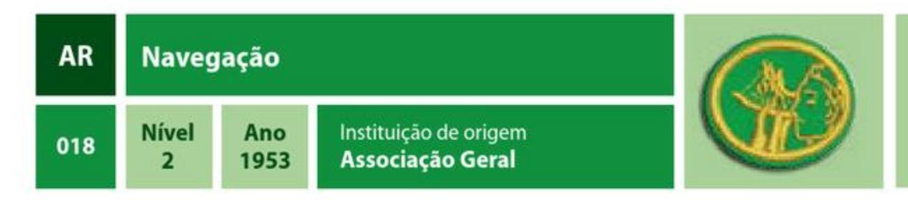
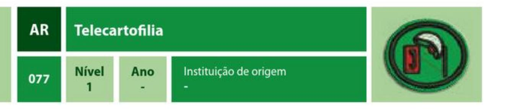
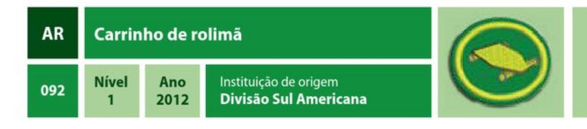
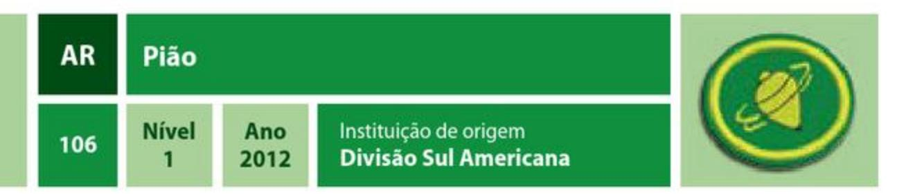

| Especialidade                                 | Ano  | Código | Número |
| --------------------------------------------- | ---- | ------ | ------ |
| Arte de acampar                               | 1929 | AR     | 001    |
| Cultura física                                | 1929 | AR     | 002    |
| Natação principiante l                        | 1944 | AR     | 003    |
| Natação principiante II                       | 1963 | AR     | 004    |
| Natação intermediário I                       | 1929 | AR     | 005    |
| Natação intermediário II                      | 1929 | AR     | 006    |
| Natação - avançado                            | 1961 | AR     | 007    |
| Salvamento de afogados                        | 1929 | AR     | 008    |
| Ciclismo                                      | 1933 | AR     | 009    |
| Excursionismo pedestre                        | 1933 | AR     | 010    |
| Filatelia                                     | 1933 | AR     | 011    |
| Filatelia - avançado                          | 1933 | AR     | 012    |
| Esqui downhill                                | 1938 | AR     | 013    |
| Arco e flecha                                 | 1945 | AR     | 014    |
| Caiaque                                       |      | AR     | 015    |
| Canoagem                                      | 1945 | AR     | 016    |
| Numismática                                   | 1945 | AR     | 017    |
| Navegação                                     | 1953 | AR     | 018    |
| Vela                                          | 1953 | AR     | 019    |
| Fogueiras e cozinha ao ar livre               | 1956 | AR     | 020    |
| Mapa e bússola                                | 1956 | AR     | 021    |
| Pioneirismo                                   | 1956 | AR     | 022    |
| Remo                                          | 1956 | AR     | 023    |
| Vida silvestre                                | 1956 | AR     | 024    |
| Equitação                                     | 1961 | AR     | 025    |
| Esqui aquático                                | 1961 | AR     | 026    |
| Esqui aquático - avançado                     | 1961 | AR     | 027    |
| Mergulho livre                                | 1961 | AR     | 028    |
| Salvamento de afogados - avançado             | 1963 | AR     | 029    |
| Saltos ornamentais                            | 1964 | AR     | 030    |
| Mergulho autônomo                             | 1967 | AR     | 031    |
| Mergulho autônomo - avançado                  | 1967 | AR     | 032    |
| Acampamento em baixas temperaturas            | 1970 | AR     | 033    |
| Escalada                                      | 1970 | AR     | 034    |
| Escalada - avançado                           | 1970 | AR     | 035    |
| Escalada em árvores                           |      | AR     | 036    |
| Exploração de cavernas                        | 1973 | AR     | 037    |
| Exploração de cavernas - avançado             | 1973 | AR     | 038    |
| Barco a motor                                 | 1975 | AR     | 039    |
| Nós e amarras                                 | 1975 | AR     | 040    |
| Arco e flecha - avançado                      | 1976 | AR     | 041    |
| Ciclismo - avançado                           | 1976 | AR     | 042    |
| Ginástica acrobática                          | 1976 | AR     | 043    |
| Ginástica acrobática - avançado               | 1976 | AR     | 044    |
| Liderança na selva                            | 1976 | AR     | 045    |
| Liderança na selva - avançado                 | 1976 | AR     | 046    |
| Ordem unida                                   | 1976 | AR     | 047    |
| Ordem unida - avançado                        | 1976 | AR     | 048    |
| Atletismo                                     | 1978 | AR     | 049    |
| Acampamento I                                 | 1986 | AR     | 050    |
| Acampamento II                                | 1986 | AR     | 051    |
| Acampamento III                               | 1986 | AR     | 052    |
| Acampamento IV                                | 1986 | AR     | 053    |
| Esqui cross country                           | 1986 | AR     | 054    |
| Excursionismo pedestre - avançado             |      | AR     | 055    |
| Excursionismo pedestre com mochila            | 1986 | AR     | 056    |
| Liderança campestre                           | 1986 | AR     | 057    |
| Liderança campestre - avançado                | 1986 | AR     | 058    |
| Pipas                                         | 1986 | AR     | 059    |
| Skate                                         | 1986 | AR     | 060    |
| Windsurf                                      | 1986 | AR     | 061    |
| Numismática - avançado                        | 1998 | AR     | 062    |
| Mountain biking                               | 1998 | AR     | 063    |
| Basquete                                      | 1999 | AR     | 064    |
| Futebol                                       | 1999 | AR     | 065    |
| Equitação - avançado                          | 2000 | AR     | 066    |
| Geocaching                                    | 2005 | AR     | 067    |
| Geocaching - avançado                         | 2005 | AR     | 068    |
| Construção de canoas                          |      | AR     | 069    |
| Cozinha com forno holandês                    | 2006 | AR     | 070    |
| Fanfarra                                      | 2006 | AR     | 071    |
| Rapel                                         |      | AR     | 072    |
| Rapel - avançado                              |      | AR     | 073    |
| Rapel - instrutor                             |      | AR     | 074    |
| Triathlon                                     |      | AR     | 075    |
| Triathlon - avançado                          |      | AR     | 076    |
| Telecartofilia                                |      | AR     | 077    |
| Telecartofilia - avançado                     |      | AR     | 078    |
| Wakeboard                                     | 2006 | AR     | 079    |
| Softbol                                       | 2006 | AR     | 080    |
| Letterboxing                                  | 2006 | AR     | 081    |
| Letterboxing - avançado                       | 2008 | AR     | 082    |
| Monociclo                                     | 2008 | AR     | 083    |
| Acampamento seguro                            | 2009 | AR     | 084    |
| Acampamento seguro - avançado                 | 2009 | AR     | 085    |
| Viagem e turismo                              | 2009 | AR     | 086    |
| Viagem e turismo - avançado                   | 2009 | AR     | 087    |
| Excursionismo pedestre na neve                | 2010 | AR     | 088    |
| Excursionismo pedestre na neve - avançado     | 2010 | AR     | 089    |
| Segurança básica na água                      | 2010 | AR     | 090    |
| Boliche                                       | 2012 | AR     | 091    |
| Carrinho de rolimã                            | 2012 | AR     | 092    |
| Colecionador                                  | 2012 | AR     | 093    |
| Esportes adaptados                            | 2012 | AR     | 094    |
| Excursionismo pedestre com mochila - avançado | 2012 | AR     | 095    |
| Fubetol de botão                              | 2012 | AR     | 096    |
| Futsal                                        | 2012 | AR     | 097    |
| Handebol                                      | 2012 | AR     | 098    |
| Nós e amarras - avançado                      | 2012 | AR     | 099    |
| Ordem unida - instrutor                       | 2012 | AR     | 100    |
| Pioneirias                                    | 2012 | AR     | 101    |
| Pioneirias - avançado                         | 2012 | AR     | 102    |
| Patins                                        | 2012 | AR     | 103    |
| Orientação com GPS                            | 2012 | AR     | 104    |
| Rafting                                       | 2012 | AR     | 105    |
| Pião                                          | 2012 | AR     | 106    |
| Tênis de mesa                                 | 2012 | AR     | 107    |
| Vôlei                                         | 2012 | AR     | 108    |
| Waveboarding                                  | 1986 | AR     | 109    |
| Evolução em ordem unida                       | 2012 | AR     | 110    |

1. Explicar como e porque as condições do tempo, a estação do ano e as fontes de água devem ser consideradas ao se escolher um local de acampamento.

2. Preparar uma lista de roupas necessárias para acampamento com tempo quente e outra com tempo frio.

3. Conhecer e praticar as regras de segurança de um acampamento.

4. Demonstrar sua habilidade no uso do canivete: demonstrar ou explicar as regras de segurança para seu uso e usá-lo para preparar gravetos e madeira para fogueira.

5. Preparar um acampamento para sua unidade. Faça uma lista de objetos pessoais que devem ser levados e itens que devem ser levados para uso do grupo todo.

6. Preparar um cardápio balanceado para desjejum, almoço e jantar.

- 7. Completar o seguinte enquanto estiver no acampamento:
  - a) Preparar o chão abaixo da barraca, para proporcionar um bom sono **b**) Montar corretamente uma barraca

c) Preparar uma área para fazer a fogueira

d) Demonstrar como proteger o acampamento de animais, insetos, e mau tempo ou chuva

e) Demonstrar como preservar a natureza durante o acampamento e deixar o local como se ninguém tivesse estado ali

8. Saber oito coisas que se pode/deve fazer quando perdido.

9. Acampar durante três dias e duas noites seguidos, dormindo ao relento ou dentro de uma barraca. Estar ativamente envolvido na preparação de pelo menos duas refeições.

10. Considerando as coisas aprendidas nesta especialidade e os acampamentos feitos, qual é o significado e a razão do Código de Acampamento dos Desbravadores?

1. Fazer um relatório citando, pelo menos, 10 benefícios de se manter um bom condicionamento físico.

2. Fazer um relatório sobre como os exercícios físicos, uma alimentação adequada e estabilidade emocional ajudam no equilíbrio do corpo. Citar exemplos negativos e positivos em cada um.

- 3. Definir os seguintes exercícios. Citar alguns exemplos em cada modalidade:
  - a) Isométrico
  - b) Isotônico
  - c) Isocinético
  - d) Anaeróbio
  - e) Aeróbio

4. Fazer um relatório explicando porque os procedimentos abaixo são importantes em um programa de exercícios. Citar exemplos de cada um.

- a) Alongamento
- **b**) Aquecimento
- c) Exercícios aeróbios
- d) Relaxamento
- e) Exercícios localizados

5. Demonstrar como verificar sua frequência cardíaca em repouso e após a atividade física.

6. Saber calcular sua frequência cardíaca máxima. Qual a importância de controlá-la durante a prática esportiva? Em qual faixa há um melhor aproveitamento durante exercícios aeróbios? Qual aparelho pode ajudar no controle e como ele funciona?

7. Usando o conhecimento adquirido no requisito 4, fazer um programa de exercícios regulares para ser praticado, pelo menos, 4 vezes por semana por um período mínimo de 4 meses. Fazer um quadro (ou tabela) do desenvolvimento de cada atividade diariamente. Este quadro deve conter:

- a) Tipo de exercícios de alongamento
- b) Frequência cardíaca em repouso
- c) Tipo de exercícios de aquecimento
- d) Tipo de exercícios aeróbios
- e) Tempo na prática de exercícios aeróbios

f) Frequência cardíaca após o exercício g) Tipos de ginástica localizada h) Exercícios de alongamento i) Frequência cardíaca 3 minutos após os exercícios aeróbios Para cada período de exercícios, manter a frequência cardíaca mínima determinada no

item 6 durante, pelo menos, 20 minutos.

# Supervisionado por um especialista, completar os seguintes itens:

1. Ter a especialidade de Segurança básica na água.

2. Com a água no nível do peito, buscar um objeto no fundo, sem ajuda e com os olhos abertos.

- 3. Saltar da borda lateral, na parte mais profunda da piscina.
- 4. Dando um impulso, deslizar de barriga para baixo à distância de dois corpos.
- 5. Nado crawl 20 metros.
- 6. Nado de costas 20 metros.
- 7. Mudar de direção no nado livre de frente.
- 8. Mudar de direção no nado de costas.
- 9. Permanecer boiando por 1 minuto.
- 10. Deslocar-se na água por 20 metros usando camiseta.
- 11. Realizar perna de crawl e costas com prancha por 10 minutos.

### REQUISITOS

# Supervisionado por um especialista, completar os seguintes itens:

- 1. Ter a especialidade de Natação principiante I.
- 2. Submergir e emergir buscando um objeto no fundo da piscina.
- 3. Demonstrar as várias posições nas quais se pode boiar.
- 4. Demonstrar a respiração alternada no nado crawl.
- 5. Nado crawl 50 metros sem intervalos.
- 6. Nado costas 50 metros sem intervalos.
- 7. Demonstrar a pernada de peito sem intervalo e sem prancha por 25 metros.
- 8. Demonstrar a virada olímpica de crawl e costas.
- 9. Manter-se flutuando durante 2 minutos com movimentos de pernas e braços.
- 10. Se deslocar na água por 20 metros sem intervalo, usando camiseta e bermuda.

Supervisionado por um especialista, completar os seguintes itens:

- 1. Ter a especialidade de Natação principiante II.
- 2. Realizar a virada olímpica do nado de peito.
- 3. Demonstrar o salto do bloco de partida em uma piscina.
- 4. Nado de peito 50 metros.
- 5. Nado crawl 200 metros.
- 6. Nado de costas 100 metros.
- 7. Demonstrar o movimento de perna do nado borboleta (golfinho) 12,5 metros.
- 8. Se deslocar na água por 20 metros usando camiseta, bermuda e meias.
- 9. Manter-se flutuando por 3 minutos com movimento de pernas e braços.

### REQUISITOS

# Supervisionado por um especialista, completar os seguintes itens:

1. Ter a especialidade de Natação intermediário I.

- 2. Nado peito 100 metros.
- 3. Nado costas 150 metros.
- 4. Nado de borboleta 25 metros.
- 5. Nado crawl 400 metros.
- 6. Nado em velocidade estilo livre 25 metros em 25 segundos.
- 7. Realizar a virada dupla do nado borboleta.
- 8. Flutuar na água durante 3 minutos (1 minuto com as mãos para fora da água).
- 9. Se deslocar na água usando camiseta de manga comprida, bermuda e meias.

Supervisionado por um especialista, completar os seguintes itens:

- 1. Ter a especialidade de Natação intermediário II.
- 2. Nadar continuamente 1.500 metros, em quaisquer combinações de estilo de nado.
- 3. Nado crawl 800 metros sem intervalo.
- 4. Nadar em baixo da água em apneia (sem respirar) por 25 metros.
- 5. Nado de costas 200 metros sem intervalo.
- 6. Nado peito 200 metros.
- 7. Nado borboleta 50 metros.
- 8. Demonstrar virada olímpica no nado de costas, peito, borboleta e crawl.
- 9. Falar sobre os princípios do bom condicionamento e demonstrá-los verificando seu ritmo cardíaco.
- 10. Revisar as normas de segurança na água.
- 11. Flutuar ou manter-se na superfície durante 5 minutos. (1 minuto com a mão fora da água).
- 12. Simular um resgate com prancha ou corda para socorrer vítimas.

### REQUISITOS

1. Ter a especialidade de Natação intermediário I.

2. Fazer um curso de salvamento de afogados, oferecido por uma instituição autorizada e credenciada para isto, com, pelos menos, 6 horas de prática. 3. Tirar a roupa em águas profundas e nadar 100 metros.

4. Mergulhar em águas com profundidade de 2 metros, retirando 3 objetos quaisquer do fundo, sendo que um deles deve pesar 4,5 Kg.

5. Fazer a aproximação correta, nadando 9 metros, e carregar a "vítima" com o braço em torno do peito por 9 metros.

6. Fazer a aproximação correta por baixo d'água, em mergulho, e carregar a "vítima" por 9 metros.

7. Fazer a aproximação correta, nadando 9 metros, e carregar a "vítima" pelo cabelo ou pelo braço por 9 metros.

8. Logo após nadar 50 metros, aproxime-se da "vítima" e a carregue por 9 metros.

9. Libertar-se corretamente de uma "vítima" que esteja segurando seu punho (repetir o método para ambos os punhos). Demonstrar como fazê-lo dentro e fora d'água. 10. Libertar-se corretamente de uma "vítima" que esteja lhe agarrando pelo pescoço (libertar-se escapando pela direita e, posteriormente, pela esquerda). Demonstrar como fazê-lo dentro e fora d'água.

11. Demonstrar a maneira correta de se fazer respiração artificial num afogado.

1. Faça uma relação com o nome das peças de uma bicicleta. Descrever o propósito de cada uma.

2. Consertar um pneu furado de bicicleta.

3. Desmontar, limpar, lubrificar e remontar uma bicicleta.

4. Ajustar os freios traseiro e dianteiro corretamente.

5. Conhecer e praticar as regras de cortesia e segurança do ciclismo.

6. Quais as vantagens de usar um capacete de ciclista?

7. Percorrer 80 quilômetros consecutivos de bicicleta, em 10 horas ou menos.

8. Saber como ler um mapa para fazer o roteiro de seus 80 quilômetros, e seguir este roteiro com precisão.

### REQUISITOS

1. Explicar porque os pontos abaixo são considerados importantes durante uma caminhada:

a) Passada apropriada

**b)** Velocidade

c) Intervalo de descanso

d) Regras de comportamento

e) Cuidado com a natureza

2. Explique porque é importante ter cuidado com os pés. Qual a influência que a limpeza, unhas cortadas e limpas, meias e calçados fazem?

3. Quais os primeiros socorros que devem ser feitos em um pé com bolhas?

4. Fazer uma lista do vestiário e calçados apropriados para uma caminhada: a) Clima quente

b) Clima frio

c) Tempo chuvoso

5. Fazer uma lista do material necessário para uma caminhada em uma região silvestre para:

a) Caminhada de 24 horas

**b**) Caminhada de 12 horas

c) Caminhada de 6 horas

6. Relacionar, pelo menos, cinco regras de segurança durante uma caminhada, citar alguns cuidados especiais nos seguintes locais:

a) Trilhas

**b**) Rodovias

c) Área urbana

d) Área rural

e) Estrada

f) Área desabitada

g) Florestas

7. Explicar a importância de beber água.

8. Explicar a importância de comer adequadamente durante uma caminhada.

9. Fazer um planejamento de uma caminhada de 16 quilômetros para entregar ao seu

instrutor. Incluir no planejamento:

a) Mapa com detalhamento do percurso

**b**) Lista de equipamentos

c) Vestimentas

d) Quantidade de alimentação e água

e) Postos de socorro no caso de emergência (polícia, pronto socorro, etc.)

f) Tempo previsto para o percurso e horário previsto para chegada

### 10. Fazer as seguintes caminhadas:

a) 8 quilômetros em área rural ou urbana

- b) 8 quilômetros por trilha em região de mata, floresta ou agreste
- c) 2 caminhadas de 16 quilômetros em percursos e datas diferentes

d) 24 quilômetros por trilha em região de mata, floresta ou agreste Apresentar um relatório de cada caminhada contendo:

1. Datas

2. Mapa topográfico ou rodoviário com detalhamento do percurso

3. Tempo de caminhada

4. Condições climáticas

5. Considerações interessantes

- 6. Pontos interessantes observados
- 7. Se possível, foto do grupo que participou em pontos interessantes

#### **AR Filatelia** Instituição de origem Ano **Nível** 011 Associação Geral 1933 $\overline{2}$

### REQUISITOS

- 1. Relatar, sucintamente, a história do serviço postal do seu país.
- 2. Como a história do seu país é contada através dos selos?
- 3. Quais são os preços para carta comum em seu país?
- 4. Qual o país que não tem seu nome nos selos e por quê?
- 5. Saber o significado dos seguintes termos:

a) Dentado

- **b)** Intervalo entre picotes
- c) Classificador
- d) Odontômetro
- e) Selos Definitivos
- f) Selos Comemorativos
- g) Charneira
- h) Havid ou Maximaphil
- 6. Saber como retirar os selos que estão colados em papel e como secá-los.
- 7. Fazer uma coleção de, pelo menos, 750 selos, não incluindo repetidos na contagem.
- 8. Classificar devidamente os selos:

a) Por países

b) Por séries, de acordo com o ano e o design

9. Montar seus selos em classificador ou Havid. (O Havid é mais indicado para selos novos).

10. Escolher um tema e desenvolver uma exposição de, pelo menos, 9 páginas, incluindo uma página título, para ser apresentada em algum evento do Clube de Desbravadores. A apresentação deve ser artística, com etiquetas para classificar cada selo e demonstrar cuidadosa pesquisa.

- 1. Ter a especialidade de Filatelia.
- 2. Conhecer o significado dos seguintes termos:
  - a) Carimbo
  - b) Perfin
  - c) Bloco
  - d) Molde
  - e) Pré-carimbado
  - f) Marca Característica
  - g) Marca d'água
  - h) Pinca

3. Expor, pelo menos, 16 páginas numa exposição de selos do Clube. Os selos devem ser apresentados de forma artística, com etiquetas para classificar cada um deles, demonstrando cuidadosa pesquisa.

4. Fazer uma coleção de 750 selos com, pelo menos, 50 selos para cada país estrangeiro; no mínimo 5 países estrangeiros.

5. Citar 2 catálogos diferentes que podem ser usados para identificar selos.

6. Usando um catálogo de selos, identificar e montar sua coleção de acordo com o número do catálogo e país.

### REQUISITOS

1. Relacionar os 4 materiais mais usados na construção de esquis. Qual as diferenças e benefícios destes materiais?

- 2. Executar corretamente e demonstrar habilidade fazendo o seguinte:
  - a) Ficar em pé sobre os esquis
  - b) Deslizar por, pelo menos, 10 metros
  - c) Chutar enquanto esquia (levantar um dos pés à altura da cintura) d) Usar corretamente os bastões
- 3. Fazer um dos seguintes:

a) Demonstrar habilidade para efetuar um salto de, pelo menos, 25 metros de extensão corretamente. Deverá ser avaliado de acordo com as normas regulares de saltos de esqui.

b) Percorrer um percurso Slalon, com dificuldade moderada, com, pelo menos, 2 saltos e 6 curvas no percurso.

4. Fazer um relatório ou explicar oralmente a seu instrutor o seguinte sobre a prática do esqui:

- a) Roupa adequada
- **b**) Equipamentos
- c) Suas razões para escolher o esqui como um hobby saudável
- d) Quais emoções você já experimentou enquanto esquiava

NOTA: Obrigatória a presença de um instrutor qualificado. Todo equipamento de tiro e proteção devem estar em excelentes qualidades para a prática dessa especialidade. Sendo uma especialidade em que a prática inadequada ou escolha errada de equipamento pode lesionar o desbravador, este instrutor deverá ser credenciado pelo regime local para instrutores ou professores de práticas físicas.

- 1. Ter, no mínimo, 12 anos de idade.
- 2. Conhecer e explicar as regras de segurança de arco e flecha.
- 3. Identificar as partes de uma flecha, explicando a função de cada uma.
- 4. Identificar e explicar as partes que compõe o:
  - a) Arco composto
  - b) Arco recurvo
- 5. Descrever e mostrar como usar os seguintes acessórios:
  - a) Protetor de braço (braçadeira)
  - b) Dedeira
  - c) Aljava
  - d) Sling(pulseira ou bandoleira)
  - e) Kisser (beijador)
- 6. Entender as zonas e as regras de pontuação do alvo padrão para arco e flecha.
- 7. Por que é necessário ter o Nock Point (ponto de encaixe) da flecha posicionado corretamente na corda do arco?
- 8. Demonstrar de forma básica as seguintes técnicas de tiro:

| a) Postura                   | d ) Ancoragem  |
|------------------------------|-----------------------|
| b ) Encaixe da flecha | e) Empunhadura e mira |
| c) Retesar o arco            | f) Largada            |

- 9. Estabelecer uma rotina de prática de tiro com arco e flecha, no mínimo 2 horas por dia, 2 vezes por semana, durante 4 semanas seguidas, mantendo um controle de sua pontuação.
- 10. Usando um arco recurvo, alcançar uma das seguintes pontuações:
- a) Indoor: 30 flechas (6 séries de 5 flechas) a 18 metros de distância, marcar 50 pontos em um alvo de 60 cm.
- b) Outdoor: 30 flechas (6 séries de 5 flechas) a 25 metros de distância, marcar 150 pontos em um alvo de 122 cm.

### REQUISITOS

1. Faça um relatório e explique os diferentes tipos de caiaques (para rio, corredeiras, mar e turismo), explicando como é o uso de cada um e qual o equipamento de segurança necessário para a prática do esporte (capacete, salva-vidas, calçados, presilhas de segurança, etc.).

- 2. Demonstrar habilidade para entrar e sair de um caiaque.
- 3. Demonstrar habilidade para completar o seguinte:
  - a) Remando, conduza o caiaque para frente e para trás
  - b) Remando, vire o caiaque para a esquerda, e depois à direita, tanto seguindo em frente quando indo de ré
  - c) Seguir um percurso estabelecido pelo instrutor
  - d) Usar o remo como apoio para evitar acidentes
  - e) Atravessar uma correnteza remando

4. Explicar as etapas envolvidas no movimento de rolamento do cajaque e demonstrar este método na prática.

- 5. Explique como reparar um buraco em fibra de vidro.
- 6. Depois de praticar no mínimo duas seções completas do treinamento, fazer: a) Um passeio de caiaque à noite
  - b) Duas excursões durante o dia, sendo uma delas em corredeiras

1. Ter a especialidade de Natação - intermediário I.

2. Primeiro sozinho, e depois com um companheiro, em um píer e em uma praia, demonstrar o seguinte:

- a) Entrar numa canoa e dar o primeiro impulso para colocá-la na água
- b) Atracar a canoa e depois sair dela
- 3. Acompanhado de um instrutor, fazer as seguintes manobras corretamente, a partir da popa e da proa:
  - a) Demonstrar oito formas de remar
  - b) Virar o barco à esquerda e depois à direita, sem avançar ou recuar
- 4. Sozinho em uma canoa, mantendo o remo do mesmo lado, faça o seguinte:
  - a) Remar, pelo menos, 100 metros
  - b) Virar à esquerda
  - c) Virar à direita
  - d) Repetir dois itens acima estando de joelhos enquanto rema
- 5. Faça uma simulação de resgate de um companheiro que tenha tido o barco emborcado longe da praia ou ancoradouro. Na simulação fazer o seguinte:
  - a) Esvaziando a canoa que estava virada, reboque-a de volta ao ancoradouro
  - b) Equilibrar a canoa enquanto seu companheiro entra nela novamente
  - c) Dar um novo impulso para a canoa na água
- 6. Sair de uma canoa em águas profundas e entrar nela outra vez, sem deixar entrar água na mesma. (Deve haver acompanhamento de uma salva-vidas, num barco salvavidas).
- 7. Fazer o seguinte:
  - a) Virar a canoa em águas profundas
  - b) Desvirá-la e acomodar os remos
  - c) Entrar na canoa enquanto ainda estiver cheia de água, remar com as próprias
  - mãos ou remos por, pelo menos, 30 metros
  - d) Tirar as roupas, guarde-as junto com os remos, sair da canoa, segurar na proa
  - com uma mão e com a outra nadar até o raso (praia) rebocando a canoa
  - e) Esvaziar a canoa corretamente e atracá-la
  - Observação: Todos os procedimentos devem ser feito com o acompanhamento de um salva-vidas, num barco de salvamento.

- 8. Demonstre de forma prática ao seu instrutor:
  - a) As regras de segurança da canoagem
  - b) Competência para levar outros na canoa
  - c) Criar um código de conduta, prometendo seguir as regras de segurança a todo momento
- 9. Explicar como fazer reparos de emergência nos seguintes casos: a) Consertar um buraco em barco de fibra de vidro b) Consertar um remo quebrado

1. Relatar sucintamente a história do dinheiro, sua evolução e as mais variadas formas de "dinheiro" da atualidade, como o cheque, o cartão de crédito, etc.

- 2. Contar resumidamente a história do dinheiro em seu país, mencionando as datas de estabelecimento de casas da moeda e fábricas de cunhagem. Mencionar também as mudanças das cédulas e moedas de seu país ao longo do tempo.
- 3. Explicar como o dinheiro é distribuído pelo governo em seu país.

4. Definir quaisquer dos termos a seguir, caso se apliquem ao sistema monetário de seu país:

| a) Mescla de metais           | i) Reverso              |  |  |
|-------------------------------|-------------------------|--|--|
| b ) Cunhagem revestida | j) Série                |  |  |
| c) Moeda comemorativa         | k) Impressão sobreposta |  |  |
| d) Cunho                      | I) Tira magnética       |  |  |
| e) Fundo                      | m) Tinta fluorescente   |  |  |
| f) Inscrição                  | n) Controle de inflação |  |  |
| g) Borda marcada com letras   | o) Numeração das notas  |  |  |
| h) Anverso                    | p) Papel-moeda          |  |  |

- 5. Descrever o anverso e o reverso das cédulas usadas atualmente em seu país.
- 6. Saber como a qualidade das moedas é avaliada pelos colecionadores.

7. Ter moedas ou notas de dez diferentes países. Descrever o que há em cada uma delas, dar os nomes de pessoas ou objetos retratados nas mesmas e, quando possível, mencionar as datas de cada uma.

8. Cumprir um dos seguintes itens:

a) Colecionar, pelo menos, cinco moedas ou notas de seu país que não estejam mais em circulação.

b) Colecionar uma série datada de moedas de seu país, começando com o ano de seu nascimento (não é necessário incluir moedas raras ou caras).

9. Relacionar as características de segurança contra falsificação das cédulas vigentes em seu país e as apresentar para sua unidade ou Clube.

### REQUISITOS

1. Saber, pelo menos, 20 termos náuticos usados na navegação.

2. Cite, pelo menos, três tipos de pedido de socorro em navegação e suas características. Em uma situação de perigo, por quem esses pedidos são feitos? 3. Nomeie 6 tipos de bóias. O que eles significam e como são usados? Dê as cores dos 6 que você nomeou. Como as bóias são numeradas? Como fazer as marcações em canais?

4. Instalar uma bússola, com oito pontos cardeais. Por que ela é tão importante na navegação? Onde ela deve ficar localizada na embarcação e por quê?

5. Cite o nome de 4 dos nós mais utilizados em navegação. Saber como amarrá-los e explicar suas funções.

6. Saber ler e interpretar uma carta náutica, saber por que ela é de suma importância quanto à navegação em águas desconhecidas. Cite alguns itens que se pode encontrar na carta, seus símbolos e marcação de bóias.

7. Quando estiver no comando de uma navegação, quais são as três regras de segurança para melhor navegar?

8. O que significa estar devidamente equipado? llustre.

9. O que significam as expressões "regras de condução" e "ética marítima"?

NOTA: Necessário o acompanhamento de um instrutor qualificado.

- 1. Ter a especialidade de Natação intermediário I.
- 2. Conhecer e explicar as regras de rota.
- 3. Saber como as condições meteorológicas e as condições marítimas afetam o desempenho do barco à vela e a segurança da embarcação.
- 4. Que medidas de segurança devem ser tomadas ao velejar?
- 5. Fazer o seguinte:
  - a) Afastar o barco à vela do ancoradouro ou praia
  - b) Saber como ajustar as velas de acordo com as seguintes situações:
    - Contra o vento
    - · Toda-vela
    - · Curva aberta
    - Curva fechada
    - A favor do vento
  - c) Mudar de rumo usando as velas
  - d) Aproximar-se da doca, praia ou ancoradouro, parar o barco e preparar o barco para ser guardado
- 6. Saber fazer os seguintes nós e como utilizá-los ao velejar:
  - a) Nó direito
  - **b**) Lais de guia
  - c) Volta do fiel
  - **d**) Figura em oito
  - e) Laçada dupla
- 7. Relacionar as maneiras para cuidar e preservar seu equipamento de navegação durante o ano.
- 8. Conhecer, pelo menos, 20 termos utilizados na navegação e seus significados.
- 9. Ser capaz de identificar, pelo menos, 15 partes de um veleiro.
- 10. Simular o resgate de uma pessoa que tenha caído na água.\*
- 11. Demonstrar o que fazer quando um veleiro vira.\*
- \*Estes requisitos devem ser feitos sob a supervisão de um adulto. Uma embarcação de salvamento deve estar pronta para dar assistência.

**AR** Fogueiras e cozinha ao ar livre **Nível** Ano Instituição de origem 020 1956 Associação Geral  $\overline{2}$ 

### REQUISITOS

1. Preparar, entre as seguir, cinco diferentes tipos de fogueiras e saber o uso específico de cada uma. Dois destes devem ser próprios para cozinhar alimentos:

- a) Fogo do Conselho
- **b)** Altar de Cozinha
- c) Fogo de Trincheira d) Cercadura de Pedra

- e) Cama Rápida f) Fogo Estrela g) Fogo de Cacador
- h) Fogo Refletor
- 2. Preparar madeira e gravetos com segurança.
- 3. Demonstrar as técnicas corretas de começar uma fogueira.
- 4. Começar uma fogueira com um palito de fósforo e mantê-la acesa por, no mínimo, 10 minutos.
- 5. Conhecer e praticar cinco regras de segurança.
- 6. Demonstrar como cortar corretamente madeira para fogueira.
- 7. Demonstrar habilidade para começar uma fogueira em tempo chuvoso.
- 8. Demonstrar habilidade para refogar, cozinhar, fritar e assar alimentos. Assar um pão num espeto e assar outro alimento em papel alumínio.
- 9. Conhecer um método natural, além do gelo, para manter os alimentos gelados/frios enquanto estiver acampando.
- 10. Conhecer maneiras de manter o alimento e utensílios a salvo de ataque de animais e insetos.
- 11. Por que é importante manter limpos os utensílios usados para cozinhar e comer?
- 12. Demonstrar conhecimento da nutrição apropriada e combinação de alimentos, fazer um cardápio completo e balanceado para seis refeições de acampamento. Incluir o seguinte:
  - a) Um desjejum, almoço ou jantar para um dia de caminhada, no qual a alimentação leve é importante. A refeição não deve ser cozida, pois perde muito de seus valores nutritivos.
  - b) As cinco refeições restantes podem ser feitas com qualquer tipo de comida: alimentos enlatados, frescos, congelados ou desidratados.
- 13. Fazer uma lista dos suprimentos que serão necessários para preparar as seis refeições acima.
- 14. Saber como preparar os alimentos com segurança, dispor do lixo adequadamente e lavar os utensílios.

# Seção I - Mapa

1. Saber o seguinte: a) O que é um mapa topográfico. b) O que é encontrado em um mapa topográfico. c) Dê 3 usos para um mapa topográfico. 2. O que é um mapa ortofoto? 3. Ser capaz de identificar, pelo menos, 20 sinais e símbolos encontrados em mapas topográficos. Alguns deles deverão ser das seguintes categorias: a) Construções humanas b) Locais com água c) Características da vegetação 4. Conhecer e explicar o seguinte, com relação à topografia: a) Elevação b) Intervalo entre curvas de nível c) Formas de relevo (vales, cumes, penhasco, escarpas, montes, montanhas, etc.) definidas pelas curvas de nível 5. Conhecer e explicar o seguinte, com relação à distância: a) Como as distâncias são definidas c) Como medir a distância linear b) A escala do mapa d) Como converter para a distância real 6. Conhecer e explicar o seguinte, com relação ao mapa: a) O que é sistema Grid **b**) O que é grid UTM c) Quantos Fusos UTM temos no território da Divisão Sul Americana d) Identificar em qual fuso fica sua localidade e como é chamado(nomeado) este fuso e) Explicar como usar um sistema de coordenadas UTM f) Como usar um sistema de grade de 6 dígitos 7. Conhecer e explicar o seguinte, com relação à leitura de mapas: d) Declinação magnética a) Norte da quadrícula e) Convergência Meridiana **b**) Norte Verdadeiro c) Norte magnético Seção II - Bússola

1. Quais são os 8 principais pontos cardeais, suas abreviação e graus correspondentes?

- 2. Identificar o tipo de bússola mais popular entre trilheiros.
- 3. Conhecer as partes de uma bússola.
- 4. Conhecer e explicar o seguinte, relacionado à bússola, azimute e coordenadas: a) O que é azimute
  - b) Como calcular a coordenada pelo mapa
  - c) Como converter uma coordenada geográfica para uma coordenada magnética (azimute)
  - d) Como converter uma coordenada magnética (azimute) para uma coordenada geográfica
- e) O que é desvio e como corrigir isto
- f) Como calcular e seguir um contra-azimute
- 5. Conhecer e explicar os seguintes métodos de descobrir a localização atual em um mapa: a) O que é ressecção
  - b) Use o método de 2 pontos
- c) Use o método de 3 pontos
- d) Explique como usar o triângulo de erro de Lehmann
- 6. Saber e explicar como orientar-se usando seu mapa por:
  - a) Inspeção visual
  - **b**) Usando a bússola
- 7. Construir uma "bússola de emergência" utilizando materiais improvisados.

# Seção III - Direção sem o auxílio de uma bússola

- 1. Demonstrar como encontrar direção sem uma bússola usando:
  - c) Constelação de Órion a) Cruzeiro do sul
  - **d**) A sombra de 2 varas **b**) Relógio com ponteiros

# Seção IV - Prática

- Demonstrar como:
  - a) Ler 6 coordenadas usando o Grid UTM.
  - b) Calcular uma coordenada pelo mapa.
  - c) Converter uma coordenada geográfica para uma coordenada magnética.
  - d) Determinar o azimute.
  - e) Localizar uma posição com a ressecção.

2. Com base no conhecimento adquirido no item "c" do requisito 4 da Seção II, navegar até uma coordenada geográfica utilizando um azimute magnético.

3. Prove sua habilidade no uso de um mapa e bússola, seguindo um curso de crosscountry com, pelo menos, 10 leituras dadas ou pontos de controle.

4. Durante o cumprimento dos requisitos 2 e 3 desta seção, manter um registro detalhando:

a) Referências do mapa utilizado (incluindo dados da Grid, escala, etc.) b) Coordenadas Geográficas e Magnéticas e os azimutes c) Observações sobre o percurso tomado

1. Ter as sequintes especialidades:

a) Pioneirias

b) Fogueiras e cozinha ao ar livre

c) Vida silvestre

b) Trabalhos em couro

2. Ter uma das seguintes especialidades:

a) Cestaria

c) Tricô d) Tecelagem

3. Pesquisar sobre o processo de interiorização de seu país. Escrever 500 palavras sobre como os pioneiros que dedicaram suas vidas à abertura de caminhos rumo ao centro de seu continente satisfaziam as sequintes necessidades:

| a) Habitação e mobília | e) Formas de iluminação |  |  |
|------------------------|-------------------------|--|--|
| b) Vestimenta          | f) Ferramentas          |  |  |
| c) Alimentação         | g) Saneamento           |  |  |
| d) Cozinha             | h) Transporte           |  |  |

4. Pesquisar sobre uma forma artesanal de fazer farinha de, pelo menos, uma planta. Apresentar um relatório detalhado sobre todo o processo.

5. Explicar a necessidade de fogo para a sobrevivência do homem. Fazer uma breve reflexão sobre o uso e dificuldades de produção de fogo encontrados pelos expedicionários do passado. Completar o seguinte:

a) Fazer uma fogueira utilizando produtos naturais na construção e também na produção da faísca inicial. Manter o fogo aceso por 5 minutos. Escolher um dentre os seguintes para começar:

- · Pedra e aço
- · Atrito
- · Vidro curvo
- · Ar comprimido

b) Fazer uma fogueira utilizando produtos naturais na construção. Utilizar um dos métodos modernos para a produção da faísca inicial e manter o fogo aceso por 5 minutos. Escolher um dentre os seguintes para começar:

- · Faísca elétrica
- · Pederneira

· Palha (Esponja) de aço e bateria

· Outro método definido pelo instrutor

6. Demonstrar habilidade no uso do machado, completando os seguintes:

a) Descrever os melhores tipos de machados

b) Demonstrar como afiar um machado corretamente

c) Listar e seguir 10 regras de segurança no uso de um machado

d) Demonstrar a técnica apropriada de manuseio de um machado

e) Utilizando as técnicas aprendidas para uso do machado, preparar madeira para os seguintes:

· Fogueira (iscas, gravetos, troncos)

· Abrigo (bases, paredes, cobertura)

7. Completar 2 dos seguintes:

a) Fazer uma corda de 3 metros a partir de material natural ou barbante.

b) Fazer 10 nós úteis para os pioneiros e contar como eram utilizados.

c) Usando corda e materiais naturais, fazer um dispositivo para mover objetos pesados.

d) Construir uma latrina adequada e confortável.

8. Explicar a importante relação entre a higiene (como banho, cuidados com a louça e eliminação apropriada de resíduos sólidos [lixo]) e a manutenção da saúde.

9. Ajudar na construção de uma ponte, de corda ou madeira, de 3 metros de comprimento, usando amarras.

10. Participar de um debate sobre a importância da conservação do meio ambiente. Conhecer e por em prática 4 maneiras de conservar a beleza da mata.

11. Explicar a importância das seguintes atividades na vida dos pioneiros e demonstrar como fazer 2 delas:

a) Fazer uma vela de cera ou outra forma de fonte de luz utilizada pelos pioneiros b) Fazer uma barra de sabão

c) Ordenhar uma vaca, cabra, ou outro animal aprovado por seu instrutor

d) Bater manteiga

e) Fazer uma caneta de pena e escrever com ela

f) Construir um bringuedo simples usado pelos pioneiros

g) Participar da confecção de uma colcha

12. Conhecer 5 remédios caseiros utilizados pelos pioneiros, obtidos a partir de plantas silvestres, que tenham sua eficácia comprovada e explicar suas indicações.

13. Completar uma das seguintes excursões:

a) Auxiliar na construção de uma jangada, usando amarras. Fazer uma viagem de 8 km em um rio com essa jangada.

b) Com um vaqueiro experiente, participar de uma viagem de 2 dias, a cavalo, pelo percurso de 25 km, levando todos os suprimentos necessários em um cavalo de carga que você aprendeu a equipar.

c) Com um líder experiente, participar de uma viagem de canoa de 2 dias, percorrendo 25 km, levando todos os suprimentos necessários corretamente. Um pequeno transporte pela terra pode ser realizado.

d) Com um líder experiente, participar de uma caminhada de 2 dias, viajando por 25 km, levando todos os suprimentos necessários na mochila.

### REQUISITOS

- 1. Ter a especialidade de Natação intermediário I.
- 2. Sob supervisão de seu instrutor, realizar o seguinte:

a) Conduzir o barco remando em linha reta por 500 metros, parar, fazer uma volta pivô e retornar ao ponto de partida

b) Conduzir o barco remando por 200 metros, fazer uma curva em curso usando apoio do remo e retornar ao ponto de partida, plainando o remo a cada braçada.

# 3. Ser capaz de demonstrar como:

a) Como lançar o barco na água, e trazê-lo de volta ao ancoradouro

b) Ajudar uma pessoa a entrar com segurança dentro do barco ao lado de um cais c) Ancorar o barco no cais, usando o nó volta do fiel, ou fateixa ou um nó bolina

4. Sozinho, ou com a ajuda de uma pessoa que saiba nadar, desvirar um barco, colocando o lado correto para cima, entrar, e com as mãos ou um remo conduzi-lo por dez metros. Explique como ficar pendurado ou entrar em um barco inundado.

5. A partir de um cais, sozinho em um barco a remo, abordar um nadador, manobrar o barco e rebocá-lo em segurança até a terra.

6. Nomeie e identifique, pelo menos, cinco diferentes tipos de barcos que podem ser usados com remos. Explique onde cada um é mais indicado para ser usado.

7. Identifique e descreva dois dos seguintes tipos de suportes de remo:

a) Suporte aberto com cavilha (Tholepin)

b) Forquilha de encaixe (Box rowlock)

c) Suporte em anel (Ring rowlock)

d) Forquilha aberta (Open-top rowlock)

8. Explique as vantagens obtidas ao se plainar o remo fora d'água durante a prática do remo. 9. Como você agiria se uma tempestade súbita ou vento forte o pegasse enquanto estivesse navegando em um barco a remo?

10. Como você calcula o número de pessoas que podem ser transportadas com segurança em qualquer barco a remo salva-vidas?

11. Que luzes são necessárias em um barco a remo à noite, com ou sem motor de popa? 12. Como você retira, transporta e armazena um barco a remo no período que não será usado? 13. Ler Marcos 6:46-51. Após a leitura, debater com seu instrutor sobre o poder de Jesus e como Ele usa esse poder para nossa proteção em todos os momentos de nossas vidas.

1. Participar de, pelo menos, dois acampamentos, com no mínimo dois pernoites cada, durante os quais possa praticar as habilidades necessárias para esta especialidade.

2. Mencionar cinco coisas que devem ser feitas quando se está perdido numa floresta. Conhecer três métodos de identificar os pontos cardeais sem o uso de uma bússola.

3. Demonstrar três maneiras de purificar água para beber.

4. Conhecer três formas de encontrar água na floresta e demonstrar dois desses métodos.

5. Demonstrar pelo menos dois métodos de:

a) Avaliar a altura de uma árvore

- b) Avaliar a largura de um riacho
- 6. Identificar, em meio à natureza, as pegadas de quatro animais ou pássaros silvestres.

7. Usando uma bússola, seguir um percurso previamente montado pelo instrutor, com no mínimo três azimutes e mais de 1200 metros, com margem de erro de no máximo 5% da distância do percurso (por exemplo: para um percurso de 1200 metros, margem de erro de 60 metros).

8. Identificar, preparar e comer dez variedades de plantas silvestres.

9. Ter um estojo pessoal de sobrevivência, com 15 itens, e saber usar cada um deles. 10. Explicar a necessidade de um bom sono, regime alimentar adequado, higiene pessoal e exercício apropriado.

11. Ter a especialidade de Primeiros Socorros - Intermediário. Além desta especialidade, conhecer a prevenção, os sintomas e o tratamento de primeiros socorros para o seguinte:

| a) Hipotermia                                               | e) Arbustos venenosos                                                             |
|-------------------------------------------------------------|-----------------------------------------------------------------------------------|
| b ) Mordida de cobra peçonhenta                      | f) Feridas ou machucados com infecção                                             |
| c) Insolação                                                | g) Enjõo provocado por altitude                                                   |
| d) Exaustão                                                 | h) Desidratação                                                                   |
| 12. Demonstrar duas formas de sinalizar pedidos de socorro. |                                                                                   |
|                                                             | 12 Demonstrar os princípios que dovem sor respoitados para se andar silonsiasamen |

13. Demonstrar os princípios que devem ser respeitados para se andar silenciosamente e esconder-se, em caso de necessidade.

14. Explicar como preparar-se e providenciar abrigo nas seguintes condições:

| a) Muita neve | c) Pântanos          |
|----------------------|----------------------|
| b) Áreas rochosas    | d ) Florestas |

### REQUISITOS

# (Necessário o acompanhamento de um instrutor)

1. Identificar em desenho de um cavalo, ou ao vivo, pelo menos 20 diferentes partes de um cavalo.

2. Identificar 10 partes de uma sela e 5 de um bridão ou freio.

3. Explicar como limpar e cuidar adequadamente de um arreio ou sela.

4. Descrever a importância do capacete e botas enquanto se trabalha com cavalos ou na hora de cavalgar.

5. Descrever e demonstrar 5 regras de segurança que devem ser observadas no momento de aproximação e captura de um cavalo.

6. Escolher um local seguro para amarrar um cavalo manso e depois demonstrar os tipos de nó que podem ser usados para amarrar o animal, o comprimento correto da corda e a altura adequada para fazer a amarra.

7. Demonstrar e explicar como se deve cuidar corretamente de um cavalo.

8. Demonstrar e explicar como colocar a sela e o bridão num cavalo de forma correta e segura.

9. Demonstrar e explicar como montar e desmontar um cavalo adequadamente e com segurança.

10. Demonstrar e explicar o procedimento correto ao montar em pêlo um cavalo que esteja parado. Cavalgar, com equilíbrio, e em pêlo, durante, no mínimo, 30 minutos (podem ser cumulativos).

11. Demonstrar e explicar regras de segurança para cavalgar em grupo, cavalgando em companhia de, no mínimo, mais um cavaleiro. Demonstrar espaçamento correto, mudança de direção e ultrapassagem de outros cavaleiros em marcha numa arena. 12. Cavalgar um cavalo em passo de marcha, em trilha, durante um mínimo de quatro horas cumulativas.

- 1. Ter a especialidade de Natação intermediário I.
- 2. Conhecer a história da origem do esqui aquático.
- 3. Justificar, por meio de relatório, as seguintes regras de segurança: a) Nunca esquiar à noite
  - b) Nunca esquiar durante uma tempestade com raios
  - c) Usar sempre colete salva-vidas ao esquiar
  - d) Verificar se a presilha do colete está bem fechada
  - e) Verificar se a corda está em boas condições
  - f) Verificar se os esquis estão em boas condições
  - g) Ter um espelho no barco que puxa o esquiador
  - h) Manter distância de objetos ou pessoas como, por exemplo, outros esquiadores, nadadores, ancoradouros ou objetos flutuantes
  - i) Se cair, soltar a corda
  - j) Depois da queda, levantar os braços para indicar que está bem
  - k) Não ficar em pé no barco/lancha enquanto o mesmo estiver em movimento
- 4. Conhecer os seguintes sinais de mão:
  - a) Mais devagar
  - **b**) Velocidade ok
  - c) Mais rápido
  - d) Voltar ao embarcadouro
- 5. Colocar os esquis em águas profundas. Arrancar em águas profundas com esquis
- duplo e uma corda de extensão longa.
- 6. Passar por cima da trilha do barco mantendo o equilíbrio.
- 7. Explicar as seguintes modalidades:
  - a) Slalom
  - **b**) Truques
  - c) Rampas

### REQUISITOS

- 1. Ter a especialidade de Esqui aquático.
- 2. Largar em águas profundas e esquiar satisfatoriamente.
- 3. Passar por cima da trilha do barco sem perder o equilíbrio.
- 4. Fazer um giro completo de 360 graus.
- 5. Fazer o percurso de uma prova de Slalom satisfatoriamente.

- 1. Ter a especialidade de Natação principiante I.
- 2. Mencionar 3 pré-requisitos para uma pessoa que deseja fazer mergulho livre.
- 3. Que equipamentos são essenciais ao mergulho livre?
- 4. Discutir os efeitos dos seguintes fatores no mergulho livre:
  - a) Tipos de praias
  - **b**) Marés e correntes
  - c) Vida marinha
- 5. Quais as regras de boa conduta no mergulho livre?
- 6. Que medidas de segurança devem ser seguidas durante o mergulho livre?
- 7. Fazer um teste prático, numa piscina, sobre técnicas aplicadas no mergulho livre.
- 8. Demonstrar, em águas abertas, seus conhecimentos no mergulho livre.

### REQUISITOS

1. Ter a especialidade de Salvamento de afogados.

2. Fazer um curso de salvamento de afogados, com carga horária mínima de 50 horas, em instituição que emita um certificado com selo da Sociedade Brasileira de Salvamento de Afogados (SOBRASA), da Intenational Life Saving Fedaration (ILS) ou de instituição equivalente em seu país.

- 1. Demonstrar os seguintes saltos:
  - a) Frente
  - b) Trás
  - c) Ponta pé à lua

2. Realizar 2 dos seguintes saltos: parafuso (grupado, carpado ou esticado), equilíbrio grupado ou carpado, salto revirado grupado ou carpado.

3. Explicar a profundidade segura da água para saltos em trampolim de 1 metro e 3 metros. A distância o trampolim deve estar projetado sobre a piscina? Que trampolins são recomendáveis?

4. Fazer um breve relatório sobre a história da origem dos Saltos ornamentais. Na hora do teste, cada candidato deverá anunciar o salto que fará e ser avaliado de acordo com o mesmo.

### REQUISITOS

1. Ter a especialidade de Natação principiante I.

2. Passar num curso padrão e ser certificado em nível internacional.

3. Ter atestado médico atualizado para a prática do mergulho.

- 1. Ter a especialidade de Mergulho autônomo.
- 2. Realizar, no mínimo, 10 mergulhos a 10 metros.
- 3. Ter atestado médico atualizado para a prática do mergulho.

### REQUISITOS

1. Ter a especialidade de Arte de acampar.

2. Fazer uma lista completa de equipamentos necessários para se acampar em baixas temperaturas em diversas situações, como temperaturas abaixo de zero, tempestades e neve.

3. Explicar como manter o corpo quente e seco por meio do uso adequado de roupas e equipamentos de dormir sob todas as temperaturas abaixo de zero, durante a viagem, descanso e sono.

4. Listar e explicar as caracteristicas de um bom acampamento em baixas temperaturas.

5. Descrever ou demonstrar como preparar um local para montar seu acampamento em situação de neve ou de intenso frio.

6. Preparar um cardápio equilibrado de 3 dias para ser usado em seu acampamento em baixas temperaturas.

7. Saber como obter água na neve.

8. Conhecer 5 regras de segurança para um acampamento em baixas temperaturas. 9. Explique as medidas corretas a serem tomadas quando se estiver sem equipamentos adequados (como roupas e barracas especiais para baixas temperaturas) em uma situação de baixa temperautra ou tempestade.

10. Mostrar conhecimento e capacidade de prevenir, reconhecer e cuidar de uma leve hipotermia, cegueira da neve e desidratação.

11. Passar um total de 6 dias e 5 noites em um acampamento com tempo frio:

a) Todas as noites devem ter temperatura abaixo de 10°C

**b)** Uma noite deve ter temperatura abaixo de 0°

c) Todas as noites devem ser passadas em barracas, lonas, ou ao ar livre

12. Explicar 3 formas de conseguir fogo na neve por meios naturais e/ou artificiais. Demonstrar como cuidar dos fósforos em baixas temperaturas e como conseguir madeira e isca para fazer fogo. Iniciar uma fogueira e mantê-la acesa por, no mínimo, 30 minutos.

- 1. Conhecer e praticar as regras de segurança que devem ser seguidas em escaladas.
- 2. Conhece e demonstrar habilidade nos seguintes equipamentos de escalada:
  - a) Mosquetão d) Grampos

e) Ganchos

- f) Corda de nylon
- 3. Que cuidados devem-se ter com a corda durante o uso e armazenamento?
- 4. Demonstrar habilidade para fazer os seguintes nós:
  - a) Lais de guia

b) Martelo

c) Pinos

- **b**) Volta do fiel
- c) Pescador duplo
- d) Nó figura de oito
- e) Nó figura de oito duplo
- f) Prussik
- 5. Relacionar os diferentes níveis de dificuldade de locais de escalada. Incluir observações de como identificar cada nível.
- 6. Fazer o seguinte, durante uma escalada:
  - a) Demonstrar habilidade para "içar" dois escaladores, usando corretamente a corda, mosquetão e grampos
  - b) Demonstrar o posicionamento correto do corpo
  - c) Descrever as superfícies adequadas para "frear"
  - d) Enrolar a corda durante a subida
- 7. Conhecer e demonstrar os sinais usados para comunicação entre escaladores.
- 8. Mostrar habilidade para subir, pelo menos, 10 metros por uma corda na vertical.
- 9. Fazer uma escalada livre, com nível entre 4 e 5 de dificuldade. Durante a mesma, por em prática os seguintes conceitos: ritmo, olhar para frente, peso sobre os pés e equilíbrio.
- 10. Fazer o seguinte:
  - a) Montar um rapel (usando um método mecânico) e puxar a corda
  - b) Praticar rapel em, pelo menos, 2 percursos de 15 metros cada
- 11. Conhecer locais próximos a sua região onde é possível praticar escalada (naturais e artificiais).

### REQUISITOS

1. Ter as especialidades de Escalada e Primeiros socorros - básico.

2. Fazer um relatório baseado em uma pesquisa pessoal sobre o uso de, pelo menos, seis equipamentos usados em escaladas. Citar os prós, contras e forma de uso.

3. Faça uma escalada com nível 5.6 de dificuldade. Durante a mesma, demonstrar habilidade nas manobras de escalada livre.

4. Durante uma escalada, fazer o apoio de segurança do instrutor ou líder da escalada. Conseguir segurar o instrutor durante uma queda simulada.

5. Durante uma escalada, prender os pinos de maneira firme e adequada. Participar de um debate sobre ética na colocação dos grampos de forma a não quebrar a rocha, preservar a natureza, etc.

6. Liderar uma escalada de nível 5.5 de dificuldade.

- 7. Participar de uma escalada livre com, pelo menos, nível A2 de dificuldade.
- 8. Montar um planejamento para salvamento e retirada de um alpinista ferido.
- 9. Participar de uma escalada de dois lances, com nível 5.4 de dificuldade. Liderar um dos lances.

- 1. Treinar sua habilidade de escalada em árvores algumas vezes em uma árvore de 3 a 4,5 metros.
- 2. Subir em um coqueiro de, no mínimo, 6 metros. Demonstrar a maneira de voltar ao chão com segurança.
- 3. Descrever os seguintes métodos de escalada em árvores:
  - a) Escalada livre
  - **b**) Técnica de corda única (single rope technique SRT)
  - c) Técnica de corda dupla (double rope technique DRT)
  - d) Técnica de escalada guiada (lead climb technique)

# 4. Fazer o seguinte:

- a) Subir em uma árvore usando qualquer um dos métodos do requisito 3.
- b) Descrever em detalhes, no mínimo, um método diferente dos descritos no requisito 3.
- 5. O instrutor deverá selecionar árvores adequadas para escalada uma com muitos galhos e um coqueiro. Cada pessoa deverá demonstrar como aplicar dois diferentes métodos de escalada livre em cada uma das árvores.
- 6. Demonstrar como transportar com segurança uma faca do mato e um machado em uma árvore.

# 7. Fazer o seguinte:

- a) Subir em um coqueiro demonstrando como você levaria um saco.
- b) Remover um coco sem usar uma faca ou instrumento afiado, usando apenas seus membros, e retornar para o chão com ele em um saco.
- 8. Saber como remover uma pessoa ferida de uma árvore.
- 9. Fazer um resumo de uma história bíblica em que a escalada em árvores apareça. Citar personagens, livro, capítulo e versículos. Tirar uma lição dessa história.

### REQUISITOS

# 1. Faça o seguinte:

a) Liste, pelo menos, 3 fontes de luz que podem ser usadas na exploração de cavernas, informando as vantagens e desvantagens para cada tipo.

- b) Explique a importância de ter suprimentos de reserva para a iluminação.
- c) Peça que uma pessoa com experiência em exploração de cavernas lhe ensine como usar uma carbureteira.

2. Relacione todo o equipamento necessário para a exploração de cavernas (exceto equipamento vertical) e comece a adquirir seu próprio equipamento.

3. Encontre um explorador de cavernas experiente e una-se a ele na exploração de, pelo menos, 3 cavernas relativamente fáceis, acumulando um total de, pelo menos, 10 horas de tempo de exploração de cavernas.

4. Mantenha um registro destas explorações, anotando datas, locais das cavernas, condições, características, horas gastas em cada exploração, nome dos outros membros do seu grupo e do líder da expedição.

- 5. Aprenda e pratique as regras de segurança na exploração de cavernas.
- 6. Pratique a subida de um paredão íngreme, puxando a si mesmo com uma corda.
- 7. Descreva várias maneiras como as cavernas foram usadas nos tempos bíblicos.

8. Conheça o nome de, pelo menos, 5 espeleotemas e, pelo menos, 3 animais cavernícolas. Não se esqueça de incluir em seu relatório do requisito 9 quaisquer espeleotemas ou animais que você tenha observado.

9. Escrever um relatório com, pelo menos, 500 palavras sobre a sua experiência na exploração, incluindo tudo o que você aprendeu ao completar os requisitos anteriores.

1. Ter a especialidade de Exploração de cavernas.

2. Obter mapas geológicos da região onde você explora cavernas. Marque no mapa a localização de todas as cavernas que você já explorou.

3. Ser capaz de dar uma explicação sobre como estas cavernas se formaram, o que têm em comum e o que se pode esperar das mesmas em termos de características físicas, tais como tipo e tamanho das formações, efeitos da ação da água, presença e natureza de fósseis, presença e natureza de formas de vida, incluindo morcegos.

4. Planejar e fazer uma exploração de caverna onde seja necessário descer, pelo menos, 12 metros por rapel e depois subir de volta. Caso tenha pouca ou nenhuma experiência em rapel, pratique antes da expedição.

5. Conduzir uma pequena pesquisa biológica nas 3 zonas da caverna: zona fótica ou de entrada, zona disfótica ou de penumbra e zona afótica, analisando as paredes e o teto nesta última zona. Fotografar cada espécime e identificar todas as formas de vida animal e vegetal em cada uma das zonas da caverna. Classificar os animais encontrados em trogloxenos, troglófilos ou troglóbios. Comparar as fotografias com material exposto em museu de história natural ou coleções de universidades. Publicações sobre a fauna e flora das cavernas também poderão ser úteis. Lembrar-se do lema: "Não tire nada além de fotos, não deixe nada além de pegadas".

6. Participar no processo de mapeamento de uma pequena caverna que você tenha explorado.

7. Registre 100 horas de experiência na exploração de cavernas. Mantenha relatórios precisos de cada exploração.

8. Conduzir um curso de exploração de cavernas para crianças, juvenis ou adolescentes de sua igreja ou comunidade, cujo ponto alto deve ser a visitação a, pelo menos, 1 caverna.

9. Conversando com um guia de exploração de cavernas ou membro de um grupo de espeleologia, descobrir que comportamentos devem ser obedecidos durante uma expedição. Se possível, fazer mais que o esperado ao explorar uma caverna.

### REQUISITOS

- 1. Ter a especialidade de Natação Avançado.
- 2. Conhecer as leis que regulamentam a posse de embarcações em seu país.

3. Conhecer quais perigos do tempo podem afetar a segurança e o desempenho da navegação.

4. Conhecer as regras náuticas de canais e vias que ajudam a navegação.

5. Conhecer quais equipamentos de segurança, dispositivos de sinalização e luzes são requeridas na Classe A e Classe 1 de botes.

- 6. Conhecer e praticar as regras de segurança em embarcações.
- 7. O que os passageiros devem fazer se o barco virar?
- 8. Qual a regra geral prudencial?
- 9. Conhecer o significado dos seguintes termos:

| a) À popa     | j) Calado          |  |  |
|---------------|--------------------|--|--|
| b) A bordo    | k) Altura do Bordo |  |  |
| c) Popa       | I) Patilhão        |  |  |
| d) Boca       | m) Sotavento       |  |  |
| e) Escota     | n) Bombordo        |  |  |
| f) Bartedouro | o) Estibordo       |  |  |
| g) Proa       | $p)$ Popa          |  |  |
| h) Antepara   | q) Calado          |  |  |
| i) Cunho      | r) Barlavento      |  |  |
|               |                    |  |  |

10. Mostrar a maneira correta de operar um barco a motor, fazendo o seguinte:

a) Ajudar a colocar o barco na água a partir de um reboque.

b) Verificar todos os equipamentos de segurança, verificar combustível e motor.

c) Ligar o motor e iniciar a navegação a partir de uma praia ou porto.

d) Conduzir o barco em linha reta por uma milha, virar 90° à direita e depois à esquerda, depois fazer uma volta de 180°.

e) Parar, ancorar e depois subir a âncora.

f) Ancorar em uma doca ou praia adequadamente.

g) Auxiliar a colocar o barco em um reboque.

11. Saber como preparar e guardar um barco a motor para períodos impróprios à navegação.

| 1. Definir os seguintes termos:                                                             |                                                                                  |
|---------------------------------------------------------------------------------------------|----------------------------------------------------------------------------------|
| a) Seio (laçada)                                                                            | f) Volta (laço)                                                                  |
| b ) Ponta corrediça (vivo)                                                           | g) Curva (dobra)                                                                 |
| c) Corda restante (ponta fixa)                                                              | h) Amarra                                                                        |
| d) Nó superior                                                                              | i) União de cordas                                                               |
| e) Alça de azelha (laçada com nó)                                                           | j) Chicote (ponta de trabalho)                                                   |
| 2. Conhecer os cuidados para a conservação de cordas.                                       |                                                                                  |
| 3. Descrever as diferenças entre corda estática e dinâmica. Listar, pelo menos, três usos   |                                                                                  |
| para cada uma.                                                                              |                                                                                  |
| 4. Identificar os tipos de cordas a seguir. Faça um relatório descrevendo os pontos         |                                                                                  |
| negativos e positivos para o uso de cada uma:                                               |                                                                                  |
| a) Poliéster                                                                                | c) Nylon                                                                         |
| b) Sisal                                                                                    | d) Polipropileno                                                                 |
| 5. Quais são algumas vantagens e desvantagens da corda sintética?                           |                                                                                  |
| 6. Segundo a Bíblia, qual o tipo de corda estática é mais resistente? Citar Livro, capítulo |                                                                                  |
| e versículo.                                                                                |                                                                                  |
| 7. Faça o seguinte em uma corda:                                                            |                                                                                  |
| a) Nó Costura singela ou costura curta (Splice)                                             |                                                                                  |
| b ) Nó Costura de alça (eye Splice)                                                  |                                                                                  |
| c) Nó Costura em pinha ou falçada inglesa (black Splice)                                    |                                                                                  |
|                                                                                             | d) Finalizar a extremidade de uma corda com uma Pinha de rosa dupla, falcaça, ou |
| Nó de Mathew Walker                                                                         |                                                                                  |
| e) Pinha Singela                                                                            |                                                                                  |
| f) Nó de porco                                                                              |                                                                                  |
| 8. A partir de materiais encontrados na natureza, ou com barbante, fazer duas cordas        |                                                                                  |
| com, pelo menos, 2 metros cada:                                                             |                                                                                  |
| a) Uma de três fios                                                                         |                                                                                  |
| b ) Uma com trançado triplo                                                          |                                                                                  |
| 9. Descrever, pelo menos, 3 plantas que podem fornecer material para a confecção de         |                                                                                  |
| uma corda.                                                                                  |                                                                                  |
|                                                                                             |                                                                                  |

10. Fazer de memória, pelo menos, 20 dos nós abaixo, falando ao avaliador o nome,

para que serve e suas limitações. Fazer um relatório descrevendo cada um, citando para que serve e situações em que deve ser usado:

a) Nó Fateixa **b**) Lais de Guia (nó bolina) c) Lais de Guia Duplo d) Nó Quadrado e) Nó Cego f) Nó de Carrasco (de Forca) g) Nó Borboleta h) Nó de Espia (nó ordinário ou nó de ajuste ou calabrote dobrado) i) Nó Constritor (nó de contração ou volta da fiel duplo) j) Nó de Espia Duplo (nó ordinário duplo) k) Nó Oito I) Nó de Pescador m) Nó de Pescador Duplo n) Volta do Caçador (nó de Hunter) o) Nó Volta do Gato (nó Pata de Gato) p) Nó Torto (Nó cego, ou Nó Esquerdo) q) Volta de Fiel r) Nó Prussik s) Lais de Guia de Correr (Lais de Guia Corrediço) t) Cadeira de Bombeiro (catau de marinheiro) u) Catau v) Nó de Escota w) Nó de Correr (nó corrediço) x) Nó Direito y) Nó Cirurgião z) Volta da Ribeira aa) Meio-nó Superior (Nó Único Para Empate) **bb)** Nó Alceado cc) Nó Volta paradora (Volta redonda) dd) Nó de Frade ee) Nó encapeladura (nó de algema) ff) Nó UIAA (Nó meia volta do fiel) 11. Fazer corretamente as seguintes amarras: a) Amarra quadrada d) Amarra contínua simples b) Amarra diagonal e) Amarra contínua dupla c) Amarra paralela ou redonda 12. Fazer um quadro com, pelo menos, 25 nós.

NOTA: Obrigatória a presença de um instrutor qualificado. Todo equipamento de tiro e proteção devem estar em excelentes qualidades para a prática dessa especialidade. Sendo uma especialidade em que a prática inadequada ou escolha errada de equipamento pode lesionar o desbravador, este instrutor deverá ser credenciado pelo regime local para instrutores ou professores de práticas físicas.

- 1. Ter a especialidade de Arco e flecha.
- 2. Identificar visualmente e saber apenas a função principal destes componentes:
  - a) Esquadro do arco
- e) Cliker bow (clicador) f) Bow Level (nivelador)
- **b**) Bow Sight (mira do arco) g) Penas Plásticas c) Peep Sight (alça de mira)
- d) Estabilizador

h) Flip Rest (descanso de Flecha regulável)

3. Em desenho simples, mostrar a influência da flexibilidade da flecha (arrow spine) durante o disparo.

4. Demonstrar como encordoar corretamente um arco. Explicar, pelo menos, 2 técnicas para encordoar o arco com segurança.

5. Conhecer, pelo menos, 3 diferentes técnicas para retesar o arco e demonstrar 2 destas com 3 disparos para cada técnica.

6. Consultando os manuais ou técnicos de arco e flecha disponíveis, pesquisar sobre a correção de problemas nos seguintes tópicos:

a) Postura Corporal c) Largada d) Ancoragem **b**) Empunhadura

7. Estabelecer uma rotina de prática de tiro com arco e flecha, no mínimo 3 horas por dia, 3 vezes por semana, durante 8 semanas seguidas, mantendo um controle de sua pontuação.

8. Relacionar as diferenças e as normas de segurança para competições Indoor e Outdoor.

9. Usando um arco Recurvo, alcançar uma das seguintes pontuações:

a) Indoor: 30 flechas (6 séries de 5 flechas) a 18 metros de distância, marcar 100 pontos em um alvo de 40 cm.

b) Outdoor: 30 flechas (6 séries de 5 flechas) a 25 metros de distância, marcar 150 pontos em um alvo de 60 cm.

### REQUISITOS

1. Ter a especialidade de Ciclismo.

2. Descrever como selecionar o tamanho certo de quadro e guidom e altura do selim, de forma que se adapte da melhor forma ao tamanho do ciclista.

3. Descrever resumidamente as características de uma bicicleta usada para percursos de longa distância.

4. Desmontar, limpar e montar novamente os apoios das rodas traseira e dianteira.

5. Alinhar a roda traseira, certificando-se de que está montada adequadamente.

6. Selecionar a melhor combinação de rodas dentadas para corrente traseira e dianteira, de forma a obter os melhores resultados nas condições a seguir:

- a) Rodar em terreno montanhoso
- b) Carregar pacotes na bicicleta
- c) Rodar em terreno plano
- 7. Explicar como as características de rodagem de uma bicicleta são afetadas pela: a) Geometria do quadro da bicicleta, incluindo:
  - 1. Ângulos do cano dianteiro e do selim
  - 2. Tamanho do garfo
  - 3. Ajuste do guidom
  - 4. Peso máximo para a garupa
  - 5. Tamanho da base da roda
  - b) O tipo de rodas usadas, incluindo:
    - 1. Pneus tubulares ou denteados
    - 2. Eixos de rodas grandes ou pequenos
    - 3. Número de rajos utilizados em cada roda
    - 4. Número de raios que cada raio cruza

8. Faça uma lista dos equipamentos que devem ser levados num passeio ciclístico de mais de um dia.

9. Revisar as regras de segurança que devem ser observadas no ciclismo.

10. Quais as vantagens de estar com os pneus mais vazios? Saber tirar o ar dos pneus.

11. Conhecer o vestuário e equipamento de segurança usados no ciclismo, e as vantagens de cada um.

12. Cumprir o seguinte objetivo durante o tempo em que estiver trabalhando nesta especialidade:

a) Fazer três passeios de 35 quilômetros cada, em locais diferentes.

b) Rodar 160 quilômetros consecutivos em menos de 15 horas, ou:

c) Fazer um passeio ciclístico de, pelo menos, 200 quilômetros, em três dias e escrever um relatório sobre a viagem.

### REQUISITOS

1. Relacionar as precauções de segurança que devem ser seguidas por cada ginasta.

2. Descrever as posições básicas:

a) Agache

**b**) Tronco flexionado

c) Hiper extensão

d) Posição com as pernas abertas

e) Extensão

f) Grupada

g) Carpada

3. Realizar as seguintes acrobacias com técnica e movimentos elegantes:

a) Agachado, fazer rolamento de frente, na posição grupada

b) Fazer rolamento de frente, na posição carpada

c) Rolamento com salto (igual à altura do ginasta)

d) Rolamento de costas, partindo da posição com pernas abertas

e) Parada sobre cabeça

f) Parada sobre as mãos

4. Executar 6 dos seguintes exercícios, com movimentos elegantes, com uma segunda pessoa:

- a) Parada de pé sobre os joelhos
- b) Parada com apoio no tronco

c) Parada com apoio duplo

d) Parada sobre ombros

e) Apoio horizontal combinado

f) Prancha alta (extensão horizontal acima das mãos da pessoa em hiper extensão).

### NOTA: Necessário o acompanhamento de um instrutor.

- 1. Ter a especialidade de Ginástica acrobática.
- 2. Exercitar com boa forma os seguintes exercícios individuais:
  - a) Kippe
  - b) Roda (2 mãos e 1 mão)
  - c) Reversão simples
  - d) Flic-flac
  - e) Rodante
- 3. Realizar 4 das acrobacias individuais a seguir, com técnica e movimentos elegantes:
  - a) Mortal para frente
  - b) Salto para frente com apoio de cabeça
  - c) Flic-flac com um braco
  - d) Roda sem as mãos
  - e) Reversão com uma perna
  - f) Ponte de frente
  - g) Ponte de costas
  - h) Reversão livre
  - i) Mortal com parafuso
  - j) Rolamento saindo da parada de 2 apoios (parada de mão)
  - k) Ponte simples saindo da parada de 2 apoios (parada de mão)
- 4. Realizar 3 dos exercícios de equilíbrio a seguir, com técnica e movimentos elegantes:
  - a) Parada de 2 apoios (parada de mão) saindo da posição de parada de 3 apoios (parada de cabeça)
  - b) Parada com uma mão (alternativa para moças: ponte de costas com parada de 3 apoios - parada de cabeça)
  - c) Rolamento, parada de 2 apoios (de mão) e giro de 360°
  - d) Prancha com dois braços (alternativa para moças: posição de parada de 2 apoios
  - de mãos descer ao apoio livre-esquadro em ângulo agudo)
  - e) Prancha com um braço (alternativa para moças: giro de 360° na parada de 2 apoios - parada de mãos)
  - f) Parada de 2 apoios (parada de mãos) com pernas cruzadas (yoga)
  - g) Parada de 2 apoios (parada de mãos) iniciada de apoios de frente (alternativa

para moças: parada de 2 apoios (parada de mãos) com esquadro afastado 5. Executar com boa forma 3 dos seguintes exercícios duplos (no caso de duplo masculo-feminino, o homem deve servir de base).

a) Lancamento de costas b) Parada sobre braços (baixo) c) Parada sobre braços (alto) d) Parada sobre mãos (baixo) e) Parada sobre mãos (alto) f) Esquadra em ângulo sobre mãos (baixo) 6. Executar qualquer uma das seguintes combinações, com boa forma. a) Rodante, flic-flac, rolamento de costas **b**) Rodante – dois flic-flac c) Mortal para frente  $-$  flic-flac **d**) Rodante – rolamento de costas – flic-flac e) Mortal com parafuso – rolamento de frente f) Rolamento de costas

- 1. Ter as seguintes especialidades:
  - a) Excursionismo pedestre
  - b) Mapa e bússola
  - c) Acampamento IV
  - d) Primeiros socorros intermediário
  - e) Fogueiras e cozinha ao ar livre
  - f) Resgate básico

2. Descrever quais princípios de saúde, de segurança e regras de conduta devem ser usados durante uma atividade em ambiente silvestre. Colocar em pratica estes princípios em uma atividade (acampamento, caminhada, etc.) com um grupo de jovens ou desbravadores.

- 3. Saber pelo menos três métodos de sinalizar quando em perigo.
- 4. Ajudar no planejamento e execução de uma simulação, em meio a florestas ou matas tropicais, do seguinte:
  - a) resgate de uma pessoa ferida
  - b) resgate de uma pessoa perdida
  - c) Liderar um grupo na localização e resgate de uma pessoa que esteja perdida e ferida, usando a habilidade adquirida no requisito 5.
- 5. Demonstrar as habilidades necessárias para a liderança na selva, numa das regiões a seguir:
  - a) Tropical
  - **b**) Desértica
  - c) Pantanosa
  - d) Montanhosa
  - e) Floresta temperada
  - f) Ártica

6. Qual a diferença entre acampamento na selva e acampamento em campo aberto? Que cuidados especiais devem ser tomados com relação à preservação da natureza? Fazer um relatório da atividade prática deste requisito.

7. Em um acampamento na selva, identificar, preparar e comer dez variedades de plantas silvestres encontradas nas imediações do acampamento.

8. Faça um relatório baseado na vida de dois dos personagens abaixo, destacando algumas qualidades de liderança manifestada na vida deles:

- a) Moisés
- b) Davi
- c) Elias
- d) Josué
- e) João Batista

9. Liderar um grupo num acampamento de fim de semana em meio à mata(floresta), aplicando os princípios e habilidades aprendidos nesta especialidade.

- 1. Ter a especialidade de Liderança na selva.
- 2. Ter as seguintes especialidades:
  - a) Plantas silvestres comestíveis
  - **b)** Vida silvestre
  - c) Liderança campestre

3. Durante um acampamento na mata, demonstrar como se camuflar e rastrear uma trilha deixada por seu instrutor.

4. Antes de iniciar uma expedição na selva, quais os preparativos físicos e mentais são necessários? Montar um programa para o período de preparo. Fazer um relatório de como você se preparou a cada dia contendo período de preparação, tipos de exercícios e tempo gasto.

5. Demonstrar as habilidades necessárias para a liderança na selva em duas das regiões a seguir - as regiões escolhidas devem ser diferentes das que você optou na especialidade Liderança na Selva.

- a) Tropical
- **b**) Desértica
- c) Pantanosa
- d) Montanhosa
- e) Floresta temperada
- f) Ártica

6. Fazer um desenho ou maquete de dois tipos de armadilhas ou ciladas. Construí-las em tamanho real demonstrando seu funcionamento.

7. Relacionar quais preparativos deve-se tomar para empreender um acampamento em cada um dos lugares a seguir, considerar equipamento, vestimenta, alimentação, etc.:

- a) Em montanhas
- b) Na água
- c) Glacial
- d) Na neve

8. Fazer uma redação citando os princípios para o desenvolvimento de uma fé na liderança divina, similar ao que o salmista demonstrou no Salmo 91.

9. Saber quais providências devem ser tomadas para a sobrevivência na selva.

10. Ensinar uma das especialidades mencionadas no item 1 da especialidade Liderança na Selva.

11. Construir um abrigo a partir de material natural, mas não vivo (por exemplo, uma cabana feita de galhos secos) e passar pelo menos um pernoite nela.

12. Planejar e participar de pelo menos dois acampamentos na selva, com pelo menos 2 pernoites cada, aplicando os princípios e habilidades aprendidos nesta especialidade.

1. Explicar, pelo menos, cinco objetivos da ordem unida.

2. Definir:

| Definir:          |                |
|-------------------|----------------|
| a) Formação       | i) Cerra-fila  |
| b) Linha          | j) Homem base  |
| c) Fila / Fileira | k) Coluna base |
| d) Distância      | I) Testa       |
| e) Intervalo      | m) Cauda       |
| f) Coluna         | n) Frente      |
| g) Alinhamento    | o) Cobrir      |
| h) Cobertura      |                |

- 3. Explique o que é cadência.
- 4. Descreva os quatro tipos de passos a seguir. Saber executar corretamente todos eles. a) Passo estrada b) Passo ordinário
  - c) Passo acelerado
  - d) Sem cadência
- 5. Saber quais são as três etapas da voz de comando.
- 6. Explicar com detalhes a execução dos seguintes comandos:
  - a) Descansar
  - b) Frente para direita / esquerda / retaguarda
  - c) Sentido
  - d) Cobrir
  - e) Esquerda / direita / meia-volta volver
  - f) Sentado / de pé 1,2
  - g) Perfilar
  - h) Última forma
- 7. Executar corretamente os seguintes movimentos a pé firme:
  - a) Atenção
  - b) Sentido
  - c) Cobrir
  - d) Firme
  - e) Direita volver

f) Olhar à Direita g) Olhar à Esquerda h) Olhar Frente i) Esquerda volver j) Meia volta volver k) Sem intervalo, cobrir I) Firme m) Descansar n) Frente para a retaguarda o) Frente para a esquerda p) Frente para a direita q) Fora de forma, Marche r) À vontade / atenção 8. Executar corretamente os seguintes movimentos em deslocamento (passo ordinário): a) Ordinário marche b) Alto c) Marcar passo d) Em frente e) Conversão à direita f) Conversão à esquerda g) Em direção à direita, marche h) Em direção à esquerda, marche i) Olhar à direita j) Olhar frente k) Olhar à esquerda I) Direita volver m) Esquerda volver n) Meia volta volver o) Trocar passo p) Alto q) 5 passos em frente, marche 9. Explicar e demonstrar como usar, exibir e cuidar da bandeira nacional, incluindo

como dobrá-la adequadamente.

1. Ter a especialidade de Ordem unida.

### **Movimentos com bandeirins**

2. Com um bandeirim de unidade, executar corretamente a seguinte sequência de comandos:

- a) Sentido
- b) Cobrir
- c) Firme
- d) Direita volver
- e) Esquerda volver
- f) Ordinário marche
- g) Alto
- h) Descansar

3. Saber como e quando usar as posições básicas do banderim de unidade na execução dos comandos de ordem unida.

# **Movimentos avançados**

- 4. Cumprir o seguinte:
  - a) Ser membro ativo de um pelotão de ordem unida por, pelo menos, 6 meses
  - b) Ter participado de, pelo menos, 2 apresentações de ordem unida no último ano em um evento na comunidade, da Associação ou ao público

5. Demonstrar habilidade para manter o passo quando em forma com um pelotão em deslocamento demonstrando completo sincronismo com o grupo, em todos os momentos.

6. Como membro de pelotão de ordem unida, fazer 4 séries de exercícios de precisão (evolução). Incluir em pelo menos um deles, comandos combinados. Os comandos devem ser baseados nos comandos regulamentares de ordem unida.

# Comandando

- 7. Definir e exemplificar:
  - a) Voz de atenção
  - b) Comando propriamente dito
  - c) Voz de execução

# 8. Cumprir o seguinte:

a) Ensinar a um grupo de, pelo menos, 4 pessoas os comandos básicos b) Ensinar os comandos básicos de deslocamento

c) Comandar este grupo dando comandos com eles parados e em deslocamento 9. Comandar todos os membros de um Clube de Desbravadores em, pelo menos, 10 movimentos de ordem unida.

# Civismo

10. Participar de uma cerimônia de Hasteamento e arriamento da bandeira nacional com a ajuda de uma unidade. A cerimônia poderá ser em um acampamento, reunião especial de Desbravadores, programa do Dia dos Desbravadores, em um campori ou outra cerimônia com momentos cívicos.

1. Leia I Coríntios 9:24-27. Explique porque o Apóstolo Paulo compara o atleta com o Cristão. Por que ele elogia a atitude do atleta?

- 2. Faça um relatório contendo as regras básicas, orientações de segurança e exercícios de aquecimento.
- 3. Responda o seguinte:

a) Que duas histórias da Bíblia mencionam corredores de longas distâncias?

- b) Quais as roupas apropriadas, incluindo tênis, para corridas de longas distâncias?
- c) Em média, qual o comprimento de uma pista de corrida?
- d) Qual a distância percorrida numa maratona?
- e) Que parte do pé deveria tocar o chão primeiro durante a passada?
- f) Qual a posição apropriada dos braços e cabeça durante uma prova de distância?
- g) Qual a maneira correta de respirar?
- h) Quais as diferenças de correr numa pista e correr numa trilha ou estrada?
- 4. Durante uma corrida rápida, qual parte do pé deve tocar o chão primeiro durante a passada? Qual é a posição correta dos braços e da cabeça?
- 5. Participar das seguintes competições de atletismo:
  - a) Correr 50 metros rasos no tempo correspondente ao seu sexo e idade:

| Idade          | 10   |       | 12   |       | 14              |      | 16    |
|----------------|------|-------|------|-------|-----------------|------|-------|
| Masculino 8,2" |      | 8,0'' | 7,8" | 7,5"  | 7.1'' $\sim$ | 6,9" | 6,7"  |
| Feminino       | 8,5" | 8,4"  | 8,2" | 8,1'' | 8,0''           | 8,1" | 8,3'' |

b) Correr 600 metros no tempo correspondente ao seu sexo e idade:

| Idade           | 10     |        | 12     | 13     | 14     |        | 16     |
|-----------------|--------|--------|--------|--------|--------|--------|--------|
| Masculino 2'33" |        | 2'27'' | 2'21'' | 2'10'' | 2'01'' | 1'54'' | 1'51'' |
| Feminino        | 2'48'' | 2'49'' | 2'49'' | 2'52"  | 2'46'' | 2'46"  | 2'49'' |

c) Fazer uma das provas, a seguir, pelo menos duas vezes, e registrar o melhor tempo:

1. 50 metros com quatro barreiras

2. 70 metros com seis barreiras

d) Saltar em altura pelo menos cinco vezes e registrar o melhor salto. e) Saltar em distância três vezes e registrar o melhor salto. f) Fazer uma prova de velocidade com revezamento: 1. Revezamento com passe visual

2. Revezamento com passe cego

1. Entender e praticar a boa educação no campo, em relação à preservação da natureza.

2. Saber oito coisas que devem ser feitas quando se está perdido.

3. Estar familiarizado com vários tipos de equipamentos para dormir, adequados a vários climas e épocas do ano.

4. Relacionar objetos pessoais necessários para um acampamento de fim de semana.

5. Planejar e participar de um acampamento de fim de semana, com no mínimo 2 pernoites.

6. Saber montar uma barraca. Observar regras de prevenção contra incêndios depois que a barraca estiver montada.

7. Conhecer e praticar os princípios de higiene em um acampamento, seja em local com estrutura ou um acampamento rústico.

8. Saber usar corretamente o canivete e a machadinha. Conhecer 10 regras de segurança no uso destas ferramentas.

# 9. Fogueiras:

a) Demonstrar habilidade para escolher o local e preparar uma fogueira

b) Conhecer as regras de segurança para mexer com fogo

c) Saber como usar fósforos

d) Fazer uma fogueira usando apenas um fósforo e materiais da natureza

e) Demonstrar como proteger a lenha que será usada em fogueiras, em caso de chuva ou mal tempo

10. Fazer e comer pão no espeto em uma das refeições do acampamento.

11. Descrever o procedimento adequado para levar e manter os utensílios de cozinha limpos.

12. Descrever a roupa apropriada para dormir e como manter-se aquecido durante a noite.

13. Retirar uma lição espiritual prática da natureza durante seu acampamento.

14. Explicar e praticar o lema: "Não levar nada além de fotos, não deixar nada além de pegadas, não matar nada além do tempo".

### REQUISITOS

# 1. Ter, no mínimo, 11 anos.

2. Desenvolver uma filosofia pessoal de comportamento em acampamentos. A filosofia deve abordar cortesia com outros acampantes e preservação da natureza. 3. Conhecer os sequintes itens que afetam a escolha de um bom local de acampamento:

a) Vento

b) Água

- c) Vida silvestre
- d) Madeira
- e) Condições do tempo
- f) Boa vontade

4. Demonstrar habilidade para proteger a natureza e a fonte de água que será usada, com medidas de higiene pessoal e limpeza na hora de cozinhar.

- 5. Participar num acampamento de um fim de semana, com no mínimo 2 pernoites.
- 6. Tomar parte em um culto durante o acampamento e incluir um dos seguintes:
  - a) Estudo da lição da Escola Sabatina

b) História

- c) Testemunho
- d) Conduzir o serviço de cânticos

7. Saber como acender com segurança um fogareiro e um lampião.

8. Saber as normas de segurança no uso do machado ou fação. Demonstrar habilidade para cortar lenha apropriadamente.

9. Usando madeira ou gravetos, construir e conhecer o uso do fogo do conselho ou algum fogo indígena usado para cozinhar. Reveja as normas de segurança para a construção de fogueiras.

10. Explicar duas formas de manter os alimentos frescos sem o uso de equipamentos elétricos.

11. Conhecer e executar duas maneiras diferentes de levantar objetos pesados em um acampamento.

12. Preparar refeições cozinhando, fritando e assando alimentos.

13. Demonstrar como escolher um local para as barracas. Montar corretamente uma

barraca. Que precauções devem ser tomadas ao montar uma barraca molhada? Limpar, secar e guardar uma barraca.

#### 14. Para dormir:

a) Demonstrar formas adequadas de enrolar um saco de dormir ou colchonetes para levar em uma viagem.

b) Explicar como manter um saco de dormir ou colchonete secos num acampamento.

c) Descrever como limpar um saco de dormir ou um colchonete.

### REQUISITOS

### 1. Ter, no mínimo, 12 anos.

2. Trabalhar pelo menos três horas num projeto de embelezamento da natureza, tal como fazer ou limpar uma trilha.

3. Revisar seis pontos importantes na seleção de um bom local de acampamento. Revisar as regras de segurança para fazer uma fogueira.

4. Participar de um acampamento de fim de semana, com no mínimo 2 pernoites.

5. Construir as seguintes fogueiras e explicar seu uso:

a) Estrela

b) Caçador

c) Refletor

6. Conhecer seis maneiras de acender uma fogueira sem uso de fósforos. Construir uma foqueira usando um dos sequintes métodos:

| a) Pedra de fogo | d ) Lente de vidro |
|------------------|---------------------------|
| b) Fricção       | e) Fósforo de metal       |
| c) Centelha      | f) Ar comprimido          |

7. Saber afiar uma faca/canivete e machado.

8. Cozinhar uma refeição usando alimentos frescos ou secos durante o acampamento.

9. Descrever os vários tipos de barracas e suas utilidades.

10. Como ocorre a condensação numa barraca, e como preveni-la?

11. Demonstrar habilidade para prender firmemente uma barraca.

12. Durante um acampamento, planejar e apresentar um devocional de dez minutos ou organizar e liderar um jogo sobre a Bíblia na natureza, ou liderar uma Escola Sabatina ou culto de pôr-do-sol.

13. Construir um dos seguintes itens e descrever sua importância para o indivíduo e para o ambiente:

a) Latrina

c) Pia e área de lavagem

**b**) Chuveiro

14. Demonstrar quatro amarras básicas e construir um objeto simples usando estas amarras.

15. Saber como trocar o refil (camisinha) dos lampiões a gás. Demonstrar como colocar combustível em lampiões a querosene e fogões de acampamento. Saber como manter o bom funcionamento dos queimadores do fogão.

1. Ter, no mínimo, 12 anos.

2. Planejar e apresentar uma atividade apropriada para o sábado, que não seja o culto, para tornar o sábado um dia agradável.

3. Escrever uma redação de 200 palavras sobre a preservação da natureza,

mencionando as regras de comportamento.

4. Planejar o cardápio de um acampamento de dois dias e fazer um orçamento dos custos.

5. Participar de dois acampamentos de fim de semana, com, no mínimo, 2 pernoites cada.

6. Iniciar um fogo sob chuva, saber onde conseguir material para a "mecha" que acenderá o fogo e como manter o fogo aceso.

- 7. Conhecer a madeira adequada para acender rapidamente uma foqueira.
- 8. Conhecer a madeira adequada para fazer brasas para cozinhar.

9. Demonstrar como cortar lenha.

10. Demonstrar como cuidar adequadamente dos alimentos e como construir um esconderijo para protegê-los de animais.

11. Preparar um jantar no acampamento com sopa, legumes, um prato principal e uma bebida, tudo deve ser cozido.

12. Faça uma refeição assada usando um forno refletor ou altar de cozinha.

13. Demonstrar habilidade purificando água de três maneiras diferentes.

### REQUISITOS

1. Relacionar e descrever as principais características, qualidades e tamanhos dos seguintes equipamentos de esqui cross country:

a) Esquis

**b**) Prendedores

c) Calçados

2. Descrever os cuidados necessários para usar os equipamentos do requisito anterior, tanto quanto à armazenagem como ao uso durante o percurso.

3. Que consideração deve ser feita ao selecionar as roupas para serem usadas enquanto pratica esqui cross country? Quais são as características que você deve procurar quando seleciona um pacote de turismo que inclui esqui cross country? 4. Explicar o propósito de encerar os esquis. Explicar a necessidade de diferentes tipos de ceras para diferentes tipos de neve e temperatura.

5. Explicar as precauções básicas de segurança para esquiar nesta modalidade.

- 6. Conhecer e explicar as regras oficiais de equi cross country.
- 7. Demonstrar capacidade de esquiar, fazendo o seguinte:

a) Participar de 3 trilhas com diferentes percursos de 6 Km cada, com outro indivíduo. Se possível, com diferentes condições de neve.

b) Fazer um percurso de 10 Km com diversos tipos de terreno.

c) Durante todos os passeios, transportar com segurança o equipamento necessário, usar vestuário adequado para as condições climáticas, comprovar capacidade de manter a temperatura corporal adequada, o corpo seco e condição saudável.

1. Ter a especialidade de Excursionismo pedestre.

# 2. Complete o sequinte:

a) Participar na formação de um grupo de desbravadores na especialidade de Excursionismo Pedestre, ensinando, pelo menos, 2 requisitos.

b) Auxiliar na organização e acompanhar uma pessoa (ou um grupo) no cumprimento de pelo menos duas das caminhadas do requisito 11 da especialidade de Excursionismo Pedestre.

c) Desenvolver um conjunto de anotações para a especialidade de Excursionismo Pedestre que podem ser usadas por quem estiver fazendo aquela especialidade.

d) Fazer uma apresentação sobre as habilidades que você adquiriu enquanto participava de caminhadas de excursionismo pedestre com os desbravadores. Incluir pelo menos três eventos memoráveis.

3. Fazer, pelo menos, duas breves apresentações sobre caminhadas em histórias bíblicas.

4. Ter o registro das seguintes caminhadas, incluindo um completo detalhamento. Pelo menos uma caminhada deve ser feita em local que não haja trilhas ou caminhos.

a) Duas caminhadas com duração de 3 dias e 2 noites

b) Uma caminhada com duração de 5 dias e 4 noites

### REQUISITOS

1. Explique o Lema dos Excursionistas: "Da natureza nada se tira além de fotos; não deixar nada a não ser pegadas; não matar nada, a não ser o tempo".

2. Descrever qual tipo de vestuário, calçado e equipamentos que devem ser levados em uma excursão em:

- a) Clima chuvoso
- b) Clima quente
- c) Clima frio

3. Descrever o que se deve levar em consideração na hora de escolher uma mochila. Em caso de emergência, o que poderá ser usado no lugar da mochila?

4. Relacionar os objetos essenciais para a prática de excursionismo.

5. Relacione, pelo menos, cinco modelos de sacos de dormir. Descreva para qual tipo de clima o mesmo é mais adequado.

6. Demonstrar como arrumar uma mochila adequadamente.

7. Faça o seguinte:

a) Relacione o melhor tipo de alimento para um excursionista.

b) Dos alimentos do item anterior, quais são encontrados em supermercados?

c) Preparar um cardápio para uma excursão de 2 dias com pernoite.

d) Demonstrar como embalar os alimentos que serão colocados na mochila de forma a ocupar pouco espaço.

e) Preparar um lanche para a caminhada.

8. Conhecer os métodos de prevenção, os sintomas e o tratamento de primeiros socorros para:

a) Queimadura de sol b) Bolhas

c) Hipotermia

- d) Insolação
- e) Exaustão
- f) Picadas de cobra
- g) Cólicas

h) Desidratação

i) Câimbra

9. Ter um kit de primeiros socorros na mochila e saber usar cada item.

10. De acordo com seu peso, qual o peso máximo que você deveria carregar?

11. Sem o uso de uma bússola, saber pelo menos três métodos de encontrar os pontos cardeais. Demonstrar dois destes métodos na prática.

12. Demonstrar o modo correto de colocar e tirar uma mochila sozinho e com a ajuda de um companheiro.

13. Participar numa excursão de fim de semana com caminhada de pelo menos oito quilômetros. As refeições deverão ser cozidas durante a excursão. (Use o conhecimento adquirido no requisito 7).

### REQUISITOS

1. Ter quatro das especialidades a seguir. Quaisquer destas especialidades, completadas há mais de dois anos, devem ser estudadas outra vez, para que você possa responder quaisquer perguntas de conhecimento que estejam incluídas nas mesmas.

- a) Acampamento IV
- b) Fogueiras e cozinha ao ar livre
- c) Excursionismo pedestre
- d) Excursionismo pedestre com mochila
- e) Mapa e bússola
- f) Pioneirismo

2. Completar a especialidade de Primeiros socorros - intermediário.

3. Saber o que fazer para superar o medo quando estiver perdido. Conhecer pelo menos quatro maneiras de sinalizar pedidos de socorro se estiver perdido numa selva ou deserto.

4. Conhecer pelo menos quatro atividades seculares e quatro atividades específicas para o sábado, para usar ao ar livre e se o dia estiver chuvoso.

5. Fazer o seguinte ao ar livre:

a) Planejar, organizar e ensinar uma especialidade para um grupo de jovens/juvenis.

b) Ensinar uma das seguintes especialidades a um grupo de desbravadores:

acampamento I, acampamento II, acampamento III, acampamento IV, arte de acampar ou fogueiras e cozinha ao ar livre.

c) Descobrir aonde fica o hospital mais próximo.

d) Descobrir aonde fica o posto policial/delegacia de polícia mais próximos, ou sede de fiscais de um parque que está sendo visitado.

6. Através do estudo da Bíblia e/ou do Espírito de Profecia, aprender como as atividades ao ar livre influenciaram os seguintes personagens bíblicos:

- a) Moisés
- b) Davi
- c) Elias
- d) João Batista
- e) Jesus

7. Saber que informações sobre a natureza devem ser dadas a um grupo de jovens/ juvenis nos seguintes tópicos:

a) Segurança de acampamentos

b) Segurança contra incêndios

c) Saneamento

d) Regras de segurança na natação

e) Regras de conduta

f) Observância adequada do sábado

8. Fazer uma lista de pelo menos seis maneiras de manter a natureza linda, para que outros a possam desfrutar.

9. Conhecer pelo menos dez qualidades de um bom líder JA.

#### **AR** Liderança campestre - avançado **Nível** Instituição de origem Ano 058 Associação Geral $\overline{\mathbf{3}}$ 1986

### REQUISITOS

1. Ter a especialidade de Liderança campestre.

2. Ter três especialidades do Mestrado em vida campestre.

3. Ter as especialidades de Primeiros socorros - intermediário e Reanimação cardiopulmonar, que devem ter sido feitas, ou refeitas, no máximo dois anos antes do término da especialidade Liderança campestre - avançado. Além destas especialidades, conhecer a prevenção, sintomas e tratamento de primeiros socorros dos seguintes casos:

| a) Hipotermia                |  |
|------------------------------|--|
| b) Mordida de cobra venenosa |  |
| c) Insolação                 |  |
| d) Exaustão                  |  |
|                              |  |

e) Reação a plantas venenosas f) Infecção de feridas g) enjôo por altitude h) Desidratação

4. Preparar esboços e apresentar sete diferentes cultos/momentos de meditação a serem apresentados em acampamentos. Utilizar textos e princípios bíblicos, e ilustrar os mesmos com exemplos retirados da própria situação do acampamento.

5. Resumir um testemunho pessoal que poderia ser usado para iniciar uma amizade de uma pessoa com Jesus. O testemunho pode incluir como Jesus tornou-se seu Salvador pessoal, um milagre que tenha ocorrido em sua vida, etc. Apresentar este testemunho a um grupo de jovens/juvenis num evento ao ar livre.

6. Saber controlar o pânico de alguém que está perdido.

7. Desenvolver um plano de busca e resgate para um local específico, de 20 km ou mais. Este plano deve utilizar pelo menos dez indivíduos e você deve coordenar a atividade e zona de busca de cada um deles. Relacionar equipamentos específicos que podem ser necessários para comunicação, primeiros socorros e transporte apropriado das vítimas para local escolhido.

8. Esboçar sua filosofia de conduta na natureza. Participar num projeto de conservação da natureza de uma a três horas.

9. Ensinar pelo menos uma especialidade do Mestrado em Vida Campestre.

10. Conhecer, pelo menos, quatro objetivos da liderança campestre em cada uma das categorias a seguir:

| a) Física | c) Pessoal   |
|-----------|--------------|
| b) Social | d) Espiritua |

11. Conhecer a diferença entre juvenis (10-12 anos) e adolescentes (13-15 anos) nas seguintes áreas:

- a) Física
- b) Emocional
- c) Mental
- d) Espiritual

12. Ter sete das especialidades a seguir. Quaisquer especialidades completadas há mais de dois anos devem ser estudadas novamente, para que você possa responder quaisquer perguntas de conhecimentos específicos da especialidade.

- a) Pegadas de Animais
- b) Pássaros
- c) Ecologia
- d) Plantas Silvestres Comestíveis
- e) Samambaias
- f) Flores
- g) Fungos
- h) Geologia
- i) Gramíneas
- i) Insetos
- k) Mamíferos
- **I)** Invertebrados Marinhos
- m) Répteis
- n) Rochas e Minerais
- o) Conchas e Moluscos
- p) Aracnídeos
- q) Astronomia
- r) Árvores
- s) Climatologia
- 13. Planejar, organizar e realizar uma das atividades a seguir durante um fim de semana, com um grupo de não menos que cinco pessoas:
  - a) Retiro espiritual ao ar livre
  - b) Passeio de canoa
  - c) Passeio ciclístico
  - d) Passeio a cavalo
  - e) Caminhada com mochila

### REQUISITOS

 $a)$ 

- 1. Responda o seguinte:
  - a) Quando foram inventadas as pipas?
  - b) Qual a primeira vez que alguém empinou uma pipa?
  - c) Citar pelo menos três maneiras através das quais as pipas ajudaram pesquisas
  - científicas e contar como cada uma delas afetou o mundo em que vivemos. d) Contar a história de Benjamim Franklin e sua pipa.
- 2. Mencionar algumas formas pelas quais as pipas podem ser utilizadas hoje em dia.
- 3. Explicar como as pipas ficam no ar.
- 4. Defina os seguintes termos:

| a) pipa              | e) rabiola  |
|----------------------|-------------|
| b) linha             | f) armação  |
| c) vento bom         | g) carretel |
| d ) estirante |             |

- 5. Qual é uma causa comum das pipas apresentarem defeitos?
- 6. O que deve ser feito quando uma pipa não pára de dar voltas enquanto está sendo empinada?
- 7. Por que às vezes é necessário ter uma rabiola na pipa?
- 8. Conhecer pelo menos três regras de segurança para empinar pipas. Saber em seu país se existe lei proibindo uso de cerol (cortante) e o porque?
- 9. Citar pelo menos 3 tipos de acidentes que podem ser provocados por causa do uso do cerol(cortante).
- 10. Conhecer como enrolar a linha num pedaço de pau. Saber emendar a linha com o nó de pescador.
- 11. Fazer dois dos seguintes tipos de pipas e empiná-las.
  - a) Pipa trenó b) Pipa Asa Delta c) Pipa Diamante d) Pipa Arraia e) Pipa Tetraédrica f) Pipa Plana g) Pipa Caixote

NOTA: Necessário o acompanhamento de um instrutor qualificado.

1. Saber usar corretamente os equipamentos a seguir e porque eles devem ser usados quando se pratica skate:

- d) Calcados a) Capacete **b)** Cotoveleiras e) Luvas f) Munhequeira c) Joelheiras
- 2. Identificar e nomear cada parte e peça de um skate.

3. Desmontar e remontar completamente um skate, recolocar os rolamentos e apertar as porcas das rodas e porcas do pivô central na tensão correta.

4. Demonstrar, pelo menos, 10 manobras de skate das relacionadas abaixo. As manobras deverão ser feitas diante de um instrutor que as conheça, o qual deverá avaliar a correta execução. Executar, pelo menos, 5 manobras diferentes das primeiras em uma rampa de skate.

| a) Ollie                                 | q) Nollie Kckflip               |
|------------------------------------------|---------------------------------|
| b) Wheelie (manual) por 10 metros | r) Nollie Hellflip              |
| c) Nose Wheelie (nose manual)            | s) Nollie Frontside 180 bigspin |
| por 10 metros                            | t) Varial Kickflip              |
| $d)$ C-Turn                              | u) Hellplip Varial              |
| $e)$ 180 graus                           | v) Backside Kickplip 180        |
| f) 180° varial corpo                     | w) Frontside Hellplip 180       |
| $g$ ) 360 Spin                           | x) Frontside Kickflip 180       |
| h) Grab Rail                             | y) 360 e Kickflip               |
| i) Leap Board                            | z) Frontside duplo              |
| j) Vire downhill                         |                                 |
| $\mathbf{L}$ $\mathbf{V}$ $\mathbf{L}$   |                                 |

- **k**) Kickflip
- I) Impossible Duplo
- m) No Comply Kickflip
- n) Kickfkip Fakie
- o) Kickflip Switch
- p) Fakie Bigspin

Windsurf **AR** Instituição de origem **Nível** Ano 061 **Associação Geral** 1986  $\overline{2}$ 

### REQUISITOS

- 1. Ter a especialidade de Natação intermediário I.
- 2. Aprender o significado dos seguintes termos:

| a) Linha do vento           | I) Linha de centro            |
|-----------------------------|-------------------------------|
| b) Vento pelo través | m) Frente                     |
| c) Vento aparente           | n) Orçar                      |
| d) Controle da prancha      | o) Mão de mastro              |
| e) Barlavento               | p) Panejo da vela             |
| f) Sotavento                | q) Auto salvamento            |
| g) Posição de mastro        | r) Técnica tesoura            |
| h) Arribar                  | s) Corda                      |
| i) Jibe                     | t) Uphaul                     |
| j) Bolina                   | u) Decoração do barco         |
| k) Empopada                 | v) Ponto de referência visual |
|                             |                               |

3. Conhecer as partes da prancha e demonstrar como montar a vela.

4. Explicar os passos básicos da atividade de velejar.

- 5. Definir e demonstrar a posição inicial básica.
- 6. Definir e demonstrar 4 passos necessários para bordejar.
- 7. Definir e demonstrar 4 passos necessários para marcar ou bandear.

8. Relacionar os 7 passos iniciais usados para fazer com que a prancha movimente-se sobre a água.

9. Responder as seguintes perguntas sobre segurança:

a) Que equipamento de segurança deve ser usado ao se praticar o windsurf? b) Por que é importante saber a previsão do tempo antes de entrar na água? c) Ao começar a aprender o windsurf, por que é importante estar numa área fechada?

d) Quais os sinais de mão que significam "está tudo bem" e "preciso de ajuda"? 10. Que cuidados devem ser dispensados à vela e à prancha para melhor conservá-las? 11. Velejar com uma prancha de windsurf até um ponto de referência que esteja à vista e, em seguida, voltar à posição inicial.

1. Ter a especialidade de Numismática.

2. Selecionar uma moeda ou cédula de sua coleção e apresentar um relatório oral ou escrito da história e do significado da(s) pessoa(s), lugar(es), item(s) ou símbolo(s) encontrados dos dois lados do objeto.

3. Participar de uma reunião de um clube de colecionadores de moedas e relatar suas experiências. Considere os itens a seguir:

a) Nível de conhecimento dos membros, demonstrados pelos diálogos e apresentações.

- b) Idade média dos participantes.
- c) Ideias que poderão ajudar o clube a ampliar seu interesse para um público maior. d) Como a organização é para um novato.
- e) Sugestões sobre como essas pessoas podem ser alcançadas com o evangelho através de uma maneira que eles acham atraente.

4. Selecionar uma das três categorias da sua coleção, conforme previstos nos itens 7 e 8 da especialidade de Numismática e ampliar sua coleção, adquirindo espécimes para dobrá-la.

5. Adicionar para sua coleção, pelo menos, um dos diferentes tipos de "dinheiro" tratados no item 1 da especialidade de Numismática e escrever um parágrafo sobre como, quando e onde isto foi usado como dinheiro.

### REQUISITOS

1. Ter a especialidade de Ciclismo.

2. Usando uma bicicleta tradicional e uma própria de montanhas, descreva as

diferenças entre ambas. Acrescente uma foto ou imagem de cada uma.

3. Demonstre as funções e vantagens dos seguintes equipamentos:

- a) Chuteiras
- **b**) Amortecedores
- c) Bar end

4. Relacione, pelo menos, três tipos de materiais usados na fabricação de quadros de montain bikes. Explique porque estes materiais são sempre testados.

5. Explique a diferença entre vias de faixa única, faixa dupla e alta rodagem.

6. Descreva as características de bicicletas com amortecedores (Full Suspension) e rígidas (Hardtail) e explique as vantagens e desvantagens de um modelo comparado com outro.

7. Descreva que regras básicas de cortesia devem ser seguidas quando se faz trilhas.

8. Relacionar três peças básicas de segurança que devem ser usadas quando praticamos montain biking.

9. Conhecer os ossos que são mais quebrados em acidentes por quem pratica montain biking e saber como prevenir que estes acidentes ocorram.

10. Demonstrar como fazer corretamente a limpeza, polimento e lubrificação de sua bicicleta após usá-la.

11. Complete o seguinte:

a) Três corridas de 8 quilômetros

**b**) Duas corridas de 15 quilômetros

c) Uma corrida de 30 quilômetros

**Observação:** Todos os percursos devem ser feitos em algum tipo de trilha, preferencialmente via única, e uma trilha só poderá ser usada mais de uma vez ou repetida para fazer um percurso mais longo para atender ao requisito (se necessário).

1. Conhecer o regulamento atualizado da FIBA (Federação Internacional de Basquete) e relacionar as 8 regras principais do basquete.

2. O que significa a expressão "fair play"?

3. Definir os seguintes termos:

a) Bola ao ar ou air ball z) Roubar a bola b) Tabela aa) Faltas coletivas c) Zona de defesa bb) Armadilha ou trap d) Zona de ataque cc) Andar com a bola e) Linha de fundo dd) Bola perdida f) Bloqueio ee) Marcação por zona g) Passe quicado ff) Pivô h) Duplo drible gg) Alas i) Drible hh) Armadores j) Finta ii) Arremesso com salto k) Contra-ataque **jj)** Bandeja I) Cesta kk) Arremesso de tabela  $m$ ) Cinco faltas – fora II) Enterrada  $n)$  Tabela ou 1, 2 mm) Gancho o) Falta de ataque nn) Lance livre p) Falta intencional oo) Falta pessoal q) Bola ao alto pp) Obstrução r) Garrafão qq) Falta técnica s) Falta sem bola rr) Ponte aérea t) Marcação homem a homem ss) Regra dos 3 segundos u) Perímetro tt) Regra dos 8 segundos v) Cortina uu) Violação de voltar a bola w) Pressão vv) Violação de entrada ww) Liga ou campeonato x) Rebote y) Arremesso xx) Arremesso de três pontos

b) Arremessando em diferentes posições ao redor da cesta c) Driblando

d) Passando

6. Passar pelo menos 4 horas ajudando uma pessoa menos habilidosa ou mais jovem a melhorar suas habilidades.

7. Jogar ao menos cinco partidas com a família ou amigos. Mostrar "fair play" durante seus treinos e jogos.

8. Escrever um relatório de uma página sobre um famoso jogador de basquete. Discutir porque ele é ou não é um bom modelo cristão.

9. Discutir com seu líder, pastor ou instrutor os problemas enfrentados pela juventude Adventista do Sétimo Dia no ensino fundamental, ensino médio e faculdade. Que alternativas existem para permitir uma atividade esportiva contínua.

10. Desenhar em escala uma quadra de basquete com seus limites adequadamente definidos. Informar as dimensões oficiais da tabela e a altura do aro em seu país.

4. Demonstrar compreensão das diferentes habilidades exigidas em cada posição.

5. Demonstrar habilidade razoável nas seguintes áreas:

a) Arremessando da linha de lance livre

1. Conhecer o regulamento atualizado da FIFA (Federação Internacional de Futebol) e relacionar as 17 regras principais do futebol.

- 2. O que significa a expressão "fair play"?
- 3. Desenhar em escala um campo de futebol com suas linhas e dimensões. Informar as
- dimensões máximas e mínimas oficiais do campo de futebol em seu país.
- 4. Demonstrar habilidade razoável em jogar futebol.
- 5. Descrever as diferentes habilidades necessárias em cada posição do futebol.
- 6. Conhecer o significado e os sinais dos árbitros para os seguintes:
  - a) Impedimento
  - b) Agarrão
  - c) Pênalti
  - d) Escanteio
  - e) Tiro livre indireto
  - f) Tiro livre direto
- g) Gol
- 7. Definir os sequintes termos:

| a) Advertência e Expulsão | q) Elástico                   |
|---------------------------|-------------------------------|
| b) Artilheiro             | r) Embaixadinha               |
| c) Barreira               | s) Grande área                |
| d) Bicicleta              | t) Isolar a bola              |
| e) Bobinho                | u) Lateral                    |
| f) Bola ao chão           | v) Letra                      |
| g) Bola fora              | w) Marca de escanteio         |
| h) Cabecear               | x) Marcação                   |
| i) Caneta                 | y) Passe                      |
| j) Carrinho               | z) Passe 1, 2 ou tabela       |
| k) Chapéu ou lençol       | aa) Pedalada                  |
| I) Chute de primeira      | bb) Peixinho           |
| m) Craque                 | cc) Tiro de canto (escanteio) |
| n) Cruzamento             | dd) Tiro de meta              |
| o) Dominar a bola         | ee) Vantagem                  |
| p) Drible                 | ff) Voleio                    |

8. Passar pelo menos 4 horas ajudando uma pessoa menos habilidosa ou mais jovem a melhorar suas habilidades.

9. Jogar ao menos cinco partidas com a família ou amigos. Mostrar "fair play" durante seus treinos e jogos.

10. Escrever um relatório de uma página sobre um famoso jogador de futebol. Discutir porque ele é ou não é um bom modelo cristão.

11. Discutir com seu líder, pastor ou instrutor os problemas enfrentados pela juventude Adventista do Sétimo Dia no ensino fundamental, ensino médio e faculdade. Que alternativas existem para permitir uma atividade esportiva contínua.

# (Necessário o acompanhamento de um instrutor)

1. Ter a especialidade de Equitação.

2. Identificar em desenho de um cavalo, ou ao vivo, pelo menos 30 diferentes partes de um cavalo.

- 3. Identificar em desenho ou em uma sela e freio:
  - a) Western, no mínimo, de 10 peças da sela
  - b) Inglês ou Húngara, no mínimo, de 9 partes da sela
  - c) Bridão ou Freio, no mínimo, 7 partes

4. Demonstrar e explicar como montar e desmontar um cavalo adequadamente e com segurança, e demonstrar segurança e equilíbrio, permanecendo sentado no cavalo que esteja em pé sobre as patas traseiras.

5. Preparar uma trilha simples, de 3 obstáculos colocados ao nível do chão. Escolher a partir do seguinte:

- a) Passar sobre o tronco ou poste deitado, com altura máxima de 42 centímetros.
- b) Passar entre barrais ou fardos de feno colocados com distância de 120 cm entre si.
- c) Ziguezaguear entre postes colocados a intervalos de 3,6 metros.
- d) Caminhar ao redor de um círculo grande (4,5 m), sair sem pisar ou cruzar quaisquer linhas.

6. Cavalgar um cavalo em passo de marcha, em trilha, durante um mínimo de 8 horas cumulativas.

7. Demonstrar e explicar os 3 tipos de marcha: Trotada, Picada e Batida.

### REQUISITOS

- 1. Defina geocaching.
- 2. O que é um receptor GPS?

3. Demonstrar duas maneiras de descobrir a localização de um cache em sua área no site geocaching (http://www.geocaching.com/. Obs.: o site é em inglês, mas você encontra as informações necessárias no site: http://www.geocachingbrasil.com.br/). 4. Demonstrar como inserir as coordenadas latitude e longitude no aparelho GPS para localizar um cache em sua área.

- 5. Defina os seguintes termos
  - a) Cache tradicional
  - **b**) Micro-cache
  - c) Cache virtual
  - d) Multi-caches
  - e) Travel bug
- 6. Que itens podem ser deixados em um cache? Que itens não podem?
- 7. Conhecer e praticar regras de etiqueta em relação aos Travel Bugs.
- 8. Procurar três caches em sua área, pelo menos um deles deve ser um cache tradicional.

9. Escreva sobre seu cache encontrado em seu diário de bordo no site Geocaching (http://www.geocaching.com/).

10. Discuta Mateus 6:19-21 e Jeremias 29:13 e compare, em seguida, com a pratica de geocaching.

11. Discuta questões de segurança que você deve considerar quando estiver praticando geocaching.

1. Ter a especialidade de Geocaching.

2. Descreva brevemente a origem dos satélites de posicionamento global. Qual sua história - quando e como foram colocados lá? Por quem?

- 3. Defina latitude e longitude. O que significa graus, minutos e segundos?
- 4. Complete dois ou mais itens a seguir:

a) Estabeleça e mantenha um novo cache em sua região por, no mínimo, seis meses.

b) Enviar e seguir um TB (travel bug) por seis meses.

c) Encontre dois Travel Bugs e siga-os por seis meses.

d) Participe em um encontro de geocachers ou evento em sua área (comparecer).

5. Quais são as leis, regras e regulamentos para a colocação de caches nas seguintes localidades:

a) Parques Estaduais, Nacionais e de Serviço

**b**) Rodovias e auto-estradas

c) Colocação de caches enquanto viaja

d) Áreas desertas em florestas

e) Postos da Policia Ambiental

6. Localize e armazene, no mínimo, 18 geocaches, incluindo:

a) Cache tradicional, com nível 3 de dificuldade

**b**) Um multi-caches

c) Um cache virtual

d) Um micro cache

### REQUISITOS

1. Quais árvores em seu país são usadas para construções de canoas? Quais os nomes populares delas? Elas são consideradas coníferas ou folhosas?

2. Quais árvores são usadas para construir canoas, coníferas ou folhosas?

3. Que ferramentas são usadas para construir canoas? Iniciando com a derrubada da arvore até a construção estar completa.

4. Escolha uma boa árvore de canoa com aproximadamente quatro metros de comprimento e observe o corte correto da mesma. Explique o que aconteceu.

5. Descreva como uma tora é preparada para construir uma canoa.

6. Com a ajuda de alguém, molde corretamente a parte externa de uma canoa e escave seu interior. Corrija ambas as superfícies, interna e externa, para ficarem lisas.

7. Auxilie na construção de remos, acentos, postes e acessórios para a canoa.

8. Auxilie na construção de um deck, mastro e vela de uma canoa de casco duplo ou um tipo de canoa polinésia.

9. Construa um modelo em madeira (galho ou tronco) de um tipo de canoa usada em sua região.

- 1. Ter a especialidade de Arte culinária (HD 001).
- 2. Dar um breve histórico sobre os fornos holandeses.
- 3. Conhecer a diferença entre um forno de pão, um forno para cozinhar, fogão para panelas e um forno de acampamento.
- 4. Qual a forma e tamanho dos fornos?
- 5. Conhecer e demonstrar como colocar fogo em um forno holandês e manusear com
- segurança e uso adequado do equipamento.
- 6. Que tipos de combustíveis são usados para cozinhar com um forno?
- 7. Quais as vantagens do carvão vegetal em relação à lenha como combustível?
- 8. Como você controla a temperatura?
- 9. Qual o papel das cinzas na eficiência do carvão?
- 10. Se usar lenha, que tipos são melhores para cozinhar?
- 11. Demonstrar a maneira correta de preparar um novo forno holandês.
- 12. Demonstrar como limpar corretamente um forno holandês após cada uso.
- 13. Demonstrar a maneira correta de transportar o forno holandês.
- 14. Demonstrar como guardar corretamente o forno holandês para períodos longos e curtos.
- 15. Cozinhar um item de cada categoria usando um forno holandês:
  - a) Sopa/ensopado
  - b) Caçarola
  - c) Vegetal
  - d) Pão
  - e) Sobremesa
- 16. Cozinhar usando a tampa como se fosse uma forma redonda de bolo.
- 17. Citar seis diferentes maneiras de cozinhar em um forno holandês.
- 18. Saber como cozinhar em forno holandês usando empilhamento de panelas.

### REQUISITOS

1. Escreva uma página demonstrando seu conhecimento sobre como uma fanfarra pode ser usada para ministrar dentro de sua:

a) Igreja local

**b**) Comunidade

2. Quais são as quatro famílias de rudimentos.

3. Ser capaz de dar o nome de cinco rudimentos de cada uma das quatro famílias de rudimentos.

4. Demonstrar habilidade para manter o passo em uma fanfarra, tomando parte, no mínimo, em um programa demonstrativo (Ex: Dia do Desbravador, Conferência ou um evento patrocinado pela igreja local).

5. Qual é a diferença entre suporte para tambores (bumbos) e talabartes? Fazer uma apresentação usando estes equipamentos.

6. Quais são os sete rudimentos essenciais? Porque eles são essenciais?

7. Qual a diferença entre toque aberto e toque fechado?

8. Usando o método aberto/fechado, demonstrar seu conhecimento dos sete rudimentos essenciais. Começar tocando devagar, aumentar a velocidade gradualmente e em seguida diminuir a velocidade novamente.

9. Qual a diferença entre a pegada tradicional e pegada moderna, no uso das baquetas? Demonstrar cada estilo de pegada tocando uma seguencia consistente com não menos de três rudimentos.

10. Qual a diferença entre baquetas usadas para os bumbos, para as caixas e para os surdos?

11. Quais são os instrumentos que compõem uma fanfarra?

12. Baseado na questão anterior, qual a função de cada um dos instrumentos para a fanfarra?

13. Quais são os vários tipos de dispositivos de proteção usados para segurança dos instrumentos da fanfarra?

14. Quais são os vários tipos e tamanhos de baquetas usadas para fanfarras? 15. Conhecer quais são os equipamentos e ferramentas usados na manutenção de uma fanfarra.

# SEÇÃO UM

# Segurança

1. Faça o seguinte:

a) Relacione e explique as regras de segurança b) Explique a placa de sinalização: "perigo de queda"

2. Explicar o uso dos seguintes nós:

a) Nó de fita b) Nó borboleta

c) Figura de oito

d) Pescador duplo e) Prussik f) Lais de Guia

3. Desenhe um diagrama para descidas por rapel nos seguinte casos:

a) Técnica de corda única

**b**) Rapel positivo e negativo

4. Saiba identificar o caminho para ancoragem segura em várias circunstancias.

Exemplo: árvores, pedras, obstáculos.

### Amarração das cordas

5. Explique os vários apelos verbais.

6. Explique os princípios de amarração e três métodos usados, cite as vantagens e desvantagens de cada método.

- a) Amarração no corpo
- b) Amarração mecânica
- c) Amarração em uma base

# **Cuidados com equipamentos**

7. Liste as regras para cuidar das cordas.

8. Explique a diferença entre cordas dinâmicas e cordas estáticas.

9. Conhecer os tipos corretos de equipamentos necessários para rapel.

10. Conhecer a melhor maneira para armazenar sua corda. Exemplo: enrolando e encurtando.

# **Freios**

11. Conhecer cada dispositivo usado para diferentes descidas com rapel. a) Citar as razões pelas quais você escolheu este dispositivo. Exemplo: Tempo, segurança, calor, versatilidade, etc.

# **Primeiros socorros**

12. Saber como tratar um paciente nos seguintes casos:

- a) Entorse
- b) Concussão
- c) Hipotermia
- d) Fratura
- e) Choque

# Resgate em penhasco

13. Explique como proceder nos seguintes resgates:

- a) Usando um sistema de roldanas
- b) Como mudar de método durante o resgate

# **SESSÃO DOIS - PRÁTICA**

14. Ser aprovado no exame da DSA com aproveitamento maior que 60%.

# Avaliação verbal

15. Responder as questões dos seguintes tópicos:

a) Uso de pelo menos seis nós usados em rapel

b) Quais são, e dar o significado das chamadas escaladas padrão

c) Uso de vários tipos de freios

d) Dê sete regras para fixar a corda

- e) Dê sete regas de segurança
- f) Saiba primeiros socorros e sobre como tratar pacientes
- g) Dê cinco maneiras de detectar falhas na corda

# **Teste prático**

16. Execute as seguintes tarefas: a) Faça seis nós diferentes usados em rapel

- b) Configure uma instalação de corda única e outra para penhasco (paredão)
- c) Simule um resgate em penhasco sendo testemunhado por seu instrutor
- d) Enrolar e diminuir uma corda corretamente
- e) Demonstrar métodos de amarração

# Rapel

17. De uma altura mínima de 10 metros, complete dois rapéis com cada um dos seguintes equipamentos. Conhecer como uni-los à corda.

- a) Descensor simples **b**) Freio 8 huit antibrulure
- c) Freio oito resgate d) Figura de oito

- e) Descensor de barras f) Freio ATC g) Mosquetão
- 18. Explicar como fazer o rapel básico e o de ombro, para uso emergencial.

19. Ser capaz de usar o prussik em um penhasco de 10 metros.

- 1. Ter a especialidade de Rapel.
- 2. Repetir toda a teoria e prática requerida pela especialidade Rapel.
- 3. Ser aprovado no exame da DSA com aproveitamento maior que 80%.
- 4. Fazer rapel com um nó na corda.
- 5. Fazer rapel em uma saliência ou caverna.
- 6. Demonstrar o método da polia em um resgate em penhasco.

### REQUISITOS

1. Ter a especialidade de Rapel - avançado.

2. Como instrutor de rapel, deve estar confiante em todos os aspectos da especialidade de Rapel e ser aprovado no exame da DSA com aproveitamento de 100%.

- 3. Demonstrar toda a teoria para a classe.
- 4. Ensinar primeiros socorros em rapel para a classe.

5. Liderar pelo menos duas expedições de rapel, checando a segurança de cada indivíduo.

1. Apresentar 3 princípios bíblicos e 2 do Espírito de Profecia que apoiam a prática de esportes.

2. Apresentar um relatório sobre o regime alimentar correto para manter-se em excelentes condições físicas e explicar como isto foi mantido durante todo o tempo de treinamento para o triathlon. Incluir a quantidade de líquido que deve ser ingerida antes e durante a competição e os alimentos ingeridos durante a competição.

- a) Apresentar as orientações gerais para um preparo adequado, incluindo exercícios de aquecimento, alongamento, prevenção de contusões, prevenção de exaustão, etc. b) Apresentar seu programa de treinamento.
- c) Relacionar o equipamento adequado, incluindo bicicleta, calçados e vestimenta. 3. Demonstrar conhecimento das técnicas usadas na natação, ciclismo e corrida.

4. Competir num evento de triathlon reconhecido, individualmente ou como parte de uma equipe. O triathlon deverá cobrir distâncias semelhantes a: natação: 500 m; ciclismo: 15 km; corrida: 10 km. O percurso deve ser feito, no máximo, em 4 horas e meia.

### REQUISITOS

- 1. Ter a especialidade de Triathlon.
- 2. Desenvolver uma agenda de treinamento para si mesmo(a).
- 3. Manter um diário do treinamento durante 2 meses.

4. Participar de um evento importante de triathlon, individualmente. A competição deverá cobrir distâncias semelhantes a: natação: 1,5 km; ciclismo: 40 km; corrida: 10 km. O percurso deve ser feito, no máximo, em 4 horas e meia.

1. Quais as diferenças entre a telecartofilia, a filatelia e a numismática?

2. Dizer que fatores influenciam um cartão a tornar-se raro e quais fatores tornam um cartão valioso para um colecionador.

3. Mencionar cinco países que fazem uso do cartão telefônico e quais os tipos de cartões utilizados.

4. Conhecer e adquirir os objetos necessários para o início de uma coleção de cartões telefônicos.

5. Saber quando e onde surgiu o primeiro cartão telefônico no mundo. Saber também quando ele começou a ser usado em seu país.

6. Escrever uma redação de 25 linhas sobre os parâmetros de uma coleção temática.

7. Fazer um cartaz, apresentação ou redação contando a história do cartão telefônico em seu país.

8. Fazer uma coleção de, pelo menos, 100 cartões, não incluindo repetidos na contagem.

### REQUISITOS

- 1. Ter a especialidade de Telecartofilia.
- 2. Conhecer o funcionamento do cartão indutivo.
- 3. Onde é feita a impressão e a emissão dos cartões telefônicos em seu país?
- 4. Os cartões mais antigos possuem um código. O que ele significa e como interpretálo? (Ex: <96 07(2N IT 00) 4 CMU F1>).
- 5. Conhecer a história do cartão telefônico de algum país que não seja o seu.

6. Fazer uma coleção de, pelo menos, 300 cartões, contendo, no mínimo, um de chip, um magnético, um óptico e um pré-pago. Não incluir os repetidos na contagem.

- 1. Conhecer e praticar as normas de segurança a seguir:
  - a) Nunca praticar Wakeboard à noite
  - b) Nunca praticar Wakeboard durante uma tempestade
  - c) Sempre usar um colete salva-vidas enquanto estiver praticando Wakeboard
  - d) Certifique-se que a corda está em boas condições
  - e) Certifique-se que as ligações estão em boas condições
  - f) Ter sempre um spotter e bandeira no barco
  - g) Mantenha-se afastado de objetos, tais como outros esquiadores, nadadores,
  - plantas aquáticas, docas, ou outros objetos flutuantes
  - h) Se você cair, solte a corda
  - i) Depois de uma queda, levantar a mão para indicar que você está bem
  - j) Não fique pendurado no barco enquanto ele está se movendo
- 2. Conhecer os seguintes sinais:
  - a) Desacelere
  - b) A velocidade está ok
  - c) Acelere
  - d) Volte para a doca
  - e) Pare
  - f) Retorne
- 3. Ser capaz de, sozinho, colocar a prancha de Wakeboard e remover o esqui em águas profundas.
- 4. Execute um deep-water (flutuar na água pedalando) iniciando o Wakeboard com a corda esticada.
- 5. Atravessar com sucesso a onda formada pelo barco a motor e retornar ao centro sem cair.
- 6. Fazer um pequeno salto usando a onda formada pelo barco como rampa e chegar à margem sem cair.

### REQUISITOS

- 1. Saber as regra básicas do softbol.
- 2. Explicar o significado de esportividade e jogo limpo.
- 3. Citar e demonstrar seu conhecimento sobre as habilidades necessárias às 10
- posições de jogo do softbol.
- 4. Saber identificar o seguinte:
  - a) Bastão
  - **b**) On deck circle
  - c) Box do rebatedor d) Outfield

- e) Box do treinador f) F. Pitcher place g) Diamond Bags
- 5. Definir e explicar os sequintes termos de jogo:

| a) Bases cheias                  | j) Run            |
|----------------------------------|-------------------|
| b ) Time da casa          | k) Foul tip       |
| c) Bunt                          | I) Score - ponto  |
| d) Innings                       | m) Grand Slam     |
| e) Fielder's choice              | n) Zona de Strike |
| f) Lineup                        | o) Grounder       |
| g) Fly Ball                      | p) The count      |
| h) Popup                         | q) Home run       |
| i) Force Play                    | r) Andar          |
| 6. Explicar as seguintes regras: |                   |
| a) Double Play                   | e) Fair ball      |
| b ) Ground rule double    | f) Out            |
| c) Erro                          | g) Foul ball      |
| d) Regras de Infield fly         | h) Safe           |
|                                  |                   |

7. Demonstrar habilidade em ler um cartão de pontuação de um jogo do qual você participou.

8. Listar e descrever 5 responsabilidades de um árbitro.

9. Citar 5 atributos mentais e físicos que podem ser desenvolvidos com a prática do softbol.

10. Juntamente com um time ou individualmente, desenvolver um plano de treinamento enquanto completa os requisitos desta especialidade. Opcionalmente, poderá incluir os seguintes itens ao plano:

a) Convidar 3 amigos que não sejam de sua igreja para jogar uma partida.

b) Fazer uma oração antes de cada partida.

c) Demonstrar esportividade e jogo limpo.

11. Jogar 3 partidas de softbol em campo de dimensão oficial com um árbitro e demonstrar habilidades razoáveis no esporte.

12. Escrever um relatório de 1 página sobre um atleta famoso. Participar de uma discussão em grupo se ele é ou não um bom exemplo de cristão.

13. Participar de uma discussão com seu líder, pastor ou professor sobre os problemas a serem enfrentados por atletas adventistas do sétimo dia no ensino fundamental, médio ou faculdade. Quais são as alternativas que permitem a prática continuada de esportes?

#### Letterboxing **AR** Instituição de origem **Nível** Ano 081 **Divisão Norte Americana** 2006 $\mathbf{1}$

### REQUISITOS

# 1. Defina o seguinte:

- a) Cache
- b) Letterbox
- c) Apelido (Trail name)
- d) Livro de registro pessoal
- e) Selo ou carimbo
- f) Cache carona
- g) Caixa de híbridos
- h) Caixa de bônus
- i) Troca

2. Liste, pelo menos, cinco comportamentos que você deve ter enquanto pratica letterboxing.

3. Demonstrar as seguintes habilidades de orientação:

a) Converter o valor de uma escala para o valor real e calcular os passos necessários para percorrer a distância (Pacing)

b) Utilização da bússola

- c) Encontrar os pontos cardeais sem o uso de uma bússola
- 4. Projetar, criar e esculpir seu próprio selo pessoal.

5. Com uma unidade, clube, ou membro da família, encontrar as pistas e, em seguida, localizar, pelo menos, 10 letterboxes, se possível, pelo menos quatro deles devem ser parte de uma série. Carimbe seu selo individual no livro de visita e carimbe seu livro de registro com o carimbo do cache. Registrar seu achado no site.

1. Ter a especialidade de Letterboxing.

2. Criar um carimbo de letterbox, postar pistas em um site, estabelecer e manter um letterbox por, no mínimo, seis meses.

3. Como uma unidade, clube, ou um membro de sua família, encontrar as pistas e, em seguida, localizar 20 caches diferentes dos que foram encontrados para a especialidade Básica, se possível, oito deles devem ser parte de uma coleção. Carimbar o livro do Letterbox e usar o carimbo do letterbox para carimbar seu livro de registro. Registre seu achado no site.

4. Projetar, criar e esculpir seu próprio carimbo caroneiro. Esconder em um letterbox, postar uma mensagem em um site e acompanhar a viagem do carimbo caroneiro por, no mínimo, seis meses.

5. Participar de um intercâmbio com letterboxers que não pertencem ao seu clube e obter um mínimo de 20 selos.

### REQUISITOS

- 1. Saber o nome e propósito de cada parte do monociclo.
- 2. Defina os seguintes termos relacionados a monociclos:
  - a) Montagem livre
  - **b)** Idle (equilíbrio)
  - c) UPD (desmontagem não planejada)

3. Saiba quais equipamentos de segurança devem ser usados e porque devem ser usados.

4. Dê o nome de cinco tipos diferentes de monociclos e explique o que os torna únicos.

5. Conte a história da criação do monociclo.

6. Reparar o pneu furado de um monociclo.

7. Ser capaz de montar um monociclo, andar por 50 metros, virar à direita e à esquerda e desmontar graciosamente, tudo sem cair.

1. Por que é importante conhecer o que as leis de seu País/Estado falam sobre foqueiras em acampamento ou áreas silvestres? Onde obter estas informações?

2. Cite 3 razões pelas quais uma fogueira de acampamento nunca deve ficar sozinha. 3. Relacione, pelo menos, 10 regras de segurança relacionadas a fogueiras enquanto estiver acampado.

4. Identifique a temperatura ideal para se conservar alimentos quentes e frios, como devem ser mantidos e explicar porque isto é importante enquanto acampado.

5. Relacionar, pelo menos, cinco coisas que você pode fazer para prevenir a entrada de animais na área de acampamento.

6. Quais as precauções de segurança devem ser consideradas ao construir uma latrina? 7. Faça uma lista dos itens necessários em um kit de primeiros socorros. Inspecionar o

kit de primeiros socorros de seu clube e recomendar a aquisição dos itens faltantes.

8. Relacione, pelo menos, cinco itens para manter a boa higiene em um acampamento, cujo local não há água corrente (ou seja, sem chuveiros, torneiras, lavatórios, etc.).

9. Demonstrar três maneiras de purificar água enquanto acampados.

10. Identificar, pelo menos, dois tipos de combustíveis usados para cozinhar em acampamentos. Discutir cinco regras de segurança para manuseio dos seguintes itens:

a) Faca

- b) Machado
- c) Serrote ou serras
- d) Facão
- e) Combustíveis

11. Ajude seu clube ou liderança, durante uma inspeção de acampamento, na conferência do formulário para gerenciamento de segurança e risco no acampamento. Ser capaz de explicar a pontuação determinada no relatório sobre a segurança no acampamento.

### REQUISITOS

- 1. Ter as seguintes especialidades:
  - a) Acampamento I
  - b) Acampamento II
  - c) Acampamento III
  - d) Acampamento IV
  - e) Acampamento Seguro

2. O que você entende por "Os Desbravadores são um dever sagrado" e como a segurança de um acampamento satisfaz este ministério da igreja.

3. Instruir a especialidade de acampamento seguro a um grupo de desbravadores. 4. Realizar inspeções em cinco acampamentos usando o formulário de inspeção de segurança.

1. Liste todos os tipos de transporte que você possa pensar que as pessoas usam ao redor do mundo. Diminua esta lista anterior para os cinco meios de transporte mais comuns. Liste os prós e os contras de cada um dos cinco.

2. Liste alguns dos prós e contras dos seguintes tipos de hospedagem:

a) Hotel

**b)** Albergue da Juventude

c) Amigos / família

d) Trailer/acampamentos

e) Resorts

3. Quais documentos são necessários para os seguintes tipos de viagens?

a) Viagens intermunicipais

**b**) Viagens interestaduais

c) Viagens internacionais (para países que pertençam e não pertençam ao mesmo bloco econômico)

Explique a finalidade de cada documento. Em quais casos é necessária uma autorização dos pais?

4. Cumprir um dos seguintes:

a) Assista a um programa diário de viagem, ou uma reportagem ou vídeo promocional, que mostra paisagens de viagens e geografia de uma única localização.

b) Pesquisar, através de atlas, livros ou internet, uma cidade ou região que você queria visitar. Descobrir o seguinte:

- 1. População
- 2. Comidas típicas
- 3. Clima
- 4. Vegetação / geografia
- 5. Cultura
- 6. Clima

5. O que é necessário para se viajar ao exterior? Discuta em grupo como um turista deve se comportar quando estiver em outro país.

6. Criar um plano simples de viagem para sete dias de férias familiares, ou para duas

viagens de 4 dias cada. Como parte de seu planejamento, incluir os seguintes locais para visita:

a) Detalhes sobre um lugar histórico

b) Detalhes sobre dois parques naturais

- c) Detalhes sobre uma área de recreação
- Observação: O primeiro e o último dia devem ser dias de viagem.

7. Liste algumas maneiras diferentes que as pessoas usavam para viajar no tempo bíblico.

8. Calcule aproximadamente quanto tempo demoravam para viajar entre Jerusalém e Damasco.

9. Esboce um mapa de uma viagem mencionada na Bíblia:

a) Exibir nome dos personagens e caminho correto incluindo as paradas significativas feitas.

b) Exibir diferentes tipos de linhas (marcação) para cada meio de transporte diferente utilizado.

c) Exibir uma legenda para identificar as marcações e tipos de transportes. Observação: Você pode ter que descobrir algumas informações que não estão mencionadas diretamente nas escrituras.

- 1. Ter a especialidade de Viagem e turismo.
- 2. Cumprir um dos seguintes:

a) Assista a um programa diário de viagem, ou uma reportagem ou vídeo promocional, que mostra paisagens de viagens e geografia de uma única localização.

b) Pesquisar, através de atlas, livros ou internet, uma cidade ou região que você queria visitar. Descobrir o seguinte:

- População
- Comidas típicas
- · Clima
- · Vegetação / geografia
- Cultura
- · Clima
- 3. Que considerações de segurança você deve pensar quando viaja?

4. Quais recomendações ou requerimentos de saúde são recomendados e/ou exigidos

pelo departamento de saúde de seu país para viagens internacionais?

5. Criar um plano de sete dias de viagem, ou de duas viagens de 4 dias cada, sendo a viagem internacional ou interestadual para férias em família:

a) Criar um planejamento para os sete dias e incluir:

· Descrever um local histórico para visitar

- · Listar e descrever dois parques naturais para visitar
- · Descrever um local recreativo para visitar

Observação: O primeiro e o último devem ser dias de viagem.

b) Criar um orçamento para as férias familiares e inclua projetos de valores

financeiros para o grupo familiar e para você:

- · Passagens de ida e volta àquele Estado
- Despesas com transportes
- · Determine uma média por noite no hotel
- · Determine uma média por dia com alimentação
- · Custo orçado para visitar locais planejados
- · Gastos com lembrancinhas
- · Incluir 10% para despesas diversas

6. Escreva uma redação de, pelo menos, 100 palavras ou discutir em grupo porque você pensa que viajar nos tempos bíblicos era gostoso. Os tópicos de discussão podem incluir:

a) Distâncias, contrastando viagens naqueles dias e nos dias de hoje

b) Expectativas sobre o que você tem disponível para alojamento (banho, camas, número de pessoas alojadas juntas, etc.)

c) Alimentos durante a viagem (nada de refrigerantes ou mercearias, lojas de época)

d) Porque você iria viajar (recreação ou necessidade)

1. Descrever a forma e o tamanho de 3 tipos de raquetes de neve e quando / como elas podem ser usadas (aeróbio / corrida, recreação, montanhismo).

- 2. Descrever os seguintes acessórios para raquetes de neve e sua utilidade enquanto caminhando na neve:
  - a) Bastão de caminhada
  - b) Botas de caminhada
  - c) Gaiters
- 3. Demonstrar a técnica adequada de usar raquetes de neve nas seguintes situações:
  - a) Ao virar-se (conversão)
  - b) Subidas
  - c) Descidas
  - d) Trilhas

4. Explicar como manter o corpo quente e seco através do uso de vestimentas apropriadas, sob condição de vento de inverno enquanto viaja e descansa. Saber como evitar e como tratar hipotemia durante o inverno.

- a) Alongamento
- **b**) Aquecimento
- c) Exercícios aeróbios
- d) Relaxamento
- e) Exercícios localizados
- 5. Explicar o valor das seguintes regras de segurança:
  - a) Conhecer como ler um mapa, como usar uma bússola ou GPS em caminhadas
  - b) Deixar um plano de viagem com alguém enquanto você estiver caminhando na neve
  - c) Caminhar na neve sempre com um parceiro
  - d) Portar água e alimentos suficientes
  - e) Ter um kit de primeiros socorros, sobrevivência e reparo
- 6. Usando um par de raquetes de neve, demonstrar como se levantar após uma queda na neve.
- 7. Demonstrar a importância de unir e fixar corretamente suas botas nas raquetes de neve.

8. Participar de uma série de 3 caminhadas – uma de 1 Km, uma de 2 Km e uma de 4 Km. Fazer um relatório detalhado descrevendo a profundidade aproximada dos passos na neve e condição da neve, plantas e animais e da velocidade média de deslocamento.

9. Explicar o significado da expressão "mais branca que a neve", encontrada no Salmo 51:7. Que outras metáforas naturais você poderia usar para demonstrar o significado deste versículo?

1. Ter a especialidade de Excursionismo pedestre na neve.

2. Explicar sobre os diferentes tipos de flocos de neve e qual influência exerce sobre as raquetes.

3. Utilizando um dos recursos a seguir, criar uma palestra sobre o uso de raquetes de neve. Incluir o uso entre os povos nativos. Citar todas as fontes pesquisadas.

a) Apresentação eletrônica

**b**) Relatório verbal

c) Relatório escrito (mínimo de 1 página)

d) Cartaz (expô-lo na sede do clube)

- 4. Rever os conceitos de segurança descritos na especialidade básica.
- 5. Fazer um dos seguintes:
  - a) Fazer um par de raquetes de sobrevivência, usando materiais nativos e de primeiros socorros, que possivelmente estará disponível para você em meio à natureza.

b) Fazer um conjunto de sapatos de neve usando materiais naturais ou sintéticos. 6. Completar com sucesso 2 caminhadas de 3 Km usando raquetes de neve. Fazer um relatório descrevendo detalhes da caminhada, como profundidade dos passos, condição da neve, plantas e animais e velocidade média de deslocamento.

7. Após uma de suas caminhas, escrever, pelo menos, um parágrafo explorando a dimensão espiritual da neve. Citar, pelo menos, 3 referências bíblicas onde a neve é mencionada.

### REQUISITOS

1. Demonstrar como entrar e sair da água de forma segura.

2. Enquanto segura a respiração, submergir completamente seu rosto na água por cinco segundos.

3. Respirar pela boca e, alternadamente, com o rosto submerso, soltar o ar ora pela boca e ora pelo nariz, no mínimo, sete vezes de forma contínua e rítmica.

- 4. Abrir os olhos embaixo d'água e recuperar alguns objetos submersos.
- 5. Boiar de frente por cinco segundos.
- 6. Boiar de frente, por um percurso de dois corpos.
- 7. Voltar flutuando por 15 segundos.
- 8. Segurando a borda da piscina, bater os pés alternadamente por vinte segundos.

9. Usando os braços e o movimento das pernas, nadar por um percurso de cinco corpos.

10. Aprenda a colocar um colete salva-vidas e flutuar por trinta segundos.

11. Demonstrar segurança para executar o seguinte, estando dentro d'água:

- a) Como pedir ajuda em caso de emergência
- b) Como se livrar de uma cãibra

c) Aprenda, pelo menos, dez regras de segurança guando próximos à água Observação: Estes requisitos podem ser feitos em uma piscina caseira, com 2 a 3 metros de profundidade com a supervisão de um adulto. Não requer a presença de salva-vidas ou instrutor de segurança de água.

- 1. Fazer um relatório oral ou escrito sobre a história do boliche.
- 2. Qual o diâmetro da bola e o peso mínimo e máximo da mesma?
- 3. Demonstrar a maneira correta de segurar a bola.
- 4. Qual a medida dos pinos e qual a distância entre eles?
- 5. Descrever a pista de boliche. Não deixar de mencionar o tamanho, material usado na
- construção e porque e como a pista deve ser lubrificada diariamente.
- 6. Fazer um diagrama da pista de boliche.
- 7. Explicar porque são necessários calçados próprios para a prática do boliche.
- 8. Explicar resumidamente como é cada partida.
- 9. Explicar o sistema de contagem de pontos. Qual a pontuação máxima?
- 10. Definir os seguintes termos:
  - a) Strike
  - b) Spare
  - c) Approach
  - d) Grip
  - e) Leitura de pista
  - f) Canaletas
  - $q)$  1001
  - $h)$  2002
  - i) Back up
  - j) Baby split
  - k) Blind
  - I) Bola morta
  - m) Broche de ouro
  - n) Encarar
  - o) Frame
  - p) Fritar ou furar
  - q) Five bagger (ou "quina-ligue")
- 10. Participar de, pelo menos, 3 partidas de boliche conseguindo, pelo menos, 150 pontos em cada.

### REQUISITOS

1. Criar um projeto para confeccionar um carrinho de rolimã (rolamentos) dentro das seguintes dimensões:

a) Comprimento: 80 a 100 cm

 $b)$  Largura: 25 a 35 cm

- c) Espessura: 2 a 3 cm
- d) Rolamentos com dimensões de 6203 a 6307

2. Saber manusear ferramentas como martelo, serrote, furadeira e saber os cuidados necessários ao usar cada uma delas.

3. Qual a diferença dos freios laterais dos freios centrais? Em que eles implicam na hora da frenagem? Por que não é aconselhável adaptar os freios nas rodas?

4. Concluir seu projeto, montando e dando acabamento com tinta em seu carrinho.

5. Saber como o atrito, aderência e lubrificação dos rolamentos afeta o seu desempenho.

6. Ter noção básica de primeiros socorros em casos de escoriações leves e direção defensiva quanto à segurança em curvas e velocidade excessiva.

7. Saber quais locais são apropriados para treinar e testar seus carrinhos.

8. Participar de um evento em seu Clube ou distrito, observando as regras de segurança como local apropriado, equipamentos de proteção individual e também a desportividade.

1. Explique o que faz um colecionador e por que essa atividade é cada dia mais recomendada para as pessoas que vivem nas grandes cidades.

- 2. Visitar uma exposição de artes ou feira de artesanato e listar os diversos objetos colecionáveis encontrados ali.
- 3. Liste, ao menos, 10 itens que as pessoas colecionam na atualidade.
- 4. Em conjunto com seu instrutor, completar um dos seguintes:

a) Iniciar uma coleção interessante para seu Clube. Ajudar na escolha do tipo de coleção, elaborar um expositor criativo, escrever um parágrafo sobre o porquê de ter sido escolhida, fazer uma lista com o que deve constar na descrição dos itens e contribuir com, no mínimo, 5 itens diferentes.

b) Em uma coleção do Clube já existente, ajudar na conservação e organização e contribuir com o acréscimo de, pelo menos, 5 itens. Escrever um parágrafo sobre aquela coleção específica, avaliando o estado atual da coleção e sugerindo como ela poderia ser melhorada.

5. Em seu Clube ou em alguma instituição especializada, assistir uma palestra ministrada por um colecionador experiente, sobre as peculiaridades da atividade. Ao final, escrever um relatório de, no mínimo, 500 palavras sobre como cuidar de coleções, como conseguir novos itens e demais coisas interessantes aprendidas.

6. O que faz com que um item de uma coleção (ou toda uma coleção) adquira um grande valor monetário? Esse valor sempre é o mais importante para o colecionador? 7. Iniciar 3 diferentes coleções (uma delas, de preferência, deve ser semelhante à da palestra do requisito 5) com o mínimo de 15 itens em cada uma. Demonstrar habilidade em classificar, catalogar e identificar os itens, especificando (caso seja aplicável): data, hora, local de origem, valor estimado, local onde encontrou e os demais detalhes específicos inerentes às coleções escolhidas.

8. Participar de uma exposição de coleções em seu Clube, escola ou Igreja, apresentando, ao menos, 2 coleções pessoais, dispondo os objetos devidamente e bem identificados e prestando os devidos esclarecimentos aos visitantes.

### REQUISITOS

1. O que são esportes adaptados?

2. Descobrir como a prática de esportes influencia no desenvolvimento e/ou reabilitação de pessoas com deficiência.

3. Qual a importância da prática de esportes por pessoas com deficiências físicas?

4. Citar, pelo menos, 10 modalidades de esportes adaptados.

5. Citar, pelo menos, 2 competições internacionais que realizam esportes adaptados. Apresentar a história de, pelo menos, uma delas.

6. Entrevistar um portador de deficiência física e descobrir se ele pratica algum esporte.

7. Visitar uma instituição que trabalhe esportes adaptados e descobrir:

- a) Visão e missão desta instituição
- b) Quantas pessoas são beneficiadas por esse trabalho
- c) Quais são as maiores dificuldades
- d) Como é realizado o incentivo à prática de esportes

8. Assistir a um esporte coletivo realizado por deficientes e apresentar um relatório desta experiência.

9. O que você faria se no seu Clube entrasse um desbravador portador de necessidades especiais e ele quisesse praticar algum esporte com sua unidade?

10. Fazer uma pesquisa sobre os Jogos Paraolímpicos. Apresentar um relatório escrito de, pelo menos, 500 palavras ou um relatório oral de, no mínimo, 5 minutos sobre o histórico e a importância do evento para a inclusão dos deficientes físicos na sociedade e o incentivo ao esporte.

- 1. Ter a especialidade de Excursionismo pedestre com mochila.
- 2. Descrever qual a importância e os pontos positivos e negativos do uso dos seguintes tecidos em caminhadas:
  - a) Algodão
  - b) Tecidos sintéticos que respiram (Dri-Fit)
  - c) Felpa ou pelo
  - d) Lã
- 3. Descrever como deve ser usada e para que serve cada tipo de mochila abaixo:
  - a) Cargueira
  - b) Ataque
  - c) Multifuncional
  - d) Pochete
- 4. Explicar a importância de cada item abaixo em uma caminhada:
  - a) Mochila
  - b) Bota de caminhada
  - c) Bastão de caminhada
  - d) Chapéu australiano
  - e) Óculos escuros
  - f) Cantil
  - g) Bolsinha ou pochete de primeiros socorros
- 5. Além do saco de dormir, que outros acessórios são ideais para se garantir uma boa noite de sono?
- 6. Explicar seguintes tipos de calçados, ressaltando terreno, preço e diferenças entre eles. Em seguida, explicar como limpá-los e impermeabilizá-los.
  - a) Tênis
  - b) Bota de tecido
  - c) Bota de couro
  - d) Bota plástica de neve
  - e) Bota de selva
  - f) Bota de deserto
  - g) Bota de caminhada

- 7. Explicar os seguintes tipos de meia e identificar as meias adequadas à sua região e estação.
  - a) Meias de verão
  - **b**) Meias compridas
  - c) Meias de inverno
  - d) Meias tricotadas
- 8. O que são polainas e como se usam?
- 9. Explicar e demonstrar a maneira adequada de se alongar antes de uma caminhada e explicar porque isto é necessário.

10. Explicar porque um grupo de caminhada não pode ficar separado ou deixar um membro para trás.

- 11. Explicar porque se deve usar o lenço em qualquer caminhada.
- 12. O que significa trekking?

13. Participar de uma excursão de fim de semana com caminhada de, no mínimo, 12 quilômetros, em que o acampamento seja armado em locais diferentes a cada noite. As refeições deverão ser cozidas durante a excursão.

1. Definir o que é o futebol de botão. Contar uma breve história de como esse esporte surgiu.

2. Saber, pelo menos, 2 modalidades que podemos praticar com o futebol de botão.

3. Conhecer e explicar algumas regras básicas antes de iniciar uma partida de futebol de botão.

4. Fazer uma lista dos equipamentos necessários para a realização de uma partida de futebol de botão.

5. Citar alguns tipos de matérias-primas que podem ser usadas na fabricação de uma peça de botão.

6. Descrever os seguintes termos no futebol de botão:

a) Botonista

**b**) Batedeira

c) Ônibus

d) Furada

e) Lateral

f) Pênalti

g) Tiro livre direto e indireto

h) Falta

i) Bola Prensada

7. Quanto tempo dura, em média, uma partida de futebol de botão?

8. Qual a medida oficial da mesa para o futebol de botão? Fazer um diagrama demonstrativo do campo, citando as marcações e medidas que são necessariamente obrigatórias para a realização desse jogo.

9. Fazer e confeccionar um time completo de futebol de botão com qualquer material de sua escolha. Desenhar um emblema de identificação para seu time.

10. Participar de, pelo menos, uma partida ou se inscrever em uma competição de futebol de botão organizada pela sua região, fazendo um breve relatório do que ocorreu no(s) jogo(s).

### REQUISITOS

1. De acordo com as regras internacionais de futsal, responder o seguinte: a) O que é futsal?

b) Qual o objetivo do jogo?

c) Como se joga uma partida de futsal?

d) Como é a divisão dos tempos na partida de futsal?

e) Mencionar onde se pratica a modalidade de futsal.

f) Qual a dimensão padrão de uma quadra para a prática do futsal?

2. Fazer um relatório contando a história do futsal, apontando passo a passo o desenvolvimento histórico da modalidade.

3. Quais as diferenças entre futsal e futebol de salão?

4. Qual o órgão internacional que regulamenta o futsal?

5. Definir os seguintes fundamentos do futsal:

| a) Passe    | f) Recepção        |
|-------------|--------------------|
| b) Drible   | g) Condução        |
| c) Finta    | h) Domínio de bola |
| d) Cabeceio | i) Chute a gol     |
| e) Chute    |                    |

6. Quais as categorias oficiais do futsal? Cite a faixa etária de cada uma.

7. Descrever as seguintes posições:

a) Goleiro

b) Fixo

c) Ala

d) Pivô

8. Descrever as regras básicas do futsal, explicando cada uma delas.

9. Apresentar uma planilha e um planejamento detalhado de um campeonato com, no mínimo, 8 times de futsal, mencionado as regras disciplinares para o evento.

10. Participar de, no mínimo, 3 partidas de futsal, descrevendo todo o andamento do

jogo. Nestas partidas você pode atuar como:

a) Técnico ou membro de comissão técnica

b) Jogador de linha ou goleiro

c) Árbitro ou assistente

1. Conhecer o regulamento atualizado da Federação Internacional de Handebol (IHF) e relacionar as 18 regras principais do Handebol.

- 2. O que significa a expressão "fair play"?
- 3. Definir os seguintes termos:

| r) Flutuação               |
|----------------------------|
| s) Infiltração             |
| t) Rebote                  |
| u) Marcação por zona       |
| v) Marcação mista          |
| w) Interceptação           |
| x) Marcação individual     |
| y) Oito                    |
| z) Ponte aérea             |
| aa) Desqualificação        |
| bb) Dois minutos    |
| cc) Exclusão               |
| dd) Linha de quatro metros |
| ee) Linha de seis metros   |
| ff) Linha dos sete metros  |
| gg) Tiro de sete metros    |
| hh) Tiro livre             |
|                            |

4. Demonstrar e compreender as diferentes habilidades exigidas nas diferentes posições ofensivas e defensivas do handebol.

5. Demonstrar habilidade razoável nas seguintes áreas:

| a) Empunhadura     | f) Ritmo trifásico       |
|--------------------|--------------------------|
| b) Recepção | g) Duplo ritmo trifásico |
| c) Passe           | h) Progressão            |
| d) Arremesso       | i) Finta                 |
|                    |                          |

e) Drible

6. Passar pelo menos 4 horas ajudando uma pessoa menos habilidosa ou mais jovem a melhorar suas habilidades no Handebol.

7. Jogar ao menos 5 partidas de handebol com a família ou amigos. Mostrar "fair play" durante seus treinos e jogos.

8. Escrever um relatório de uma página sobre um famoso jogador de handebol. Discutir porque ele é ou não é um bom modelo Cristão.

9. Discutir com seu líder, pastor ou instrutor os problemas enfrentados pela juventude Adventista do Sétimo Dia no ensino fundamental, ensino médio e faculdade. Que alternativas existem para permitir uma atividade esportiva contínua?

10. Desenhar em escala uma quadra de handebol com seus limites adequadamente definidos. Informar as dimensões da trave.

- 1. Ter a especialidade de Nós e amarras.
- 2. Citar, pelo menos, três histórias bíblicas onde é mencionado o uso de cordas.
- 3. Qual nó deve ser usado para iniciar uma amarra?
- 4. Fazer as seguintes amarras:
  - a) Ouadrada
  - b) Diagonal
  - c) Paralela ou redonda
  - d) Amarra quadrada japonesa
  - e) Amarra em forma de oito
  - f) Amarra contínua simples
  - g) Amarra contínua dupla
  - h) Amarra contínua diagonal
  - i) Amarra contínua diagonal dupla
- 5. Descrever porque alguns móveis, após alguns dias confeccionados, ficam com as amarras frouxas. O que pode ser feito para evitar?
- 6. Fazer, pelo menos, 10 dos seguintes nós decorativos:
  - a) Pinha de saco dupla ou pinha com alca dupla **b**) Pinha de saco singela c) Coxim de Rosa d) Coxim da Vitória e) Coxim de tecer f) Coxim singelo g) Coxim em oito h) Nós Chato i) Nó Chato Torcido, ou nó de espiral j) Nó de gacheta triangular k) Nó de gacheta quadrada I) Nó de gacheta redonda m) Nó de peso
- n) Nó anel de três o) Pinha de vassoura ou trança de oito p) Pinha Cruzada ou pinha de retinida q) Pinha de Boça r) Pinha de Arganel ou nó do sultão s) Coxim Turco t) Coxim Sueco u) Coxim turco prolongado v) Pinha de cesto w) Coxim de anel de três x) Coxim de tear y) Coxim de esquadria z) Coxim de encapeladura dupla

7. Fazer de memória, pelo menos, 40 dos nós abaixo, falando ao avaliador o nome, para que serve e suas limitações. Fazer um relatório descrevendo cada um, citando para que serve e situações em que deve ser usado. a) Nó simples b) Nó Azelha c) Nó Direito d) Nó Cego e) Nó direito alceado f) Nó direito andino g) Nó de escota h) Nó de escota alceado i) Volta da fiel j) Volta da fiel duplo k) Nó corrediço I) Nó oitavo corrediço m) Nó catau n) Nó catau com trava o) Nó fateixa p) Nó pescador q) Nó pescador duplo r) Nó oito s) Nó corrente de oito t) Nó oito duplo u) Nó nove v) Nó nove duplo w) Volta da ribeira x) Volta do salteador y) Lais de guia z) Lais de guia duplo aa) Volta paradora **bb**) Nó de forca ou carrasco cc) Nó de frade dd) Balso pelo seio ee) Nó cadeira de bombeiro ff) Nó moringa gg) Nó de caminhoneiro hh) Nó de cirurgião ii) Nó de cirurgião duplo ji) Nó arnez kk) Nó de escada II) Nó de estribo mm) Nó encapeladura

nn) Nó encapeladura dobrada oo) Nó de barril pp) Nó pata de gato qq) Nó de trança rr) Torniquete espanhol ss) Nó cabeça de pássaro ou cabeça de cotovia tt) Nó de ajuste uu) Nó ordinário duplo vv) Nó Josefina ww) Nó vitória xx) Nó de tecelão yy) Nó quadrado zz) Nó de gravata aaa) Nó de fita ou nó aquático **bbb)** Volta sobre o cabo ccc) Nó borboleta ddd) Nó corrente eee) Nó de bombeiro espanhol fff) Nó prussik ggg) Falcaça simples hhh) Falcaça americana iii) Falcaça meias voltas mordidas **jij)** Nó UIAA kkk) Nó UIAA duplo III) Nó tensor de barraca mmm) Nó em cadeia nnn) Nó de amarrar ooo) Amarra de andaime ppp) Volta da alça ou machard **qqq)** Nó espiral rrr) Lais de quia em elos sss) Lais de guia corrediço ttt) Trapa morrediça uuu) Lacada encavilhada vvv) Nó de cote www) Nó sangue xxx) Nó de estacha yyy) Nó de amarrar sapatos

zzz) Nó espinha de peixe aaaa) Nó de arreio **bbbb)** Nó de cabresto (guntline) cccc) Volta esticada dddd) Nó de Hunter ou Nó de caçador eeee) Nó de estivador ffff) Pinha de rosa simples gggg) Amor perfeito hhhh) Nó trevo iiii) Nó 88 **jijj)** Nó aventureiro kkkk) Nó desbravador IIII) Nó viúva negra mmmm) Nó menino nnnn) Nó vc 8. Fazer um quadro contendo, pelo menos, 50 amostras de nós, 5 amarras e 5 nós decorativos.

#### **Ordem unida - instrutor AR** Instituição de origem **Nível** Ano 100 **Divisão Sul Americana** 2012 $\overline{\mathbf{3}}$

### REQUISITOS

1. Ter a especialidade de Ordem unida - avançado.

2. Relacione algumas regras de segurança para se praticar ordem unida. Considerar tipo de solo, calçados, etc.

3. Demonstrar conhecimento em primeiros socorros para o seguinte:

a) Torção

b) Insolação

4. Com base nas três etapas da voz de comando, identifique-as nos comandos a seguir: a) Clube, sentido

**b)** Direita volver

c) Frente para a retaguarda

d) Marcar passo

e) Em frente

f) Em direção à esquerda

g) Fora de forma, marche

5. Utilizando-se do método de ensino de execução por tempos, explique como se desenvolve cada parte da execução dos seguintes comandos:

### A pé firme:

a) Esquerda volver

**b)** Direita volver

c) Meia volta volver

### Em deslocamento:

a) Esquerda volver

**b**) Direita volver

c) Meia volta volver

6. Como deve ser a inserção de novatos nos exercícios de ordem unida? Explique qual a importância das instruções individuais e da divisão inicial do grupo por nível de habilidade.

7. Descreva os deveres e as qualidades que um instrutor deve ter para que os exercícios de ordem unida atiniam as suas finalidades.

8. Ensinar um grupo de desbravadores novos no clube a executarem corretamente os requisitos 7 e 8 da especialidade de Ordem Unida.

9. Em quais posições (postura e posição) o instrutor deverá permanecer enquanto comanda um grupo em ordem unida, parado e em deslocamento?

10. Comandar um grupo por, pelo menos, 30 minutos. Neste período deverão ser efetuados comandos a pé firme e em passo ordinário. O que deve ser avaliado é o posicionamento, postura, a energia e execução correta das etapas de voz de quem comanda.

11. Treinar um grupo de desbravadores, ensinando os movimentos com bandeirins e participar de uma cerimônia cívica na igreja ou em outra programação especial.

12. Participar de, pelo menos, 3 desfiles como instrutor de pelotão. Um dos pelotões deve ser de bandeiras e/ou bandeirins.

13. Quais as diferenças entre a forma de condução de bandeiras e bandeirins, em desfiles e passeatas?

14. Descrever a diferença entre coreografia e ordem unida.

15. Usando apenas os comandos abaixo, desenvolver e treinar um grupo de, pelo menos, 30 desbravadores a formarem um dos emblemas dos Desbravadores. O grupo devera iniciar a evolução a partir da formação que se entra em forma.

a) Marcar passo

**b**) X passos em frente ( $x =$  qualquer número ímpar)

c) Alto

d) Direita volver, esquerda volver e meia volta volver

e) Oitavas a direita ou esquerda

f) Conversão à direita ou à esquerda

g) Em direção à direita ou à esquerda

16. Criar uma evolução usando os comandos e movimentos padrões de ordem unida.

17. Criar uma brincadeira usando seu conhecimento de ordem unida.

18. Que princípios de ordem unida podem ser aprendidos na Bíblia através da leitura de Joel 2: 7 e 8? Que importante promessa esse mesmo capítulo ensina nos versos 28 e 32?

### REQUISITOS

- 1. Ter, no mínimo, 12 anos de idade.
- 2. Ter a especialidade de Nós e amarras.
- 3. Saber usar as seguintes ferramentas:

a) Facão

- b) Serrote
- c) Faca do mato
- d) Serra de arco

4. Demonstrar conhecimento das regras de segurança no manuseio de ferramentas. 5. Qual a importância de manter as ferramentas de trabalho em pioneirias afiadas? Quais os principais cuidados na manutenção dessas ferramentas. Afiar as ferramentas do requisito 3.

- 6. Demonstrar habilidade em amarrar objetos usando as seguintes amarras:
- a) Amarra guadrada
- b) Amarra diagonal
- c) Amarra paralela ou redonda
- d) Amarra contínua paralela
- e) Amarra contínua diagonal
- 7. Fazer os seguintes móveis de acampamento:

a) Um tripé com, no mínimo, 2 metros para lampião

b) Uma mesa usando um tripé

c) Uma mesa usando dois tripés

d) Uma mesa com quatro bases e, pelo menos, oito amarras

e) Uma sapateira com duas bases

f) Estrutura para um fogão suspenso

g) Uma pia de louça contendo coletor de água até uma fossa séptica

Observação: Pregos, parafusos e arames não devem ser usados. Os Clubes devem evitar o costume de usá-los na construção de pioneirias, ao invés disso, precisam ensinar aos Desbravadores as técnicas apropriadas e ajudá-los a adquirir prática e experiência.

- 1. Ter, no mínimo, 14 anos de idade.
- 2. Ter as seguintes especialidades:
  - a) Pioneirias
  - **b**) Nós e amarras avançado

3. Fazer uma pesquisa bíblica e identificar quando o povo de Israel devia construir uma pioneiria e o que ela representava e deveria lembrar.

- 4. Qual a importância de manter as ferramentas de trabalho em pioneirias afiadas?
- 5. Demonstrar conhecimento das regras de segurança no manuseio de ferramentas.
- 6. Quais os melhores nós para iniciar e terminar uma amarra? Por que?
- 7. Qual a importância de fazer cavas na madeira antes de fazer amarras em pontaletes?
- 8. Demonstrar habilidade para fazer as seguintes amarras, iniciando cada uma com a volta do fiel e terminando com o nó volta do fiel ou nó direito:
  - a) Quadrada
  - b) Diagonal
  - c) Paralela
  - d) Amara contínua dupla
- 9. Qual a importância de se fazer projeto (desenho com medidas) para pioneira?

10. Fazer um projeto (desenho com medidas) para cada estrutura pedida na especialidade.

11. Usando amarras e varetas, fazer uma miniatura em escala de 4 projetos.

- 12. Construir o seguinte:
  - a) Um portal com, pelo menos, 8 bases e 20 amarras

b) Um portal sem furar o chão

- c) Uma mesa de acampamento com, pelo menos, 4 bases e 8 amarras
- d) Uma ponte com, pelo menos, 4 bases e 3 metros de extensão
- e) Uma torre com, pelo menos, 4 metros de altura e 10 amarras
- f) Um abrigo suspenso a, pelo menos, 1 metro do solo

g) Uma cozinha de acampamento (mesa multiuso, pia/sumidouro, mesa para refeição)

Observação: Pregos, parafusos e arames não devem ser usados. Os Clubes devem evitar o costume de usá-los na construção de pioneirias, ao invés disso, precisam ensinar aos Desbravadores as técnicas apropriadas e ajudá-los a adquirir prática e experiência.

### REQUISITOS

- 1. Faça um resumo da história da criação e evolução dos patins.
- 2. Descrever os equipamentos de segurança usados na patinação.
- 3. Citar, pelo menos, 3 modalidades esportivas que usam patins.
- 4. Descreva a diferença entre os seguintes tipos de patins:
- a) In-line
- **b**) Tradicional
- c) Gelo
- 5. Para cada um dos tipos de patins citado no requisito 4, citar: a) Local apropriado para uso
  - b) Pelo menos 3 modalidades em que cada tipo é usado
  - c) Vantagens que o modelo proporciona
  - d) Desvantagens

6. Saber e explicar como deve ser feita a manutenção do Patins (escolha um tipo que possa ser usado em usa região).

- 7. Executar o seguinte, enquanto patina:
  - a) Saber aumentar velocidade
  - **b**) Saber frear rapidamente
  - c) Patinar de costas
  - d) Aumentar a velocidade e deslizar, pelo menos, 5 metros agachado
  - e) Mudar de direção (direita e esquerda)
  - f) Pegar velocidade e pular um objeto
  - g) Fazer um giro de 360° sob um dos pés

8. Fazer uma pesquisa sobre uma das modalidades esportivas pesquisada no requisito 3, mencionando o regulamento, nível das competições, categorias e informações interessantes sobre o esporte.

- 1. Ter a especialidade de Mapa e bússola.
- 2. O que significam as siglas GPS e DGPS?
- 3. Conhecer a história do surgimento do GPS e fazer um breve relato.
- 4. Quais são os fatores que podem interferir no sinal do GPS?
- 5. O que é a previsão de erros do GPS?
- 6. Qual a finalidade de um receptor GPS? Quais modalidades de receptores GPS existem atualmente? Descrever a utilidade de cada um.
- 7. Saber manusear um GPS adequadamente. Quais são os cuidados que devemos ter ao manuseá-lo?
- 8. Quais as aplicações de um receptor GPS e quais suas limitações?
- 9. Utilizar um software de transferência de arquivos e conectá-lo corretamente ao GPS.
- 10. Instalar mapas no GPS e no software de transferência de mapas.
- 11. Quais os tipos de mapas que podemos utilizar em um GPS? Dar exemplos.
- 12. Demonstrar habilidade em:
  - a) Ligar um GPS
  - **b**) Localizar um ponto no GPS
  - c) Marcar um ponto no GPS
  - d) Calcular uma rota
  - e) Marcar uma trilha percorrida
  - f) Percorrer uma trilha e mapeá-la
  - g) Transferir mapas e dados do GPS
  - h) Transferir mapas e dados para o GPS
  - i) Selecionar mapas a serem utilizados
- 13. Percorrer uma trilha que você ainda não tenha feito de, no mínimo, 15 km e mapear esta trilha. Fazer o seguinte:
  - a) Marcar, pelo menos, 10 pontos de interesse ou importantes desta trilha em seu GPS
  - b) Fazer um relatório de campo contendo:
    - · Cópia impressa do mapa
    - · Trajeto percorrido
    - · Anotações e coordenadas dos pontos marcados

14. Fazer um paralelo entre o sinal enviado ao aparelho GPS e a onisciência de Deus agindo sobre o ser humano. Que lições espirituais você pode retirar disto?

### REQUISITOS

a) Segurar

1. Ter a especialidade de Natação principiante II.

2. Cite quantos são os níveis de dificuldade de corredeiras e explique como é feita essa classificação.

3. Com um grupo de, no mínimo, 4 pessoas, demonstrar a forma correta de embarcar e sair do bote num píer na beira de um rio.

4. Num bote carregado com, no mínimo, 4 pessoas, demonstrar as manobras a seguir:

a) Remada frente c) Remada direita ré b) Remada ré

d) Remada esquerda ré

5. Num bote carregado com, no mínimo, 4 pessoas, durante cruzamento de uma corredeira, demonstrar os seguintes movimentos de segurança:

b) Dentro (ou piso)

6. Citar, pelo menos, 3 itens de segurança necessários à prática do rafting e descrever a utilidade de cada um.

7. Descrever a posição correta que se deve ficar no caso de cair no rio e estar sendo levado(a) pela correnteza através de corredeiras.

8. Num bote com, no mínimo, 4 pessoas, demonstrar o resgate de um pessoa em águas profundas das seguinte maneiras:

a) Pessoa próxima a uma distância de 2m do bote, utilizando-se a zona "T" do remo b) Pessoa a mais de 3m do bote, utilizado a corda de regate

9. Em águas profundas e, com um grupo de, no mínimo, 4 pessoas, demonstrar: a) Como desvirar um bote

b) Como subir novamente no bote sem ajuda de outra pessoa

10. Percorrer, no mínimo, 10 km num rio com corredeiras de nível III ou maior,

demonstrando conhecimento nas regras de segurança do rafting.

11. Pesquisar 2 rios próximos da sua região que sejam adequados para a prática do rafting e coletar as seguintes informações:

a) Local da nascente e desembocadura do rio

- b) Trecho onde a prática do rafting é adequada
- c) Épocas do ano em que o rio está favorável à prática do rafting
- d) Nível de dificuldade mínimo e máximo do rio
- e) Profundidade mínima e máxima do rio
- f) Altura da maior queda (corredeira)
- g) Nível de poluição das águas

1. Realizar e apresentar uma pesquisa com cerca de 300 palavras sobre a história dos piões.

2. De que materiais eram feitos os piões da antiguidade? E de que diferentes materiais eles são feitos hoje em dia?

3. Explicar cada um dos seguintes métodos de impulsionar um pião:

a) Fricção

b) Corda ou fieira

c) Mola

d) Dedos

4. Desenhar um pião identificando as seguintes partes:

a) Castelo, selo ou tacha

b) Ponteira, bico, garrocha ou ferrão

c) Corpo ou massa

5. Desenhe e explique como funcionam os seguintes tipos de pião:

a) Pião tradicional de madeira

b) Pião de dedo, carrapeta, ou pião de haste-longa

c) Tippe Top

d) Brummkreisel

e) Perinola

6. Sobre o uso de fieira (ou cordel) explique:

a) Qual o tamanho ideal da fieira?

**b**) Qual a importância de prender a extremidade no dedo?

c) Cite 3 formas de prender a fieira no dedo.

7. Qual a utilidade da tampografia nos piões tradicionais?

8. Explique a relação entre a estabilidade, movimentação e queda do pião, com os sequintes conceitos físicos:

a) Velocidade angular

b) Efeito giroscópio

c) Centro de gravidade

d) Princípio da dinâmica (1ª lei de Newton)

9. Estabelecer e seguir junto a seu instrutor um código de segurança para a prática de jogos com piões, com no mínimo 5 regras.

10. Utilizando um pião tradicional, demonstrar habilidade em completar as seguintes atividades:

a) Força e Equilíbrio: enrolar corretamente a fieira e lançá-lo de modo que gire pelo tempo mínimo de 20 segundos antes de perder o equilíbrio;

b) Técnica Apurada: lançar o pião, em seguida pegá-lo do chão para mão e, depois de alguns instantes, devolvê-lo ao chão ainda girando;

c) Pôr pra Dormir: fazer com que o pião gire de modo que, por 10 segundos, ele permaneça no mesmo lugar e aparente estar parado;

d) Girada de Castelo: girar o pião invertido (de "cabeça para baixo") apoiado apenas no castelo;

e) Deslizamento: enguanto o pião gira, com a ajuda da fieira, movimentar o pião de um lugar para outro sem derrubá-lo;

f) Precisão: lançar o pião de forma a acertar um alvo pré-determinado, como uma linha ou círculo no chão.

11. Completar ao menos uma das manobras:

a) Fisgada no Ar: consiste em lançar o pião e antes que ele atinja o chão e a fieira se desenrole totalmente, fisgá-lo de volta, fazendo com que o pião gire na mão; b) Ponte ou Teleférico: com uma mão, segura os dois extremos da fieira e com a outra mão, a outra ponta que se forma. Estica-se então a fieira e na ponte que é formada recupera-se o pião ainda girando e, ao levantar uma das mãos, pode-se inclinar a fieira de tal maneira que o pião escorregue de um lado para o outro, enquanto permanece a girar.

c) Lançamento: enquanto o pião gira no chão, fazer um seio à sua ponteira e fazêlo pular, puxando as pontas da fieira com agilidade e força, servindo de impulso. Realizar a manobra duas vezes, uma vez com o pião saltando e caindo no chão, e outra com ele saltando e caindo na mão.

12. Conhecer ou criar, ao menos, 4 jogos coletivos com piões. Convidar seus companheiros de unidade para participar de cada um dos jogos. Ao final, conversar com o instrutor sobre como se sentiu durante a atividade e sobre as vantagens da prática de recreação ao ar livre.

1. Escrever um parágrafo de, pelo menos, 10 linhas explicando como começou a prática do tênis de mesa em seu país.

- 2. Qual a diferença entre o pingue-pongue e o tênis de mesa?
- 3. Quais são os equipamentos necessários para a realização de uma partida?
- 4. Quantas e quais são os tipos de empunhaduras?
- 5. Qual a organização é responsável pela regulamentação da prática do tênis de mesa em nível mundial? E a nível nacional?
- 6. Citar, pelo menos, 15 regras oficiais do tênis de mesa adotadas em seu país.
- 7. Quais os padrões oficiais para raquetes, mesas, bolas e redes?
- 8. Ter uma raquete de acordo com as regras e saber como mantê-la limpa e conservada.

9. Participar de um campeonato usando as regras adotadas pela instituição oficial responsável pelo tênis de mesa em seu país.

### REQUISITOS

1. Conhecer o regulamento atualizado da FIVB (Federação Internacional de Vôlei) e relacionar as 8 regras principais do vôlei.

2. O que significa a expressão "fair play"?

3. Definir os seguintes termos:

| a) Ace                  | o) Manchete       |
|-------------------------|-------------------|
| b) Antena               | p) Match point    |
| c) Aquecimento          | q) Peixinho       |
| d) Barreira             | r) Quatro toques  |
| e) Bloqueio             | s) Rally          |
| f) Bola de graça        | t) Rede           |
| g) Bola dentro          | u) Rodízio        |
| h) Bola fora            | v) Saque          |
| i) Bola presa           | w) Saque viagem   |
| j) Dois toques          | x) Set            |
| k) Golpe de ataque      | y) Set point      |
| I) Jornada nas estrelas | z) Tempo técnico  |
| m) Levantador           | aa) Toque Apoiado |
| n) Líbero               |                   |

- 4. Demonstrar e compreender as diferentes habilidades exigidas em cada posição do vôlei.
- 5. Demonstrar habilidade razoável nas seguintes áreas:
  - a) Empunhadura
  - b) Saque
  - c) Passe
  - d) Levantamento
  - e) Ataque
  - f) Bloqueio

6. Passar pelo menos 4 horas ajudando uma pessoa menos habilidosa ou mais jovem a melhorar suas habilidades no vôlei.

7. Jogar ao menos 5 partidas de vôlei com a família ou amigos. Mostrar "fair play" durante seus treinos e jogos.

8. Escrever um relatório de uma página sobre um famoso jogador de vôlei. Discutir porque ele é ou não é um bom modelo Cristão.

9. Discutir com seu líder, pastor ou instrutor os problemas enfrentados pela juventude Adventista do Sétimo Dia no ensino fundamental, ensino médio e faculdade. Que alternativas existem para permitir uma atividade esportiva contínua? 10. Desenhar em escala uma quadra de vôlei com seus limites adequadamente definidos. Informar as dimensões da rede de vôlei e respectiva altura de instalação.

### REQUISITOS

### NOTA: Necessário o acompanhamento de um instrutor qualificado.

1. Qual a diferença entre skate e waveboarding?

2. Explicar porque o waveboarding é considerado a junção de 3 esportes radicais. Que esportes são esses?

3. Explicar sobre os seguintes equipamentos de segurança:

a) Capacete

b) Joelheira

c) Caneleira

d) Luvas

4. Desmontar e remontar corretamente seu waveboarding, identificando e nomeando cada parte.

5. Relacionar os tipos de rodas que existe, explicando a diferença entre elas e onde seus uso é mais indicado.

6. Fazer, pelo menos, 15 das seguintes manobras, sendo que 5 delas deverão ser em rampa:

a) Ollie b) Wheelie (manual) por 10 metros c) Nose Wheelie (nose manual) por 10 metros d) C-Turn  $e)$  180 $\circ$  graus f) 180 varial corpo g) 360 Spin h) Grab Rail i) Leap Board j) Vire downhill k) Kickflip I) Impossible Duplo m) No Comply Kickflip

n) Kickfkip Fakie o) Kickflip Switch p) Fakie Bigspin q) Nollie Kckflip r) Nollie Hellflip s) Nollie Frontside 180 bigspin t) Varial Kickflip u) Hellplip Varial v) Backside Kickplip 180 w) Frontside Hellplip 180 x) Frontside Kickflip 180 y) 360 e Kickflip z) Frontside duplo

- 1. Ter a especialidade de ordem unida básica e avançada.
- 2. Definir o termo EVOLUÇÃO.
- 3. Apresentar cinco passos para desenvolver ou criar uma evolução.

4. Criar duas evoluções e praticar com um grupo e apresentar em alguma cerimônia. Mostrando o registro por fotos ou vídeo.

5. Citar e explicar algum exemplo bíblico que usou o conceito de evolução para conquistar um território.

6. Mostrar em alguma apresentação cinco evoluções criativas ainda não realizadas. Escrever um relatório contendo a filosofia do clube em relação à evolução feita na ordem unida. No mínimo 200 palavras e no máximo 500.