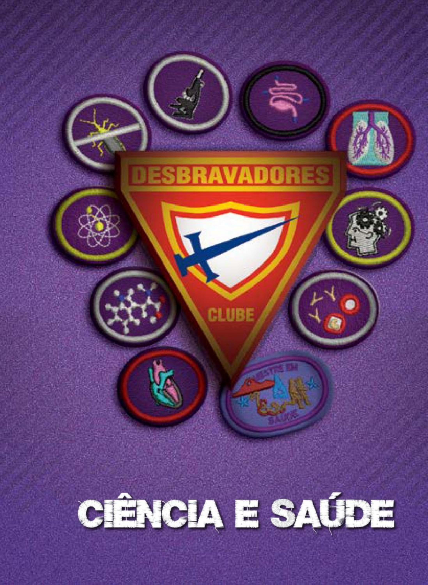

| Especialidade               | Ano  | Código                    | Número |
|------------------------------------|------|---------------------------|--------|
| Saúde e cura                       | 1928 | $\mathsf{CS}\phantom{0}$  | 001    |
| Química                            | 1937 | CS                        | 002    |
| Primeiros socorros - básico        | 1951 | $\mathsf{CS}\phantom{0}$  | 003    |
| Primeiros socorros - intermediário | 1938 | CS                        | 004    |
| Primeiros socorros - avançado      | 1963 | $\mathsf{CS}\phantom{0}$  | 005    |
| Enfermagem básica                  | 1938 | CS                        | 006    |
| Óptica                             | 1962 | $\mathsf{CS}\phantom{0}$  | 007    |
| Nutrição                           | 1981 | CS                        | 008    |
| Alerta vermelho                    | 1986 | $\mathsf{CS}\phantom{0}$  | 009    |
| Nutrição - avançado                | 1986 | CS                        | 010    |
| Reanimação cardiopulmonar          | 1986 | $\mathsf{CS}\phantom{.0}$ | 011    |
| Resgate básico                     | 1986 | CS                        | 012    |
| Física                             | 1989 | $\mathsf{CS}\phantom{A}$  | 013    |
| Microscopia                        | 1994 | CS                        | 014    |
| Digestão                           | 1999 | $\mathsf{CS}\phantom{.0}$ | 015    |
| Ossos, músculos e articulações     | 1999 | CS                        | 016    |
| Sistema nervoso                    | 1999 | $\mathsf{CS}\phantom{0}$  | 017    |
| Sangue e defesas do corpo          | 2000 | CS                        | 018    |
| Hereditariedade                    | 2004 | $\mathsf{CS}\phantom{0}$  | 019    |
| Coração e circulação               | 2006 | CS                        | 020    |
| Bioquímica                         | 2012 | $\mathsf{CS}\phantom{A}$  | 021    |
| Bioquímica - avançado              | 2012 | CS                        | 022    |
| Higiene oral                       | 2012 | $\mathsf{CS}\phantom{0}$  | 023    |
| Higiene oral - avançado            | ٠    | CS                        | 024    |
| Metodologia de estudo              |      | $\mathsf{CS}\phantom{0}$  | 025    |
| Prevenção de doenças tropicais     | 2012 | CS                        | 026    |
| Patrimônio histórico               | 2012 | $\mathsf{CS}\,$           | 027    |
| Saúde mental                       | 2012 | CS                        | 028    |
| Sexualidade humana                 | 2012 | CS                        | 029    |
| Sistema respiratório               | 2012 | CS                        | 030    |
| Habilidades em matemática I        | 2012 | $\mathsf{CS}\phantom{0}$  | 031    |
| Habilidades em matemática II       | 2012 | CS                        | 032    |
| Habilidades em matemática III      | 2012 | $\mathsf{CS}\phantom{0}$  | 033    |
| Habilidades em matemática IV       | 2012 | CS                        | 034    |

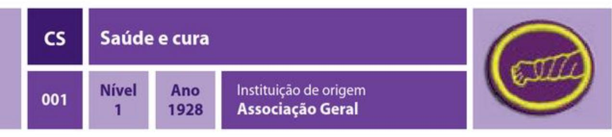

1. Estar, pelo menos, no segundo ano do ensino médio.

2. Aprender, através da Bíblia e/ou do Espírito de Profecia, como Jesus curou os doentes e o procedimento usado pelos anciãos da igreja para ungir o doente e pedir a Deus pela cura. Apresentar um relatório oral sobre o que você aprendeu e escrever um relatório com, no mínimo, 250 palavras.

3. Qual a importância da educação contínua para os profissionais de saúde?

4. Entreviste pelo menos duas pessoas que trabalham na área de saúde. Uma delas deve ter outra profissão que não médico(a) ou enfermeiro (a), como por exemplo, dentista, fisioterapêuta, psicólogo, nutricionista, etc. Em suas entrevistas, faça as seguintes perguntas:

- a) Por que escolheu esta profissão?
- b) Que faculdade (ou cursos) é preciso fazer para trabalhar em sua profissão?
- c) Depois de terminar a faculdade/curso, quanto tempo demora para ter um registro, ou estar apto a exercer a profissão em sua área?
- d) Qual é o aspecto que você mais gosta em seu trabalho? O que gosta menos?
- e) Que dias da semana, e quantas horas diárias, você tem que trabalhar?
- f) Que tipos de promoção você pode ter em sua carreira?
- g) Que outros cursos você poderia fazer para completar seus conhecimentos sobre sua profissão?
- h) Quais algumas instituições em sua cidade que oferecem cursos na sua área?
- 5. Completar uma das seguintes atividades?
  - a) Visitar um consultório médico ou odontológico e fazer o seguinte:
    - · Observar as áreas de operação, tais como a área administrativa, labo- ratório, salas de exames, salas de raios-X, etc.
    - · Pedir ajuda para alguém lhe apresentar o equipamento usado naquele consultório.
    - · Aprender os passos de uma consulta, desde o momento em que em que o paciente chega à sala de espera até o momento em que deixa o consultório.
    - · Aprender como o médico/dentista examina o paciente, desde as anotações da história clínica até o diagnóstico e conduta.
  - b) Fazer uma visita com um enfermeiro(a) que trabalhe a domicílio, e:

- · Aprender os passos de uma visita em domicílio, desde quando o enfermeiro descobre algo sobre o paciente, até o momento em que relata o caso a um médico.
- · Observar o enfermeiro aferir os sinais vitais do paciente.
- · Observar o enfermeiro dar instruções e administrar medicamentos.
- c) Visitar um laboratório ou qualquer instituição que realiza exames complementares (como radiografia, ultrassonografia, eletrocardiograma) e fazer o seguinte:
  - · Observar as diferentes áreas de atuação do departamento.
  - · Pedir que alguém lhe apresente o equipamento usado no departamento, e como funciona.
  - · Aprender os passos dados por um paciente quando vai àquele departamento.
  - · Quantas pessoas tem a equipe do departamento?
  - · O departamento funciona à noite?
  - · Quais exames são realizados?
  - · Quais as orientações aos pacientes para realizarem aqueles exames.
- 6. Através de pesquisa na internet ou visita a uma faculdade/universidade da sua cidade ou estado, descubra quais são as matérias e a duração dos seguintes cursos da área da saúde:
  - a) Biomedicina
  - b) Enfermagem
  - c) Farmácia
  - d) Medicina
  - e) Nutrição
  - f) Odontologia
  - g) Psicologia

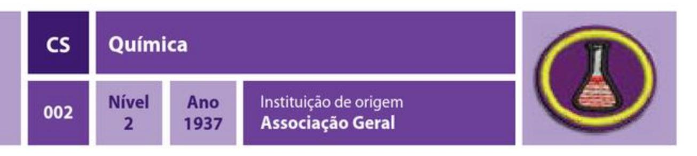

1. Definir o seguinte:

i) Ácido a) Compostos k) Sal b) Soluções c) Transformação química I) Destilação d) Transformação física m) Destilação fracionária e) Átomos n) Filtragem f) Próton o) Combustão g) Néutron p) Dissolução fracionada h) Elétron q) Indicadores ácido/base i) Moléculas

2. Descobrir:

a) O que é tabela periódica e qual a sua importância?

b) O que são elementos químicos?

c) Como os elementos estão agrupados na tabela?

d) O que é número atômico?

e) Como os elementos são representados na tabela?

3. Que gases eliminam a vida? Como? Explicar o princípio de um composto químico que extingue o fogo.

4. Mencionar 2 fontes comuns de monóxido de carbono. Por que é uma substância perigosa?

5. Quais os estados físicos da matéria?

6. Escolher, explicar o fenômeno que está envolvido e fazer 5 das alternativas a seguir:

a) Tentar acender um cubo de açúcar, primeiro sem, e depois com algumas cinzas aplicadas ao cubo, demonstrando a ação catalisadora.

b) Colocar um cubo de gelo num copo com água, colocar um barbante de 10 centímetros em cima do gelo no copo, então solucionar o problema de tirar o cubo de gelo da água sem tocá-lo.

c) Usando água, aguarrás e sabão, transferir uma foto de jornal para uma folha de papel em branco.

d) Usando uma bacia de água, fósforos de madeira, um torrão de açúcar e um pouco de sabão, demonstrar a ação do açúcar e do sabão sobre fósforos que boiam na água.

e) Colocar um ovo fresco em água doce e depois salgar a mesma, anotando a diferença.

f) Demonstrar as cores produzidas quando os elementos a seguir são queimados: sal, cobre, sulfato e ácido bórico.

g) Fazer uma tinta invisível.

h) Usando 3 pedaços de velas de tamanho diferentes e um recipiente de vidro, explicar correntes de convecção e densidade dos gases.

i) Usando uma vela, um pedaço de papel e um anteparo de vidro, explicar a combustão incompleta através do composto formado. Quantos e quais fenômenos estão envolvidos quando uma vela está acesa?

j) Demonstrar a capacidade térmica da água usando alguns dos seguintes materiais: uma vela, um balão ou bexiga, água, álcool 20%, acetona, papel, tripé de arame, papel pregueado.

k) Usando raspas de magnésio, vela e indicador ácido/base, indicar o tipo de reação envolvida e demonstrar a acidez ou a basicidade do composto formado.

I) Usando 2 tubos de vidro, 2 espetos de madeira, bicarbonato de sódio, vinagre, iodeto de potássio e água oxigenada, demonstrar a combustão em presença e na ausência de oxigênio.

m) Utilizando alguns indicadores ácido/base, demonstrar a acidez ou basicidade de alguns produtos encontrados em nosso dia a dia. E também demonstrar uma reação reversível.

n) Em um acampamento, por um descuido, um desbravador derramou o açúcar que deveria ser utilizado para adoçar o suco da refeição na areia. Utilizando-se do que se tem no acampamento, proponha os passos de um método para separar os componentes da mistura em questão. Em seguida, informe se houve alguma transformação química ou física.

o) Quantos e quais fenômenos estão envolvidos quando uma vela está acesa?

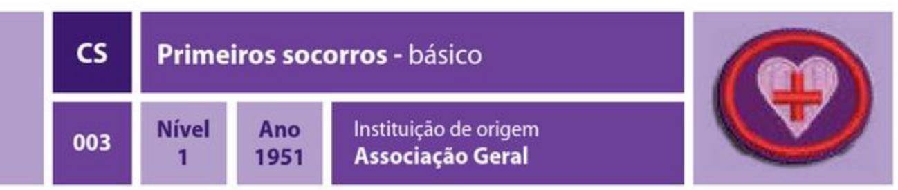

1. O que são primeiros socorros? Quais as suas finalidades?

2. O que é choque? Quais são os principais tipos? Quais as principais causas? Demonstrar o tratamento adequado aos choques hipovolêmico e anafilático.

- 3. Demonstrar a manobra adequada caso uma vítima esteja engasgada.
- 4. Saber o procedimento adequado caso uma vítima esteja com hemorragia.

5. Saber o procedimento adequado para tratar uma vítima de envenenamento.

6. Saber o procedimento apropriado para ajudar vítimas com queimaduras de primeiro, segundo e terceiro graus. Através de desenhos ou modelos, demonstrar a porcentagem de área corporal das seguintes partes do corpo: cabeça, membros superiores, membros inferiores, dorso, tórax e abdome.

7. Saber o procedimento adequado para auxiliar vítimas de queimaduras químicas.

8. Saber que situações podem levar a um envenenamento por monóxido de carbono, e o resgate e técnicas de tratamento para este tipo de envenenamento.

9. Saber o procedimento adequado no tratamento de vítimas com ferimentos na cabeça.

10. Saber o procedimento adequado para auxiliar vítimas com ferimentos internos. 11. Saber como prevenir infecções.

12. Qual o tratamento adequado para picadas de cobra? Saber qual o centro de saúde referência em sua região.

13. Qual o tratamento adeguado para mordidas de animais? O que é raiva? Qual a classe de animais que podem transmitir a raiva?

14. Qual o tratamento adequado para picadas de insetos e aranhas?

15. Qual a diferença entre desidratação e insolação, e qual o tratamento adequado para cada um?

16. Qual o procedimento adequado para uma pessoa que esteja com as roupas em chamas?

- 17. Quais são os princípios básicos para a prevenção de incêndios em sua casa?
- 18. Quais os princípios básicos de segurança em rios, mares e piscinas?
- 19. Quais as maneiras de salvar uma vítima de afogamento, sem nadar?
- 20. Quais são os princípios básicos de segurança em questões de eletricidade?
- 21. Como prevenir a intoxicação alimentar?

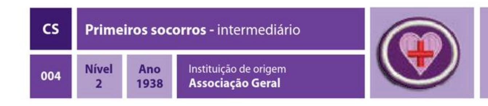

### REQUISITOS

1. Ter a especialidade de Primeiros socorros - básico.

2. O que são EPIs (Equipamentos de proteção individual)? Qual a sua importância para os atendimentos de primeiros socorros?

3. O que significa ABC da vida (ou do socorrista)? Quando deve ser usado? Demonstrar como aplicar as manobras do ABC da vida.

4. Qual é a diferença entre um infarto agudo do miocárdio e um acidente vascular encefálico (AVE)? Qual o procedimento adequado para cada situação?

5. Conhecer os principais pontos de pulso, e demonstrar habilidade para aferir o pulso em pelo menos dois deles.

- 6. Conhecer o método de aplicar um torniquete e quando usá-lo e não usá-lo.
- 7. Saber como aplicar adequadamente as seguintes ataduras:
  - a) Espiral
  - b) Cruzada ou em oito
  - c) Frontal, para a cabeça

d) Demonstrar habilidade aplicando as ataduras acima nas seguintes regiões do corpo: cabeça, antebraço, mão, pé, joelho.

8. Que tipo de materiais podem ser usados como talas em situações de emergência? Saber como aplicar talas às seguintes partes do corpo:

a) Braco

- b) Antebraco
- c) Tornozelo
- d) Joelho
- 9. Conhecer o tratamento adequado para o seguinte:
  - a) Ferimentos na cabeça
  - **b**) Hemorragias internas
  - c) Ferimentos à bala
  - d) Ferimentos no olho
  - e) Desmaio e convulsão
  - f) Efeitos do calor ou frio extremos
- 10. Saber o que fazer num acidente com eletricidade.
- 11. Saber como escapar de um incêndio.
- 12. Saber como obter ajuda numa emergência.

13. Conhecer o procedimento adequado para tratar uma vítima de radiação e quais são as medidas de segurança do socorrista.

14. Conhecer as seguintes maneiras de carregar uma vítima num resgate:

- a) Puxar pelo ombro
- b) Usando um cobertor
- c) Duas pessoas carregam
- d) Carregar pelas extremidades
- e) Maca improvisada
- f) Três pessoas carregam numa rede
- g) Usando maca

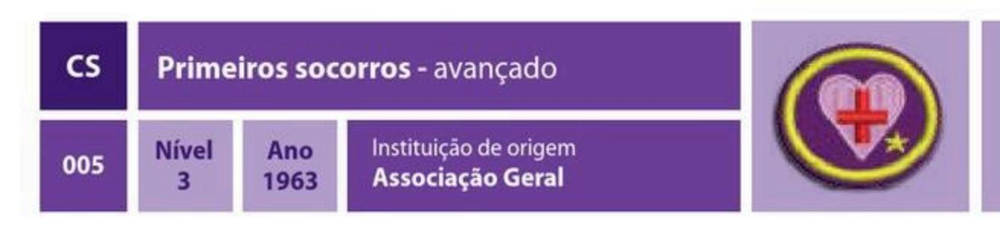

### REQUISITOS

1. Ter a especialidade de Primeiros socorros - intermediário.

2. Como fazer a avaliação de um paciente? Qual a sequência de procedimentos que deve ser seguida? Saber como usar corretamente o ABC da vida (ou do socorrista).

3. Qual o procedimento adequado para acidentes de trânsito? Quais os cuidados com o local do acidente? Quais os cuidados com as vítimas?

4. Ensinar as especialidades de Primeiros socorros - básico e Primeiros socorros intermediário a um grupo de desbravadores ou alunos.

5. Montar um portfólio de materiais de primeiros socorros, para deixar na biblioteca do seu Clube.

6. Quais são os aspectos éticos e legais, em seu país, envolvidos na prestação de primeiros socorros? Defina os seguintes termos:

- a) Omissão de socorro
- b) Abandono
- c) Negligência
- d) Imperícia
- e) Imprudência

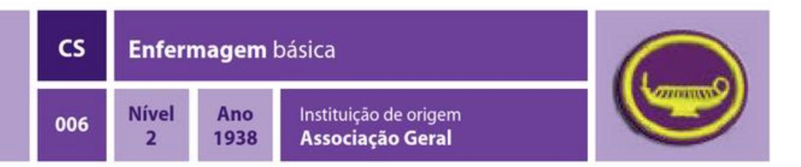

- 1. Ter a especialidade de Primeiros socorros básico.
- 2. Que alimentos estão incluídos nas seguintes dietas?
  - a) Líquida
  - b) Pastosa
  - c) Regular
  - d) Diabética
  - e) Hipossódica

3. O que é febre? Conhecer os sinais e sintomas da febre. Saber como aferir a temperatura de alguém. Saber o que fazer para abaixar uma temperatura febril.

4. Saber qual é o ritmo normal de pulso e respiração, bem como qual é a temperatura normal. Praticar aferir o pulso, respiração e temperatura de um amigo ou colega do seu Clube.

5. O que é uma doença contagiosa? Quais são as vias de transmissão? Que precauções devem ser seguidas para evitar a transmissão dessas doenças? Relacione medidas de segurança a serem observadas ao cuidar de alguém em sua casa que esteja com uma doença contagiosa.

6. Saber como ajudar a cuidar de um recém-nascido e de uma pessoa idosa. Cuidar de um recém-nascido ou idoso por pelo menos um turno (manhã, tarde ou noite).

7. Saber quando e como lavar as mãos quando estiver cuidando de alguém doente.

8. Saber como deixar um paciente que está de cama mais confortável sem mudar de cama.

9. Demonstrar como alimentar um paciente que está imóvel na cama.

10. Demonstrar como administrar remédios líquidos, comprimidos, pílulas ou cápsulas para crianças e adultos. Saber como aplicar colírio nos olhos.

11. Demonstrar o método de aplicar fricção e escalda-pés. Explicar o valor terapêutico de seu uso, e dizer sob que condições estes tratamentos deveriam ser aplicados.

12. Demonstrar a aplicação de uma compressa e o uso de calor ou frio para o tratamento de inflamações e machucados.

13. Explicar como os remédios a seguir ajudam na prevenção de doenças: a) Alimentação saudável

b) Exercício físico

c) Água d) Luz do sol e) Temperança  $f)$  Ar g) Descanso h) Confiança em deus

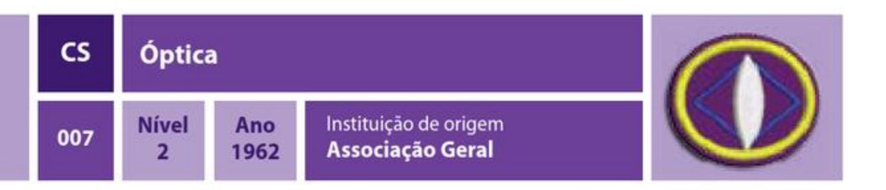

1. Definir e desenhar um gráfico dos seguintes sistemas ópticos:

- a) Centro óptico g) Lentes esféricas
- b) Foco h) Aberração cromática
- c) Distância focal i) Refração da luz
- d) Ponto antiprincipal
- j) Reflexão da luz k) Reflexão total
- e) Lente convergente (positiva) f) Lente divergente (negativa)

2. Explicar como a luz se comporta quando atinge ou atravessa água, óleo, metais e um espelho.

3. Mencionar o nome e fazer diagramas de 3 tipos de lentes convergentes e 3 tipos de lentes divergentes.

4. Fazer a construção geométrica das imagens em lentes convergentes, informando a natureza da imagem, sua localização, tamanho, orientação e dê exemplos:

a) Objeto antes do ponto antiprincipal objeto (Ao)

b) Objeto sobre o ponto antiprincipal objeto (Ao)

c) Objeto entre o ponto antiprincipal objeto e o foco objeto (Ao e fo)

d) Objeto sobre o foco objeto (fo)

e) Objeto entre o foco objeto e o centro óptico (fo e O)

5. Fazer a construção geométrica das imagens em lentes divergentes.

a) Objeto sobre o ponto antiprincipal objeto (Ao)

b) Objeto entre o ponto antiprincipal objeto e o foco objeto (Ao e fo)

c) Objeto sobre o foco objeto (fo)

d) Objeto entre o foco objeto e o centro óptico (fo e O)

6. Demonstrar, através de gráficos, como funciona um prisma. Marcar os ângulos em que as cores aparecem e desaparecem.

7. Demonstrar o que acontece quando a luz atravessa um vidro translúcido.

8. Com uma lente convergente e os raios solares, acender uma fogueira e explicar o porquê isso acontece. Explicar também o porquê não é possível acender uma fogueira com uma lente divergente.

9. Construir um instrumento óptico usando espelhos ou lentes, tais como um periscópio, um projetor de slides ou um telescópio simples.

10. Explicar o que significa o termo 6x35 e 7x50 aplicado a binóculos.

11. Definir o termo "número-f" usado em conexão com câmeras fotográficas. O que significa o fato de uma lente ser rápida ou lenta? Uma lente f-8,5 é mais rápida ou mais lenta que uma lente f-8?

12. Como os 10 Mandamentos podem ser comparados com um espelho?

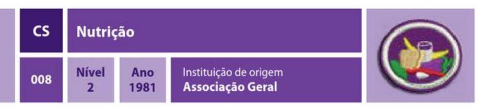

1. O que são nutrientes?

2. Desenhar e descrever a pirâmide alimentar. Mencionar o número de porções diárias exigidas de cada grupo.

3. Definir o seguinte, listando, pelo menos, 3 exemplos de alimentos em cada um dos grupos:

a) Alimentos energéticos

**b)** Alimentos construtores

c) Alimentos reguladores

- 4. O que são VDR (Valores Diários de Referência) e qual a sua importância?
- 5. O que é uma dieta balanceada?
- 6. Explicar as diferenças entre as seguintes dietas:
  - a) Ovo-lacto-vegetariano

b) Ovo-vegetariano

c) Vegetariano estrito

7. Qual o nome e a função das seguintes vitaminas? Fazer uma lista de, pelo menos, 3

alimentos fontes dos seguintes nutrientes:

| a) Vitamina A          | f ) Vitamina C |  |
|------------------------|-----------------------|--|
| b ) Vitamina B1 | g) Vitamina D         |  |
| c) Vitamina B2         | h) Vitamina E         |  |
| d ) Vitamina B6 | i) Vitamina K         |  |

e) Vitamina B12

8. Qual a função dos seguintes minerais no nosso organismo? Fazer uma lista de, pelo menos, 3 alimentos fontes de cada um:

e) Potássio a) Ferro f) Flúor b) lodo c) Cálcio g) Zinco

d) Sódio

9. Comparar as informações nutricionais dos seguintes alimentos:

a) Leite integral e leite desnatado

b) Farinha de trigo branca e farinha de trigo integral

c) Pão integral e pão branco

d) Arroz integral e arroz branco

10. Qual a diferença entre alimentos diet e alimentos light?

11. Por que é importante beber bastante água diariamente? Qual a quantidade recomendável para cada dia? O que é intoxicação hídrica?

12. Citar o nome de 3 doenças comuns que podem ser controladas com uma dieta apropriada.

13. Por que o Governo de alguns países determina a inclusão de iodo, ferro, ácido fólico e flúor em alimentos básicos como farináceos, sal e água? Qual o impacto desta medida na saúde da população?

14. Planejar um cardápio para dois dias, contendo uma dieta ovo-lacto-vegetariana balanceada, utilizando as informações da pirâmide alimentar. Utilizar vegetais comuns em sua região e de acordo com a época do ano.

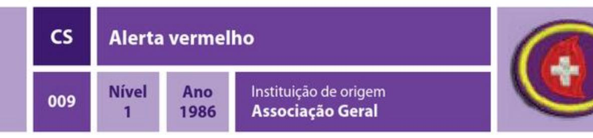

1. Explicar o que deve ser feito para evitar ferimentos e/ou possível perda da vida nas situações a seguir:

a) Incêndio em sua casa, ou na casa de um vizinho, ou em prédio público

b) Se estiver perdido, de carro, num lugar ermo ou deserto

c) Acidente automobilístico

d) Terremoto

e) Enchente

f) Ciclone

g) Furacão

h) Tempestade

i) Acidente nuclear

i) Desmoronamento

k) Se barco ou canoa vira em mar aberto

2. Ao telefonar pedindo ajuda numa emergência, que informações essenciais devem ser dadas, e quem deve desligar o telefone por último? Quais são os principais números de emergência em seu país?

3. Demonstrar que medidas de primeiros socorros você deveria tomar numa emergência nas seguintes circunstâncias:

a) A roupa de alguém pega fogo

**b**) Uma grave hemorragia

c) Alguém está se sufocando

d) Alguém engoliu veneno

4. Fazer o sequinte:

a) Desenhar uma rota de escape para sua família em caso de incêndio em sua casa, para o caso das saídas normais estarem bloqueadas.

b) Fazer com sua família um treinamento para o caso de incêndios.

c) Discutir com seu orientador, os procedimentos para retirar pessoas da igreja e escola em caso de incêndio. Deve-se analisar alternativas para prevenir o pânico.

5. O que você e seus pais devem fazer para prevenir o sequestro de crianças em sua família? O que você deveria fazer se fosse sequestrado?

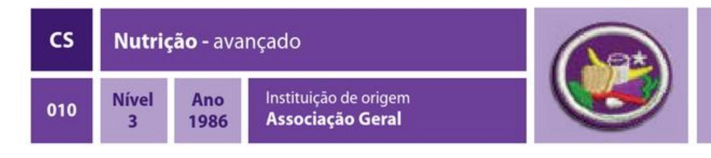

### REQUISITOS

- 1. Ter a especialidade de Nutrição.
- 2. Ler um livro sobre nutrição.

3. O que é dieta? Explicar os seguintes tipos e em quais casos são indicados:

a) Hipossódica

b) Hipocalórica

c) Diabética

d) Alto teor de proteínas e baixo de carboidratos

e) Restrição de gorduras

f) Rica em fibras

g) Restrição a proteínas

4. Qual a orientação nutricional que deve ser dada a uma pessoa que decide ser vegetariano estrito.

5. Estudar o livro Conselhos sobre o regime alimentar, de Ellen White, e fazer uma apresentação oral de, no mínimo, 10 minutos explicando as vantagens de uma dieta ovo-lacto-vegetariana.

6. Qual é a diferença entre gorduras saturadas, gorduras insaturadas e gorduras trans? Qual delas é mais saudável e por quê?

7. Qual a diferença entre os colesteróis HDL e LDL? Quais alimentos são ricos em cada um deles?

8. Fazer um quadro listando as frutas, verduras e legumes comuns em sua região e em quais meses do ano ocorre sua safra. Qual a importância de se dar preferência aos vegetais da estação?

9. O que são nutrição enteral e nutrição parenteral? Quais os casos em que elas são indicadas?

10. Realizar o seguinte:

a) Manter um diário alimentar baseado em sua própria alimentação durante 1 semana.

b) Qual a porção diária recomendada dos seguintes nutrientes para o seu peso, sexo e idade:

· Calorias

· Carboidratos

· Proteínas

- · Gorduras
- · Sódio
- · Fibra alimentar
- · Ferro
- · Cálcio

c) Com base no diário feito no item "a", comparar a quantidade diária recomendada dos nutrientes acima com a quantidade que você ingere. O que precisa/deve ser mudado em sua dieta?

i) Kwashiorkor

11. Ler Levítico 11 e explicar por que Deus classificou os animais entre puros e imundos.

12. As seguintes doenças são causadas por que tipo de deficiência nutricional?

- a) Cegueira noturna f) Bócio **b**) Raquitismo **g)** Escorbuto h) Marasmo
- c) Anemia hemolítica
- d) Anemia megaloblástica

e) Anemia ferropriva

- 13. Quais prejuízos à saúde os seguintes hábitos alimentares causam:
  - a) Uso excessivo do sal
  - b) Uso excessivo do açúcar
  - c) Dieta rica em gorduras
  - d) Uso excessivo de condimentos
  - e) Uso de alimentos processados
  - f) Alimentos estimulantes, como: chá preto/mate/verde, café, xarope de guaraná/
  - guaraná em pó
  - g) Refrigerantes e sucos artificiais
  - h) Comer no intervalo das refeições
  - i) Comer em grandes quantidades

14. Estudar as seguintes doenças e, sobre cada uma, explicar: como ocorre, sinais e sintomas, como preveni-las (quando for o caso) e quais as alterações necessárias na dieta de uma pessoa que as possui:

- a) Diabetes
- b) Hipertensão arterial sistêmica (pressão alta)
- c) Osteoporose
- d) Doença celíaca
- e) Intolerância à lactose
- f) Aterosclerose

15. Estudar os seguintes distúrbios alimentares e explicar os riscos à saúde, como é possível detectá-las e qual o tratamento adequado. Quais os profissionais devem estar envolvidos no tratamento de uma pessoa com essas doenças? Fazer uma

palestra apresentando as informações obtidas para os desbravadores das Classes de Excursionista e Guia ou para a classe dos adolescentes (Escola Sabatina).

- a) Anorexia
- b) Bulimia
- c) Hiperfagia
- d) Ortorexia

16. O que são suplementos alimentares? Com a ajuda de um nutricionista, indicar os mais comuns e explicar em quais casos são realmente necessários. Mencionar quais os riscos de se utilizar cada um deles sem a devida orientação de um nutricionista ou médico.

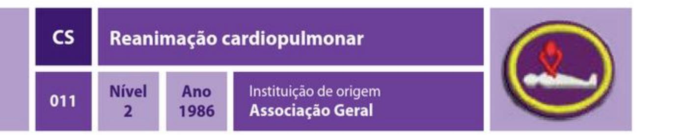

- 1. Ter a especialidade de Coração e circulação.
- 2. Através de desenhos ou modelo, identificar o coração e os pulmões. Qual a função de cada um? Saber onde se localizam em seu corpo.
- 3. Definir reanimação cardiopulmonar e mencionar quando deve ser utilizada.
- Diferenciar ventilação isolada, massagem cardíaca isolada e reanimação
- cardiopulmonar. Quando devemos usar cada uma dessas manobras? Qual a frequência de cada uma delas?
- 4. Completar um curso ministrado por um instrutor qualificado para aprender corretamente, e demonstrar, o processo de reanimação cardiopulmonar. Isso deve ser feito no máximo um ano antes desta especialidade.
- 5. Saber como manter o coração saudável. Relacionar cinco coisas que uma pessoa pode fazer para manter um coração saudável.
- 6. Desenvolver, manter e registrar num diário um programa personalizado de exercícios, saúde e dieta durante um mês.
- 7. Aprender o significado das cores e desenho utilizados na insígnia desta especialidade, de acordo com o seguinte:
  - a) A pessoa que precisa de reanimação cardiopulmonar pode estar pálida (branca), o que significa que não há circulação.
  - b) A pessoa que está fazendo a reanimação cardiopulmonar está vermelha, o que significa que está bem ativa.
  - c) A borda dourada representa o valor da vida humana.
  - d) Um coração é formado pela cabeça, ombros e braços da pessoa que está fazendo a reanimação cardiopulmonar, o que significa compaixão pelo próximo.

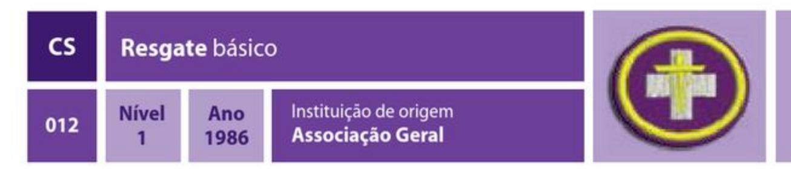

### REQUISITOS

- 1. O que é resgate de emergência?
- 2. Demonstrar como resgatar, com segurança, uma pessoa nas seguintes situações:
  - a) Em contato com cabo elétrico
  - b) Em ambiente cheio de fumaça ou gás
- c) Com as roupas em chamas
- d) Afogando-se, sem qualquer equipamento de resgate
- e) Um acidente no gelo
- 3. Conhecer três maneiras de atrair e comunicar-se com um resgate aéreo.
- 4. Conhecer seis atitudes indicadas em caso de necessidade de resgate imediato.
- 5. Conhecer seis procedimentos a seguir antes de remover uma vítima de situação que apresenta risco de morte.
- 6. Conhecer as maneiras apropriadas de ajudar uma vítima, em perigo, nas seguintes situações:
  - a) Puxar a vítima
  - b) Içar/levantar a vítima
  - c) Ajudar a vítima a caminhar
- 7. Conhecer a forma adequada de ajudar uma vítima, com ajuda de outros, nas seguintes situações:
  - a) Carregar uma pessoa sentada
  - **b**) Carregar uma pessoa deitada
  - c) Carregar com duas mãos, ou quatro mãos
  - d) Carregar com cobertor
  - e) Carregar, em três, vítima em rede, em decúbito dorsal e ventral
  - f) Carregar em três ou quatro pessoas
- 8. Fazer uma maca improvisada e carregar uma pessoa nela.
- 9. Cumprir os seguintes itens:
  - a) Atar, pelo menos, 3 nós para juntar cordas
  - b) Atar um nó para diminuir corda
  - c) Atar um nó para usar ao redor de alguém num resgate
- d) Enrolar e jogar corretamente uma corda leve e uma pesada, de 15 metros cada. 10. Que passos devem ser dados antes de comunicar que alguém está desaparecido? Que informações serão necessárias ao informar à polícia o desaparecimento de alguém? Como devem ser conduzidas as buscas por alguém perdido numa área selvagem?

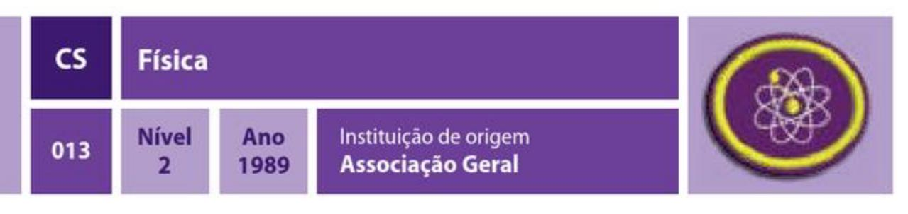

1. Definir o seguinte:

| i) Matéria             |
|------------------------|
| j) Inércia             |
| k) Atrito              |
| I) Onda                |
| m) Centro de gravidade |
| n) Notação científica  |
| o) Zero absoluto       |
| p) Fulcro              |
|                        |

2. O que é método científico? Como o método científico pode ser usado no estudo da Bíblia?

3. O que é uma experiência controlada?

4. Explicar os termos na equação  $E = MC2$ , de Albert Einstein.

5. Quais são as unidades de medida de massa, comprimento e tempo usadas pelo Sistema Internacional (SI)?

6. Que unidades de medida são usadas para as profecias de tempo na Bíblia? Em quais livros, capítulos e versículos podem ser encontradas?

7. Relacionar as 3 leis do movimento de Newton.

8. Usando uma toalha de mesa e vários livros pesados, demonstrar a primeira lei de Newton.

9. Usando um balão cheio de ar, demonstrar a terceira lei de Newton.

10. Demonstrar a experiência de Galileu – queda de um corpo - derrubando duas garrafas de plástico (uma cheia de água e a outra pela metade) ao mesmo tempo, de uma altura de 2 metros. Registrar os resultados e retirar uma aplicação espiritual da experiência.

11. Demonstrar a vantagem mecânica da alavanca, retirando um prego grande, pregado bem fundo numa madeira, usando apenas um martelo. Puxar um segundo prego usando um martelo e um pequeno bloco de madeira, localizado perto do prego, sob a cabeça do martelo. Anotar a diferença de força exigida para puxar o prego com as diferentes posições do martelo no bloco (fulcro) e tirar uma aplicação espiritual desta experiência.

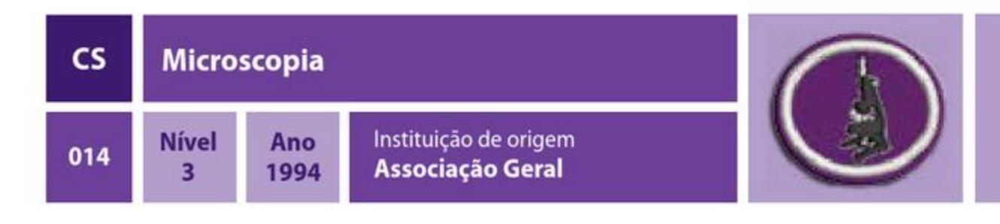

### REQUISITOS

1. Fazer uma redação de, no mínimo, 500 palavras sobre a história dos microscópios. 2. Conhecer os microscópios abaixo, identificando-os pessoalmente ou através de figuras e fotos. Informar as principais características de cada um.

a) Microscópio óptico

b) Microscópio eletrônico de varredura

c) Microscópio eletrônico de transmissão

d) Microscópio de força atômica

3. Ser capaz de identificar as seguintes partes de um microscópio e explicar e demonstrar a função de cada uma: ocular, objetiva, revólver, platina, condensador, base, foco (parafuso micrométrico e parafuso macrométrico) e braço.

4. Saber como calcular a ampliação em um microscópio ótico composto. Calcular a ampliação do microscópio que você está usando para esta especialidade.

5. Definir os seguintes termos microscópicos:

a) Lâmina b) Lamela c) Exame direto a fresco (ou exame direto ou exame fresco) d) Fixador e) Corantes

f) Óleo de imersão

6. Coletar amostras de água (de lagoas, riachos, rios, lagos, poças), prepará-las corretamente e procurar micro-organismos usando um microscópio com, pelo menos, 100x de ampliação. Desenhe 5 desses organismos com o máximo de precisão possível. No desenho, rotular as estruturas identificadas (incluindo a ampliação usada).

7. Citar, pelo menos, um exemplo de como a microscopia é importante para:

a) Alimentação humana **b**) Saúde humana

c) Medicamentos d) Outros organismos

8. Citar, pelo menos, três hábitos de saúde que foram estabelecidos como resultado direto dos prejuízos dos organismos microcelulares que foram evidenciados após a descoberta dos microscópios. Coloque esses hábitos em prática.

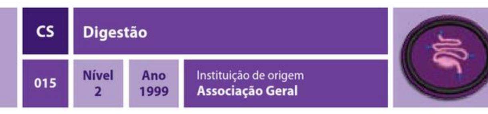

1. Ter a especialidade de Nutrição.

2. Fazer um registro do que e quanto você come por uma semana. Agora analise com as porções recomendadas de acordo com a Nova Pirâmide Alimentar. De acordo com o resultado, o que você precisa mudar na sua alimentação?

- 3. O que é digestão? Qual outro nome dado ao sistema digestivo/digestório humano?
- 4. Onde é formada a saliva? Quais são as três principais funções dela?

5. Saber identificar as seguintes partes do dente, descrevendo cada uma: esmalte, dentina, polpa, gengiva, cemento e ligamento periodontal. Qual é o papel do dente na digestão?

6. Ser capaz de identificar, através de figuras, os seguintes órgãos que participam do processo digestivo, descrevendo cada um: Boca, glândulas salivares, esôfago, estômago, fígado, pâncreas, intestino delgado (duodeno, jejuno e íleo), intestino grosso (ceco, cólon ascendente, cólon transverso, cólon descendente, cólon sigmóide, reto) e ânus.

- 7. Qual é a diferença entre bolo alimentar e quimo?
- 8. O que é a bile? Onde é formada? Qual é a sua função e onde é liberada?

9. O que são vilosidades? Por que elas fazem o alimento ser absorvido com maior velocidade? Faça o seguinte experimento: pegue um papel comum e papel toalha de tamanho parecido. Derrame em cada um uma colher de sopa de água. Observe e faça uma comparação com a absorção pelas vilosidades.

10. O que são fibras alimentares? Qual a importância delas para o processo digestivo? O que acontece se os alimentos permanecerem por mais tempo dentro do trato qastrointestinal?

11. Demonstrar a digestão do amido em açúcar, utilizando o teste do iodo.

12. Descreva os seis elementos básicos essenciais para a vida: carboidratos, proteínas, lipídios, vitaminas, minerais e água, e onde ocorre a digestão/absorção deles.

13. Saber a diferença entre monossacarídeos, oligossacarídeos e polissacarídeos. 14. O que são aminoácidos? Quantos são? Qual é a diferença entre aminoácidos

essenciais e não essenciais? Quais são as principais fontes de aminoácidos?

15. Liste 3 conselhos divinos em relação à nossa alimentação.

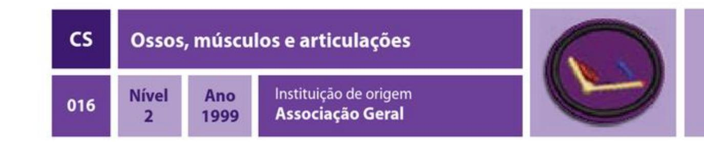

### REQUISITOS

1. Qual a diferença entre endoesqueleto e exoesqueleto? Qual desses tipos de esqueleto os humanos têm?

2. Cite, pelo menos, três funções do sistema esquelético.

3. Descreva:

- a) Esqueleto axial
- b) Esqueleto apendicular

4. Descreva a classificação dos ossos de acordo com o seu formato, ilustrando-os.

5. Quantos ossos tem um ser humano adulto?

6. Desenhar ou colar uma figura de esqueleto, identificando, no mínimo, 25 ossos, sem repeti-los.

7. Descreva a estrutura e o desenvolvimento do esqueleto. Defina diáfise, metáfise e epífise, ilustrando.

8. O que é disco epifisário e qual a sua importância?

9. O que são articulações? Descreva as suas 3 classes com as suas subdivisões, ilustrando todas.

10. Fazer um modelo de uma das 6 articulações sinoviais.

11. O que é fratura óssea? Como é feita a correção médica? Descreva os seguintes tipos, ilustrando-os: externa (exposta) e interna; transversal, oblíqua e espiral; completa e incompleta; comuitiva e galho verde.

12. Faça o desenho ou cole figuras de uma coluna vertebral, saber dividi-la nas suas 5 regiões e dizer quantas vértebras formam cada uma.

13. O que é osteoporose? Quais os locais mais comuns de fratura? Qual é a idade de risco? Quem é o público mais afetado? Qual o melhor exame para detectá-la? Cite 5 cuidados que ajudam a prevenir a osteoporose.

14. Quais são as principais funções dos músculos?

15. Descreva, dando pelo menos 3 exemplos de cada um (se houver):

a) Músculo estriado esquelético

- **b**) Músculo estriado cardíaco
- c) Músculo liso

16. Identifique os seguintes músculos: masseter, trapézio, deltóide, peitoral maior, bíceps, quadríceps, tríceps, reto abdominal, serrátil anterior, glúteo máximo, grande dorsal, gastrocnêmio e sóleo.

17. Descreva o mecanismo de contração muscular.

18. Descreva a diferença entre músculos voluntários e músculos involuntários.

19. Encontre, pelo menos, três versos bíblicos que mencionem músculos, ossos ou articulações.

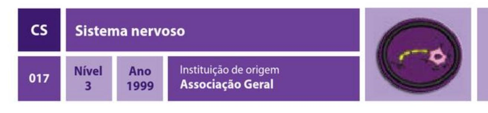

### REQUISITOS

1. Fazer um diagrama ou modelo de um encéfalo humano, incluindo as seguintes partes: medula, ponte, cerebelo, tálamo, hipotálamo, hipófise e cérebro. Descreva a função básica de cada um.

2. O que é um neurônio? Desenhe um neurônio e identifique as suas partes. Por onde a informação entra no neurônio e por onde ela o deixa? O que é sinapse?

3. Quais são os órgãos e estruturas que compõem o sistema nervoso?

4. Diferenciar Sistema Nervoso Autônomo Simpático e Sistema Nervoso Autônomo Parassimpático, descrevendo as principais atividades relacionadas a cada um deles. 5. Explicar como as drogas afetam a função dos neurônios, especialmente a sinapse. Fazer um compromisso de nunca usar drogas.

6. O que é reflexo? Faça o teste do reflexo patelar em alguém. (Instruções: peça para alguém ficar sentado com os pés sem encostar no chão. Gentilmente dê uma pequena batida abaixo do joelho). Explique porque esse reflexo ocorre (usar no seu relatório os seguintes termos: neurônio sensorial, neurônio motor, medula espinhal). Porque os médicos usam esse teste num exame físico?

7. O que é neurônio sensorial? O que é adaptação? Demonstrar o que é adaptação fazendo o seguinte:

a) Descanse o seu braço numa mesa e coloque uma tampa (ou algo muito leve) sobre ele. Note o que você está sentindo naquele momento e um minuto depois, sem mover o braço de lugar.

b) Coloque um dedo de uma mão numa tigela com água fria e outro dedo de outra mão numa com água morna. Depois de 30 segundos, coloque os dois dedos numa tigela com água em temperatura ambiente. O que você sentiu em cada dedo?

c) Qual a lição espiritual que você pode tirar do conceito de adaptação? 8. Quais são os sabores percebidos pelo paladar? Desenhe um mapa da sua língua, demonstrando quais partes dela responde aos seguintes sabores: doce, azedo, amargo e salgado. Instruções: mergulhe um cotonete em um dos seguintes: água com açúcar (para doce), suco de limão (para azedo), caldo de jiló ou guariroba (para amargo) e água salgada (para salgado). Depois, toque levemente em diferentes partes da sua língua. Note quais áreas na sua língua sentem o gosto da solução. Enxague com água pura e use um novo cotonete com outra substância.

9. Fazer o esquema de um olho (modelo, desenho, etc.), identificando as seguintes partes: pupila, íris, córnea, esclera, cristalino, humor aquoso, humor vítreo, retina, nervo óptico. Explique a função de cada uma delas. Por que você tem um ponto cego? Encontre o seu ponto cego. Instruções: colocar um ponto preto bem pequeno no centro de uma folha branca. feche um dos olhos e olhe diretamente para frente. Segure o papel e vá movendo até que o ponto preto desapareça (geralmente isso ocorre quando o ponto está um pouco abaixo do nível do olho - isso é importante). 10. Fazer um esquema de um ouvido (modelo, desenho, etc.), identificando as seguintes partes: pavilhão auditivo, meato (ou conduto) auditivo externo, tímpano, martelo, bigorna, estribo, tuba auditiva, cóclea e canais semi-circulares. Explique a função de cada uma delas. Identificar as três partes do ouvido. Explique porque as seguintes atividades podem ser prejudiciais à sua audição:

a) Ouvir algo em fones de ouvido

b) Colocar algum objeto no ouvido / usar cotonetes

- c) Ir a um show / apresentações com música alta
- d) Não tratar uma infecção do ouvido corretamente

11. Fazer uma ou mais das seguintes atividades (algumas delas podem precisar ser planejadas com um médico ou dentista ou junto a uma faculdade ou universidade):

a) Observe um eletroencefalograma e explique a sua função.

b) Observe uma ressonância nuclear magnética ou uma tomografia computadorizada e explique a sua função.

c) Observe alguém sendo anestesiado e explique como uma anestesia funciona.

12. Listar pelo menos cinco coisas que você pode fazer para proteger o seu cérebro de danos.

#### 13. Fazer um dos seguintes:

a) Visite e ajude alguém (mínimo de 2 horas) que tem uma doença cognitiva ou do sistema nervoso e descreva quais cuidados especiais são necessários.

b) Descreva brevemente as seguintes desordens do sistema nervoso: doença de Alzheimer, esclerose múltipla, epilepsia, depressão, síndrome de Down, doença de Huntington, quadriplegia e paraplegia.

14. Encontrar pelo menos três versos bíblicos que se referem ao sistema nervoso ou ao processo de tomada de decisões.

#### Sangue e defesas do corpo **CS** Instituição de origem **Nível** Ano 018 Associação Geral 2000 3

### REQUISITOS

1. Nomear os 2 componentes do sangue. Qual a porcentagem de cada um? 2. Desenhar ou colar fotos dos seguintes tipos celulares do sangue, identificando todos: hemácia, plaqueta, neutrófilo, linfócito, eosinófilo, basófilo e monócito. Qual(ais) a(s) principal(ais) função(ões) de cada um?

3. Fazer 2 das seguintes opções:

a) Observar algum profissional de saúde retirando o sangue de alguém e descreva quais são os cuidados necessários.

b) Visitar um laboratório onde são feitos exames de sangue. Se informar sobre quais exames são realizados lá e quais os procedimentos necessários para pelo menos 3 deles.

c) Visitar um banco de sangue. Perguntar como é feito o armazenamento do sangue, qual é o prazo de validade e quais os tipos com menor estoque.

4. Quais gases são transportados pelas hemácias? Explicar porque o sangue nas suas veias aparece azul/verde, mas se você se cortar ele é vermelho brilhante. Explicar porque a falta de ferro na dieta faz com que o sangue fique com uma tonalidade menos avermelhada.

5. Explicar como é formado um coágulo sanguíneo. Qual é o primeiro socorro utilizado para ajudar nesse processo?

6. O que é preciso para ser um doador de sangue? Quais são os cuidados e recomendações principais? Quem não pode doar sangue?

7. Qual é o seu tipo sanguíneo? Para quais tipos sanguíneos você pode ser doador? De quais tipos sanguíneos você pode receber doação? Por quê? Faça uma tabela mostrando a compatibilidade sanguínea entre todos os tipos sanguíneos.

8. Além das células estudadas no item 2, quais são as outras células envolvidas na defesa do nosso organismo? Ilustre cada uma delas.

9. O que são anticorpos? Como eles atuam? São produzidos por quais células? 10. Citar, pelo menos, 5 diferenças entre o resposta imunológica inata e resposta imunológica adquirida.

11. Citar 2 textos bíblicos em que o sangue está envolvido. Depois de estudar sobre o sangue, por que você acha que a Bíblia usa o sangue como símbolo do poder salvador de Deus?

12. Listar 10 hábitos de saúde que podem ajudar o seu corpo a se manter saudável e combater a infecção. Encontrar um texto do Espírito de Profecia para cada um deles. Mantenha um registro de, no mínimo, 1 mês no qual você aplicou estes hábitos.

### 13. Definir os seguintes termos

- a) Imunologia
- b) Patógeno
- c) Inflamação
- d) Memória
- e) Vacina
- f) Alergia
- g) Histamina
- h) Antígeno
- i) Febre

14. Citar 3 espécies de plantas tóxicas encontradas na sua região. O que fazer para evitar reação alérgica a elas? O que fazer caso tenha uma reação alérgica?

- 15. Descrever como funcionam as vacinas e os soros. Verificar seu cartão de vacina. caso esteja faltando alguma, procure um serviço médico e deixe-o em dia.
- 16. O que é AIDS? Como é transmitida? Existe cura? Qual a diferença entre HIV positivo e aidético?

17. Encontrar 3 referências bíblicas que falem sobre limpeza e controle da propagação das doenças.

18. Onde as células sanguíneas são produzidas? Onde são hemolisadas? Qual é o tempo médio que uma hemácia vive?

# 19. Realizar um dos seguintes:

a) (Para aqueles com menos de 18 anos): convidar uma pessoa para doar sangue e acompanhar o processo de doação.

b) (Para aqueles com mais de 18 anos): procurar o sistema médico e fazer uma doação de sangue (se estiver apto). Caso não possa doar, convidar uma pessoa para doar e acompanhar o processo de doação.

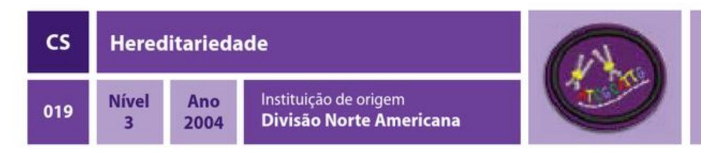

### REQUISITOS

# 1. O que é hereditariedade?

2. Desenhe uma célula animal e identifique as seguintes partes: membrana plasmática, citoplasma, núcleo, carioteca e ribossomos.

- 3. Explique o seguinte:
  - a) O que é um cromossomo e onde está localizado?
  - b) O que é gene e onde ele é encontrado?
- 4. Explique o sequinte:
- a) O que é alelo?
- b) Qual a diferença entre alelo dominante e alelo recessivo?

c) Determine que tipo de alelo se tem nos seguintes traços genéticos (fenótipos): bico de viúva, lóbulo da orelha solto, covinhas, língua enrolada, miopia, ser canhoto e furo no queixo.

d) Usando o quadrado de Punnet, preveja a proporção dos seguintes cruzamentos: TT (alto) com tt (baixo); Tt (alto) com Tt (alto); Tt (alto) com tt (baixo).

# **5.** Explique o seguinte:

a) O que é mitose? Qual a sua função?

b) Desenhe uma sequência de células mostrando o processo de mitose, incluindo: prófase, metáfase, anáfase e telófase.

c) Explique como o DNA é copiado no cromossomo durante este processo.

# **6.** Explique o seguinte:

a) O que é meiose? Qual a diferença entre mitose e meiose?

b) Desenhe uma sequência de células mostrando o processo da meiose, incluindo: intérfase, prófase I, Metáfase I, Anáfase I, Telófase I, Prófase II, Metáfase II, Anáfase II e Telófase II.

c) As células resultantes da meiose permanecem diplóides? Explique.

7. Quais são os nucleotídeos envolvidos no processo de replicação do DNA? Descrever como ocorre a replicação de um DNA. Demonstre seu conhecimento sobre esse assunto usando um diagrama ou modelo.

8. O que é mutação? Usando o diagrama ou modelo criado na questão anterior, ilustre o efeito de uma mutação no código genético.

9. Conhecer pelo menos cinco distúrbios genéticos e contar uma história sobre alguma

pessoa famosa ou alguém que você conhece que tem uma dessas doenças. 10. A genética é o único fator que contribui para as suas características (físicas, mentais, sociais e espirituais)? Que outros fatores influenciam a sua vida e a sua personalidade?

11. Encontre três citações da Bíblia ou do Espírito de Profecia que se relacionem com a sua resposta da questão anterior.

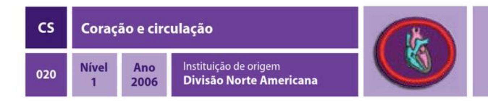

### REQUISITOS

1. Quais são as estruturas que formam o sistema circulatório? Ilustrar e descrever as principais funções de cada uma.

2. Descrever os tipos de vasos que compõem o sistema circulatório, ilustrando cada um deles.

3. Saber localizar os seguintes pontos de pulso: carotídeo, braquial, radial, inguinal e poplíteo. Saber aferir a freqüência de pulso de 2 pessoas, usando um dos pontos acima.

4. Registrar seu pulso em repouso, em seguida fazer exercícios (correr, nadar, subir escadas, etc.) por 10 minutos. Aferir novamente o seu pulso imediatamente e 5 minutos após o exercício. Fazer isso todos os dias por uma semana registrando seus resultados em um cartão ou gráfico. O exercício afetou os batimentos do seu coração? 5. Fazer um estetoscópio simples e escutar o coração de alguém.

6. Quais são as 4 câmaras do coração? Quais são as suas 4 principais valvas? Ilustre.

7. Qual é a diferença entre pequena circulação e grande circulação?

8. Qual o nome dos vasos que irrigam o próprio coração? Qual o nome da principal artéria do corpo?

9. Listar, pelo menos, 5 coisas que ajudam a manter o sistema cardiovascular saudável. Pô-las em prática, caso você ainda não as pratique.

10. O que é colesterol e como ele está relacionado à aterosclerose?

11. O que é um eletrocardiograma e para que serve?

12. Encontrar e memorizar 3 versos bíblicos que se referem ao coração.

13. O que é o sistema linfático? Quais as suas funções?

14. Descrever as principais estruturas do sistema linfático.

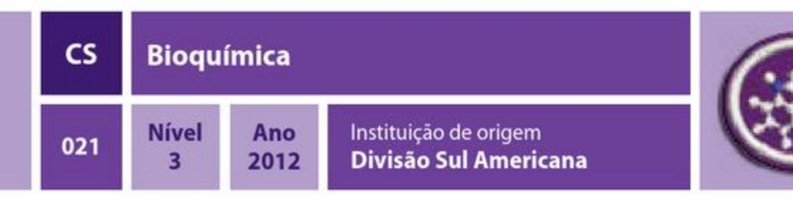

- 1. Definir os seguintes termos:
  - a) Carboidrato b) Lipídio
  - c) Ácido Graxo
  - d) Proteína

  - e) Peptídeo
  - f) Enzima

2. Qual a importância da água nos organismos? Quais as principais características físicas e químicas da molécula da água?

- 3. O que significa metabolismo?
- 4. Bioquimicamente, por que sentimos fome?
- 5. Explicar como ocorre a via da glicólise. Qual a sua importância para o metabolismo?

q) Aminoácido

j) Triglicerídeo

h) Ácido Nucleico

k) Monossacarídeo

i) Hidrofílico e hidrofóbico

- 6. Qual(s) células humanas são dependentes apenas dessa via para obter energia?
- 7. Qual molécula une a via da glicólise e o ciclo de Krebs?
- 8. Qual a importância do ciclo de Krebs?
- 9. Quais as funções dos lipídeos?
- 10. Por que os lipídios são insolúveis em áqua?
- 11. Por que os lipídeos, e não a glicose, são utilizados para o armazenamento de energia?
- 12. O que é a beta oxidação? Por que essa via recebe esse nome?
- 13. O que são aminoácidos essenciais e não essenciais?
- 14. O que são os corpos cetônicos, onde são produzidos e quais as consequências do excesso de sua produção?
- 15. Que compostos são formados pela união dos aminoácidos? Quais as principais funções desses compostos?
- 16. Qual a importância dos ácidos nucleicos? Como é sua estrutura e quais são seus componentes?
- 17. Desenhar uma molécula de DNA, com 4 nucleotídeos, nomeando seus componentes.

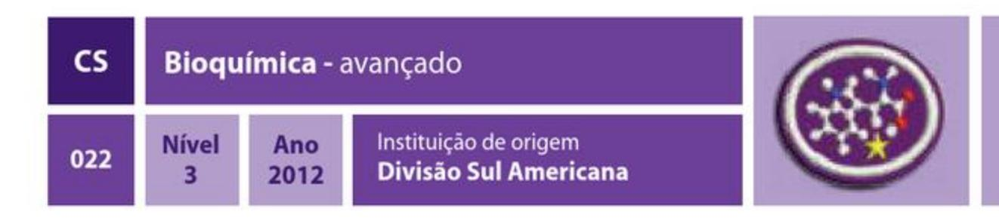

### REQUISITOS

- 1. Ter a especialidade de Bioquímica.
- 2. Definir os seguintes termos:
  - a) Síntese
  - **b**) Anabolismo
  - c) Catabolismo
  - d) Redução
  - e) Oxidação
  - f) Fotossintese
  - q) Hormônio
- 3. Além do fornecimento de energia, que outras funções os carboidratos têm?
- 4. Como é feita a classificação dos carboidratos?
- 5. Quais as consequências da falta de glicose no organismo?
- 6. Para manter as taxas de glicose constantes, no período de jejum, o organismo é capaz de produzir esse carboidrato. Como ocorre a via da gliconeogênese ou neoglicogênese?

7. Qual a importância dos hormônios insulina e glucagon no organismo humano? Onde são produzidos?

- 8. Como é o metabolismo de um indivíduo em jejum?
- 9. Como é o metabolismo de um indivíduo bem alimentado?

10. Que doença decorre da falta de produção de insulina pelos seres humanos? Quais as principais características dessa doença?

11. O excesso de carboidratos e aminoácidos é estocado no organismo através da sua conversão em lipídeo. Como são sintetizados lipídeos no organismo? Onde os lipídeos são armazenados?

12. Quais são os tipos de lipídios existentes nos seres humanos?

13. Os aminoácidos são produzidos pelos seres vivos. Os chamados produtores são capazes de sintetizar os 20 aminoácidos essenciais, os mamíferos podem sintetizar apenas alguns. Quais são os precursores usados para a síntese desses aminoácidos? Como os mamíferos obtêm os aminoácidos que não são capazes de sintetizar? 14. Fazer uma tabela com as famílias biossintéticas dos aminoácidos de acordo com os precursores metabólicos.

15. O grupo amino é muito importante para a síntese de aminoácidos. Como esse grupamento amino é obtido? Explicar o ciclo do nitrogênio.

16. A fixação de nitrogênio é muito importante, ele é realizada por bactérias. Algumas bactérias vivem em simbiose com as leguminosas. Explicar como ocorre a simbiose entre bactérias e leguminosas. Associar as leguminosas e a fixação de nitrogênio com a rotação de cultura.

- 17. Como ocorre a fotossíntese e qual sua importância para a vida na terra?
- 18. Que fatores afetam a fotossíntese?
- 19. Quais os organismos capazes de realizar fotossíntese?

20. O carbono é um átomo muito importante para todas as formas de vida. Explicar o ciclo do carbono.

21. Qual a relação entre DNA, RNA e proteínas?

22. Quais as aplicações do estudo do DNA?

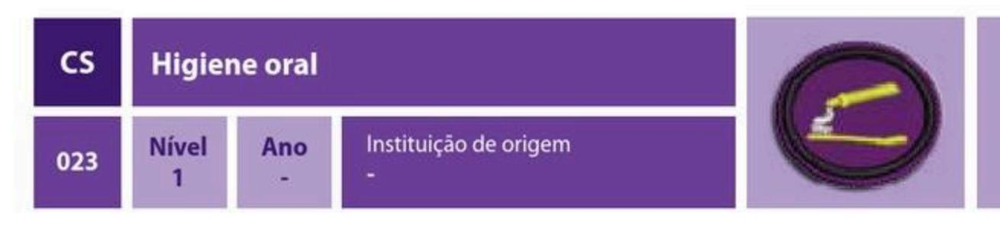

### REQUISITOS

- 1. Definir higiene oral.
- 2. Por quantas dentições um ser humano passa?
- 3. Para que servem os dentes de leite?
- 4. Quais são os tipos de dentes? Descrever as funções de cada tipo.
- 5. A partir de que idade deve-se iniciar a higiene oral? Como? Por quê?
- 6. Quais são os alimentos recomendáveis para uma dentição sadia?
- 7. Que prejuízos a má escovação pode trazer?
- 8. Quais os meios de utilização do flúor? Em que formas ele é encontrado?
- 9. O que é evidenciador?
- 10. O que deve ser usado para fazer uma higiene oral completa?
- 11. Demonstrar ao seu instrutor a forma correta de:
  - a) Aplicar evidenciador nos dentes
  - b) Fazer a escovação
  - c) Usar fio dental
- 12. Por que devemos usar dentifrício fluoretado?
- 13. Como se contrai a cárie?

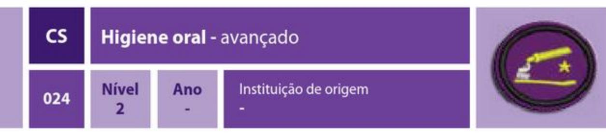

1. Ter a especialidade de Higiene oral.

2. Saber identificar as seguintes partes do dente, descrevendo a função de cada uma: esmalte, dentina, polpa, gengiva, cemento e ligamento periodontal.

- 3. Descrever os seguintes problemas bucais:
  - a) Placa
  - b) Tártaro
  - c) Gengivite
  - d) Periodontite
- 4. O que é pasta profilática?

5. Descrever como realizar a fluoretação, explicando cada um dos passos a serem seguidos.

- 6. O que fazer quando há um trauma em um dente por ocasião de uma queda?
- 7. O que causa sensibilidade nos dentes? Como este problema pode ser resolvido?
- 8. Quais os cuidados adicionais na higiene bucal uma pessoa que usa aparelho ortodôntico deve ter?

9. Quais os cuidados adicionais na higiene bucal uma pessoa que usa prótese dentária deve ter?

10. Criar uma estória que ilustre as formas de prevenir a cárie dentária e apresentá-la, de forma criativa, a um grupo de crianças.

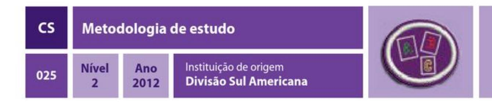

### REQUISITOS

- 1. Descrever, por escrito ou oralmente, como os seguintes itens contribuem para o estudo: a) Escolha do lugar e ambiente ideal
  - b) Uso de dicionários e enciclopédias
  - c) Domínio do tempo de estudo
  - d) Pesquisa bibliográfica como complemento do estudo
  - e) Técnicas de assimilação e memorização

2. Fazer uma ficha com seu cronograma de estudos e seguí-la durante um mês. (O cronograma deve conter as datas do mês e estar dividido por semanas. Preencha a ficha com o tempo a ser gasto nas seguintes atividades):

a) Sono

- b) Escola
- c) Transporte
- d) Alimentação

3. Descrever, por escrito ou oralmente, maneiras que ajudam o estudante a se concentrar durante os estudos:

| d ) Estudo                       |
|-----------------------------------------|
| e) Lazer, atividades sociais e esportes |
| f) Outros                               |
|                                         |

4. Demonstrar qual a melhor postura para se estudar e listar quais posições o estudante deve evitar ao estudar.

5. Apresentar 5 dicas para o estudante que quer tirar a nota máxima em avaliações e trabalhos.

6. Apresentar 5 dicas que o estudante pode fazer para diminuir o tempo de leitura e assimilar melhor o conteúdo estudado.

7. Que atividades ajudam o estudante a melhorar sua capacidade de aprendizado?

8. Escreva uma redação de 25 a 30 linhas com um dos seguintes temas:

a) Onde vou estar e o que farei daqui 7 anos?

b) Como farei para seguir a profissão que escolhi?

c) O que ainda quero aprender e como posso alcançar esse objetivo?

9. Saber a diferença entre resumo e resenha, apresentando ambas em forma de esboço.

10. Ler algum livro de sua escolha que trate sobre técnicas e metodologias de estudo e apresentar um esboço de, no mínimo, 50 linhas.

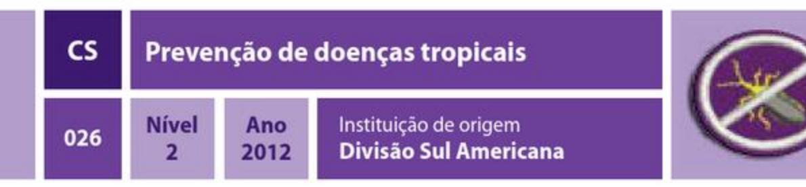

- 1. Responder as seguintes questões:
  - a) O que são doenças tropicais?
  - b) Listar, pelo menos, 5 doenças tropicais comuns em sua região.
- 2. Pesquisar e explicar as seguintes doenças, informando: transmissão, sinais e
- sintomas, tratamento, como preveni-las e combatê-las:
  - a) Malária
  - b) Febre amarela
  - c) Leishmaniose
  - d) Dengue
  - e) Doença de Chagas
- 3. Explicar como eliminar os seguintes depósitos, evitando proliferação dos mosquitos:
  - a) Pneus
  - b) Garrafas
  - c) Vasilhas de animais
  - d) Caixa d'água
  - e) Bromélias ou plantas que acumulam água
  - f) Pratinho de vasos de planta
  - g) Tonel ou dorna
  - h) Calhas
  - i) Tampinhas, latas e pequenas vasilhas descartáveis
  - j) Bandeja externa de geladeira
- 4. Completar as seguintes tarefas:
  - a) Participar, junto com o Clube, unidade ou escola, de uma campanha contra a dengue em seu bairro.
  - b) Fazer uma coleta de recipientes que possam acumular água parada em praças e
  - ruas da sua comunidade e eliminá-los corretamente.
  - c) Adquirir folhetos com informações sobre as principais doenças tropicais e
  - distribuir em seu bairro ou escola.
  - d) Eliminar corretamente o lixo de sua casa por uma semana.
  - e) Ajudar um idoso de seu bairro a manter sua residência livre de depósitos que
  - acumulem água, realizando as seguintes tarefas:

- · Orientar como manter a residência livre de possíveis focos de mosquitos. · Informar sobre cuidados e sintomas das doenças pesquisadas
- · Fazer limpeza da residência, coletar e eliminar depósitos inservíveis.

5. Com a ajuda de seu conselheiro, fazer uma apresentação, debate ou encenação para seu Clube ou unidade sobre as doenças tropicais estudadas nesta especialidade.

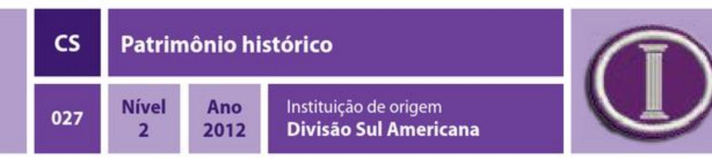

- 1. Defina o conceito de patrimônio histórico.
- 2. Cite a diferença entre história e memória.
- 3. Qual a importância do patrimônio histórico para:
  - a) A identidade dos povos
  - b) A preservação da memória
  - c) Para a constituição humana
- 3. Explique como se forma um patrimônio histórico e quais são os benefícios de sua criação.
- 4. Como a história pode influenciar as decisões de uma sociedade?
- 5. Defina as categorias abaixo:
  - a) Patrimônio histórico material
  - b) Patrimônio histórico imaterial
- 6. Qual o papel humano como agente ativo na construção da história?
- 7. Investigue 3 elementos de uma cultura imaterial em sua cidade ou região.
- 8. Entreviste uma pessoa com mais idade sobre suas memórias em relação à sua cidade.
- 9. Faça um levantamento dos monumentos que existem na região que você mora. Descubra a razão de eles estarem lá e qual a história que os monumentos pretendem preservar.
- 10. Monte uma coleção de 10 elementos que tenham valor necessário para se tornarem eternos para você.

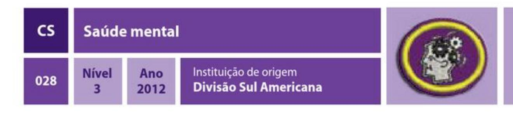

### REQUISITOS

# 1. Ter a especialidade de Sistema nervoso.

2. Definir os seguintes termos:

| a) Transtorno        | i) Psicose        |  |
|----------------------|-------------------|--|
| b) Etiologia         | j) Prevenção      |  |
| c) Diagnóstico       | k) Promoção       |  |
| d) Cognitivo         | I) Intervenção    |  |
| e) Terapia           | m) Psicopatologia |  |
| f) Antecedente       | n) Psicologia     |  |
| g) Fator de proteção | o) Psiquiatria    |  |
| h) Fator de risco    | p) Impulso        |  |
|                      |                   |  |

3. Definir o que é saúde e o que é doença (transtorno ou distúrbio). Leia Gênesis 3 e o capítulo 3 de Patriarcas e Profetas. Que relação existe entre estes textos sobre a origem das doenças?

4. O que é saúde mental e qual a sua importância? O que você deve fazer para desfrutar de uma saúde mental adequada?

5. Descobrir em que dia se celebra o Dia Mundial da Saúde Mental. Faça um relatório identificando que atividades se realizam neste dia e quais as organizações e profissionais de saúde estão envolvidos nessa atividade.

6. O que são transtornos (ou distúrbios) mentais? Quais fatores os causam ou os desencadeiam?

7. Pesquisar e mencionar, pelo menos, 2 transtornos (distúrbios) para cada uma das sequintes categorias:

- a) Transtornos da infância e adolescência
- b) Delirium, demência, transtornos amnésticos e outros transtornos cognitivos
- c) Transtornos relacionados a substâncias
- d) Esquizofrenia e outros transtornos psicóticos
- e) Transtornos do humor
- f) Transtornos da ansiedade
- g) Transtornos sexuais e da identidade sexual
- h) Transtornos alimentares
- i) Transtornos do sono
- j) Transtornos do controle de impulsos
- k) Transtornos da personalidade

8. Baseado no requisito 7, escolha um dos transtornos para pesquisá-lo com profundidade. Preparar uma apresentação com recursos audiovisuais para apresentar em sua Igreja, escola ou comunidade.

9. O que é ansiedade, o que a causa, quais são os seus sintomas e qual o tratamento? O que você pode fazer para ajudar alguém que sofre desse transtorno?

10. O que é depressão, o que a causa, quais são os seus sintomas e qual o tratamento? O que você pode fazer para ajudar alguém que sofre dessa doença?

11. Que versos bíblicos ou citações do Espírito de Profecia você pode utilizar para ajudar uma pessoa com ansiedade ou depressão?

12. Com a companhia de um adulto responsável, visitar e ajudar uma pessoa com alguma deficiência mental. Descrever que cuidados especiais são necessários para o transtorno específico dela.

13. O que são psicofármacos? O que são efeitos colaterais ou adversos? Mencione alguns efeitos adversos que podem ser causados pelo uso desses medicamentos no tratamento dos transtornos mentais.

14. Que relação existe entre o 4º mandamento da Lei do Desbravador e a saúde mental? Faça um voto prometendo cuidar e manter sua mente livre das influências perturbadoras dos dias atuais.

#### Sexualidade humana **CS** Instituição de origem **Nível** Ano 029 Divisão Sul Americana 2012 1

### REQUISITOS

Nota: Necessário o acompanhamento de um instrutor qualificado. Essa especialidade deve ser instruída em grupos separados por sexo e faixa etária aproximada. Somente pessoas do sexo masculino podem instruí-la para os garotos e somente as do sexo feminino podem instruí-la para as garotas.

1. O que é sexualidade humana?

2. Qual é o modelo divino para a sexualidade? O que a Bíblia e o Espírito de Profecia dizem a respeito?

3. O que é sexo biológico? Quantos tipos existem?

4. Através de desenhos ou figuras escolhidas previamente e trazidas pelo seu instrutor, representar os órgãos sexuais masculinos e femininos e responder:

a) Quais são os órgãos sexuais/reprodutivos internos?

b) Quais são os órgãos sexuais/reprodutivos externos?

c) Qual é a função de cada um desses órgãos?

d) Por que é tão importante chamar esses órgãos pelos nomes corretos?

5. O que é puberdade? Quando ela se inicia nos homens e nas mulheres? Quais as mudanças físicas e psicológicas que ocorrem?

6. O que é menstruação e polução noturna? Em que idade se iniciam e quando terminam?

7. Por que a higiene genital, tanto masculina quanto feminina, é importante? 8. O que é gravidez, como ela ocorre e quanto tempo dura? Fazer um quadro demonstrando as principais características da gravidez a cada mês de gestação. 9. O que é a aborto? Quais são as consequências físicas e psicológicas envolvidas? Em quais casos o aborto é aconselhável e permitido em seu país?

10. Quais os papéis dos homens e das mulheres na sociedade e quais responsabilidades lhes são atribuídas de acordo com a nossa cultura? Como esses papéis foram modificados pelos tempos até agora? Por que os estereótipos desses papéis são perigosos?

11. Como reconhecer e se proteger de possíveis abusos sexuais e seus perigos? A quem devemos recorrer em caso de alguém (desconhecido, amigo ou familiar) ter sido abusado ou molestado? Por que é importante não ficar calado?

12. O que são Doenças Sexualmente Transmissíveis? Responda o seguinte:

a) O que é HIV?

**b)** O que é AIDS?

c) Como se contrai o HIV?

d) Quanto tempo leva do contágio até o início dos sintomas?

e) Que testes ou exames médicos podem ser feitos para saber se uma pessoa está infectada?

f) Quais cuidados uma pessoa soro positiva necessita? Quais e quantos medicamentos toma por dia?

g) Pesquisar outras 5 Doenças Sexualmente transmissíveis e responder sobre cada uma delas: forma(s) de contágio(s), sintomas, agente etiológico e se há tratamento.

13. Quando temos uma dúvida sobre sexualidade, a quem devemos procurar ajuda? Por que amigos da minha idade são "pouco confiáveis" para o assunto?

14. O que é masturbação e qual é a posição da Igreja Adventista do Sétimo Dia sobre esse ato? Que outro nome Ellen White usa para se referir à masturbação?

15. O que é paixão e o que é namoro? Quando são saudáveis? Quando estão distorcidos e são prejudiciais? Como saber o momento correto para se terminar um namoro? Como terminar uma relação adequadamente?

#### Sistema respiratório **CS** Instituição de origem **Nível** Ano 030 2012 **Divisão Sul Americana** $\overline{2}$

### REQUISITOS

1. Quais são as estruturas que formam o sistema respiratório? Ilustrar e descrever as principais funções de cada uma.

2. Os pulmões direito e esquerdo são iguais? Qual a diferença anatômica entre eles? 3. Quais são os 2 principais gases do nosso organismo? O que é troca gasosa?

Descrever as vias condutoras do ar até o momento da troca gasosa.

4. O que é alvéolo e qual a sua função? Através de desenhos ou figuras, ilustrar um alvéolo demonstrando o momento da troca gasosa.

5. Qual a principal função das células ciliadas, com cílios móveis?

6. Qual a relação entre respiração celular e a respiração pulmonar?

7. Explicar como os sistemas circulatório e respiratório estão intimamente ligados.

8. Qual a importância da hemoglobina e do ferro para a oxigenação do organismo?

9. Descrever em detalhes os movimentos de inspiração e expiração. Qual a importância do músculo diafragma para estes movimentos?

10. Qual órgão do sistema nervoso central controla a respiração? Por quê?

11. Qual é a frequência respiratória normal dos sequintes:

a) Recém-nascidos

b) Crianças

c) Adultos

12. Definir os seguintes termos sobre alterações respiratórias:

a) Eupneia

**b**) Taquipneia

c) Bradipneia

d) Dispneia

e) Ortopneia

f) Apneia

13. Estudar as seguintes doenças respiratórias e dizer, sobre cada uma, como ocorre / é

adquirida, transmissão (se for o caso), tratamento e prevenção:

a) Asma

**b**) Tuberculose

c) Pneumonia

d) Gripe / infecções de vias aéreas superiores

e) Enfisema pulmonar

f) Tromboembolismo pulmonar

g) Pneumoconioses

h) Fibrose cística

14. Pesquisar os efeitos do cigarro no sistema respiratório. Apresentar seus resultados de uma das seguintes maneiras:

a) Relatório escrito, no mínimo 500 palavras

b) Apresentação oral, no mínimo 5 minutos

c) Exposição de cartazes e faixas

d) Poema ou música

15. Fazer uma pesquisa em sua região ou Estado comparando os índices de qualidade do ar. Como esses índices podem ser melhorados? O que você pode fazer para melhorá-los?

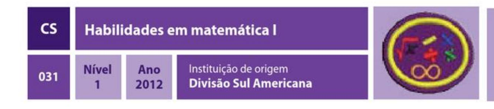

### REQUISITOS

1. Conhecer o sistema decimal.

2. Saber identificar e classificar os algarismos do sistema decimal e representar a posição de cada um.

3. Classificar e identificar as quatro operações básicas representando o algoritmo de cada um exemplificado quatro exemplos.

4. Elaborar quatro exemplos práticos em que usamos as quatro operações básicas e resolver.

5. Pesquisar e apresentar em forma de desenho ou escrita a possível origem dos sinais de raiz quadrada, divisão, adição e subtração.

6. Demonstrar na prática a resolução de pelo menos três exemplos de potenciação e três exemplos de expressão numérica, usando os sinais de parêntese, colchete e chave. 7. Apresentar e resolver três exemplos práticos de situações em que envolve as frações nas operações de adição, subtração, multiplicação e divisão. Lembrando que para as operações de adição e subtração usamos o cálculo de mmc.

8. Apresentar e demonstrar a resolução de três problemas que envolvem cálculos de porcentagem de compra e venda de produtos, obtendo descontos.

9. Apresentar e demonstrar a resolução de quatro exemplos de operação com números decimais na adição, subtração, multiplicação e divisão, usando o método prática de resolução.

10. Apresentar em forma de cartaz, ou multimídia, cinco exemplos de figuras planas e cinco exemplos de figuras sólidas mostrando suas características e, ao lado, que tipo de objeto do dia a dia eles são usados.

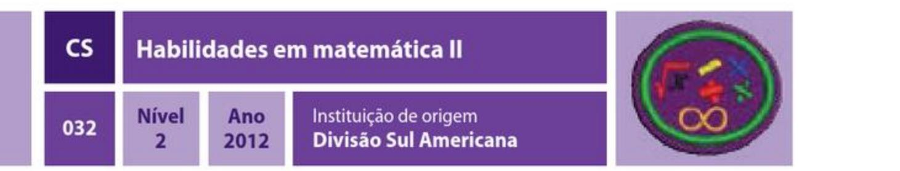

1. Conhecer as quatro operações básicas.

2. Explicar e apresentar a historia da raiz quadrada e resolver dois exemplos práticos de extração de raiz.

3. Apresentar e resolver dois exemplos simples de potenciação com números inteiros de expoentes positivos e negativos.

4. Apresentar em forma de desenho ou colagens, três exemplos práticos em que usamos os números inteiros negativos e positivos no nosso dia a dia.

5. Demonstrar a habilidade de resolver uma expressão numérica envolvendo os números inteiros negativos e positivos. Mostrar dois exemplos.

6. Pesquisar e apresentar de forma escrita, as principais frações do nosso dia a dia e em que situações usamos cada uma delas.

7. Demonstrar a habilidade de resolver quatro operações básicas, envolvendo as frações, incluindo o cálculo de mmc no caso da adição e subtração e por fim a simplificação quando possível.

8. Apresentar em forma de cartaz as principais figuras planas com suas características e demonstrar como calcular a área e o perímetro das mesmas.

9. Demonstrar a habilidade de converter as principais unidades de medidas; metros, metros (m2), kg, gramas e metros (m3). Apresentar três exemplos de conversão.

10. Apresentar três exemplos de equações envolvendo a letra x e resolver cada um dando a solução correta.

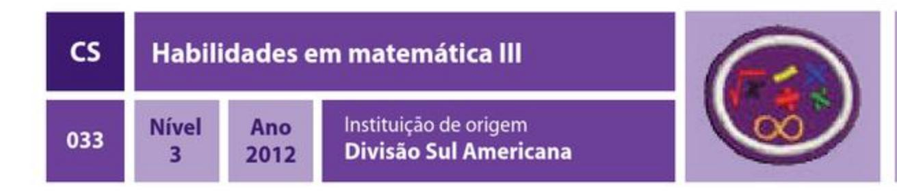

### REQUISITOS

- 1. Ter a especialidade Habilidades em matemática II.
- 2. Resolver as seguintes operações usando o algoritmo tradicional:
  - a)  $641 + 135$
  - $b) 845 124$
  - $c)$  34  $\times$  125
  - $d$ ) 856:24
- 3. Identificar e classificar os conjuntos numéricos.
- 4. Demonstrar habilidade de resolver as seguintes equações:
  - a)  $2x 10 = -4x + 14$
  - **b**)  $18x 43 = 65$ c)  $23x - 16 = 14 - 17x$

  - **d)**  $10y 5(1 + y) = 3(2y 2) 20$ e)  $x(x + 4) + x(x + 2) = 2x^2 + 12$
  - **f**)  $(x 5)/10 + (1 2x)/5 = (3-x)/4$
  - **g**)  $4x(x+6) x^2 = 5x^2$
- 5. Demonstrar habilidade de resolver os seguintes produtos notáveis:
  - a)  $(x + 3y)$ **b**)  $(a5 + 2bc)^2$ c)  $(3x + y^2)^2$ d)  $(1 + 5m) (1 - 5m)$ **e)**  $(ab - c)^2$ f)  $(m - 1)^3$ g)  $(a^3 - b^3) (a^3 + b^3)$

# 6. Calcular a área das seguintes figuras planas:

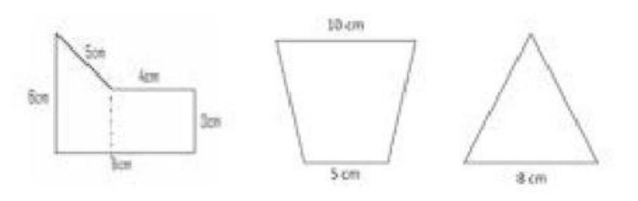

7. Na especialidade de orientação, o desbravador precisa ter conhecimentos de ângulo, para saber usar carta cartográfica e usar uma bússola: Demonstrar habilidade de converter ângulos para minutos, minutos para segundos, mostrando três exemplos práticos.

8. Na especialidade de pioneiria aprendemos a construir móveis de campanha, que por sua vez tem toda uma relação matemática. Desenhar e apresentar alguns móveis de campanha onde aparecem formas geométricas e classificar cada um. Citar três exemplos.

9. Apresentar um cartaz mostrando dez exemplos práticos de figuras geométricas usadas no dia a dia. Pode ser em forma de figuras recortadas, fotos ou desenho.

10. Demonstre habilidade para resolver a solução dos seguintes problemas de proporção:

a) A 60 km/h faço o percurso entre duas cidades em duas horas. Trafegando a 80 km qual o tempo estimado para percorrer este trajeto?

b) À média de 90 km/h faço um trajeto em três horas. Para que eu faça este percurso em apenas duas horas, qual deve ser a minha velocidade média?

c) Se 20 homens trabalhando durante 15 dias constroem 500 metros de um muro, quantos homens serão necessários para construir mais 1000 metros deste muro em 30 dias?

- 11. Demonstre habilidade para resolver situações problemas envolvendo equações: a) Tenho a seguinte escolha: Ou compro 20 unidades de um produto com todo o dinheiro que tenho, ou compro apenas 14 unidades e ainda me sobra um troco de R\$ 30,00. Qual o valor unitário deste produto?
  - **b**) Qual é a raiz da equação  $7x 2 = -4x + 5$ ?

c) Se eu adicionar 8 à quantidade de carrinhos que possuo, ficarei com a mesma quantidade de carrinhos de meu irmão, se dos 28 que ele possui, for retirada a quantidade que eu possuo. Quantos carrinhos eu tenho?

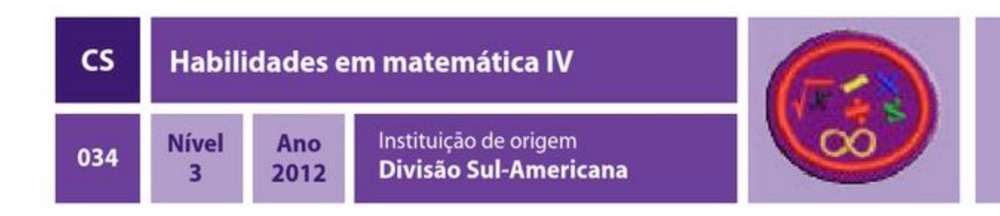

### REQUISITOS

1. Ter a especialidade Habilidades em matemática III.

2. Apresentar um relatório bibliográfico com pelo menos cinco personalidades que contribuíram para o desenvolvimento da matemática no decorrer da historia da humanidade.

3. Desenvolver e apresentar os cálculos das seguintes equações:

- a)  $5x2 3x 2 = 0$
- **b**)  $3x^2 + 55 = 0$
- c)  $x2 10x + 25 = 0$

4. Apresentar e desenvolver os cálculos de porcentagem dos seguintes problemas:

- a) 3% de 450
- **b)** 25% de 1440
- c) 30% de 2500

5. Apresentar três situações práticas de forma escrita de situações onde usamos a porcentagem no nosso dia a dia.

6. Apresentar e desenvolver três situações pratica de problemas do dia a dia em que usamos a equação do segundo grau.

7. Resolver e apresentar o desenvolvimento das sequintes funções:

Sendo  $f(x) = x - 3e$  g(x) = -3x + 4, determinar:

a)  $f(f(0))$ 

**b)**  $f(f(1)) + g(f(3))$ 

- 8. Representar no gráfico cartesiano as seguintes funções:
  - a)  $y = 3x 1$

**b**)  $f(x) = 2x + 3$ 

9. Demonstrar a habilidade em resolver problemas envolvendo círculos, como calcular a circunferência e a área usando a fórmula de cada um. Apresentar dois exemplos de cada.

10. Apresentar a habilidade de calcular a área de polígonos regulares, como hexagonal inscrito em um círculo, área da superfície do cilindro, volume do prisma e o volume da pirâmide.

11. Em nosso dia a dia, lidamos o tempo todo com taxa de juros. Demonstre a habilidade para resolver as duas situações mais comuns de juros.

a) Luciana fez uma aplicação de R\$ 200,00 a juros simples de 2% ao mês. Quanto ele terá, no total, após 8 meses de aplicação?

b) Davi fez um empréstimo bancário de R\$ 3.000,00 e pagará em 6 meses com taxa de juro composto de 1,5% ao mês. Calcule o total que ele deverá pagar ao banco após esses 6 meses.