# Estudo da Natureza

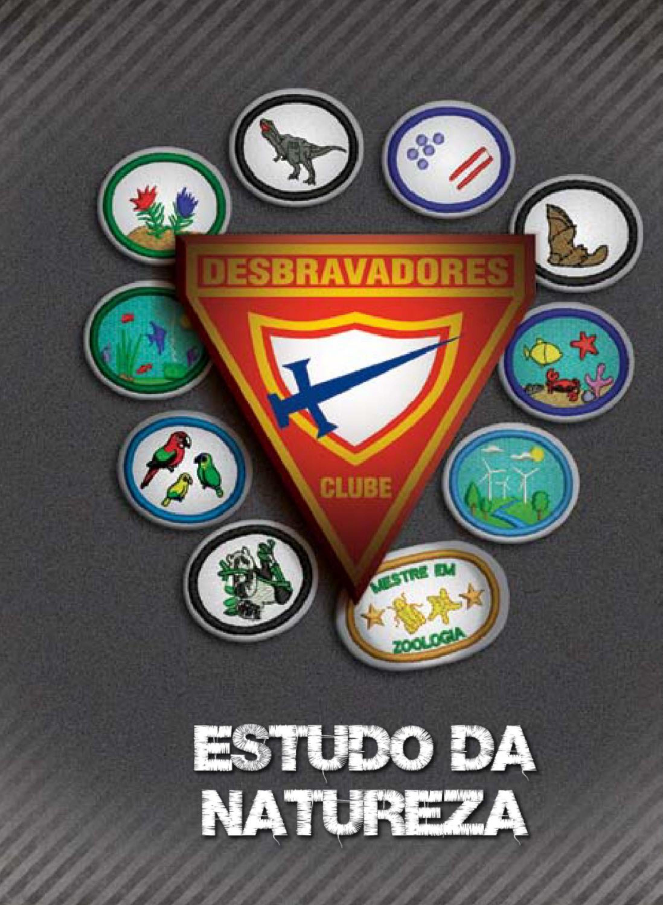

| Especialidade                            |  Ano  | Código | Número |
| ---------------------------------------- | :---: | :----: | :----: |
| Aranhas                                  | 1928  |   EN   |  001   |
| Astronomia                               | 1928  |   EN   |  002   |
| Aves                                     | 1928  |   EN   |  003   |
| Aves domésticas                          | 1928  |   EN   |  004   |
| Flores                                   | 1928  |   EN   |  005   |
| Arvores                                  | 1928  |   EN   |  006   |
| Insetos                                  | 1933  |   EN   |  007   |
| Mariposas e borboletas                   | 1933  |   EN   |  008   |
| Fungos                                   | 1937  |   EN   |  009   |
| Mamíferos                                | 1937  |   EN   |  010   |
| Répteis                                  | 1937  |   EN   |  011   |
| Rochas e minerais                        | 1937  |   EN   |  012   |
| Rochas e minerais - avançado             | 1937  |   EN   |  013   |
| Moluscos                                 | 1938  |   EN   |  014   |
| Cactos                                   | 1944  |   EN   |  015   |
| Climatologia                             | 1944  |   EN   |  016   |
| Fósseis                                  | 1944  |   EN   |  017   |
| Samambaias                               | 1944  |   EN   |  018   |
| Arbustos                                 | 1945  |   EN   |  019   |
| Aves de estimação                        | 1945  |   EN   |  020   |
| Gramíneas                                | 1945  |   EN   |  021   |
| Peixes                                   | 1945  |   EN   |  022   |
| Anfibios                                 | 1945  |   EN   |  023   |
| Felinos                                  | 1945  |   EN   |  024   |
| Rebanhos domésticos                      | 1945  |   EN   |  025   |
| Astronomia - avançado                    | 1949  |   EN   |  026   |
| Aves - avançado                          | 1949  |   EN   |  027   |
| Climatologia - avançado                  | 1949  |   EN   |  028   |
| Flores - avançado                        | 1949  |   EN   |  029   |
| Insetos - avançado                       | 1949  |   EN   |  030   |
| Mamíferos - avançado                     | 1949  |   EN   |  031   |
| Moluscos - avançado                      | 1949  |   EN   |  032   |
| Arvores - avançado                       | 1949  |   EN   |  033   |
| Cães                                     | 1950  |   EN   |  034   |
| Areia                                    | 1956  |   EN   |  035   |
| Algas                                    | 1960  |   EN   |  036   |
| Cetáceos                                 |  --   |   EN   |  037   |
| Ervas                                    |  --   |   EN   |  038   |
| Eucaliptos                               |  --   |   EN   |  039   |
| Sementes                                 | 1961  |   EN   |  040   |
| Sementes - avançado                      | 1961  |   EN   |  041   |
| Orquídeas                                | 1964  |   EN   |  042   |
| Plantas silvestres comestíveis           | 1970  |   EN   |  043   |
| Ecologia                                 | 1972  |   EN   |  044   |
| Ecologia - avançado                      | 1972  |   EN   |  045   |
| Conservação ambiental                    | 1973  |   EN   |  046   |
| Geologia                                 | 1975  |   EN   |  047   |
| Geologia - avançado                      | 1975  |   EN   |  048   |
| Plantas caseiras                         | 1976  |   EN   |  049   |
| Rastreio de animais                      | 1976  |   EN   |  050   |
| Mamíferos marinhos                       | 1991  |   EN   |  051   |
| Pequenos mamíferos de estimação          | 1997  |   EN   |  052   |
| Cactos - avançado                        | 1999  |   EN   |  053   |
| Anfíbios - avançado                      | 2001  |   EN   |  054   |
| Felinos - avançado                       | 2001  |   EN   |  055   |
| Rastreio de animais - avançado           | 2001  |   EN   |  056   |
| Répteis - avançado                       | 2001  |   EN   |  057   |
| Animais ameaçados de extinção            | 2004  |   EN   |  058   |
| Morcegos                                 | 2004  |   EN   |  059   |
| Morcegos - avançado                      | 2004  |   EN   |  060   |
| Marsupiais                               |  --   |   EN   |  061   |
| Orquídeas - avançado                     | 2006  |   EN   |  062   |
| Palmeiras                                |  --   |   EN   |  063   |
| Solos                                    | 2006  |   EN   |  064   |
| Vermes                                   | 2006  |   EN   |  065   |
| Vermes - avançado                        | 2006  |   EN   |  066   |
| Quedas d'água                            | 2011  |   EN   |  067   |
| Aquarismo                                | 2012  |   EN   |  068   |
| Animais peçonhentos                      | 2012  |   EN   |  069   |
| Animais noturnos                         | 2012  |   EN   |  070   |
| Animais nocivos                          | 2012  |   EN   |  071   |
| Arbustos - avançado                      | 2012  |   EN   |  072   |
| Araras, papagaios e periquitos           | 2012  |   EN   |  073   |
| Briófitas                                | 2012  |   EN   |  074   |
| Bactérias                                | 2012  |   EN   |  075   |
| Camelos                                  | 2012  |   EN   |  076   |
| Citologia                                | 2012  |   EN   |  077   |
| Crustáceos                               | 2012  |   EN   |  078   |
| Dinossauros                              | 2012  |   EN   |  079   |
| Equinodermos                             | 1956  |   ΕN   |  080   |
| Energias renováveis                      | 2012  |   EN   |  081   |
| Estuário                                 | 2012  |   EN   |  082   |
| Fauna marinha                            | 2012  |   EN   |  083   |
| Fisiologia vegetal                       | 2012  |   EN   |  084   |
| Formigas                                 | 2012  |   EN   |  085   |
| Liquens                                  | 2012  |   EN   |  086   |
| Odonata                                  | 2012  |   EN   |  087   |
| Plantas carnívoras                       | 2012  |   EN   |  088   |
| Preservação de recursos hídricos         | 2012  |   EN   |  089   |
| Poríferos e cnidários                    | 2012  |   EN   |  090   |
| Protozoários                             | 2012  |   EN   |  091   |
| Reciclagem e sustentabilidade            | 2012  |   ΕN   |  092   |
| Reciclagem e sustentabilidade - avançado | 2012  |   EN   |  093   |
| Tubarões                                 | 2012  |   EN   |  094   |
| Vírus                                    | 2012  |   EN   |  095   |

## Aranhas

| EN  | Aranhas | Ano  | Instituição de origem |
| --- | ------- | ---- | --------------------- |
| 001 | Nível 2 | 1928 | Associação Geral      |

### REQUISITOS

1. Quais são as principais características das aranhas? Quais são as principais diferenças entre as aranhas e os insetos?
2. Qual a utilidade da teia para as aranhas? Qual a utilidade da teia de aranha para o ser humano?
3. Fazer um desenho de uma teja esférica.
4. Descrever outros tipos de teia existentes além da esférica ou orbicular.
5. Do que se alimentam as aranhas? Observar teias de aranhas e listar as presas encontradas.
6. Quais são os principais predadores das aranhas? Além de seus predadores, qual o principal inimigo das aranhas e por quê?
7. Qual é a maior aranha do mundo?
8. Fazer um dos seguintes:
    1. Coletar, identificar e preservar, pelo menos, 16 espécies de aranhas. Cada vidro deve conter uma etiqueta com o local e data de captura, nome do coletor e nome da aranha. (Ao cumprir este requisito, esteja certo de não estar infringindo nenhuma lei de seu país).
    2. Desenhar e identificar, pelo menos, 16 espécies de aranhas, com suas cores naturais e em tamanho real ou ampliado.
    3. Tirar fotografias coloridas e identificar, pelo menos, 16 espécies de aranhas. Colocar local e data onde a fotografia foi tirada.
9. Escrever uma descrição de, pelo menos, 40 palavras sobre uma espécie de aranha conhecida em sua região ou País.
10. Quantas espécies de aranhas venenosas existem no mundo? E em sua região? O que fazer em caso de picada de aranha?
11. Como as aranhas podem ser benéficas ao homem? Como as aranhas podem ser prejudiciais ao homem?
12. Encontrar 2 referências bíblicas às aranhas e suas teias.

## Astronomia

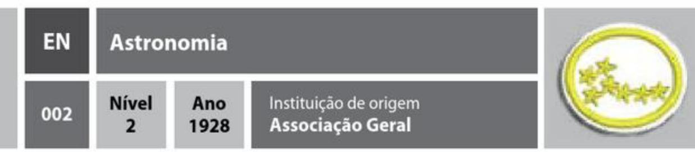

### REQUISITOS

1. Responda as seguintes perguntas:
    1. O que causa um eclipse?
    2. O que é uma estrela cadente?
    3. Qual a velocidade da luz?
2. Sobre o corpo celeste mais próximo da Terra responda:
    1. Dê o seu nome.
    2. Qual sua distância da Terra?
    3. Qual sua influência nas marés?
3. Faça um diagrama mostrando as posições relativas e os movimentos da Terra, Sol e Lua. Mostre as posições e os movimentos nos eclipses lunares e solares.
4. Faça um diagrama do sistema solar, nomeando os planetas na ordem correta a partir do Sol.
5. Identifique no céu 5 estrelas fixas. Qual a diferença entre um planeta e uma estrela fixa?
6. Sobre constelações:
    1. Explique o que é uma constelação.
    2. Nomeie e aponte 6 diferentes constelações.
    3. Nomeie 2 constelações que são visíveis durante o ano todo
7. Desenhar um esquema das constelações Cruzeiro do Sul, Órion e Escorpião.
8. O que é Via Láctea? Observar a Via Láctea no céu noturno.
9. O que é a estrela da manhã ou estrela vespertina? Por que ela recebe esses nomes?
10. Explique o que é zênite e nadir.

## Aves

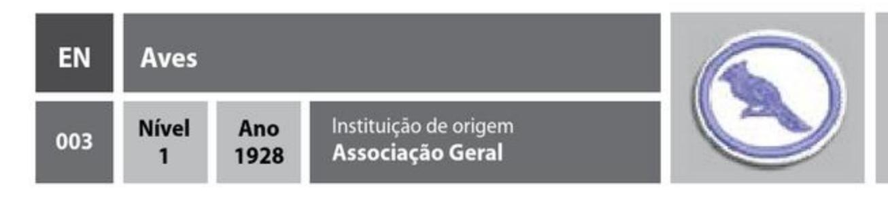

### REQUISITOS

1. Apresentar 4 características usadas para diferenciar as aves dos outros animais.
2. Dar o nome de 3 aves que não voam. Mencionar o que comem e dar o nome do país ou continente na qual cada uma delas vive.
3. Mencionar o dia da semana em que as aves foram criadas. Descobrir na Bíblia os nomes de 5 aves. Ser capaz de mencionar 3 histórias bíblicas onde, através das aves, Deus mostrou seu cuidado e amor por nós.
4. Fazer uma lista de 20 aves que foram observadas pessoalmente.
5. Fazer uma lista de 5 espécies de aves que você identificou pelo som, ao ar livre.
6. Fazer umas das tarefas a seguir e realizar um relatório com fotos:
    1. Montar um posto de alimentação e relatar que aves vieram até ali durante 20 dias.
    2. Descobrir um ninho de passarinho e identificar a espécie do pássaro que o construiu. Descrever o ninho com detalhes, observá-lo durante 5 dias e relatar o que aconteceu ao ninho cada dia.
    3. Montar um bebedouro para beija-flor durante 2 meses, observando os seguintes tópicos:
        1. De que consiste o néctar feito pelo homem?
        2. Por que não se deve usar corante ou mel?
        3. Quando o fluído do bebedouro deve ser trocado?
        4. Como deve-se cuidar do bebedouro?
7. Confeccionar uma coleção com nome popular e científico de 30 aves (imagens ou fotos), onde, pelo menos, 20 devem ser típicas de seu país.

## Aves domésticas

### REQUISITOS

1. Identificar, por meio de fotografias ou ao natural, pelo menos 5 raças de galinhas, como por exemplo:
    1. Plymouth (de qualquer cor)
    2. Wyandotte (de qualquer cor)
    3. Rhode Island Vermelha
    4. Orpington (de qualquer cor)
    5. Leghorn (de qualquer cor)
    6. Índio Gigante
    7. Turken
2. Para cada uma das galinhas escolhidas, descrever o seguinte:
    1. Origem
    2. Características físicas (peso, altura, cor das penas)
    3. Finalidade (poedeiras, ornamentais, etc.)
3. Identificar, através de fotografias ou ao natural, 2 raças de cada uma das aves a seguir:
    1. Pato
    2. Marreco
    3. Ganso
    4. Peru
    5. Codorna
4. Demonstrar como descobrir se um ovo está fecundado.
5. Qual o período médio de incubação dos ovos das seguintes aves:
    1. Codorna
    2. Galinha d'angola
    3. Galinha
    4. Pato
    5. Marreco
    6. Peru
6. O que é rinha? Quais as implicações legais de se envolver com esse tipo de atividade?
7. Completar um dos seguintes e apresentar um relatório de no mínimo 1 página:
    1. Cuidar de uma ave doméstica por, ao menos, 6 meses.
    2. Acompanhar o processo de incubação (natural ou artificial) de uma ninhada de ovos até a eclosão.
    3. Visitar uma fazenda de avicultura e observar as rotinas de cuidados (alimentação, vacinação, etc.) das aves.

## Flores

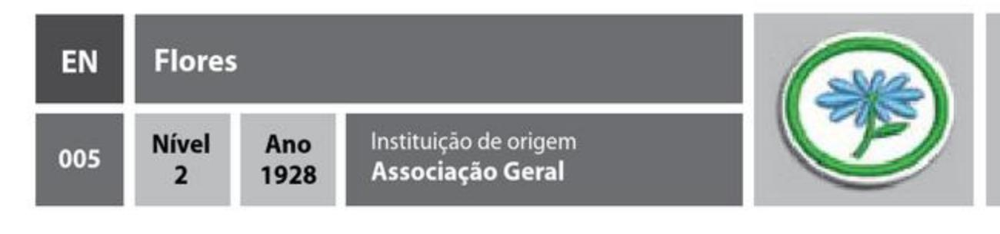

### REQUISITOS

1. Qual o grande grupo de plantas que possui flores?
2. Qual a função de uma flor em uma planta?
3. Fotografar, desenhar ou colecionar imagens de 25 tipos de flores e identificá-las com seu nome popular e, se possível, científico.
4. Saber as funções das seguintes partes de uma flor:
    1. Pétala
    2. Sépala
    3. Androceu
    4. Gineceu
5. Desenhar e classificar corretamente, tendo por base uma flor natural, as seguintes partes: pedúnculo, receptáculo, sépalas, pétalas, cálice, corola, androceu, gineceu, estame (filete e antera), carpelo (ovário, estigma, estilete).
6. Descrever o ciclo de vida de uma flor em particular, incluindo o papel dos insetos ou vento na polinização.
7. Explique o que é polinização.
8. Fazer 2 dos itens a seguir:
    1. Desenhar, colecionar imagens ou fotografar uma série de, pelo menos, 6 flores, mostrando, na ordem, as cores do arco-íris - vermelho, alaranjado, amarelo, verde, azul, violeta.
    2. Apresentar flores frescas, secas ou prensadas que tenham: cinco pétalas, quatro pétalas, três pétalas, nenhuma pétala.
    3. De olhos vendados, distinguir e dar o nome de 2 entre 5 flores silvestres ou cultivadas, usando apenas o sentido do olfato.
    4. Fazer uma lista de flores que você observou e foram visitadas por diferentes animais.
    5. Observar uma flor durante, pelo menos, 10 minutos, à luz do sol e, pelo menos, 10 minutos após o anoitecer e relatar os insetos que a visitaram. Mencionar o número de visitantes e o nome da flor.
9. Cite 1 exemplo de flores que são polinizadas por:
    1. Insetos
    2. Vento

## Arvores

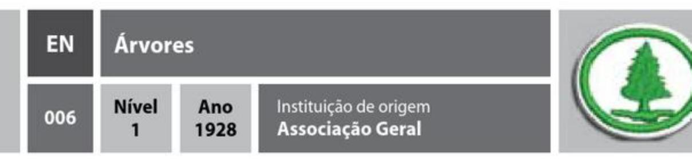

### REQUISITOS

1. Descrever as diferenças entre árvores e arbustos.
2. Descrever a função das folhas na vida de uma árvore.
3. Esquematizar as partes de uma folha completa. Identificar nas folhas coletadas as partes existentes.
4. Montar exsicatas de 15 espécies diferentes de árvores e rotular cada exsicata. Os rótulos deverão conter o nome científico, família, nome popular e características da árvore.
5. Conhecer de memória as espécies do requisito anterior e ser capaz de identificar outros indivíduos da mesma espécie no campo.
6. Citar 2 exemplos de cada árvore que recebeu seu nome devido:
    1. Ao seu uso comum
    2. Ao ambiente em que cresce
    3. A alguma característica específica
    4. À região geográfica onde é encontrada
    5. Às primeiras pessoas a descobri-la e descrevê-la
7. Conhecer o nome científico das 2 grandes divisões de árvores e saber as diferenças entre elas.
8. Escrever um texto argumentativo sobre a importância da conservação da vegetação do ecossistema onde você mora.
9. Dar 2 exemplos de árvores que:
    1. Crescem melhor em lugares úmidos ou alagados
    2. Crescem melhor em altitudes elevadas em montanhas
10. Contar 5 histórias bíblicas de árvores que tiveram papel importante.

## Insetos

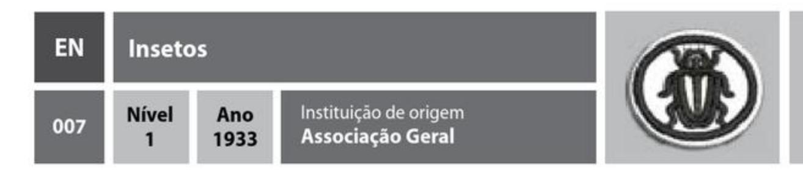

### REQUISITOS

1. Quais são as principais características dos insetos?
2. Fazer um dos seguintes (mariposas e borboletas não serão aceitas nesta especialidade):
    1. Montar uma coleção de insetos com 20 espécies diferentes, contendo espécies de, pelo menos, 6 ordens diferentes. Sob cada espécime colocar uma etiqueta contendo: local de coleta, data de coleta e nome do coletor. Em outra etiqueta, que deve ser colocada abaixo da primeira, identificar a ordem e a família de cada espécime coletado. (Ao cumprir este requisito, esteja certo de não estar infringindo nenhuma lei de seu país).
    2. Fazer desenhos ou pinturas coloridas de 20 espécies de insetos, contendo espécies de, pelo menos, 6 ordens diferentes. Os desenhos ou pinturas precisam ser do tamanho natural ou maior, para mostrar os detalhes de pequenos insetos e em coloração natural. Identificar a ordem e a família dos espécimes retratados.
    3. Tirar fotografias de 20 espécies de insetos, contendo espécies de, pelo menos, 6 ordens diferentes. Cada imagem deve estar em foco e devidamente identificada, contendo local e data onde a foto foi tirada e ordem e família do espécime fotografado.
3. Dar o nome de 5 espécies de insetos benéficos e que benefícios eles trazem.
4. Dar o nome de 5 espécies de insetos prejudiciais, que prejuízos eles causam e explicar como controlá-los.
5. Citar 3 exemplos de insetos que podem ser considerados tanto benéficos quanto prejudiciais.
6. Contar 2 histórias bíblicas nas quais os insetos tiveram um papel importante.

## Mariposas e borboletas

### REQUISITOS

1. Que características podem ser usadas para diferenciar mariposas e borboletas?

2. Definir os seguintes termos:

a) Antena

b) Ovo

c) Larva

d) Pupa

e) Crisálida

f) Casulo

g) Imago

3. Distinguir 3 espécies diferentes a partir de seus casulos.

4. O que é o pó colorido que fica grudado nas mãos ao pegar nas asas de uma borboleta ou mariposa? Examinar o pó da asa de uma borboleta ou mariposa com lentes de aumento e descrever o que foi observado.

5. Que benefícios as mariposas e borboletas trazem ao homem e ao meio ambiente?

6. Que danos as mariposas e borboletas podem causar? Em que estágio da vida elas podem causar danos? Citar 3 exemplos de mariposas e/ou borboletas que causem danos.

7. Que borboleta é famosa por seu ciclo migratório?

8. Completar um dos seguintes:

a) Montar uma coleção de mariposas e borboletas com 20 espécies diferentes. Sob cada espécime colocar uma etiqueta contendo local de coleta, data de coleta e nome do coletor. Em outra etiqueta, que deve ser colocada abaixo da primeira, identificar a ordem e a família de cada espécime coletado. (Ao cumprir este requisito, esteja certo de não estar infringindo nenhuma lei de seu país). b) Fazer desenhos ou pinturas coloridas de 25 espécies de mariposas e borboletas.

Os desenhos ou pinturas precisam ser do tamanho natural ou maior e em coloração natural. Identificar a ordem e a família dos espécimes retratados.

9. Descrever o ciclo de vida de uma mariposa ou borboleta e aprender uma lição relacionada com a ressurreição dos justos.

## Fungos

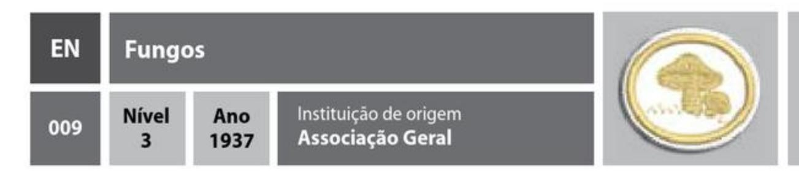

### REQUISITOS

1. Citar 3 características do Reino Fungi.

2. Dar o nome de 3 classes de fungos e exemplos de cada um.

3. Identificar, ao natural ou através de imagens, 15 fungos comuns em seu país.

4. Dar o nome de 3 fungos que têm valor econômico e dizer qual é o valor de cada um.

5. Pesquisar e esquematizar o ciclo de vida de 3 classes de fungos.

6. Citar 5 doenças causadas por fungos em seres humanos, plantas ou animais.

7. Quais cuidados devemos ter ao observarmos e manusearmos diferentes tipos de fungos?

8. Identificar, em aula prática, a diferença entre um bolor, uma orelha de pau e um cogumelo.

9. Identificar, em aula prática, as principais partes de um basidiomiceto.

10. Qual é a importância ambiental de alguns fungos?

11. Geralmente, quais devem ser as condições ambientais para um fungo viver bem?

12. Como um fungo se alimenta?

13. Encontrar, pelo menos, uma referência bíblica a fungos.

## Mamíferos

### REQUISITOS

1. Em que dia da criação foram criados os mamíferos?
2. Relacione 4 características de um mamífero.
3. Apresente uma ou mais características peculiares de cada uma dos seguintes grupos de mamíferos e mencionar uma ou mais espécies de mamíferos encontradas em cada ordem:
    1. Marsupialia
    2. Sirenia
    3. Xenarthra
    4. Primates
    5. Rodentia
    6. Lagomorpha
    7. Chiroptera
    8. Carnivora
    9. Pinnipedia
    10. Perissodactyla
    11. Artiodactyla
    12. Cetacea
4. Relacione quatro mamíferos úteis e explicar sua utilidade ao homem.
5. Relacione quatro coisas que os mamíferos fazem e que são prejudiciais ao homem.
6. Relacione quatro mamíferos que são completamente aquáticos e indicar sua área de distribuição.
7. Qual é o maior mamífero do mundo? Onde ele vive, como se alimenta e o que come?
8. Relacione oito espécies de mamíferos silvestres que você já observou e identificou pessoalmente na natureza.
9. Escrever ou contar uma história sobre "Mamíferos Silvestres que já observei".

## Répteis

### REQUISITOS

1. Que características um animal precisa ter para ser classificado como réptil?
2. Qual o nome da substância que impermeabiliza a pele dos répteis?
3. Quais são as principais ordens em que a classe dos répteis é dividida? Citar 2 exemplos para cada ordem.
4. Identificar, pessoalmente ou em imagens, um cágado, tartaruga marinha e jabuti.
5. Dar o nome de 15 répteis encontrados em sua região. Dizer onde vivem, seus hábitos alimentares e sua importância na economia.
6. Citar 5 répteis venenosos de sua região, descrevendo cada um em termos de localização de presas e distribuição geográfica.
7. Dizer o que fazer se for mordido por uma cobra peçonhenta.
8. Dizer o que fazer se for mordido por uma cobra não peçonhenta.
9. Completar uma das tarefas a seguir:
    1. Comparar lagartos, cobras, tartarugas e crocodilos quanto ao modo de vida, variações nos olhos e orelhas, dentes, coração, pulmões, membros, rabo e escamas.
    2. Manter um pequeno réptil num terrário e fazer um relatório de seus cuidados, durante, pelo menos, 3 meses. (Ao cumprir este requisito, esteja certo de não estar infringindo nenhuma lei de seu país).
10. Ser capaz de contar 2 histórias da Bíblia nas quais um réptil teve papel importante.

## Rochas e minerais

### REQUISITOS

1. Saber distinguir entre rochas e minerais.
2. Definir as seguintes características de um mineral: cor, brilho, cor do traço, clivagem, fratura, dureza, densidade e sistema cristalino.
3. Explicar as características básicas dos 3 grupos de rochas: sedimentar, ígnea e metamórfica.
4. Qual o significado da escala de Mohs? Citar os minerais de acordo com essa escala.
5. Mencionar 4 utilidades das rochas e 4 utilidades dos minerais. Citar um exemplo para cada.
6. Contar 4 incidentes da Bíblia nos quais uma rocha foi importante e decorar os versos bíblicos.
7. Quais pedras ornamentam cada um dos fundamentos do muro da Nova Jerusalém?
8. Coletar ou adquirir, pelo menos, 15 rochas ou minerais. No caso de ter coletado, classificar as espécies com o nome da pessoa que a encontrou, data e local em que foi encontrada. No caso de ter adquirido, escrever o seguinte:
    1. Para rochas: pesquisar e escrever a mineralogia da rocha e classificá-la segundo os 3 grupos de rochas.
    2. Para minerais: pesquisar e descrever as seguintes características dos minerais: cor, brilho, cor do traço.

## Rochas e minerais - avançado

| EN  | Rochas e minerais - avançado | Ano  | Instituição de origem |
| --- | ---------------------------- | ---- | --------------------- |
| 013 | Nível                        | 1937 | Associação Geral      |

### REQUISITOS

1. Ter a especialidade de Rochas e minerais.
2. Conhecer os 7 sistemas cristalinos e colar uma figura ou desenhar uma estrutura com cada um dos sistemas. Citar 2 minerais que pertençam a cada um desses grupos.
3. Definir:
    1. Estalagmite
    2. Estalactite
    3. Geodo
    4. Veio
    5. Brecha de falha
    6. Lava
    7. Caliche
    8. Formação ferrífera bandada
    9. Kimberlito
    10. Laterita
    Explicar a origem de cada um desses termos.
4. Citar o nome de 10 elementos químicos, informar de quais minerais eles são geralmente extraídos e para que cada um deles é utilizado.
5. Que 4 metais são frequentemente encontrados em sua forma nativa ou bruta?
6. Debater sobre o conteúdo de, pelo menos, 3 declarações do Espírito de Profecia a respeito de rochas e minerais.
7. Coletar ou adquirir, pelo menos, 30 rochas ou minerais. No caso de ter coletado, classificar as espécies com o nome da pessoa que a encontrou, data e local em que foi encontrada. No caso de ter adquirido, escrever o seguinte:
    1. Para rochas: pesquisar e escrever a mineralogia da rocha e classificá-la segundo os 3 grupos de rochas.
    2. Para minerais: pesquisar e descrever as seguintes características dos minerais: cor, brilho, cor do traço, clivagem, fratura, dureza, densidade e sistema cristalino.

## Moluscos

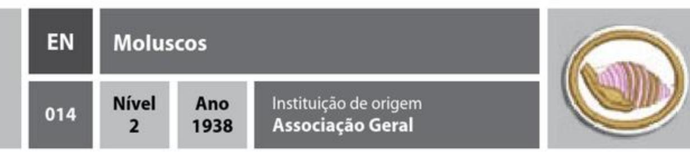

### REQUISITOS

1. O que significa o termo "molusco"?
2. Em relação aos moluscos das classes dos gastrópodes, cefalópodes e bivalves responder:
    1. Suas principais características
    2. Pelo menos um representante de cada classe
3. Quais são os únicos moluscos terrestres? A qual classe eles pertencem?
4. Citar 3 características dos moluscos.
5. Identificar e compreender as seguintes estruturas:
    1. Em bivalves
        1. Concha
        2. Cicatriz do músculo
        3. Umbo
    2. Em gastrópodes
        1. Concha
        2. Columela
        3. Apice
        4. Pé
        5. Tentáculos
        6. Olhos
6. Todas as conchas podem ser encontradas nas praias? Onde podem ser encontradas? Que áreas do mundo fornecem maior variedade de conchas?
7. Descrever 3 maneiras diferentes utilizadas pelos moluscos para sua locomoção.
8. Como os moluscos se protegem?
9. De que formas as conchas são produzidas pela maioria dos moluscos? Do que são feitas?
10. Citar 5 utilidades das conchas e dos moluscos para o homem.
11. Fazer uma coleção de 20 conchas diferentes. Estas devem ser identificadas com data de coleta ou aquisição e local de origem.
12. De onde vêm as pérolas? Que incrível lição a pérola nos ensina? (Leia Parábolas de Jesus, págs. 115-118).
13. Quais dos textos bíblicos abaixo nos falam que:
    1. As criaturas aquáticas foram criadas no quinto dia.
    2. A quantidade de criaturas aquáticas é inumerável.
    3. As criaturas das águas perecem fora da água.
    4. Jó considerava os corais de grande valor.
    5. Salomão tinha conhecimentos sobre a vida marinha.
    6. Jesus usou um produto de conchas 2 vezes para ensinar uma lição espiritual.
    7. Uma mulher de negócios vendia as famosas tintas de cor púrpura, retiradas de múrice de conchas do Mar Mediterrâneo.
    8. Paulo condenava o uso de pérolas.
    9. Moluscos não são apropriados para comer.
    10. As 12 portas da Cidade Santa são 12 pérolas.

## Cactos

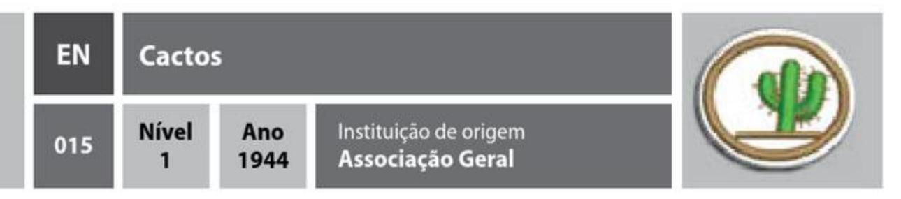

### REQUISITOS

1. Citar as principais características de um cacto.
2. A qual família pertencem os cactos?
3. O que são os espinhos presentes nos cactos? Por que os cactos apresentam essas estruturas?
4. Mencionar 3 utilidades dos cactos ao homem e/ou ao ambiente.
5. Em que região há mais quantidade de cactos? Por quê?
6. Qual a diferença e a relação entre cactos e suculentas?
7. Esquematizar um cacto e identificar suas partes.
8. Conhecer e identificar, ao natural ou em fotografias, 15 espécies de cactos.
9. Cultivar, pelo menos, 3 espécies de Cactos durante 2 meses.
10. Preparar e consumir um alimento a base de cacto.

## Climatologia

| EN  | Climatologia | Ano  | Instituição de origem |
| --- | ------------ | ---- | --------------------- |
| 016 | Nível        | 1944 | Associação Geral      |

### REQUISITOS

1. Explicar como os seguintes fenômenos são formados: neblina, chuva, orvalho, neve, granizo e geada.
2. Identificar no céu ou em fotos, os seguintes tipos de nuvens: cirros, cúmulos, estratos e nimbos. Que tipo de clima está associado a cada uma delas?
3. Explicar a ação de um termômetro de mercúrio, barômetro de mercúrio, barômetro aneróide e um pluviômetro.
4. Por que é possível haver chuva de um lado de uma montanha e estar seco do outro lado? Dar uma ilustração em seu país ou região.
    1. Por que é mais fresco e úmido nas montanhas do que nos vales?
    2. De que direção geralmente vêm a chuva e o tempo bom em sua região?
5. Demonstrar, com ajuda de um diagrama, como a relação entre a Terra e o Sol produz as diferentes estações.
6. O que causa os raios e trovões? Quais os diferentes tipos de raio existentes?
7. Com auxílio de um diagrama, demonstrar o que é convecção e qual é sua relação com o vento.
8. Explicar como radares, satélites e computadores são usados na previsão do tempo.
9. Explicar como os itens a seguir podem afetar o tempo:
    1. Correntes de jato
    2. Erupções vulcânicas
10. Fazer um desenho mostrando o ciclo de água na meteorologia.
11. Fazer um cata-vento simples ou pluviômetro.
12. Manter um quadro meteorológico durante uma semana e registrar a leitura do tempo em intervalos de 12 horas. Incluir o seguinte:
    1. Temperatura
    2. Umidade (orvalho, neblina, chuva, geada ou neve)
    3. Formação de nuvens
    4. Direção do vento
13. Completar a leitura das seguintes passagens: Gênesis 1, Jonas 1 e 2, e Mateus 8:23-27. Após a leitura, participar de um debate sobre o porquê da criação do clima, qual a relação entre o clima e a vontade de Deus e como o clima pode ser usado por Deus como ferramenta de Salvação.

## Fósseis

### REQUISITOS

1. O que são fósseis?
2. Descrever, pelo menos, 3 processos de fossilização.
3. Qual a diferença entre fóssil Somatofóssil e icnofóssil?
4. Definir as seguintes palavras:
    1. Geologia
    2. Fósseis
    3. Catastrofismo
    4. Pelecípode
    5. Graptolite
    6. Trilobita
    7. Dinossauro
    8. Mamute
    9. Mastodonte
    10. Crinoite
    11. Lingulo
    12. Foraminífera
    13. Radiolário
    14. Paleozoico
    15. Mesozoico
    16. Cenozoico
    17. Pleistoceno
    18. Paleontologia
    19. Paleobotânica
    20. Braquiópode
5. Que explicação há para a existência de animais congelados nas regiões árticas? Qual explicação se dá para sua condição e quando, provavelmente, viveram na terra?
6. Qual a relação direta entre o dilúvio citado na Bíblia e a quantidade de fósseis encontrados no planeta?
7. Citar textos da Bíblia e do Espírito de Profecia para explicar a origem dos seguintes itens:
    1. Carvão
    2. Petróleo
    3. Fósseis
    4. Calcário
8. Visitar um museu onde há fósseis em exibição e fazer um relatório da excursão.
9. Responder as perguntas abaixo por pesquisa pessoal ou com auxílio de um arqueólogo ou paleontólogo:
    1. Visitar um sítio paleontológico e fazer um relatório oral ou por escrito da excursão.
    2. Dizer como o esqueleto de um dinossauro ou outro fóssil de proporções gigantescas deveria ser removido.
    3. Por que principiantes não devem retirar estes espécimes?
    4. O que um principiante deve fazer se encontrar um fóssil?
    5. Descrever o processo de limpeza dos espécimes assim que são retirados, para prepará-los para o museu.
10. Explicar a diferença entre as teorias apresentadas por evolucionistas e criacionistas diante da presença de fósseis.
11. Pesquisar sobre a ocorrência de fósseis em sua região/país e descobrir onde está o sítio paleontológico mais próximo.

## Samambaias

### REQUISITOS

1. Qual a diferença entre as samambaias, árvores e flores?
2. Onde fica o caule das samambaias? Que parte da mesma cresce acima da terra? Em que ambiente é mais viável uma samambaia crescer?
3. Explicar como acontece a reprodução de uma samambaia. Localizar e descrever 3 tipos de soros a partir de 3 tipos de samambaias.
4. Como os esporos viajam da planta mãe para um novo local? Quanto tempo leva para um esporo se desenvolver em uma planta adulta? Demonstrar, através de fotografias ou ao natural, como as samambaias jovens são diferentes das samambaias adultas.
5. Citar 3 tipos de samambaias que podemos utilizar como remédio medicinal.
6. Desenhar, fotografar e identificar, pelo menos, 10 tipos de samambaias contendo: Nome científico, classificação e onde pode ser encontrada.
7. Além das samambaias comuns, existem plantas semelhantes a samambaias que são conhecidas como licopódio e cavalinha. Ser capaz de reconhecer 2 licopodiáceas e 1 cavalinha. Explicar as suas semelhanças com as samambaias.

## Arbustos

| EN  | Arbustos | Ano  | Instituição de origem |
| --- | -------- | ---- | --------------------- |
| 019 | Nível    | 1945 | Associação Geral      |

### REQUISITOS

1. Descobrir a definição de arbusto e saber onde os arbustos são mais utilizados.
2. Dizer 3 características dos arbustos que os distinguem das árvores e ervas.
3. Por que uma parreira, às vezes, é considerada um arbusto?
4. Dar o nome de um arbusto que produz castanhas comestíveis.
5. Mencionar 2 arbustos cultivados e 2 silvestres de sua localidade, que produzam flores vistosas.
6. Em que estação do ano floresce a maioria dos arbustos? Dar o nome de um arbusto que floresce antes das folhas aparecerem.
7. Que arbusto parasita, muito usado para decoração de interiores, cresce nos galhos mais altos de diferentes tipos de árvores?
8. De que arbusto os pássaros preferem comer as frutas ou sementes? Mencionar um arbusto cuja flor atraia os pássaros.
9. Em que arbustos os pássaros preferem construir seus ninhos?
10. Reunir, preservar e identificar corretamente as flores, folhas, sementes, vagem de sementes ou ramos com botões de 10 arbustos silvestres.

## Aves de estimação

### REQUISITOS

1. Quais são as leis do seu estado ou país com respeito à captura, criação e exportação de pássaros em gaiolas? Certifique-se que está agindo de acordo com a lei enquanto cumpre as exigências desta Especialidade.
2. Cuidar de um pássaro, ou de um casal de pássaros por, pelo menos, 6 meses.
3. Completar um dos itens a seguir:
    1. Se tiver um pássaro em gaiola, fazer um registro dos cuidados dispensados a ele durante, pelo menos, 1 mês. Incluir descrição de hábitos alimentares, necessidade de água, limpeza de gaiola, etc.
    2. Se não tiver um pássaro em gaiola atualmente, mas tiver completado o item 1 no passado, cuidar do pássaro de alguém durante, pelo menos, 1 semana, enquanto esteja viajando, etc., e fazer o registro dos cuidados necessários.
4. Canários:
    1. Citar o nome de 4 variedades de canários.
    2. Apresentar uma breve história da origem e desenvolvimento dos canários.
    3. Dar o nome e ser capaz de distinguir 5 sementes usadas na alimentação de canários.
    4. Descrever resumidamente os cuidados gerais dos canários.
5. Periguitos:
    1. De que país são originários os periquitos?
    2. Descrever brevemente seus hábitos de alimentação, ninho e comportamento em geral.
6. Pesquisar na sua região qual o tipo de ave de estimação mais comum, diferente das citadas acima e citar suas características, variedades e cuidados quando domesticados.
7. Encontrar na Bíblia, pelo menos, 3 versos que se referem a aves que podem ser consideradas de estimação e pesquisar sobre hábitos, características e origens dos mesmos.

## Gramíneas

| EN  | Gramíneas | Ano  | Instituição de origem |
| --- | --------- | ---- | --------------------- |
| 021 | Nível 3   | 1945 | Associação Geral      |

### REQUISITOS

1. Citar 4 características que a planta precisa possuir para ser considerada uma gramínea.
2. Uma gramínea apresenta qual tipo de raiz?
3. Qual o nome da família das gramíneas? Quantas espécies existem atualmente desta família?
4. Uma gramínea é considerada monocotiledônea ou dicotiledônea?
5. Que característica única no crescimento das gramíneas torna possível que a planta cresça constantemente, mesmo que sirva de pasto ou que seja cortada?
6. O que são gramíneas anuais? Citar 3 exemplos.
7. O que são gramíneas perenes. Citar 3 exemplos.
8. Dar exemplos de gramíneas que são utilizadas para produzir:
    1. Pão (3 gramíneas)
    2. Vassouras
    3. Vara de pescar
    4. Glúten
    5. Álcool de grãos (2 gramíneas)
    6. Palha
    7. Canjica
    8. Melado
    9. Mingau de aveia
    10. Amido
    11. Açúcar
    12. Farinha branca
9. Completar as atividades a seguir:
    1. Escolher uma semente de gramínea, plantá-la e cultivá-la por 1 mês. Fazer um relatório sobre o que observou.
    2. Fazer uma coleção com as folhas e sementes e, se possível, flores de 10 gramíneas de sua região.
10. Qual a importância econômica das gramíneas?
11. Em qual ecossistema a família das gramíneas está entre as principais famílias?
12. Citar 2 passagens bíblicas que façam referência a gramíneas.

## Peixes

| EN  | Peixes | Ano  | Instituição de origem |
| --- | ------ | ---- | --------------------- |
| 022 | Nível  | 1945 | Associação Geral      |

### REQUISITOS

1. Aproximadamente, quantas espécies de peixes existem ao redor do mundo?
2. Por que os peixes são considerados animais pecilotérmicos?
3. Quais as principais diferenças entre peixes condrictes e peixes osteíctes? Citar 5 exemplos de cada um.
4. Dar o nome de 10 famílias de peixes.
5. Identificar, por meio de desenho ou fotografia, 15 peixes típicos de seu país. Mencionar seu habitat, alimentação e tipo procriação.
6. Descobrir o que são peixes diádromos e dê, ao menos, 5 exemplos.
7. Qual o maior peixe do mundo? A que tamanho pode chegar? Onde ele vive? Do que se alimenta? Qual sua relação com o homem?
8. Definir as seguintes partes de um peixe:
    1. Barbatana dorsal
    2. Barbatana peitoral
    3. Barbatana pélvica
    4. Barbatana anal
    5. Barbatana caudal
    6. Linha lateral
    7. Opérculo
    8. Barbilhos
    9. Guelras
9. O que é e qual a utilidade da bolsa olfatória?
10. O que é e como funciona a bexiga natatória?
11. Explicar o funcionamento da linha lateral dos peixes e listar 3 de suas utilidades.
12. Como funciona a respiração branquial presente na maioria dos peixes?

## Anfibios

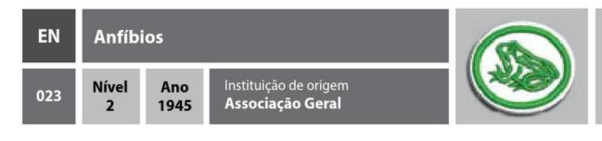

### REQUISITOS

1. Quais as características dos anfíbios?
2. Dar o nome das 3 ordens pertencentes à classe Amphibia e citar as principais diferenças entre elas.
3. Popularmente, para se diferenciar entre anuros utilizam-se os nomes sapos, pererecas e rãs. Como podemos fazer para diferenciar entre estes 3 tipos de anuros? Use imagens.
4. Como os anfíbios se protegem?
5. Fazer uma coleção através de fotos ou imagens retiradas de livro ou internet de 10 diferentes espécies de anfíbios encontrados em seu Estado ou País.
6. Descrever ou esquematizar o ciclo de vida de um anuro.
7. Explicar o valor econômico dos anfíbios.
8. Onde os sapos passam o inverno ou a estação seca?
9. Qual parte do corpo é utilizada para amplificar o som que os anuros produzem? Tanto machos quanto fêmeas são capazes de coachar? Para que os anuros utilizam seus coachos?
10. Observar um anfíbio em seu habitat natural ou cativeiro por cerca de 15 minutos e escrever um relatório sobre o que observou.
11. Do que e como a maioria dos anuros se alimenta?

## Felinos

### REQUISITOS

1. Qual é o nome científico da família do gato? Quais são as características comuns dessa família?
2. Como a estrutura da pata é semelhante em todos os felinos?
3. De que maneira os olhos de todos os felinos são semelhantes?
4. Qual é o principal alimento da família dos gatos? De que forma os dentes dos gatos estão preparados para isto?
5. Para que servem os bigodes dos gatos?
6. Como os ouvidos dos gatos são protegidos?
7. Identificar, a partir de fotografias, ilustrações ou observação pessoal, 4 raças de gatos domésticos. Descrever o temperamento de cada um.
8. Quais os benefícios, para o homem, dos gatos domésticos?
9. Identificar, a partir de fotografias, ilustrações ou observação pessoal, 7 espécies de felinos selvagens. Dizer em que parte do mundo são encontrados.
10. Responder o sequinte sobre os felinos:
    1. Qual é o maior felino do mundo?
    2. Qual é o maior felino da América do Sul?
    3. Qual é o felino mais veloz do mundo?
    4. Qual felino é popularmente conhecido como "rei dos animais"? Como é seu real temperamento?
11. Contar a história de Androcles e o Leão.
12. Contar 4 histórias bíblicas nas quais um membro da família dos felinos é mencionado.

## Rebanhos domésticos

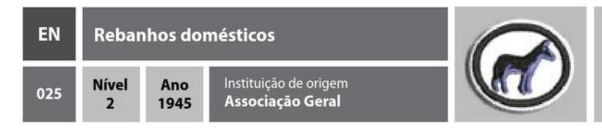

### REQUISITOS

1. Saber as principais diferenças entre cavalos de tração e cavalos de corrida.
2. Visitar uma fazenda e identificar 3 das seguintes raças de cavalos, listando suas principais características, como altura, peso, cor e disposição de pelos. (Caso em sua região crie apenas um tipo, as demais poderão ser por fotos).
    1. Normando
    2. Belga
    3. Apoloosa
    4. Árabe
    5. Manga larga
    6. Crioulo
3. Relacionar, pelo menos, 4 características físicas da mula.
4. Identificar um burro a partir de foto ou observação ao natural. Mencionar a cor, o tamanho e utilidade.
5. Visitar uma fazenda e observar 4 tipos de gado leiteiro e 4 tipos de gado de corte. (Caso em sua região se crie apenas um tipo, as demais poderão ser por fotos).
6. Conhecer as qualidades de produção de leite das raças Jersey, Guernsey e holandesa.
7. Diferenciar entre as cabras Angorá e leiteiras. Mencionar as cores distintas de, pelo menos, 3 cabras, tais como a Saanon, Toggenburg, Nubiana e Mambrina.
8. Identificar ao natural e relatar o processo de produção de lã e carne, tamanho, traços peculiares e aparência geral de 3 raças de ovelhas, tais como Merino, Ramboilet, Hampshire, Sufok e Lincoln. (Caso em sua região se crie apenas um tipo, as demais poderão ser por fotos).

## Astronomia - avançado

### REQUISITOS

1. Ter a especialidade de Astronomia.
2. Como se explicam os movimentos aparentemente diários das estrelas?
3. Dê o significado dos seguintes termos: planeta, satélite, cometa, meteoro, nebulosa, estrela fixa, mancha solar.
4. O que significam os termos: esfera celeste, pólo celeste, equador celeste, horizonte, ascensão reta, declinação, trânsito, conjunção e eclíptica?
5. Explique as principais diferenças entre um telescópio refrator e um Telescópio refletor. Descreva a montagem de um telescópio equatorial.
6. Em que cores a luz do sol se decompõe quando passa por um prisma? Em que sentido as cores das estrelas são usadas para indicar suas temperaturas?
7. Qual a relação entre a eclíptica e os equinócios vernais e outonais? Quais datas são, normalmente, associadas aos equinócios?
8. Aprender e apontar as constelações símbolos da primavera e do outono no hemisfério Sul.
9. Nomear e apontar no céu as constelações que podem ser vistas por toda uma noite clara do hemisfério Sul.
10. Nomear 5 constelações que são visíveis entre o pôr do sol e a meia noite no hemisfério Sul nos:
    1. Meses de verão
    2. Meses de inverno
11. Em qual época do ano a constelação de Órion é melhor vista? Dar o nome e localizar no céu as três estrelas mais brilhantes desta constelação.
12. Como as letras do alfabeto grego são usadas para nomear as estrelas de uma constelação? Dê 5 exemplos do uso de letras do alfabeto grego para nomear estrelas.
13. Localizar, à medida em que aparecem durante o ano, as 15 estrelas de primeira magnitude.
14. Com o uso de um diagrama, mostre as posições relativas da Terra e da Lua durante a maré alta e a maré baixa.
15. Sobre os planetas do sistema solar, responda:
    1. Dê 2 características peculiares de cada um dos planetas desse sistema.
    2. Quais desses planetas não podem ser visto sem a ajuda de um telescópio?
    3. 2 desses planetas são vistos apenas perto do amanhecer ou perto do anoitecer. Que planetas são esses?
16. Construir um relógio solar e saber ver as horas através dele.
17. Onde e de que maneira a Bíblia refere-se a Órion, às Plêiades e a Arcturo?
18. Debater a declaração feita em Primeiros Escritos, pág. 41, a respeito da abertura de Órion.

## Aves - avançado

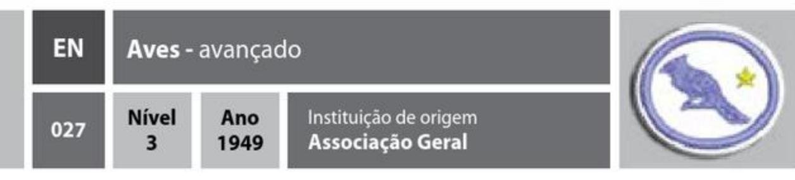

### REQUISITOS

1. Ter a especialidade de Aves.
2. Conhecer as leis de proteção às aves em seu país. Apresentar este item através de relatório.
3. Através de um esquema trazido pelo instrutor, identificar as principais partes anatômicas e morfológicas de uma ave.
4. Qual a importância das penas para as aves?
5. De que maneira os pés, pernas e bicos das aves encontram-se modificados para adaptá-los a seu meio-ambiente?
6. Identificar, através de imagens, aves que apresentem:
    1. Patas modificadas para nadar
    2. Patas adaptadas para andar ou saltar
    3. Patas adaptadas para escalar
    4. Patas adaptadas para empoleirar
    5. Bico adaptado para furar madeira
    6. Bico e línguas longos para retirar néctar de flores
    7. Bico adaptado para arrancar pedaços
7. Sobre os beija-flores, saber:
    1. O que os beija-flores comem na natureza e com que frequência?
    2. Por que os beija-flores não têm medo de grandes mamíferos ou pássaros?
    3. Qual a diferença dos movimentos de suas asas, comparadas a outros pássaros?
    4. Quão rápido são capazes de voar?
    5. Com que rapidez batem as asas e o coração?
    6. Qual o formato da língua?
8. Por qual motivo as aves migram?
9. O que é anilhamento? Como ele contribui para informações a respeito de migrações, comportamento e estrutura social? Que outros mecanismos são utilizados para monitorar as aves?
10. Mencionar a origem e o destino final de 10 espécies migratórias que ocorram em seu continente, de preferência em seu país ou região.
11. Descrever, pelo menos, 3 diferentes formas utilizadas pelas aves para se orientar em suas viagens.
12. Fazer uma lista de 30 espécies de aves que você já tenha observado pessoalmente. Para cada espécie desta lista, notar o seguinte:
    1. Nome
    2. Data de observação
    3. Local de observação
    4. Habitat (ou seja, campo, bosque, rio, lago, etc.)
13. Fazer uma lista de 10 espécies de aves que você identificou pelo som, ao ar livre.
14. Confeccionar uma coleção com nome popular e científico de 60 aves (imagens ou fotos), onde, pelo menos, 50 devem ser típicas de seu país.
15. Participar de uma caminhada em grupo para observar aves. Realizar um relatório sobre a caminhada e listar os materiais necessários para uma boa caminhada de observação de aves.

## Climatologia - avançado

### REQUISITOS

1. Ter a especialidade de Climatologia.
2. Explicar o que são áreas ciclonais e anticiclonais e mostrar quais as mudanças que elas provocam no tempo.
3. O que são frentes frias e frentes quentes? Como se movem e que condições meteorológicas produzem?
4. Explicar os seguintes fenômenos meteorológicos: vento adiabático, ventos alísios, zona de calmaria, furacão, linha de instabilidade, tornado e nevasca.
5. Explicar a ação dos registros termométricos, barográficos, higrométricos e anemométricos.
6. Ler corretamente um mapa do tempo diário, como o publicado pelo Serviço Meteorológico, explicando os símbolos e dizendo como as previsões são feitas.
7. O que significa umidade relativa do ar e ponto de condensação?
8. Desenhar um corte transversal da atmosfera, mostrando suas cinco camadas e descrevendo cada uma delas.
9. Fazer um diagrama do tempo durante três semanas. Incluir o seguinte:
    1. Precipitação pluviométrica (conseguir esta informação em seu próprio pluviômetro caseiro, ou a partir de relatórios oficiais)
    2. Leitura de barômetro
    3. Formação de nuvens
    4. Direção e velocidade dos ventos
    5. Temperaturas (altas e baixas)
    6. Umidade (orvalho, neblina, chuva, geada ou neve)
    7. Previsões de tempo e comparação com a realidade
10. Explique o que são os fenômenos "El Niño" e "La Niña" e quais são as principais conseguências para a América do Sul.
11. Realizar uma pesquisa sobre as diferenças entre os ventos anabático e catabático. Descobrir as características peculiares de cada um, como são formados e a que tipo de processo termodinâmico cada um está associado.
12. Debater o seguinte junto ao grupo da especialidade de Climatologia (básico ou avançado):
    1. Alguns benefícios para o homem adquiridos através da criação do clima
    2. Qual a relação entre o clima e a vontade de Deus
    3. Quais os efeitos do pecado sobre o clima
    4. Como o clima pode ser usado por Deus, como ferramenta de Salvação

## Flores - avançado

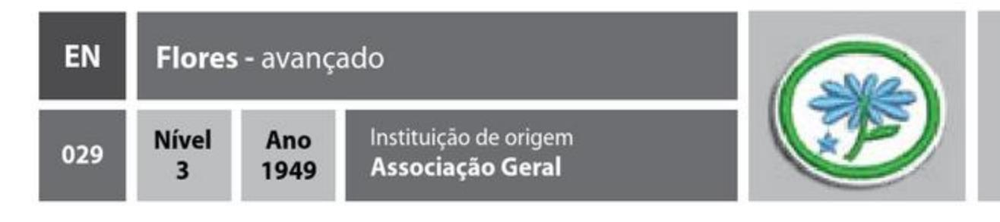

### REQUISITOS

1. Ter a especialidade de Flores.
2. Fazer uma coleção com imagens ou fotografias de 70 espécies de flores. Identifiqueas com o nome popular e científico.
3. Demonstrar habilidade em utilizar uma chave de identificação de plantas que possuam flores.
4. Citar exemplos e saber a diferença entre:
    1. Flores perfeitas e flores imperfeitas
    2. Pistilada e estaminada
5. As Angiospermas são divididas entre monocotiledôneas (Liliopsida) e dicotiledôneas (Magnoliopsida). Dentro das 2 classes existem muitas famílias. Escolher 6 famílias da classe das dicotiledôneas e 4 famílias da classe das monocotiledôneas. Realizar uma pesquisa destacando suas principais características e exemplos de espécies dessas famílias.
6. Usando a Bíblia, apresentar 2 lições espirituais nas quais os escritores bíblicos usaram as flores como ilustrações.
7. Dar o nome e descrever 8 plantas que possuam flores que são venenosas, comentando a parte específica da planta que é venenosa.
8. Fazer um dos itens a seguir:
    1. Escolher 2 sementes de flores, plantá-las e cultivá-las. Anotar as mudanças ocorridas do decorrer de 1 mês.
    2. Escolher 4 espécies diferentes de flores, cuidar destas durante 1 mês. Realizar uma pesquisa para descobrir quais são os seus polinizadores mais comuns e gerar um relatório contendo essas informações e também os cuidados necessários para cuidar dessas plantas.
    3. Cuidar, com seu Clube ou unidade, de um jardim, floreira grande ou praça durante, pelo menos, 1 mês.
9. Citar 3 diferenças existentes entre monocotiledôneas e dicotiledôneas, entre elas a formação floral.

## Insetos - avançado

### REQUISITOS

1. Ter a especialidade de Insetos.
2. Fazer um dos seguintes (mariposas e borboletas não serão aceitas nesta especialidade):
    1. Acrescentar 50 insetos à sua atual coleção. A coleção completa deverá conter insetos de, pelo menos, 10 ordens diferentes. Sob cada espécime colocar uma etiqueta contendo local de coleta, data de coleta e nome do coletor. Em outra etiqueta, que deve ser colocada abaixo da primeira, identificar a ordem e a família de cada espécime coletado. (Ao cumprir este requisito, esteja certo de não estar infringindo nenhuma lei de seu país).
    2. Acrescentar 50 desenhos ou pinturas coloridas de espécies de insetos ao seu álbum da especialidade de Insetos. O álbum completo deverá conter espécies de, pelo menos, 10 ordens diferentes. Os desenhos ou pinturas precisam ser do tamanho natural ou maior, para mostrar os detalhes de pequenos insetos, e em coloração natural. Identificar a ordem e a família dos espécimes retratados.
    3. Acrescentar 50 fotografias de espécies de insetos ao seu álbum da especialidade de Insetos. O álbum completo deverá conter espécies de, pelo menos, 10 ordens diferentes. Cada imagem deve estar em foco e devidamente identificada, contendo local e data onde a foto foi tirada e ordem e família do espécime fotografado.
3. Como as estruturas especiais e hábitos dos insetos os preparam tão notavelmente para a vida?
4. Diferenciar insetos ametábolos, hemimetábolos e holometábolos e citar 2 exemplos de cada. Ilustrar o ciclo de vida de 4 insetos de ordens diferentes, sendo 2 hemimetábolos e 2 holometábolos.
5. O que são insetos eusociais? Como eles diferem dos insetos insociais e dos subsociais? Citar 2 exemplos de insetos eusociais.
6. Dar o nome de, pelo menos, 4 insetos que transmitem doenças ao homem e dar o nome de, pelo menos, uma doença transmitida por cada um desses insetos.
7. Dar o nome de, pelo menos, 4 insetos que transmitem doenças ao homem e dar o nome de, pelo menos, 1 doença transmitida por cada um desses insetos.
8. Construir uma rede entomológica. A rede pode ser uma rede aérea, de arrasto ou aquática.
9. Construir uma armadilha para insetos noturnos, utilizá-la e fazer um relatório sobre os insetos que foram capturados.
10. Fazer um dos seguintes:
    1. Mencionar, pelo menos, um inseto correspondente a cada um dos seguintes:
        1. Aquáticos
        2. Minadores
        3. Broqueadores
        4. Galhadores
        5. Sugadores de seiva
        6. Comedores de papel
        7. Parasitas de mamíferos ou aves
    2. Descrever as castas de cupins e abelhas.
    3. Comparar os graus de inteligência exibidos por um gafanhoto ou besouro, com a formiga, abelha ou vespa.
11. Citar 3 exemplos de insetos que podem ser considerados tanto benéficos quanto prejudiciais.

## Mamíferos - avançado

### REQUISITOS

1. Ter a especialidade de Mamíferos.
2. Que mamíferos de sua região são protegidos por lei? Por quê?
3. Como o processo de nascimento e cuidado dos filhotes difere os monotremos e marsupiais de todas as outras ordens de mamíferos?
4. Mencione cinco maneiras diferentes pelas quais os mamíferos protegem a si mesmos e aos seus filhotes e dar um exemplo de cada uma.
5. Conheça as seguintes zoonoses: febre maculosa, leishmaniose tegumentar americana, leptospirose, hantavirose, raiva, toxoplasmose e doença de Chagas. Sobre cada uma delas dizer:
    1. Sinais e sintomas
    2. Vetor/reservatório/hospedeiro
    3. Transmissão
    4. Prevenção
6. Relacione 15 espécies de mamíferos silvestres que você já observou e identificou pessoalmente na natureza. Para cada um dos relacionados, incluir:
    1. Nome
    2. Data da observação
    3. Local
    4. Habitat
    5. Hora do dia
    6. Comportamento

## Moluscos - avançado

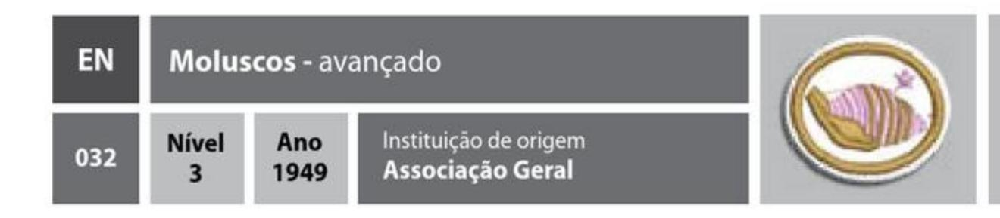

### REQUISITOS

1. Ter a especialidade de Moluscos.
2. Conhecer 5 classes de moluscos e saber distinguir as principais características de cada uma. Conhecer, pelo menos, 2 representantes de cada classe.
3. Distinguir entre moluscos univalves de bivalves, considerando o seguinte:
    1. Concha
    2. Corpo do molusco
    3. Reprodução
    4. Movimentos
    5. Busca por alimentação
    6. Autopreservação
4. Identificar, a partir das conchas ou de desenhos, e conhecer os seguintes termos conquiliológicos:
    1. Válvula
    2. Vértice
    3. Abertura
    4. Bisso
    5. Pé
    6. Manto
    7. Opérculo
    8. Madrepérola
    9. Lábios
    10. Epiderme
    11. Costela
    12. Dentes
    13. Canal
    14. Espinhas
    15. Espiras
    16. Linhas concêntricas
5. Quanto tempo vivem os moluscos?
6. Apresentar alguns fatos sobre a vida de um Strombus pugilis (Concha-de-briga) e explicar porque esta concha tem este nome.
7. Identificar e explicar as atividades do Teredo.
8. Dar o nome de 2 moluscos que não têm concha.
9. Encontrar respostas para as intrigantes perguntas a seguir:
    1. Como animais bivalves e univalves se prendem às suas conchas?
    2. Como se controla a cor de uma concha?
    3. Que molusco tem 4 quelras?
    4. A partir de que animal marinho fazia-se a tinta na Índia?
    5. Que molusco deixa um rastro brilhante?
    6. Que conchas eram usadas como dinheiro por tribos antigas?
    7. Que concha é considerada sagrada pelos tibetanos?
    8. A tinta púrpura dos tempos antigos era retirada da excreção de que molusco?
10. Citar 6 usos comerciais das conchas.
11. Fazer uma coleção de 40 conchas diferentes. Identificá-las de acordo com a data de coleta, local, habitat do molusco que a possuía e o nome da classe pertencente. Caso tenha ganhado ou sido presenteado, indicar o nome da pessoa que o presenteou, data, classe a que pertence e, se possível, qual era o habitat do molusco que possuía esta concha.

## Arvores - avançado

| EN  | Árvores - avançado | Ano  | Instituição de origem |
| --- | ------------------ | ---- | --------------------- |
| 033 | Nível              | 1949 | Associação Geral      |

### REQUISITOS

1. Ter a especialidade de Árvores.
2. Montar exsicatas de 35 espécies diferentes de árvores e rotular cada exsicata. Os rótulos deverão conter o nome científico, família, nome popular e características da árvore.
3. Classificar as folhas dos espécimes da coleção do requisito anterior quanto à composição da folha (simples ou composta), quanto ao pecíolo (peciolada, peltada, séssil), quanto à forma do limbo foliar e quanto ao tipo de margem.
4. Fazer o seguinte:
    1. Descreva as vantagens em usar os nomes científicos.
    2. Para que servem as duas partes de um nome científico?
5. Dar o nome de 6 famílias de árvores da divisão angiosperma e de 3 famílias de árvores da divisão gimnosperma.
6. Definir os termos a seguir: estípula, resina, cerne, alburno, fibra, câmbio, xilema e floema.
7. Identificar 10 plantas comuns por suas características (que não sejam as folhas), tais como gavinhas, espinhos, acúleos, casca, flores, frutos, interações planta-animal, formato característico e hábitos de crescimento.

## Cães

### REQUISITOS

1. Dar o nome científico do cão doméstico.
2. Citar 5 características peculiares da família Canidae.
3. Identificar, a partir de fotografias/figuras, ou observação natural, 5 membros selvagens da família dos cães.
4. Identificar, a partir de fotografias/figuras, ou observação natural, 15 diferentes raças de cães.
5. Mencionar 5 contribuições da família dos cães ao homem.
6. Escrever ou descrever oralmente a importância, para o homem, dos seguintes grupos de cães e mencionar algumas raças equivalentes:
    1. Cães-guia
    2. Cães farejadores
    3. Cães pastores
    4. Cães companheiros para crianças
    5. Cães guardas
    6. Cães que auxiliam polícia e bombeiros em sua região
7. Dar o nome da menor e da maior raça de cães.
8. Identificar, pessoalmente ou por fotografias/figuras, 5 cães que são classificados como "toy" (anões).
9. Qual é o único cão que tem a língua inteiramente azul ou preta?
10. Qual o cão mais rápido?
11. Escrever ou contar uma história sobre um cão.
12. Quais cuidados deve-se tomar com os cães para que tenham uma vida saudável.
13. Ajudar a cuidar de um cão por, pelo menos, 1 mês.

## Areia

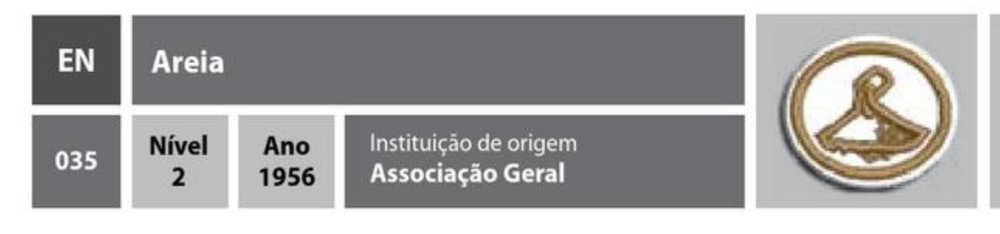

### REQUISITOS

1. O que significa a palavra areia? Dar o nome de 2 tipos de areia.
2. Apresentar a origem da areia e seu conteúdo mineral.
3. Qual a diferença entre areia e solo?
4. O que o tamanho do grão de areia, seu formato, superfície e sua fragmentação querem dizer?
5. Definir e explicar a utilidade de cada uma:
    1. Glaciar
    2. Calcária
    3. Areia Movediça
    4. Areia para fazer vidro
    5. Areia de Modelagem
    6. Areia para polir
    7. Areia para construção
    8. Areia para filtrar
    9. Areia para fornalha
    10. Areia de praia
6. Memorizar Gênesis 22:17 e Provérbios 27:3.
7. Examinar 5 tipos de espécimes de areia com lentes de aumento e observar as várias características.
8. Fazer uma coleção de 10 variedades de areias coloridas e dar o nome da localidade de onde as tirou. (Observação: Levar saquinhos pequenos, um lápis e uma pequena colher ou concha para retirar a areia. Apresentar em pequenos vidros/garrafas).

## Algas

### REQUISITOS

1. Definir o que são algas.
2. Onde as algas podem ser encontradas?
3. Como é chamado o órgão de fixação do substrato? Que diferenças e semelhanças podem ser encontradas entre uma alga e uma planta?
4. Explicar porque há uma variação de tamanho entre as algas marinhas.
5. Citar, pelo menos, 4 grupos de algas marinhas. Depois fazer um quadro indicando ao lado de cada grupo o seguinte:
    1. Nome popular
    2. Nome científico
    3. Estrutura (unicelular, pluricelular, ou ambos)
6. O que são diatomáceas?
7. Onde as algas marinhas crescem com mais frequência: zona polar, temperada ou tropical? Explique.
8. Onde as algas marrons ou pardas são mais comumente encontradas, em água doce ou salgada?
9. Qual a maior profundidade em que as algas marinhas crescem no oceano? Explicar o motivo das algas não se desenvolverem em águas profundas.
10. Nomear 3 partes de uma alga marinha de grande porte. Como elas podem ser comparadas a uma folha, a um caule e a uma raiz de uma planta?
11. Explicar, pelo menos, 2 formas de reprodução das algas marinhas.
12. Cite algumas vantagens comerciais que as algas marinhas podem contribuir ao homem.
13. Montar uma coleção de, pelo menos, 10 espécimes de algas ou identificar, por fotografias, pelo menos 20. Identificá-las pelo nome popular e, se possível, o nome científico.

## Cetáceos

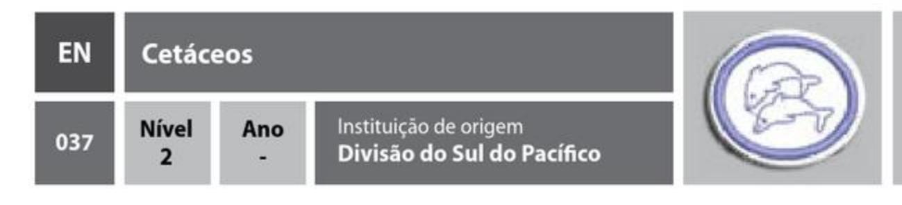

### REQUISITOS

1. De que maneira a ordem dos cetáceos é diferente da maioria dos outros seres marinhos?
2. Explicar a diferença entre baleias verdadeiras (misticetos) e baleias com dentes (odontocetos).
3. De que formas as baleias e os golfinhos têm sido um benefício para o homem?
4. Sabendo que as baleias são animais homeotérmicos (de sangue quente), assim como os seres humanos, explique como as baleias que se reproduzem nas águas quentes dos trópicos também podem sobreviver nas águas geladas da Antártida, para onde elas vão para se alimentar.
5. Memorizar as seguintes Escrituras sobre as baleias:
    1. Gênesis 1:21
    2. Ezequiel 32:2
    3. Jó 7:12
    4. Mateus 12:40
6. Escrever e ler para um grupo, ou contar de memória, a história de Jonas.
7. Desenhar, com sucesso, uma baleia verdadeira e identificar onde ficam as seguintes partes do corpo:
    1. Barbatanas
    2. Orifícios respiratórios (espiráculos)
    3. Nadadeira dorsal
    4. Ouvido
    5. Olho
    6. Sulcos ventrais
    7. Lobos caudais
    8. Nadadeiras peitorais
    9. Abertura genital
    10. Intersecção dos lobos caudais
    11. Pedúnculo caudal
8. Ser capaz de identificar, pelo menos, 15 espécies de cetáceos, ao vivo, por fotografia, ilustração ou documentário.

## Ervas

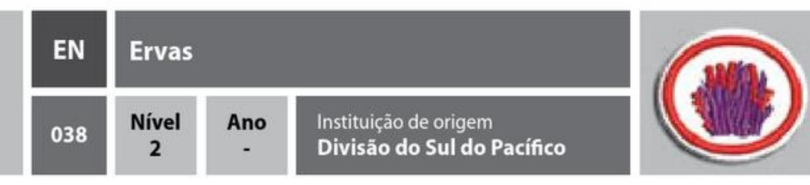

### REQUISITOS

1. Relacionar 25 ervas culinárias e o uso de cada uma.
2. Relacionar 25 ervas medicinais e o uso de cada uma.
3. Preparar um prato ou bebida (suco ou chá) usando ervas.
4. Usando ervas conhecidas da sua região, fazer 2 dos produtos a seguir:
    1. Creme
    2. Almofada ou travesseiro (com enchimento de ervas)
    3. Sabonete
    4. Papel
    5. Vela decorativa
    6. Sachê
5. Fazer um pote decorativo com mistura de ervas secas.
6. Fazer uma caixa com substâncias aromáticas.
7. Citar e identificar 5 ervas silvestres que crescem na região que você mora.
8. Citar 5 ervas que podem ser usadas como tintura e mencionar a cor que produzem.
9. Citar 5 ervas que podem ser usadas no controle de insetos.
10. Cultivar 5 ervas culinárias durante, pelo menos, 3 meses.
11. Citar 5 ervas que atraem abelhas.
12. Citar 5 ervas mencionadas na Bíblia. Mencionar os textos bíblicos onde podem ser encontradas e quais as finalidades de seu uso.

## Eucaliptos

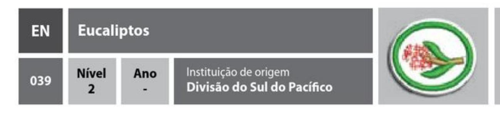

### REQUISITOS

1. Quantas espécies diferentes de eucaliptos existem no Brasil?
2. Qual a origem do nome eucalipto?
3. Os eucaliptos pertencem a que família?
4. Em que partes do mundo os eucaliptos podem ser encontrados?
5. Em quais dos países listados no requisito anterior eles são considerados plantas nativas?
6. Responder o seguinte:
    1. Qual país tem as angiospermas mais altas?
    2. Onde elas crescem?
    3. Que altura elas alcançam?
7. Como os eucaliptos estão adaptados a:
    1. Frequentes incêndios florestais?
    2. Regiões áridas?
8. Responder o seguinte, com relação à extração de óleo:
    1. De que espécies se extraem óleos de eucalipto?
    2. Existe extração de óleo em seu país? Que espécie é utilizada? Onde esse processo é realizado em seu país?
    3. Que finalidades os óleos de eucalipto possuem?
9. Que utilidades o eucalipto possui para o homem? Além de seu uso, que outros benefícios ele pode trazer ao homem e ao meio ambiente?
10. Fazer um dos seguintes:
    1. Coletar, prensar e identificar ramos de 15 espécies diferentes de eucaliptos. Anotar quaisquer características importantes para a identificação e ser capaz de identificar outros indivíduos das espécies coletadas.
    2. Desenhar ou fotografar 15 espécies diferentes de eucaliptos, mostrando os ramos e outras características importantes para a identificação e ser capaz de identificar outros indivíduos das espécies retratadas.

## Sementes

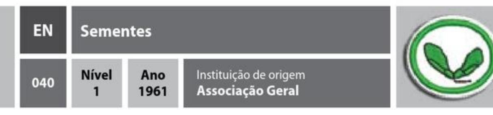

### REQUISITOS

1. Qual o principal objetivo de uma semente?
2. Que alimentos foram os primeiros a serem dados ao homem no Jardim do Éden?
3. Identificar, a partir de uma semente ou desenho da mesma, e saber o propósito dos seguintes: tegumento, cotilédone e embrião (germe).
4. Conhecer 4 diferentes métodos pelos quais as sementes são dispersadas pelas plantas. Mencionar 3 exemplos de plantas que espalham suas sementes por cada método.
5. Conhecer 10 tipos de sementes que usamos como alimento.
6. Conhecer 5 tipos de sementes que são usadas como fonte de óleo.
7. Conhecer 5 tipos de sementes que são usadas como condimentos.
8. Qual fator não pode faltar para que uma planta germine?
9. Fazer uma coleção de 30 diferentes tipos de sementes, 20 das quais tenham sido encontradas por você mesmo. Identificar cada uma com o nome, data e local em que foi encontrada, e nome da pessoa que a encontrou. Você poderá colá-las em um papel cartolina ou cartão, ou colocá-las em frascos transparentes.
10. Plantar uma semente de feijão, milho e soja. Fazer uma análise do tempo que demorou para cada uma delas germinar. Fazer um relatório diário do que ocorreu com a planta, observar as diferenças entre o feijão e o milho.

## Sementes - avançado

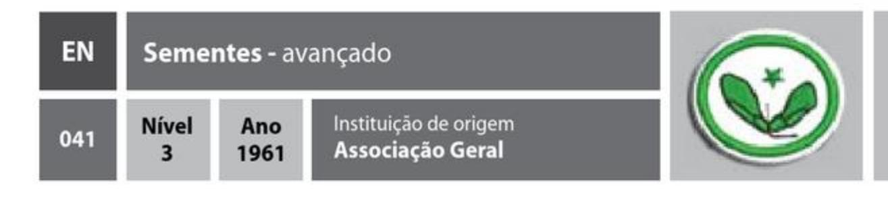

### REQUISITOS

1. Ter a especialidade de Sementes.
2. Identificar, a partir de desenhos, e conhecer o propósito de cada uma das seguintes partes de uma semente: endosperma, radícula, gêmula, micrópila.
3. Saber várias diferenças entre a semente monocotiledônea e a dicotiledônea.
4. Explicar os propósitos e utilidades de um aparato para testar as sementes. Testar a germinação de 100 sementes de uma planta silvestre e 100 sementes de uma planta doméstica. Relatar os resultados de cada teste.
5. Qual a diferença entre uma semente e um esporo?
6. Ter em sua coleção 4 tipos de sementes de 2 famílias de plantas de sua escolha, demonstrando a semelhança entre as sementes de plantas da mesma família.
7. Escrever ou apresentar oralmente 2 lições que podemos aprender das sementes. Você poderá encontrar as informações que procura no livro Parábolas de Jesus, pág. 33 a 89.
8. Fazer uma coleção de 60 tipos de sementes, 45 das quais você mesmo tenha encontrado. Classificar cada uma delas com o nome, data e local em que foi encontrada, e nome da pessoa que a encontrou. As sementes podem ser coladas em papel cartão, ou colocadas em frascos transparentes.

## Orquídeas

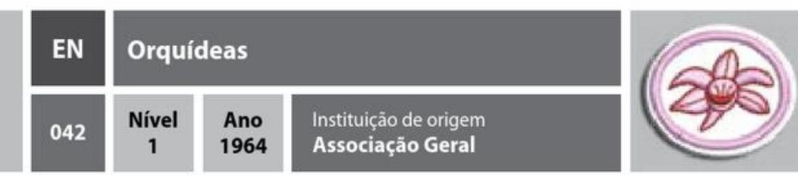

### REQUISITOS

1. Definir as características de uma orquídea.
2. Quais são os 2 principais grupos de orquídeas? Dar o nome e mostrar exemplos de cada, a partir das próprias plantas ou de fotografias.
3. Quais as diferenças entre as orguídeas epífitas, rupícolas, terrestres e humícolas?
4. Discorrer sobre a distribuição de orquídeas, fazendo uma referência especial às espécies comuns em sua região.
5. Citar o principal gênero de orquídeas cultivadas. Identificar 3 a partir de plantas ou fotografias.
6. Quais as principais utilidades das orquídeas? Que orquídea é mais popular comercialmente falando?
7. Discutir os seguintes pontos a serem observados no cultivo de orguídeas:
    1. Luz
    2. Temperatura
    3. Umidade
    4. Nutrientes
    5. Ventilação
    6. Vasos e substratos
8. Cultivar, pelo menos, 1 orguídea durante, no mínimo, 6 meses. Ao final do período, apresentar um histórico fotográfico mensal, acompanhado de anotações sobre o desenvolvimento e cuidados necessários durante cada mês.

## Plantas silvestres comestíveis

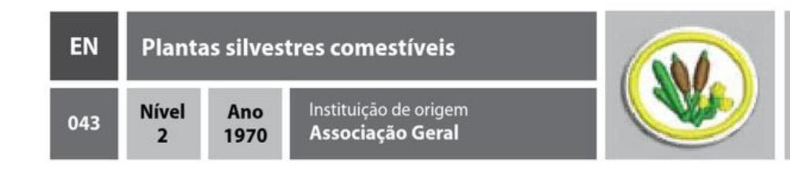

### REQUISITOS

> NOTA: Esta especialidade deve ser acompanhada por um instrutor que tenha conhecimentos profundos sobre a flora da região.

1. Fotografar ou desenhar, no mínimo, 15 plantas silvestres comestíveis. Identificar cada planta na natureza. Informar o hábito (erva, trepadeira, arbusto ou árvore) e as partes comestíveis de cada uma das plantas.
2. Identificar, preparar e comer 5 tipos de frutas silvestres, 3 tipos de bebidas, 3 plantas de saladas, 3 ervas e 2 raízes ou tubérculos.
3. Demonstrar a preparação de alimentos silvestres em cada uma das maneiras a seguir:
    1. Ferver
    2. Tostar
    3. Fritar
    4. Assar
4. Demonstrar como preparar uma porção ou mais de uma planta silvestre comestível que só é encontrada em sua região.
5. Explicar a importância de não comer cogumelos silvestres.
6. Qual raiz de planta pode ser seca e moída para se fazer farinha?
7. Conhecer, pelo menos, 8 famílias que têm plantas venenosas ou duvidosas.
8. Qual é a principal regra para determinar se uma planta é comestível?
9. Elaborar um manual com fotos das plantas utilizadas para o cumprimento dos requisitos anteriores, acrescentando as seguintes informações para cada uma delas:
    1. Nome pela qual é conhecida na região e, se possível, o nome científico.
    2. Identificação da planta (árvore, arbusto, etc.)
    3. Partes comestíveis
    4. Onde é encontrada (habitat)
    5. Tipo de toxinas
    6. Valores medicinais
    7. Outras utilidades, fora a alimentação
    8. Receitas que possam ser feitas com essa planta

---

## Ecologia

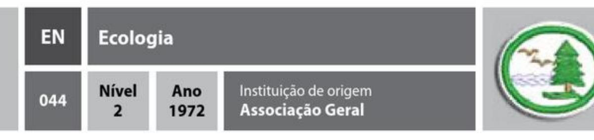

### REQUISITOS

1. Saber o significado dos seguintes termos:
    1. Ecologia
    2. Plâncton
    3. Populações
    4. Comunidade
    5. Ecossistemas
    6. Conservação
    7. Cadeia alimentar
    8. Comunidade Clímax
    9. Comensalismo
    10. Autotrofismo
    11. Bioma
    12. Habitat
    13. Sucessão Ecológica
2. O que é uma pirâmide ecológica? Por que ela tem esse formato? Escolher um mamífero, um pássaro, um réptil e um anfíbio comuns na região em que você mora e construir para cada um deles um diagrama de sua pirâmide ecológica.
3. Definir o que é ecossistema. Falar sobre os fatores biológicos e físicos que o mantém equilibrado.
4. Utilizando-se de fotografias ou figuras, elaborar um cartaz ou quadro formando um diagrama ilustrando um ecossistema de um pequeno lago de água doce.
5. Fazer observações detalhadas, em campo, e um estudo, em livros e internet, sobre o habitat de alguns pequenos animais de sua região. Escreva um relatório: metade dele com os resultados de suas observações e metade a partir dos estudos em livros e internet. Cerca de 500 palavras.
6. Pesquisar sobre como se faz a coleta de lixo em seu bairro e qual o destino do lixo coletado. Acompanhar durante 1 mês e elaborar um relatório com as informações de quanto lixo sua família joga por dia e como poderiam lidar melhor com isto.
7. Pesquisar nos jornais ou em algum site especializado, por um mês, os níveis de poluição atmosférica de uma cidade grande (a mais perto da sua, se você não morar numa cidade grande). Fazer um gráfico demonstrando a curva deste nível durante o mês. Descubrir o que causa os pontos altos de sua curva do gráfico.
8. Relacionar 10 maneiras de trabalhar ativamente em favor do meio ambiente de sua comunidade e cidade. Colocar 4 delas em prática.
9. Pesquisar um texto do Espírito de Profecia e um texto bíblico relacionados à ecologia. Apresentar uma explicação sobre sua relevância e aplicação aos nossos dias.

---

## Ecologia - avançado

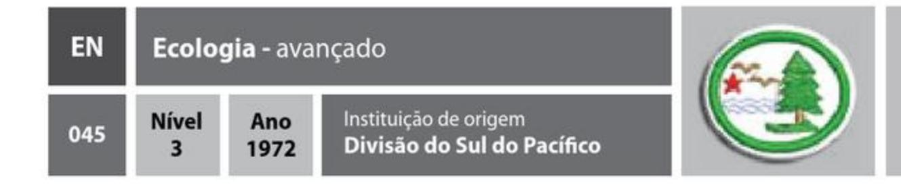

### REQUISITOS

> NOTA: Para esta especialidade, é recomendável o acompanhamento de um instrutor. Falar com seu líder de desbravadores ou instrutor antes de começar os requisitos 8 e 9.

1. Ter a especialidade de Ecologia.
2. Citar a primeira e segunda leis da termodinâmica e explicar como são importantes para a ecologia.
3. Explicar quais são os 4 níveis tróficos e dar exemplos de organismos para cada nível.
4. Elaborar um diagrama dos 3 tipos de pirâmides ecológicas existentes na rede alimentar. Apresentar, pelo menos, um exemplo em cada camada da pirâmide.
5. Explicar o ciclo bioquímico e fazer um diagrama sobre todos os componentes básicos do ciclo.
6. Apresentar um diagrama que contenha os passos básicos do fluxo de energia através do sistema biótico de um ecossistema. Começar o diagrama pelo sol.
7. Citar a Lei do Mínimo, de Liebig, e a Lei da Tolerância, de Shelford, e explicar de que maneira elas nos dizem como e porque certas plantas e animais estão em perigo de extinção, ou completamente extintos quando seus habitat ou comunidades são alterados ou perdem o equilíbrio.
8. Escolher uma comunidade biológica de sua região como, por exemplo, uma floresta ou bosque, pântano, lago ou açude, pasto ou campo, desfiladeiro ou riacho, etc., que esteja de alguma forma alterado ecologicamente. Descrever o local, incluindo como se deu e até que ponto o equilíbrio foi alterado. Depois, apresentar recomendações sobre como aquela comunidade pode ser melhorada e direcionar seus esforços para o acompanhamento e ajuda no trabalho de melhoria.
9. Passar, pelo menos, 20 horas envolvido em trabalho ativo num projeto ecológico de sua área. Isto pode ser feito individualmente ou em grupo. Elaborar um esboço do projeto e seus objetivos, bem como relatar detalhadamente a parte que você desempenhou no mesmo.
10. Definir os sequintes termos:
    1. Matéria-prima
    2. Fotossintese
    3. Quimiossíntese
    4. Autotrófico
    5. Heterotrófico
    6. Equilíbrio ecológico
    7. Saprófagos
    8. Decompositores
    9. Produtor
    10. Consumidor
    11. Fator limitante
11. Encontrar um trecho do Espírito de Profecia e um texto bíblico, diferentes dos utilizados na especialidade básica, relacionado à ecologia e explicar sua relevância e aplicação aos nossos dias.

## Conservação ambiental

| EN  | Conservação ambiental | Ano  | Instituição de origem |
| --- | --------------------- | ---- | --------------------- |
| 046 | Nível 3               | 1973 | Associação Geral      |

### REQUISITOS

1. Explicar a diferença entre ecologia e conservação ambiental.
2. Escrever uma redação com, no mínimo, 500 palavras com o tema: O aumento da população humana e como isso é uma ameaça à sua própria existência na Terra.
3. O que significa o termo "morte" de um lago ou rio? Há algum lago ou rio em sua região ou cidade que é classificado como "morto"?
4. Realizar um estudo num pequeno riacho que passe dentro ou perto de sua cidade. Apresentar um relatório de, no mínimo, 300 palavras sobre sua observação nos seguintes itens:
    1. Sinais de pureza
        1. Abundância de pequenos peixes
        2. Água visualmente clara e com odor agradável
        3. Margens do riacho cobertas de vegetação até perto da água
        4. Pequenas quantidades de alga verde na água (de coloração verde claro)
        5. Existência de algumas plantas aquáticas como a taboa, erva do campo ou pontedéria
        6. Existência de tartarugas
        7. Existência de lagostins sob as pedras do riacho
        8. Crescimento de ervas daninhas na areia das margens, indicando um nível de áqua relativamente estável
    2. Sinais de deterioração e morte
        1. Presença de grandes massas de alga azul-verde (coloração verde escuro)
        2. Margens marcadas por nível de água durante as chuvas
        3. Água com odor pútrido
        4. Presença de espuma de detergentes/agentes químicos
        5. Lixo nas margens e dentro da água, perto das margens
        6. Agua repleta de sedimentos
        7. Ausência de insetos aquáticos e peixes
        8. Presença de esgoto
        9. Presença de óleo na superfície da água
        10. Ausência de salamandras e rãs sob as pedras do riacho
        11. Depósito ou fábricas jogam resíduos nas águas do riacho
5. Após a investigação do requisito anterior, realizar um dos itens abaixo:
    1. Se o riacho demonstrar sinais de pureza:
        1. Descobrir quais são as medias que são (deveriam ser) realizadas para a sua preservação
        2. Fazer um projeto de conscientização da população na preservação deste espaço
    2. Se o seu riacho demonstra alguns dos sinais de deterioração acima citados, fazer, pelo menos, 2 dos itens abaixo:
        1. Realizar um projeto comunitário para despoluí-lo
        2. Organizar um grupo de jovens para ajudá-lo a recolher o lixo das margens do riacho
        3. Conseguir que empresários forneçam caminhões ou pick-ups para ajudar na despoluição
        4. Descobrir qual a posição e projetos que sua prefeitura/administração tem para despoluir este local e cobrar as providências
6. Fazer uma visita ao depósito de lixo de sua cidade ou bairro e ver como o lixo é tratado. Descobrir:
    1. Quantas toneladas de lixo são jogadas diariamente
    2. Que tentativas são feitas para se reciclar parte desse lixo
    3. Parte do lixo é queimada ou é todo enterrado?
    4. Qual é o custo, por pessoa, por ano, para lidar com o lixo em sua cidade
    5. O que acontece com os carros que não servem mais para nada em sua região
7. Realizar um dos itens abaixo:
    1. Visitar uma usina ou aterro sanitário mais próximo. Nesta visita, realizar os itens abaixo ou ter as especialidades de Reciclagem e Reciclagem - avançado:
        1. Desenhar um diagrama detalhado do que acontece ao lixo líquido e sólido, do momento em que entram na usina até saírem.
        2. Em que estado sai o lixo desta usina?
        3. Há qualquer outra utilidade para este lixo?
    2. Visitar uma usina de purificação de água:
        1. Construir um diagrama dos passos para a purificação da água, do momento em que entra na usina até sair para ser distribuído em residências e estabelecimentos comerciais.
        2. Através da leitura e discussão com funcionários da usina, determinar se as fontes de água do futuro serão suficientes para a demanda.
        3. Descobrir como você e sua comunidade podem preservar e reduzir o consumo de água.
        4. Fazer uma campanha com seu Clube/unidade para evitar o desperdício de água.
8. Ler e escrever um resumo de um livro sobre questões do meio ambiente.
9. Ter a especialidade de Animais ameaçados de extinção.

## Geologia

| EN  | Geologia | Ano  | Instituição de origem |
| --- | -------- | ---- | --------------------- |
| 047 | Nível    | 1975 | Associação Geral      |

### REQUISITOS

1. Apresentar o significado dos seguintes termos:
    1. Litologia
    2. Camada
    3. Dobra
    4. Falha
    5. Delta
    6. Rio meandrante
    7. Rio entrelaçado
    8. Rio retilíneo
    9. Rio anastomosado
    10. Morena
    11. Leque aluvial
    12. Anticlinal
    13. Sinclinal
    14. Antiforme
    15. Sinforme
    16. Capa ou teto
    17. Lapa ou muro
    18. Falha transcorrente
    19. Falha transformante
    20. Falha normal
    21. Falha reversa
    22. Falha de empurrão
2. Descrever:
    1. Como uma geleira se move e quais evidências deixa em seu rastro.
    2. Por que as margens de um rio ou riacho frequentemente ficam mais cavadas do lado de fora de uma curva.
    3. Como se forma uma cordilheira
3. Saber em que grupo de rochas (sedimentar, metamórfica ou ígnea) as seguintes rochas estão classificadas:
    1. Granito
    2. Mármore
    3. Arenito
    4. Conglomerado
    5. Basalto
    6. Ardósia
    7. Xisto
    8. Argilito
    9. Gnaisse
    10. Quartzito
4. Tirar uma fotografia ou desenhar cada uma das características geológicas a seguir:
    1. Marcas de ondulação na areia ou lama (Se possível, mostrar com uma seta a direção da corrente)
    2. Erosão
    3. Gretas de ressecamento (estas geralmente são encontradas após uma forte chuva ou alagamento, quando a lama começa a secar)
    4. Perfil do solo ao longo das margens de um rio ou de uma estrada (perceba como o solo varia a cor e a granulometria em cada uma das camadas)
    5. Banco de areia (os mesmos geralmente podem se encontrados ao longo de riachos, rios ou do mar)
    6. Dolina
    7. Falha com deslocamento das litologias

## Geologia - avançado

| EN  | Geologia - avançado | Ano  | Instituição de origem |
| --- | ------------------- | ---- | --------------------- |
| 048 | Nível               | 1975 | Associação Geral      |

### REQUISITOS

1. Ter a especialidade de Geologia.
2. Providenciar as seguintes informações:
    1. De que forma os terremotos revelam como é o interior da terra? Citar e explicar as características dos diferentes tipos de ondas que causam os terremotos.
    2. Os efeitos de uma quantidade muito grande de água (como o Dilúvio do tempo de Noé) em poucos meses, comparados aos efeitos de pouca água em milhares e milhões de anos.
    3. Por que se têm evidências de geleiras em zonas de clima temperado, onde não existem geleiras atualmente?
    4. Como os criacionistas que acreditam num dilúvio universal e numa idade relativamente jovem da terra, desde a criação, compreendem e usam o quadro de tempo geológico?
    5. Qual é a teoria da deriva continental (placa tectônica) e como os criacionistas podem inserir tal atividade geológica no tempo desde a criação?
3. Em que lugar do mundo você provavelmente poderia ver:
    1. Grandes geleiras
    2. Vulcões ativos
    3. Dunas de areia
    4. Mineralização de diamante
    5. Fossas oceânicas
4. Escrever um trabalho de, pelo menos, 500 palavras sobre um aspecto geológico interessante que você tenha observado numa viagem recente. Se possível, descreva a rocha (cor, granulometria, textura, estrutura). Caso seja um perfil litológico, desenhá-lo com escala.

## Plantas caseiras

### REQUISITOS

1. Citar, ao menos, 5 plantas ornamentais cultivadas por causa de sua folhagem.
2. Citar, ao menos, 5 plantas ornamentais cultivadas por causa de suas flores.
3. Citar, ao menos, 5 trepadeiras ornamentais.
4. O que caracteriza uma planta como ornamental?
5. Citar, ao menos, 5 plantas cultivadas por seu aroma.
6. Dar o nome de 3 plantas caseiras adaptadas:
    1. À luz direta do sol
    2. Solo seco
    3. Solo muito úmido
7. A maioria das plantas caseiras se dá bem em temperaturas de 18 a 22 graus. Citar uma que exige ambiente mais frio (7 a 13 graus).
8. Preparar uma mistura de solo incluindo, pelo menos, 3 ingredientes diferentes. Selecionar 2 plantas caseiras e cultivá-las neste solo durante 3 meses.
9. De quanta luminosidade uma violeta precisa? Que lugar da casa é o melhor para cultivá-la? Cultivar 2 ou mais violetas. Indicar se são macho ou fêmea.
10. Todos os gerânios precisam aproximadamente das mesmas condições de crescimento. De onde eles vieram originalmente? Que tipo de temperatura, luz e umidade eles precisam?
11. Mencionar 2 plantas caseiras que podem ser propagadas a partir de folhas, ramos ou divisões. Germinar uma planta usando 2 desses métodos e continuar a cuidar de seu crescimento por, pelo menos, 6 meses.
12. O que é umidade e de que forma ela é importante para as plantas?
13. Cultivar, pelo menos, 5 das plantas a seguir:
    1. Açafrão
    2. Aegônia
    3. Antúrio
    4. Aspidistra
    5. Avenca
    6. Caládio
    7. Cóleo
    8. Fícus
    9. Filodendro
    10. Gerânio
    11. Gloxínia
    12. Íris
    13. Jacinto
    14. Melindro
    15. Narciso
    16. Planta alumínio
    17. Samambaia
    18. Samambaia de metro
    19. Samambaia ninho de pássaro
    20. Sanseviéria
    21. Trepadeiras
    22. Tulipa
    23. Violeta

## Rastreio de animais

| EN  | Rastreio de animais | Ano  | Instituição de origem |
| --- | ------------------- | ---- | --------------------- |
| 050 | Nível               | 1976 | Associação Geral      |

### REQUISITOS

1. Saber identificar, pelo menos, 10 tipos de pegadas de animais, incluindo 2 de aves. Faça, pelo menos, 5 moldes em alto relevo em gesso da pegada de diferentes animais.
2. Citar, pelo menos, 3 coisas que os rastros nos dizem.
3. Seguir a trilha deixada por um animal. Se possível, identificar o animal, dizer se estava correndo ou andando. Medir e anotar as distâncias entre as pegadas enquanto correndo e andando.
4. Montar e manter uma área de rastreamento por, pelo menos, 3 dias, observando o seguinte:
    1. Selecione um local aberto em um lugar tranquilo perto de seu acampamento, casa ou area rural.
    2. Alise o chão deixando-o propício a registrar as marcas dos animais que passarem por ali.
    3. Coloque comida para animais selvagens.
    4. Verifique diariamente se o local foi visitado e reponha os alimentos, se necessário.
5. Cite, pelo menos, 2 animais para cada grupo:
    1. Com pés chatos
    2. Que andam na ponta dos pés
    3. Que andam na ponta dos dedos
    4. Com unhas ou garras
6. Identifique, pelo menos, 4 sinais da presença de mamíferos.
7. Saber distinguir entre pegadas de canídeos, felídeos e outros carnívoros comuns em sua região.
8. Relacione, pelo menos, 2 grupos de animais (mamíferos, aves, insetos, etc.) que deixam odores pela trilha que fazem para que outros da mesma espécie possam sequir.
9. Citar, pelo menos, 2 pássaros que, pelos seus rastros, eles:
    1. Saltam
    2. Andam
10. Além das pegadas, mencionar 2 outros sinais da presença de aves.
11. Citar 2 pássaros identificados por seu padrão de voo e descrever o padrão.
12. Em sua região, observe rastros, trilhas ou pegadas de 1 ou mais dos seguintes animais:
    1. Sapo ou rã
    2. Cobra
    3. Tartaruga, cágado ou jabuti
    4. Molusco
    5. Minhoca
    6. Roedores

## Mamíferos marinhos

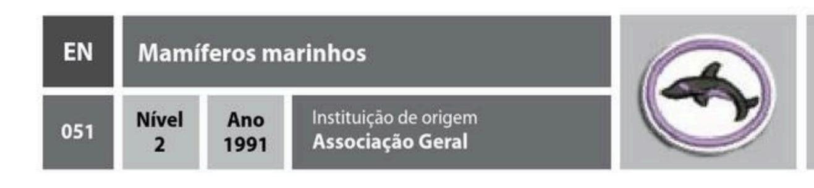

### REQUISITOS

1. Mencionar, pelo menos, 3 ordens de mamíferos marinhos, dando exemplos de cada uma.
2. Citar algumas características que diferenciam os mamíferos marinhos dos demais mamíferos tradicionais que conhecemos.
3. Identificar, através de fotografias ou desenhos, pelo menos, 3 dos seguintes mamíferos marinhos, contendo sua localização (região onde vive) e nome cientifico de cada animal:
    1. Baleia
    2. Golfinho
    3. Foca
    4. Peixe-Boi
4. Qual o maior mamífero do mar? Descrever suas características naturais de acordo com os seguintes termos:
    1. Onde está localizado
    2. Medida e peso
    3. Alimentação
5. Explicar as seguintes expressões:
    1. Salto
    2. Ecolocalização
    3. Cardume
    4. Barbatanas
    5. Harém
    6. Plâncton
6. Desenhar a cadeia alimentar de 2 mamíferos marinhos diferentes de sua escolha.
7. Qual a principal importância da gordura para os cetáceos?
8. Saber 2 motivos pelos quais as focas ainda são caçadas.
9. Explicar porque as focas e golfinhos se movem tão rapidamente na água.
10. Escolher uma das tarefas a seguir:
    1. Visitar um aquário de sua região. Observar e descrever a alimentação diária de um dos mamíferos marinhos existentes naquele local.
    2. Fazer um relatório de, no mínimo, 500 palavras falando de um mamífero marinho de sua escolha.

## Pequenos mamíferos de estimação

### REQUISITOS

1. Ter a especialidade de Mamíferos.
2. Completar uma das seguintes tarefas:
    1. Manter um pequeno mamífero de estimação, pelo menos, durante 6 meses. (Cães e gatos não estão incluídos). Antes da compra do animal, pesquisar o seguinte: país de origem, hábitos alimentares (variedades, frequência, quantidade), necessidade de vacinas, doenças mais comuns (que sofre e que pode transmitir ao homem), preço de mercado, necessidade de espaço, necessidade de atenção diária, clínica veterinária especializada mais próxima e estimativa de tempo de vida. Ao fim do período, fazer um relatório dos cuidados com seu pequeno animal. Incluir tópicos como alimentos favoritos, sua história preferida sobre o animal, alguns de seus hábitos, horários em que é mais ativo, etc.
    Para obter uma lista de sugestões de animais entre os quais escolher, veja o item 3-a desta especialidade.
    2. Se você não possui um pequeno mamífero de estimação, mas já teve um no passado por, pelo menos, 6 meses, cuide do animalzinho de alguém durante, pelo menos, 1 semana. Fazer um relatório dos cuidados com os horários de dar água, comida, limpar a gaiola, etc. Incluir em seu relatório um tópico comparando esse animal emprestado ou que criou no passado em termos de horários de maior atividade, espécie e hábitos gerais.
3. Completar o seguinte:
    1. Ser capaz de distinguir entre os seguintes (grupos) de pequenos animais de estimação:
        1. Hamster
        2. Furão
        3. Gerbo
        4. Porquinho da índia
        5. Chinchila
        6. Esquilo-da-mongólia
        7. Coelho
    2. Descrever os cuidados básicos para 2 dos animais da lista acima e listar as semelhanças e diferenças de cuidado entre eles.
    3. Quais dos animais listados não são roedores?
4. Escrever uma redação de 200 palavras sobre a história e importância de um dos animais listados acima e que características eles têm que os tornam bons animais de estimação.
5. Identificar 5 variedades de hamsters e 5 variedades de coelhos.
6. Por que não é bom tentar transformar pequenos mamíferos encontrados na natureza em animais de estimação?
7. Raiva: o que é? Como é transmitida? Você pode contraí-la a partir de pequenos mamíferos? Que pequenos mamíferos podem transmiti-la? É curável no animal? É curável no homem? Como preveni-la no animal? Como você pode preveni-la?
8. Por que não se deve lidar com pequenos mamíferos quando se está resfriado/ gripado?
9. Encontrar 3 referências bíblicas de animais que agora consideramos pequenos mamíferos de estimação. De acordo com a Bíblia, são considerados de carne limpa ou imunda?

## Cactos - avançado

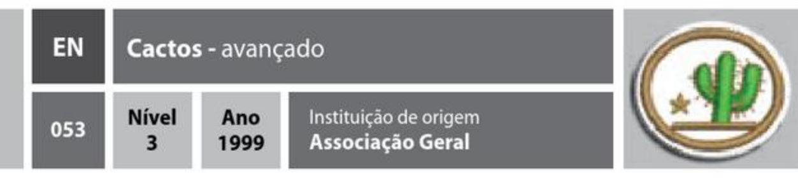

### REQUISITOS

1. Ter a especialidade de Cactos.
2. O que são suculentas?
3. Identifique ao natural ou por fotografia cinco suculentas que não sejam cactos. Como elas se diferenciam dos cactos?
4. Conheça os seguintes termos referentes aos cactos/suculentas:
    1. Aréola ou auréola
    2. Cefálio
    3. Cochonilha
    4. Corimbo
    5. Diurno
    6. Epífita
    7. Estolão ou Estolho
    8. Gloquídeo
    9. Noturno
    10. Panícula
    11. Ramo
    12. Zigomórfica
5. Quando as suculentas (incluindo os cactos) crescem, elas podem ser atacadas por doenças. Quais são as mais comuns e como você pode prevenir ou curar os problemas?
6. Propagar, pelo menos, uma planta usando um dos seguintes métodos:
    1. A partir de sementes
    2. Por estacas
    3. Por enxertia

## Anfíbios - avançado

| EN  | Anfíbios - avançado | Ano  | Instituição de origem |
| --- | ------------------- | ---- | --------------------- |
| 054 | Nível               | 2001 | Associação Geral      |

### REQUISITOS

1. Ter a especialidade de Anfíbios.
2. Como é chamado o estudo dos Anfíbios?
3. Qual a diferença entre animais peçonhentos e animais venenosos? Os anfíbios podem ser classificados em qual desses grupos? Todos os anfíbios possuem toxinas?
4. Elaborar e realizar um projeto de pesquisa simples com base na observação natural ou em cativeiro de um ou mais anfíbios selecionados e escrever um artigo com as conclusões que chegar. Para facilitar a elaboração e realização do projeto, seguir os seguintes pontos:
    1. Definição da(s) espécie(s)
    2. Definição do(s) Parâmetro(s) para observação
    3. Definição do local da observação, metodologia adotada e materiais necessários
    4. Elaboração do cronograma de execução

> Observações: é muito importante que seja realizado um levantamento bibliográfico, tanto para facilitar na elaboração do projeto quanto para ter parâmetros de análise dos resultados. O estudo deve ter um mínimo de 25 horas de observação real e duração máxima total de 6 meses. Danos intencionais e/ou morte do objeto do estudo não serão permitidos. Ao realizar o estudo, ter certeza de estar em conformidade com as leis ambientais de seu Estado e país.

## Felinos - avançado

### REQUISITOS

1. Ter a especialidade de Felinos.
2. Qual o nome científico do gato doméstico?
3. Manter um gato por, pelo menos, 6 meses e fazer uma das seguintes opções:
    1. Se você tem um gato atualmente, mantenha um registro dos cuidados com o seu gato por 1 mês. Incluir em seus registros quando você o hidrata e alimenta e com que frequência e com que suprimentos você cuida da caixa de areia. Por que não se deve permitir que seu gato circule livremente pela vizinhança?
    2. Se você não tem um gato atualmente, mas já teve um no passado por, pelo menos, 6 meses, cuidar do gato de alguém por, pelo menos, 1 semana. Registrar o cuidado que foi necessário e explicar a relação de gatos domésticos com o ambiente e porque é melhor não permitir que se tornem selvagens.
    3. Participar em um projeto de sua escolha relacionado a gatos em prol de uma sociedade humanitária ou organização similar.
4. Quais são as principais doenças dos gatos e quais são facilmente transmissíveis ao homem? Como podemos evitá-las?
5. Em comparação com o cão, o que podemos esperar de um gato, como animal de estimação, com relação ao seu comportamento?
6. Identificar, a partir de fotografias/ilustrações, ou ao natural, 8 raças de gatos domésticos. Descrever o temperamento de cada um.
7. Dar o nome popular de 4 felinos comuns em sua região ou País.
8. Discorrer sobre as principais causas para o declínio mundial da população de felinos. Citar 3 espécies que correm risco de extinção, preferencialmente de sua região, e quais razões os colocam nessa condição.

## Rastreio de animais - avançado

| EN  | Rastreio de animais - avançado | Ano  | Instituição de origem |
| --- | ------------------------------ | ---- | --------------------- |
| 056 | Nível                          | 2001 | Associação Geral      |

### REQUISITOS

1. Ter a especialidade de Rastreio de animais.
2. Qual a diferença entre um molde em alto revelo e baixo relevo de um rastro de animal?
3. Faça, pelo menos, 1 molde em baixo relevo a partir de um em alto relevo ou de um molde de borracha.
4. O que é escatologia e por que isto é importante no estudo de animais?
5. Através de cuidadosa observação e análise, encontre o maior número possível de evidências da passagem de 1 ou mais animais por uma trilha.
6. Com um amigo, criar um percurso com, pelo menos, 2 km e, pelo menos, 4 mudanças de direção usando recursos nativos para fazer os sinais de pista. Esta pista deverá ser seguida por outras 2 pessoas com sucesso. Da mesma forma, você e seu amigo deverão seguir uma pista semelhante feita por outra dupla.

## Répteis - avançado

### REQUISITOS

1. Ter a especialidade de Répteis.
2. Como é chamado o estudo dos Répteis?
3. Descobrir e registrar (ou contar) três contos populares e três fatos relatados sobre répteis.
4. Por que a maioria das pessoas tem medo de répteis e existem tantas histórias falsas envolvendo répteis?
5. Como os répteis se protegem?
6. Quais são os dois principais tipos de veneno de répteis e como eles afetam sua presa ou inimigo?
7. Que aplicações os venenos de répteis possuem?
8. Identificar na natureza pelo menos oito répteis da lista elaborada no requisito 2 do nível básico da especialidade de répteis.
9. Encontrar um réptil na natureza e registrar as observações das suas atividades durante as horas do dia de um ou mais dias.

## Animais ameaçados de extinção

### REQUISITOS

1. Definir os seguintes termos:
    1. Habitat
    2. Bioma
    3. Cadeia alimentar
    4. Caçador ilegal
2. Qual é a lista de espécies ameaçadas mundialmente mais conhecida? Descrever as categorias existentes nesta lista e citar uma espécie para cada categoria com dados.
3. Escrever Gênesis 1:26-28 e Gênesis 2:15 com suas próprias palavras.
4. Listar quatro fatores que fazem os animais se tornarem ameaçados de extinção.
5. Dar o nome de quatro animais que estão extintos agora, preferencialmente espécies de seu estado ou país.
6. Listar quatro coisas que estão sendo feitas para salvar animais ameaçados de extinção em seu país. Caso seu país não esteja fazendo pelo menos quatro coisas para salvar espécies ameaçadas, pesquisar medidas adotadas em países próximos e que poderiam ser adotadas no seu país.
7. Listar quatro atividades que você pode fazer para ajudar animais silvestres.
8. Listar dez espécies de animais ameaçados, sendo no mínimo quatro de seu estado ou país. Dizer onde eles vivem, por que se tornaram ameaçados de extinção e o que você pode fazer para ajudá-los.
9. Fazer duas das seguintes atividades:
    1. Visitar um zoológico que tenha um ou mais animais ameaçados residentes no local. Listar que animais você viu, onde eles vivem normalmente e por que eles se tornaram ameaçados de extinção.
    2. Assistir a um vídeo sobre um animal ameaçado de extinção. Listar qual animal ou quais animais você viu, onde eles normalmente vivem e por que ele se tornou ameaçado de extinção.
    3. Escolher um animal ameaçado de extinção e escrever ou apresentar oralmente um curto relatório sobre o assunto. Dizer onde ele vive normalmente, por que se tornou ameaçado de extinção, o que está sendo feito para salvá-lo e qualquer outro detalhe especial que você aprendeu sobre este animal em particular.
    4. Fazer um álbum de recortes sobre animais ameaçados de extinção. Isso pode incluir artigos de jornais, histórias, fotos, selos ou desenhos. Este pode ser um projeto em grupo.
    5. Fazer uma teia da vida, ou outra dinâmica de grupo sobre ecossistemas.
10. Conhecer as principais leis relacionadas às espécies ameaçadas de extinção em seu país. Essas leis podem ser encontradas na seção de legislação dos sites da Presidência da República e do Ministério do Meio Ambiente.

## Morcegos

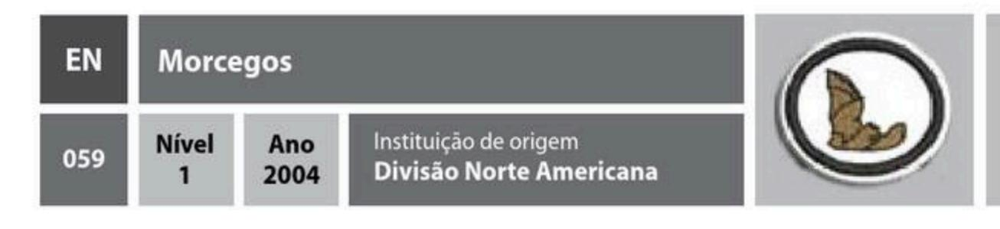

### REQUISITOS

1. Por que os morcegos são classificados como mamíferos e não como aves?
2. Qual é a principal característica que separa os morcegos dos outros mamíferos?
3. Qual o nome da ordem a qual os morcegos pertencem e o que significa?
4. Qual é o sexto sentido dos morcegos e como ele funciona?
5. Quais são o maior e o menor morcego e onde eles vivem?
6. Quantos tipos diferentes de morcego existem no mundo? E no seu país?
7. Os morcegos são divididos em duas subordens. Quais são seus nomes?
8. Qual subordem dos morcegos usa ecolocalização e qual usa a visão para encontrar seu alimento? Qual a dieta comum de cada subordem?
9. Quantos filhotes um morcego tem por ano e qual o período médio de gestação?
10. Encontrar três textos bíblicos que mencionam morcegos. Qual texto usa morcegos em uma profecia do tempo do fim?
11. Os morcegos hibernam ou migram no inverno?
12. Dar o nome das partes de um morcego.
13. Quantos insetos um micro morcego pode comer em uma hora?
14. Quais são os três principais benefícios que os morcegos fornecem para o homem?
15. Saber o que é uma casa (ou caixa) de morcegos e qual a sua importância.

## Morcegos - avançado

### REQUISITOS

1. Ter a especialidade de Morcegos.
2. Como são chamadas as cavernas, sótãos, pontes ou túneis onde os morcegos hibernam?
3. Quais as duas formas de organização social encontradas em morcegos?
4. O que significa "implantação atrasada"?
5. Quanto tempo é o período de gestação de morcegos?
6. O que é guano? Que utilidades o guano possui?
7. Que doença pode ser contraída a partir de grandes quantidades de guano? Como ela pode ser evitada?
8. Qual é o tempo de vida de um morcego?
9. Todos os morcegos têm raiva? Como evitar ser infectado por morcegos?
10. Quão boa é a visão de microchiroptera e megachiroptera?
11. Que tecnologias foram desenvolvidas a partir da ecolocalização dos morcegos?

## Marsupiais

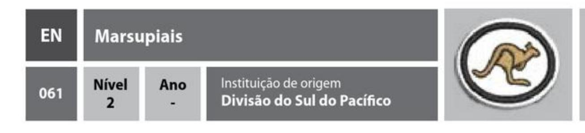

### REQUISITOS

1. Distinguir:
    1. Mamíferos dos outros animais.
    2. Placentários, marsupiais e monotremados uns dos outros.
2. Ser capaz de explicar a diferença entre a reprodução dos monotremados, dos marsupiais e dos mamíferos verdadeiros (ou seja, placentários).
3. Descrever a distribuição, habitat, dieta, comportamento reprodutivo, assim como quaisquer outras informações interessantes de uma espécie de cada uma das sete ordens de marsupiais e das duas de monotremados.
4. Descrever a distribuição, habitat, dieta, comportamento reprodutivo, assim como quaisquer outras informações interessantes de quatro espécies que ocorram em seu país.
5. Dizer porque os marsupiais são considerados tão importantes na Austrália.
6. Fazer um dos seguintes:
    1. Observar um marsupial (ou um grupo de marsupiais) em seu habitat natural. Escrever um relatório, no mínimo 100 palavras, sobre as suas observações.
    2. Visitar um museu de história natural, zoológico, etc. Escrever um relatório, no mínimo 100 palavras, sobre os marsupiais que foram observados.
    3. Falar por pelo menos três minutos para um grupo de pessoas sobre marsupiais ou um marsupial em particular.
    4. Guiar (ou ajudar a guiar) um grupo de juvenis de 10 ou 11 anos em uma visita a um museu ou zoológico onde existam marsupiais.
7. Ser capaz de explicar a necessidade de proteger os marsupiais de seu país.

## Orquídeas - avançado

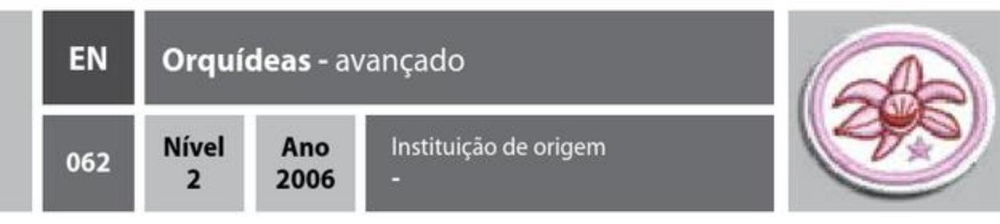

### REQUISITOS

1. Ter a especialidade de Orquídeas.
2. Desenhar ou prensar uma orquídea e identificar o seguinte:
    1. Sépalas
    2. Pétalas
    3. Coluna
    4. Antera
    5. Polínias
    6. Labelo
    7. Estigma
3. Qual a principal diferença entre orquídeas monopodiais e simpodiais?
4. O que são "cultivares"?
5. Como funciona a "reprodução" por meristema? Com que objetivo ela é praticada?
6. O que são Keikis?
7. Listar 3 utilidades das orquídeas para o homem.
8. Conhecer os elementos essenciais ao crescimento de orquídeas?
9. Nomear, pelo menos, 2 espécies de orquídeas que podem crescer nas seguintes condições na região em que vive:
    1. Ao ar livre, em um jardim comum ou uma rocha.
    2. À sombra ou meia luz
    3. Em uma estufa não aquecida
    4. Em uma estufa aquecida
10. Citar alguns fatores que podem contribuir para que uma espécie de orquídea entre em "perigo de extinção".
11. Explicar os requisitos de quarentena exigidos em seu país em relação à importação de orquídeas.
12. Explicar o processo de crescimento de sementes de orquídeas nas condições existentes em um vaso de vidro.
13. Descrever a distribuição mundial das orquídeas e analise como o conhecimento da altura acima do nível do mar, do habitat nativo de uma orquídea é importante para quem a cultiva.
14. Cultivar uma pequena coleção de orquídeas (de, pelo menos, 2 gêneros) até que floresçam (mínimo 4 diferentes orquídeas). Ao final do período, apresentar um histórico fotográfico mensal, acompanhado de anotações sobre o desenvolvimento e cuidados necessários durante cada mês, com a evolução de cada planta.

## Palmeiras

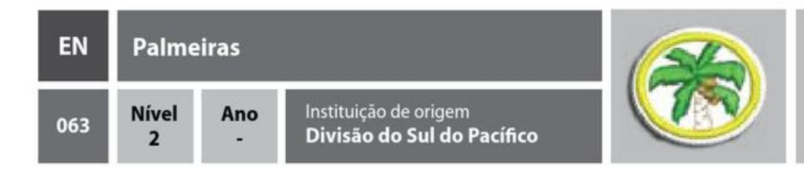

### REQUISITOS

1. Qual o nome da família das Palmeiras?
2. Apresentar as características gerais de uma palmeira, especialmente a respeito das seguintes partes:
    1. Tronco ou caule
    2. Raízes
    3. Folhas
    4. Inflorescência, ou flores
    5. Frutas
3. O que acontece quando a coroa de uma palmeira é cortada?
4. O que acontece quando o tronco da palmeira é danificado?
5. Identificar 5 diferentes tipos de palmeiras que crescem na região em que você vive.
6. Desenhar e dar o nome de 8 palmeiras que você já tenha identificado na natureza, mostrando claramente a formação das folhas, flores e formato das sementes, bem como do fruto.
7. Partes das palmeiras são usadas como alimento, ou para ajudar na preparação de alimentos. Mencionar quais partes da palmeira são comestíveis em sua cultura, e qual o método de prepará-las.

## Solos

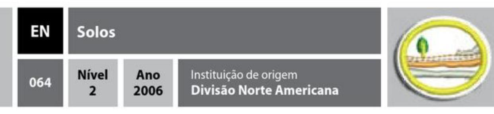

### REQUISITOS

1. Definir o que significa solo.
2. Onde, na Terra, está localizado o solo?
3. Quais são os cinco fatores chave para formação do solo?
4. Definir os seguintes termos:
    1. Horizonte A
    2. Horizonte B
    3. Horizonte C
    4. Camada orgânica
    5. Camada mineral
    6. Argila
    7. Lixiviação
    8. Húmus
    9. Perfil do solo
    10. Material de origem
    11. Pedólogo
5. Definir o termo "Classificação de Solos". Por que os solos são classificados?
6. Discutir três diferenças entre os seguintes tipos de solos:
    1. Deserto
    2. Temperado
    3. Tropical
7. Examine uma seção vertical de 60 cm de solo. Rotular os diferentes tipos de matéria orgânica encontrada, identificar os diferentes horizontes do solo e marcar a transição entre a camada de solo e a camada de minerais.
8. Desenhar, fotografar ou coletar e rotular corretamente cinco diferentes tipos de solo.

## Vermes

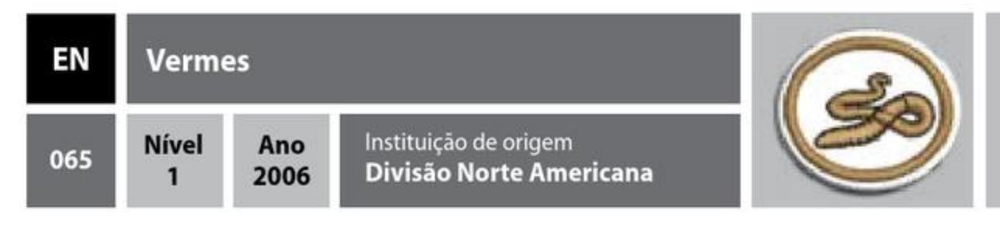

### REQUISITOS

1. O que é um verme?
2. Onde os vermes vivem?
3. O que os vermes comem?
4. Em que reinos os vermes são encontrados?
5. Dar o nome dos três principais filos (segunda maior categoria de classificação) que contêm vermes e descrevê-los.
6. O que significam os termos "vida livre" e "parasita"?
7. Dos filos mencionados no requisito 5, quais são de vida livre e quais são de parasitas?
8. Responder as seguintes perguntas sobre minhocas:
    1. Onde elas vivem?
    2. O que elas comem?
    3. Como elas são benéficas ao ser humano?
    4. Qual o tamanho mínimo e máximo que elas podem ter?
    5. Quantas existem em um m² (metro quadrado) de solo?
    6. Quantas espécies existem?
    7. O que é o clitelo?
9. Encontre uma minhoca e faça o seguinte:
    1. Ser capaz de distinguir as seguintes partes: extremidade anterior, extremidade posterior e clitelo.
    2. Observar e descrever como ele se move.
    3. Quanto tempo leva para o seu verme se mover 30 cm?
    4. Fazer uma corrida com suas minhocas.
10. Responder as seguintes perguntas sobre sanguessugas:
    1. Onde elas vivem?
    2. O que elas comem?
    3. Como elas são prejudiciais ao ser humano?
11. Encontrar um verso na Bíblia onde os vermes são mencionados e contar a história por meio de música, poema ou representação.

## Vermes - avançado

### REQUISITOS

1. Ter a especialidade de Vermes.
2. Descrever as três principais classes de platelmintos.
3. Dar um exemplo de nematóide e descrever seu ciclo de vida.
4. Quais são as três principais classes de anelídeos? Como eles se movem?
5. Responder o seguinte:
    1. Distinguir entre as seguintes estruturas corporais: celomados, pseudocelomados e acelomados.
    2. Que estruturas corporais são comuns em cada um dos três filos de vermes?
6. Demonstrar, pelo menos, três maneiras de purificar a água.
7. Completar o seguinte:
    1. A partir do que você aprendeu sobre os vermes, explicar porque a disponibilidade de água potável é tão importante para a saúde humana, especialmente em países subdesenvolvidos.
    2. Organizar uma angariação de fundos para apoiar alguma organização que trabalhe para fornecer água potável para países subdesenvolvidos.
8. Escrever uma lição espiritual sobre a água viva da Bíblia.

## Quedas d'água

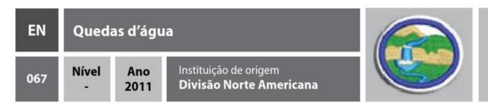

### REQUISITOS

1. Como se formam as quedas d'água?
2. Definir os seguintes tipos de quedas d'água e dar um exemplo de cada:
    1. Catarata
    2. Cascata
    3. Cachoeira
3. Escolher 10 quedas d'água, incluindo 2 próximas à área ou estado em que você vive, e listar as seguintes informações sobre elas:
    1. Nome
    2. Altura total
    3. Tipo de queda d'água
    4. Nome do curso de água
    5. Localização
4. Complete duas das seguintes atividades:
    1. Visitar uma queda d'água e escrever um parágrafo contando sobre sua experiência.
    2. Escolher uma queda d'água do seu interesse, que não tenha sido escolhida no requisito 3, e relatar fatos e informações interessantes sobre a queda que você selecionou.
    3. Assistir a um vídeo sobre uma queda d'água.
    4. Fazer um álbum de recortes sobre quedas d'água. Incluir imagens das quedas d'água e informações importantes sobre cada uma.
    5. Criar um jogo de palavras cruzadas ou caça-palavras sobre 10 quedas d'água.
5. A água é mencionada em cada um dos seguintes versos. Descrever o que aconteceu em cada deles e dizer o que a água simboliza.
    1. João 9:11
    2. João 13:15
    3. Mateus 3:16

## Aquarismo

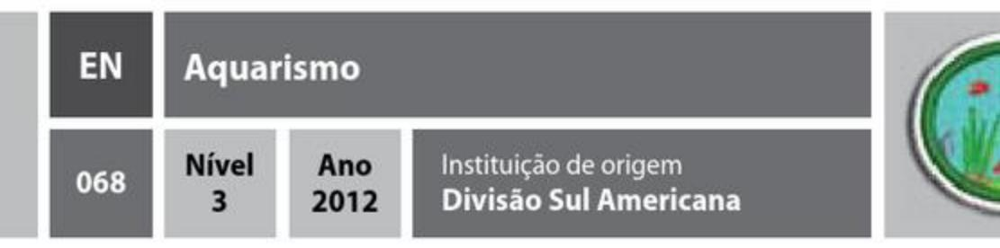

### REQUISITOS

> NOTA: Todos os espécimes utilizados para o cumprimento desta especialidade devem ser adquiridos em concordância com as leis vigentes em seu país.

1. Ter a especialidade de Peixes.
2. O que é aquarismo ou aquariofilia?
3. Apresentar a história do aquarismo, primeiros povos a praticar, desenvolvimento das técnicas, evidências históricas, etc.
4. Explicar o que é, como funciona e qual a utilidade dos seguintes:
    1. Filtro externo
    2. Filtro UV
    3. Ozonizadores
    4. Reator de cálcio
    5. Skimmer
    6. Incentivadores bacterianos ("aceleradores de biologia")
    7. Alimentador automático
5. Citar algumas vantagens e desvantagens de um aquário de água salgada em relação a um de água doce.
6. Identificar, ao vivo ou por foto, 10 peixes ornamentais de água salgada e 15 peixes ornamentais de água doce, comumente utilizados em aquários.
7. Conhecer 10 plantas aquáticas de água doce, comumente utilizadas em aquários. Identificá-las por meio de foto ou ao vivo.
8. Identificar, ao vivo ou por foto, 5 corais utilizados em aquários marinhos.
9. Listar e identificar, ao vivo ou por fotos, 5 animais comuns em aquários marinhos. (Não incluir peixes ou corais na lista).
10. Listar e identificar, ao vivo ou por fotos, 5 animais comuns em aquários de água doce. (Não incluir peixes na lista).
11. Listar 5 diferentes testes de água, explicar a importância de utilizá-los e demonstrar o uso de, ao menos, um deles.
12. Completar as seguintes atividades:
    1. Montar um aquário de, ao menos, 20 litros, com quantidade equilibrada de plantas e peixes e mantê-lo por, no mínimo, 6 meses.
    2. Durante a montagem, observar o seguinte:
        - Demonstrar habilidade em montar e explicar o funcionamento de um sistema de filtragem adequado
        - Explicar a escolha e instalar um sistema de iluminação compatível
        - Escolher o tipo de solo mais indicado para o ambiente desejado
        - Plantas: analisar as espécies que melhor se adequam ao modelo
        - Peixes: explicar sobre as espécies escolhidas, a relação espaço vs. tamanho adulto e quantidade de espécimes; temperatura ideal para o crescimento, temperamento, tipo de ração, reprodução, principais doenças e problemas.
    3. Durante o período de, no mínimo, 3 meses, tomar nota dos efeitos, nos peixes e no aquário em geral, das seguintes condições:
        - Luz demais
        - Luz de menos
        - Alimento demais
        - Mudanças na temperatura da água
        - Poucas plantas para muitos peixes

## Animais peçonhentos

### REQUISITOS

1. O que são animais peçonhentos?
2. Descobrir a quantidade de acidentes causados por animais peçonhentos em seu país ou região no último ano (caso esse dado não esteja disponível, pegar o último ano disponível).
3. Escolher e apresentar as seguintes características de 2 animais peçonhentos:
    1. Habitat
    2. Alimentação
    3. Danos causados aos seres humanos
    4. Forma de prevenção
4. Citar, pelo menos, três animais peçonhentos em cada uma das Classes abaixo:
    1. Répteis
    2. Insetos
    3. Aracnídeos
5. Saber como os animais peçonhentos são importantes para o equilíbrio do ecossistema.
6. Aprender 4 maneiras de se proteger contra animais peçonhentos que são encontrados em casas, empresas ou acampamentos.
7. Os animais peçonhentos geralmente atacam por maldade ou por defesa?
8. Aprender os primeiros socorros que devem ser prestados às vítimas de picadas de animais peçonhentos.
9. O que é soroterapia?
10. Saber para qual picada de animal serve cada tipo de soro abaixo:
    1. Antibotrópico
    2. Anticrotálico
    3. Antibotrópico-laquético
    4. Antilapídico
    5. Antiaracnídico
    6. Antiescorpiônico
    7. Anilonomia
11. Realizar, pelo menos, 1 das atividades abaixo:
    1. Visitar um zoológico ou local de pesquisa em que você possa observar animais peçonhentos e apresentar um relatório.
    2. Com a orientação do seu líder, identificar, no mínimo, 10 animais peçonhentos e apresentar uma relação com: nome científico, nome popular, foto e local de origem.
12. Descobrir, no mínimo, 2 animais peçonhentos citados na Bíblia.

## Animais noturnos

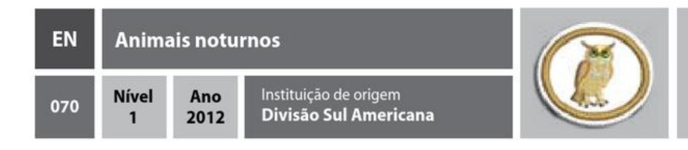

### REQUISITOS

1. O que são animais noturnos?
2. Como os animais noturnos são influenciados pelo clima em que estão inseridos?
3. Escolha e apresente as seguintes características de 2 animais noturnos:
    1. Habitat
    2. Forma de reprodução
    3. Alimentação
    4. Hábitos
4. Citar, pelo menos, 3 animais noturnos das classes abaixo:
    1. Mamíferos
    2. Insetos
    3. Anfíbios
    4. Aves
    5. Répteis
5. Descubra como os sentidos dos animais noturnos são fundamentais para se viver na escuridão.
6. Realize, pelo menos, 1 das atividades abaixo:
    1. Observe por, no mínimo, 2 dias um animal noturno doméstico e fazer um relatório do seu comportamento.
    2. Realizar uma visita noturna em um aquário ou zoológico e apresentar um relatório do seu contato com os animais noturnos.
7. O que são quirópteros e quais seus benefícios e malefícios para o homem.
8. Descubra, pelo menos, 3 animais noturnos citados na Bíblia.

## Animais nocivos

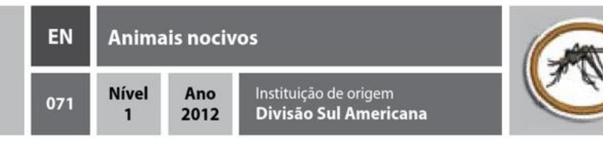

### REQUISITOS

1. O que são animais nocivos?
2. Qual a diferença entre animais nocivos e animais peçonhentos?
3. Saber como alguns animais nocivos podem estar diretamente ligados a alguns tipos de surtos, epidemias e pandemias.
4. Conhecer, no mínimo, 4 tipos de doenças transmitidas por animais nocivos.
5. Como os animais podem prejudicar plantações e a vida de outros animais?
6. Escolher e apresentar as seguintes características de 2 animais nocivos:
    1. Habitat
    2. Forma de reprodução
    3. Alimentação
    4. Doenças ou danos causados aos seres humanos
    5. Forma de prevenção
7. Citar, pelo menos, 3 animais nocivos em cada uma das Classes abaixo:
    1. Mamíferos
    2. Insetos
    3. Répteis
    4. Anfíbios
8. Descobrir como alguns animais nocivos são importantes para o equilíbrio do ecossistema.
9. Aprender 4 maneiras de se proteger contra animais nocivos que são encontrados em casas ou empresas.
10. Realizar, pelo menos, 1 das atividades abaixo:
    1. Visitar um zoológico ou local de pesquisa em que você possa observar animais nocivos e apresentar um relatório.
    2. Com a orientação do seu líder, identificar, no mínimo, 10 animais nocivos e apresentar uma relação com: nome científico, nome popular, foto e local onde foi encontrado.
11. Descobrir 3 animais nocivos citados na Bíblia.

## Arbustos - avançado

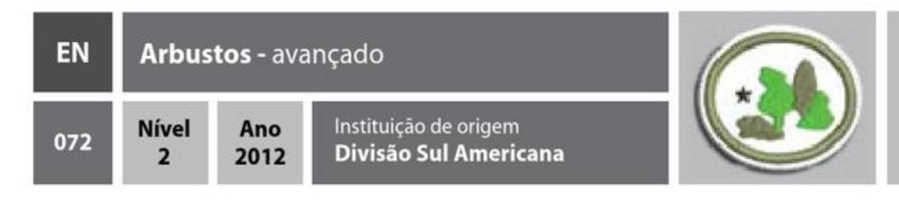

### REQUISITOS

1. Ter a especialidade de Arbustos
2. Saber o que são arbustos ornamentais e descobrir, no mínimo, uma técnica de ornamentação de arbustos.
3. Cuidar de um arbusto por, no mínimo, 1 mês e relatar seus métodos de cuidado.
4. Citar 3 exemplos dos seguintes tipos de arbustos:
    1. Arbustos floridos
    2. Arbustos Frutíferos
5. Observar algum arbusto que esteja florido e relacionar a maior quantidade de insetos possível (pelo menos 3) que venham buscar pólen ou néctar em suas flores.
6. Dar o nome de 3 importantes alimentos silvestres ou cultivados encontrados em arbustos de sua localidade.
7. Relacionar, no mínimo, 60 tipos diferentes de arbustos e reunir, preservar e identificar corretamente as flores, folhas, sementes, vagem de sementes ou ramos com botões de, no mínimo, 20 arbustos citados em sua listagem.

## Araras, papagaios e periquitos

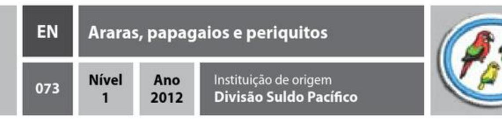

### REQUISITOS

1. As araras, os papagaios e os periquitos pertencem a qual ordem e qual família de aves? Quais são as principais características que diferenciam esta ordem dos outros pássaros.
2. Dar o nome de 15 espécies de araras, papagaios e periquitos comuns em seu país e ser capaz de identificá-los ao ar livre, em cativeiro ou em fotos.
3. Onde as araras, os papagaios e os periquitos constroem seus ninhos?
4. Quais são as características destas aves chamam atenção e os tornam bons animais de estimação? Quais aves deste grupo são as mais criadas em seu país?
5. Quais são as maiores ameaças enfrentadas pelas araras, papagaios e periquitos? Cite quatro espécies que estão ameaçadas de extinção?
6. Escolher uma espécie entre as ameaçadas de extinção e dizer:
    1. Nome popular e nome científico;
    2. Habitat e distribuição geográfica;
    3. Alimentação;
    4. Principais ameaças;
    5. Estratégias de conservação.
7. Escolher uma espécie não ameaçada de extinção e dizer:
    1. Nome popular e nome científico;
    2. Habitat e distribuição geográfica;
    3. Alimentação.
8. Onde é possível adquirir uma arara, um papagaio ou periquito com origem legal? Por que não se recomenda comprar animais que não tenham origem legal?

## Briófitas

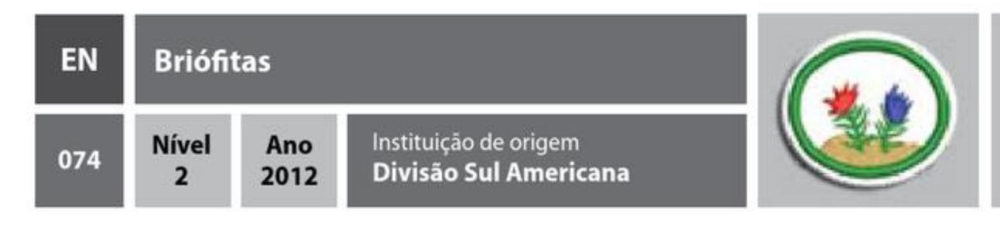

### REQUISITOS

1. O que significa a palavra briófita?
2. Citar 4 características deste grupo de planta.
3. Através de figuras ou ao natural, identificar os rizoides, cauloides e filoides.
4. Pesquisar e esquematizar o ciclo de vida de uma briófita.
5. Por qual motivo as briófitas apresentam grande dependência da água?
6. Em qual tipo de ambiente é comum encontrarmos briófitas?
7. Qual nome popular é usado para identificar o grupo?
8. Como ocorre a absorção de água em briófitas? Qual a relação existente entre o tamanho da planta e a absorção de água?
9. Realizar as atividades a seguir:
    1. Observar, ao natural, pelo menos um tipo de briófita com lupa. Realizar um relatório sobre o observado.
    2. Possuir uma coleção de imagens ou figuras de, pelo menos, 10 tipos diferentes de briófitas.

## Bactérias

### REQUISITOS

1. Quais as principais características de uma bactéria que a colocam num reino separado dos demais seres vivos?
2. Através de desenhos ou figuras, identificar as principais estruturas de uma célula bacteriana.
3. Esquematize as 4 principais formas de bactérias.
4. O que são bactérias gram negativas e gram positivas?
5. Explicar as formas de reprodução das bactérias. Quais as principais condições ambientais para uma bactéria se reproduzir?
6. Como ocorre a alimentação e respiração das bactérias?
7. Cite 3 bactérias que podem trazer prejuízos ao homem. Explique o porquê.
8. Cite 3 bactérias benéficas ao homem. Explique o porquê.
9. Cite 1 história bíblica que apresenta uma doença bacteriana.
10. Cite 5 doenças bacterianas e alguns cuidados que temos que ter para evitá-las.
11. Qual a importância de não se usar antimicrobianos sem prescrição médica?

## Camelos

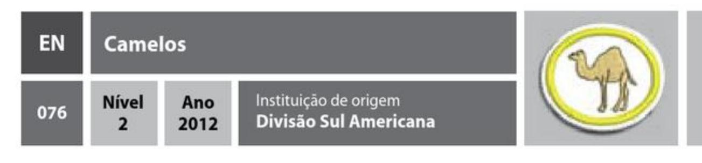

### REQUISITOS

1. Explicar as diferenças entre o dromedário e o camelo-bactriano. Por que ambos são reconhecidos e importantes?
2. Descrever as seguintes características dos camelos:
    1. 3 utilidades que lhe são atribuídas
    2. Quantidade de água que bebem
    3. 3 qualidades de sobrevivência
    4. Procedência
3. Mencionar 3 camelos sul-americanos e analisar o seguinte:
    1. Região onde vivem
    2. Utilidade que lhe é atribuída
    3. Características físicas
    4. Tipo de alimentação
4. Fazer uma pesquisa sobre a predação dos camelos sul-americanos. Por que esses animais estão em risco de extinção?
5. Fazer um estudo do texto de Mateus 19:24 dando ênfase nas palavras de Jesus. Escrever 200 palavras do que você aprendeu com essa lição (usar comentários bíblicos para entender o contexto; é necessário ler todo o capítulo de Mateus 19).
6. Pesquisar 5 textos bíblicos que mencionem os camelos.

## Citologia

### REQUISITOS

1. Quais as 3 partes de uma célula eucarionte? Cite algumas funções delas.
2. O que é uma célula procarionte?
3. Cite 3 diferenças entre uma célula animal e uma célula vegetal.
4. O que são células-tronco? Qual sua importância?
5. Cite 3 funções da membrana plasmática.
6. Explique as seguintes formas de permeabilidade seletiva: osmose e difusão.
7. Explique as seguintes formas de permeabilidade não seletiva: fagocitose e pinocitose.
8. O que é transporte ativo e transporte passivo?
9. Quais as 4 partes de um núcleo celular? Qual a importância de cada um?
10. Cite as funções das seguintes organelas citoplasmáticas:
    1. Mitocôndria
    2. Centríolo
    3. Complexo de Golgi
    4. Reticulo Endoplasmático Rugoso
    5. Reticulo Endoplasmático Liso
    6. Lisossomo
    7. Ribossomo
    8. Peroxissomo
11. Qual a importância dos cílios e flagelos?
12. Identificar, por meio de fotos ou desenhos, 5 diferentes tipos de células (como muscular, óssea, cartilaginosa, adiposa, leucócito, hemácia, neurônio, etc.).

## Crustáceos

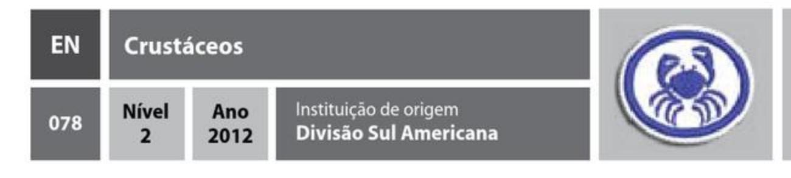

### REQUISITOS

1. Citar, pelo menos, 4 características de um crustáceo.
2. O que é um exoesqueleto?
3. A qual Filo pertence este grupo?
4. Como é dividido o corpo destes animais?
5. Em qual livro da Bíblia, capítulo e versículo encontramos informações para não nos alimentarmos de crustáceos?
6. Como podemos diferenciar um siri de um caranguejo? Em quais ambientes encontramos esses animais?
7. Citar um exemplo de crustáceo terrestre.
8. Como podemos diferenciar entre siris (ou caranguejos) machos e fêmeas? Por que isso é importante?
9. Qual a importância dos microcrustáceos para o ambiente?
10. Realizar 2 dos itens a seguir, apresentado relatório ilustrado:
    1. Dissecar um camarão e indicar suas principais partes.
    2. Em aula prática observar, ao vivo ou fixado, diversos tipos de crustáceos. Esquematizar, pelo menos, 2 deles.
    3. Conseguir diferenciar entre caranguejo e siri e saber diferenciar entre macho e fêmea.
11. Ser capaz de identificar, pessoalmente ou através de imagens, os seguintes animais:
    1. Cracas
    2. Paguro (ermitão)
    3. Tatu de jardim
    4. Lagosta
    5. Camarão
    6. Caranguejo
    7. Siri

## Dinossauros

### REQUISITOS

1. Qual o significado do termo dinossauro? Quem usou este termo pela primeira vez?
2. Quais os indícios de que estas criaturas realmente existiram?
3. Explicar o surgimento e desaparecimento dos dinossauros de acordo com as seguintes teorias:
    1. Evolucionista
    2. Criacionista
4. Quais as evidências que apontam para a morte dos dinossauros através do dilúvio? Identificar e listar trechos da Bíblia que falem sobre a criação de répteis.
5. Explicar porque os répteis marinhos e voadores não são considerados dinossauros. Dar exemplos destas criaturas.
6. De que maneira os dinossauros nasciam? Em que ano e onde isso foi comprovado?
7. Como supostamente seria a pele dos dinossauros?
8. Definir cada um dos grupos de dinossauros abaixo:
    1. Saurópodes
    2. Terópodes
    3. Ceratopsídeos
    4. Anguilosaurídeos
    5. Plesiosaurus
    6. Pterosaurus
9. Fazer um diagrama da suposta cadeia alimentar dos dinossauros. Quem supostamente está no topo? Por que este dinossauro supostamente se encontra lá?
10. O que são sauropodomorfos? Quais os 2 grupos em que se dividem?
11. Quem é considerado o rei dos dinossauros?
12. Escolher um dinossauro e escrever, no mínimo, 150 palavras sobre ele, onde seus fósseis foram achados, que hábitos possuía, como se alimentava e tudo o que puder saber sobre este animal.
13. Fazer uma coleção de 10 imagens de fósseis de dinossauros, identificando:
    1. Nome
    2. Local onde o fóssil foi encontrado
    3. Ano da descoberta
    4. Características gerais

## Equinodermos

| EN  | Equinodermos | Ano  | Instituição de origem |
| --- | ------------ | ---- | --------------------- |
| 080 | Nível 2      | 1956 | Associação Geral      |

### REQUISITOS

1. Em qual ambiente podemos encontrar os equinodermos?
2. O que significa a palavra Echinodermata, nome que caracteriza o Filo dos equinodermos?
3. Citar 4 características pertencentes ao filo Echinodermata.
4. Qual tipo de simetria os equinodermos possuem? O que isso significa?
5. Citar as principais características e exemplos das 5 classes dos equinodermos:
    1. Asteroidea
    2. Echinoidea
    3. Ophiuroidea
    4. Holothuroidea
    5. Crinoidea
6. O que fazer em caso de algum tipo de acidente com ouriços?
7. Em aula prática, identificar, esquematizar e explicar a função das seguintes estruturas:
    1. Em estrelas do mar:
        1. Pódios ou pés ambulacrários
        2. Placa madrepórica
        3. Boca
        4. Ânus
    2. Em ouriços do mar:
        1. Lanterna de Aristóteles
        2. Espinhos
        3. Boca
        4. Endoesqueleto
8. Fazer uma coleção contendo 20 imagens ou figuras de espécies diferentes, contendo na identificação a divisão nas classes corretas.
9. Como as estrelas do mar fazem para se alimentar?
10. Realizar uma pesquisa a respeito dos ouriços do mar e o veneno que algumas espécies possuem.

## Energias renováveis

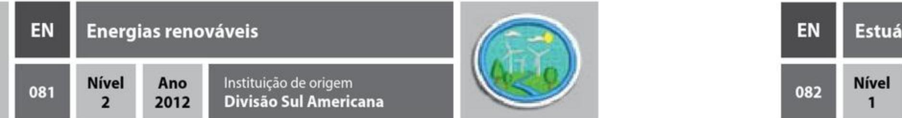

### REQUISITOS

1. O que são energias renováveis? Qual é o seu papel na conservação do meio ambiente?
2. Defina os seguintes tipos de energia, citando as vantagens e desvantagens para cada um deles:
    1. Energia solar
    2. Energia eólica
    3. Hidrogênio
    4. Biocombustíveis
    5. Energia hidráulica
    6. Energia maremotriz
    7. Energia azul
    8. Energia geotérmica
3. O que é energia não renovável? Como esse tipo de energia pode prejudicar o meio ambiente?
4. Qual o papel da energia solar na obtenção de outros tipos de energia?
5. Para algumas energias renováveis a localização da usina é um fator de grande influência no rendimento. Como essa localização pode influenciar no rendimento?
6. Que impactos sociais e ambientais podem ser causados pela implementação de usinas de algumas energias renováveis?
7. Escolha uma usina de uma energia renovável que esteja em atividade e faça um relatório contendo o seguinte:
    1. Nome e localização
    2. Capacidade de geração de energia
    3. Tipo de energia
    4. Vantagens e desvantagens do tipo de energia
    5. Impacto ambiental e social da implementação
8. Pesquise e pratique, pelo menos, 3 formas de economizar energia em seu lar, escola ou trabalho.
9. Segundo Apocalipse 11:18, qual é o futuro dos que destroem a terra?

## Estuário

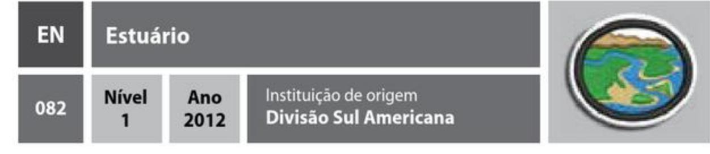

### REQUISITOS

1. O que é um estuário?
2. Listar 3 tipos de estuário e dar um exemplo pra cada tipo.
3. Como é definido o comprimento de um estuário?
4. Que fatores tornam o estuário um dos biomas mais vulneráveis do mundo?
5. Explicar as razões da grande produtividade e diversidade ecológica nos estuários.
6. Qual a importância dos estuários para o equilíbrio do ecossistema?
7. Citar, ao menos, um processo de formação de estuário.
8. Conhecer, no mínimo, 3 benefícios dos estuários aos homens.
9. Em estuários existe a presença de água doce e salgada. Qual o nome dado aos peixes que têm a capacidade de sobreviver nesses dois ambientes? Citar 5 exemplos.
10. Listar 3 pássaros e 1 mamífero comuns nos estuários de sua região ou país.
11. Citar, ao menos, 2 fatores que tornam a vegetação de mangue indicada e presente nos estuários tropicais.
12. Listar, ao menos, 3 gêneros de manque comuns em estuários tropicais.
13. Citar 5 atividades recreativas que podem ser realizadas em regiões estuarias, sem lhes causar dano ou prejuízo.
14. Qual o estuário mais próximo de sua cidade?
15. Completar uma das seguintes atividades:
    1. Fazer uma visita a um estuário. Durante a visita, observar sinais de conservação ou de degradação desse ambiente. Em conjunto com o grupo, sob a orientação de seu líder, organizar um projeto de preservação desse estuário e colocar o projeto em prática.
    2. Ler um livro, ou assistir a um vídeo sobre estuários. Realizar uma pesquisa e escrever um relatório sobre 15 diferentes estuários ao redor do mundo. Nessa pesquisa devem constar: nome do estuário, localização, estado de conservação atual e possíveis motivos para esse estado, fotos, etc. Citar as fontes de pesquisa.

## Fauna marinha

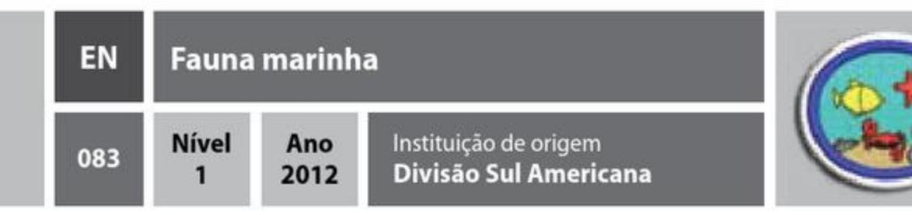

### REQUISITOS

1. Pesquisar e descrever a importância da fauna marinha para o equilíbrio do ecossistema marinho.
2. Qual é o efeito da grande concentração de plástico na fauna marinha?
3. Descubra como você pode ajudar na preservação da vida nos mares.
4. Defina as principais características dos grupos abaixo e dê 3 exemplos de cada um deles:
    1. Crustáceos
    2. Celenterado
    3. Moluscos
    4. Cetáceos
    5. Equinodermos
    6. Peixes
5. Selecione 3 espécies de invertebrados e 3 de vertebrados da fauna marinha e responda:
    1. Nome popular
    2. Nome científico
    3. Espécie
    4. Localização
    5. Tipos de alimentos
    6. Papel na fauna marinha
6. Entreviste um biólogo e descubra qual é o tipo de reprodução dos grupos de animais citados na questão anterior.
7. O que são poríferos e por que são chamados de animais filtradores?
8. Cite a diferença entre corais e esponjas do mar. Qual a importância deles para o meio ambiente?
9. Explique o que são bentos, plâncton e nécton.
10. Observar um animal marinho por cerca de 30 minutos. Fazer um relatório descrevendo o que observou.
11. Assistir a um vídeo de, pelo menos, 30 minutos que fale a respeito da vida marinha. Fazer um relatório sobre o vídeo.

## Fisiologia vegetal

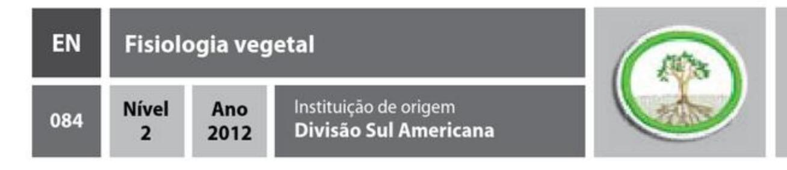

### REQUISITOS

1. Quais características classificam um ser vivo como sendo um vegetal (Reino Metaphyta)?
2. Cite os 4 grandes grupos de plantas e suas características distintivas. Quais são consideradas mais simples e quais são mais completas?
3. Citar as funções das partes da planta:
    1. Raiz
    2. Caule
    3. Folha
    4. Fruto
    5. Flor
4. O que é fotossíntese e qual o seu objetivo? Quais seres vivos são capazes de fazer fotossíntese? Qual a fórmula química da fotossíntese?
5. O que é xilema e floema? Qual sua função?
6. Citar 5 hormônios vegetais e suas funções.
7. Como ocorre a transpiração nas plantas? Qual a sua importância para o seu desenvolvimento?
8. Falar sobre o gineceu e o androceu, citando suas partes e funções.
9. Cite, pelo menos, 1 história bíblica que compara uma planta com a vida espiritual. Explique.

## Formigas

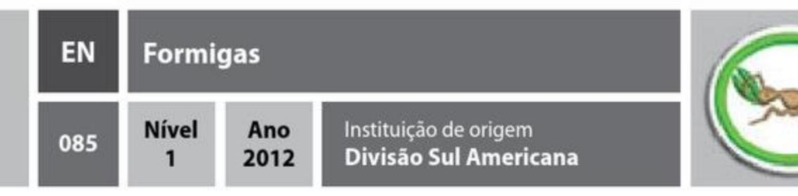

### REQUISITOS

1. As formigas pertencem a qual ordem e família? Descobrir a quantidade de espécies catalogadas em seu país.
2. Conhecer o ciclo de vida de uma formiga.
3. Conhecer a anatomia interna e externa de uma formiga e apresentar a seu líder.
4. Descobrir espécies de formigas que não vivem em formigueiros. Relacionar:
    1. Habitat ou sociedade
    2. Forma de reprodução
    3. Alimentação
5. Descobrir, no mínimo, 3 características que diferenciam as formigas dos demais insetos.
6. Saber, no mínimo, 2 benefícios e 2 malefícios que as formigas causam ao ser humano.
7. Qual a principal forma de comunicação entre as formigas?
8. Conhecer, no mínimo, 10 espécies de formigas que vivem em seu país. Relacionar:
    1. Habitat ou sociedade
    2. Forma de reprodução
    3. Alimentação
9. Com seu grupo ou individualmente, realizar um dos seguintes:
    1. Construir uma fazenda de formigas. Saber os passos para construir e manter esta fazenda.
    2. Observar, diariamente, um formigueiro por uma semana e descobrir seu funcionamento e rotina.
10. Apresentar, em formato de encenação, relatório, música ou poema o significado de Provérbios 6:6-11.

## Liquens

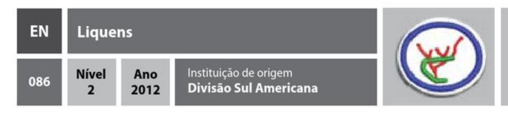

### REQUISITOS

1. O que são liquens? Eles se encaixam em algum dos reinos de seres vivos que conhecemos? Por quê?
2. Conhecer o ciclo de vida de um líquen.
3. Encontrar, identificar e fotografar liquens fruticosos, crostosos e folhosos.
4. Qual a utilidade dos liquens na natureza?
5. O que determina a coloração de um líquen?
6. Qual a relação entre os organismos que constituem um líquen?
7. Quais são os principais grupos de fungos que se associam com algas?
8. Explique o que é simbiose e mutualismo.
9. Cite, pelo menos, 2 benefícios dos liquens para o homem e para o ambiente.
10. Qual a relação entre a espécie de líquen Lecanora esculeta e o Maná?

## Odonata

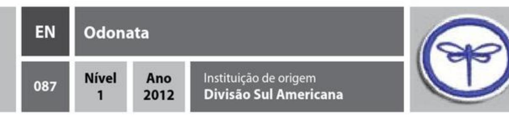

### REQUISITOS

1. Quais as principais diferenças entre libélulas (Anizoptera) e donzelinhas (Zygoptera)?
2. Aproximadamente quantas espécies de libélulas existem no mundo?
3. Citar 5 nomes pelos quais as libélulas são conhecidas em diferentes partes de seu país.
4. Desenhar o ciclo de vida de uma libélula e indicar onde ela vive em cada fase.
5. Descrever as 5 partes principais da anatomia das libélulas.
6. Qual o tempo médio de vida das libélulas, no estado larval e na fase adulta?
7. Por que as libélulas são consideradas excelentes bioindicadores?
8. Citar 5 diferentes presas naturais das libélulas. Aproximadamente que porcentagem de seu peso ela chega a comer diariamente?
9. Citar 5 predadores naturais das libélulas.
10. Descrever os olhos das libélulas e sua funcionalidade.
11. Quantas vezes por segundo uma libélula pode bater suas asas?
12. Em média, por quantas horas diárias uma libélula pode voar?
13. Qual a velocidade máxima estimada do voo das libélulas?
14. Listar 3 utilidades das libélulas, para o homem.

## Plantas carnívoras

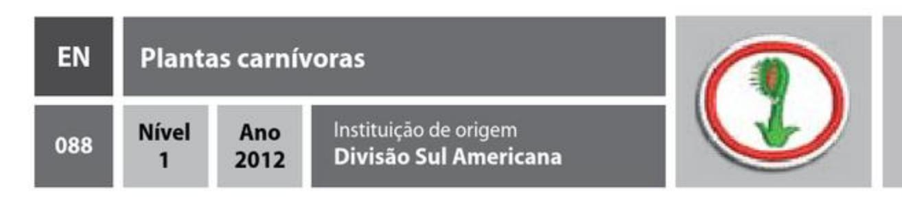

### REQUISITOS

1. Quais são as características de uma planta carnívora que as diferem das plantas normais?
2. Quais são os cuidados especiais que devem ser tomados no manuseio e conservação das plantas carnívoras?
3. Realizar uma pesquisa e estabelecer a relação existente entre: as flores das plantas carnívoras, o processo de polinização e os insetos que elas se alimentam.
4. Descrever as características das 4 principais famílias de plantas carnívoras abaixo, descrevendo sobre suas espécies, nomes de alguns exemplares, locais originários e características que as definem:
    1. Nepenthaceae
    2. Sarraceniaceae
    3. Droseraceae
    4. Lentibulariaceae
5. Um mecanismo interessante é como elas utilizam as armadilhas para capturar suas presas. Descrever cada uma delas, identificando as espécies citadas no item anterior:
    1. Armadilhas tipo "jaula"
    2. Armadilhas de sucção
    3. Folhas colantes
    4. Ascídios
    5. Outras formas
6. Como é o processo de "digestão" dessas plantas e como ela obtém, dos insetos, os nutrientes necessários.
7. Fazer um dos seguintes itens:
    1. Ter uma coleção devidamente catalogada de, no mínimo, 3 espécies (naturais) diferentes, mencionando para cada uma delas nome popular, nome científico, família e outros detalhes sobre a espécie.
    2. Montar um álbum com fotos de, no mínimo, 15 espécies diferentes, mencionando para cada uma delas nome popular, nome científico, família e outros detalhes sobre a espécie. Elas podem estar catalogadas em formato digital (apresentação de slides) ou em cópia física (impressa).
    3. Cultivar uma planta carnívora de qualquer espécie por, no mínimo, 3 meses e fazer um relatório indicando quais são os cuidados diários.

## Preservação de recursos hídricos

### REQUISITOS
<!-- markdownlint-capture -->
<!-- markdownlint-disable MD029 -->
1. O que são recursos hídricos?
2. Descobrir, no mínimo, 10 atividades em que o uso da água é essencial.
3. Saber como funciona o abastecimento público de água em sua cidade.
4. O que é energia hidroelétrica?
5. Citar, no mínimo, 5 fatores que provocam desperdício de água e como poderiam ser evitados.
6. Saber como os seguintes fatores influenciam diretamente no desperdício de água potável:
    1. Desmatamento
    2. Poluição
    3. Ocupação e uso desordenado de solo
    4. Falta de saneamento básico
7. Pesquisar e descobrir a média de consumo de água em seu país nas seguintes atividades:
    > **Doméstico**
    1. Banho
    2. Escovação dentária
    3. Descarga sanitária
    4. Lavar roupa
    5. Torneira gotejando
    > **Indústria**
    6. 1 kg de carne bovina
    7. 1 Kg de queijo
    8. 1 litro de leite
    9. 1 Kg de tomate
    10. 1 computador
8. Saber o que é hidrologia e descobrir como seu estudo é fundamental para a preservação dos recursos hídricos.
9. Conhecer, pelo menos, 3 maneiras de purificação de água.
10. Descobrir, pelo menos, 10 maneiras que você e sua família podem preservar os recursos hídricos disponíveis e colocá-los em prática.
11. Desenvolver um projeto criativo de conscientização sobre o uso inadequado da água em sua escola ou local de trabalho.
12. Fazer, pelo menos, um dos itens abaixo:
    1. Criar um projeto com sua unidade/Clube de preservação de alguma fonte de água potável em seu bairro.
    2. Ter a especialidade de Conservação ambiental ou Energias renováveis
<!-- markdownlint-restore -->

## Poríferos e cnidários

### REQUISITOS

1. Por que as esponjas são consideradas animais?
2. Por que são consideradas filtradores?
3. Citar, pelo menos, 2 características das esponjas.
4. O que significa o nome Cnidário? Quais animais fazem parte deste grupo?
5. O que são Ctenóforos? O que eles apresentam de diferente dos Cnidários?
6. Quais cuidados devemos tomar ao encontrarmos uma água-viva (medusa)?
7. Em qual ambiente vivem as esponjas? E os cnidários?
8. O que podemos fazer se formos queimados por uma a água-viva?
9. Esquematizar uma água-viva indicando suas principais partes.
10. Qual a importância dos recifes de corais?
11. Qual o maior recife de coral do mundo?

## Protozoários

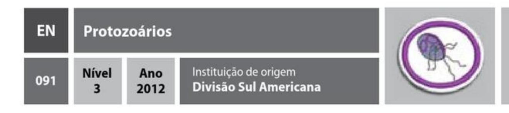

### REQUISITOS

1. Quais as principais características dos protozoários que os colocam no reino protista? Quais as semelhanças e diferenças que eles têm em relação aos demais protistas (algas)?
2. Ser capaz de identificar, por meio de desenho ou figura, 5 protozoários comuns, dando o seu nome científico.
3. Dê a classificação dos protozoários, dizendo suas características distintivas e, pelo menos, um exemplo em cada grupo e sua importância.
4. O que são pseudópodes? Qual sua função?
5. Como ocorre a reprodução dos protozoários? Como eles podem alterar suas características genéticas e tornarem-se mais resistentes a agressores?
6. Como ocorre a alimentação e respiração dos protozoários?
7. A amebíase e a giardíase são doenças gastrointestinais causadas por protozoários que são muito semelhantes. Cite 3 diferenças que as distinguem e como nós podemos preveni-las.
8. Falar sobre a leishmaniose e como os cães estão relacionados com a propagação dessa doença protozoária.
9. A malária é uma doença que causa muitas mortes na região amazônica e na África. Descreva qual sua forma de contágio, quais os seus principais sintomas e como podemos nos prevenir e tratar essa doença.
10. Desenhe o ciclo da Doença de Chagas, explicando cada fase. O que ela causa no ser humano? Como é transmitida? Como podemos preveni-la? Há tratamento?

## Reciclagem e sustentabilidade

### REQUISITOS

1. Definir a palavra Reciclagem.
2. Qual o significado dos 5RS da Educação Ambiental.
3. Quais as cores usadas para separar o lixo para reciclagem? E quais lixos são separados de acordo com a cor?
4. Fazer um relatório de no mínimo de 200 palavras e no máximo 500, sobre por que é importante reciclar o lixo no contexto social e ambiental nos dias atuais?
5. Elaborar e demonstrar em forma de cartaz ou multimídia, uma tabela contendo os resíduos naturais e artificiais com o tempo de decomposição de cada um.
6. Pesquisar e apresentar em forma de desenho, escrito ou multimídia uma estimativa de futuro, na qual apresente quais os impactos ambientais que o lixo irá causar ao homem e ao meio ambiente caso haja uma atitude imediata sobre a reciclagem do lixo.
7. Pesquisar em seu município, quais são as medidas públicas que estão sendo adotadas para o trabalho de coleta seletiva da cidade. Apresentar um relatório.
8. Definir os seguintes termos:
    1. Sustentabilidade
    2. Impacto Ambiental
    3. Preservação
    4. Biodegradáveis
9. Citar e apresentar de forma oral, algum texto bíblico que mencione a importância do cristão se conscientizar sobre a conservação, orientação, preservação e sensibilização no meio ambiente.
10. Item prático:
    1. Criar e apresentar dois brinquedos feitos com material reciclado e dois utensílios de casa.
    > Obs.: Procurar fazê-los dando o melhor acabamento possível.

## Reciclagem e sustentabilidade - avançado

| EN  | Reciclagem e sustentabilidade - avançado | Ano  | Instituição de origem |
| --- | ---------------------------------------- | ---- | --------------------- |
| 093 | Nível                                    | 2012 | Divisão Sul Americana |

### REQUISITOS

1. Como funciona a coleta seletiva de resíduo sólido nos locais abaixo:
    1. Residências
    2. Empresas
2. Como a reciclagem influencia no contexto social se transformando em renda alternativa para diversas famílias?
3. Visite uma cooperativa de tratamento de resíduo sólido e descubra quais os métodos utilizados para reaproveitar os materiais.
4. Descubra como funciona a estrutura de um aterro sanitário. Cite os principais benefícios e malefícios.
5. Faça, no mínimo, 2 brinquedos utilizando materiais recicláveis. Esses brinquedos devem ser enviados a crianças carentes.
6. Restaure um objeto que iria ser jogado fora em algo útil para seu lar.
7. Desenvolva uma técnica para reciclar restos de madeiras, cordas ou bambus de forma efetiva após acampamentos.
8. Produza um vídeo ou encenação apresentando, no mínimo, 5 dicas de como melhorar o planeta usando a reciclagem.
9. Em localidades onde há um sistema de coleta seletiva são usadas lixeiras em cores diferenciadas. Mencione que tipo de material é identificado por cada cor:
    1. Azul
    2. Vermelho
    3. Amarelo
    4. Marrom
    5. Verde
10. Como deve ser o descarte de pilhas e lâmpadas fluorescentes? Onde se encontra o posto de coleta mais próximo em sua cidade?

## Tubarões

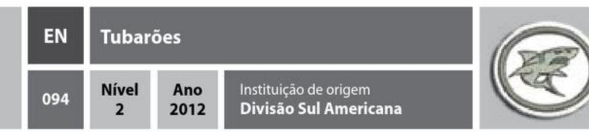

### REQUISITOS

1. Quais as principais diferenças entre peixes ósseos e cartilaginosos?
2. Fale sobre a dentição dos tubarões e a diversidade de alimentos que consomem.
3. Explique como ocorre a respiração dos tubarões.
4. Cite 2 exemplos de peixes cartilaginosos que não sejam tubarões.
5. Saber identificar, por meio de figuras, 5 espécies de tubarões.
6. Qual a importância da Ampola de Lorenzini?
7. Qual o menor e qual o maior tubarão que existem?
8. Identificar as principais estruturas morfológicas de um tubarão através de um esquema (que pode ser confeccionado pelo próprio desbravador ou pelo instrutor).
9. Visitar um aquário, observar peixes cartilaginosos e fazer um relatório sobre o que você aprendeu.

## Vírus

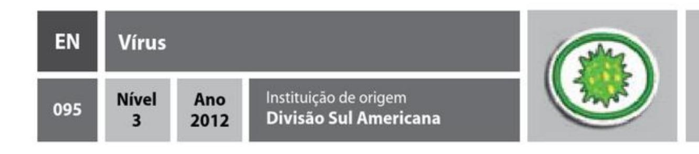

### REQUISITOS

1. O que significa a palavra vírus? Explique porque há uma controvérsia se ele é um ser vivo ou não.
2. Cite as características distintivas dos vírus e porque eles não são incluídos em nenhum reino.
3. Cite algumas formas morfológicas de vírus e um exemplo de cada.
4. Explique a importância das vacinas no combate aos vírus. Como elas funcionam?
5. Descreva as formas de reprodução viral e como pode ocorrer a diferenciação genética que promove as mutações e resistência viral.
6. Alguma doença viral já foi erradicada? Por que é tão difícil o tratamento de doenças virais?
7. Diferencie as seguintes doenças exantemáticas:
    1. Rubéola
    2. Sarampo
    3. Catapora (Varicela)
8. Escolha três das doencas virais abaixo e descreva a forma de contágio, sintomas e prevenção:
    1. Raiva
    2. Herpes
    3. AIDS
    4. Caxumba
    5. Poliomielite
    6. Meningite
    7. Hepatite
    8. Dengue
9. Diferencie gripe e resfriado. Porque o vírus Influenza causa epidemias periódicas (como a gripe espanhola, gripe aviária, gripe A, etc.).
10. Qual a diferença entre vírus e príon? Cite uma doença causada por um príon.
11. Faça um breve relatório sobre uma pandemia viral e o impacto que causou ao mundo.
