# Mestrados

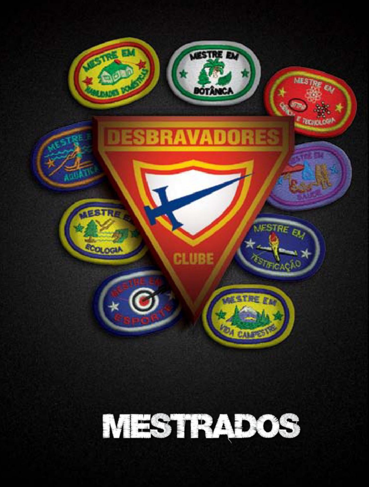

| Especialidade                                                                       | Ano  | Código | Número |
| ----------------------------------------------------------------------------------- | ---- | ------ | ------ |
| [Mestrado em ADRA](#mestrado-em-adra)                                               | 2012 | ME     | 001    |
| [Mestrado em artes e habilidades manuais](#mestrado-em-artes-e-habilidades-manuais) | 1976 | ME     | 002    |
| [Mestrado em atividades agrícolas](#mestrado-em-atividades-agrícolas)               | 1976 | ME     | 003    |
| [Mestrado em testificação](#mestrado-em-testificação)                               | 1976 | ME     | 004    |
| [Mestrado em atividades profissionais](#mestrado-em-atividades-profissionais)       | 1976 | ME     | 005    |
| [Mestrado em ciência e tecnologia](#mestrado-em-ciência-e-tecnologia)               | 2012 | ME     | 006    |
| [Mestrado em aquática](#mestrado-em-aquática)                                       | 1976 | ME     | 007    |
| [Mestrado em esportes](#mestrado-em-esportes)                                       | 1976 | ME     | 008    |
| [Mestrado em vida campestre](#mestrado-em-vida-campestre)                           | 1976 | ME     | 009    |
| [Mestrado em atividades recreativas](#mestrado-em-atividades-recreativas)           | 1986 | ME     | 010    |
| [Mestrado em saúde](#mestrado-em-saúde)                                             | 1997 | ME     | 011    |
| [Mestrado em zoologia](#mestrado-em-zoologia)                                       | -    | ME     | 012    |
| [Mestrado em ecologia](#mestrado-em-ecologia)                                       | 1976 | ME     | 013    |
| [Mestrado em botânica](#mestrado-em-botânica)                                       | 2012 | ME     | 014    |
| [Mestrado em habilidades domésticas](#mestrado-em-habilidades-domésticas)           | 1976 | ME     | 015    |

## Mestrado em ADRA

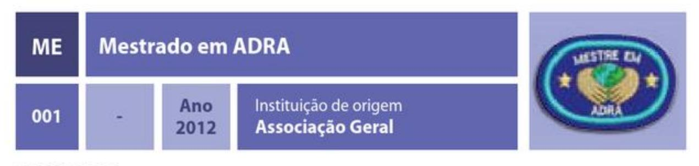

### REQUISITOS

1. Ter seis especialidades em ADRA (AD) e 1 das seguintes: Etnologia missionária (AM 004), Herança cultural (HM 029), Estudo de línguas (AM 007), Temperança (AM013) e Testemunho juvenil (AM 010).

## Mestrado em artes e habilidades manuais

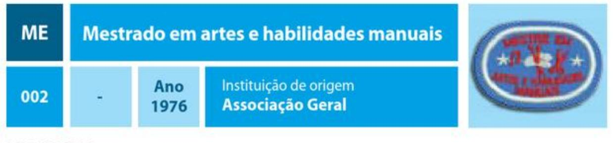

### REQUISITOS

1. Ter sete especialidades em Artes e habilidades manuais (HM).

## Mestrado em atividades agrícolas

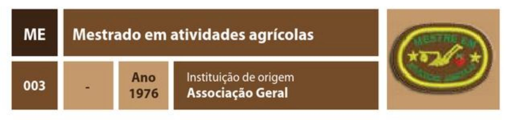

### REQUISITOS

1. Ter sete especialidades em Atividades agrícolas e afins (AA).

## Mestrado em testificação

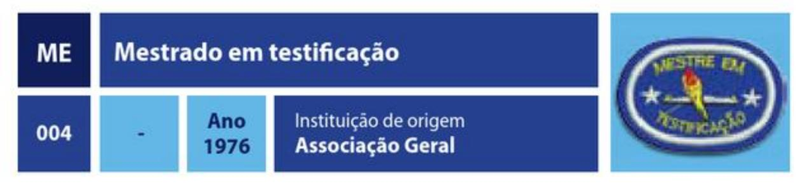

### REQUISITOS

1. Ter sete das seguintes especialidades: Arte de contar histórias cristãs (AM 001), Arte em fantoches (AM 002), Arte em fantoches - avançado (AM 003), Etnologia missionária
(AM 004), Colportagem (AM 005), Cidadania cristã (AM 006), Evangelismo pessoal (AM 008), Liderança juvenil (AM 009), Testemunho juvenil (AM 010), Asseio e cortesia cristã (AM 011), Vida familiar (AM 012), Temperança (AM 013), Língua de sinais (AM 014), Mordomia (AM 015), Aventuras com Cristo (AM 016), Aventuras com Cristo avançado (AM 017), Língua de sinais - avançado (AM 018), Marcação bíblica (AM 019), Marcação bíblica – avançado (AM 020), Pregador evangelista (AM 021), Pregador evangelista – avançado (AM 022), Santuário (AM 023), Dramatização cristã (AM 024), Adoração cristã (AM 029), Arte da pregação cristã (AM 030), Arte da pregação cristã avançado (AM 031), Arqueologia bíblica (AM 032), Braile (AM 034), Criacionismo (AM 035), Criacionismo – avançado (AM 036), Espírito de profecia (AM 037), Escatologia (AM 038), Historiador eclesiástico (AM 039), Evangelismo web (AM 040), Evangelismo web avançado (AM 041), Intercessor (AM 042) e Pioneiros adventistas (AM 043).

## Mestrado em atividades profissionais

| ME  | Mestrado em atividades profissionais |             |                                           |     |
| --- | ------------------------------------ | ----------- | ----------------------------------------- | --- |
| 005 |                                      | Ano 1976 | Instituição de origem Associação Geral |     |

### REQUISITOS

1. Ter sete das seguintes especialidades: Conserto de sapatos (AP 001), Fotografia (AP 002), Mecânica automotiva (AP 003), Radioamadorismo (AP 004), Datilografia (AP 005), Eletricidade (AP 006), Carpintaria (AP 007), Corte e costura (AP 008), Taquigrafia (AP 009), Tipografia (AP 010), Marcenaria (AP 011), Encadernação (AP 012), Alvenaria (AP 013), Barbearia (AP 014), Colocação de papel de parede (AP 015), Contabilidade (AP 016), Evangelismo (AP 017), Hidráulica (AP 018), Jornalismo (AP 019), Ofício de alfaiate (AP 020), Pintura de paredes exteriores (AP 021), Pintura de paredes interiores (AP 022), Radioeletrônica (AP 023), Magistério (AP 024), Corte e costura – avançado (AP 025), Radioamadorismo – avançado (AP 026), Mecânica automotiva – avançado (AP 027), Mecânica de pequenos motores (AP 028), Cães – cuidado e treinamento (AP 029), Soldagem (AP 031), Vendas (AP 033), Produção de vídeo (AP 032), Silvicultura (AP 036), Administração (AP 037), Bandeiras náuticas (AP 038), Biblioteconomia (AP 040), Código semafórico (AP 046), Código Morse (AP 047), Cuidados e manutenção de violões (AP 048), Eletrônica (AP 050), Intérprete de língua de sinais (AP 051), Manutenção de bicicletas (AP 053), Marketing (AP 054), Marketing - avancado (AP 055), Modelagem têxtil (AP 056), Noções de economia (AP 058), Operação e manutenção de impressoras (AP 059), Restauro e conservação documental (AP 060), Secretariado (AP 061) e Torno mecânico (AP 062).

## Mestrado em ciência e tecnologia

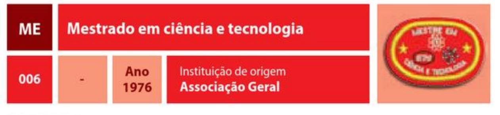

### REQUISITOS

1. Ter sete das seguintes especialidades: Química (CS 002), Óptica (CS 007), Física (CS 013), Bioquímica (CS 021), Bioquímica – avançado (CS 022), Internet (AP 034), Internet – avançado (AP 035), Computação I – básico (AP 041), Computação II – médio (AP 042), Computação III - regular (AP 043), Computação IV - avançado (AP 044), Computação V – especialista (AP 045), Desenvolvimento de software (AP 049), e Informática programável (AP 052).

## Mestrado em aquática

| ME  | Mestrado em aquática |             |                                           |     |
| --- | -------------------- | ----------- | ----------------------------------------- | --- |
| 007 |                      | Ano 1976 | Instituição de origem Associação Geral |     |

### REQUISITOS

1. Ter sete das seguintes especialidades: Natação intermediário I (AR 005), Salvamento de afogados (AR 008), Caiaque (AR 015), Canoagem (AR 016), Navegação (AR 018), Vela (AR 019), Remo (AR 023), Esqui aquático (AR 026), Esqui aquático – avançado (AR 027), Mergulho livre (AR 028), Salvamento de afogados – avançado (AR 029), Saltos ornamentais (AR 030), Mergulho autônomo (AR 031), Mergulho autônomo – avançado (AR 032), Barco a motor (AR 039), Wakeboard (AR 079), Windsurf (AR 061) e Rafting (AR 105).

## Mestrado em esportes

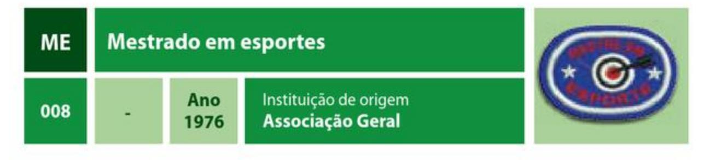

### REQUISITOS

1. Ter sete das seguintes especialidades: Cultura física (AR 002), Ciclismo (AR 008), Esqui downhill (AR 013), Arco e flecha (AR 014), Equitação (AR 025), Saltos ornamentais (AR 030), Escalada (AR 034), Escalada - avançado (AR 035), Exploração de cavernas (AR 037), Exploração de cavernas - avançado (AR 038), Arco e flecha - avançado (AR 041), Ciclismo - avançado (AR 042), Ginástica acrobática (AR 043), Ginástica acrobática avancado (AR 044), Atletismo (AR 049), Esqui cross country (AR 054), Skate (AR 060), Mountain biking (AR 063), Futebol (AR 065), Equitação – avançado (AR 066), Rapel (AR 072), Rapel – avançado (AR 073), Rapel – instrutor (AR 074), Triathlon (AR 075), Triathlon - avançado (AR 076), Softbol (AR 080), Boliche (AR 091), Esportes adaptados (AR 094), Futsal (AR 097), Handebol (AR 098), Patins (AR 103), Tênis de mesa (AR 107), Vôlei (AR 108) e Waveboarding (AR 109).

## Mestrado em vida campestre

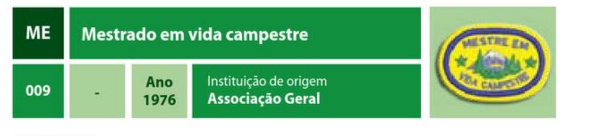

### REQUISITOS

1. Ter sete das seguintes especialidades: Arte de acampar (AR 001), Excursionismo pedestre (AR 010), Excursionismo pedestre – avançado (AR 012), Fogueiras e cozinha ao ar livre (AR 020), Mapa e bússola (AR 021), Pioneirismo (AR 022), Vida silvestre (AR 024), Acampamento em baixas temperaturas (AR 033), Escalada em árvores (AR 036), Plantas silvestres comestíveis (EN 043), Liderança na selva (AR 045), Liderança na selva – avançado (AR 046), Acampamento IV (AR 053), Excursionismo pedestre com mochila (AR 056), Liderança campestre (AR 057), Liderança campestre – avançado (AR 058), Cozinha com forno holandês (AR 070), Acampamento seguro – avançado (AR 085), Excursionismo pedestre na neve (AR 088), Excursionismo pedestre na neve – avançado (AR 089), Excursionismo pedestre com mochila – avançado (AR 095), Nós e amarras – avançado (AR 099), Pioneirias (AR 101), Pioneirias - avançado (AR 102) e Orientação com GPS (AR 104).

## Mestrado em atividades recreativas

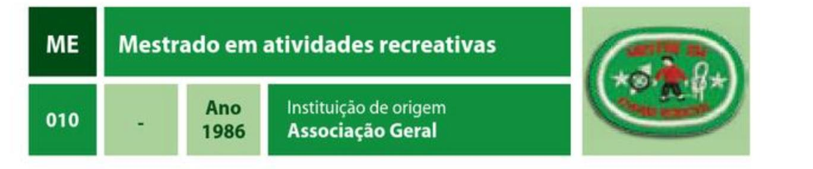

### REQUISITOS

1. Ter sete das seguintes especialidades: Filatelia (AR 011), Filatelia - avançado (AR 012), Numismática (AR 017), Nós e amarras (AR 040), Ordem unida (AR 047), Ordem unida - avançado (AR 048), Acampamento I (AR 050), Pipas (AR 059), Numismática avançado (AR 062), Geocaching (AR 067), Geocaching - avançado (AR 068), Fanfarra (AR 071), Telecartofilia (AR 077), Telecartofilia - avançado (AR 078), Letterboxing (AR 081), Letterboxing – avançado (AR 082), Monociclo (AR 083), Viagem e turismo (AR 086), Viagem e turismo - avançado (AR 087), Carrinho de rolimã (AR 092), Colecionador (AR 093), Futebol de botão (AR 096), Nós e amarras - avançado (AR 099), Ordem unida instrutor (AR 100) e Pião (AR 106).

## Mestrado em saúde

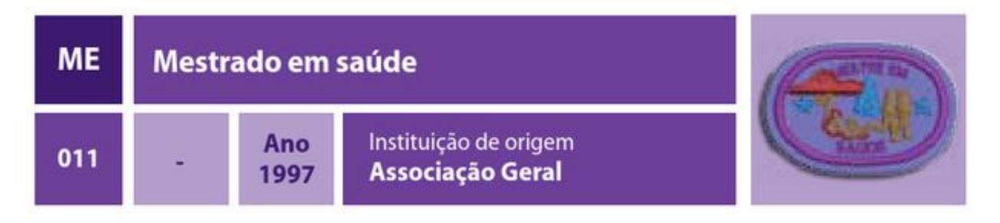

### REQUISITOS

1. Ter sete das seguintes especialidades: Saúde e cura (CS 001), Primeiros socorros - básico (CS 003), Primeiros socorros - intermediário (CS 004), Primeiros socorros avançado (CS 005), Enfermagem básica (CS 006), Nutrição (CS 008), Nutrição – avançado (CS 010), Reanimação cardiopulmonar (CS 011), Resgate básico (CS 012), Digestão (CS 015), Ossos, músculos e articulações (CS 016), Sistema nervoso (CS 017), Sangue e defesas do corpo (CS 018), Hereditariedade (CS 019), Coração e circulação (CS 020), Higiene oral (CS 023), Higiene oral – avançado (CS 024), Prevenção de doenças tropicais (CS 026), Saúde mental (CS 028), Sexualidade humana (CS 029) e Sistema respiratório (CS 030).

## Mestrado em zoologia

| ΜE  | Mestrado em zoologia |                                 |                                                     |     |
| --- | -------------------- | ------------------------------- | --------------------------------------------------- | --- |
| 012 |                      | Ano $\overline{\phantom{0}}$ | Instituição de origem Divisão do Sul do Pacífico |     |

### REQUISITOS

1. Ter sete das seguintes especialidades: Aranhas (EN 001), Aves (EN 003), Aves domésticas (EN 004), Insetos (EN 007), Mariposas e borboletas (EN 008), Mamíferos (EN 010), Répteis (EN 011), Moluscos (EN 014), Aves de estimação (EN 020), Peixes (EN 022), Anfíbios (EN 023), Felinos (EN 024), Rebanhos domésticos (EN 025), Aves - avançado (EN 027), Insetos - avançado (EN 030), Mamíferos - avançado (EN 031), Moluscos - avançado (EN 032), Cães (EN 034), Cetáceos (EN 037), Mamíferos marinhos (EN 051), Pequenos mamíferos de estimação (EN 052), Anfíbios – avançado (EN 054), Felinos – avançado (EN 055), Répteis – avançado (EN 057) Morcegos (EN 059), Morcegos – avançado (EN 060), Marsupiais (EN 061), Vermes (EN 065), Vermes - avançado (EN 066), Aquarismo (EN 068), Animais peçonhentos (EN 069), Animais noturnos (EN 070), Animais nocivos (EN 071), Camelos (EN 076), Crustáceos (EN 078), Equinodermos (EN 080), Fauna marinha (EN 083), Formigas (EN 085), Odonata (EN 087), Poríferos e cnidários (EN 090) e Tubarões (EN 094).

## Mestrado em ecologia

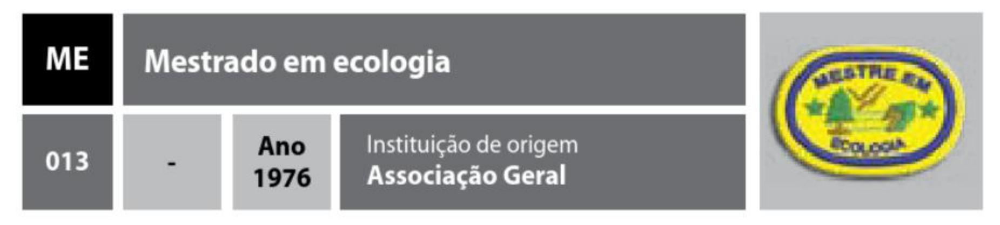

### REQUISITOS

1. Ter as especialidades de Ecologia (EN 044), Conservação ambiental (EN 046), Animais ameaçados de extinção (EN 058) e mais quatro das seguintes: Ecologia avançado (EN 045), Quedas d'água (EN 067), Araras, papagaios e periquitos (EN 073), Energias renováveis (EN 081), Estuário (EN 082), Preservação de recursos hídricos (EN 089), Reciclagem e sustentabilidade (EN 092) e Reciclagem e sustentabilidade avançado (EN 093).

## Mestrado em botânica

| ME  | Mestrado em botânica     |             |                                           |     |
| --- | ------------------------ | ----------- | ----------------------------------------- | --- |
| 014 | $\overline{\phantom{0}}$ | Ano 1976 | Instituição de origem Associação Geral |     |

### REQUISITOS

1. Ter sete das seguintes especialidades: Flores (EN 005), Árvores (EN 006), Cactos (EN 015), Samambaias (EN 018), Arbustos (EN 019), Gramíneas (EN 021), Flores - avançado (EN 029), Árvores – avançado (EN 033), Algas (EN 036), Ervas (EN 038), Eucaliptos (EN 039), Sementes (EN 040), Orquídeas (EN 042), Sementes - avançado (EN 048), Plantas caseiras (EN 049), Cactos - avançado (EN 053), Orquídeas - avançado (EN 062), Palmeiras (EN 063), Arbustos - avançado (EN 072), Briófitas (EN 074), Citologia (EN 077), Fisiologia vegetal (EN 084), Liquens (EN 086) e Plantas carnívoras (EN 088).

## Mestrado em habilidades domésticas

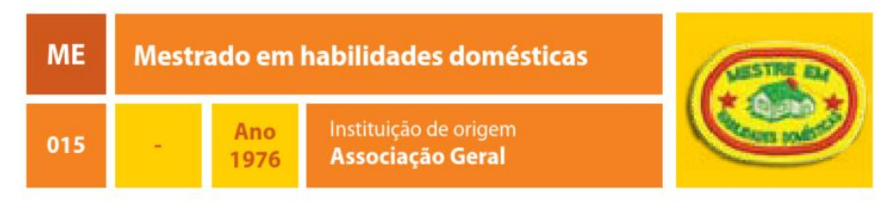

### REQUISITOS

1. Ter sete especialidades em Habilidades domésticas (HD).